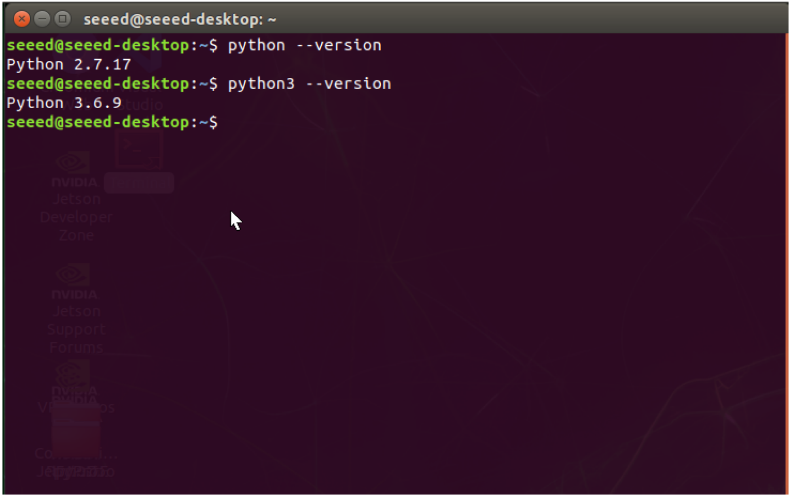

# 第 2 课：Python 开发环境配置与基础语法

## 课程简介

在本课中，我们将学习编程的基本技能，掌握 Python 语言的基础知识，为后续的计算机视觉和深度学习课程奠定坚实的编程基础。本课的目标是帮助你理解 Python 的核心概念，并能够编写简单的程序。  

## 课程目标

+ 理解 Python 的基本特点及其在边缘 AI 中的应用。
+ 掌握在 reComputer 上配置 Python 环境以及熟悉 VS Code 的基本使用。
+ 掌握 Python 的基础数据类型、变量赋值和运算符的使用，学会进行字符串的基本操作。
+ 掌握 AI 辅助编程工具的使用技巧。

---

## 1. Python 简介

### 1.1. 什么是 Python？

Python是一门由Guido van Rossum于1991年创造的高级编程语言。作为一门解释型语言，Python强调代码的可读性，其语法设计允许开发者用更少的代码实现功能。它支持多种编程范式，包括面向对象编程、函数式编程等。


> 图 2.1 Guido Van Rossum 在 2006 年 [O'Reilly 开源大会](https://en.wikipedia.org/wiki/O%27Reilly_Open_Source_Convention) (OSCON) 上
>

**Python 的特点：**

+ **简洁易读**：语法简洁，代码可读性强，适合初学者学习
+ **丰富的标准库和第三方库**：提供了大量现成的库，方便快速开发
+ **跨平台**：代码可以在不同的操作系统上运行，如 Windows、Linux、macOS
+ **广泛应用**：在数据分析、人工智能、Web 开发、自动化运维等领域都有广泛应用

图 2.2 为 Python 的 logo


> 图 2.2 Python logo
>

> **参考文档链接：**
>
> + [Python 官方网站](https://www.python.org/)
> + [Python 简介- Wikipedia](https://zh.wikipedia.org/wiki/Python)
>

### 1.2. Python 在边缘 AI 中的应用

Python 已经成为人工智能和边缘计算领域最受欢迎的编程语言之一。了解 Python 编程基础对于后续开发边缘 AI 应用至关重要。

#### 1.2.1. 为什么边缘 AI 开发选择 Python?

1. **丰富的 AI 框架支持**

    + TensorFlow、PyTorch 等主流深度学习框架都提供 Python 接口
    + OpenCV-Python 用于计算机视觉处理
    + NumPy、Pandas 等科学计算库使数据处理更便捷

2. **适合快速开发**

    + 语法简洁清晰，开发效率高
    + 大量现成的AI模型和示例代码
    + 活跃的开发者社区，容易找到解决方案

3. **边缘设备支持**

    + Jetson 设备原生支持 Python 环境
    + 可以方便地调用 GPU 加速库
    + 适合原型验证和快速部署

#### 1.2.2. Python 在边缘AI项目中的应用场景

##### 数据预处理

在开始编写代码前，需要先安装OpenCV库。

通过以下终端命令安装 OpenCV 库：

```powershell
pip install opencv-python
```

通过下面的代码，可以实现：

1. 实时读取摄像头画面。
2. 将图像缩放到224x224（常用于AI模型输入）。
3. 同时显示原始画面和处理后的画面。
4. 按“q”键可以退出程序。

```python
# 使用OpenCV读取摄像头画面
import cv2

# 打开摄像头 (0表示默认摄像头)
cap = cv2.VideoCapture(0)

# 检查摄像头是否成功打开
if not cap.isOpened():
    print("无法打开摄像头")
    exit()

try:
    while True:
# 读取一帧图像
        ret, frame = cap.read()
        
# 检查是否成功读取
        if not ret:
            print("无法读取图像")
            break
            
# 图像预处理：缩放到224x224大小（常用于AI模型输入）
        processed_frame = cv2.resize(frame, (224, 224))
        
# 显示原始图像和处理后的图像
        cv2.imshow('Original', frame)
        cv2.imshow('Processed (224x224)', processed_frame)
        
# 按'q'键退出
        if cv2.waitKey(1) & 0xFF == ord('q'):
            break

finally:
# 释放资源
    cap.release()
    cv2.destroyAllWindows()
```

运行这段代码，你会看到两个窗口：一个显示原始摄像头画面，另一个显示缩放后的224x224图像。这种预处理在实际的AI应用中非常常见，因为大多数AI模型都需要固定尺寸的输入。


> 图 2.3 OpenCV 应用图
>

##### 模型推理

本示例只展示部分程序。

```python
# 使用TensorRT进行推理加速
import tensorrt as trt
engine = trt.Runtime(logger).deserialize_cuda_engine(engine_path)
outputs = engine.inference(processed_frame)
```

##### 结果处理和显示

本示例只展示部分程序。

```python
# 处理推理结果并可视化
def visualize_results(frame, detections):
    for det in detections:
# 绘制检测框和标签
        cv2.rectangle(frame, (det.x1, det.y1), (det.x2, det.y2), (0,255,0), 2)
```

#### 1.2.3. Python 在 Jetson 平台的优势

1. **硬件加速支持**

    + 通过 Python 可以轻松调用 CUDA 加速库
    + JetPack SDK 提供优化的 Python 包
    + 支持 GPU 加速的深度学习推理

2. **系统集成便利**

    + 可以方便地调用系统硬件(如摄像头、GPIO 等)
    + 支持多线程和并行处理
    + 便于与其他系统服务集成

3. **开发工具链完整**

    + VS Code 等 IDE 支持完善
    + 调试和性能分析工具丰富
    + 支持远程开发和调试

通过学习 Python 基础，你将能够:

+ 理解和修改AI模型的示例代码
+ 开发自己的边缘AI应用程序
+ 处理实际项目中的数据和结果
+ 为后续深入学习边缘AI打下基础

> 📌 **注意**：虽然 Python 在开发效率上有优势，但在某些性能关键的场景下，可能需要结合 C++ 等语言来优化程序性能。Python 更适合用于原型开发和验证阶段。
>

---

## 2. Python 开发环境搭建

### 2.1. 在 reComputer 上安装 Python

reComputer  已经预装了 Python，我们可以直接在终端中使用 Python。通常，系统中会同时安装 Python 2 和 Python 3。

查看系统中的 Python 版本**：**

```bash
python --version    # 查看 Python 2 的版本
python3 --version   # 查看 Python 3 的版本
```

图 2.4 为终端查看 Python 版本的实例图：



> 图 2.4 终端查看 Python 版本示例图
>

### 2.2. 使用 IDE 或代码编辑器

在 reComputer 上，我们可以使用文本编辑器或集成开发环境（IDE）来编写 Python 代码。

推荐的代码编辑器：

图 2.5 为 Visual Studio Code 的首页。


图 2.5 Visual Studio Code 首页图

### 2.3. **Visual Studio Code 简介**

#### 2.3.1. 什么是 Visual Studio Code?

Visual Studio Code（简称 VS Code）是一款免费、开源的代码编辑器，支持多种编程语言，具有强大的扩展功能。

VS Code 的主要特点：

+ 语法高亮和智能提示：提高编码效率
+ 内置终端：方便运行命令和调试代码
+ 丰富的扩展插件：可根据需要安装各种功能的插件
+ Git 集成：方便进行版本控制

#### 2.3.2. VS Code 界面介绍

VS Code 的界面非常简洁，这里仅介绍与 Python 编程相关的常用部分：

+ **文件资源管理器（Explorer）**：在左侧面板中，帮助浏览和管理项目文件。
+ **终端（Terminal）**：内置命令行工具，方便直接运行 Python 程序。
+ **扩展（Extensions）**：可以安装 Python 插件，如 `Python`、`Jupyter`，以增强开发体验。

图 2.6 为 Visual Studio Code 界面：


> 图 2.6 Visual Studio Code 界面图
>

⚠️**注意：如图 2.7 所示，如果在 VS Code 右下角弹出更新通知（如下图），请选择 Later，否则可能会出现版本兼容的问题。**


> 图 2.7 VS Code 更新通知弹窗图
>

#### 2.3.3. 如何将 VS Code 界面切换为中文（可选）

如果你更习惯使用中文界面，可以将 **Visual Studio Code** 的界面语言设置为中文。以下是在 reComputer 上进行语言切换的步骤：

1. **安装中文语言包**

    + 打开 **VS Code**，点击左侧 **扩展（Extensions）** 图标。
    + 在搜索框中输入 `Chinese (Simplified) Language Pack for Visual Studio Code`。
    + 找到 **Microsoft 提供的中文语言包**，点击 **Install** 进行安装。

    

    > 图 2.8 中文语言包安装图
    >

2. **更改界面语言**

    + 安装完成后，点击右下角的 **Change Language and Restart**。

    

    > 图 2.9 更改界面语言操作图
    >

3. **验证设置**

    + 重启 VS Code 后，界面应切换为中文。

    

    > 图 2.10 VS Code 中文界面图
    >

4. **如果想将 VS Code 切换回英文界面可进行如下操作：**

    + **打开命令面板**：按 `Ctrl + Shift + P`打开命令面板。
    + **输入并选择命令**：在命令面板中输入 `Configure Display Language`，然后按回车（Enter）。
    + **选择英文语言**：在弹出的语言选项中选择 `English`，这样将语言切换回英文。
    + **重启 VS Code**：点击 `重启（Restart）` 按钮，或者手动关闭并重新打开 VS Code。

    

    > 图 2.11 切换英文界面操作图
    >

#### 2.3.4. 如何在 Visual Studio Code 中建立和运行 Python 文件

**步骤 1：安装 Python 插件**

+ 打开 VS Code，点击左侧 **扩展** 图标。
+ 在搜索框中输入 `Python`，选择 **Microsoft 提供的 Python 插件**，安装插件。
+ 安装完成后，VS Code 将自动检测 Python 环境，并提供语法高亮、调试支持等功能。


> 图 2.12 安装 Python 插件操作图
>

**步骤 2：创建 Python 文件**

+ 打开 **文件资源管理器（Explorer）**，点击**打开文件夹（Open Folder）**，然后选择一个文件来存放你的项目，最后点击 **Open**。


> 图 2.13 选择 Python 工作路径步骤图
>

+ 点击 `新建文件`，输入文件名（如 `hello.py`），文件扩展名为 `.py`。


> 图 2.14 创建 Python 文件操作图
>

**步骤 3：编写 Python 代码**

在刚创建的 `hello.py` 文件中输入以下代码：

```python
print("Hello, world!")
```


> 图 2.15 编写 Python 代码示意图
>

**步骤 4：编译和运行 Python 程序**

+ 点击右上角的 **Run Python File**。


> 图 2.16 使用图形界面运行 Python 程序示意图
>

+ 或者直接在下方 **终端（Terminal）** 中输入以下命令：

```plain
python hello.py
```


> 图 2.17 使用终端运行 Python 程序示意图
>

+ 如果正确配置环境，终端会输出：

```plain
Hello, Python!
```

> **参考文档链接：**
>
> + [VisualStudioCode 官方网站](https://code.visualstudio.com/)
>

---

## 3. Python 基础语法

### 3.1. 注释

**注释**是对代码的解释和说明，编译器在执行程序时会忽略注释。良好的注释可以提高代码的可读性和可维护性。  

+ **单行注释**：以 `#` 开头的内容

```python
# 这是一个单行注释
```

+ **多行注释**：使用三个引号包裹

```python
"""
这是一个多行注释
可以写多行内容
"""
```

### 3.2. 变量和数据类型

#### 3.2.1. 变量

+ **变量**： 是存储数据的容器，用于保存程序运行过程中需要处理的数据。  
+ **变量命名规则**：
  + 由字母、数字、下划线组成，不能以数字开头
  + 区分大小写，例如 `age` 和 `Age` 是两个不同的变量。  
  + 不可使用关键字（如 `if`、`for`、`while` 等）

**示例：**

```python
# 变量赋值示例
fps = 30                     # 视频帧率(整数)
accuracy = 0.956            # 模型准确率(浮点数)
model_name = "YOLOv5"       # 模型名称(字符串)
is_gpu_enabled = True       # GPU是否可用(布尔值)
```

#### 3.2.2. 数据类型

 Python 中的常见数据类型包括：  

+ **整数（int）：**表示没有小数部分的数字。****
  + 可以表示正整数、负整数和零。
  + 没有长度限制，只受内存大小限制。

```python
fps = 30                     # 视频帧率(整数)
```

+ **浮点数（float）：**表示带有小数点的数值类型。例如，`3.14`、`-0.001`、`2.0` 都是浮点数。浮点数用于表示连续的数值，适用于需要精确到小数点的计算。
  + 表示带有小数部分的数值。
  + 在计算机内部是以二进制方式表示，可能会有精度损失。

```python
pi = 3.1415926
accuracy = 0.956            # 模型准确率(浮点数)
```

+ 字符串（str）：表示文本数据，由一对单引号或双引号包裹。  
  + 可以包含字母、数字、符号、空格等字符。
  + 支持各种字符串操作，如连接、截取、查找等。

```python
model_name = "YOLOv5"       # 模型名称(字符串)
```

+ **布尔值（bool）：**表示真或假，只有两个取值 `True` 和 `False`。****
  + 常用于条件判断、逻辑运算。

```python
# Jetson 设备状态示例
is_gpu_enabled = True       # GPU是否可用
is_fan_running = False      # 散热风扇是否运行
is_power_normal = True      # 供电是否正常
is_network_connected = False # 网络是否连接
```

### 3.3. 输入和输出

#### 3.3.1. 基本输出

+ `print()` 函数用于将信息输出到控制台。在边缘AI开发中,我们经常需要输出程序状态、调试信息等。

```python
# 程序启动信息
print("=== 目标检测系统启动 ===")
model_version = "YOLOv5s"
print("当前加载模型:", model_version)
is_gpu_enabled = True
print("GPU状态:", "可用" if is_gpu_enabled else "不可用")
```

#### 3.3.2. 基本输入

+ `input()` 函数用于从控制台获取用户输入。例如获取模型参数、设备配置等：

```python
# 获取设备配置
camera_id = input("请输入摄像头编号(0-3): ")
print("已选择摄像头:", camera_id)
```

> ⚠️**注意：**`input()` 函数接收的输入默认为字符串类型，如果需要其他类型，需要进行类型转换。
>

#### 3.3.3. 类型转换示例

在实际应用中，很多参数需要以特定类型输入:

##### 方式 1：分步转换

```python
# 设置模型参数
resolution = input("请输入检测分辨率(例如:640): ")
confidence = input("请输入置信度阈值(0-1): ")

# 转换为对应类型

resolution = int(resolution)    # 转换为整数
confidence = float(confidence)  # 转换为浮点数

print("检测分辨率设置为:", resolution, "x", resolution)
print("置信度阈值设置为:", confidence)

```

##### 方式 2：直接转换

```python
# 设置视频参数
fps = int(input("请输入视频帧率(15-60): "))
bitrate = float(input("请输入视频码率(Mbps): "))

print("视频参数配置:")
print(f"帧率: {fps} FPS")
print(f"码率: {bitrate} Mbps")
```

##### 实用示例：设备配置工具

结合输入输出和类型转换的完整示例:

```python
print("=== Jetson 设备配置工具 ===")

# 性能模式选择
power_mode = input("请选择性能模式(0:省电, 1:均衡, 2:高性能): ")
power_mode = int(power_mode)

# 风扇控制
fan_speed = float(input("请设置风扇转速百分比(0-100): "))

# 显示设置
display_res = input("请输入显示分辨率(例如 1920x1080): ")

# 输出配置确认
print("\n=== 配置确认 ===")
print(f"性能模式: {['省电','均衡','高性能'][power_mode]}")
print(f"风扇转速: {fan_speed}%")
print(f"显示分辨率: {display_res}")
```

### 3.4. 运算符和表达式

#### 3.4.1. 算术运算符

在边缘AI开发中，我们经常需要进行图像处理、数据计算等操作，以下是常用的算术运算符。

##### 加法运算符 `+`

```python
# 图像亮度调整
base_brightness = 128
adjustment = 30
new_brightness = base_brightness + adjustment  # 结果为 158
```

##### 减法运算符 `-`

```python
# 计算FPS下降
original_fps = 60
fps_drop = 12
current_fps = original_fps - fps_drop  # 结果为 48
```

##### 乘法运算符 `*`

```python
# 计算图像总像素
width = 1920
height = 1080
total_pixels = width * height  # 结果为 2,073,600
```

##### 除法运算符 `/`

```python
# 计算模型准确率
correct_detections = 856
total_samples = 1000
accuracy = correct_detections / total_samples  # 结果为 0.856
```

##### 整除运算符 `//`

```python
# 图像降采样（将分辨率减半）
original_width = 1920
scale_factor = 2
new_width = original_width // scale_factor  # 结果为 960
```

##### 取余运算符 `%`

```python
# 计算内存使用情况（MB）
total_memory = 4096  # 4GB
block_size = 1024    # 1GB
remaining = total_memory % block_size  # 结果为 0
```

##### 幂运算符 `**`

```python
# 图像缩放倍数
base_scale = 2
levels = 3
final_scale = base_scale ** levels  # 结果为 8
```

##### 实际应用示例

```python
# 图像处理计算示例
print("=== 图像处理参数计算 ===")

# 1. 计算图像缩放后的尺寸

original_width = 3840
original_height = 2160
scale_factor = 2

new_width = original_width // scale_factor
new_height = original_height // scale_factor

print(f"原始分辨率: {original_width}x{original_height}")
print(f"缩放后分辨率: {new_width}x{new_height}")

# 2. 计算处理性能

processing_time = 0.045  # 45毫秒
fps = 1 / processing_time
print(f"处理帧率: {fps:.1f} FPS")

# 3. 计算内存需求

bytes_per_pixel = 3  # RGB格式
total_pixels = new_width *new_height
memory_needed = total_pixels* bytes_per_pixel / (1024 * 1024)  # 转换为MB
print(f"预计内存需求: {memory_needed:.1f} MB")

```

> ⚠️**注意事项：**
>
> + 除法运算符 `/` 总是返回浮点数结果
> + 需要整数结果时使用整除运算符 `//`
> + 在处理图像尺寸时，通常使用整除以避免出现小数像素
>

#### 3.4.2. 赋值运算符

在边缘AI开发中，我们经常需要更新各种参数和计数器。

##### 简单赋值 `=`

```python
# 初始化设备参数
frame_rate = 30           # 设置帧率
model_threshold = 0.75    # 设置模型阈值
is_recording = False      # 设置录制状态
```

##### 复合赋值运算符

###### 加法赋值 `+=`

```python
# 统计检测到的目标数量
detected_persons = 0
detected_cars = 0

# 模拟检测过程

detected_persons += 1  # 检测到一个人
detected_cars += 2    # 检测到两辆车

print(f"当前检测到: {detected_persons}人, {detected_cars}辆车")

```

###### 减法赋值 `-=`

```python
# 内存管理示例
available_memory = 4096  # MB
video_buffer = 512      # MB

# 分配内存
available_memory -= video_buffer
print(f"剩余可用内存: {available_memory} MB")
```

###### 乘法赋值 `*=`

```python
# 调整图像亮度
brightness_factor = 1.0
# 增加50%亮度
brightness_factor *= 1.5
print(f"亮度调整系数: {brightness_factor}")
```

###### 除法赋值 `/=`

```python
# 自适应学习率调整
learning_rate = 0.01
# 每轮降低学习率
learning_rate /= 2
print(f"新的学习率: {learning_rate}")
```

#### 3.4.3. 比较运算符

在AI应用中，我们需要进行大量的条件判断，比如检查模型性能、硬件状态等。

```python
# 模型性能检测示例
current_fps = 25
target_fps = 30
min_fps = 15
max_temperature = 80
current_temperature = 75

# 性能检查
print("=== 系统状态检查 ===")

# 等于比较 ==
print(f"达到目标帧率: {current_fps == target_fps}")  # False

# 不等于比较 !=
print(f"帧率异常: {current_fps != target_fps}")  # True

# 大于比较 >
print(f"帧率正常: {current_fps > min_fps}")  # True

# 小于比较
print(f"温度安全: {current_temperature < max_temperature}")  # True

# 大于等于比较 >=
minimum_accuracy = 0.90
current_accuracy = 0.92
print(f"准确率达标: {current_accuracy >= minimum_accuracy}")  # True

# 小于等于比较 <=
gpu_memory_limit = 2048  # MB
current_gpu_usage = 1536 # MB
print(f"GPU内存正常: {current_gpu_usage <= gpu_memory_limit}")  # True
```

##### 实际应用示例

```python
def check_system_status():
    """检查系统运行状态"""
    print("=== 系统状态监控 ===")

# 系统参数
    fps = 28
    temperature = 72
    memory_usage = 1800
    accuracy = 0.88

# 阈值设置
    MIN_FPS = 25
    MAX_TEMP = 85
    MAX_MEMORY = 2048
    MIN_ACCURACY = 0.85

# 状态检查
    status = {
        "性能正常": fps >= MIN_FPS,
        "温度正常": temperature <= MAX_TEMP,
        "内存正常": memory_usage <= MAX_MEMORY,
        "准确率达标": accuracy >= MIN_ACCURACY
    }

# 输出状态报告
    for item, is_normal in status.items():
        print(f"{item}: {'✓' if is_normal else '✗'}")

# 返回系统是否正常
    return all(status.values())

# 运行状态检查

system_ok = check_system_status()
print(f"\n系统整体状态: {'正常' if system_ok else '异常'}")

```

### 3.5. 字符串操作

在边缘AI开发中，我们经常需要处理模型信息、日志输出、配置文件等文本数据。以下是常用的字符串操作示例。

#### 3.5.1. 字符串连接

使用 `+` 运算符连接字符串：

```python
# 构建模型信息
model_name = "YOLOv5"
model_size = "s"
device = "GPU"

model_info = model_name + model_size + " on " + device
print(model_info)  # 输出 "YOLOv5s on GPU"

# 构建文件路径
base_path = "/home/jetson/models/"
model_file = "best.pt"
full_path = base_path + model_file
print(f"模型路径: {full_path}")
```

#### 3.5.2. 字符串重复

使用 `*` 运算符重复字符串:

```python
# 创建进度条
progress = "="
bar_length = 20
progress_bar = progress * bar_length
print("[" + progress_bar + "]")  # 输出 "[====================]"

# 创建分隔线
separator = "-" * 50
print(separator)  # 输出 50个连字符的分隔线
```

#### 3.5.3. 获取字符串长度

使用 `len()` 函数获取字符串长度:

```python
# 检查模型配置参数
config_string = "YOLOv5s-640x640-batch32"
print(f"配置字符串长度: {len(config_string)}")

# 验证序列号格式
device_id = "JETSON-NANO-2GB-01"
expected_length = 18
is_valid = len(device_id) == expected_length
print(f"设备ID格式正确: {is_valid}")
```

#### 3.5.4. 字符串索引和切片

##### 索引操作

```python
# 解析时间戳
timestamp = "20240215-143022"  # 格式: YYYYMMDD-HHMMSS
year = timestamp[0:4]
month = timestamp[4:6]
day = timestamp[6:8]
time = timestamp[9:]

print(f"日期: {year}年{month}月{day}日")
print(f"时间: {time}")

```

##### 切片操作

```python
# 提取版本号信息
version_string = "YOLOv5s-v6.2.7"
model_type = version_string[0:7]    # 获取模型类型
version = version_string[-5:]       # 获取版本号

print(f"模型类型: {model_type}")
print(f"版本号: {version}")
```

#### 3.5.5. 字符串格式化

在AI应用中，我们需要格式化各种输出信息，如训练日志、检测结果等。

##### 1. % 运算符格式化

```python
# 训练进度信息
epoch = 100
loss = 0.0342
accuracy = 0.9856

print("Epoch %d: loss=%.4f, accuracy=%.2f%%" % (epoch, loss, accuracy * 100))

```

##### 2. format() 方法格式化

```python
# 检测结果信息
class_name = "person"
confidence = 0.956
bbox = (125, 220, 380, 480)

print("检测到 {} (置信度: {:.1%})".format(class_name, confidence))
print("边界框坐标: ({}, {}, {}, {})".format(*bbox))
```

##### 3. f-string格式化 (推荐)

```python
# 系统状态报告
gpu_temp = 65.5
memory_used = 1.8
cpu_load = 0.75

print(f"""
系统状态报告:
{'='*20}
GPU温度: {gpu_temp:>5.1f}°C
内存使用: {memory_used:>5.1f}GB
CPU负载: {cpu_load:>5.1%}
{'='*20}
""")

```

> 在 Python 中，单引号 `'` 和双引号 `"` 都用于定义字符串，功能相同；而三重引号 `"""` 用于定义多行字符串，能保留格式和换行。在 f-string 格式化中，使用大括号 `{}` 插入变量，并可以控制显示格式（如对齐、位数、小数点位数等）。  
>

##### 实际应用示例

```python
def format_detection_log(frame_id, detections, fps):
    """格式化目标检测日志输出"""
# 创建时间戳
    timestamp = "2024-02-15 14:30:22"
    
# 构建日志头
    header = f"{'='*50}\n"
    header += f"Frame #{frame_id} @ {fps:.1f}FPS\n"
    header += f"Timestamp: {timestamp}\n"
    header += f"{'-'*50}\n"
    
# 构建检测结果
    results = []
    for i, det in enumerate(detections, 1):
        obj_type = det['type']
        conf = det['confidence']
        box = det['bbox']
        
# 使用不同的格式化方法构建结果字符串
        result = "检测 #{:02d}: {:>10} ".format(i, obj_type)
        result += f"(置信度: {conf:>6.1%}) "
        result += f"at [x:{box[0]:>4}, y:{box[1]:>4}, w:{box[2]:>4}, h:{box[3]:>4}]"
        results.append(result)
    
# 组合最终日志
    log = header + "\n".join(results) + f"\n{'='*50}"
    return log

# 测试示例
detections = [
    {'type': 'person', 'confidence': 0.92, 'bbox': (100, 200, 50, 120)},
    {'type': 'car', 'confidence': 0.88, 'bbox': (300, 150, 200, 150)}
]
print(format_detection_log(1234, detections, 25.6))
```

#### 3.5.6. 选择合适的格式化方法

+ 对于简单字符串：使用 `+` 连接或 f-string
+ 对于复杂格式：使用 f-string 或 `format()`
+ 需要兼容性时：使用 `%` 运算符
+ 处理大量数据时：优先使用 f-string (性能最好)

> **参考文档链接：**
>
> + [Python 官方教程（中文版）](https://docs.python.org/zh-cn/3/tutorial/introduction.html)
> + [新手教程 - Python3 教程](https://www.runoob.com/python/python-basic-syntax.html)
>

---

## 4. 实践练习

### 4.1. 练习1：GPU性能计算器

**任务描述：**  
在边缘AI开发中，我们常需要计算GPU的性能指标。编写一个程序，计算GPU的计算能力和效率。

**提示：**

+ 使用 `input()` 获取用户输入
+ 注意单位换算
+ 使用条件语句处理异常情况

```python
# GPU性能计算器
print("=== GPU性能计算器 ===")

# 获取输入数据
core_count = int(input("请输入CUDA核心数量: "))
clock_speed = float(input("请输入时钟频率(MHz): "))

# 计算理论性能
theoretical_flops = core_count * clock_speed * 2  # 每个周期2次浮点运算
theoretical_gflops = theoretical_flops / 1000     # 转换为GFLOPS

# 获取实际性能测试数据
actual_gflops = float(input("请输入实测性能(GFLOPS): "))

# 计算效率
if theoretical_gflops > 0:
    efficiency = (actual_gflops / theoretical_gflops) * 100
else:
    efficiency = 0

# 格式化输出结果
print("\n=== 性能分析结果 ===")
print(f"理论性能: {theoretical_gflops:.2f} GFLOPS")
print(f"实际性能: {actual_gflops:.2f} GFLOPS")
print(f"运行效率: {efficiency:.1f}%")

# 性能评估
if efficiency >= 80:
    print("性能状态: 优秀")
elif efficiency >= 60:
    print("性能状态: 良好")
else:
    print("性能状态: 需要优化")
```

**运行结果示例：**

```plain
=== GPU性能计算器 ===
请输入CUDA核心数量: 128
请输入时钟频率(MHz): 1500
请输入实测性能(GFLOPS): 300

=== 性能分析结果 ===
理论性能: 384.00 GFLOPS
实际性能: 300.00 GFLOPS
运行效率: 78.1%
性能状态: 良好
```

### 4.2. 练习2：AI模型推理时间分析器

**任务描述：**  
开发一个工具来分析AI模型的推理时间和吞吐量。这对于优化边缘设备上的模型性能很重要。

**提示：**

+ 使用浮点数处理时间数据
+ 计算平均值和每秒处理能力
+ 注意时间单位的换算

```python
# AI模型推理时间分析器
print("=== AI模型推理时间分析器 ===")

# 获取模型信息
model_name = input("请输入模型名称: ")
batch_size = int(input("请输入批处理大小: "))
inference_time = float(input("请输入单批次推理时间(ms): "))

# 计算性能指标
seconds = inference_time / 1000  # 转换为秒
fps = batch_size / seconds      # 计算每秒帧数
latency = inference_time / batch_size  # 计算单样本延迟

# 计算资源估算
memory_per_batch = float(input("请输入每批次内存占用(MB): "))
memory_per_sample = memory_per_batch / batch_size

# 输出分析结果
print("\n=== 性能分析报告 ===")
print(f"模型名称: {model_name}")
print(f"批处理大小: {batch_size}")
print("\n--- 时间性能 ---")
print(f"批处理耗时: {inference_time:.2f} ms")
print(f"单样本延迟: {latency:.2f} ms")
print(f"推理吞吐量: {fps:.1f} FPS")
print("\n--- 资源使用 ---")
print(f"批次内存占用: {memory_per_batch:.1f} MB")
print(f"单样本内存: {memory_per_sample:.1f} MB")

# 性能评估
print("\n--- 性能评估 ---")
if fps >= 30:
    print("实时性能: 达标 ✓")
else:
    print("实时性能: 不达标 ✗")

if latency <= 33.33:  # 30FPS的延迟要求
    print("延迟水平: 良好 ✓")
else:
    print("延迟水平: 需优化 ✗")
```

**运行结果示例：**

```plain
=== AI模型推理时间分析器 ===
请输入模型名称: YOLOv5s
请输入批处理大小: 4
请输入单批次推理时间(ms): 66.7
请输入每批次内存占用(MB): 1024

=== 性能分析报告 ===
模型名称: YOLOv5s
批处理大小: 4

--- 时间性能 ---
批处理耗时: 66.70 ms
单样本延迟: 16.67 ms
推理吞吐量: 60.0 FPS

--- 资源使用 ---
批次内存占用: 1024.0 MB
单样本内存: 256.0 MB

--- 性能评估 ---
实时性能: 达标 ✓
延迟水平: 良好 ✓
```

## 5. 学会用 AI 辅助编程

在学习编程的过程中，我们可以借助 AI 助手来提高学习效率。以下介绍几个常用的 AI 编程助手及其使用方法。

### 5.1. 常见的 AI 编程助手

+ **文心一言**：百度开发的 AI 助手，支持中文编程对话
+ **通义千问**：阿里开发的 AI 助手，提供编程指导和代码解释
+ **Kimi**：Moonshot AI 开发的 AI 助手，专注提供精准的编程帮助
+ 可以探索和尝试的其他大语言模型

### 5.2. 如何有效使用 AI 助手

1. **提问技巧**
    + 描述具体的编程场景和需求
    + 说明使用的编程语言和版本
    + 提供相关的错误信息或代码片段
2. **示例提问格式**

```plain
我想用Python编写一个程序，需求是：
1. [具体功能描述]
2. 使用的Python版本是3.6
3. 需要考虑 [特定条件]
能否帮我实现？
```

### 5.3. 实际应用示例

假设我们想编写一个检测摄像头是否工作正常的程序，可以这样询问：

**用户提问：**

```plain
我想用Python编写一个程序检测摄像头是否正常工作：
1. 使用OpenCV库读取摄像头
2. 如果成功读取显示"摄像头正常"
3. 如果失败显示"摄像头异常"
请提供代码示例
```

**AI助手回答：**

```python
import cv2

def check_camera():
    try:
# 尝试打开摄像头
        cap = cv2.VideoCapture(0)
        
        if cap.isOpened():
# 读取一帧图像
            ret, frame = cap.read()
            if ret:
                print("摄像头正常")
                print("分辨率:", frame.shape[1], "x", frame.shape[0])
            else:
                print("摄像头异常：无法读取图像")
        else:
            print("摄像头异常：无法打开设备")
            
# 释放摄像头
        cap.release()
        
    except Exception as e:
        print("摄像头异常：", str(e))

if __name__ == "__main__":
    check_camera()
```

### 5.4. 使用建议

1. **循序渐进**
    + 先尝试自己解决问题
    + 遇到困难时再寻求AI帮助
    + 理解 AI 提供的代码而不是简单复制
2. **验证与改进**
    + 测试 AI 提供的代码
    + 理解代码的工作原理
    + 根据实际需求进行修改
3. **学习积累**
    + 记录常用的代码模式
    + 总结编程经验
    + 建立自己的代码库

> 📌 **注意**：AI 助手只是编程学习的辅助工具，重要的是理解代码原理和提升实际编程能力。建议将AI作为“导师”而不是“写作工具”。
>

通过合理使用 AI 助手，我们可以：

+ 快速了解不理解的名词和概念
+ 更快地解决编程问题
+ 学习更多编程技巧
+ 提高代码质量
+ 加速学习进度

---

## 6. 总结

在本课中，我们学习了 Python 编程的基础知识，了解了其在边缘 AI 开发中的重要性。掌握了变量、数据类型、运算符、表达式和字符串操作等核心概念，并在 reComputer 上配置了 Python 开发环境，使用 Visual Studio Code 编写和运行 Python 程序。通过实践练习，我们编写了 GPU 性能计算器和 AI 模型推理时间分析器，巩固了所学知识，为后续的计算机视觉和深度学习课程奠定了坚实的编程基础。  

## 7. 课后拓展

+ **阅读材料**
  + [Python 官方教程（中文版）](https://docs.python.org/zh-cn/3/tutorial/introduction.html)
  + [新手教程 - Python3 教程](https://www.runoob.com/python/python-basic-syntax.html)

+ **实践练习**

    1. **编写一个程序，模拟边缘设备的温度监控功能。程序应当：**
        + 输入当前设备的摄氏温度。
        + 判断温度是否超过安全运行阈值（例如 70°C）。
            + 如果超过，输出警告信息：“警告：设备温度过高！”。
            + 如果未超过，输出信息：“设备温度正常。”。
        + 将摄氏温度转换为华氏温度并输出。

        转换公式：$ F = C \times \frac{9}{5} + 32 $

    2. **在视频处理和计算机视觉中，不同的帧可能需要不同的处理策略。编写一个程序，输入当前帧的编号，判断它是关键帧（奇数编号）还是普通帧（偶数编号），并输出相应的信息。**

        **提示：**

        + 使用取余运算符 `%`
        + 使用条件语句输出不同的信息。

        <br>

    参考答案：[02-Python 开发环境配置与基础语法课后题参考答案](https://github.com/Seeed-Studio/Seeed_Studio_Courses/blob/Edge-AI-101-with-Nvidia-Jetson-Course/docs/cn/1/02/Homework_Answer.md)
