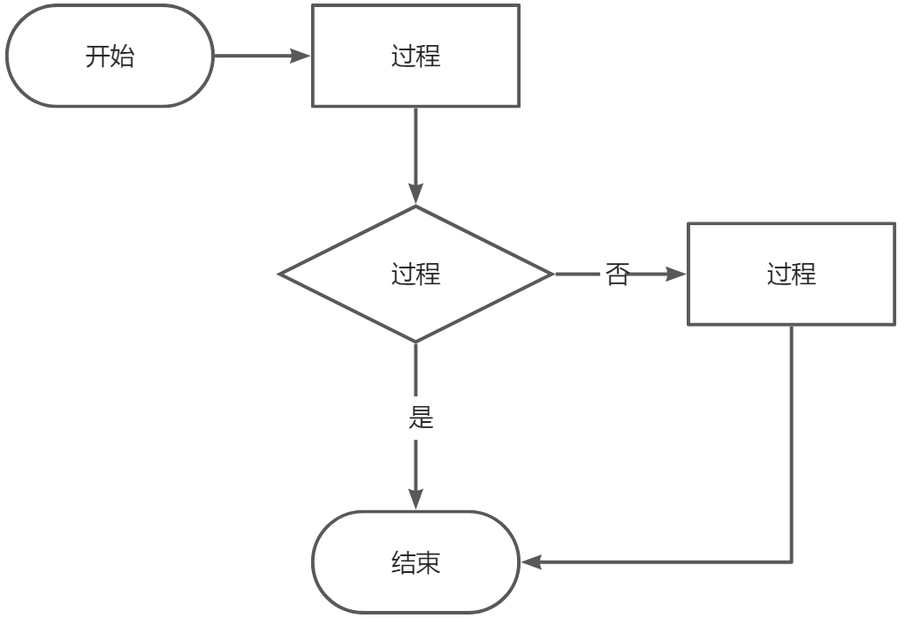
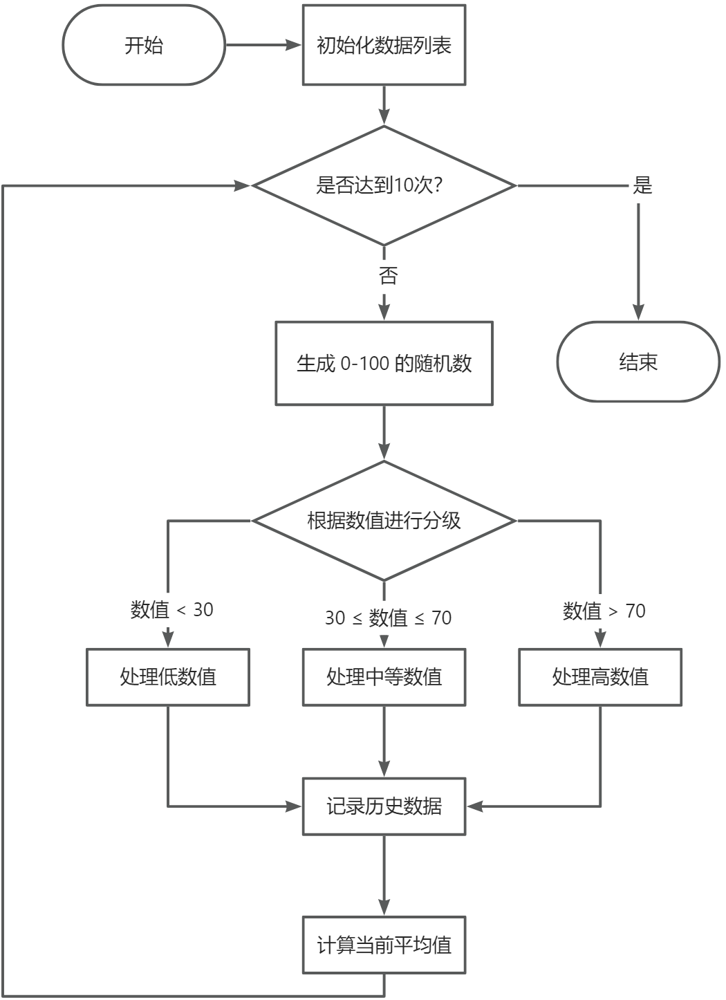
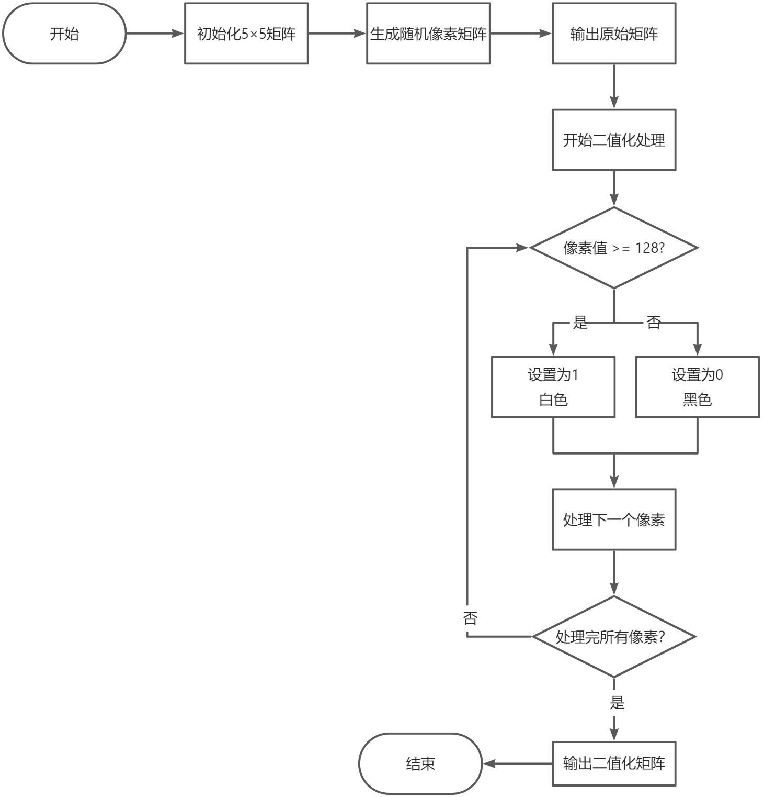
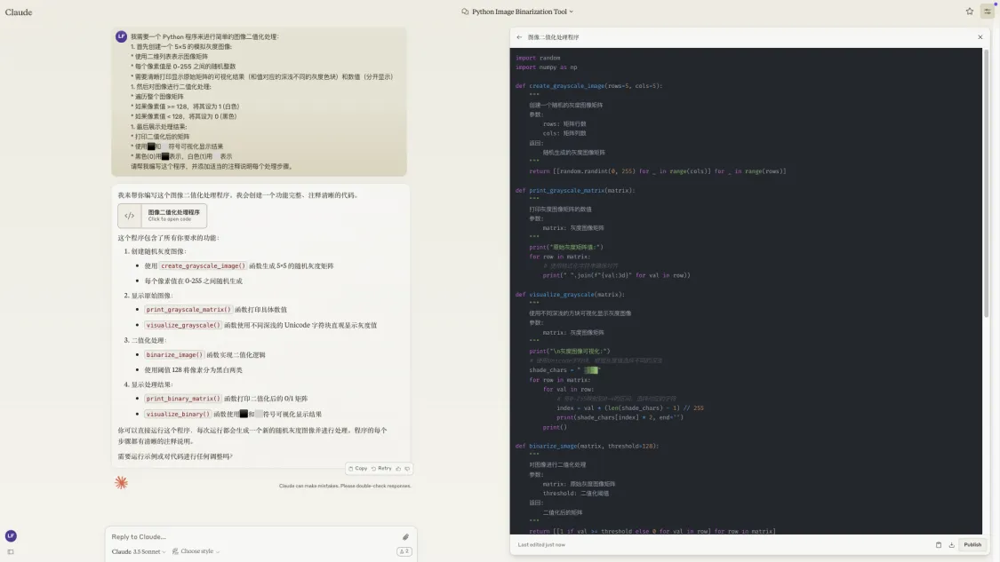
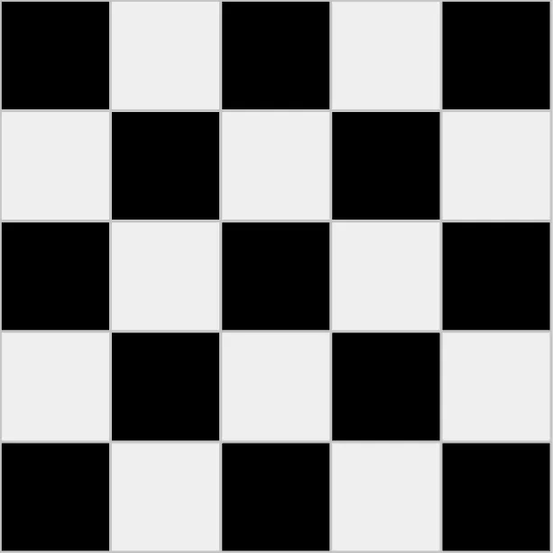

# 第 3 课：Python 条件与循环语句

## 课程简介

在本课中，我们将深入学习 Python 的控制流程结构，包括条件语句和循环语句。掌握这些结构将使我们能够根据不同的条件执行不同的代码块，处理重复性任务，编写更复杂和功能更强大的程序。  

## 课程目标

+ 理解条件语句（if、elif、else）的用法，能够根据条件执行不同的代码块
+ 掌握循环结构（for、while），能够使用循环处理重复性任务
+ 结合边缘 AI 实际案例，编写含有控制流程的程序
+ 使用循环嵌套处理二维数据，掌握基本的图像处理概念

---

## 1. 条件语句

### 1.1. 什么是条件语句？

**条件语句**是一种编程结构，它允许程序根据特定条件的真假来决定执行哪个代码块。这使得程序能够具有决策能力，处理不同的情况。

在边缘 AI 和计算机视觉中，条件语句可以用于根据传感器数据、模型输出等执行不同的操作。例如，根据传感器读取的光线强度，调整摄像头的曝光设置；根据模型预测的结果，执行相应的动作。  

### 1.2. if 语句的基本用法

**语法：**

```python
if 条件表达式:
    代码块
```

**说明：**

+ **条件表达式**：一个结果为布尔值（True 或 False）的表达式。
+ **代码块**：在条件为 True 时执行的代码，注意缩进（通常为 4 个空格）。

**示例：设备温度监控**

```python
temperature = 75  # 假设读取的设备温度为75°C

if temperature > 70:
    print("警告：温度过高")
    print("正在启动散热风扇...")
```

### 1.3. if...else 语句

当需要在条件为 False 时执行另一段代码，可以使用 **if...else** 语句。

**语法：**

```python
if 条件表达式:
    代码块1
else:
    代码块2
```

**示例： AI 模型置信度检查**

```python
confidence = 0.85  # 模型预测置信度

if confidence > 0.8:
    print(f"预测结果可信（置信度：{confidence:.2f}）")
    print("执行后续处理...")
else:
    print(f"预测结果不可信（置信度：{confidence:.2f}）")
    print("需要重新采集数据")
```

### 1.4. if...elif...else 语句

当有多个条件需要判断时，可以使用 **elif**（即 "else if"）结构。

**语法：**

```python
if 条件表达式1:
    代码块1
elif 条件表达式2:
    代码块2
elif 条件表达式3:
    代码块3
else:
    代码块4
```

**示例：网络信号强度评估**

```python
gpu_usage = 85  # GPU 使用率百分比

if gpu_usage >= 90:
    print("GPU 负载严重")
    print("执行任务降级...")
elif gpu_usage >= 70:
    print("GPU 负载较高")
    print("监控中...")
elif gpu_usage >= 50:
    print("GPU 负载正常")
else:
    print("GPU 负载较低")
    print("可以增加任务...")
```

**参考文档链接：**

+ [Python 官方教程（中文版）](https://docs.python.org/zh-cn/3/tutorial/controlflow.html#if-statements)
+ [新手教程 - Python 条件语句](https://www.runoob.com/python/python-if-statement.html)

---

## 2. 循环语句

### 2.1. 什么是循环语句？

**循环语句**允许我们多次执行某个代码块，直到满足特定的条件。这对于处理重复性任务非常有用。

循环语句经常用于：

+ 处理视频流中的每一帧
+ 遍历数据集中的样本
+ 执行多次推理任务
+ 持续监控系统状态

### 2.2. while 循环

**while** 循环会在条件为真的情况下重复执行代码块。

**语法：**

```python
while 条件表达式:
    代码块
```

**示例：设备状态监控**

```python
battery_level = 100  # 初始电量为100%

while battery_level > 0:
    print(f"当前电量：{battery_level}%")
    battery_level -= 15  # 每次循环电量减少15%
    if battery_level < 20:
        print("警告：电量低，请及时充电")
```

### 2.3. for 循环

**for** 循环用于遍历序列（如列表、元组、字符串）中的每个元素。

**语法：**

```python
for 变量 in 序列:
    代码块
```

**示例：处理一批传感器数据**

```python
sensor_data = [23, 45, 12, 67, 34, 89, 22]

for data in sensor_data:
    if data > 50:
        print(f"值 {data} 超过阈值，进行报警处理")
    else:
        print(f"值 {data} 正常")
```

### 2.4. 循环控制语句

#### 2.4.1. break 语句

**break** 语句用于提前退出循环。

 示例：找到第一个异常值  

```python
sensor_data = [20, 25, 30, 80, 35, 40]

for data in sensor_data:
    if data > 70:
        print(f"检测到异常值 {data}，停止检测")
        break
    print(f"值 {data} 正常")
```

#### 2.4.2. continue 语句

**continue** 语句用于跳过当前循环的剩余部分，直接进入下一次循环。

  示例：跳过无效数据  

```python
sensor_data = [25, -1, 30, -1, 45, 50]  # -1 表示无效数据

for data in sensor_data:
    if data == -1:
        print("检测到无效数据，跳过")
        continue
    print(f"处理数据 {data}")
```

**参考文档链接：**

+ [Python 官方教程（中文版）](https://docs.python.org/zh-cn/3/tutorial/controlflow.html#for-statements)
+ [新手教程 - Python 循环语句](https://www.runoob.com/python/python-loops.html)

---

## 3. 实际案例：边缘设备的简单数据处理

### 3.1. 流程图

在开始编写复杂程序前，使用流程图可以帮助我们理清程序的逻辑。流程图就像是程序的设计图纸，它使用不同的图形来表示程序的各个步骤，如图 1 所示。



> 图 3.1 流程图的基本结构
>

| 圆角矩形 | 表示开始和结束 |
| --- | --- |
| 矩形 | 表示具体的处理步骤 |
| 菱形 | 表示判断和分支 |
| 箭头 | 指示程序的执行流程 |

### 3.2. 案例描述

让我们通过一个边缘设备数据处理的案例来实践流程图的应用。我们要实现以下功能：

+ 模拟传感器数据采集（随机生成0-100的数值）
+ 根据数值进行分级处理
+ 记录历史数据
+ 计算数据平均值

### 3.3. 绘制案例流程图

绘制这个系统的流程图如图 3.2 所示。



> 图 3.2 边缘设备的简单数据处理程序的流程图
>

### 3.4. AI 辅助编程

有了这个流程图，就可以请AI助手帮我们编写具体的代码了。下面看看如何向 AI 助手描述的需求。

> 注意
>
> 向AI助手提问时，我们要明确说明：
>
> 1. 程序的具体功能需求
> 2. 需要实现的改进
> 3. 期望的输出格式
>

然后尝试使用你熟悉的 AI （GhatGPT、Claude、通义千问、文心一言，豆包、Kimi 等等），向 AI 描述需求：

> 我需要一个Python程序来模拟边缘设备的数据处理：
>
> 1. 模拟采集10次传感器数据(0-100之间的随机数)。
>
> 2. 根据数值大小执行不同的处理操作（仅打印当前值和提示即可），数值< 30 提示处理低数值；30 ≤ 数值 ≤ 70 提示处理中等数值；数值 > 70 提示处理高数值。
>
> 3. 记录所有数据并计算平均值。
>

下面是通义千问给出的程序

```python
import random

def simulate_sensor_data():
    data = []
    for _ in range(10):
        value = random.randint(0, 100)
        data.append(value)

        if value < 30:
            print(f"采集到的数值: {value}, 处理低数值")
        elif 30 <= value <= 70:
            print(f"采集到的数值: {value}, 处理中等数值")
        else:
            print(f"采集到的数值: {value}, 处理高数值")

    average_value = sum(data) / len(data)
    print(f"所有采集到的数值: {data}")
    print(f"这些数值的平均值: {average_value}")

if __name__ == "__main__":
    simulate_sensor_data()
```

#### 3.4.1. 运行结果示例

假设我们运行优化后的代码，输出可能如下：

```plain
采集到的数值: 21, 处理低数值
采集到的数值: 85, 处理高数值
采集到的数值: 74, 处理高数值
采集到的数值: 26, 处理低数值
采集到的数值: 27, 处理低数值
采集到的数值: 77, 处理高数值
采集到的数值: 37, 处理中等数值
采集到的数值: 55, 处理中等数值
采集到的数值: 38, 处理中等数值
采集到的数值: 25, 处理低数值
所有采集到的数值: [21, 85, 74, 26, 27, 77, 37, 55, 38, 25]
这些数值的平均值: 46.5
```

**参考文档链接：**

+ [新手教程 - Python random 模块](https://www.runoob.com/python3/python-random.html)

---

## 4. 循环嵌套

### 4.1. 循环嵌套的概念

**循环嵌套**是指在一个循环体内再包含另一个循环。嵌套循环在处理多维数据和生成复杂输出时非常有用。

在边缘 AI 和计算机视觉中，循环嵌套常用于处理二维数据，例如图像的像素矩阵。虽然我们还没有学习图像处理的具体库，但可以用二维列表来模拟图像数据，理解循环嵌套的应用。  

### 4.2. **示例：5×5 的方形星号阵列**

使用循环打印如下的 5×5 的方形星号阵列：

```plain
*****
*****
*****
*****
*****
```

**提示：**

+ 使用 `for` 循环控制行数。
+ 外层循环控制行数（打印5行）
+ 内层循环控制每行的星号数（每行5个星号）

**示例代码：**

```python
for i in range(5):
    for j in range(5):
        print('*', end='')
    print()
```

### 4.3. **示例：模拟灰度图像的像素处理**

在计算机视觉中，我们经常需要将灰度图像转换为黑白两种颜色，这种处理叫做二值化。

**任务描述：**

+ 创建一个 5×5 的二维列表，表示灰度图像的像素值（取值范围 0-255）。
+ 使用嵌套循环遍历像素矩阵，对每个像素值进行处理：
  + 如果像素值大于等于 128，设置为 1，表示“白色”。
  + 如果像素值小于 128，设置为 0，表示“黑色”。
+ 最终输出处理后的二值化图像矩阵。

#### 4.3.1. 图像二值化流程图

为任务绘制流程图，如图 3.3 所示。



> 图 3.3 图像二值化流程图
>

### 4.4. AI 辅助编程

有了这个流程图，就可以请AI助手帮我们编写具体的代码了。向 AI 描述需求：

> 我需要一个 Python 程序来进行简单的图像二值化处理：
>
> 1. 首先创建一个 5×5 的模拟灰度图像:
>     + 使用二维列表表示图像矩阵
>     + 每个像素值是 0-255 之间的随机整数
>     + 需要清晰打印显示原始矩阵的可视化结果（和值对应的深浅不同的灰度色块）和数值（分开显示）
> 2. 然后对图像进行二值化处理:
>     + 遍历整个图像矩阵
>     + 如果像素值 >= 128，将其设为 1 (白色)
>     + 如果像素值 < 128，将其设为 0 (黑色)
> 3. 最后展示处理结果:
>     + 打印二值化后的矩阵
>     + 使用⬛和⬜符号可视化显示结果
>     + 黑色(0)用⬛表示，白色(1)用⬜表示
>
> 请帮我编写这个程序，并添加适当的注释说明每个处理步骤。
>

用不同的 AI 尝试这个提示词，看看它们输出程序的结果是否有差异。



Claude 输出第程序如下所示：

```python
import random
import numpy as np

def create_grayscale_image(rows=5, cols=5):
    """
    创建一个随机的灰度图像矩阵
    参数:
        rows: 矩阵行数
        cols: 矩阵列数
    返回:
        随机生成的灰度图像矩阵
    """
    return [[random.randint(0, 255) for _ in range(cols)] for _ in range(rows)]

def print_grayscale_matrix(matrix):
    """
    打印灰度图像矩阵的数值
    参数:
        matrix: 灰度图像矩阵
    """
    print("原始灰度矩阵值:")
    for row in matrix:
# 使用格式化字符串确保对齐
        print(" ".join(f"{val:3d}" for val in row))

def visualize_grayscale(matrix):
    """
    使用不同深浅的方块可视化显示灰度图像
    参数:
        matrix: 灰度图像矩阵
    """
    print("\n灰度图像可视化:")
# 使用Unicode字符块，根据灰度值选择不同的深浅
    shade_chars = " ░▒▓█"
    for row in matrix:
        for val in row:
# 将0-255映射到0-4的区间，选择对应的字符
            index = val * (len(shade_chars) - 1) // 255
            print(shade_chars[index] * 2, end='')
        print()

def binarize_image(matrix, threshold=128):
    """
    对图像进行二值化处理
    参数:
        matrix: 原始灰度图像矩阵
        threshold: 二值化阈值
    返回:
        二值化后的矩阵
    """
    return [[1 if val >= threshold else 0 for val in row] for row in matrix]

def print_binary_matrix(matrix):
    """
    打印二值化后的矩阵数值
    参数:
        matrix: 二值化后的矩阵
    """
    print("\n二值化后的矩阵值:")
    for row in matrix:
        print(" ".join(str(val) for val in row))

def visualize_binary(matrix):
    """
    使用⬛和⬜符号可视化显示二值化结果
    参数:
        matrix: 二值化后的矩阵
    """
    print("\n二值化图像可视化:")
    symbols = {0: '⬛', 1: '⬜'}
    for row in matrix:
        print("".join(symbols[val] for val in row))

# 主程序
def main():
# 1. 创建随机灰度图像
    image = create_grayscale_image()

# 显示原始图像
    print_grayscale_matrix(image)
    visualize_grayscale(image)

# 2. 进行二值化处理
    binary_image = binarize_image(image)

# 3. 显示处理结果
    print_binary_matrix(binary_image)
    visualize_binary(binary_image)

if __name__ == "__main__":
    main()
```

**在 VS Code 的运行结果示例：**

```plain
原始灰度矩阵值:
172  86 228 125 100
189 167 200 220 146
 70 133  15 214 118
100  11 135 240 212
255 122 124 178  42

灰度图像可视化:
▒▒░░▓▓░░░░
▒▒▒▒▓▓▓▓▒▒
░░▒▒  ▓▓░░
░░  ▒▒▓▓▓▓
██░░░░▒▒  

二值化后的矩阵值:
1 0 1 0 0
1 1 1 1 1
0 1 0 1 0
0 0 1 1 1
1 0 0 1 0

二值化图像可视化:
⬜⬛⬜⬛⬛
⬜⬜⬜⬜⬜
⬛⬜⬛⬜⬛
⬛⬛⬜⬜⬜
⬜⬛⬛⬜⬛
```

****

**参考文档链接：**

+ [新手教程 - Python 循环嵌套](https://www.runoob.com/python/python-nested-loops.html)

---

## 6. 总结

通过本课的学习，我们深入理解了 Python 的条件语句和循环结构，包括循环嵌套的应用，能够根据不同条件和需求编写程序，处理重复性任务和二维数据。我们通过与边缘 AI 和计算机视觉相关的实际案例，编写了含有控制流程的程序，学会了利用 AI 编程助手优化代码，为后续的编程学习和边缘 AI 开发奠定了坚实的基础。可以尝试借助 AI 辅助编程完整这些拓展练习。

## 7. 课后拓展

+ **阅读材料**
  + [Python 官方教程（中文版）](https://docs.python.org/zh-cn/3/tutorial/controlflow.html)
  + [新手教程 - Python3 教程](https://www.runoob.com/python/python-if-statement.html)

+ **实践练习**

    1. **练习1：模拟边缘设备的温度监控**

        **任务描述：**

        + 编写一个程序，模拟边缘设备的温度读取值（整数，范围 20 到 90）。
        + 使用循环，模拟设备每分钟读取一次温度，共读取 5 次。
        + 每次读取后，使用条件语句判断温度范围：
        + 如果温度低于 30，输出 “温度正常”。
        + 如果温度在 30 到 70 之间，输出 “温度偏高，启动散热措施”。
        + 如果温度高于 70，输出 “温度过高，警告！” 并终止循环。

        **提示：**

        + 使用 `random.randint(20, 90)` 生成温度值。
        + 使用 `for` 循环或 `while` 循环。
        + 在温度过高时，使用 `break` 终止循环。

    2. **练习 2：模拟简单的对象检测置信度判断**

        **任务描述：**  

        + 编写一个程序，模拟对象检测模型的置信度输出（浮点数，范围 0.0 到 1.0）。
        + 使用循环，模拟模型检测 5 个对象，生成 5 个置信度值。
        + 对于每个置信度值，使用条件语句判断：
        + 如果置信度大于等于 0.8，输出 “检测结果：高可信度，确认目标”。
        + 如果置信度在 0.5 到 0.8 之间，输出 “检测结果：中等可信度，需进一步确认”。
        + 如果置信度小于 0.5，输出 “检测结果：低可信度，忽略”。

        **提示：**

        + 使用 `random.uniform(0.0, 1.0)` 生成随机置信度值。
        + 使用 `round(value, 2)` 保留两位小数。

    3. **练习 3：模拟连续的目标跟踪**

        **任务描述：**

        + 编写一个程序，模拟目标跟踪的过程。
        + 使用循环，模拟目标的位置在一维坐标上的变化，初始位置为 0，每次移动一个随机的位移（-5 到 5 的整数）。
        + 模拟 10 次移动，每次移动后，使用条件语句判断：
        + 如果目标位置在 -10 到 10 之间，输出 “目标在视野范围内，继续跟踪”。
        + 如果目标位置超出范围，输出 “目标超出视野，停止跟踪”，并终止循环。

        **提示：**

        + 使用变量记录当前位置。
        + 使用 `random.randint(-5, 5)` 生成随机位移。
        + 使用 `for` 循环和 `break` 语句。

    4. **练习 4：模拟像素矩阵的处理**

        **任务描述：**

        + 编写一个程序，使用**嵌套循环**生成一个 5×5（即 5 行 5 列）的像素矩阵，模拟简单的灰度图像。
        + 每个像素的值根据其行索引和列索引计算，规则如下：
        + 如果行索引和列索引之和是偶数，像素值设为 0（表示黑色）。
        + 如果行索引和列索引之和是奇数，像素值设为 1（表示白色）。
        + 最终输出这个像素矩阵，呈现棋盘格图案。

        

        **提示：**

        + 使用两个 `for` 循环嵌套，一个遍历行索引 `i`，一个遍历列索引 `j`。
        + 行索引和列索引都从 0 开始。
        + 使用 `print()` 函数输出像素值，并在每行结束后换行。

        **运行结果示例：**

        ```plain
        生成的像素矩阵：
        0 1 0 1 0 
        1 0 1 0 1 
        0 1 0 1 0 
        1 0 1 0 1 
        0 1 0 1 0
        ```

        <br>

        参考答案：[03-Python 条件与循环语句课后题参考答案](https://github.com/Seeed-Studio/Seeed_Studio_Courses/blob/Edge-AI-101-with-Nvidia-Jetson-Course/docs/cn/1/03/Homework_Answer.md)
