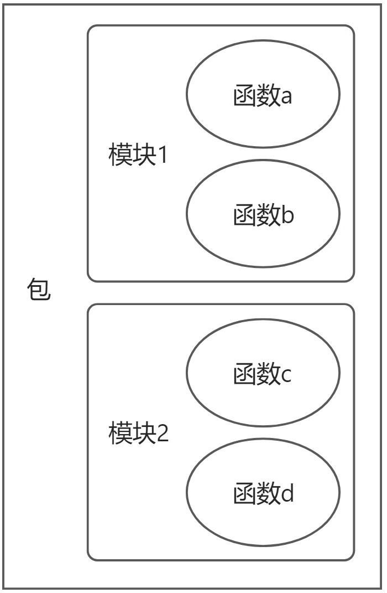
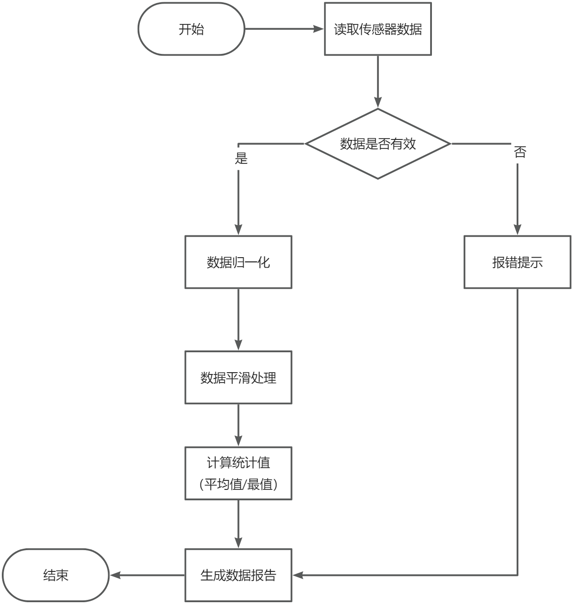
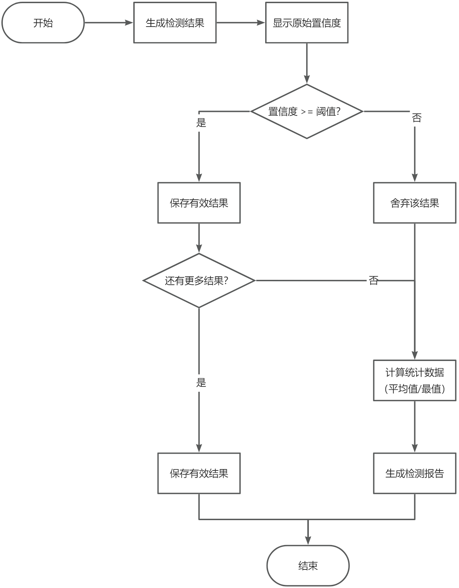

# 第 4 课：Python 函数与模块

## 课程简介

在本课中，我们将学习如何使用函数和模块来编写更高效、可维护的代码。在边缘AI开发中，良好的代码组织对于开发高性能、可维护的应用程序至关重要。通过合理使用函数和模块，我们可以更好地组织边缘设备的各种功能模块。

## 课程目标

+ 理解函数的定义和调用方法，掌握参数传递和返回值的使用。
+ 了解模块和库的概念，学会导入和使用Python标准库和第三方库。
+ 结合边缘AI实际案例，编写可重用的函数模块。
+ 实践编写硬件设备交互相关的自定义模块。

## 1. 函数

### 1.1. 什么是函数？

函数是组织在一起、可以重复使用的一段代码，用于实现单一或相关联的功能。在边缘AI开发中，函数可以帮助我们：

+ 将复杂的任务分解成小的功能模块。
+ 避免代码重复。
+ 提高代码的可维护性和可读性。
+ 方便团队协作开发。

在边缘设备上,我们经常需要处理：

+ 传感器数据的采集和处理。
+ 硬件状态的监控。
+ 模型推理。
+ 异常检测与报警。

通过合理使用函数,可以将这些功能模块化,便于管理和维护。

### 1.2. 函数的定义

#### 1.2.1. 基本语法

```python
def 函数名(参数列表):
    """文档字符串，可选，说明函数的功能"""
    函数体
    return 返回值  # 可选
```

#### 1.2.2. 重要组成部分

1. `def`关键字: 用于声明一个函数  
2. 函数名: 遵循标识符命名规则,应该能反映函数功能  
3. 参数列表: 函数输入,可以为空  
4. 文档字符串: 说明函数的功能、参数、返回值等  
5. 函数体: 具体的执行代码  
6. `return`语句: 返回函数的执行结果,可选

#### 1.2.3. 示例：边缘设备温度监控

在前面我们提到,函数可以帮助我们将复杂的任务分解成小的功能模块。让我们通过一个边缘设备温度监控的例子来理解函数的基本结构。

+ 设计要点：
  + 实现边缘设备的温度监控这一基础功能模块，体现函数的单一职责。
  + 通过清晰的函数名和文档字符串说明功能。
  + 函数体内模拟实际的温度检测过程（实际项目中应对接硬件传感器）。
  + 将温度监控逻辑集中在一个函数中，提高代码可维护性。

```python
def check_temperature():
    """简单的设备温度检查函数（模拟数据）"""
    print("正在检查设备温度...")
# 这里使用模拟数据，实际应从传感器读取
    temperature = 45
    print(f"当前设备温度: {temperature}°C")
```

### 1.3. 函数的调用

定义函数后，通过函数名加括号来调用它。

#### 1.3.1. 基本调用示例

在实际的边缘设备监控中，我们通常需要定期检查设备温度。这个例子将展示如何重复使用我们刚才创建的温度监控函数。

+ 设计要点：
  + 需要导入time模块控制间隔
  + 通过简单的函数调用实现单次温度检查
  + 结合循环实现周期性检查，模拟实际监控场景
  + 添加时间间隔控制检查频率，避免资源浪费
  + 展示函数的重用性，无需重复编写检测代码

+ 具体实现：

```python
import time

def check_temperature():
    """简单的设备温度检查函数（模拟数据）"""
    print("正在检查设备温度...")
# 这里使用模拟数据，实际应从传感器读取
    temperature = 45
    print(f"当前设备温度: {temperature}°C")

# 单次调用
check_temperature()

# 多次调用，模拟定期监控
for _ in range(3):
    check_temperature()
    time.sleep(1)  # 每次检查间隔1秒
```

### 1.4. 带参数的函数

在实际应用中,函数通常需要接收参数来处理不同的输入数据或配置。

#### 1.4.1. 示例：设备状态监控函数

+ 设计要点：
  + 使用布尔参数作为开关，控制需要检查的指标（温度、内存、GPU等）
  + 为所有参数提供默认值，使函数在简单场景下调用更方便
  + 使用字典返回监控结果，便于后续处理和扩展
  + 保持代码模块化，便于后续添加新的监控指标

+ 具体实现：

```python
def monitor_device(check_temp=True, check_memory=True, check_gpu=False):
    """
    监控设备状态的函数
    
    参数:
    check_temp (bool): 是否检查温度
    check_memory (bool): 是否检查内存
    check_gpu (bool): 是否检查GPU状态
    
    返回:
    dict: 包含已监控指标的状态信息
    """
    status = {}
    
# 模拟数据
    if check_temp:
        status['temperature'] = 45
        
    if check_memory:
        status['memory_usage'] = 75
        
    if check_gpu:
        status['gpu_usage'] = 30
        
    return status

result = monitor_device(check_temp=True, check_gpu=True)
print("设备状态:", result)
```

运行结果：

```plain
设备状态: {'temperature': 45, 'gpu_usage': 30}
```

### 1.5. 带返回值的函数

在边缘AI应用中,函数常需要返回处理结果供其他部分使用。

#### 1.5.1. 示例：图像预处理函数

此函数假设已有 `load_test_image()` 和 `resize_to_target()`函数以及 `image_data` 是可处理的图像数据结构（例如 numpy 数组）。请确保已安装和导入图像处理依赖库（如OpenCV）并已定义对应函数或引用占位函数。

+ 设计要点：
  + 集中处理常见的图像预处理需求（尺寸调整、归一化）。
  + 通过参数控制处理选项，适应不同模型的输入要求。
  + 返回处理结果和状态标志，便于调用方进行错误处理。
  + 使用异常处理确保函数的健壮性。
  + 保持函数的通用性，可用于不同的边缘AI应用场景。

```python
import numpy as np

def resize_to_target(image_data, target_size):
    """
    简单模拟 resize 功能，将输入图像数据调整为目标大小。
    """
# 这里假设输入是一个 NumPy 数组，模拟 resize 操作
    return np.random.rand(*target_size, image_data.shape[2]) if len(image_data.shape) == 3 else np.random.rand(*target_size)

def load_test_image():
    """
    模拟加载图像，返回一个随机生成的 NumPy 数组作为测试图像数据。
    """
    return np.random.rand(300, 300, 3)  # 模拟一张 300x300 的 RGB 图像

def preprocess_image(image_data, target_size=(224, 224), normalize=True):
    """
    预处理图像数据

    参数:
    image_data: 输入图像数据 (假设为numpy数组)
    target_size: 目标尺寸,默认(224, 224)
    normalize: 是否进行归一化,默认True

    返回:
    (processed_image, success): 处理后的图像数据和处理状态(bool)
    """
    try:
        resized_image = resize_to_target(image_data, target_size)
        
        if normalize:
            processed_image = resized_image / 255.0
        else:
            processed_image = resized_image
            
        return processed_image, True
        
    except Exception as e:
        print(f"图像处理错误: {str(e)}")
        return None, False

# 使用示例
image_data = load_test_image()
processed, success = preprocess_image(image_data)
if success:
    print("图像预处理成功")
    print(f"预处理后图像形状: {processed.shape}")
else:
    print("图像预处理失败")
```

### 1.6. 参数类型

在边缘AI开发中,函数的参数类型影响代码的灵活性和可维护性。

+ 位置参数（按顺序传递）。
+ 关键字参数（按名称传递）。
+ 默认参数（无需显式传递）。
+ 可变参数 *args 和 **kwargs 支持不定数量的参数。

#### 1.6.1. 位置参数

位置参数是按照函数定义中参数的顺序来传递的参数。在进行硬件操作和数据处理时，经常使用位置参数来传递必需的信息。

##### 示例：设备端口配置函数

在边缘设备开发中，我们经常需要配置各种硬件接口（假设我们不需要真实硬件连接）。这个例子展示如何使用位置参数来配置传感器连接。

+ 设计要点：
  + 使用位置参数设置关键的连接参数（端口、波特率、超时时间）。
  + 参数顺序反映配置的重要性和逻辑顺序。
  + 通过打印信息确认配置结果。
  + 返回配置状态，便于上层程序判断配置是否成功。

+ 具体实现：

```python
def configure_sensor(port, baud_rate, timeout):
    """
    配置传感器连接参数
    
    参数:
    port: 设备端口号
    baud_rate: 波特率
    timeout: 超时时间(秒)
    """
    print(f"配置传感器:")
    print(f"- 端口: COM{port}")
    print(f"- 波特率: {baud_rate}")
    print(f"- 超时: {timeout}秒")
    return True

# 按位置传递参数
configure_sensor(1, 9600, 5)  # COM1端口,9600波特率,5秒超时
```

运行结果：

```plain
配置传感器:
- 端口: COM1
- 波特率: 9600
- 超时: 5秒
```

#### 1.6.2. 关键字参数

关键字参数通过参数名来传递，顺序不重要。这在配置复杂设备参数时特别有用。

##### 示例：模型推理配置

在边缘设备上部署AI模型时，我们需要根据设备性能和实际需求灵活配置推理环境。这个例子展示如何使用关键字参数来实现灵活的配置功能。

+ 设计要点：
  + 使用关键字参数提高配置的可读性和灵活性（model_path、device_type等）
  + 通过默认值实现常用配置的快速设置
  + 清晰地展示每项配置的内容和结果
  + 参数设计涵盖模型部署的关键需求（模型路径、输入尺寸、运行设备、线程数）

+ 具体实现：

```python
def setup_inference(model_path, input_size, device_type="CPU", num_threads=4):
    """
    配置模型推理环境
    
    参数:
    model_path: 模型文件路径
    input_size: 输入尺寸
    device_type: 运行设备类型
    num_threads: 线程数
    """
    print("推理环境配置:")
    print(f"- 模型路径: {model_path}")
    print(f"- 输入尺寸: {input_size}")
    print(f"- 运行设备: {device_type}")
    print(f"- 线程数量: {num_threads}")

# 使用关键字参数（顺序可以不同）
setup_inference(
    device_type="GPU",
    input_size=(224, 224),
    model_path="/models/resnet.onnx",
    num_threads=2
)
```

运行结果：

```plain
推理环境配置:
- 模型路径: /models/resnet.onnx
- 输入尺寸: (224, 224)
- 运行设备: GPU
- 线程数量: 2
```

#### 1.6.3. 默认参数

**默认参数**在函数定义时指定默认值，调用时可以选择性地覆盖。这在设置设备配置时非常实用。

##### 示例：设备数据采集函数

在边缘设备的数据采集任务中，我们需要能够快速配置不同的采集参数，同时保持配置的简便性。这个例子展示如何使用默认参数来平衡灵活性和易用性。

+ 设计要点：
  + 通过默认参数提供常用的采集配置（采样率、采集时长等）
  + 支持灵活的通道选择，适应不同的数据采集需求
  + 提供数据保存选项，方便调试和分析
  + 设计合理的默认值，使函数在简单场景下可以直接使用
  + 通过参数组合支持不同的采集场景

+ 具体实现：

```python
def collect_sensor_data(
    sample_rate=1000,      # 采样率
    duration=5,            # 采集时长(秒)
    channels=['temp', 'humidity'],  # 采集通道
    save_raw=False        # 是否保存原始数据
):
    """
    采集传感器数据
    
    参数都提供了默认值，调用时可以选择性覆盖
    """
    print("数据采集配置:")
    print(f"- 采样率: {sample_rate}Hz")
    print(f"- 采集时长: {duration}秒")
    print(f"- 采集通道: {channels}")
    print(f"- 保存原始数据: {'是' if save_raw else '否'}")
    
# 模拟数据采集过程
    total_samples = sample_rate * duration
    print(f"总采样点数: {total_samples}")

# 使用默认值调用
collect_sensor_data()

# 部分覆盖默认值
collect_sensor_data(sample_rate=2000, channels=['temp', 'humidity', 'pressure'])
```

#### 1.6.4. 可变参数 *args

**可变位置参数** 允许函数接收任意数量的位置参数。在处理多传感器数据时特别有用。

##### 示例：多传感器数据处理（计算平均值）

在边缘设备中，我们可能需要同时处理来自多个传感器的数据，但传感器的数量可能不固定。这个例子展示如何使用可变位置参数来处理任意数量的传感器数据。

+ 设计要点：
  + 使用*args接收不定数量的传感器读数，提供处理灵活性
  + 实现基础的统计功能（平均值计算）
  + 清晰展示数据处理过程，便于监控和调试
  + 设计通用的处理逻辑，适用于不同数量的传感器数据

+ 具体实现：

```python
def process_sensor_readings(*readings):
    """
    处理多个传感器的读数
    
    参数:
    readings: 任意数量的传感器读数
    """
    print(f"处理 {len(readings)} 个传感器的数据:")
    
    for i, reading in enumerate(readings):
        print(f"传感器 {i+1}: {reading}")
    
# 计算平均值
    average = sum(readings) / len(readings)
    return average

# 处理不同数量的传感器数据
result1 = process_sensor_readings(23.5, 24.1, 23.8)
print(f"平均值: {result1:.2f}")

result2 = process_sensor_readings(23.5, 24.1, 23.8, 24.0, 23.7)
print(f"平均值: {result2:.2f}")
```

#### 1.6.5. 可变关键字参数 **kwargs

**可变关键字参数** 允许函数接收任意数量的关键字参数。在配置复杂系统时非常有用。

##### 示例：设备配置管理器

在边缘设备部署时，不同设备可能需要不同的配置项。我们需要一个灵活的配置管理器，能够处理各种可能的配置参数。

+ 设计要点：
  + 使用**kwargs接收任意配置项，适应不同设备的配置需求
  + 提供清晰的配置信息展示
  + 支持动态添加新的配置项，方便系统扩展
  + 保持配置过程的可追踪性，便于问题排查

+ 具体实现：

```python
def configure_device(**settings):
    """
    配置设备各项参数
    
    参数:
    settings: 任意数量的配置参数
    """
    print("设备配置:")
    for key, value in settings.items():
        print(f"- {key}: {value}")
    
# 保存配置
    print("配置已保存")

# 配置不同的参数组合
configure_device(
    device_name="EdgeAI-01",
    sample_rate=1000,
    resolution="1080p",
    power_mode="high_performance"
)

configure_device(
    device_name="EdgeAI-02",
    wifi_enabled=True,
    storage_path="/data"
)
```

#### 1.6.6. 参数混合使用

在实际项目中，常常需要混合使用不同类型的参数。以下是一个综合示例：

##### 示例：AI模型部署配置器

在实际的边缘AI系统中，模型部署往往需要多种类型的配置参数，同时还要支持扩展配置。这个例子展示如何组合使用不同类型的参数来创建一个完整的模型部署配置系统。

+ 设计要点：
  + 结合使用位置参数、默认参数、可变参数和关键字参数
  + 必要参数（模型名称、输入形状）使用位置参数确保必须提供
  + 常用配置（框架类型、设备类型）使用默认参数提供便利性
  + 支持多个关联模型的配置通过*args传入
  + 使用**kwargs支持任意扩展配置
  + 提供清晰的配置信息展示，便于确认和调试

+ 具体实现：

```python
def deploy_model(
    model_name,           # 必需的位置参数
    input_shape,         # 必需的位置参数
    *additional_models,  # 可变位置参数
    framework="onnx",    # 默认参数
    device="CPU",        # 默认参数
    **custom_config     # 可变关键字参数
):
    """
    配置AI模型部署
    
    参数:
    model_name: 模型名称
    input_shape: 输入形状
    framework: 框架类型(默认onnx)
    device: 运行设备(默认CPU)
    additional_models: 其他相关模型
    custom_config: 自定义配置项
    """
    print(f"\nAI模型部署配置:")
    print(f"主模型: {model_name}")
    print(f"输入形状: {input_shape}")
    print(f"框架: {framework}")
    print(f"设备: {device}")
    
    if additional_models:
        print("\n关联模型:")
        for model in additional_models:
            print(f"- {model}")
    
    if custom_config:
        print("\n自定义配置:")
        for key, value in custom_config.items():
            print(f"- {key}: {value}")

# 修正后的函数调用
deploy_model(
    "yolov5",                        # 位置参数
    (640, 640, 3),                   # 位置参数
    "face_detection",                # 位置参数
    "person_detection",              # 位置参数
    framework="tensorrt",            # 关键字参数
    device="GPU",                    # 关键字参数
    batch_size=4,                    # 关键字参数
    enable_fp16=True,                # 关键字参数
    workspace_size=4096              # 关键字参数
)
```

+ 运行结果：

```plain
AI模型部署配置:
主模型: yolov5
输入形状: (640, 640, 3)
框架: tensorrt
设备: GPU

关联模型:
- face_detection
- person_detection

自定义配置:
- batch_size: 4
- enable_fp16: True
- workspace_size: 4096
```

### 1.7. 作用域

在边缘AI应用开发中，正确理解和使用变量作用域对于开发可靠的程序至关重要。

#### 1.7.1. 全局变量

全局变量在整个程序中都可以访问，通常用于存储设备配置、系统状态等全局信息。

##### 示例：设备全局配置

在边缘设备应用中，某些配置和状态需要在整个程序中共享。这个例子展示如何使用全局变量管理设备配置和状态信息。

+ 设计要点：
  + 使用全局变量存储关键的设备配置（设备ID、温度阈值等）
  + 确保全局配置在整个程序中保持一致
  + 在函数中正确访问全局配置
  + 提供清晰的配置检查机制

+ 具体实现：

```python
# 全局配置变量
DEVICE_ID = "EDGE_AI_001"
MAX_TEMPERATURE = 75
SAMPLING_RATE = 1000

def check_temperature():
    """检查设备温度是否超过全局设置的阈值"""
    current_temp = get_device_temperature()  # 假设有这个函数
    print(f"设备 {DEVICE_ID} 当前温度: {current_temp}°C")
    if current_temp > MAX_TEMPERATURE:
        print(f"警告：温度超过阈值 {MAX_TEMPERATURE}°C")
```

#### 1.7.2. 局部变量

局部变量只在函数内部可见，用于存储函数的临时数据。

##### 示例：数据预处理函数

在处理大量传感器数据时，我们需要控制内存使用并确保变量作用域的清晰性。这个例子展示如何使用局部变量高效处理数据。

+ 设计要点：
  + 使用局部变量控制数据处理的作用域
  + 设置合适的缓冲区大小，平衡内存使用
  + 分批处理数据，避免内存溢出
  + 保持变量作用域的清晰性，避免干扰其他部分

+ 具体实现：

```python
def process_sensor_data(raw_data):
    """处理传感器原始数据"""
# 局部变量，仅在函数内可用
    buffer_size = 1024
    processed_data = []
    
    for i in range(0, len(raw_data), buffer_size):
        chunk = raw_data[i:i + buffer_size]
# 处理数据块
        processed_chunk = normalize_data(chunk)
        processed_data.extend(processed_chunk)
    
    return processed_data

# print(buffer_size)  # 错误：buffer_size在函数外不可访问
```

#### 1.7.3. 使用 global 关键字

当需要在函数内修改全局变量时，使用 global 关键字。

##### 示例：设备状态管理

在边缘设备运行过程中，我们需要跟踪并更新设备状态。这个例子展示如何使用global关键字在函数中修改全局状态变量。

+ 设计要点：
  + 使用全局变量记录设备状态和错误计数
  + 通过global关键字在函数内修改全局变量
  + 实现状态转换的追踪和记录
  + 维护错误计数，便于设备运行状况分析

+ 具体实现：

```python
# 全局状态变量
device_status = "STANDBY"
error_count = 0

def update_device_status(new_status):
    """更新设备状态"""
    global device_status, error_count
    
    print(f"状态变更: {device_status} -> {new_status}")
    device_status = new_status
    
    if new_status == "ERROR":
        error_count += 1
        print(f"错误计数: {error_count}")

# 测试状态更新
print("当前状态:", device_status)
update_device_status("RUNNING")
print("更新后状态:", device_status)
update_device_status("ERROR")
```

+ 运行结果：

```plain
当前状态: STANDBY
状态变更: STANDBY -> RUNNING
更新后状态: RUNNING
状态变更: RUNNING -> ERROR
错误计数: 1
```

### 1.8. 函数设计最佳实践

在边缘AI应用开发中，良好的函数设计可以提高代码的可维护性和可重用性。

+ 单一职责原则：每个函数只做一件事。
+ 参数验证：在函数开始处验证参数合理性。

#### 1.8.1. 单一职责原则

每个函数应该只负责一个特定的任务。

##### 不推荐的写法示例

在边缘AI应用中，我们经常需要处理图像识别的完整流程。下面先看一个违反单一职责原则的示例，这个函数试图同时处理预处理、推理和存储多个任务。

+ 设计要点（反面教材）：
  + 函数承担了过多的职责（预处理、推理、保存）
  + 不同功能耦合在一起，难以单独测试和维护
  + 错误处理变得复杂，难以定位具体哪个环节出现问题
  + 代码复用性差，无法灵活组合不同功能

示例代码：

```python
def process_and_save_image(image):
    """函数功能太多，违反单一职责原则"""
# 图像预处理
    resized = cv2.resize(image, (224, 224))
    normalized = resized / 255.0
    
# 模型推理
    results = model.predict(normalized)
    
# 保存结果
    save_path = f"results_{time.strftime('%Y%m%d_%H%M%S')}.jpg"
    cv2.imwrite(save_path, image)
    
    return results
```

##### 推荐的写法示例

让我们看看如何改进上面的代码，将其拆分为多个职责单一的函数。

+ 设计要点：
  + 每个函数只负责一个明确的任务
  + 函数之间通过参数和返回值进行解耦
  + 便于独立测试和维护各个功能模块
  + 支持灵活组合不同功能来满足不同需求

具体实现：

```python
def preprocess_image(image):
    """图像预处理"""
    resized = cv2.resize(image, (224, 224))
    normalized = resized / 255.0
    return normalized

def run_inference(preprocessed_image):
    """模型推理"""
    results = model.predict(preprocessed_image)
    return results

def save_image(image, results):
    """保存图像和结果"""
    save_path = f"results_{time.strftime('%Y%m%d_%H%M%S')}.jpg"
    cv2.imwrite(save_path, image)
    return save_path

# 按需组合使用
def process_image(image):
    preprocessed = preprocess_image(image)
    results = run_inference(preprocessed)
    save_path = save_image(image, results)
    return results, save_path
```

这个改进后的设计展示了：

1. 如何将复杂任务分解为多个独立函数
2. 每个函数专注于单一任务，便于维护和测试
3. 可以灵活组合这些基础函数来满足不同的需求
4. 错误处理可以在每个具体环节独立进行

#### 1.8.2. 参数验证

在函数开始处验证参数，确保输入数据的有效性。

##### 示例：传感器数据验证

在边缘设备采集传感器数据时，必须确保数据的有效性，避免无效数据进入后续处理流程。这个例子展示如何在函数开始处进行全面的参数验证。

+ 设计要点：
  + 对输入数据进行多个维度的验证（数据存在性、形状、取值范围）
  + 提供清晰的错误信息，便于问题定位
  + 支持灵活的验证规则配置
  + 返回验证结果和详细说明，便于上层程序处理
  + 通过类型提示和文档字符串提高代码可读性

具体实现：

```python
def validate_sensor_data(data, expected_shape=None, value_range=None):
    """
    验证传感器数据
    
    参数:
    data: 传感器数据
    expected_shape: 预期的数据形状
    value_range: 有效值范围，如(min, max)
    
    返回:
    bool: 数据是否有效
    str: 错误信息（如果有）
    """
# 检查数据是否为空
    if data is None or len(data) == 0:
        return False, "数据为空"
    
# 检查数据形状
    if expected_shape is not None:
        if data.shape != expected_shape:
            return False, f"数据形状不匹配: 期望 {expected_shape}, 实际 {data.shape}"
    
# 检查数值范围
    if value_range is not None:
        min_val, max_val = value_range
        if np.any(data < min_val) or np.any(data > max_val):
            return False, f"数据超出有效范围 [{min_val}, {max_val}]"
    
    return True, "数据有效"

# 使用示例
import numpy as np

data = np.random.rand(100, 3)  # 模拟传感器数据
valid, message = validate_sensor_data(
    data,
    expected_shape=(100, 3),
    value_range=(0, 1)
)

if valid:
    print("数据验证通过，继续处理")
else:
    print(f"数据验证失败: {message}")
```

## 2. 模块

### 2.1. 什么是模块？

**模块**是一个包含 Python 定义和语句的文件，在边缘 AI 开发中，模块化设计可以帮助我们：

+ 将不同功能（如硬件控制、数据处理、模型推理）分离。
+ 提高代码复用性。
+ 便于团队协作。
+ 更好地管理项目依赖。

### 2.2. 模块的导入

在边缘AI开发中，我们经常需要使用不同的模块来处理图像、操作硬件或运行AI模型。Python 提供了几种不同的导入方式，让我们通过实例来理解每种方式的特点。

+ 基本导入（import）：import 导入整个模块
+ 选择性导入（from...import）：只导入模块中所需的部分
+ 使用别名（import...as）：使用别名简化模块名

#### 2.2.1. 基本导入

最基本的导入方式是使用 `import` 语句。这种方式导入整个模块，使用时需要通过模块名来访问其中的功能。

```python
# 导入计算机视觉库
import cv2

# 导入设备监控模块
import device_monitor

# 使用时需要通过模块名访问
frame = cv2.imread('image.jpg')           # 读取图像
temp = device_monitor.get_temperature()    # 获取温度
```

#### 2.2.2. 选择性导入 (from...import)

使用 `from...import` 可以只导入模块中的特定部分。这样可以直接使用导入的功能，无需模块名前缀。  

```python
# 只导入需要的函数
from cv2 import imread, resize
from device_monitor import get_temperature, check_status

# 直接使用函数名
frame = imread('image.jpg')     # 不需要写 cv2.imread
frame = resize(frame, (224, 224))  # 不需要写 cv2.resize
temp = get_temperature()        # 不需要写 device_monitor.get_temperature
```

#### 2.2.3. 使用别名 (import...as)

可以使用 `as` 关键字为导入的模块或函数指定一个别名。这在处理长模块名或避免命名冲突时很有用。

```python
# 为常用模块指定简短的别名
import numpy as np
import tensorflow as tf
import device_monitor as dm

# 使用别名
data = np.array([1, 2, 3])             # 而不是 numpy.array
model = tf.keras.Sequential()           # 而不是 tensorflow.keras
temp = dm.get_temperature()             # 而不是 device_monitor

# 也可以为导入的函数指定别名
from cv2 import imread as read_image
image = read_image('test.jpg')          # 使用自定义的别名
```

### 2.3. 创建自定义模块

在边缘 AI 项目中，我们经常需要创建自定义模块。自定义模块可以帮助我们：

1. 将相关功能组织在一起（如所有硬件操作放在一个模块）。
2. 方便在不同项目间复用代码。
3. 使代码结构更清晰，便于维护。
4. 便于团队协作开发。

#### 2.3.1. 创建模块的基本步骤

1. 创建一个 `.py` 文件，文件名即为模块名
2. 在文件中编写相关的函数、类和变量
3. 在其他程序中导入并使用该模块

让我们通过一个实际的例子来学习如何创建和使用自定义模块：

#### 2.3.2. 示例：设备监控模块 (device_monitor.py)

在边缘设备管理中，我们需要一个专门的模块来监控设备的各项指标。这个例子展示如何创建一个完整的设备监控模块，以及如何在主程序中使用它。

+ 设计要点：
  + 将所有监控相关功能封装在单独的模块中，实现关注点分离
  + 提供多个层次的监控功能（基础数据读取、状态检查、综合状态报告）
  + 使用模拟数据演示模块的结构和使用方法
  + 设计清晰的函数接口，便于其他程序调用
  + 实现错误处理和状态报告机制

让我们先看模块的实现：  

```python
# device_monitor.py

def read_temperature():
    """读取设备温度
    返回：当前温度值（摄氏度）
    """
# 实际应从硬件获取，这里模拟数据
    import random
    return round(random.uniform(20, 80), 2)

def check_temperature(threshold=75):
    """检查设备是否过热
    参数：
        threshold: 温度阈值（摄氏度）
    返回：
        (bool, float): (是否过热, 当前温度)
    """
    current_temp = read_temperature()
    return current_temp > threshold, current_temp

def get_memory_usage():
    """获取内存使用情况
    返回：
        dict: 包含内存使用信息的字典
    """
    import psutil
    memory = psutil.virtual_memory()
    return {
        'total': memory.total,
        'used': memory.used,
        'percent': memory.percent
    }

def get_device_status():
    """获取设备综合状态
    返回：
        dict: 包含设备各项状态的字典
    """
    is_overheating, temp = check_temperature()
    memory = get_memory_usage()
    
    return {
        'temperature': temp,
        'memory_used': memory['percent'],
        'status': 'WARNING' if is_overheating else 'NORMAL'
    }
```

#### 2.3.3. 使用自定义模块

创建好模块后，现在看看如何在主程序中使用这个模块：  

```python
# main.py
import device_monitor
import time

def main():
    print("开始监控设备状态...")
    
    try:
        while True:
# 获取设备状态
            status = device_monitor.get_device_status()
            
# 打印状态信息
            print("\n当前设备状态：")
            print(f"温度: {status['temperature']}°C")
            print(f"内存使用率: {status['memory_used']}%")
            print(f"系统状态: {status['status']}")
            
# 如果状态异常，打印警告
            if status['status'] == 'WARNING':
                print("警告：设备温度过高！")
            
# 等待5秒再次检查
            time.sleep(5)
            
    except KeyboardInterrupt:
        print("\n停止监控")

if __name__ == "__main__":
    main()
```

运行结果示例：

```plain
开始监控设备状态...

当前设备状态：
温度: 72.5°C
内存使用率: 65.8%
系统状态: NORMAL

当前设备状态：
温度: 78.3°C
内存使用率: 67.2%
系统状态: WARNING
警告：设备温度过高！
```

### 2.4. 包的概念

包是一种组织模块的方式，它是一个包含多个模块文件和一个 `__init__.py` 文件的目录。

#### 2.4.1. 模块和包的结构

<!--  -->


> 图 4.1 模块和包的结构示意图
>

#### 2.4.2. 使用包中的模块

在较大的边缘 AI 项目中，我们需要管理多个相关的模块。这个例子展示如何使用包来组织这些模块。

+ 设计要点：
  + 使用包的层次结构组织不同类型的功能模块
  + 通过__init__.py文件定义包的接口
  + 将相关功能放在同一个子包中，提高代码的组织性
  + 保持包的结构清晰，便于团队协作

使用示例

```python
from edge_ai_project.hardware import camera
from edge_ai_project.processing import image_processing

# 创建相机对象并捕获图像
cam = camera.Camera(0)
frame = cam.capture()

# 处理图像
processed = image_processing.preprocess(frame)
```

### 2.5. 模块搜索路径

Python 解释器按以下顺序搜索模块：

1. 当前目录
2. PYTHONPATH 环境变量中的目录
3. Python 标准库目录
4. 已安装的第三方包目录

可以通过以下代码查看模块搜索路径：

```python
import sys

print(sys.path)
```

## 3. 实践案例

### 3.1. 案例一：边缘设备的数据处理系统

#### 3.1.1. 案例描述

我们需要开发一个用于处理边缘设备传感器数据的系统。这个系统需要：

1. 读取多种传感器数据（温度、湿度、光照等）
2. 对数据进行预处理（归一化、平滑处理）
3. 分析数据并生成报告

#### 3.1.2. 流程图

让我们先通过流程图理清程序的结构：

<!--  -->


> 图 4.2 边缘设备数据处理流程图
>

#### 3.1.3. AI 辅助编程

让我们使用 AI 助手来帮助实现这个系统。我们可以这样描述需求：

> 请使用 Python 帮我实现一个数据处理系统，需要完成三个主要任务：读取多种传感器数据、对数据进行预处理，以及生成分析报告。请用模块化的方式来实现这个系统。  
先创建两个Python模块：
>
> 1. sensor_utils.py：包含读取传感器数据的函数，能模拟生成温度(20-30°C)、湿度(40-60%)和光照(0-1000 lux)数据
> 2. data_processor.py：包含数据处理函数，能进行：
>     + 数据归一化（转换到0-1范围）
>     + 数据平滑（计算最近N个数据的平均值）
>     + 生成数据报告（最大值、最小值、平均值）
>
> 再编写主程序使用这些模块以实现这个数据处理系统。
>

根据这个需求，AI助手生成的代码如下：

```python
# sensor_utils.py
import random

def get_temperature():
    """模拟获取温度数据"""
    return round(random.uniform(20, 30), 2)

def get_humidity():
    """模拟获取湿度数据"""
    return round(random.uniform(40, 60), 2)

def get_light():
    """模拟获取光照数据"""
    return round(random.uniform(0, 1000), 2)

def read_all_sensors():
    """读取所有传感器数据"""
    return {
        'temperature': get_temperature(),
        'humidity': get_humidity(),
        'light': get_light()
    }
```

```python
# data_processor.py

def normalize_data(data, data_min, data_max):
    """
    将数据归一化到0-1范围
    """
    return (data - data_min) / (data_max - data_min)

def smooth_data(data_list, window_size=3):
    """
    计算移动平均值
    """
    if len(data_list) < window_size:
        return sum(data_list) / len(data_list)
    
    smoothed = sum(data_list[-window_size:]) / window_size
    return round(smoothed, 2)

def generate_report(data_list):
    """
    生成数据统计报告
    """
    if not data_list:
        return None
        
    return {
        'max': max(data_list),
        'min': min(data_list),
        'average': round(sum(data_list) / len(data_list), 2),
        'count': len(data_list)
    }
```

#### 3.1.4. 主程序

现在我们可以编写主程序来使用这些模块：

```python
# main.py
import sensor_utils
import data_processor
import time

def main():
# 存储历史数据
    temp_history = []
    humidity_history = []
    light_history = []
    
    print("开始采集和处理数据...\n")
    
    try:
        for _ in range(5):  # 采集5次数据
# 1. 读取传感器数据
            sensor_data = sensor_utils.read_all_sensors()
            
# 2. 保存历史数据
            temp_history.append(sensor_data['temperature'])
            humidity_history.append(sensor_data['humidity'])
            light_history.append(sensor_data['light'])
            
# 3. 处理数据
# 归一化温度数据
            norm_temp = data_processor.normalize_data(
                sensor_data['temperature'], 20, 30
            )
            
# 平滑处理
            smooth_temp = data_processor.smooth_data(temp_history)
            
# 4. 打印当前数据
            print(f"温度: {sensor_data['temperature']}°C (归一化: {norm_temp:.2f}, 平滑: {smooth_temp:.2f})")
            print(f"湿度: {sensor_data['humidity']}%")
            print(f"光照: {sensor_data['light']} lux\n")
            
            time.sleep(1)  # 等待1秒
        
# 5. 生成报告
        temp_report = data_processor.generate_report(temp_history)
        print("温度数据报告:")
        print(f"最大值: {temp_report['max']}°C")
        print(f"最小值: {temp_report['min']}°C")
        print(f"平均值: {temp_report['average']}°C")
        
    except KeyboardInterrupt:
        print("\n程序已停止")

if __name__ == "__main__":
    main()
```

#### 3.1.5. 运行结果示例

```plain
开始采集和处理数据...

温度: 25.32°C (归一化: 0.53, 平滑: 25.32)
湿度: 45.67%
光照: 583.21 lux

温度: 27.89°C (归一化: 0.79, 平滑: 26.61)
湿度: 52.34%
光照: 421.56 lux

[更多数据...]

温度数据报告:
最大值: 27.89°C
最小值: 23.45°C
平均值: 25.67°C
```

### 3.2. 案例二：AI推理结果处理工具

#### 3.2.1. 案例描述

开发一个用于处理AI模型推理结果的工具模块。这个工具用于：

1. 处理模型输出的置信度分数（0-1之间的数值）
2. 根据置信度阈值筛选结果
3. 生成检测报告

#### 3.2.2. 流程图

让我们先通过流程图理清程序的结构：

<!--  -->


> 图 4.3 AI 推理结果处理流程图
>

#### 3.2.3. AI 辅助编程

让我们向AI助手描述需求：

> 开发一个用于处理AI模型推理结果的工具模块。这个工具用于：
>
> 1. 处理模型输出的置信度分数（0-1之间的数值）
> 2. 根据置信度阈值筛选结果
> 3. 生成检测报告
>
> 我需要创建两个Python模块：
>
> 1. result_generator.py：模拟AI模型的推理结果
>     + 生成模拟的置信度分数（0-1之间的浮点数）
>     + 生成多个目标的检测结果
> 2. result_processor.py：处理和分析结果
>     + 根据阈值筛选结果
>     + 统计检测结果
>     + 生成简单报告
>
> 最后编写主程序来使用这些模块已实现功能。
>

根据需求，AI助手生成的代码如下：

```python
# result_generator.py
import random

def generate_confidence_score():
    """生成一个模拟的置信度分数(0-1之间)"""
    return round(random.uniform(0, 1), 2)

def generate_detection_results(num_objects=5):
    """
    生成多个目标的检测结果
    返回：每个目标的置信度列表
    """
    results = []
    for _ in range(num_objects):
        confidence = generate_confidence_score()
        results.append(confidence)
    return results
```

```python
# result_processor.py

def filter_results(confidence_list, threshold=0.5):
    """
    根据阈值筛选结果
    
    参数：
        confidence_list: 置信度列表
        threshold: 置信度阈值
    返回：
        通过筛选的置信度列表
    """
    valid_results = []
    for conf in confidence_list:
        if conf >= threshold:
            valid_results.append(conf)
    return valid_results

def count_detections(filtered_results):
    """
    统计检测到的目标数量
    """
    return len(filtered_results)

def generate_report(original_results, filtered_results):
    """
    生成检测报告
    """
    report = {
        'total_objects': len(original_results),
        'detected_objects': len(filtered_results),
        'average_confidence': 0,
        'highest_confidence': 0,
        'lowest_confidence': 0
    }
    
    if filtered_results:
        report['average_confidence'] = sum(filtered_results) / len(filtered_results)
        report['highest_confidence'] = max(filtered_results)
        report['lowest_confidence'] = min(filtered_results)
    
# 四舍五入到2位小数
    for key in ['average_confidence', 'highest_confidence', 'lowest_confidence']:
        report[key] = round(report[key], 2)
    
    return report
```

#### 3.2.4. 主程序

现在编写主程序来使用这些模块：

```python
# main.py
import result_generator
import result_processor

def main():
    print("AI推理结果处理工具启动...\n")
    
# 设置参数
    num_objects = 8  # 待检测的目标数量
    confidence_threshold = 0.6  # 置信度阈值
    
    try:
# 1. 生成模拟的检测结果
        print(f"生成{num_objects}个目标的检测结果...")
        results = result_generator.generate_detection_results(num_objects)
        
# 2. 显示原始结果
        print("\n原始置信度分数:")
        for i, conf in enumerate(results, 1):
            print(f"目标 {i}: {conf}")
            
# 3. 根据阈值筛选结果
        filtered = result_processor.filter_results(
            results, 
            confidence_threshold
        )
        
# 4. 生成报告
        report = result_processor.generate_report(results, filtered)
        
# 5. 显示报告
        print(f"\n检测报告 (阈值: {confidence_threshold})")
        print("-" * 30)
        print(f"检测目标总数: {report['total_objects']}")
        print(f"有效检测目标数: {report['detected_objects']}")
        print(f"平均置信度: {report['average_confidence']}")
        print(f"最高置信度: {report['highest_confidence']}")
        print(f"最低置信度: {report['lowest_confidence']}")
        
    except Exception as e:
        print(f"处理过程中出现错误: {str(e)}")

if __name__ == "__main__":
    main()
```

#### 3.2.5. 运行结果示例

```plain
AI推理结果处理工具启动...

生成8个目标的检测结果...

原始置信度分数:
目标 1: 0.75
目标 2: 0.45
目标 3: 0.92
目标 4: 0.31
目标 5: 0.88
目标 6: 0.67
目标 7: 0.52
目标 8: 0.83

检测报告 (阈值: 0.6)
------------------------------
检测目标总数: 8
有效检测目标数: 5
平均置信度: 0.81
最高置信度: 0.92
最低置信度: 0.67
```

## 4. 总结

通过本课的学习，我们掌握了Python函数的定义和调用方法，了解了模块和库的概念，学会了如何导入和使用Python标准库以及创建自定义模块。通过边缘设备数据处理和AI推理结果处理这两个实践案例，我们体验了函数和模块在实际项目中的应用，学会了如何将复杂的任务分解成小的功能模块，提高了代码的可维护性和复用性。这些知识为我们后续开发边缘AI应用打下了良好的基础。

## 5. 课后拓展

+ **阅读材料**
  + [Python 官方文档 - 函数](https://docs.python.org/zh-cn/3/tutorial/controlflow.html#defining-functions)
  + [Python 官方文档 - 模块](https://docs.python.org/zh-cn/3/tutorial/modules.html)

+ **实践练习**

    1. **练习1：AI模型置信度评估工具**

        **任务描述：**

        + 编写一个程序，包含函数用于评估AI模型的预测置信度（范围0到1的浮点数）
        + 创建函数生成5个模拟的置信度值
        + 创建函数进行置信度评估：
        + 如果置信度大于0.8，输出"高可信度"
        + 如果置信度在0.5到0.8之间，输出"中等可信度"
        + 如果置信度小于0.5，输出"低可信度"

        **提示：**

        + 使用`random.uniform(0, 1)`生成0到1之间的随机浮点数
        + 使用`round(number, 2)`保留两位小数
        + 将相关函数放在同一个模块中

    2. **练习2：传感器数据处理模块**

        **任务描述：**

        + 创建一个模块，包含以下函数：
        + 生成模拟的传感器数据（范围0到100的整数）
        + 计算数据的平均值
        + 查找最大值和最小值
        + 在主程序中使用这些函数处理10个数据点
        + 生成数据报告，显示统计结果

        **提示：**

        + 将所有函数放在一个独立的模块文件中
        + 使用列表存储数据
        + 使用函数参数传递数据

    3. **练习3：模型预测时间统计工具**

        **任务描述：**

        + 创建函数模拟AI模型的预测过程
        + 统计每次预测的执行时间
        + 创建函数计算并显示：
        + 平均执行时间
        + 最长执行时间
        + 最短执行时间
        + 进行5次测试并生成报告

        **提示：**

        + 使用`time`模块的`time()`函数记录时间
        + 使用`sleep()`函数模拟处理时间
        + 将时间统计相关的函数放在独立模块中

        <br>

        参考答案：[04-Python 函数与模块课后题参考答案](https://github.com/Seeed-Studio/Seeed_Studio_Courses/blob/Edge-AI-101-with-Nvidia-Jetson-Course/docs/cn/1/04/Homework_Answer.md)
