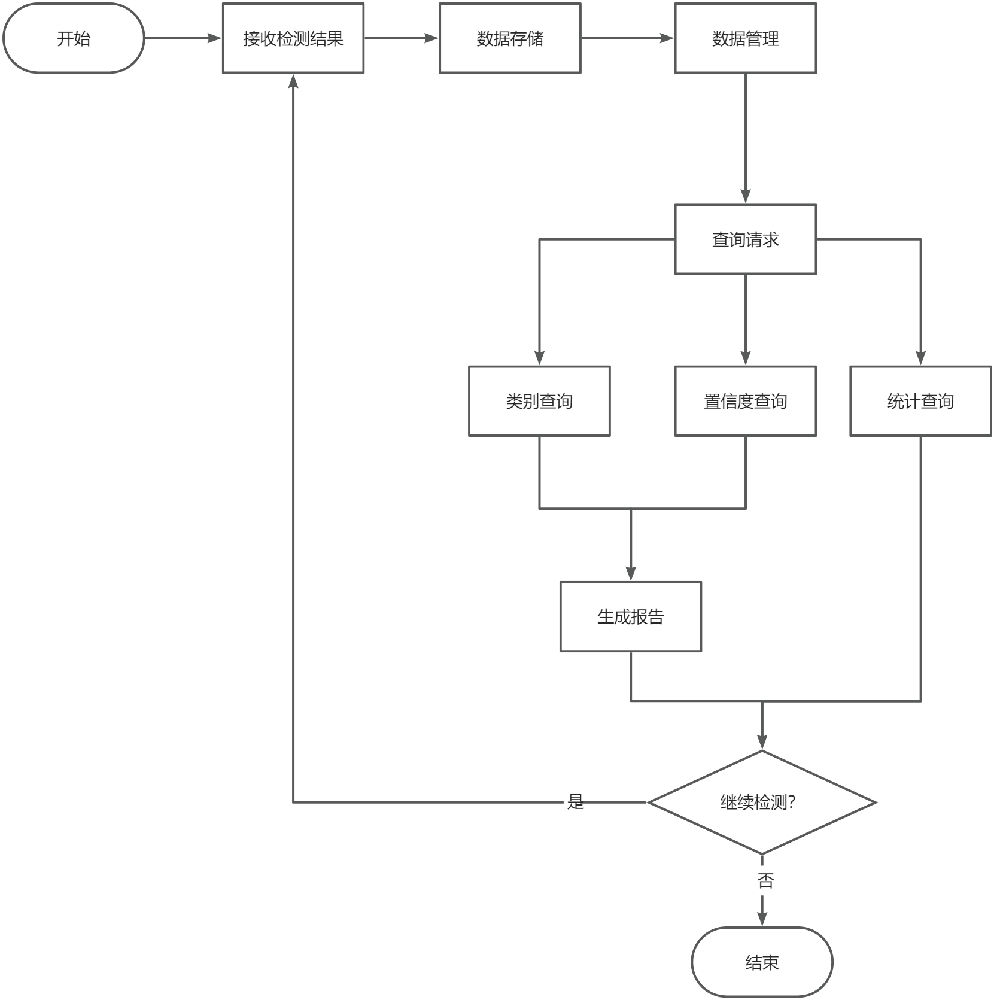

# 第 5 课：Python 数据结构

在本课中，我们将学习 Python 中的基本数据结构，包括列表、元组、字典和集合。在边缘 AI 应用中，合适的数据结构选择对于高效处理传感器数据、管理模型配置、组织检测结果等任务至关重要。通过本课的学习，你将掌握如何选择和使用合适的数据结构来解决实际问题。

## 课程目标

+ 掌握列表、元组、字典、集合等基本数据结构，理解其特点和在边缘 AI 中的应用场景
+ 能够对数据结构进行增删改查等操作，熟练使用常用方法和属性
+ 学会选择合适的数据结构解决实际问题，提高边缘 AI 应用的开发效率
+ 通过实践项目，如设备监控系统，巩固对数据结构的理解

---

## 1. 列表（List）

### 1.1. 什么是列表？

列表是 Python 中最常用的数据结构之一，用于存储有序的、可变的元素集合。在边缘 AI 应用中，列表经常用于:

+ 存储传感器的实时数据流
+ 管理检测到的目标坐标
+ 记录设备状态历史
+ 存储图像处理的中间结果


> 图 5.1 边缘 AI 中列表的应用
>

### 1.2. 列表的特点

+ 有序性：元素按照插入顺序排列，便于追踪时序数据
+ 可变性：可以动态更新元素，适合处理实时数据
+ 索引访问：通过索引快速访问元素，提高数据处理效率
+ 支持多种数据类型：可以同时存储不同类型的数据

### 1.3. 创建和访问列表

 在实际项目中，传感器会持续产生数据。让我们看一个温度传感器的实例：  


> 图 5.2 温度传感器实时数据
>

从上图的串口监视器中我们可以看到：

1. 温度传感器每隔固定时间（例如每秒）产生一个新的温度读数
2. 数据是按时间顺序产生的
3. 我们需要记录和处理这些连续的数据

为什么使用列表来存储这些温度数据？

1. 数据是有序的 - 列表保持数据的时间顺序
2. 数据会不断更新 - 列表可以方便地添加新数据
3. 我们需要访问最新数据或一段时间内的数据 - 列表支持灵活的索引访问

下面让我们用代码来演示如何使用列表管理这些温度数据：

```python
# 创建一个存储温度数据的列表
temperatures = [23.5, 24.1, 23.8, 24.3, 23.9]

# 访问最新的温度数据
latest_temp = temperatures[-1]
print(f"最新温度: {latest_temp}°C")

# 访问特定时间段的温度数据
last_hour_temps = temperatures[1:4]
print(f"过去一小时温度: {last_hour_temps}")
```

从这个例子我们可以看到：

+ 使用列表存储了一系列温度读数
+ 通过负数索引 (-1) 可以轻松获取最新的温度数据
+ 使用切片操作 [1:4] 可以获取特定时间段的温度记录

这种数据组织方式使我们能够：

1. 实时记录传感器数据
2. 方便地访问最新数据
3. 分析特定时间段的数据变化

### 1.4. 列表的常用操作

#### 1.4.1. 添加元素

列表提供了多种添加元素的方法：

1. append() 方法

    + **功能**：在列表末尾添加一个新元素
    + **语法**：`list.append(element)`
    + **适用场景**：当需要在列表末尾添加单个数据时，如添加新的传感器读数

2. insert() 方法

    + **功能**：在列表的指定位置插入一个元素
    + **语法**：`list.insert(index, element)`
    + **适用场景**：当需要在特定位置插入数据时，如在时间序列中插入遗漏的数据点

3. extend() 方法

    + **功能**：将另一个列表中的所有元素添加到当前列表末尾
    + **语法**：`list.extend(iterable)`
    + **适用场景**：当需要合并多组数据时，如合并多个传感器的数据

让我们通过一个传感器数据采集的例子来学习这些操作：

```python
# 创建一个空的传感器数据列表
sensor_data = []

# 使用append()添加单个传感器读数
sensor_data.append(23.5)
print(f"添加一个温度读数: {sensor_data}")  # 输出: [23.5]

# 使用insert()在指定位置插入数据
sensor_data.insert(0, 23.2)  # 在开头插入数据
print(f"插入一个温度读数: {sensor_data}")  # 输出: [23.2, 23.5]

# 使用extend()添加多个传感器读数
new_readings = [23.8, 24.1, 23.9]
sensor_data.extend(new_readings)
print(f"添加多个温度读数: {sensor_data}")  # 输出: [23.2, 23.5, 23.8, 24.1, 23.9]
```

#### 1.4.2. 删除元素

列表提供了多种删除元素的方法：

1. remove() 方法

    + **功能**：删除列表中第一个匹配的指定元素
    + **语法**：`list.remove(element)`
    + **适用场景**：当需要删除特定的异常数据时

2. pop() 方法

    + **功能**：删除并返回指定位置的元素，默认为最后一个元素
    + **语法**：`list.pop([index])`
    + **适用场景**：当需要获取并删除特定位置的数据时

3. del 语句

    + **功能**：删除指定位置的元素或整个列表
    + **语法**：`del list[index]` 或 `del list[start:end]`
    + **适用场景**：当需要删除特定范围的数据时

在处理传感器数据时，我们经常需要删除过期或异常的数据：

```python
# 假设我们有一些传感器读数
sensor_data = [23.2, 23.5, -999, 23.8, 24.1]  # -999 表示错误读数

# 使用remove()删除错误数据
sensor_data.remove(-999)
print(f"删除错误数据后: {sensor_data}")  # 输出: [23.2, 23.5, 23.8, 24.1]

# 使用pop()删除并获取最后一个读数
last_reading = sensor_data.pop()
print(f"最后一次读数: {last_reading}")  # 输出: 24.1
print(f"剩余数据: {sensor_data}")  # 输出: [23.2, 23.5, 23.8]

# 使用del删除第一个读数
del sensor_data[0]
print(f"删除首个读数后: {sensor_data}")  # 输出: [23.5, 23.8]
```

#### 1.4.3. 修改元素

在列表中修改元素有两种主要方式：

1. 直接索引赋值

    + **功能**：通过索引直接修改单个元素的值
    + **语法**：`list[index] = new_value`
    + **适用场景**：当需要更新特定位置的数据时，如校正错误的传感器读数

2. 切片赋值

    + **功能**：同时修改多个连续位置的元素
    + **语法**：`list[start:end] = new_values`
    + **适用场景**：当需要批量更新一段数据时，如校正一段时间内的传感器数据

让我们通过一个温度数据校正的例子来学习如何修改列表元素：

```python
# 假设我们有一组传感器读数
sensor_data = [23.5, 23.8, 24.1, 23.9]

# 使用索引修改单个读数（校正错误数据）
sensor_data[2] = 24.0
print(f"校正后的数据: {sensor_data}")  # 输出: [23.5, 23.8, 24.0, 23.9]

# 使用切片修改多个读数（温度单位转换）
sensor_data[1:3] = [24.2, 24.4]
print(f"更新部分数据: {sensor_data}")  # 输出: [23.5, 24.2, 24.4, 23.9]
```

#### 1.4.4. 列表的遍历方法

在边缘 AI 应用中，我们经常需要遍历列表来处理数据。Python 提供了几种遍历方式：

1. 直接遍历元素

    + **功能**：直接访问列表中的每个元素
    + **语法**：`for item in list`
    + **适用场景**：当只需要处理元素值时

2. 索引遍历

    + **功能**：通过索引访问元素
    + **语法**：`for i in range(len(list))`
    + **适用场景**：当需要知道元素位置时

3. enumerate() 方法

    + **功能**：同时获取索引和元素值
    + **语法**：`for index, item in enumerate(list)`
    + **适用场景**：当同时需要元素位置和值时

下面通过一个处理传感器温度数据的例子来演示不同的遍历方法：

```python
# 假设这是一组传感器数据
sensor_data = [23.5, 23.8, 24.1, 23.9]

# 1. 直接遍历
print("直接遍历数据:")
for temp in sensor_data:
    print(f"温度: {temp}°C")

# 2. 索引遍历
print("\n索引遍历:")
for i in range(len(sensor_data)):
    print(f"位置{i}: {temp}°C")

# 3. 使用enumerate
print("\n同时获取索引和值:")
for i, temp in enumerate(sensor_data):
    print(f"位置{i}: {temp}°C")
```

#### 1.4.5. 列表的切片操作

切片操作允许我们获取列表的一部分。这在处理时序数据时特别有用：

1. 基本切片

    + **功能**：获取列表的一个子序列
    + **语法**：`list[start:end]`
    + **适用场景**：获取特定范围的数据

2. 带步长的切片

    + **功能**：按特定间隔获取元素
    + **语法**：`list[start:end:step]`
    + **适用场景**：数据降采样或特定间隔采样

3. 负索引切片

    + **功能**：从列表末尾开始计数
    + **语法**：`list[-n:]`
    + **适用场景**：获取最近的 n 个数据点

让我们通过一个实时温度监控的例子来展示切片操作的实际应用：

```python
# 假设这是一小时的温度记录（每5分钟一条）
hourly_temps = [23.5, 23.8, 24.1, 23.9, 24.2, 24.0, 23.7, 23.6, 
                24.3, 24.5, 24.2, 24.0]

# 基本切片：获取前30分钟数据
first_half = hourly_temps[:6]
print(f"前30分钟温度: {first_half}")

# 带步长切片：每15分钟采样一次
sampled_data = hourly_temps[::3]
print(f"15分钟采样数据: {sampled_data}")

# 负索引切片：最近20分钟的数据
recent_data = hourly_temps[-4:]
print(f"最近20分钟温度: {recent_data}")
```

#### 1.4.6. 列表的排序操作

列表提供了两种主要的排序方法：

1. sort() 方法

    + **功能**：对列表元素进行原地排序
    + **语法**：`list.sort(reverse=False, key=None)`
    + **参数**：
        + reverse：True为降序，False为升序（默认）
        + key：指定排序依据的函数
    + **适用场景**：对传感器数据进行排序，如温度由低到高排列

2. sorted() 函数

    + **功能**：返回排序后的新列表，原列表不变
    + **语法**：`sorted(list, reverse=False, key=None)`
    + **适用场景**：需要保留原始数据顺序时

以下示例展示如何对传感器数据进行排序和分析，帮助识别异常温度：

```python
# 假设这是一组传感器数据
sensor_data = [23.5, 24.8, 23.1, 24.5, 23.8]

# 使用sort()方法原地排序
data_copy = sensor_data.copy()  # 创建副本以演示
data_copy.sort()
print(f"升序排序: {data_copy}")

# 降序排序
data_copy.sort(reverse=True)
print(f"降序排序: {data_copy}")

# 使用sorted()函数创建新的排序列表
sorted_data = sorted(sensor_data)
print(f"原始数据: {sensor_data}")
print(f"排序后的新列表: {sorted_data}")

# 实际应用：查找异常温度
def is_outlier(temps):
    """识别异常温度值"""
    sorted_temps = sorted(temps)
# 获取最高和最低的几个值
    lowest = sorted_temps[:3]
    highest = sorted_temps[-3:]
    print(f"最低三个温度: {lowest}")
    print(f"最高三个温度: {highest}")

is_outlier(sensor_data)
```

#### 1.4.7. 列表的统计操作

Python 提供了多个用于列表统计分析的内置函数：

1. len() 函数

    + **功能**：获取列表长度
    + **语法**：`len(list)`
    + **适用场景**：统计数据点数量

2. sum() 函数

    + **功能**：计算列表元素总和
    + **语法**：`sum(list)`
    + **适用场景**：计算数据总和，用于求平均值等

3. max() 和 min() 函数

    + **功能**：获取最大和最小值
    + **语法**：`max(list)`, `min(list)`
    + **适用场景**：查找峰值和谷值

4. count() 方法

    + **功能**：统计特定元素出现的次数
    + **语法**：`list.count(element)`
    + **适用场景**：统计特定事件的发生频率

下面通过分析一天的温度数据来展示列表的各种统计操作：

```python
# 假设这是一天的温度记录（每小时一条）
daily_temps = [23.5, 23.8, 24.1, 25.0, 26.2, 27.3, 
               28.1, 28.4, 28.2, 27.5, 26.8, 25.5]

# 基本统计
count = len(daily_temps)
total = sum(daily_temps)
average = total / count
maximum = max(daily_temps)
minimum = min(daily_temps)

print("温度数据统计:")
print(f"数据点数量: {count}")
print(f"平均温度: {average:.2f}°C")
print(f"最高温度: {maximum}°C")
print(f"最低温度: {minimum}°C")

# 计算高温出现次数（温度超过27°C）
high_temp_count = len([temp for temp in daily_temps if temp > 27])
print(f"高温次数: {high_temp_count}")

# 温度变化分析
def analyze_temp_changes(temps):
    """分析温度变化趋势"""
    changes = []
    for i in range(1, len(temps)):
        change = temps[i] - temps[i-1]
        changes.append(round(change, 2))
    
    return {
        'max_increase': max(changes),
        'max_decrease': min(changes),
        'avg_change': sum(changes) / len(changes)
    }

analysis = analyze_temp_changes(daily_temps)
print("\n温度变化分析:")
print(f"最大温升: {analysis['max_increase']}°C")
print(f"最大温降: {analysis['max_decrease']}°C")
print(f"平均变化: {analysis['avg_change']:.2f}°C")
```

## 2. 元组（Tuple）

### 2.1. 什么是元组？

元组是 Python 中另一个重要的数据结构,与列表类似,但**元素不可修改**。在边缘 AI 应用中,元组常用于：

+ 存储设备配置参数
+ 表示坐标点或边界框
+ 定义固定的状态码
+ 作为函数的多返回值


> 图 5.3 边缘 AI 中元组的应用场景
>

### 2.2. 元组的特点

1. 不可变性

    + **优势**：数据安全性高，适合存储固定配置
    + **限制**：创建后不能修改，删除或添加元素

2. 有序性

    + **作用**：元素位置固定，可以通过索引访问
    + **应用**：适合表示坐标点等有序数据

3. 内存效率

    + **特点**：比列表占用更少的内存
    + **适用**：大量固定数据的存储

### 2.3. 创建元组

Python 提供了几种创建元组的方式：

1. 使用圆括号

    + **语法**：`tuple_name = (element1, element2, ...)`
    + **适用场景**：创建包含多个元素的元组

2. 使用逗号

    + **语法**：`tuple_name = element1, element2, ...`
    + **适用场景**：快速创建简单元组

3. 使用tuple()函数

    + **语法**：`tuple_name = tuple(iterable)`
    + **适用场景**：将其他可迭代对象转换为元组

在目标检测应用中，我们经常需要定位和标识图像中的物体。让我们看一个简单的例子：  


> 图 5.4 目标检测示例图
>

从上图可以看到：

1. 每个检测到的物体都有一个矩形边界框（Bounding Box）
2. 边界框由四个值确定：
    + x: 左上角的横坐标
    + y: 左上角的纵坐标
    + width: 框的宽度
    + height: 框的高度

为什么使用元组来存储这些检测信息？

1. 边界框的四个参数是固定的，顺序也是固定的，不应该被修改
2. 检测阈值（用于判断检测结果的可信度）也是预设的固定值
3. 图像分辨率在处理过程中通常保持不变

下面我们通过代码来看看如何使用元组存储这些目标检测相关的参数：

```python
# 1. 创建设备配置元组
resolution = (1920, 1080)  # 显示分辨率
thresholds = (0.5, 0.7, 0.9)  # 不同级别的置信度阈值

# 2. 创建边界框元组
bbox = 100, 200, 50, 50  # x, y, width, height

# 3. 将列表转换为元组
keypoints = tuple([10, 20, 15, 25])  # 关键点坐标

print("设备配置:")
print(f"分辨率: {resolution}")
print(f"阈值设置: {thresholds}")
print(f"检测框: {bbox}")
print(f"关键点: {keypoints}")
```

通过这个示例，我们可以看到：

+ resolution元组存储了图像处理的标准分辨率
+ thresholds元组存储了三个置信度阈值，用于区分检测结果的可靠程度
+ bbox元组直接存储了一个检测框的位置和大小信息
+ keypoints元组存储了一些关键点的坐标信息

这样的组织方式使得数据结构清晰，且可以防止这些重要参数被意外修改。

### 2.4. 访问元组元素

元组提供了多种访问元素的方式：

1. 索引访问

    + **功能**：通过位置访问单个元素
    + **语法**：`tuple[index]`
    + **适用场景**：需要访问特定位置的元素

2. 切片访问

    + **功能**：获取元组的一部分
    + **语法**：`tuple[start:end:step]`
    + **适用场景**：需要访问一段连续的元素

下面通过处理目标检测结果的例子来展示如何访问元组中的元素：

```python
# 定义一个表示目标检测结果的元组
# (类别ID, 置信度, x, y, 宽, 高)
detection = (1, 0.95, 100, 150, 50, 30)

# 使用索引访问
class_id = detection[0]
confidence = detection[1]
print(f"检测到类别 {class_id}，置信度: {confidence}")

# 使用切片获取边界框坐标
bbox = detection[2:6]
print(f"边界框坐标: {bbox}")

# 实际应用：解析检测结果
def parse_detection(det_tuple):
    """解析检测结果元组"""
    class_id, conf = det_tuple[:2]  # 获取类别和置信度
    x, y, w, h = det_tuple[2:]     # 获取边界框参数
    
    return {
        'class': class_id,
        'confidence': conf,
        'center': (x + w/2, y + h/2),
        'size': (w, h)
    }

# 解析并显示结果
result = parse_detection(detection)
print("\n检测结果分析:")
for key, value in result.items():
    print(f"{key}: {value}")
```

### 2.5. 元组的不可变性

元组最重要的特性是不可变性，这意味着：

1. 直接修改元素

    + **不允许**：不能直接修改元组中的元素
    + **错误示例**：`tuple[0] = new_value` 会引发 TypeError
    + **解决方案**：创建新元组来表示修改后的状态

2. 嵌套元组的特殊情况

    + **外层不可变**：不能修改元组结构
    + **内层可变**：如果元组中包含可变对象（如列表），该对象的内容可以修改

以下示例展示了元组的不可变特性，以及如何在设备配置管理中正确使用元组：

```python
# 设备配置元组
device_config = (1, [1920, 1080], 'GPU')

# 尝试直接修改元组元素（会报错）
try:
    device_config[0] = 2
except TypeError as e:
    print(f"错误：{e}")

# 修改元组中的列表（允许）
device_config[1][0] = 1280
device_config[1][1] = 720
print(f"更新后的配置: {device_config}")

# 创建新元组来"修改"配置
new_config = (2, device_config[1], device_config[2])
print(f"新配置: {new_config}")
```

### 2.6. 元组的解包

元组解包是一个强大的特性，在处理多返回值时特别有用：

1. 基本解包

    + **功能**：将元组的元素分配给多个变量
    + **语法**：`var1, var2 = tuple`
    + **适用场景**：处理函数返回的多个值

2. 使用 * 进行扩展解包

    + **功能**：处理不定长度的元组
    + **语法**：`first, *rest = tuple`
    + **适用场景**：需要分离部分元素时

通过处理目标检测坐标的例子来演示元组解包的实际应用：

```python
def get_bbox_info():
    """返回目标检测框的信息"""
    return (100, 200, 50, 30)  # x, y, width, height

# 基本解包
x, y, w, h = get_bbox_info()
print(f"位置: ({x}, {y}), 大小: {w}x{h}")

# 扩展解包
def get_detection_results():
    """返回多个检测结果"""
    return (0.95, (100, 200), (150, 250), (180, 220))

confidence, *points = get_detection_results()
print(f"置信度: {confidence}")
print(f"检测到的点: {points}")

# 实际应用：处理多目标检测结果
def process_detections(detections):
    """处理多个目标检测结果"""
    conf, *coordinates = detections
    if conf > 0.8:
        print(f"高置信度检测 ({conf:.2f}):")
        for i, point in enumerate(coordinates):
            print(f"点 {i+1}: {point}")
    else:
        print("置信度不足")

# 测试处理函数
test_detection = (0.92, (100, 200), (150, 250), (180, 220))
process_detections(test_detection)
```

### 2.7. 元组的常用操作

元组虽然不可变，但提供了多个有用的操作方法：

1. 计数方法 count()

    + **功能**：统计特定元素出现的次数
    + **语法**：`tuple.count(element)`
    + **适用场景**：分析数据分布

2. 查找方法 index()

    + **功能**：查找元素第一次出现的位置
    + **语法**：`tuple.index(element[, start[, end]])`
    + **适用场景**：定位特定数据

3. 连接操作 +

    + **功能**：连接两个或多个元组
    + **语法**：`tuple1 + tuple2`
    + **适用场景**：合并多组数据

让我们通过分析设备状态码的例子来学习元组的常用操作方法：

```python
# 假设这是一系列传感器状态码
status_codes = (0, 1, 0, 2, 1, 0, 1, 1)

# 使用count统计状态
normal_count = status_codes.count(0)
warning_count = status_codes.count(1)
error_count = status_codes.count(2)

print("系统状态统计:")
print(f"正常状态: {normal_count}次")
print(f"警告状态: {warning_count}次")
print(f"错误状态: {error_count}次")

# 使用index查找第一个警告状态
try:
    first_warning = status_codes.index(1)
    print(f"首次出现警告的位置: {first_warning}")
except ValueError:
    print("未发现警告状态")

# 连接不同时段的数据
morning_temps = (20.5, 21.0, 22.5)
afternoon_temps = (24.5, 25.0, 24.8)
daily_temps = morning_temps + afternoon_temps
print(f"全天温度记录: {daily_temps}")
```

## 3. 字典（Dictionary）

### 3.1. 什么是字典？

字典是 Python 中一种键值对（key-value）的数据结构。在边缘 AI 中，字典常用于：

+ 存储模型配置参数
+ 管理设备状态信息
+ 记录检测结果和元数据
+ 维护传感器数据的映射关系


> 图 5.5 边缘 AI 中字典的应用场景
>

### 3.2. 字典的特点

1. 键的唯一性

    + **要求**：每个键必须是唯一的
    + **作用**：确保数据的一致性和可访问性
    + **应用**：用设备 ID 或传感器 ID 作为键

2. 键的不可变性

    + **要求**：键必须是不可变类型（如字符串、数字、元组）
    + **限制**：列表等可变类型不能作为键
    + **推荐**：使用字符串作为键，便于理解和维护

3. 值的灵活性

    + **特点**：值可以是任何类型的数据
    + **应用**：存储不同类型的传感器数据和配置信息

### 3.3. 创建字典

Python提供了多种创建字典的方式：

1. 使用花括号

    + **语法**：`dict_name = {key1: value1, key2: value2, ...}`
    + **适用场景**：直接定义包含初始数据的字典

2. 使用dict()函数

    + **语法**：`dict_name = dict(key1=value1, key2=value2, ...)`
    + **适用场景**：通过关键字参数创建字典

3. 使用字典推导式

    + **语法**：`dict_name = {key: value for item in iterable}`
    + **适用场景**：基于现有数据创建字典

下面通过创建AI模型配置和设备状态管理来演示字典的不同创建方式：

```python
# 1. 创建模型配置字典
model_config = {
    'model_name': 'yolov5s',
    'input_size': (640, 640),
    'confidence_threshold': 0.5,
    'nms_threshold': 0.45
}

# 2. 使用dict()创建设备状态字典
device_status = dict(
    temperature=45.2,
    gpu_usage=75,
    memory_free=1024,
    status='running'
)

# 3. 使用字典推导式创建传感器映射
sensor_ids = ['temp_01', 'temp_02', 'temp_03']
initial_values = [25.0, 26.5, 24.8]
sensor_readings = {
    sensor: value 
    for sensor, value in zip(sensor_ids, initial_values)
}

print("模型配置:")
print(model_config)
print("\n设备状态:")
print(device_status)
print("\n传感器读数:")
print(sensor_readings)
```

> 在AI模型配置中，我们需要管理多个相关的参数。使用字典可以：
>
> + 通过参数名称直接访问配置值
> + 将相关的配置项组织在一起
> + 方便地更新单个配置项
>
> 在设备状态监控中，我们需要跟踪多个不同类型的指标。使用字典可以：
>
> + 用有意义的名称标识每个指标
> + 存储不同类型的数据（数值、字符串等）
> + 方便地更新和访问特定指标
>

### 3.4. 访问字典元素

字典提供了多种访问数据的方法：

1. 使用方括号 []

    + **功能**：直接通过键访问值
    + **语法**：`dict[key]`
    + **特点**：如果键不存在会抛出 KeyError
    + **适用场景**：确定键存在时使用

2. 使用 get() 方法

    + **功能**：安全地获取字典值
    + **语法**：`dict.get(key, default_value)`
    + **特点**：键不存在时返回默认值
    + **适用场景**：不确定键是否存在时使用

以下示例展示如何通过字典来访问和监控设备的各项状态指标：

```python
# 创建一个设备状态字典
device_status = {
    'device_id': 'edge_001',
    'temperature': 45.2,
    'gpu_usage': 75,
    'memory_free': 1024
}

# 1. 使用方括号访问
try:
    temp = device_status['temperature']
    print(f"设备温度: {temp}°C")
except KeyError as e:
    print(f"错误: 未找到键 {e}")

# 2. 使用 get() 方法
gpu_usage = device_status.get('gpu_usage', 0)
cpu_usage = device_status.get('cpu_usage', 0)  # 使用默认值
print(f"GPU 使用率: {gpu_usage}%")
print(f"CPU 使用率: {cpu_usage}%")  # 键不存在，返回默认值 0

# 实际应用：检查设备状态
def check_device_status(status_dict):
    """检查设备各项指标"""
    temp = status_dict.get('temperature', 0)
    gpu = status_dict.get('gpu_usage', 0)
    memory = status_dict.get('memory_free', 0)
    
    alerts = []
    if temp > 40:
        alerts.append(f"温度过高: {temp}°C")
    if gpu > 80:
        alerts.append(f"GPU 负载过高: {gpu}%")
    if memory < 512:
        alerts.append(f"可用内存不足: {memory}MB")
        
    return alerts

# 检查状态
alerts = check_device_status(device_status)
if alerts:
    print("\n设备告警:")
    for alert in alerts:
        print(f"- {alert}")
else:
    print("\n设备运行正常")
```

### 3.5. 修改字典内容

字典提供了多种修改内容的方法：

1. 添加或更新单个键值对

    + **功能**：添加新的键值对或更新现有值
    + **语法**：`dict[key] = value`
    + **适用场景**：单个配置项的修改

2. update() 方法

    + **功能**：批量更新多个键值对
    + **语法**：`dict.update(other_dict)`
    + **适用场景**：多个配置项的同时更新

通过一个AI模型配置管理的例子来展示如何修改字典的内容：

```python
# 创建 AI 模型配置字典
model_config = {
    'model_name': 'yolov5s',
    'input_size': (640, 640),
    'confidence': 0.5
}

# 1. 添加新的配置项
model_config['batch_size'] = 4
model_config['device'] = 'GPU'
print("更新后的配置:")
print(model_config)

# 2. 批量更新配置
new_settings = {
    'confidence': 0.6,
    'nms_threshold': 0.45,
    'max_detections': 100
}
model_config.update(new_settings)
print("\n批量更新后的配置:")
print(model_config)

# 实际应用：动态更新模型配置
def update_model_settings(config, performance_mode='normal'):
    """根据性能模式更新模型配置"""
    if performance_mode == 'high':
        updates = {
            'input_size': (1280, 1280),
            'confidence': 0.7,
            'batch_size': 1
        }
    elif performance_mode == 'low':
        updates = {
            'input_size': (416, 416),
            'confidence': 0.3,
            'batch_size': 8
        }
    else:  # normal mode
        updates = {
            'input_size': (640, 640),
            'confidence': 0.5,
            'batch_size': 4
        }
    
    config.update(updates)
    return config

# 测试不同性能模式
print("\n高性能模式配置:")
high_perf_config = update_model_settings(model_config.copy(), 'high')
print(high_perf_config)
```

### 3.6. 删除字典内容

字典提供了几种删除数据的方法：

1. pop() 方法

    + **功能**：删除指定键的项并返回值
    + **语法**：`dict.pop(key[, default])`
    + **适用场景**：需要获取被删除的值时

2. del 语句

    + **功能**：直接删除指定键的项
    + **语法**：`del dict[key]`
    + **适用场景**：仅需要删除数据时

3. clear() 方法

    + **功能**：删除字典中的所有项
    + **语法**：`dict.clear()`
    + **适用场景**：需要重置字典时

让我们通过一个设备监控数据管理的例子来学习字典的删除操作：

```python
# 创建设备监控数据字典
device_data = {
    'temperature': 45.2,
    'gpu_usage': 75,
    'memory_free': 1024,
    'status': 'running',
    'errors': None
}

# 1. 使用 pop() 删除并获取值
gpu_value = device_data.pop('gpu_usage')
print(f"移除的 GPU 使用率: {gpu_value}%")
print("当前数据:", device_data)

# 2. 使用 del 删除项
del device_data['errors']  # 删除无用的错误信息
print("\n删除错误信息后:", device_data)

# 3. 清空字典
device_data.clear()
print("\n清空后的字典:", device_data)

# 实际应用：管理检测结果缓存
class DetectionCache:
    def __init__(self, max_size=100):
        self.cache = {}
        self.max_size = max_size
    
    def add_result(self, frame_id, result):
        """添加新的检测结果到缓存"""
        if len(self.cache) >= self.max_size:
# 删除最早的结果
            oldest_id = min(self.cache.keys())
            self.cache.pop(oldest_id)
        
        self.cache[frame_id] = result
    
    def get_result(self, frame_id):
        """获取指定帧的检测结果"""
        return self.cache.get(frame_id, None)
    
    def clear_cache(self):
        """清空缓存"""
        self.cache.clear()

# 测试检测结果缓存管理
cache = DetectionCache(max_size=3)
cache.add_result(1, {'objects': 2, 'confidence': 0.95})
cache.add_result(2, {'objects': 1, 'confidence': 0.87})
cache.add_result(3, {'objects': 3, 'confidence': 0.92})

print("\n检测结果缓存示例:")
print("当前缓存:", cache.cache)

# 添加新结果，最早的结果会被自动删除
cache.add_result(4, {'objects': 2, 'confidence': 0.89})
print("添加新结果后:", cache.cache)
```

### 3.7. 字典的高级操作

1. keys()、values() 和 items() 方法

    + **功能**：获取字典的键、值或键值对
    + **语法**：
        + `dict.keys()`: 返回键的视图
        + `dict.values()`: 返回值的视图
        + `dict.items()`: 返回键值对的视图
    + **适用场景**：遍历字典数据时

2. 字典推导式

    + **功能**：基于现有数据创建新字典
    + **语法**：`{key_expr: value_expr for item in iterable}`
    + **适用场景**：数据转换和过滤

下面通过分析多个传感器数据的例子来展示字典的高级操作方法：

```python
# 创建传感器数据字典
sensor_data = {
    'temp_01': 25.6,
    'temp_02': 26.2,
    'temp_03': 24.8,
    'humid_01': 60,
    'humid_02': 58
}

# 1. 使用 keys(), values(), items()
print("传感器列表:", list(sensor_data.keys()))
print("温度值:", list(sensor_data.values()))

# 遍历所有传感器数据
for sensor_id, value in sensor_data.items():
    print(f"{sensor_id}: {value}")

# 2. 使用字典推导式
# 筛选温度传感器数据
temp_sensors = {
    key: value 
    for key, value in sensor_data.items() 
    if key.startswith('temp_')
}
print("\n温度传感器数据:", temp_sensors)

# 温度单位转换（摄氏度到华氏度）
fahrenheit_temps = {
    key: round(value * 9/5 + 32, 2)
    for key, value in temp_sensors.items()
}
print("华氏温度:", fahrenheit_temps)

# 实际应用：数据处理和分析
def analyze_sensor_data(data):
    """分析传感器数据"""
# 计算每种类型传感器的平均值
    sensor_types = {}
    
    for sensor_id, value in data.items():
# 获取传感器类型（temp 或 humid）
        sensor_type = sensor_id.split('_')[0]
        if sensor_type not in sensor_types:
            sensor_types[sensor_type] = []
        sensor_types[sensor_type].append(value)
    
# 计算平均值
    averages = {
        sensor_type: sum(values) / len(values)
        for sensor_type, values in sensor_types.items()
    }
    
    return averages

# 分析传感器数据
averages = analyze_sensor_data(sensor_data)
print("\n各类型传感器平均值:")
for sensor_type, avg_value in averages.items():
    print(f"{sensor_type}: {avg_value:.2f}")
```

## 4. 集合（Set）

### 4.1. 什么是集合？

集合是 Python 中一个无序且元素唯一的数据结构。在边缘 AI 应用中，集合常用于：

+ 跟踪已处理的目标 ID
+ 管理支持的设备类型
+ 存储独特的目标类别
+ 记录检测到的异常类型


> 图 5.6 边缘 AI 中集合的应用场景
>

### 4.2. 集合的特点

1. 元素唯一性

    + **特性**：集合中的元素不能重复
    + **优势**：自动去除重复数据
    + **应用**：统计不同类别的数量

2. 无序性

    + **特性**：元素没有固定顺序
    + **含义**：不能通过索引访问元素
    + **应用**：关注元素存在性而非顺序

3. 可变性

    + **特性**：可以添加或删除元素
    + **限制**：集合中的元素必须是不可变类型
    + **应用**：动态更新监控的目标集

### 4.3. 创建集合

Python 提供了多种创建集合的方法：

1. 使用花括号

    + **语法**：`set_name = {element1, element2, ...}`
    + **适用场景**：直接创建包含已知元素的集合

2. 使用 set() 函数

    + **语法**：`set_name = set(iterable)`
    + **适用场景**：从其他可迭代对象创建集合

通过目标检测和设备监控的例子来学习集合的创建方法：

```python
# 1. 创建目标类别集合
detected_classes = {'person', 'car', 'bicycle'}

# 2. 从列表创建已处理ID集合
processed_ids = set([1001, 1002, 1003, 1001])  # 注意：重复的 1001 会被自动去除

# 3. 创建空集合（注意：{}创建的是空字典）
active_alerts = set()

print("监测类别:", detected_classes)
print("已处理ID:", processed_ids)
print("当前告警:", active_alerts)

# 实际应用：目标跟踪去重
class ObjectTracker:
    def __init__(self):
        self.tracked_ids = set()
        self.current_objects = set()
    
    def update(self, detected_ids):
        """更新跟踪的目标"""
# 记录所有出现过的ID
        self.tracked_ids.update(detected_ids)
# 更新当前帧的目标
        self.current_objects = set(detected_ids)
        
# 返回新出现的目标
        return set(detected_ids) - self.tracked_ids

# 测试跟踪器
tracker = ObjectTracker()
frame1_detections = {1, 2, 3}
frame2_detections = {2, 3, 4}

print("\n目标跟踪示例:")
print("第1帧新目标:", tracker.update(frame1_detections))
print("第2帧新目标:", tracker.update(frame2_detections))
```

> 在通过上述代码，我们可以看到集合的三个重要应用：
>
> 1. 目标类别管理：
>     + 使用集合自动去除重复的类别
>     + 方便快速查询某个类别是否出现
> 2. ID追踪：
>     + 记录所有出现过的目标ID
>     + 自动去除重复的ID
>     + 快速识别新出现的目标
> 3. 告警管理：
>     + 使用集合存储当前的告警状态
>     + 避免重复的告警信息
>

### 4.4. 集合的基本操作

#### 4.4.1. 添加元素

集合提供了两种添加元素的方法：

1. add() 方法

    + **功能**：添加单个元素
    + **语法**：`set.add(element)`
    + **适用场景**：添加单个目标 ID 或类别

2. update() 方法

    + **功能**：添加多个元素
    + **语法**：`set.update(iterable)`
    + **适用场景**：批量添加多个元素

让我们通过一个异常状态监控系统来演示如何向集合中添加元素：

```python
# 创建检测类别集合
detected_classes = {'person', 'car'}

# 使用 add() 添加新类别
detected_classes.add('bicycle')
print("添加单个类别后:", detected_classes)

# 使用 update() 批量添加类别
new_classes = ['truck', 'motorcycle', 'bus']
detected_classes.update(new_classes)
print("批量添加后:", detected_classes)

# 实际应用：异常状态监控
class DeviceMonitor:
    def __init__(self):
        self.active_alerts = set()
        self.alert_history = set()
    
    def add_alert(self, alert_type):
        """添加新的告警"""
        self.active_alerts.add(alert_type)
        self.alert_history.add(alert_type)
        print(f"新增告警: {alert_type}")
    
    def resolve_alert(self, alert_type):
        """解决告警"""
        if alert_type in self.active_alerts:
            self.active_alerts.remove(alert_type)
            print(f"解决告警: {alert_type}")
    
    def get_status(self):
        """获取当前状态"""
        return {
            'active_alerts': len(self.active_alerts),
            'total_alert_types': len(self.alert_history)
        }

# 测试设备监控
monitor = DeviceMonitor()
monitor.add_alert("HIGH_TEMP")
monitor.add_alert("LOW_MEMORY")
print("\n当前状态:", monitor.get_status())
monitor.resolve_alert("HIGH_TEMP")
print("解决告警后状态:", monitor.get_status())
```

#### 4.4.2. 删除元素

集合提供了多种删除元素的方法：

1. remove() 方法

    + **功能**：删除指定元素，元素不存在时报错
    + **语法**：`set.remove(element)`
    + **适用场景**：确定元素存在时使用

2. discard() 方法

    + **功能**：删除指定元素，元素不存在时不报错
    + **语法**：`set.discard(element)`
    + **适用场景**：不确定元素是否存在时使用

3. pop() 方法

    + **功能**：随机删除并返回一个元素
    + **语法**：`set.pop()`
    + **适用场景**：不关心删除哪个元素时使用

4. clear() 方法

    + **功能**：清空集合
    + **语法**：`set.clear()`
    + **适用场景**：需要重置集合时使用

以下示例展示如何通过集合来管理目标跟踪状态：

```python
# 创建活跃目标集合
active_objects = {'obj_001', 'obj_002', 'obj_003', 'obj_004'}

# 使用 remove() 删除已确认的目标
try:
    active_objects.remove('obj_001')
    print("删除后的活跃目标:", active_objects)
except KeyError as e:
    print("目标不存在")

# 使用 discard() 安全删除目标
active_objects.discard('obj_999')  # 不会报错
print("尝试删除不存在目标后:", active_objects)

# 使用 pop() 随机移除一个目标
removed_obj = active_objects.pop()
print(f"随机移除的目标: {removed_obj}")
print("剩余目标:", active_objects)

# 实际应用：目标跟踪状态管理
class DetectionTracker:
    def __init__(self):
        self.active_tracks = set()
        self.lost_tracks = set()
    
    def update_tracks(self, detected_ids):
        """更新跟踪状态"""
# 找出丢失的目标
        lost = self.active_tracks - set(detected_ids)
# 更新状态
        self.lost_tracks.update(lost)
        self.active_tracks = set(detected_ids)
        
        return {
            'new_tracks': set(detected_ids) - self.active_tracks,
            'lost_tracks': lost
        }

# 测试跟踪器
tracker = DetectionTracker()
frame1 = {'track_001', 'track_002', 'track_003'}
frame2 = {'track_002', 'track_003', 'track_004'}

print("\n跟踪状态更新:")
print("第1帧:", tracker.update_tracks(frame1))
print("第2帧:", tracker.update_tracks(frame2))
```

### 4.5. 集合运算

集合支持多种数学运算，这在处理目标检测结果和数据分析时特别有用：

1. 并集运算（Union）

    + **功能**：获取两个集合中所有的不重复元素
    + **语法**：
        + `set1 | set2`
        + `set1.union(set2)`
    + **适用场景**：合并多帧检测到的所有目标类别

2. 交集运算（Intersection）

    + **功能**：获取两个集合共有的元素
    + **语法**：
        + `set1 & set2`
        + `set1.intersection(set2)`
    + **适用场景**：找出连续帧中持续存在的目标

3. 差集运算（Difference）

    + **功能**：获取第一个集合中独有的元素
    + **语法**：
        + `set1 - set2`
        + `set1.difference(set2)`
    + **适用场景**：找出新出现或消失的目标

4. 对称差集（Symmetric Difference）

    + **功能**：获取两个集合中不共有的元素
    + **语法**：
        + `set1 ^ set2`
        + `set1.symmetric_difference(set2)`
    + **适用场景**：检测目标状态变化

通过分析多帧目标检测结果的例子来展示集合运算的实际应用：

```python
# 创建两帧检测结果的集合
frame1_objects = {'person_1', 'car_1', 'bike_1'}
frame2_objects = {'person_1', 'car_2', 'truck_1'}

# 1. 并集：所有检测到的目标
all_objects = frame1_objects | frame2_objects
print("检测到的所有目标:", all_objects)

# 2. 交集：持续存在的目标
stable_objects = frame1_objects & frame2_objects
print("持续存在的目标:", stable_objects)

# 3. 差集：消失的目标
disappeared = frame1_objects - frame2_objects
print("消失的目标:", disappeared)

# 4. 对称差集：状态发生变化的目标
changed_objects = frame1_objects ^ frame2_objects
print("状态变化的目标:", changed_objects)

# 实际应用：多帧目标跟踪分析
class MultiFrameTracker:
    def __init__(self):
        self.previous_frame = set()
        self.total_objects = set()
    
    def analyze_frame(self, current_objects):
        """分析当前帧与上一帧的变化"""
# 更新总目标集合
        self.total_objects.update(current_objects)
        
# 分析变化
        analysis = {
            'new_objects': current_objects - self.previous_frame,
            'disappeared': self.previous_frame - current_objects,
            'stable': current_objects & self.previous_frame,
            'total_unique': len(self.total_objects)
        }
        
# 更新状态
        self.previous_frame = current_objects
        return analysis

# 测试多帧跟踪器
tracker = MultiFrameTracker()

# 模拟三帧数据
frames = [
    {'obj_1', 'obj_2', 'obj_3'},
    {'obj_2', 'obj_3', 'obj_4'},
    {'obj_3', 'obj_4', 'obj_5'}
]

print("\n多帧跟踪分析:")
for i, frame in enumerate(frames, 1):
    analysis = tracker.analyze_frame(frame)
    print(f"\n第 {i} 帧分析:")
    for key, value in analysis.items():
        print(f"{key}: {value}")
```

### 4.6. 集合的成员测试

集合提供了高效的成员测试操作：

1. in 操作符

    + **功能**：检查元素是否在集合中
    + **语法**：`element in set`
    + **适用场景**：快速检查目标是否存在

2. issubset() 和 issuperset() 方法

    + **功能**：检查集合之间的包含关系
    + **语法**：
        + `set1.issubset(set2)`
        + `set1.issuperset(set2)`
    + **适用场景**：检查目标类别的层次关系

让我们通过一个智能监控系统的例子来学习如何使用集合的成员测试功能：

```python
# 创建目标类别集合
valid_classes = {'person', 'car', 'bike', 'truck', 'bus'}
high_priority = {'person', 'car'}
current_detections = {'person', 'dog', 'car'}

# 1. 使用 in 检查目标类别
def validate_detection(detected_class):
    """验证检测到的类别是否有效"""
    if detected_class in valid_classes:
        print(f"有效目标类别: {detected_class}")
# 检查是否是高优先级目标
        if detected_class in high_priority:
            print(f"{detected_class} 是高优先级目标")
    else:
        print(f"未知目标类别: {detected_class}")

# 测试目标验证
print("目标验证测试:")
for obj in current_detections:
    validate_detection(obj)

# 2. 使用 issubset() 和 issuperset() 检查集合关系
print("\n集合关系检查:")
# 检查高优先级类别是否是有效类别的子集
is_valid_priority = high_priority.issubset(valid_classes)
print(f"高优先级类别配置是否有效: {is_valid_priority}")

# 检查当前检测是否完全是有效类别
is_valid_detection = current_detections.issubset(valid_classes)
print(f"当前检测是否全部有效: {is_valid_detection}")

# 实际应用：智能监控系统
class MonitoringSystem:
    def __init__(self):
# 初始化各种目标类别集合
        self.valid_targets = {'person', 'car', 'bike', 'truck'}
        self.alert_targets = {'person'}
        self.restricted_area = set()  # 当前受限区域内的目标
        
    def update_restricted_area(self, detected_objects):
        """更新受限区域目标"""
# 过滤无效目标
        valid_detections = {obj for obj in detected_objects 
                          if obj in self.valid_targets}
        
# 更新受限区域目标
        self.restricted_area = valid_detections
        
# 检查是否有需要报警的目标
        alerts = self.restricted_area & self.alert_targets
        
        return {
            'total_objects': len(valid_detections),
            'alert_objects': alerts,
            'invalid_objects': detected_objects - self.valid_targets
        }

# 测试监控系统
monitor = MonitoringSystem()
current_objects = {'person', 'car', 'unknown_object'}

print("\n监控系统测试:")
result = monitor.update_restricted_area(current_objects)
print("检测结果:")
for key, value in result.items():
    print(f"{key}: {value}")
```

这个示例展示了如何在实际的边缘 AI 应用中使用集合的成员测试功能：

+ 验证检测到的目标类别是否有效
+ 检查高优先级目标
+ 监控受限区域的目标
+ 过滤无效检测结果

这些操作在实际的监控系统中非常有用，可以帮助我们：

+ 快速验证检测结果
+ 实现目标优先级管理
+ 进行区域入侵检测
+ 生成准确的警报

## 5. 数据结构的选择与应用

### 5.1. 如何选择合适的数据结构

在边缘 AI 应用开发中，选择合适的数据结构对于提高程序效率至关重要：

1. 列表（List）适用场景：

    + 需要保持数据顺序时（如时序数据）
    + 数据需要频繁修改时
    + 需要通过索引访问数据时
    + 示例：传感器数据流、检测结果序列

2. 元组（Tuple）适用场景：

    + 存储固定不变的数据时
    + 作为字典的键时
    + 需要确保数据不被修改时
    + 示例：设备配置参数、坐标点数据

3. 字典（Dict）适用场景：

    + 需要键值对映射时
    + 需要快速查找数据时
    + 数据具有唯一标识符时
    + 示例：配置管理、目标跟踪状态

4. 集合（Set）适用场景：

    + 需要去除重复数据时
    + 需要快速判断元素是否存在时
    + 需要进行集合运算时
    + 示例：目标 ID 管理、异常类型统计

### 5.2. 实践案例一：边缘设备状态监控系统

#### 5.2.1. 案例描述

我们需要开发一个边缘设备状态监控系统，用于跟踪设备的各项指标。这个系统应该：

1. 记录并分析设备的各种状态数据
2. 监测数据是否超过预设阈值
3. 维护历史记录并生成统计报告
4. 实现告警功能

#### 5.2.2. 流程图

让我们先通过流程图理清程序的结构：


> 图 5.7 设备状态监控系统流程图  
>

#### 5.2.3. AI 辅助编程

向AI助手描述需求：

> 我需要开发一个监控边缘设备状态的 Python 程序，主要有以下功能：
>
> 1. 数据存储：
>     + 使用合适的数据结构存储设备的温度、内存使用率等信息，并能记录状态变化（如正常、警告、危险）。
>     + 保存温度和内存使用率的历史记录，以及设备的当前状态。
> 2. 状态更新：
>     + 定期更新设备的温度和内存使用情况。
>     + 根据预设的阈值判断当前状态（正常、警告或危险），并记录发生的告警。
> 3. 统计分析：
>     + 计算温度和内存使用率的平均值、最大值等统计数据。
>     + 返回当前状态和触发的告警信息。
> 4. 实时输出：
>     + 能够实时打印设备的温度、内存使用率和当前状态。
>     + 能提供一份统计报告，显示历史数据和告警记录。
>
> 请帮我编写这个程序，根据需要选择适合的数据结构（列表，元组，字典或集合），并添加适当的注释说明代码的重要部分。需要能打印实时状态和统计数据。
>

根据需求，AI助手生成的代码如下：

```python
import random
import time
from datetime import datetime

# 阈值配置（正常、警告、危险）
temp_thresholds = (30, 50, 70)
memory_thresholds = (20, 50, 80)

# 历史数据
temp_history = []
memory_history = []

# 当前状态
current_status = {
    'temperature': 0,
    'memory_usage': 0,
    'status': 'normal',
    'last_update': None
}

# 告警记录
alerts = set()

def update_status():
    """更新设备状态，返回当前状态字典"""
# 模拟读取温度和内存使用率
    temp = random.randint(25, 80)
    memory = random.randint(10, 90)
    
# 更新历史记录
    temp_history.append(temp)
    memory_history.append(memory)
    
# 保持最近100条记录
    if len(temp_history) > 100:
        temp_history.pop(0)
    if len(memory_history) > 100:
        memory_history.pop(0)
    
# 检查状态
    temp_status = check_temperature(temp)
    memory_status = check_memory(memory)
    
# 更新当前状态
    current_status.update({
        'temperature': temp,
        'memory_usage': memory,
        'status': 'critical' if 'critical' in (temp_status, memory_status) else 
                 'warning' if 'warning' in (temp_status, memory_status) else 'normal',
        'last_update': datetime.now()
    })
    
    return current_status

def check_temperature(temp):
    """检查温度状态，返回状态级别"""
    min_temp, warn_temp, max_temp = temp_thresholds
    
    if temp > max_temp:
        alerts.add('TEMP_CRITICAL')
        return 'critical'
    elif temp > warn_temp:
        alerts.add('TEMP_WARNING')
        return 'warning'
    return 'normal'

def check_memory(memory):
    """检查内存状态，返回状态级别"""
    min_mem, warn_mem, max_mem = memory_thresholds
    
    if memory > max_mem:
        alerts.add('MEMORY_CRITICAL')
        return 'critical'
    elif memory > warn_mem:
        alerts.add('MEMORY_WARNING')
        return 'warning'
    return 'normal'

def get_statistics():
    """生成统计报告"""
    if not temp_history:
        return "No data available"
        
    stats = {
        'avg_temperature': sum(temp_history) / len(temp_history),
        'max_temperature': max(temp_history),
        'avg_memory_usage': sum(memory_history) / len(memory_history),
        'max_memory_usage': max(memory_history),
        'alerts_occurred': list(alerts),
        'total_records': len(temp_history),
        'current_status': current_status['status']
    }
    
    return stats

# 测试代码
if __name__ == "__main__":
    print("设备状态监控测试:")
    
# 模拟运行5分钟
    for minute in range(5):
        status = update_status()
        print(f"\n分钟 {minute + 1}:")
        print(f"温度: {status['temperature']}°C")
        print(f"内存使用率: {status['memory_usage']}%")
        print(f"状态: {status['status']}")
        time.sleep(1)  # 模拟间隔
    
# 输出统计信息
    print("\n监控统计:")
    stats = get_statistics()
    for key, value in stats.items():
        print(f"{key}: {value}")
```

**示例运行结果：**

```python
设备状态监控测试:

分钟 1:
温度: 67°C
内存使用率: 45%
状态: warning

分钟 2:
温度: 73°C
内存使用率: 82%
状态: critical

分钟 3:
温度: 48°C
内存使用率: 63%
状态: warning

分钟 4:
温度: 58°C
内存使用率: 75%
状态: warning

分钟 5:
温度: 62°C
内存使用率: 55%
状态: warning

监控统计:
avg_temperature: 61.6
max_temperature: 73
avg_memory_usage: 64.0
max_memory_usage: 82
alerts_occurred: ['TEMP_WARNING', 'TEMP_CRITICAL', 'MEMORY_CRITICAL', 'MEMORY_WARNING']
total_records: 5
current_status: warning
```

> 运行结果展示了：
>
> + 实时跟踪温度和内存使用情况
> + 根据阈值生成不同级别的警告
> + 计算统计数据和记录告警历史
>

### 5.3. 实践案例二：目标检测结果管理器

#### 5.3.1. 案例描述

我们需要开发一个目标检测结果管理系统，用于组织和分析目标检测的输出。该系统需要：

1. 管理每个目标的检测信息（位置、类别、置信度）
2. 跟踪已检测到的目标类别
3. 维护最近的检测历史
4. 提供结果查询和统计功能

#### 5.3.2. 流程图



> 图 5.8 目标检测结果管理系统流程图
>

#### 5.3.3. AI 辅助编程

向AI助手描述需求：

> 我需要开发一个目标检测结果管理系统的 Python 程序，主要有以下功能：
>
> 1. 数据存储：
>     + 使用字典存储每帧的检测结果，包括时间戳、目标信息和目标总数。
>     + 使用集合存储所有出现过的目标类别。
>     + 使用双端队列存储最近100帧的检测历史。
>     + 使用字典存储每个类别的统计信息。
> 2. 结果管理：
>     + 添加检测结果：每当新的一帧检测结果到达时，处理并保存每个目标，生成唯一 ID，并更新类别统计和历史记录。
> 3. 查询功能：
>     + 按类别查询目标：能够按类别查询并返回所有相关检测结果。
> 4. 统计分析：
>     + 生成统计报告：计算每个类别的目标数量和平均置信度，并返回历史记录的长度等信息。
> 5. 实时输出：
>     + 实时打印检测结果和统计信息，并确保高效处理和查询检测结果。
>
> 请帮我编写这个程序，并添加适当的注释说明代码的关键部分。需要能打印检测结果和统计信息。
>

根据需求，AI助手生成的代码如下：

```python
import time
from collections import deque

# 全局数据存储
current_detections = {
    'timestamp': None,
    'objects': {},
    'total_objects': 0
}

# 检测类别集合
detected_classes = set()

# 检测历史记录(最多保存100帧)
detection_history = deque(maxlen=100)

# 类别统计
class_statistics = {}

def add_detection(frame_id, detections):
    """添加新的检测结果
    
    Args:
        frame_id: 帧的唯一标识符
        detections: 列表，每项包含 (class_name, confidence, bbox)
    
    Returns:
        处理后的检测结果字典
    """
    frame_results = {
        'timestamp': time.time(),
        'objects': {},
        'total_objects': 0
    }
    
# 处理每个检测目标
    for idx, (class_name, confidence, bbox) in enumerate(detections):
# 更新检测到的类别集合
        detected_classes.add(class_name)
        
# 为目标生成唯一ID
        object_id = f"{frame_id}_{idx}"
        
# 存储目标详细信息
        frame_results['objects'][object_id] = {
            'class': class_name,
            'confidence': confidence,
            'bbox': bbox
        }
        
# 更新类别统计
        if class_name not in class_statistics:
            class_statistics[class_name] = {
                'count': 0,
                'total_confidence': 0
            }
        class_statistics[class_name]['count'] += 1
        class_statistics[class_name]['total_confidence'] += confidence
    
    frame_results['total_objects'] = len(frame_results['objects'])
    
# 更新当前检测结果
    global current_detections
    current_detections = frame_results
    
# 添加到历史记录
    detection_history.append(frame_results)
    
    return frame_results

def query_by_class(class_name):
    """查询特定类别的目标
    
    Args:
        class_name: 目标类别名称
    
    Returns:
        该类别的所有检测结果列表
    """
    if class_name not in detected_classes:
        return []
    
    results = []
    for obj_id, obj_info in current_detections['objects'].items():
        if obj_info['class'] == class_name:
            results.append({
                'id': obj_id,
                'confidence': obj_info['confidence'],
                'bbox': obj_info['bbox']
            })
    
    return results

def get_statistics():
    """生成统计报告
    
    Returns:
        包含各类统计信息的字典
    """
# 计算每个类别的平均置信度
    class_averages = {}
    for class_name, stats in class_statistics.items():
        avg_confidence = stats['total_confidence'] / stats['count']
        class_averages[class_name] = {
            'count': stats['count'],
            'average_confidence': round(avg_confidence, 3)
        }
    
    return {
        'total_classes': len(detected_classes),
        'classes_detected': list(detected_classes),
        'class_statistics': class_averages,
        'history_length': len(detection_history),
        'total_current_objects': current_detections['total_objects']
    }

# 测试代码
if __name__ == "__main__":
# 模拟一些检测结果
    test_detections = [
        [('person', 0.95, (100, 200, 50, 100)),
         ('car', 0.87, (300, 400, 200, 150)),
         ('person', 0.92, (250, 300, 80, 60))],
        
        [('car', 0.89, (310, 410, 200, 150)),
         ('bike', 0.78, (150, 200, 40, 80))]
    ]
    
    print("目标检测结果管理测试:")
    
# 添加检测结果
    for frame_idx, detections in enumerate(test_detections):
        print(f"\n处理第 {frame_idx + 1} 帧:")
        results = add_detection(f"frame_{frame_idx}", detections)
        print(f"检测到的目标数量: {results['total_objects']}")
    
# 查询特定类别
    print("\n查询 'person' 类别:")
    persons = query_by_class('person')
    for person in persons:
        print(f"ID: {person['id']}, 置信度: {person['confidence']}")
    
# 获取统计信息
    print("\n检测统计:")
    stats = get_statistics()
    for key, value in stats.items():
        print(f"{key}:")
        print(f"  {value}")
```

**示例运行结果：**

```python
目标检测结果管理测试:

处理第 1 帧:
检测到的目标数量: 3

处理第 2 帧:
检测到的目标数量: 2

查询 'person' 类别:
ID: frame_0_0, 置信度: 0.95
ID: frame_0_2, 置信度: 0.92

检测统计:
total_classes:
  3
classes_detected:
  ['person', 'car', 'bike']
class_statistics:
  {'person': {'count': 2, 'average_confidence': 0.935}, 
   'car': {'count': 2, 'average_confidence': 0.88}, 
   'bike': {'count': 1, 'average_confidence': 0.78}}
history_length:
  2
total_current_objects:
  2
```

> 运行结果展示了：
>
> + 准确记录每个检测结果
> + 支持按类别查询目标
> + 维护检测统计信息
> + 追踪不同类别的检测次数
>

## 6. 总结

通过本课程的学习，我们深入理解了 Python 中的列表、元组、字典和集合这四种基本数据结构，掌握了它们的特点和适用场景。通过边缘 AI 的实践案例，如设备状态监控系统和目标检测结果管理器，我们学会了如何选择和组合使用不同的数据结构来解决实际问题，提高了程序的效率和可维护性。这些知识为我们后续开发更复杂的边缘 AI 应用奠定了坚实的基础。

## 7. 课后拓展

+ **阅读材料：**
  + [Python 官方文档 - 数据结构](https://docs.python.org/zh-cn/3/tutorial/datastructures.html)
  + [Real Python - Python 数据结构教程](https://realpython.com/python-data-structures/)

+ **实践练习**

    1. **练习1：多传感器数据采集系统设计**

        **任务描述：**

        + 创建一个系统来管理多个传感器的数据采集。
        + 包含温度、湿度和光照三种类型的传感器。
        + 使用字典存储传感器配置和阈值信息。
        + 使用列表记录每个传感器的历史数据，最多保存100条记录。
        + 使用集合记录传感器异常状态，当数据超过阈值时，记录异常。
        + 提供功能来获取每个传感器的统计信息（当前值、平均值、最大值、最小值）。
        + 显示所有异常记录。

        **提示：**

        + 使用字典嵌套存储每个传感器的配置。
        + 使用列表切片保持每个传感器的历史记录（最多100条）。
        + 使用集合自动去除重复的异常记录。

    2. **练习2：目标检测结果分析器设计**

        **任务描述：**

        + 设计一个目标检测结果分析器。
        + 统计不同类别目标的出现次数。
        + 计算每个类别的平均置信度。
        + 找出最频繁出现的目标类别。
        + 提供接口来查看统计信息和类别详情。

        **提示：**

        + 使用字典记录每个类别的计数和累计置信度。
        + 使用列表存储原始检测结果以便回溯。
        + 合理组织数据结构以提高查询效率。

    3. **练习3：边缘设备状态监控程序设计**

        **任务描述：**

        + 创建一个边缘设备状态监控程序。
        + 使用不同的数据结构跟踪设备的 CPU 使用率、内存使用率和温度。
        + 当任何指标超过预设阈值时，将其记录到告警历史中。
        + 能够显示实时的状态并提供历史统计信息。

        **提示：**

        + 使用元组存储阈值配置（正常、警告、危险）。
        + 使用字典存储当前状态和配置信息。
        + 使用列表记录历史数据。
        + 使用集合存储已触发的告警类型。

        <br>

    参考答案：[05-Python 数据结构课后题参考答案](https://github.com/Seeed-Studio/Seeed_Studio_Courses/blob/Edge-AI-101-with-Nvidia-Jetson-Course/docs/cn/1/05/Homework_Answer.md)
