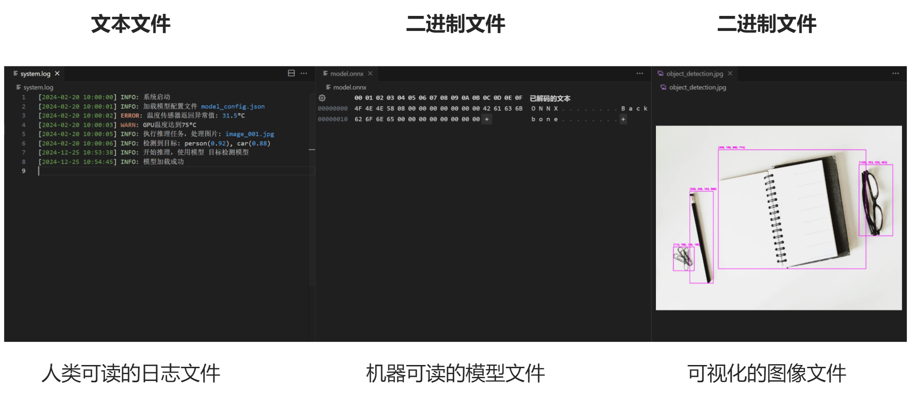
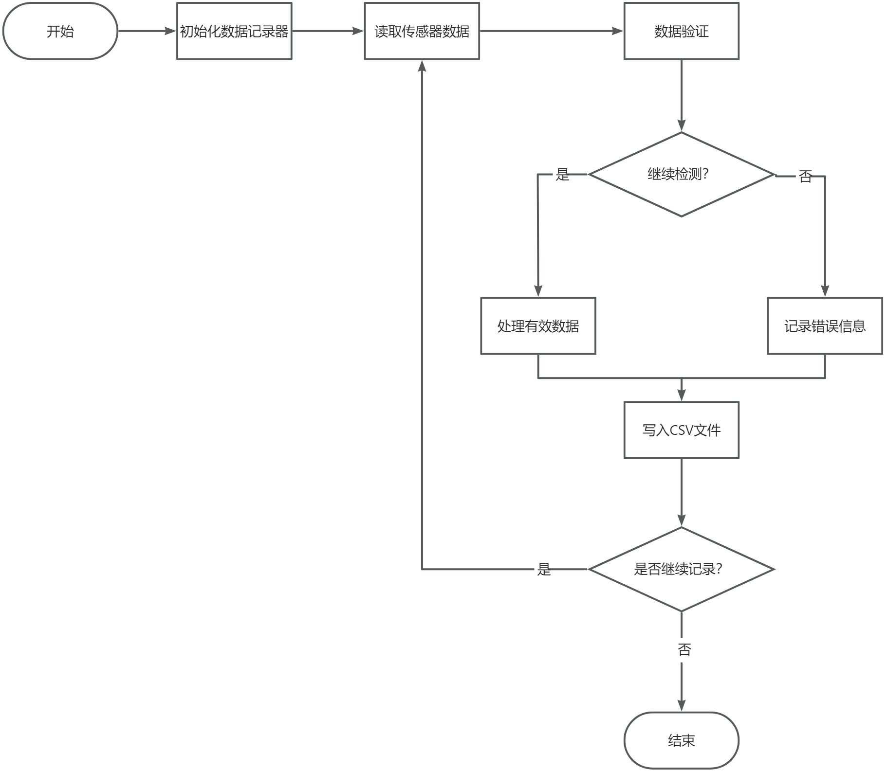
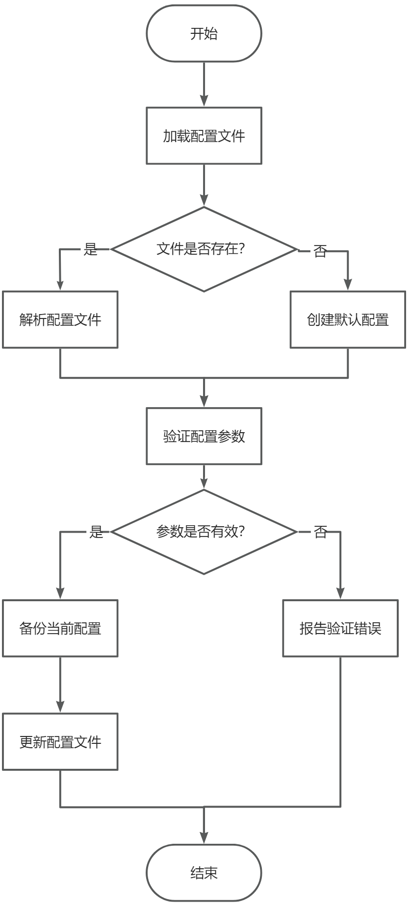

# 第 6 课：Python 文件操作与异常处理

在本课中，我们将学习 Python 中的文件操作和异常处理机制。这些知识对于开发健壮的边缘 AI 应用至关重要。文件操作使我们能够处理配置文件、保存传感器数据和模型文件；而异常处理机制则能帮助我们妥善处理运行过程中可能出现的各种错误，如文件访问失败、数据格式错误、硬件通信中断等，确保系统能够稳定可靠地运行。

## 课程目标

+ 掌握文件的读取和写入操作，能够处理配置文件、日志文件和二进制数据文件
+ 理解异常处理机制，使边缘设备在各种异常情况下能够正常工作
+ 能够编写健壮的文件处理程序，正确处理网络、硬件和系统异常
+ 通过实践案例，如系统日志管理、传感器数据存储等，巩固所学知识

---

在本课程中，我们将使用以下示例文件进行实践：

1. model_config.json (AI 模型配置文件)：

    ```json
    {
        "model_name": "yolov5s",
        "version": "v1.0",
        "input_size": [640, 640],
        "confidence_threshold": 0.5,
        "device": "GPU",
        "classes": ["person", "car", "dog"],
        "anchors": [[10,13], [16,30], [33,23]],
        "last_modified": "2024-02-20 10:00:00"
    }
    ```

2. sensor_data.csv (传感器数据文件)：

    ```plain
    timestamp,temperature,humidity,light,status
    2024-02-20 10:00:00,25.6,45.8,680,OK
    2024-02-20 10:01:00,25.8,46.2,675,OK
    2024-02-20 10:02:00,26.1,46.5,670,OK
    2024-02-20 10:03:00,31.5,47.0,665,ERROR
    2024-02-20 10:04:00,25.9,46.8,668,OK
    ```

3. system.log (系统运行日志文件)：  

    ```plain
    [2024-02-20 10:00:00] INFO: 系统启动
    [2024-02-20 10:00:01] INFO: 加载模型配置文件 model_config.json
    [2024-02-20 10:00:02] ERROR: 温度传感器返回异常值: 31.5°C
    [2024-02-20 10:00:03] WARN: GPU温度达到75°C
    [2024-02-20 10:00:05] INFO: 执行推理任务，处理图片: image_001.jpg
    [2024-02-20 10:00:06] INFO: 检测到目标: person(0.92), car(0.88)
    ```

4. model.onnx (二进制格式的 AI 模型文件)：  

    ```plain
    00000000  4F 4E 4E 58 00 00 00 00  00 00 00 00 00 00 00 00  |ONNX............|
    00000010  08 00 00 00 00 00 00 00  00 00 00 00 00 00 00 00  |................|
    00000020  42 61 63 6B 62 6F 6E 65  00 00 00 00 00 00 00 00  |Backbone........|
    ...
    ```

## 1. 文件操作

### 1.1. 文件路径处理

在边缘人工智能开发过程中，准确地管理文件路径是一项基础却至关重要的任务。鉴于不同操作系统采用不同的路径分隔符（例如，Windows 系统使用反斜杠`\`，而 Linux 与 Unix 系统则采用正斜杠`/`），开发者需特别注意这一点。此外，在选择使用相对路径还是绝对路径时也应谨慎考虑，以确保跨平台兼容性和代码的可维护性。

> **说明</font>**：在 Python 等编程语言中，由于反斜杠 \ 通常用作转义字符（例如 \n 表示换行），因此在代码中需要使用双反斜杠 \\ 来表示实际的反斜杠。例如：</font>
>

```python
'C:\\Users\\username\\project\\config.json'
```

#### 1.1.1. 路径类型

1. **绝对路径**：从根目录开始的完整路径

    ```python
    # Windows系统
    'C:\\Users\\username\\project\\config.json'
    # Linux系统，也就是我们的 Jetson 的 Python 编程
    '/home/username/project/config.json'
    ```

2. **相对路径**：相对于当前工作目录的路径  

    ```python
    # 当前目录下的文件
    'config.json'
    # 上级目录的文件
    '../config.json'
    # 子目录中的文件
    'configs/model_config.json'
    ```

#### 1.1.2. 使用 os.path 处理路径

为了演示不同路径处理方法的使用，让我们通过一个完整的示例来了解如何正确处理文件路径。这个示例将展示如何获取当前目录、构建文件路径、检查文件存在性等常见操作。这些操作在边缘 AI 系统中经常用到，比如需要定位模型文件、配置文件等资源的位置。  

```python
import os

def handle_paths():
# 获取当前脚本所在目录
    current_dir = os.path.dirname(os.path.abspath(__file__))
    print(f"当前目录: {current_dir}")
    
# 构建配置文件的完整路径
    config_path = os.path.join(current_dir, 'config.json')
    print(f"配置文件路径: {config_path}")
    
# 检查文件是否存在
    if os.path.exists(config_path):
        print(f"找到配置文件")
    else:
        print(f"配置文件不存在")
        
# 获取文件所在目录
    file_dir = os.path.dirname(config_path)
    print(f"文件所在目录: {file_dir}")
    
# 获取文件名（带扩展名）
    file_name = os.path.basename(config_path)
    print(f"文件名: {file_name}")
    
# 分离文件扩展名
    name, ext = os.path.splitext(file_name)
    print(f"文件名: {name}, 扩展名: {ext}")

# 运行示例
handle_paths()
```

**运行结果：**

```plain
当前目录: /home/user/projects/edge_ai
配置文件路径: /home/user/projects/edge_ai/config.json
配置文件不存在
文件所在目录: /home/user/projects/edge_ai
文件名: config.json
文件名: config, 扩展名: .json
```

#### 1.1.3. 路径处理最佳实践

在边缘 AI 开发中，正确处理文件路径对于程序的可靠性至关重要。以下是一些推荐的最佳实践及其原因:  

1. **使用**`os.path.join()`

    ```python
    # 不推荐
    path = 'configs' + '/' + 'config.json'

    # 推荐
    path = os.path.join('configs', 'config.json')
    ```

    > 备注：使用`os.path.join()`而不是直接拼接字符串的原因是它能自动处理不同操作系统的路径分隔符('/'或'')，使代码更具可移植性。  
    >

2. **使用相对于脚本的路径**

    ```python
    # 获取脚本所在目录
    base_dir = os.path.dirname(os.path.abspath(__file__))
    config_path = os.path.join(base_dir, 'configs', 'config.json')
    ```

    > 备注：使用相对于脚本的路径而不是硬编码的绝对路径，这样可以确保程序在不同环境下都能正确找到所需文件。  
    >

3. **检查文件存在性**

    ```python
    if not os.path.exists(file_path):
        raise FileNotFoundError(f"找不到文件: {file_path}")
    ```

    > 备注：在访问文件前检查其存在性可以避免运行时错误，提供更友好的错误提示。  
    >

4. **处理目录创建**

    ```python
    os.makedirs('data/logs', exist_ok=True)  # 递归创建目录
    ```

    > 备注：创建目录时使用`exist_ok=True`参数可以避免目录已存在时的报错，使代码更健壮。  
    >

### 1.2. 文件的基本概念

在边缘 AI 开发中，我们经常需要处理多种类型的文件：

+ **文本文件**: 如配置文件(.txt，.json，.yaml)、日志文件(.log)、代码文件(.py)
+ **二进制文件**: 如模型文件(.onnx，.tflite)、图像数据(.jpg， .png)、传感器数据(.bin)

如图 6.1 所示，左侧为文本文件（如日志文件），内容可直接阅读；中间为二进制文件（如模型文件），需要专门程序解析；右侧为图像文件（如.jpg），通常以二进制格式存储，也需要相应程序进行处理。  



> 图 6.1 文件类型对比示意图
>

文件操作是边缘 AI 应用的基础功能之一,让我们能够：

+ 加载和保存模型配置
+ 记录系统运行日志
+ 存储和读取传感器数据
+ 导出分析结果和报告

### 1.3. 文件的打开与关闭

下图展示了文件操作的完整生命周期，从打开文件到执行操作再到关闭文件的过程。



> 图 6.2 文件操作基本流程
>

#### 1.3.1. 打开文件

在边缘 AI 开发中，我们需要使用内置函数 `open()` 来打开各种文件，如模型配置文件、系统日志文件、传感器数据文件等。

**语法：**

```python
file = open(filename, mode, encoding)
```

**参数说明：**

+ `filename`：要打开的文件名（包含路径）
+ `mode`：文件打开模式，默认为 `'r'`（只读）
+ `encoding`：文本文件的编码方式，如 `'utf-8'`

**常见模式：**

| 模式 | 描述 | 边缘AI应用场景 |
| :---: | --- | --- |
| `'r'` | 只读模式 | 读取模型配置文件、加载预训练参数 |
| `'w'` | 写入模式（覆盖） | 保存系统配置、创建新的日志文件 |
| `'a'` | 追加模式 | 记录运行日志、添加新的传感器数据 |
| `'rb'` | 二进制读取 | 读取模型文件、加载图像数据 |
| `'wb'` | 二进制写入 | 保存处理后的图像、导出采集的传感器数据 |

**示例：打开配置文件和日志文件**

```python
# 读取模型配置文件
config_file = open('model_config.json', 'r', encoding='utf-8')

# 追加系统日志
log_file = open('system.log', 'a', encoding='utf-8')

# 读取预训练模型（二进制）
model_file = open('model.onnx', 'rb')
```

#### 1.3.2. 关闭文件

在边缘设备上，资源通常比较有限，因此正确关闭文件非常重要。使用文件对象的 `close()` 方法可以释放系统资源。

```python
# 打开并关闭配置文件
config_file = open('model_config.json', 'r')
# 读取配置...
config_file.close()
```

> **注意：**
>
> + 在资源受限的边缘设备上，未关闭的文件可能占用宝贵的系统资源
> + 文件未正确关闭可能导致数据丢失或损坏
> + 在发生异常时，如果没有正确关闭文件，可能会影响系统稳定性
>

#### 1.3.3. 使用 `with` 语句管理文件

在边缘 AI 应用中，我们推荐使用 `with` 语句来自动管理文件资源，确保文件被正确关闭，即使发生异常也能安全地释放资源。

```python
import json

# 读取模型配置文件
with open('model_config.json', 'r', encoding='utf-8') as config_file:
    config_data = json.load(config_file)
    print("加载模型配置:", config_data)
```

### 1.4. 文件的读取操作

在边缘 AI 系统中，我们经常需要读取各种文件的内容，如模型配置、系统参数、传感器数据等。Python 提供了多种文件读取方法，我们来看看它们的具体应用。

#### 1.4.1. 读取整个文件内容

在边缘 AI  系统开发中，我们经常需要一次性读取一些相对较小的文件，如模型配置或系统参数。使用 `read()` 方法可以一次性读取整个文件内容。以下示例展示了如何读取配置文件和系统日志的完整内容:  

```python
# 读取AI模型配置文件
with open('model_config.json', 'r', encoding='utf-8') as config_file:
    config_content = config_file.read()
    print("加载模型配置:")
    print(config_content)

# 读取系统日志
with open('system.log', 'r', encoding='utf-8') as log_file:
    log_data = log_file.read()
    print("系统日志:", log_data)
```

> **说明：**
>
>+ `read(size=-1)`：读取指定长度的字符，`size` 默认值为 `-1`，表示读取整个文件。
>

**运行结果：**

```plain
加载模型配置:
{
    "模型名称": "目标检测模型",
    "设备类型": "边缘计算单元",
    "状态": "运行中"
}
系统日志: [2024-02-20 10:00:00] INFO: 系统启动
[2024-02-20 10:00:01] INFO: 加载模型配置文件 model_config.json
[2024-02-20 10:00:02] ERROR: 温度传感器返回异常值: 31.5°C
[2024-02-20 10:00:03] WARN: GPU温度达到75°C
[2024-02-20 10:00:05] INFO: 执行推理任务，处理图片: image_001.jpg
[2024-02-20 10:00:06] INFO: 检测到目标: person(0.92), car(0.88)
```

#### 1.4.2. 按行读取文件

在处理日志文件或大型数据文件时，通常需要逐行读取内容。Python 提供了几种按行读取的方法：

1. **使用 **`readline()`** 方法**

    以下示例展示了如何使用`readline()`方法逐行扫描系统日志文件来查找错误记录：

    ```python
    # 读取系统日志文件，查找错误信息
    with open('system.log', 'r', encoding='utf-8') as log_file:
        line = log_file.readline()
        while line:
            if 'ERROR' in line:
                print("发现错误日志:", line.strip())
            line = log_file.readline()
    ```

    **运行结果：**

    ```plain
    发现错误日志: [2024-02-20 10:00:02] ERROR: 温度传感器返回异常值: 31.5°C
    ```

2. **使用 **`readlines()`** 方法**

    有时我们需要一次性获取所有的历史记录进行批量处理。以下示例展示了如何使用`readlines()`方法读取所有传感器历史数据，并筛选出异常记录：

    ```python
    # 读取传感器配置文件的所有历史记录
    with open('sensor_data.csv', 'r') as data_file:
        all_records = data_file.readlines()
        print("传感器历史数据:")
        for record in all_records[1:]:  # 跳过表头
            timestamp, temp, humidity, light, status = record.strip().split(',')
            if status == 'ERROR':
                print(f"发现异常数据: {timestamp} - 温度:{temp}°C")
    ```

    **运行结果：**

    ```plain
    传感器历史数据:
    发现异常数据: 2024-02-20 10:03:00 - 温度:31.5°C
    ```

3. **直接遍历文件对象**

    文件对象本身就是一个可迭代对象，可以直接使用 `for` 循环遍历每一行。在需要对日志文件进行完整扫描和分析时，直接遍历文件对象是最简洁的方式。以下示例展示了如何统计系统日志中的错误和警告数量：

    ```python
    # 分析系统日志中的错误和警告
    error_count = 0
    warning_count = 0
    with open('system.log', 'r', encoding='utf-8') as log_file:
        for line in log_file:
            if 'ERROR' in line:
                error_count += 1
                print(f"错误: {line.strip()}")
            elif 'WARN' in line:
                warning_count += 1
                print(f"警告: {line.strip()}")
    print(f"统计结果: {error_count}个错误, {warning_count}个警告")
    ```

    **运行结果：**

    ```plain
    错误: [2024-02-20 10:00:02] ERROR: 温度传感器返回异常值: 31.5°C
    警告: [2024-02-20 10:00:03] WARN: GPU温度达到75°C
    统计结果: 1个错误, 1个警告
    ```

#### 1.4.3. 读取大文件

在边缘设备上处理大型数据文件时，如传感器采集的原始数据，一次性读取整个文件可能会导致内存溢出。以下示例展示了如何采用分块读取的方式来处理大型传感器数据文件:  

```python
def process_large_sensor_data(chunk_size=1024):
    """分块处理大型传感器数据文件"""
    total_records = 0
    error_records = 0
    
    with open('sensor_data.csv', 'r') as data_file:
# 跳过表头
        header = data_file.readline()
        
        while True:
# 读取一块数据
            chunk = data_file.read(chunk_size)
            if not chunk:
                break
                
# 处理这块数据中的记录
            records = chunk.split('\n')
            for record in records:
                if record:  # 忽略空行
                    total_records += 1
                    if 'ERROR' in record:
                        error_records += 1
                        
    print(f"处理完成: 总记录数 {total_records}, 错误记录数 {error_records}")

process_large_sensor_data()
```

**运行结果：**

```plain
处理完成: 总记录数 5, 错误记录数 1
```

### 1.5. 文件的写入操作

在边缘 AI 系统中，我们经常需要写入各种数据，如系统日志、传感器数据、分析结果等。让我们来看看不同的文件写入方法。

#### 1.5.1. 写入字符串

在边缘 AI 系统运行过程中，我们需要记录各种系统状态和事件。使用 `write()` 方法可以将字符串写入文件。让我们通过一个示例来看看如何将系统状态信息写入日志文件，包括 GPU 温度和内存使用等关键指标：

```python
# 导入所需模块
import time
import random

# 记录系统状态到日志文件
def write_status_example():
# 模拟获取系统状态
    gpu_temp = random.uniform(30, 80)  # 模拟 GPU 温度
    memory_usage = random.uniform(20, 90)  # 模拟内存使用率
    
# 写入状态信息到日志
    with open('system.log', 'a', encoding='utf-8') as log_file:
        timestamp = time.strftime("%Y-%m-%d %H:%M:%S")
        log_file.write(f"[{timestamp}] INFO: GPU温度: {gpu_temp:.1f}°C\n")
        log_file.write(f"[{timestamp}] INFO: 内存使用率: {memory_usage:.1f}%\n")
    
    print("系统状态已记录到 system.log")

# 运行示例
write_status_example()
```

**运行结果：**

```plain
[2024-02-20 15:30:45] INFO: GPU温度: 65.8°C
[2024-02-20 15:30:45] INFO: 内存使用率: 45.3%
系统状态已记录到 system.log
```

#### 1.5.2. 写入多行数据

在记录传感器数据时，经常需要一次写入多行数据。使用 `writelines()` 方法可以一次写入多个字符串。以下示例展示了如何收集多个时间点的传感器读数，并一次性写入到 CSV 文件中：

```python
import random
import time

def save_sensor_data_example():
# 模拟生成传感器数据
    sensor_readings = []
    for _ in range(5):  # 生成5条数据
        timestamp = time.strftime("%H:%M:%S")
        temperature = random.uniform(20, 30)
        humidity = random.uniform(40, 60)
        light = random.uniform(600, 800)
# 创建数据行
        line = f"{timestamp},{temperature:.1f},{humidity:.1f},{light:.1f},OK\n"
        sensor_readings.append(line)
    
# 写入所有数据到CSV文件
    with open('sensor_data.csv', 'a', encoding='utf-8') as data_file:
        data_file.writelines(sensor_readings)
    
    print("传感器数据已保存到 sensor_data.csv")

# 运行示例
save_sensor_data_example()
```

**运行结果：**

```plain
15:31:20,25.6,45.2,650.5,OK
15:31:21,26.1,46.8,675.2,OK
15:31:22,24.8,44.5,662.8,OK
15:31:23,25.2,45.6,658.4,OK
15:31:24,25.9,46.2,671.6,OK
传感器数据已保存到 sensor_data.csv
```

#### 1.5.3. 追加数据

在边缘 AI 系统中，我们经常需要不断追加新的数据，比如系统日志、监控数据等。使用`'a'`模式可以在文件末尾追加内容，而不会清除原有数据。以下示例展示了如何使用追加模式来记录系统运行过程中的各种事件：

```python
import time
import random

def append_log_example():
# 模拟系统运行过程中的日志记录
    for i in range(3):
# 模拟一些系统事件
        event = random.choice(['模型加载', '数据处理', '推理完成'])
        status = random.choice(['成功', '失败'])
        
# 打开文件用追加模式写入日志
        with open('system.log', 'a', encoding='utf-8') as log_file:
            timestamp = time.strftime("%H:%M:%S")
            log_file.write(f"[{timestamp}] INFO: {event}: {status}\n")
        
# 模拟时间间隔
        time.sleep(1)

# 运行示例
append_log_example()
```

**运行结果：**

```plain
[15:32:10] INFO: 模型加载: 成功 
[15:32:11] INFO: 数据处理: 失败
[15:32:12] INFO: 推理完成: 成功
```

#### 1.5.4. 二进制文件操作

在边缘 AI 系统中，我们经常需要处理二进制文件，如:

+ 图像文件(.jpg, .png)：来自摄像头捕获的图像
+ 模型文件(.onnx, .tflite)：用于 AI 推理的深度学习模型
+ 传感器数据(.bin)：采集的原始传感器数据

与文本文件不同，二进制文件存储的是原始的字节数据。处理二进制文件时需要使用 'rb'（二进制读）和 'wb'（二进制写）模式。

在边缘 AI 系统中，我们经常需要处理二进制格式的模型文件。让我们通过一个示例来学习如何读取和分析 ONNX 格式的模型文件，验证其文件格式并提取基本信息：

```python
def analyze_model_file():
    """分析ONNX模型文件"""
    try:
        with open('model.onnx', 'rb') as model_file:
# 读取文件头部标识（前4字节）
            header = model_file.read(4)
            if header == b'ONNX':
                print("确认为ONNX模型文件")
            
# 读取版本信息（接下来的8字节）
            version_info = model_file.read(8)
            print(f"模型信息: {version_info.hex()}")
            
# 读取模型架构名称
            arch_name = model_file.read(16)
# 去掉零字节并解码为UTF-8
            arch_name_str = arch_name.strip(b'\x00').decode('utf-8')
            print(f"模型架构: {arch_name_str}")
            
    except IOError as e:
        print(f"读取模型文件失败: {e}")
    except Exception as e:
        print(f"发生错误: {e}")

# 运行示例
analyze_model_file()
```

**运行结果：**

```plain
确认为ONNX模型文件
模型信息: 0800000000000000
模型架构: Backbone
```

### 1.6. 文件的定位操作

在处理大型数据文件时，我们常常需要控制文件的读写位置。Python 提供了两个方法来实现这一功能：

1. `tell()` 方法：返回当前文件位置（以字节为单位）
2. `seek(offset, whence)` 方法：移动到文件中的指定位置
    + offset：偏移量（字节数）
    + whence：起始位置
        + 0：文件开头（默认）
        + 1：当前位置
        + 2：文件末尾

以下示例展示了如何使用文件定位操作来分析 ONNX 模型文件的结构：

```python
def analyze_model_structure():
    """分析ONNX模型文件的结构"""
    try:
        with open('model.onnx', 'rb') as file:
# 获取文件大小
            file.seek(0, 2)  # 移动到文件末尾
            file_size = file.tell()
            print(f"模型文件大小: {file_size} 字节")
            
# 回到文件开头
            file.seek(0)
            
# 读取文件标识（前4字节）
            header = file.read(4)
            position = file.tell()
            print(f"读取文件标识后的位置: 第 {position} 字节")
            
# 跳过版本信息，直接读取模型架构名称
            file.seek(12)  # 跳过8字节的版本信息
            arch_name = file.read(16).strip(b'\x00').decode('utf-8')
            print(f"模型架构名称: {arch_name}")

    except IOError as e:
        print(f"文件操作错误: {e}")

# 运行示例
analyze_model_structure()
```

**运行结果：**

```plain
模型文件大小: 1052 字节 
读取文件标识后的位置: 第 4 字节
模型架构名称: Backbone
```

这个示例展示了如何:

1. 使用 `seek()` 在文件中移动
2. 使用 `tell()` 获取当前位置
3. 在二进制文件中定位和读取特定的数据段

在实际的边缘 AI 应用中，这些操作对于处理大型数据文件(如视频流、传感器数据流)特别有用。

### 1.7. 文件编码问题

在边缘 AI 系统中，我们经常需要处理不同编码的文件，特别是在处理配置文件、日志文件等文本文件时。正确的文件编码处理对于系统的稳定运行至关重要。

**常见编码类型：**

+ UTF-8：最常用的编码方式，支持所有 Unicode 字符
+ ASCII：基本的英文字符编码
+ GBK/GB2312：中文编码标准

让我们通过一个完整的示例来演示如何正确处理文件编码，以及如何应对各种编码相关的问题：

```python
import time
import json

def save_config_with_encoding():
    """保存配置文件并处理编码问题"""
    # 配置数据
    config = {
        "模型名称": "目标检测模型",
        "设备类型": "边缘计算单元",
        "状态": "运行中"
    }
    
    try:
        with open('model_config.json', 'w', encoding='utf-8') as file:
            json.dump(config, file, ensure_ascii=False, indent=4)
        print("配置已成功保存")
    except UnicodeEncodeError as e:
        print(f"编码错误: {e}")

def handle_system_log_encoding():
    """处理 systemtest.log 文件的编码问题，并将结果写入 system.log"""
    input_filename = 'systemtest.log'  # 读取的文件是 systemtest.log
    output_filename = 'system.log'  # 结果写入的文件是 system.log

    try:
        # 读取 systemtest.log 文件的内容
        with open(input_filename, 'r', encoding='utf-8') as file:
            content = file.read()  # 读取文件的所有内容

    except FileNotFoundError:
        print(f"错误: 文件 {input_filename} 未找到。")
        return
    except UnicodeDecodeError as e:
        print(f"错误: 读取 {input_filename} 时发生编码错误: {e}")
        return

    # 定义四种错误处理策略
    error_handlers = {
        'strict': '严格模式：遇到无法编码的字符时抛出错误',
        'ignore': '忽略模式：跳过无法编码的字符',
        'replace': '替换模式：用“?”替代无法编码的字符',
        'xmlcharrefreplace': 'XML字符引用替换模式：用XML字符引用替代无法编码的字符'
    }

    # 循环遍历所有的错误处理策略，模拟写入并读取 log 文件
    for handler, desc in error_handlers.items():
        try:
            # 使用指定的错误处理方式，写入 system.log
            with open(output_filename, 'a', encoding='ascii', errors=handler) as file:
                # 将时间戳和内容写入日志
                file.write(f"[{time.strftime('%Y-%m-%d %H:%M:%S')}] {content}\n")
            
            # 读取并输出 systemtest.log 文件中的最后一行
            with open(output_filename, 'r', encoding='utf-8') as file:
                last_line = file.readlines()[-1]
            
            # 输出每种错误处理模式的结果
            print(f"{desc} - 结果: {last_line.strip()}")

        except UnicodeEncodeError as e:
            # 如果出现编码错误，打印错误信息
            print(f"{desc} - 错误: {e}")

# 运行示例
save_config_with_encoding()
handle_system_log_encoding()
```

**运行结果：**

```plain
配置已成功保存
严格模式：遇到无法编码的字符时抛出错误 - 错误: 'ascii' codec can't encode characters in position 44-54: ordinal not in range(128)
忽略模式：跳过无法编码的字符 - 结果: [2025-01-06 16:09:32]  4
替换模式：用“?”替代无法编码的字符 - 结果: [2025-01-06 16:09:32] ??????????? 4 ?? ? ????
XML字符引用替换模式：用XML字符引用替代无法编码的字符 - 结果: [2025-01-06 16:09:32] &#26816;&#27979;&#21040;&#24322;&#24120;&#65306;&#28201;&#24230;&#20256;&#24863;&#22120; 4 &#25925;&#38556; &#128680; &#35831;&#27880;&#24847;&#65281;
```

### 1.8. 文件操作的注意事项

在边缘 AI 开发中，正确的文件操作对于系统的稳定性和可靠性至关重要。以下是几个需要特别注意的方面：

1. **资源管理**  
    合理的资源管理可以防止文件句柄泄露，避免系统资源耗尽。始终使用 `with` 语句来自动管理文件资源，它能确保文件在使用完后被正确关闭，即使发生异常也不会导致资源泄露。以下示例对比了使用`with`语句和传统方式管理文件资源的差异：

    ```python
    # 推荐：使用 with 语句自动管理文件资源
    with open('model_config.json', 'r', encoding='utf-8') as file:
        data = file.read()

    # 不推荐：手动打开和关闭文件
    file = open('model_config.json', 'r', encoding='utf-8')
    data = file.read()
    file.close()  # 可能因为异常而未执行到这里
    ```

2. **错误处理**  
    在文件操作中可能遇到多种错误，如文件不存在、权限不足等。应该通过异常处理机制来妥善处理这些错误，确保程序能够优雅地处理各种异常情况。让我们看看如何通过异常处理机制来妥善处理这些常见的错误情况：

    ```python
    def safe_file_operations():
        try:
            with open('config.txt', 'r') as file:
                data = file.read()
                
        except FileNotFoundError:
            print("配置文件不存在，将使用默认配置")
            data = "default_config"
            
        except PermissionError:
            print("没有权限访问文件")
            return None
            
        except OSError as e:
            print(f"操作系统错误: {e}")
            return None

        return data

    safe_file_operations()
    ```

3. **路径处理**  
    在不同的操作系统中，文件路径的表示方式可能不同。应该使用 `os.path` 模块来处理文件路径，这样可以确保程序在不同平台上都能正常工作。以下示例展示了如何使用`os.path`模块来处理跨平台的文件路径问题：

    ```python
    import os

    def handle_file_paths():
    # 使用 os.path 处理文件路径
        current_dir = os.path.dirname(os.path.abspath(__file__))
        config_path = os.path.join(current_dir, 'config')
        
    # 确保目录存在
        if not os.path.exists(config_path):
            os.makedirs(config_path)
            print(f"创建配置目录: {config_path}")

    handle_file_paths()
    ```

4. **大文件处理**  
    在处理大文件时，不应一次性读取整个文件内容，而应该分块读取，这样可以避免内存溢出。特别是在资源受限的边缘设备上，这一点尤为重要。以下示例展示了如何通过分块读取的方式来高效处理大文件：

    ```python
    def read_large_file(filename):
        """高效读取大文件的方法"""
        chunk_size = 1024 * 1024  # 1MB 的块大小
        
        with open(filename, 'rb') as file:
            while True:
                chunk = file.read(chunk_size)
                if not chunk:
                    break
    # 模拟处理每块数据的函数
                print(f"处理了 {len(chunk)} 字节的数据")


    read_large_file("system.log")
    ```

5. **临时文件管理**  
    在处理大量数据时，可能需要使用临时文件。Python 提供了 `tempfile` 模块来安全地创建和管理临时文件。使用完后应该及时清理临时文件，避免占用存储空间。以下示例展示了如何安全地创建和管理临时文件,并确保在使用完后正确清理：

    ```python
    import tempfile
    import os

    def handle_temp_files():
    # 创建临时文件
        with tempfile.NamedTemporaryFile(delete=False) as temp_file:
            temp_file.write("临时数据".encode("utf-8"))
            temp_path = temp_file.name
        
    # 使用完后删除临时文件
        try:
            os.remove(temp_path)
            print("临时文件已删除")
        except OSError as e:
            print(f"删除临时文件失败: {e}")

    handle_temp_files()
    ```

这些注意事项在边缘 AI 应用开发中特别重要，因为边缘设备通常资源有限，需要更加谨慎地管理系统资源。良好的文件操作习惯可以帮助我们开发出更加稳定、可靠的应用程序。

## 2. 异常处理

### 2.1. 异常的基本概念

在边缘 AI 应用中，各种意外情况都可能导致程序出错：

+ 传感器数据读取失败
+ 模型文件加载出错
+ 网络连接中断
+ 系统资源不足

这些错误如果不妥善处理，可能导致整个系统崩溃。Python 提供了异常处理机制来应对这些问题。

异常分为两大类：

1. **语法错误（SyntaxError）**：代码编写不符合 Python 语法规则，在程序运行前就会被检测到。
2. **运行时异常（Runtime Exception）**：程序运行过程中发生的错误。

在边缘 AI 应用中常见的运行时异常包括：

+ `FileNotFoundError`：模型文件或配置文件未找到
+ `MemoryError`：内存不足，无法加载模型
+ `ValueError`：传感器返回的数据格式错误
+ `IOError`：设备 I/O 操作失败
+ `TimeoutError`：网络请求超时

让我们通过一个模型加载的场景来理解异常处理的基本概念。在这个例子中，我们将展示如何处理模型文件不存在、格式不支持等常见错误情况：

```python
import os

# 模拟边缘设备上的常见操作
def load_model(model_path):
    try:
        print(f"正在加载模型: {model_path}")
        if not model_path.endswith('.onnx'):
            raise ValueError("不支持的模型格式")
            
        if not os.path.exists(model_path):
            raise FileNotFoundError("模型文件不存在")
            
# 模拟模型加载
        print("模型加载成功")
        
    except (ValueError, FileNotFoundError) as e:
        print(f"模型加载失败: {e}")
        return None

# 测试不同的错误情况
load_model('model.pb')      # 不支持的格式
load_model('model.onnx')    # 文件不存在
```

**运行结果：**

```plain
正在加载模型: model.pb
模型加载失败: 不支持的模型格式
正在加载模型: model.onnx
模型加载成功
```

### 2.2. 异常处理的必要性

在边缘 AI 系统中，异常处理尤为重要，原因如下：

1. **保证系统稳定性**
    + 避免单个错误导致整个系统崩溃
    + 确保关键服务持续运行
2. **数据安全性**
    + 确保文件操作正确完成
    + 防止数据丢失或损坏
3. **便于维护和调试**
    + 提供清晰的错误信息
    + 帮助快速定位问题

为了理解异常处理的重要性，让我们对比两种数据采集方法的差异：一种没有异常处理，另一种实现了完整的异常处理机制。通过这个对比，我们可以清楚地看到异常处理对系统稳定性的重要影响：

```python
import random
import time

def collect_sensor_data():
    """不使用异常处理的版本"""
    sensor_value = random.randint(0, 100)
# 这种写法可能导致程序崩溃
    with open('sensor_data.txt', 'w') as file:
        file.write(str(sensor_value))

def collect_sensor_data_safe():
    """使用异常处理的版本"""
    try:
# 模拟传感器读数
        sensor_value = random.randint(0, 100)
        
# 保存数据
        with open('sensor_data.txt', 'w') as file:
            file.write(str(sensor_value))
        print(f"数据采集成功：{sensor_value}")
            
    except PermissionError:
        print("错误：没有写入文件的权限")
        return False
    except OSError as e:
        print(f"错误：数据保存失败 - {e}")
        return False
    except Exception as e:
        print(f"发生未知错误：{e}")
        return False
    
    return True

# 测试两种方法
print("测试不安全的方法：")
collect_sensor_data()  # 可能会崩溃

print("\n测试安全的方法：")
collect_sensor_data_safe()  # 会妥善处理错误
```

**运行结果：**

```plain
测试不安全的方法：

测试安全的方法：
数据采集成功：80
```

### 2.3. 异常处理的基本语法

Python 提供了 `try`-`except`-`else`-`finally` 结构来处理异常。这个结构在边缘 AI 应用中非常有用，可以让我们优雅地处理各种错误情况。

下图展示了 try-except-else-finally 结构的执行流程，以及不同情况下代码块的执行顺序。



> 图 6.3 异常处理结构流程图
>

**基本语法结构：**

```python
try:
# 可能发生异常的代码
    pass
except SpecificError as e:
# 处理特定类型的异常
    pass
except Exception as e:
# 处理其他所有类型的异常
    pass
else:
# 当没有异常发生时执行的代码
    pass
finally:
# 无论是否发生异常都会执行的代码
    pass
```

让我们通过一个完整的数据处理示例来学习异常处理的基本语法结构。这个例子将展示如何使用 try-except-else-finally 来处理文件操作和数据处理过程中可能出现的各种错误情况：

```python
def load_and_process_data(file_path):
    """加载和处理数据的示例函数"""
    try:
        print(f"尝试打开文件：{file_path}")
        with open(file_path, 'r') as file:
            data = file.read()
# 模拟数据处理
            value = float(data)
            processed = value * 2
            
    except FileNotFoundError:
        print("错误：找不到指定的数据文件")
        return None
        
    except ValueError as e:
        print(f"错误：数据格式无效 - {e}")
        return None
        
    except Exception as e:
        print(f"发生未知错误：{e}")
        return None
        
    else:
        print("数据处理成功！")
        return processed
        
    finally:
        print("数据处理操作完成")

# 测试函数
print("测试1：文件不存在")
result = load_and_process_data('nonexistent.txt')

print("\n测试2：无效数据")
with open('test.txt', 'w') as f:
    f.write('invalid data')
result = load_and_process_data('test.txt')

print("\n测试3：正常数据")
with open('test.txt', 'w') as f:
    f.write('42')
result = load_and_process_data('test.txt')
```

**运行结果：**

```plain
测试1：文件不存在
尝试打开文件：nonexistent.txt
错误：找不到指定的数据文件
数据处理操作完成

测试2：无效数据
尝试打开文件：test.txt
错误：数据格式无效 - could not convert string to float: 'invalid data'
数据处理操作完成

测试3：正常数据
尝试打开文件：test.txt
数据处理成功！
数据处理操作完成
```

### 2.4. 捕获特定异常

在边缘设备监控中，我们需要处理不同类型的异常情况，如温度过高、配置错误等。以下示例展示了如何针对不同类型的异常采取相应的处理措施，实现精细化的异常管理：

```python
import os
import time
import random
import json

def monitor_device_status():
    """监控设备状态的示例函数"""
    try:
# 1. 读取配置文件
        with open('model_config.json', 'r', encoding='utf-8') as f:
            config = json.load(f)
            
# 2. 检查 GPU 温度
        temperature = random.uniform(30, 90)
        if temperature > 80:
            raise ValueError(f"GPU温度过高: {temperature:.1f}°C")
            
# 3. 记录状态
        with open('system.log', 'a', encoding='utf-8') as log_file:
            timestamp = time.strftime("%Y-%m-%d %H:%M:%S")
            log_file.write(f"[{timestamp}] INFO: GPU温度: {temperature:.1f}°C\n")
            log_file.write(f"[{timestamp}] INFO: 模型版本: {config['version']}\n")
            
    except ValueError as e:
        print(f"温度警告: {e}")
        return "temperature_warning"
        
    except json.JSONDecodeError as e:
        print(f"配置文件格式错误: {e}")
        return "config_error"
        
    except IOError as e:
        print(f"文件操作错误: {e}")
        return "file_error"
    
    except Exception as e:
        print(f"未知错误: {e}")
        return "unknown_error"

# 测试函数
for _ in range(3):
    status = monitor_device_status()
    print(f"设备状态: {status}\n")
    time.sleep(1)

```

**运行结果：**

```plain
设备状态: None

设备状态: None

温度警告: GPU温度过高: 82.0°C
设备状态: temperature_warning
```

### 2.5. 捕获所有异常

在进行 AI 模型推理时，可能会遇到各种预期内和预期外的错误。以下示例展示了如何构建一个健壮的推理函数，它能够妥善处理所有可能的异常情况，并保持适当的日志记录：

```python
import time
import json
import numpy as np

def process_image(image_data):
    """模拟图像处理函数"""
    if not isinstance(image_data, np.ndarray):
        raise ValueError("image_data 必须是 numpy 数组")
# 简单的模拟推理结果：计算平均值
    return {"prediction": np.mean(image_data)}

def safe_model_inference(image_data):
    """安全的模型推理函数"""
    try:
        print(f"开始处理图像数据...")

# 1. 读取模型配置
        try:
            with open('model_config.json', 'r', encoding='utf-8') as f:
                config = json.load(f)
        except FileNotFoundError:
            raise FileNotFoundError("配置文件 model_config.json 不存在")
        except json.JSONDecodeError:
            raise ValueError("配置文件格式错误，无法解析 JSON")
        
# 2. 加载模型文件
        try:
            with open('model.onnx', 'rb') as f:
                if f.read(4) != b'ONNX':
                    raise ValueError("无效的模型文件格式")
        except FileNotFoundError:
            raise FileNotFoundError("模型文件 model.onnx 不存在")

# 3. 记录推理过程
        with open('system.log', 'a', encoding='utf-8') as f:
            timestamp = time.strftime("%Y-%m-%d %H:%M:%S")
            f.write(f"[{timestamp}] INFO: 开始推理，使用模型 {config['模型名称']}\n")
        
# 4. 模拟推理过程
        result = process_image(image_data)
        print("推理完成，结果:", result)
        
        return result

    except Exception as e:
        print(f"推理过程出错: {str(e)}")
        print(f"错误类型: {type(e).__name__}")

# 记录错误日志
        with open('system.log', 'a', encoding='utf-8') as f:
            timestamp = time.strftime("%Y-%m-%d %H:%M:%S")
            f.write(f"[{timestamp}] ERROR: 推理失败 - {str(e)}\n")
        
        return None

def process_image(image_data):
    """模拟图像处理函数"""
    if not isinstance(image_data, np.ndarray):
        raise ValueError("image_data 必须是 numpy 数组")
# 简单的模拟推理结果：计算平均值
    return {"prediction": np.mean(image_data)}

# 示例运行
if __name__ == "__main__":
# 创建示例输入
    image_data = np.random.rand(224, 224, 3)  # 假设输入是 224x224 RGB 图像
    safe_model_inference(image_data)
```

**运行结果：**

```plain
开始处理图像数据...
推理完成，结果: {'prediction': np.float64(0.5011085695109917)}
```

### 2.6. 使用 `else` 和 `finally`

在边缘 AI 应用中，`else` 和 `finally` 子句能帮助我们更好地控制程序流程和资源管理。

#### 2.6.1. `else` 块

在处理传感器数据时，我们常常需要在成功读取数据后进行后续处理。以下示例展示了如何使用`else`块来处理正常情况下的数据转换操作：

```python
import random

def process_sensor_reading():
    """处理传感器读数"""
    try:
# 模拟读取传感器数据
        reading = random.uniform(20, 30)
        if reading < 0:
            raise ValueError("传感器读数异常")
            
    except ValueError as e:
        print(f"错误：{e}")
        return None
        
    else:
# 数据读取成功后的处理
        print("数据读取成功，开始处理...")
        processed_value = reading * 1.8 + 32  # 转换为华氏度
        print(f"处理结果：{processed_value:.2f}°F")
        return processed_value

# 测试函数
for _ in range(3):
    result = process_sensor_reading()
    if result:
        print(f"成功获取并处理数据\n")
    else:
        print(f"数据处理失败\n")
```

**运行结果：**

```plain
数据读取成功，开始处理...
处理结果：70.90°F
成功获取并处理数据

数据读取成功，开始处理...
处理结果：69.65°F
成功获取并处理数据

数据读取成功，开始处理...
处理结果：78.97°F
成功获取并处理数据
```

#### 2.6.2. `finally` 块

`finally` 块无论是否发生异常都会执行，通常用于资源清理工作。在使用摄像头等硬件资源时，无论操作是否成功，都需要确保资源被正确释放。以下示例展示了如何使用`finally`块来确保摄像头资源的正确释放：

```python
import random

def capture_camera_image():
    """模拟摄像头捕获图像"""
    camera = None
    try:
        print("正在初始化摄像头...")
        camera = "camera_device"  # 模拟摄像头对象
        
# 模拟可能的错误
        if random.random() < 0.5:
            raise IOError("图像捕获失败")
            
        print("成功捕获图像")
        return "image_data"
        
    except IOError as e:
        print(f"错误：{e}")
        return None
        
    finally:
# 无论是否成功，都确保释放摄像头资源
        if camera:
            print("正在关闭摄像头...")
            camera = None
            print("摄像头已关闭")

# 测试函数
for _ in range(2):
    print("\n尝试捕获图像...")
    result = capture_camera_image()
    if result:
        print("图像获取成功")
    else:
        print("图像获取失败")
```

**运行结果：**

```plain
尝试捕获图像...
正在初始化摄像头...
错误：图像捕获失败
正在关闭摄像头...
摄像头已关闭
图像获取失败

尝试捕获图像...
正在初始化摄像头...
错误：图像捕获失败
正在关闭摄像头...
摄像头已关闭
图像获取失败
```

### 2.7. 自定义异常

有时候标准的异常类型可能无法准确描述我们的特定错误情况。通过自定义异常类，我们可以更精确地描述和处理这些特定的错误。以下示例展示了如何定义和使用自定义异常来处理模型相关的错误：

```python
import json
import time
import random
import os

class ModelError(Exception):
    """AI模型相关错误的基类"""
    pass

class ModelLoadError(ModelError):
    """模型加载错误"""
    pass

class InferenceError(ModelError):
    """推理过程错误"""
    pass

class ConfigError(ModelError):
    """配置文件错误"""
    pass

def load_and_verify_model():
    """加载和验证AI模型"""
    try:
# 1. 读取配置
        with open('model_config.json', 'r', encoding='utf-8') as f:
            try:
                config = json.load(f)
            except json.JSONDecodeError:
                raise ConfigError("配置文件格式无效")
        
# 2. 检查模型文件
        if not os.path.exists('model.onnx'):
            raise ModelLoadError("模型文件不存在")
            
# 3. 验证模型文件格式
        with open('model.onnx', 'rb') as f:
            if f.read(4) != b'ONNX':
                raise ModelLoadError("不支持的模型格式")
            
# 4. 模拟模型加载
        print(f"正在加载模型: model.onnx")
        time.sleep(1)  # 模拟加载过程
        
# 5. 模拟推理测试
        if random.random() < 0.3:  # 30%概率失败
            raise InferenceError("模型推理测试失败")
            
# 6. 记录成功日志
        with open('system.log', 'a', encoding='utf-8') as f:
            timestamp = time.strftime("%Y-%m-%d %H:%M:%S")
            f.write(f"[{timestamp}] INFO: 模型加载成功\n")
            
        print("模型加载成功")
        
    except ModelLoadError as e:
        print(f"模型加载错误: {e}")
        return None
    except InferenceError as e:
        print(f"推理错误: {e}")
        return None
    except ConfigError as e:
        print(f"配置错误: {e}")
        return None
    except Exception as e:
        print(f"未知错误: {e}")
        return None

# 运行示例
load_and_verify_model()
```

**运行结果：**

```plain
# 预期输出可能是：
正在加载模型: model.onnx
模型加载成功

# 或者是：
正在加载模型: model.onnx
推理错误: 模型推理测试失败
```

### 2.8. 异常的传递性

下图说明了异常如何从内层函数逐级向外传递，直到被适当的异常处理程序捕获的过程。  



> 图 6.4 异常传递机制示意图
>

在边缘 AI 系统中，程序通常由多个层级的函数调用组成。如果在某个函数中发生的异常没有被处理，它会沿着调用栈向上传递，直到被捕获或导致程序终止。让我们通过一个数据处理的例子来理解异常是如何在不同函数层级之间传递的，以及如何在适当的层级捕获和处理这些异常：

```python
def process_data(data):
    """数据处理函数"""
    if not isinstance(data, (int, float)):
        raise TypeError("数据类型必须是数字")
    return data * 2

def validate_data(data):
    """数据验证函数"""
    return process_data(data)

def run_inference():
    """推理函数"""
    try:
# 调用链：run_inference -> validate_data -> process_data
        result = validate_data("invalid_data")  # 将引发异常
        print(f"推理结果：{result}")
        
    except TypeError as e:
        print(f"数据验证失败：{e}")
    except Exception as e:
        print(f"发生未知错误：{e}")

# 测试异常传递
print("测试1：传入无效数据")
run_inference()

print("\n测试2：传入有效数据")
try:
    result = validate_data(42)
    print(f"处理结果：{result}")
except Exception as e:
    print(f"处理失败：{e}")
```

**运行结果：**

```plain
测试1：传入无效数据
数据验证失败：数据类型必须是数字

测试2：传入有效数据
处理结果：84
```

> 这个例子展示了：
>
> 1. 异常如何从 `process_data` 函数传递到 `validate_data`，最终在 `run_inference` 被捕获
> 2. 如果不处理异常，它会一直向上传递直到遇到适当的异常处理代码
> 3. 在边缘 AI 应用中，合理利用异常传递可以在合适的层级处理错误，使代码结构更清晰
>

## 3. 实践案例

### 3.1. 案例一：边缘设备传感器数据记录器

#### 3.1.1. 案例描述

开发一个用于边缘设备的传感器数据记录系统，需要实现以下功能：

1. 从多个传感器（温度、湿度、光照）读取数据，并进行基本的数据验证
2. 将验证后的数据按照指定格式（CSV）保存到文件中
3. 妥善处理所有可能的异常情况：
    + 传感器读取失败
    + 数据格式错误
    + 文件操作错误
    + 存储空间不足
4. 保持数据记录的连续性，即使某个传感器失败也不影响其他传感器的数据记录

#### 3.1.2. 流程图



> 图 6.5 传感器数据记录流程图
>

#### 3.1.3. AI 辅助编程

让我们使用 AI 助手来帮助实现这个系统。我们可以这样描述需求：

> 请帮我实现一个边缘设备的传感器数据记录系统，具体需求如下：
>
> 1. 需要处理三种传感器的数据：
>     + 温度传感器（20-30°C）
>     + 湿度传感器（40-60%）
>     + 光照传感器（200-800 lux）
> 2. 系统功能要求：
>     + 定期读取所有传感器数据
>     + 数据验证（检查是否在合理范围内）
>     + 将数据以 CSV 格式保存到文件
>     + 异常处理（传感器错误、文件操作错误等）
> 3. 具体实现要求：
>     + 使用类来组织代码
>     + 实现完善的异常处理机制
>     + 清晰的日志输出
>     + 优雅的错误恢复机制
>
> 请提供完整的Python代码实现。
>

根据需求，AI 助手生成的代码如下：

```python
import time
import random
import os
from datetime import datetime

class SensorReadError(Exception):
    """自定义传感器读取异常"""
    pass

class DataValidationError(Exception):
    """自定义数据验证异常"""
    pass

class SensorDataRecorder:
    def __init__(self, log_file='sensor_data.csv'):
        """初始化数据记录器"""
        self.log_file = log_file
# 定义传感器参数：(最小值, 最大值, 单位)
        self.sensors = {
            'temperature': (20, 30, '°C'),
            'humidity': (40, 60, '%'),
            'light': (200, 800, 'lux')
        }
        self._init_log_file()
    
    def _init_log_file(self):
        """初始化日志文件，创建CSV头部"""
        try:
            if not os.path.exists(self.log_file):
                with open(self.log_file, 'w', encoding='utf-8') as f:
                    headers = ['timestamp', 'sensor', 'value', 'unit', 'status']
                    f.write(','.join(headers) + '\n')
                print(f"创建数据记录文件: {self.log_file}")
            else:
                print(f"使用已存在的记录文件: {self.log_file}")
        except IOError as e:
            print(f"初始化日志文件失败: {e}")
            raise

    def read_sensor(self, sensor_type):
        """读取传感器数据并进行验证"""
        if sensor_type not in self.sensors:
            raise ValueError(f"未知的传感器类型: {sensor_type}")

# 模拟传感器读数
        try:
            min_val, max_val, _ = self.sensors[sensor_type]
            value = random.uniform(min_val - 5, max_val + 5)  # 允许一定范围的越界值

# 模拟传感器故障（10%概率）
            if random.random() < 0.1:
                raise SensorReadError("传感器通信失败")

# 数据验证
            if not (min_val <= value <= max_val):
                raise DataValidationError(
                    f"数值超出正常范围 [{min_val}, {max_val}]")

            return value

        except (SensorReadError, DataValidationError) as e:
            raise
        except Exception as e:
            raise SensorReadError(f"读取失败: {str(e)}")

    def record_data(self):
        """记录一次完整的数据采集"""
        timestamp = datetime.now().strftime("%Y-%m-%d %H:%M:%S")
        records = []

# 读取每个传感器的数据
        for sensor_type in self.sensors:
            try:
                value = self.read_sensor(sensor_type)
                status = "OK"
            except (SensorReadError, DataValidationError) as e:
                value = None
                status = f"ERROR: {str(e)}"
                print(f"警告: {sensor_type} - {str(e)}")
            
# 准备记录内容
            min_val, max_val, unit = self.sensors[sensor_type]
            record = {
                'timestamp': timestamp,
                'sensor': sensor_type,
                'value': f"{value:.2f}" if value is not None else "NULL",
                'unit': unit,
                'status': status
            }
            records.append(record)

# 写入数据记录
        try:
            with open(self.log_file, 'a', encoding='utf-8') as f:
                for record in records:
                    line = ','.join([str(record[key]) for key in 
                        ['timestamp', 'sensor', 'value', 'unit', 'status']])
                    f.write(line + '\n')
            print(f"成功记录 {len(records)} 个传感器的数据")
        except IOError as e:
            print(f"写入数据记录失败: {e}")

def main():
    """主函数：运行数据记录器"""
    recorder = SensorDataRecorder()
    count = 1
    
    print("启动传感器数据记录系统...\n")
    try:
        while True:
            print(f"\n第 {count} 次数据采集:")
            recorder.record_data()
            count += 1
            time.sleep(2)  # 每2秒采集一次数据
            
    except KeyboardInterrupt:
        print("\n\n数据记录已停止")
    except Exception as e:
        print(f"\n系统错误: {e}")
    finally:
        print("系统已关闭")

if __name__ == "__main__":
    main()
```

**运行结果：**

```plain
使用已存在的记录文件: sensor_data.csv
启动传感器数据记录系统...


第 1 次数据采集:
警告: temperature - 数值超出正常范围 [20, 30]
成功记录 3 个传感器的数据

第 2 次数据采集:
成功记录 3 个传感器的数据

第 3 次数据采集:
警告: temperature - 数值超出正常范围 [20, 30]
警告: humidity - 数值超出正常范围 [40, 60]
成功记录 3 个传感器的数据

第 4 次数据采集:
成功记录 3 个传感器的数据

第 5 次数据采集:
警告: temperature - 数值超出正常范围 [20, 30]
警告: humidity - 数值超出正常范围 [40, 60]
成功记录 3 个传感器的数据

第 6 次数据采集:
警告: temperature - 数值超出正常范围 [20, 30]
成功记录 3 个传感器的数据

第 7 次数据采集:
成功记录 3 个传感器的数据


数据记录已停止
系统已关闭
```

### 3.2. 案例二：AI 模型配置管理器

#### 3.2.1. 案例描述

开发一个用于管理边缘 AI 设备上深度学习模型配置的系统，需要实现以下功能：

1. 读取和验证模型配置文件（支持 JSON 格式）
2. 允许动态更新配置参数
3. 自动备份配置文件
4. 完善的错误处理：
    + 配置文件格式错误
    + 参数验证失败
    + 文件操作错误
    + 备份失败处理

#### 3.2.2. 流程图



> 图 6.6 AI 模型配置管理流程图
>

#### 3.2.3. AI 辅助编程

让我们向 AI 助手描述需求：

> 请帮我实现一个 AI 模型配置管理系统，我们将使用课程开始提供的 model_config.json 文件作为基础配置文件，其内容为：
>
>
>

```plain
{
    "model_name": "yolov5s",
    "version": "v1.0",
    "input_size": [640, 640],
    "confidence_threshold": 0.5,
    "device": "GPU",
    "classes": ["person", "car", "dog"],
    "anchors": [[10,13], [16,30], [33,23]],
    "last_modified": "2024-02-20 10:00:00"
}
```

> 具体需求如下：
>
> 1. 配置文件要求：
>     + 使用 JSON 格式存储配置
>     + 支持基本的模型参数（输入尺寸、阈值等）
>     + 支持配置文件的验证和备份
> 2. 系统功能：
>     + 读取和解析配置文件
>     + 验证配置参数的有效性
>     + 支持更新配置
>     + 自动备份配置文件
> 3. 具体要求：
>     + 完善的异常处理机制
>     + 配置参数的合法性验证
>     + 配置文件的版本控制
>     + 清晰的日志输出
>
> 请提供完整的 Python 代码实现。
>

基于需求，AI 助手生成的代码如下：

```python
import os
import json
import shutil
import logging
from datetime import datetime

# 设置日志
logging.basicConfig(level=logging.INFO, format='%(asctime)s - %(levelname)s - %(message)s')

class ModelConfigManager:
    def __init__(self, config_file_path):
        self.config_file_path = config_file_path
        self.backup_folder = "backups"
        self.config = None
        self.load_config()

    def load_config(self):
        """读取配置文件并解析"""
        try:
            if not os.path.exists(self.config_file_path):
                raise FileNotFoundError(f"配置文件 {self.config_file_path} 未找到")
            
            with open(self.config_file_path, 'r', encoding='utf-8') as f:
                self.config = json.load(f)
            
            logging.info("成功加载配置文件")
            self.validate_config()

        except Exception as e:
            logging.error(f"加载配置文件时发生错误: {e}")
            raise

    def validate_config(self):
        """验证配置文件的有效性"""
        try:
# 验证必需的参数
            required_keys = ["model_name", "version", "input_size", "confidence_threshold", "device", "classes", "anchors", "last_modified"]
            for key in required_keys:
                if key not in self.config:
                    raise ValueError(f"配置文件缺少必要的参数: {key}")

# 验证 input_size 是否为两个正整数
            if not isinstance(self.config["input_size"], list) or len(self.config["input_size"]) != 2:
                raise ValueError("input_size 必须是包含两个正整数的列表")
            if not all(isinstance(x, int) and x > 0 for x in self.config["input_size"]):
                raise ValueError("input_size 中的元素必须是正整数")
            
# 验证 confidence_threshold 是否是介于 0 和 1 之间的浮动值
            if not (0 <= self.config["confidence_threshold"] <= 1):
                raise ValueError("confidence_threshold 必须介于 0 和 1 之间")

# 验证 device 是否是合法的设备名
            if self.config["device"] not in ["CPU", "GPU"]:
                raise ValueError("device 必须是 'CPU' 或 'GPU'")

# 验证 classes 是否为非空列表
            if not isinstance(self.config["classes"], list) or len(self.config["classes"]) == 0:
                raise ValueError("classes 必须是一个非空的列表")

# 验证 anchors 是否是合法的二维列表
            if not isinstance(self.config["anchors"], list) or len(self.config["anchors"]) == 0:
                raise ValueError("anchors 必须是一个非空的二维列表")
            for anchor in self.config["anchors"]:
                if not isinstance(anchor, list) or len(anchor) != 2 or not all(isinstance(x, int) for x in anchor):
                    raise ValueError("anchors 中的每个元素必须是包含两个整数的列表")

# 验证 last_modified 格式
            try:
                datetime.strptime(self.config["last_modified"], "%Y-%m-%d %H:%M:%S")
            except ValueError:
                raise ValueError("last_modified 格式不正确，应为 'YYYY-MM-DD HH:MM:SS'")

            logging.info("配置文件验证通过")

        except ValueError as e:
            logging.error(f"配置验证失败: {e}")
            raise

    def update_config(self, key, value):
        """更新配置文件中的某个参数"""
        try:
            if key not in self.config:
                raise KeyError(f"配置文件中不存在键 {key}")
            
            self.config[key] = value
            logging.info(f"成功更新配置项: {key} = {value}")
            self.backup_config()  # 更新配置时自动备份
            self.save_config()

        except Exception as e:
            logging.error(f"更新配置时发生错误: {e}")
            raise

    def save_config(self):
        """保存更新后的配置到文件"""
        try:
            with open(self.config_file_path, 'w', encoding='utf-8') as f:
                json.dump(self.config, f, ensure_ascii=False, indent=4)
            logging.info("成功保存更新后的配置文件")
        except Exception as e:
            logging.error(f"保存配置文件时发生错误: {e}")
            raise

    def backup_config(self):
        """备份配置文件"""
        try:
            if not os.path.exists(self.backup_folder):
                os.makedirs(self.backup_folder)
            
# 创建备份文件名，包含当前时间戳
            timestamp = datetime.now().strftime("%Y%m%d_%H%M%S")
            backup_file = os.path.join(self.backup_folder, f"config_backup_{timestamp}.json")
            shutil.copy(self.config_file_path, backup_file)
            logging.info(f"成功备份配置文件到 {backup_file}")

        except Exception as e:
            logging.error(f"备份配置文件时发生错误: {e}")
            raise


# 示例用法
if __name__ == "__main__":
    config_file = "model_config.json"
    
    try:
        config_manager = ModelConfigManager(config_file)
        
# 示例：更新配置
        config_manager.update_config("confidence_threshold", 0.6)
        
    except Exception as e:
        logging.error(f"配置管理系统发生错误: {e}")

```

**运行结果示例：**

```plain
2024-12-25 11:33:43,847 - INFO - 成功加载配置文件
2024-12-25 11:33:43,850 - INFO - 配置文件验证通过
2024-12-25 11:33:43,850 - INFO - 成功更新配置项: confidence_threshold = 0.6
2024-12-25 11:33:43,855 - INFO - 成功备份配置文件到 backups\config_backup_20241225_113343.json
2024-12-25 11:33:43,856 - INFO - 成功保存更新后的配置文件
```

---

## 4. 总结

通过本课的学习，我们掌握了 Python 中文件操作和异常处理的核心知识。我们学会了如何打开、读取和写入文件，处理文本和二进制数据，并使用异常处理机制来提高程序的健壮性。通过实践案例，如传感器数据记录系统和 AI 模型配置管理器，我们将这些知识应用到了实际的边缘 AI 开发场景中。这些技能将帮助我们开发出更加可靠和专业的边缘 AI 应用程序。

## 5. 课后拓展

+ **阅读材料**
  + [Python 官方文档 - 文件与 I/O](https://docs.python.org/zh-cn/3/tutorial/inputoutput.html)
  + [Python 官方文档 - 异常处理](https://docs.python.org/zh-cn/3/tutorial/errors.html)
+ **实践练习**
    1. **系统日志分析器**

        **任务描述：**
        + 编写一个程序，用于分析边缘设备的系统日志文件，实现以下功能：
            + 读取并解析日志文件内容
            + 统计不同类型错误的出现频率
            + 识别严重的错误模式
            + 生成分析报告
        + 要求能够处理大型日志文件，注意内存使用效率
        + 正确处理文件操作和数据处理过程中可能出现的异常

        **提示：**
        + 使用 `with` 语句安全地打开和处理文件
        + 逐行读取文件内容，避免一次性加载大文件
        + 使用字典存储错误统计信息
        + 通过异常处理机制处理文件操作错误

    2. **模型性能记录器**

        **任务描述：**

        + 创建一个工具记录 AI 模型在边缘设备上的性能数据：
            + 记录每次推理的执行时间
            + 记录推理结果的准确率
            + 记录资源使用情况（内存、CPU使用率等）
            + 定期生成性能报告
        + 实现数据的持久化存储
        + 能够处理记录过程中的异常情况

        **提示：**

        + 使用 CSV 格式存储性能数据
        + 定期备份性能记录文件
        + 实现数据记录的异常处理和恢复机制
        + 使用合适的数据结构组织性能指标

    3. **配置文件比较工具**

        **任务描述：**

        + 开发一个工具用于比较两个 AI 模型配置文件的差异：
            + 支持比较不同版本的配置文件
            + 识别新增、删除和修改的配置项
            + 生成详细的差异报告
            + 提供配置迁移建议
        + 支持 JSON 格式的配置文件
        + 正确处理配置文件的格式错误和访问错误

        **提示：**

        + 使用 JSON 模块处理配置文件
        + 实现深度比较以处理嵌套的配置项
        + 生成清晰的差异报告
        + 处理配置文件读取和解析时的异常

        <br>

        参考答案：[06-Python 文件操作与异常处理课后题参考答案](https://github.com/Seeed-Studio/Seeed_Studio_Courses/blob/Edge-AI-101-with-Nvidia-Jetson-Course/docs/cn/1/06/Homework_Answer.md)