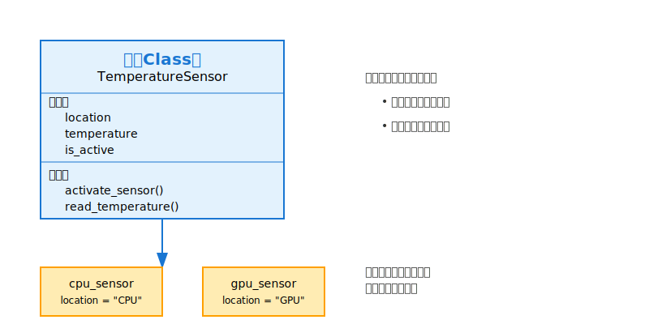
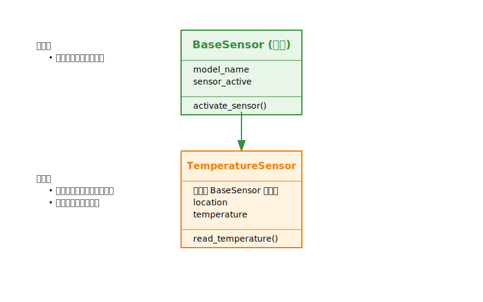

# 第 7 课：Python 综合实践

在本课中，我们将深入学习 Python 的面向对象编程（OOP）基础概念。面向对象编程是一种强大的编程范式，能够帮助我们在边缘 AI 开发中更有效地组织和管理代码。通过开发一个简单的“设备状态监控器”项目，我们将实际应用面向对象编程的知识，为后续开发更复杂的智能监控系统打下坚实的基础。

## 课程目标

+ 理解类和对象的基本概念，学习面向对象编程的核心思想
+ 掌握如何定义类、创建对象，设置属性和方法
+ 通过设备状态监控的示例，实践面向对象编程的基本技巧
+ 运用所学知识，结合 AI 辅助工具完成代码编写和优化

---

## 1. 面向对象编程基础

### 1.1. 类和对象的基本概念

#### 1.1.1. 什么是类

**类（Class）** 是面向对象编程（OOP）的核心概念之一。可以将类理解为一个模板或蓝图，用于创建具有相似属性和行为的对象。类定义了对象的属性（数据）和方法（操作），但本身并不是一个具体的实例。  

1. **类的组成部分**

    + **属性（Attributes）**：
        + 描述对象的状态或特征。
        + 类属性是所有对象共享的，而实例属性是每个对象独有的。
    + **方法（Methods）**：
        + 描述对象的行为或操作。
        + 类方法和实例方法的区别在于，实例方法需要通过对象调用，而类方法可以通过类本身调用。

2. **类的示例讲解**

    让我们通过一个具体的例子来理解类的概念。假设我们要创建一个用于让我们通过一个简单的例子来理解类的概念。想象一下我们要开发一个温度监控系统，需要创建温度传感器来测量设备的温度。这个温度传感器需要具备以下功能：

    + 能够记录传感器的安装位置（比如 CPU 或 GPU）
    + 能够存储当前测量到的温度
    + 可以控制传感器的开关状态
    + 能够读取温度数据

    下面，我们就用一个`TemperatureSensor`类来实现这些功能：

    ```python
    class TemperatureSensor:
        """一个简单的温度传感器类"""
        
        def __init__(self, location):
            # 设置传感器的位置
            self.location = location  
            # 传感器初始温度设为0
            self.temperature = 0
            # 传感器初始状态为未激活
            self.is_active = False

        def activate_sensor(self):
            """激活传感器"""
            print(f"激活传感器：位于 {self.location}")
            self.is_active = True

        def read_temperature(self):
            """读取温度(使用随机数模拟)"""
            if not self.is_active:
                print("错误：传感器未激活")
                return None
            
            import random
            self.temperature = round(random.uniform(20, 30), 1)
            print(f"{self.location} 温度读取: {self.temperature}°C")
            return self.temperature
    ```

    > **解释：**
    >
    > + **类定义**：使用 `class` 关键字定义了一个名为 `TemperatureSensor` 的类。
    > + **构造方法**`**__init__**`：
    >   + 初始化对象的基本属性，包括 `location`（传感器位置）、`temperature`（当前温度）和 `is_active`（传感器激活状态）。
    >   + `self` 代表类的实例本身。
    > + **方法**`**activate_sensor**`：
    >   + 激活传感器，设置 `is_active` 为 `True`。
    > + **方法**`**read_temperature**`：
    >   + 检查传感器是否已激活，然后模拟读取温度并返回。
    >

#### 1.1.2. 什么是对象

**对象（Object）** 是类的具体实例。每个对象都有独立的属性值，并可以调用类中定义的方法来操作这些属性。  

1. **对象的特点**
    1. **唯一性**：每个对象在内存中有唯一的地址。
    2. **状态**：由对象的属性值决定。
    3. **行为**：由对象的方法决定。
2. **对象的示例讲解**

    现在我们已经定义好了温度传感器的类，接下来让我们看看如何使用这个类来创建实际的温度传感器对象。比如，我们想要同时监控计算机的 CPU 和 GPU 温度，就需要创建两个传感器对象：

    ```python
    # 创建两个温度传感器对象，分别用于监控 CPU 和 GPU 温度
    cpu_sensor = TemperatureSensor(location="CPU")
    gpu_sensor = TemperatureSensor(location="GPU")

    # 使用对象的方法
    cpu_sensor.activate_sensor()          # 输出: 激活传感器：位于 CPU
    gpu_sensor.activate_sensor()          # 输出: 激活传感器：位于 GPU

    # 读取温度
    cpu_temp = cpu_sensor.read_temperature()  # 输出: CPU 温度读取: XX.X°C
    gpu_temp = gpu_sensor.read_temperature()  # 输出: GPU 温度读取: XX.X°C
    ```

    > **解释：**
    >
    > + **对象创建**：使用 `TemperatureSensor` 类创建了两个实例 `cpu_sensor` 和 `gpu_sensor`，分别用于监控 CPU 和 GPU 的温度。
    > + **方法调用**：
    >   + `activate_sensor()` 方法用于激活各自的传感器。
    >   + `read_temperature()` 方法用于读取当前温度值，并返回结果。
    > + **独立性**：每个对象都有自己的属性值，互不影响。例如，`cpu_sensor` 和 `gpu_sensor` 的温度值是独立的。
    >

#### 1.1.3. 类和对象的关系

+ **类是模板，对象是实例**：类定义了对象的结构和行为，而对象是类的具体实例，拥有类定义的属性和方法。
+ **创建多个对象**：通过同一个类可以创建多个对象，每个对象都有独立的属性值，但共享相同的方法。



> 图 7.1 类和对象的关系图  
>

### 1.2. 从过程式编程到面向对象编程

#### 1.2.1. 过程式编程 vs 面向对象编程

在这一部分，我们先了解一下过程式编程（Procedural Programming）和面向对象编程（Object-Oriented Programming，简称 OOP）的基本概念及其差异：

| **类别** | **过程式编程 (Procedural Programming)** | **面向对象编程 (Object-Oriented Programming, OOP)** |
| --- | --- | --- |
| **基本概念** | 强调函数和过程，通过定义和调用函数来组织和控制程序流程。 | 通过对象（包含数据和操作数据的函数）来组织程序，强调数据和操作的封装。 |
| **适用场景** | 适用于较小的程序，逻辑清晰，容易理解。 | 适合复杂的项目，特别是涉及大量对象和模块时。 |
| **扩展性和维护性** | 随着程序的规模扩大，维护和扩展变得困难，代码容易变得臃肿和不易管理。 | 更容易扩展和维护，适合大型项目，易于应对变化和增长。 |

**优缺点对比：**

|| **过程式编程的优缺点** | **面向对象编程的优缺点** |
| --- | --- | --- |
| **优点** | • 结构简单，适合小型或简单的程序<br/>• 易于理解和实现 | • 数据和操作紧密结合，封装性强<br/>• 易于扩展，代码复用性高<br/>• 维护和修改方便 |
| **缺点** | • 随着项目复杂性增加，维护性差<br/>• 容易出现大量全局变量，系统复杂度增加 | • 对于简单应用可能过于复杂<br/>• 设计初期可能需要更多规划和思考 |

#### 1.2.2. 实例对比：设备状态监控系统

为了更好地理解 OOP 的思维方式，我们将通过一个简单的实例来对比过程式编程和面向对象编程的不同。

1. **使用过程式编程的方式**

    首先，我们看看如何用过程式编程的方式来实现温度监控功能。这种方式主要依赖全局变量和函数：  

    ```python
    # 全局变量存储传感器信息
    sensor_model = "ThermoX100"
    sensor_location = "CPU"
    sensor_active = False
    current_temperature = 0.0

    # 激活传感器的函数
    def activate_sensor(model, location):
        global sensor_active
        print(f"激活传感器：{model} 位于 {location}")
        sensor_active = True

    # 读取温度的函数
    def read_temperature():
        global current_temperature
        if not sensor_active:
            print("错误：传感器未激活")
            return None
        # 模拟读取温度
        import random
        current_temperature = round(random.uniform(20.0, 100.0), 1)
        print(f"{sensor_location} 温度读取: {current_temperature}°C")
        return current_temperature

    # 使用过程式编程
    activate_sensor(sensor_model, sensor_location)
    temp = read_temperature()
    print(f"当前温度: {temp}°C")
    ```

    **优点：**

    + 简单直接，适合小规模项目。

    **缺点：**

    + 难以扩展和维护，尤其当项目变得复杂时。
    + 全局变量可能导致数据管理混乱。

2. **使用面向对象编程的方式**

    现在，让我们看看如何用面向对象的方式来实现相同的功能。面向对象编程将数据和操作数据的方法封装在一起，使代码结构更清晰：  

    ```python
    class TemperatureSensor:
        """温度传感器类，用于获取和判断设备的温度数据"""

        def __init__(self, location, model_name):
            self.location = location
            self.model_name = model_name
            self.temperature = None
            self.sensor_active = False

        def activate_sensor(self):
            """激活传感器"""
            print(f"激活传感器：{self.model_name} 位于 {self.location}")
            self.sensor_active = True

        def read_temperature(self):
            """读取温度数据"""
            if not self.sensor_active:
                print("错误：传感器未激活")
                return None
            import random
            self.temperature = round(random.uniform(20.0, 100.0), 1)
            print(f"{self.location} 温度读取: {self.temperature}°C")
            return self.temperature

    # 创建和使用对象
    cpu_sensor = TemperatureSensor(location="CPU", model_name="ThermoX100")
    cpu_sensor.activate_sensor()
    temp = cpu_sensor.read_temperature()
    print(f"当前温度: {temp}°C")
    ```

    **优点：**

    + 代码结构更清晰，易于扩展和维护。
    + 封装性强，数据和操作绑定在一起，减少了全局变量的使用。
    + 可以创建多个分类器对象，用于不同的任务或模型。

    **缺点：**

    + 对于非常简单的任务，可能显得有些冗余。

### 1.3. 面向对象的三大特征

#### 1.3.1. 封装

**封装（Encapsulation）** 是将数据（属性）和操作数据的方法绑定在一起，并对外界隐藏实现细节。这样，外部只能通过类提供的接口与对象进行交互，增强了代码的安全性和模块化。  

让我们通过改进温度传感器的例子来理解封装。在这个改进版本中，我们要实现以下功能：

1. 保护传感器的关键数据，防止直接被外部修改
2. 提供安全的方法来访问和修改这些数据
3. 在数据被修改时进行有效性验证

下面是使用封装特性的温度传感器类：

```python
class TemperatureSensor:
    """温度传感器类，表示一个设备传感器及其功能"""

    def __init__(self, location, model_name):
        self.__location = location          # 私有属性：传感器的位置
        self.__model_name = model_name      # 私有属性：传感器型号名称
        self.__temperature = None           # 私有属性：当前温度
        self.__sensor_active = False        # 私有属性：传感器激活状态

    def activate_sensor(self):
        """激活传感器"""
        print(f"激活传感器：{self.__model_name} 位于 {self.__location}")
        self.__sensor_active = True

    def read_temperature(self):
        """
        读取温度数据

        Returns:
            float: 当前温度值
        """
        if not self.__sensor_active:
            print("错误：传感器未激活")
            return None
        import random
        self.__temperature = round(random.uniform(20.0, 100.0), 1)
        print(f"{self.__location} 温度读取: {self.__temperature}°C")
        return self.__temperature

    def get_sensor_info(self):
        """获取传感器信息"""
        return f"传感器型号: {self.__model_name}, 位置: {self.__location}"
```

> **解释：**
>
> + **私有属性**：属性前使用双下划线（`__`）将其设为私有，防止外部直接访问和修改。例如，`self.__location` 和 `self.__model_name`。
> + **公共方法**：
>   + `activate_sensor`：用于激活传感器，改变传感器的激活状态。
>   + `read_temperature`：执行温度读取前检查传感器是否已激活，获取温度并返回结果。
>   + `get_sensor_info`：提供公共接口，获取传感器的基本信息。
>

使用封装的示例：

```python
# 创建温度传感器对象
cpu_sensor = TemperatureSensor(location="CPU", model_name="ThermoX100")

# 获取传感器信息
print(cpu_sensor.get_sensor_info())  # 输出: 传感器型号: ThermoX100, 位置: CPU

# 激活传感器
cpu_sensor.activate_sensor()         # 输出: 激活传感器：ThermoX100 位于 CPU

# 读取温度
cpu_temp = cpu_sensor.read_temperature()
print(f"CPU 温度: {cpu_temp}°C")     # 输出: CPU 温度: XX.X°C
```

> **解释：**
>
> + **属性保护**：外部无法直接访问 `__location` 和 `__model_name`，只能通过 `get_sensor_info` 方法获取相关信息。
> + **方法调用**：通过公共方法 `activate_sensor` 和 `read_temperature` 操作对象的状态和行为，确保数据的一致性和安全性。
>

#### 1.3.2. 继承

**继承（Inheritance）** 允许我们基于现有的类创建新的类，复用和扩展现有的功能。被继承的类称为“基类”或“父类”，继承的类称为“子类”。

在实际开发中，我们可能需要多种类型的传感器（温度、内存、GPU 等）。这些传感器虽然功能不同，但都具有一些共同的特征，比如都需要位置信息、激活状态等。这时我们就可以使用继承来复用这些共同的特征。下图体现了类的继承关系。



> 图 7.2  继承关系图  
>

首先，我们创建一个基础的传感器类，然后让具体的传感器类继承它：

```python
class BaseSensor:
    """基础传感器类，表示一个通用的设备传感器"""

    def __init__(self, model_name):
        self.model_name = model_name      # 属性：传感器型号名称
        self.sensor_active = False        # 属性：传感器激活状态

    def activate_sensor(self):
        """激活传感器"""
        print(f"激活传感器：{self.model_name}")
        self.sensor_active = True

class TemperatureSensor(BaseSensor):
    """温度传感器类，继承自BaseSensor"""

    def __init__(self, model_name, location):
        super().__init__(model_name)      # 调用父类的构造方法
        self.location = location          # 属性：传感器的位置
        self.temperature = None           # 属性：当前温度

    def read_temperature(self):
        """
        读取温度数据

        Returns:
            float: 当前温度值
        """
        if not self.sensor_active:
            print("错误：传感器未激活")
            return None
        import random
        self.temperature = round(random.uniform(20.0, 100.0), 1)
        print(f"{self.location} 温度读取: {self.temperature}°C")
        return self.temperature
```

> **解释：**
>
> + **基类**`**BaseSensor**`：
>   + 定义了通用的属性和方法，如 `model_name` 和 `sensor_active` 属性，以及 `activate_sensor` 方法。
> + **子类**`**TemperatureSensor**`：
>   + 继承自 `BaseSensor`，复用了 `model_name` 和 `sensor_active` 属性，以及 `activate_sensor` 方法。
>   + 添加了新的属性 `location` 和 `temperature`，以及方法 `read_temperature`，用于特定于温度传感器的功能。
>   + 使用 `super().__init__(model_name)` 调用父类的构造方法，确保基类的属性得到正确初始化。
>

使用继承的示例：

```python
# 创建温度传感器对象
cpu_sensor = TemperatureSensor(model_name="ThermoX100", location="CPU")

# 获取传感器信息
print(f"传感器型号: {cpu_sensor.model_name}, 位置: {cpu_sensor.location}")  # 输出: 传感器型号: ThermoX100, 位置: CPU

# 激活传感器
cpu_sensor.activate_sensor()          # 输出: 激活传感器：ThermoX100

# 读取温度
cpu_temp = cpu_sensor.read_temperature()
print(f"CPU 温度: {cpu_temp}°C")      # 输出: CPU 温度: XX.X°C
```

> **解释：**
>
> + **属性复用**：`TemperatureSensor` 继承了 `model_name` 和 `sensor_active` 属性。
> + **方法复用与扩展**：`TemperatureSensor` 继承了 `activate_sensor` 方法，并添加了 `read_temperature` 方法，扩展了特定功能。
> + **对象创建与使用**：通过子类创建的对象不仅具备基类的功能，还拥有子类特有的属性和方法。
>

#### 1.3.3. 多态

**多态（Polymorphism）** 允许不同类的对象对同一消息（方法调用）做出不同的响应。这使得程序更加灵活和可扩展。  

现在我们的监控系统中有了不同类型的传感器，我们需要一个统一的方式来处理这些传感器的数据。这时就可以使用多态特性，让不同类型的传感器可以通过相同的接口进行操作。

比如，我们可以创建一个处理器基类，然后通过不同的子类来处理不同类型的数据：

```python
class Processor:
    """处理器基类"""

    def process(self, sensor, data):
        """
        处理数据

        Args:
            sensor (BaseSensor): 传感器对象
            data: 传感器读取的数据
        """
        raise NotImplementedError("子类需要实现此方法")

class SimpleProcessor(Processor):
    """简单处理器类，继承自Processor"""

    def process(self, sensor, data):
        """
        执行简单的数据处理

        Args:
            sensor (BaseSensor): 传感器对象
            data: 传感器读取的数据

        Returns:
            str: 处理结果
        """
        return f"{sensor.model_name} 读取的数据: {data}"

class AdvancedProcessor(Processor):
    """高级处理器类，继承自Processor"""

    def process(self, sensor, data):
        """
        执行高级的数据处理，包括数据验证和分析

        Args:
            sensor (BaseSensor): 传感器对象
            data: 传感器读取的数据

        Returns:
            str: 处理结果
        """
        if data > 75.0:
            return f"警告：{sensor.location} 温度过高: {data}°C"
        elif data > 60.0:
            return f"注意：{sensor.location} 温度偏高: {data}°C"
        else:
            return f"{sensor.location} 温度正常: {data}°C"
```

> **解释：**
>
> + **基类**`**Processor**`：
>   + 定义了一个通用的 `process` 方法，但没有具体实现，要求子类必须实现该方法。
> + **子类**`**SimpleProcessor**`：
>   + 继承自 `Processor` 类。
>   + 实现了 `process` 方法，简单地返回传入的数据。
> + **子类**`**AdvancedProcessor**`：
>   + 继承自 `Processor` 类。
>   + 实现了 `process` 方法，根据数据的类型和数值进行分析，并返回不同的处理结果。
>   + 如果数据是数值且超过阈值（如 50），则发出警告；否则，说明数据在正常范围。
>   + 对于非数值数据，提示无法处理。
>

**使用多态的示例：**

```python
class BaseSensor:
    """传感器基类"""

    def __init__(self, model_name, location):
        self.model_name = model_name
        self.location = location

class TemperatureSensor(BaseSensor):
    """温度传感器类"""

    def __init__(self, model_name, location):
        super().__init__(model_name, location)

class HumiditySensor(BaseSensor):
    """湿度传感器类"""

    def __init__(self, model_name, location):
        super().__init__(model_name, location)

# 使用多态的示例
def main():
    # 创建传感器对象
    temp_sensor = TemperatureSensor("TempModel1", "Room A")
    humidity_sensor = HumiditySensor("HumidityModel1", "Room B")

    # 创建处理器对象
    simple_processor = SimpleProcessor()
    advanced_processor = AdvancedProcessor()

    # 将传感器和处理器组合
    sensors = [temp_sensor, humidity_sensor]
    processors = [simple_processor, advanced_processor]

    # 使用多态处理传感器数据
    for processor in processors:
        for sensor in sensors:
            # 这里假设传感器读取到的温度和湿度数据分别是 22.5 和 45.0
            data = 22.5 if isinstance(sensor, TemperatureSensor) else 45.0
            print(processor.process(sensor, data))
        print("-" * 40)

if __name__ == "__main__":
    main()
```

> **解释：**
>
> + **多态性**：`Processor` 基类定义了一个通用接口 `process`，而 `SimpleProcessor` 和 `AdvancedProcessor` 继承自 `Processor` 并实现了不同的 `process` 方法。
> + **统一接口**：通过 `handle_data` 函数，可以接受任何继承自 `Processor` 的对象，并调用其 `process` 方法，而无需关心具体的处理器类型。
> + **灵活性和可扩展性**：可以轻松添加新的处理器类型，只需继承 `Processor` 并实现 `process` 方法，而不需要修改现有的处理逻辑。
>

### 1.4. 从理论到实践：应用面向对象编程开发项目

在掌握了面向对象编程的基础概念后，我们将通过一个具体的项目——设备状态监控器，来实践和巩固所学知识。这个项目不仅能够帮助你理解类与对象的设计，还将展示如何通过模块化和职责分离来构建一个可维护和可扩展的系统。

## 2. 实例项目：设备状态监控器

### 2.1. 项目概述

在边缘 AI 设备的实际应用中，实时监控设备状态对于系统的稳定运行至关重要。在本项目中，我们将开发一个设备状态监控系统，旨在实时监控设备的 CPU 温度、内存使用率和 GPU 使用率。通过这个项目，我们将实践面向对象编程的基本概念，并了解如何设计和实现一个模块化、可扩展的系统。

#### 2.1.1. 开发目标

1. **实现设备核心指标的实时监控**：
    + 实时获取CPU温度、内存使用率和GPU使用率。
2. **建立可靠的日志记录系统**：
    + 记录所有监控数据和异常事件。
    + 支持日志文件的自动维护。
3. **提供及时的异常告警机制**：
    + 设置多级告警阈值，及时记录和提醒异常状态。
4. **确保系统的可扩展性和可维护性**：
    + 采用面向对象设计，模块化实现各功能组件。

#### 2.1.2. 核心需求

| **核心需求** | **内容** |
| --- | --- |
| 1. 状态监控 | • 实时获取 CPU 温度数据。 </br>• 监控内存使用情况。 </br>• 跟踪 GPU 使用率。 </br>• 定期检查各项指标是否超出阈值。 |
| 2. 日志管理 | • 记录所有监控数据。 </br>• 保存异常事件信息。 </br>• 支持日志文件的自动轮转和管理。 |
| 3. 告警功能 | • 设置多级告警阈值（如警告、严重警告）。 </br>• 在检测到异常状态时记录告警信息。 |

### 2.2. 项目设计

本项目由以下三个核心类组成，每个类负责不同的功能：

1. **DeviceStatus 类**
    + **职责**：管理设备状态数据，包括CPU温度、内存使用率和GPU使用率。
    + **主要方法**：
        + 更新状态数据。
        + 检查设备健康状态。
2. **Logger 类**
    + **职责**：处理日志记录，记录设备状态和告警信息。
    + **主要功能**：
        + 支持多级别日志记录（DEBUG、INFO、WARNING、ERROR、CRITICAL）。
        + 同时输出日志到控制台和文件。
        + 实现日志轮转，防止日志文件过大。
3. **Monitor 类**
    + **职责**：协调监控流程，定期获取设备状态，进行健康检查，并记录日志。
    + **主要功能**：
        + 定期获取设备状态。
        + 调用 DeviceStatus 进行健康检查。
        + 使用 Logger 记录日志和告警信息。

#### 2.2.1. 类之间的关系

+ **Monitor 类（监控管理类）**：
  + 负责整体流程的协调。
  + 包含 `DeviceStatus` 和 `Logger` 的实例。
  + 定期从设备读取数据，进行健康检查，并记录日志。
+ **DeviceStatus 类（设备状态类）**：
  + 存储和管理设备的实时状态数据。
  + 提供数据验证和健康检查功能。
+ **Logger 类（日志记录类）**：
  + 记录设备状态和告警信息。
  + 管理日志文件，支持多级别日志记录和日志轮转。

这三个类之间的协作关系如下图所示：



> 图 7.3 类之间的协作关系
>

#### 2.2.2. 项目结构

```plain
project_root/          # 项目根目录
│
├── device_monitor/    # 核心功能模块目录
│   ├── __init__.py   # 包初始化文件
│   ├── device_status.py  # DeviceStatus 类实现
│   ├── logger.py     # Logger 类实现
│   └── monitor.py    # Monitor 类实现
│
├── main.py           # 主程序入口
└── README.md         # 项目说明文档
```

## 3. 基于 AI 辅助的项目开发实践

在实际开发过程中，利用 AI 辅助工具可以进一步提升我们的开发效率和代码质量。接下来，我们将探讨如何在项目开发中应用 AI 助手，从需求分析、代码生成到错误检查，全面提升我们的开发流程。

### 3.1. 项目开发策略

在使用 AI 助手进行开发时，我们需要遵循以下策略：

1. **清晰的需求描述**
    + 向 AI 提供详细的功能需求
    + 说明性能和可靠性要求
    + 指明代码风格偏好
2. **迭代式开发**
    + 先获取基础实现
    + 根据反馈逐步改进
    + 及时进行代码审查
3. **质量控制**
    + 要求 AI 提供完整的文档注释
    + 确保错误处理机制
    + 验证代码的可维护性

### 3.2. 项目需求描述

在开始开发具体组件之前，我们首先需要向 AI 描述整个项目的需求：

```plain
我需要开发一个设备状态监控系统，用于监控边缘 AI 设备的运行状态。系统需要：

1. 功能需求：
   - 实时监控 CPU 温度、内存使用率、GPU 使用率
   - 当指标超过阈值时发出警告
   - 记录所有状态数据和警告信息
   - 支持优雅地启动和停止监控

2. 系统架构：
   - DeviceStatus 类：负责存储和验证设备状态数据
   - Logger 类：负责记录状态数据和警告信息
   - Monitor 类：负责协调整个系统，包括数据采集和状态监控
   - 主程序：提供命令行接口，处理用户输入

3. 组件关系：
   - Monitor 类包含 DeviceStatus 和 Logger 的实例
   - DeviceStatus 类提供数据验证和状态检查
   - Logger 类为其他组件提供日志服务
   - 主程序创建并控制 Monitor 实例

4. 项目结构：
    project_root/          # 项目根目录
    │
    ├── device_monitor/    # 核心功能模块目录
    │   ├── __init__.py   # 包初始化文件
    │   ├── device_status.py  # DeviceStatus 类实现
    │   ├── logger.py     # Logger 类实现
    │   └── monitor.py    # Monitor 类实现
    │
    ├── main.py           # 主程序入口
    └── README.md         # 项目说明文档

5. 技术要求：
   - 使用 Python 3.6+ 开发
   - 实现错误处理和恢复机制
   - 提供清晰的文档注释
   - 遵循 PEP 8 代码规范

请帮我实现这个系统，该系统的开发将分为多个阶段，我会逐个提出每个部分的需求，在收到具体需求后提供相应的代码实现。
```

现在，AI 已经了解了整个系统的架构和需求，我们可以开始开发各个组件。

### 3.3. DeviceStatus 类的开发

让我们从 DeviceStatus 类开始。这个类是整个系统的基础，负责管理设备的状态数据。

#### 3.3.1. 向 AI 描述需求

首先，我们需要清晰地向 AI 描述 DeviceStatus 类的需求：

```plain
我需要开发一个 DeviceStatus 类，用于管理设备状态数据。要求：

1. 功能需求：
   - 存储和管理 CPU 温度、内存使用率、GPU 使用率数据
   - 提供数据验证机制
   - 实现健康状态检查功能

2. 技术要求：
   - 使用私有属性（下划线前缀）保护数据
   - 实现完整的错误处理
   - 提供详细的文档注释

3. 代码风格：
   - 遵循 PEP 8 规范
   - 使用类型提示
   - 提供清晰的方法命名

请帮我实现这个类。
```

参考下面的示例代码，AI 可能会生成类似的实现：

```python
class DeviceStatus:
    """
    DeviceStatus 类用于管理设备的状态数据，包括 CPU 温度、内存使用率、GPU 使用率。
    提供数据验证、健康状态检查以及错误处理功能。
    """

    def __init__(self, cpu_temp: float, mem_usage: float, gpu_usage: float):
        """
        初始化 DeviceStatus 对象。
        
        :param cpu_temp: CPU 温度 (单位: 摄氏度)
        :param mem_usage: 内存使用率 (单位: 百分比)
        :param gpu_usage: GPU 使用率 (单位: 百分比)
        """
        self._cpu_temp = None
        self._mem_usage = None
        self._gpu_usage = None

        self.cpu_temp = cpu_temp
        self.mem_usage = mem_usage
        self.gpu_usage = gpu_usage

    @property
    def cpu_temp(self) -> float:
        """获取 CPU 温度"""
        return self._cpu_temp

    @cpu_temp.setter
    def cpu_temp(self, value: float) -> None:
        """设置 CPU 温度，并进行数据验证"""
        if not (0 <= value <= 100):
            raise ValueError("CPU 温度必须在 0 到 100 摄氏度之间")
        self._cpu_temp = value

    @property
    def mem_usage(self) -> float:
        """获取内存使用率"""
        return self._mem_usage

    @mem_usage.setter
    def mem_usage(self, value: float) -> None:
        """设置内存使用率，并进行数据验证"""
        if not (0 <= value <= 100):
            raise ValueError("内存使用率必须在 0 到 100 百分比之间")
        self._mem_usage = value

    @property
    def gpu_usage(self) -> float:
        """获取 GPU 使用率"""
        return self._gpu_usage

    @gpu_usage.setter
    def gpu_usage(self, value: float) -> None:
        """设置 GPU 使用率，并进行数据验证"""
        if not (0 <= value <= 100):
            raise ValueError("GPU 使用率必须在 0 到 100 百分比之间")
        self._gpu_usage = value

    def check_health(self) -> str:
        """
        检查设备的健康状态，根据设备的状态数据返回不同的健康状态。
        
        :return: 健康状态描述
        """
        if self._cpu_temp > 80 or self._mem_usage > 85 or self._gpu_usage > 85:
            return "警告: 设备健康状态不良，可能需要维护"
        return "设备健康状态良好"

    def __str__(self) -> str:
        """返回设备状态的字符串表示"""
        return f"CPU 温度: {self._cpu_temp}°C, 内存使用率: {self._mem_usage}%, GPU 使用率: {self._gpu_usage}%"
```

#### 3.3.2. 审查和改进

收到 AI 的实现后，我们需要审查以下几点：

1. **功能完整性检查**
    + 验证所有需求的功能是否都已实现
    + 检查数据验证逻辑是否完整
    + 确认健康检查功能是否完善
2. **错误处理检查**
    + 测试无效输入数据的处理
    + 验证异常情况的处理方式
    + 确保错误信息清晰明确
3. **代码结构检查**
    + 检查类的组织是否合理
    + 验证方法的划分是否清晰
    + 确认代码的可读性

可以使用以下测试用例进行审查：

```python
# 示例使用
try:
    device = DeviceStatus(cpu_temp=75.5, mem_usage=60, gpu_usage=50)
    print(device)
    print(device.check_health())

    # 设置不合法的 CPU 温度
    device.cpu_temp = 110  # 会引发 ValueError
except ValueError as e:
    print(f"发生错误: {e}")
```

如果发现不足，可以提出具体的改进要求：

```plain
这个实现不错，但是还需要以下改进：
1. 添加阈值配置功能
2. 增强状态检查的详细程度
3. 添加数据有效性验证
请帮我优化这些部分。
```

### 3.4. Logger 类的开发

对于 Logger 类，我们需要一个可靠的日志记录系统。

#### 3.4.1. 需求描述

向 AI 提供以下需求：

```plain
请帮我实现一个 Logger 类，要求：

1. 核心功能：
   - 支持多级别日志记录
   - 同时输出到控制台和文件
   - 实现日志轮转

2. 技术要求：
   - 使用 Python 的 logging 模块
   - 支持异步写入
   - 实现错误恢复机制

3. 性能要求：
   - 最小化 IO 操作
   - 优化文件操作性能
   - 防止日志丢失
```

参考下面的示例代码，AI 可能会生成类似的实现：

```python
import logging
from logging.handlers import RotatingFileHandler
import sys
import threading
import time

class Logger:
    """
    Logger 类支持多级别日志记录、同时输出到控制台和文件、日志轮转以及异步写入。
    """

    def __init__(self, log_file: str, max_log_size: int = 5 * 1024 * 1024, backup_count: int = 3):
        """
        初始化 Logger 对象。

        :param log_file: 日志文件路径
        :param max_log_size: 每个日志文件的最大大小，单位为字节 (默认 5MB)
        :param backup_count: 保留的日志文件数量 (默认 3)
        """
        self._log_file = log_file
        self._max_log_size = max_log_size
        self._backup_count = backup_count

        # 设置日志记录器
        self._logger = logging.getLogger('AsyncLogger')
        self._logger.setLevel(logging.DEBUG)  # 默认记录所有日志

        # 设置日志格式
        formatter = logging.Formatter('%(asctime)s - %(name)s - %(levelname)s - %(message)s')

        # 控制台输出
        console_handler = logging.StreamHandler(sys.stdout)
        console_handler.setFormatter(formatter)
        self._logger.addHandler(console_handler)

        # 文件输出，并启用日志轮转，指定编码为utf-8
        file_handler = RotatingFileHandler(self._log_file, maxBytes=self._max_log_size, backupCount=self._backup_count, encoding='utf-8')
        file_handler.setFormatter(formatter)
        self._logger.addHandler(file_handler)

        # 错误恢复机制
        self._logger.error("Logger initialized")

        # 异步写入设置
        self._log_queue = []
        self._lock = threading.Lock()
        self._flush_thread = threading.Thread(target=self._flush_log_queue)
        self._flush_thread.daemon = True
        self._flush_thread.start()

    def _flush_log_queue(self):
        """
        异步写入日志队列，减少 IO 操作，提高性能。
        """
        while True:
            time.sleep(0.1)  # 每 100 毫秒检查一次日志队列
            with self._lock:
                if self._log_queue:
                    message = self._log_queue.pop(0)
                    self._logger.log(message[0], message[1])

    def log(self, level: int, message: str):
        """
        将日志添加到队列中进行异步记录。

        :param level: 日志级别
        :param message: 日志消息
        """
        with self._lock:
            self._log_queue.append((level, message))

    def debug(self, message: str):
        """记录调试级别的日志"""
        self.log(logging.DEBUG, message)

    def info(self, message: str):
        """记录信息级别的日志"""
        self.log(logging.INFO, message)

    def warning(self, message: str):
        """记录警告级别的日志"""
        self.log(logging.WARNING, message)

    def error(self, message: str):
        """记录错误级别的日志"""
        self.log(logging.ERROR, message)

    def critical(self, message: str):
        """记录严重错误级别的日志"""
        self.log(logging.CRITICAL, message)

    def get_logger(self) -> logging.Logger:
        """返回日志记录器实例"""
        return self._logger
```

#### 3.4.2. 集成验证

对 Logger 类的实现进行以下验证：

1. **基础功能验证**
    + 检查日志文件是否正确创建
    + 验证日志格式是否符合要求
    + 测试不同级别的日志记录
2. **错误处理验证**
    + 测试文件写入失败的情况
    + 验证日志轮转功能
    + 检查异常情况的处理
3. **性能测试**
    + 测试大量日志写入的性能
    + 验证内存使用情况
    + 检查文件 IO 效率

可以使用以下测试用例进行验证：

```python
# 示例使用
if __name__ == "__main__":
    logger = Logger(log_file="app.log")
    
    # 记录不同级别的日志
    logger.debug("这是一条调试信息")
    logger.info("这是一条普通信息")
    logger.warning("这是一条警告信息")
    logger.error("这是一条错误信息")
    logger.critical("这是一条严重错误信息")

    time.sleep(1)  # 等待日志异步写入
```

### 3.5. Monitor 类的开发

Monitor 类是系统的核心，需要整合其他组件并实现监控逻辑。向 AI 描述整体功能：

```plain
需要一个 Monitor 类来协调整个监控系统，要求：

1. 核心功能：
   - 管理监控生命周期
   - 协调各组件工作
   - 实现优雅的启动和停止

2. 技术特性：
   - 异步监控机制
   - 可配置的监控间隔
   - 完善的错误恢复

3. 集成要求：
   - 与 DeviceStatus 类集成
   - 与 Logger 类集成
   - 提供扩展接口
```

参考下面的示例代码，AI 可能会生成类似的实现：

```python
import time
import asyncio
import threading
from typing import Optional
from device_monitor.device_status import DeviceStatus
from device_monitor.logger import Logger

class Monitor:
    """
    Monitor 类负责管理监控生命周期，协调各个组件工作，实现优雅的启动和停止。
    它与 DeviceStatus 和 Logger 类集成，支持异步监控、可配置的监控间隔，并提供扩展接口。
    """

    def __init__(self, device_status: 'DeviceStatus', logger: 'Logger', monitor_interval: int = 5):
        """
        初始化 Monitor 类。

        :param device_status: DeviceStatus 实例，用于获取设备状态
        :param logger: Logger 实例，用于记录日志
        :param monitor_interval: 监控间隔（单位：秒）
        """
        self.device_status = device_status
        self.logger = logger
        self.monitor_interval = monitor_interval
        self._stop_flag = threading.Event()
        self._monitor_thread = None

    async def _monitor_device(self):
        """
        异步监控设备状态并记录日志。
        """
        while not self._stop_flag.is_set():
            try:
                # 获取设备健康状态
                health_status = self.device_status.check_health()
                
                # 记录设备状态
                self.logger.info(f"设备状态: {health_status}")
                self.logger.debug(f"设备详情: {str(self.device_status)}")
                
                # 按照指定间隔暂停
                await asyncio.sleep(self.monitor_interval)
            except Exception as e:
                # 处理监控过程中出现的任何异常
                self.logger.error(f"监控过程中发生错误: {e}")
                await asyncio.sleep(5)  # 错误恢复等待时间

    def _start_monitoring(self):
        """
        启动监控线程，执行异步监控任务。
        """
        loop = asyncio.new_event_loop()
        asyncio.set_event_loop(loop)
        loop.run_until_complete(self._monitor_device())

    def start(self):
        """
        启动监控系统，开始监控设备状态。
        """
        if self._monitor_thread is not None and self._monitor_thread.is_alive():
            self.logger.warning("监控系统已经在运行中！")
            return

        self._stop_flag.clear()
        self._monitor_thread = threading.Thread(target=self._start_monitoring)
        self._monitor_thread.daemon = True
        self._monitor_thread.start()
        self.logger.info("监控系统已启动。")

    def stop(self):
        """
        停止监控系统，结束监控任务。
        """
        if self._monitor_thread is None or not self._monitor_thread.is_alive():
            self.logger.warning("监控系统未运行！")
            return

        self._stop_flag.set()
        self._monitor_thread.join()
        self.logger.info("监控系统已停止。")

    def restart(self):
        """
        重启监控系统。
        """
        self.stop()
        time.sleep(2)  # 等待一段时间确保系统已经停止
        self.start()
        self.logger.info("监控系统已重启。")

    def get_status(self) -> str:
        """
        获取当前监控系统的状态。
        :return: 当前监控系统的状态
        """
        if self._monitor_thread is None or not self._monitor_thread.is_alive():
            return "监控系统未启动"
        return "监控系统正在运行"

    def set_monitor_interval(self, interval: int):
        """
        设置监控间隔。
        :param interval: 监控间隔（单位：秒）
        """
        if interval <= 0:
            self.logger.warning("监控间隔必须为正数！")
            return
        self.monitor_interval = interval
        self.logger.info(f"监控间隔已设置为 {interval} 秒。")

    def extend_monitoring(self, additional_monitor: Optional['Monitor'] = None):
        """
        提供扩展接口，可以添加其他监控任务。
        :param additional_monitor: 可选的扩展监控实例
        """
        if additional_monitor:
            self.logger.info(f"扩展监控系统，添加额外监控任务: {additional_monitor.get_status()}")
            # 这里可以添加逻辑来协调多个监控任务
            additional_monitor.start()
```

### 3.6. 主程序开发

主程序是项目的入口点，需要整合所有组件并提供良好的用户界面。向 AI 描述主程序的需求：

```plain
请帮我实现项目的主程序（main.py），要求：

1. 功能需求：
   - 初始化所有必要组件
   - 处理命令行参数
   - 实现启动和退出

2. 用户交互：
   - 提供清晰的使用说明
   - 显示运行状态信息
   - 支持用户控制（如 Ctrl+C 终止）

3. 错误处理：
   - 捕获并处理所有可能的异常
   - 提供友好的错误提示
   - 确保资源正确释放
```

参考下面的示例代码，AI 可能会生成类似的实现：

```python
import sys
import signal
import argparse
import logging
import traceback
from time import sleep
from typing import Optional
from device_monitor.monitor import Monitor
from device_monitor.device_status import DeviceStatus
from device_monitor.logger import Logger

def setup_logging():
    """
    设置日志记录器，支持多级别日志记录并输出到控制台和文件。
    """
    logger = logging.getLogger()
    logger.setLevel(logging.DEBUG)

    # 控制台日志处理器，确保编码为 utf-8
    console_handler = logging.StreamHandler(sys.stdout)
    console_handler.setLevel(logging.INFO)
    formatter = logging.Formatter('%(asctime)s - %(levelname)s - %(message)s')
    console_handler.setFormatter(formatter)
    logger.addHandler(console_handler)

    # 文件日志处理器，确保编码为 utf-8
    file_handler = logging.FileHandler("monitoring_system.log", encoding='utf-8')
    file_handler.setLevel(logging.DEBUG)
    file_handler.setFormatter(formatter)
    logger.addHandler(file_handler)

    return logger


def handle_exit(signal_number, frame):
    """
    捕获退出信号（如 Ctrl+C）并优雅地停止监控系统。
    """
    print("\n收到退出信号，正在停止监控系统...")
    global monitor_system
    monitor_system.stop()
    print("监控系统已停止，程序退出。")
    sys.exit(0)


def parse_arguments():
    """
    处理命令行参数，支持设置监控间隔。
    """
    parser = argparse.ArgumentParser(description="监控系统 - 启动监控设备状态并记录日志。")
    parser.add_argument(
        "--interval", type=int, default=5, help="设置监控间隔（单位：秒），默认值为 5 秒。"
    )
    return parser.parse_args()


def main():
    global monitor_system

    # 捕获退出信号（Ctrl+C）
    signal.signal(signal.SIGINT, handle_exit)
    
    # 解析命令行参数
    args = parse_arguments()
    
    # 设置日志记录器
    logger = setup_logging()

    # 初始化 DeviceStatus 和 Logger 类
    device_status = DeviceStatus(cpu_temp=55.0, mem_usage=70.0, gpu_usage=60.0)
    logger_instance = Logger(log_file="monitoring_system.log")

    # 创建并启动 Monitor 系统
    monitor_system = Monitor(device_status, logger_instance, monitor_interval=args.interval)

    try:
        # 启动监控系统
        monitor_system.start()
        print(f"监控系统已启动，监控间隔为 {args.interval} 秒。")

        # 让程序保持运行，直到用户按下 Ctrl+C
        while True:
            sleep(1)

    except Exception as e:
        logger.error(f"程序运行过程中发生错误：{str(e)}")
        print(f"程序运行过程中发生错误，请检查日志文件。")
        traceback.print_exc()
    finally:
        # 确保资源正确释放
        print("正在释放资源...")
        monitor_system.stop()
        print("所有资源已释放，程序结束。")


if __name__ == "__main__":
    main()
```

### 3.7. 项目文档编写

良好的项目文档对于项目的可维护性和可用性至关重要。向 AI 描述文档需求：

```plain
请帮我编写项目的 README.md 文档，需要包含：

1. 项目概述：
   - 功能描述
   - 技术特点
   - 应用场景

2. 环境要求：
   - Python 版本要求
   - 系统兼容性说明
   - 必要的依赖项

3. 使用指南：
   - 基本用法
   - 配置说明
   - 常见问题及解决方案

4. 开发说明：
   - 项目文件结构
   - 主要组件说明
   - 如何进行扩展开发
```

参考下面的示例文档，AI 可能会生成类似的 README.md：

```markdown
    # 监控系统项目 (Monitoring System)

    ## 项目概述

    ### 功能描述

    该监控系统旨在实时监控设备的状态，包括 CPU 温度、内存使用率和 GPU 使用率。它能够通过日志记录功能提供详细的设备健康信息，支持日志轮转、异步写入和错误恢复机制。此外，系统采用异步监控方式，并提供优雅的启动和停止机制，确保高效、可靠的运行。

    ### 技术特点

    - **多级别日志记录**：支持不同级别的日志记录，并输出到控制台和日志文件。
    - **异步监控机制**：通过异步方式进行设备状态监控，避免阻塞主线程。
    - **日志轮转**：支持日志文件的轮转，确保日志文件不会无限增大。
    - **错误恢复**：系统能够自动处理运行中的异常，并记录详细的错误信息，防止监控中断。
    - **可扩展**：提供清晰的接口和灵活的配置选项，便于扩展开发。

    ### 应用场景

    - **设备监控**：用于实时监控计算机硬件（如 CPU、内存、GPU）状态。
    - **边缘计算设备**：适用于边缘设备上的状态监控，如使用 Jetson Nano、Raspberry Pi 等嵌入式硬件。
    - **智能监控系统**：可以集成到更大规模的智能监控系统中，监控硬件状态并提供报警。

    ## 环境要求

    ### Python 版本要求

    - Python 3.8 及以上版本

    ### 系统兼容性说明

    - 支持 Linux 和 Windows 操作系统（包括 WSL 环境）。
    - 推荐在 Ubuntu 或类 Unix 系统下使用。

    ### 必要的依赖项

    - `asyncio`（Python 3.7+ 自带）
    - `logging`（Python 自带）
    - `psutil`（用于获取系统资源信息）
    
    您可以通过以下命令安装必要的依赖项：

    ```bash
    pip install psutil
    ```

    ## 使用指南

    ### 基本用法

    1. 克隆项目：

    ```bash
    git clone https://github.com/your-username/monitoring-system.git
    cd monitoring-system
    ```

    2. 运行主程序：

    ```bash
    python main.py --interval 10
    ```

    这将启动监控系统，监控间隔为 10 秒。

    3. 停止监控：
    按 `Ctrl+C` 可以停止监控系统，并优雅地释放资源。

    ### 配置说明

    + `--interval`：指定监控间隔时间（单位：秒），默认值为 5 秒。
    
    示例：

    ```bash
    python main.py --interval 15
    ```

    这将使监控系统每 15 秒更新一次设备状态。

    ### 常见问题及解决方案

    #### 1. 程序无法启动，提示缺少依赖

    + 确保已安装项目所需的依赖项，可以通过 `pip install -r requirements.txt` 来安装。

    #### 2. 捕获到异常并无法继续运行

    + 程序会在日志文件中记录错误信息，检查 `monitoring_system.log` 文件，查看详细的异常堆栈信息。
    + 如果问题是由设备不兼容或资源限制导致的，检查设备状态和配置。

    #### 3. 如何调整日志输出

    + 可以通过修改 `main.py` 中 `setup_logging()` 函数中的日志级别来调整输出的日志信息。

    ## 开发说明

    ### 项目文件结构

    ```text
    project_root/          # 项目根目录
    │
    ├── device_monitor/    # 核心功能模块目录
    │   ├── __init__.py   # 包初始化文件
    │   ├── device_status.py  # DeviceStatus 类实现
    │   ├── logger.py     # Logger 类实现
    │   └── monitor.py    # Monitor 类实现
    │
    ├── main.py           # 主程序入口
    └── README.md         # 项目说明文档
    ```

    ### 主要组件说明

    1. **`main.py`**：程序入口，负责命令行参数解析、初始化组件（如 `Monitor`、`Logger`、`DeviceStatus`）并启动监控系统。捕获退出信号（如 `Ctrl+C`）并优雅地停止系统。

    2. **`monitor.py`**：`Monitor` 类的实现，负责设备状态的异步监控工作，协调设备状态获取、日志记录和健康检查。

    3. **`device_status.py`**：`DeviceStatus` 类的实现，负责存储设备的实时状态信息（如 CPU 温度、内存和 GPU 使用率）并提供数据验证和健康检查。

    4. **`logger.py`**：`Logger` 类的实现，封装了 Python `logging` 模块，支持多级别日志记录、日志轮转及异步写入。

    ### 如何进行扩展开发

    1. **添加新的监控指标**：
    + 在 `device_status.py` 中，您可以扩展 `DeviceStatus` 类，加入更多硬件状态指标（如磁盘使用情况、网络带宽等）。
    + 修改 `monitor.py` 中的监控逻辑，确保新指标被定期监控。

    2. **集成更多日志输出方式**：
    + 如果需要支持不同的日志输出方式（如远程服务器日志记录、邮件通知等），可以在 `logger.py` 中扩展自定义日志处理器。

    3. **增加新的命令行参数**：
    + 如果希望添加更多配置选项（如自定义日志级别、文件路径等），可以在 `main.py` 中使用 `argparse` 模块扩展命令行参数。

    4. **异步监控扩展**：
    + `Monitor` 类可以进一步优化，加入更多并发监控的功能，如并行监控多个设备。

    ---

    ## 贡献

    欢迎提出问题、报告 bug 或贡献代码。请通过 [GitHub Issues](https://github.com/your-username/monitoring-system/issues) 提交问题，或者创建 Pull Request。

    ---

    ## License

    本项目遵循 MIT 许可证。详细信息请参阅 [LICENSE](LICENSE) 文件。

```

要注意，AI 是强大的开发助手，但最终决策权在于开发者。要学会判断 AI 建议的合理性，并根据实际需求进行调整。

## 4. 总结

通过本课的学习，我们掌握了 Python 面向对象编程的基础概念和实践应用。从简单的温度传感器示例开始，我们学习了类和对象的基本概念，以及封装、继承、多态三大特征。在设备状态监控器项目的开发中，我们实践了如何设计和实现多个类（DeviceStatus、Logger、Monitor）的协作关系，学习了状态管理、日志处理、异常控制等实用技巧，并掌握了使用 AI 助手辅助编写代码的方法。这些知识和实践为后续开发更复杂的边缘 AI 应用打下了基础。

## 5. 课后拓展

+ **阅读材料**
  + [面向对象编程](https://docs.python.org/zh-cn/3/tutorial/classes.html)
  + [Python 面向对象编程入门](https://www.runoob.com/python/python-object.html)
+ **实践练习**
    1. **获取真实设备数据**

        **任务描述：**

        + 修改 `Monitor` 类中的数据采集方法，使用 `psutil` 库获取实际设备数据，包括 CPU 温度、内存使用率和 GPU 使用率。
        + 处理不同操作系统和硬件的兼容性问题，确保在各种环境下都能正确获取数据。
        + 实现错误处理和重试机制，确保在数据采集过程中遇到问题时系统能够稳定运行。

        **提示：**

        + 参考现有的 Monitor 类结构
        + 使用 `psutil` 库获取 CPU 和内存数据
        + 对于 GPU 数据，根据实际硬件选择合适的获取方式
        + 确保将获取到的数据传递给 `DeviceStatus` 类进行管理和验证。

    2. **设备状态分析**

        **任务描述：**

        + 实现一个 `DeviceAnalyzer` 类，用于分析设备的运行状态趋势。
        + 该类应能够记录历史数据，分析趋势（如温度上升或下降），并生成简单的分析报告。
        + 将 `DeviceAnalyzer` 类与现有的监控系统集成，使其能够定期接收设备状态数据并进行分析。

        **提示：**

        + 使用 `collections.deque` 来存储历史数据，便于维护固定大小的滑动窗口。
        + 设计分析方法，如计算平均值、最大值、最小值，判断趋势等。
        + 结合现有的 `Logger` 类记录分析结果。

        </br>

    参考答案：[07-Python 综合实践课后题参考答案](https://github.com/Seeed-Studio/Seeed_Studio_Courses/blob/Edge-AI-101-with-Nvidia-Jetson-Course/docs/cn/1/07/Homework_Answer.md)
