# 第 8 课：数字图像处理基础

## 课程简介

在本课中，我们将学习数字图像处理的基本概念和工具。这些知识对于开发边缘 AI 应用至关重要，后续开发边缘 AI 视觉应用打下基础。通过学习像素、颜色空间和分辨率等基础知识，以及 OpenCV、NumPy 和 Matplotlib 这些实用工具，你将掌握在边缘设备上处理和分析图像的基本技能。

## 课程目标

+ 掌握数字图像的基本概念，包括像素、颜色空间、分辨率
+ 理解并应用 OpenCV 和 NumPy 进行基本的图像操作和处理
+ 学会使用 Matplotlib 进行图像数据的可视化和结果展示  
+ 能够开发简单的边缘视觉处理程序，解决实际问题

---

## 1. 数字图像基础

### 1.1. 像素

像素是构成数字图像的最小单位。在边缘 AI 系统中，我们需要处理大量的像素数据，因此理解像素的特性对于开发高效的图像处理程序至关重要。


> 图 8.1 像素示意图
>

#### 1.1.1. 像素的基本特性

每个像素包含两个基本信息:

1. **位置信息**  
每个像素都有一个位置，我们用**(x, y)** 坐标表示。
    + 原点 (0, 0) 在图像的左上角。
    + **x** 代表从左到右的列号，**y** 代表从上到下的行号。
2. **颜色信息**  
根据图像类型不同，像素的颜色信息有三种表示方式：
    + **灰度图像**：用一个值（0-255）表示亮度，0为黑，255为白，中间的数值表示不同的灰度。
    + **彩色图像**：每个像素由 **RGB**三个颜色分量组成，分别表示红、绿、蓝的强度。
    + **二值图像**：每个像素只有两种值：**0**（黑）或 **1**（白）。

### 1.2. 颜色空间

颜色空间是描述和表示颜色的标准方法，不同的颜色空间适用于不同的应用场景。让我们重点介绍几种最基础也是最常用的颜色空间。

#### 1.2.1. RGB 色彩模型

RGB 是我们最常见的颜色空间，它用红色（Red）、绿色（Green）和蓝色（Blue）三种基本颜色的组合来表示所有颜色。在计算机中，每种颜色的强度用 0 到 255 的数值来表示：

+ 0 表示该颜色完全不存在
+ 255 表示该颜色达到最大强度

通过组合这三种颜色的不同强度，我们可以表示出丰富的色彩：

+ (255, 0, 0) 表示纯红色
+ (0, 255, 0) 表示纯绿色
+ (0, 0, 255) 表示纯蓝色
+ (0, 0, 0) 表示黑色
+ (255, 255, 255) 表示白色

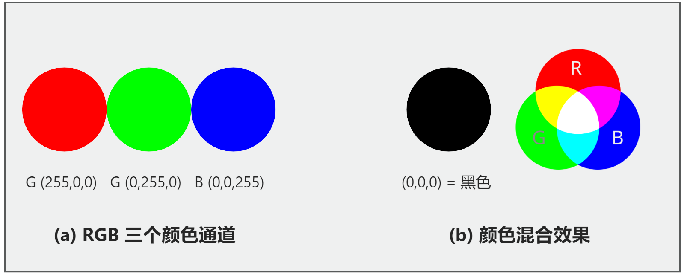

> 图 8.2 RGB 颜色模型示意图：(a) RGB 三个颜色通道 (b) 颜色混合效果
>

了解了 RGB 的基本概念后，我们来看看 RGB 图像在计算机中是如何存储的。实际上，每张彩色图像都是一个三维数组。让我们通过一个简单的例子来理解这一点。


> 图 8.3 16×16 彩色图标
>

这是一个16×16的彩色图标，看起来很简单，但它实际上是由256个像素点组成的。每个像素点都包含了具体的RGB值。让我们看看这个图标在计算机中是如何表示的：


> 图 8.4 图标的像素级RGB值表示
>

从上图我们可以看到，每个像素都由三个数字组成。例如，图中的一个黄色像素显示为[255, 255, 0]，这表示红色和绿色通道都达到最大值255，而蓝色通道为0。整个图标实际上就是一个16×16×3的三维数组，其中：

+ 第一维和第二维（16×16）定义了图像的宽度和高度
+ 第三维（3）代表每个像素的RGB三个颜色通道

RGB 颜色空间因其直观性和易用性在图像显示领域广泛应用。它能够准确地表示丰富的色彩，并且符合人眼的自然感知方式。然而，在实际应用中也需要注意它的局限性：RGB 图像需要存储三个颜色通道的信息，这意味着更大的数据量和更高的计算开销。同时，RGB 值对光照条件较为敏感，这在某些计算机视觉任务中可能带来挑战。因此，在不同的应用场景中，我们可能需要考虑使用其他更适合的颜色空间。

#### 1.2.2. 灰度图像

灰度图像是图像处理中另一种非常重要的表示方式。与 RGB 图像使用三个通道不同，灰度图像只使用一个通道来表示每个像素的亮度值。在计算机中，这个亮度值的范围是 0 到 255：

+ 0 表示纯黑
+ 255 表示纯白
+ 中间的数值表示不同程度的灰色

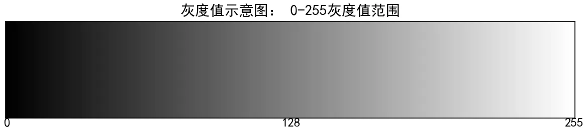

> 图8.5 灰度值示意图
>

在计算机视觉中，灰度图像因其简单高效的特点被广泛应用。它不仅能显著减少数据量（仅需 RGB 图像三分之一的存储空间），还能提供足够的图像信息用于许多视觉任务，如边缘检测、文字识别和人脸检测等。

让我们通过一个具体的例子来理解灰度图像的数据表示：

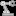

> 图 8.6 16×16 灰度图标
>

这个 16×16 的灰度图标虽然看起来只有黑白灰三种颜色，但实际上它可以表现出丰富的灰度层次。让我们看看这个图标在计算机中的具体表示方式：

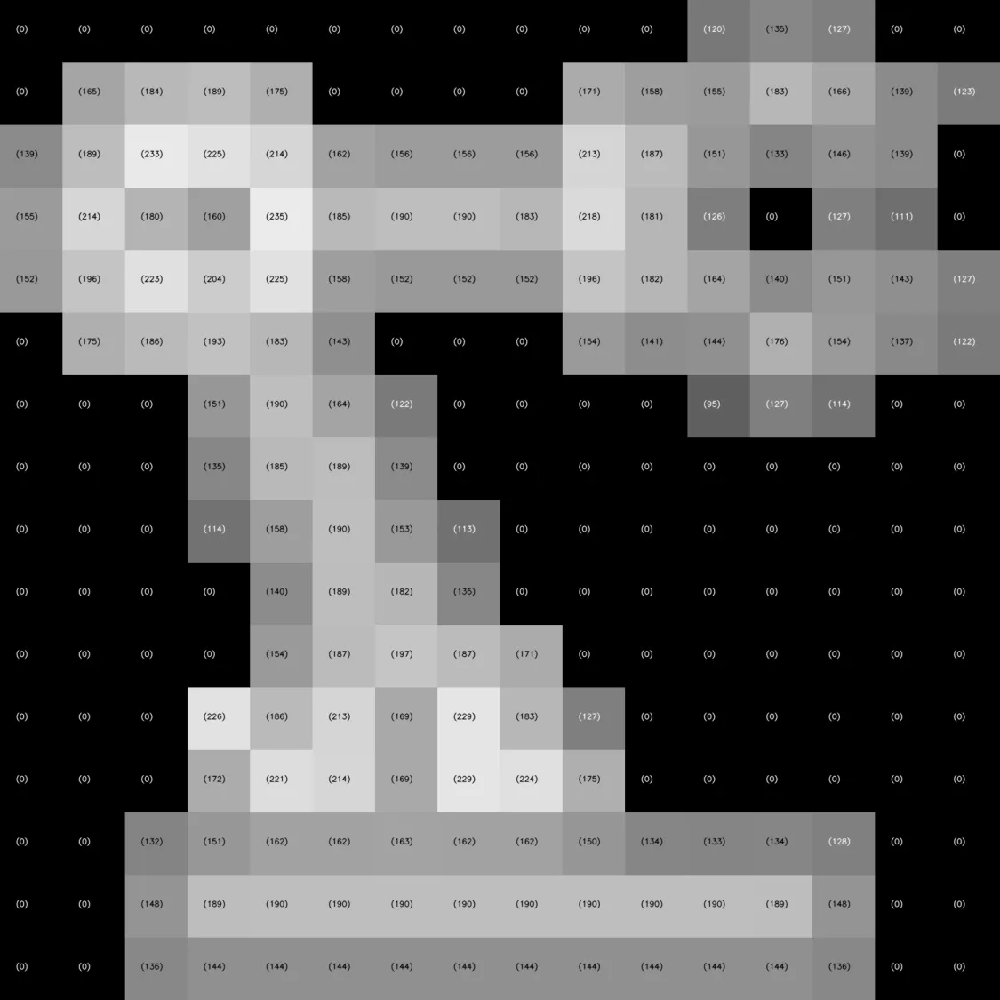

> 图 8.7 图标的像素级灰度值表示
>

从上图我们可以看到，灰度图像是一个二维数组，每个像素位置只需要一个数值就能表示其亮度。这种简单的数据结构使得灰度图像在处理速度和内存占用上都具有显著优势。

#### 1.2.3. HSV 颜色空间

HSV 颜色空间提供了一种更接近人类感知的颜色表示方式。不同于 RGB 使用三原色的混合，HSV 使用色调（Hue）、饱和度（Saturation）和明度（Value）三个参数来描述颜色。

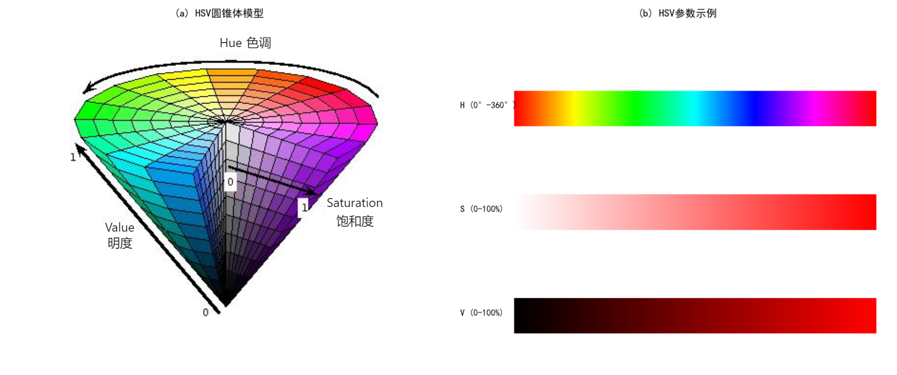

> 图 8.8 HSV 颜色空间示意图：(a) HSV 圆锥体模型 (b) HSV 参数示例
>

在标准的 HSV 颜色空间中，这三个参数的定义如下：

色调（H）：表示颜色的基本属性，范围是 0-360 度：

+ 0/360 度表示红色
+ 60 度表示黄色
+ 120 度表示绿色
+ 240 度表示蓝色

饱和度（S）：表示颜色的纯度，范围是 0-100%：

+ 100% 表示最纯的颜色
+ 0% 表示完全不饱和，呈现灰色
+ 饱和度越高，颜色越鲜艳

明度（V）：表示颜色的明暗程度，范围是 0-100%：

+ 100% 表示最亮
+ 0% 表示最暗（黑色）
+ 控制颜色的明暗变化

然而，在使用 OpenCV 进行图像处理时，HSV 的值范围会有所不同。为了提高计算效率，OpenCV 将这些参数映射到以下范围：

+ H：0-180（是标准 HSV 中 0-360 的一半）
+ S：0-255（对应0-100%）
+ V：0-255（对应0-100%）

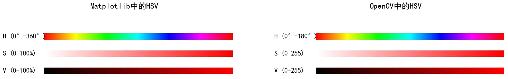

> 图 8.9 Matplotlib 和 OpenCV 的 HSV 色调范围差异
>

让我们看看之前图 8.2 的图标在OpenCV的 HSV 表示中是如何表示的：


> 图 8.10 图标的像素级 HSV 值表示（OpenCV格式）
>

在这个例子中，一个黄色像素表示为[30, 255, 255]，其中：

+ 30是黄色对应的色调值（在标准HSV中为60度）
+ 255表示最大饱和度（对应100%）
+ 255表示最大亮度（对应100%）

HSV颜色空间的这种表示方式更接近人类感知颜色的方式，因此在颜色识别和分割等任务中特别有用。例如，当光照条件发生变化时，物体的色调（H）值仍然相对稳定，这使得HSV在许多计算机视觉应用中表现优于RGB。

### 1.3. 分辨率

在数字图像处理中，分辨率是一个非常重要的概念。它决定了图像的大小和细节水平，对边缘 AI 应用的性能和准确性有直接影响。

#### 1.3.1. 基本概念

图像分辨率通常用两个数字表示，例如 1920×1080，其中：

+ 第一个数字（1920）表示图像的宽度（像素列数）
+ 第二个数字（1080）表示图像的高度（像素行数）
+ 两个数字的乘积就是图像的总像素数

在实际应用中，我们经常遇到以下几种标准分辨率：

1. **VGA (640×480)**
    + 常用于低端摄像头
    + 适合资源受限的设备
    + 处理速度快，但细节较少
2. **HD (1280×720)**
    + 也称为 720p
    + 平衡了图像质量和处理速度
    + 适合大多数边缘 AI 应用
3. **Full HD (1920×1080)**
    + 也称为 1080p
    + 提供更多图像细节
    + 需要更多计算资源
4. **4K (3840×2160)**
    + 超高清分辨率
    + 包含极其丰富的细节
    + 对硬件要求较高

#### 1.3.2. 分辨率和内存的关系

在边缘设备上，内存资源往往很有限。理解图像的内存占用对于开发高效的应用程序至关重要。图像的内存占用主要由三个因素决定：

+ 图像的宽度和高度(分辨率)
+ 每个像素的位深度(通常为 8 位,即 1 字节)
+ 颜色通道的数量(灰度图为 1，RGB 图为 3)

让我们看一个计算图像内存占用的示例:

```python
import matplotlib.pyplot as plt
import matplotlib

# 设置字体为中文支持的字体
matplotlib.rcParams['font.sans-serif'] = ['SimHei']
matplotlib.rcParams['axes.unicode_minus'] = False

def calculate_image_memory(width, height, channels):
    """
    计算图像占用的内存大小
    
    参数:
        width: 图像宽度
        height: 图像高度
        channels: 通道数(灰度=1,RGB=3)
        
    返回:
        内存占用(MB)
    """
    bytes_per_pixel = 1  # 每个通道占用1字节
    total_bytes = width * height * channels * bytes_per_pixel
    memory_mb = total_bytes / (1024 * 1024)
    return memory_mb

# 计算不同分辨率图像的内存占用
resolutions = {
    'VGA': (640, 480),
    'HD': (1280, 720),
    'Full HD': (1920, 1080),
    '4K': (3840, 2160)
}

# 保存结果用于绘图
labels = []  # 分辨率标签
rgb_memories = []  # RGB 内存占用
gray_memories = []  # 灰度图内存占用

for name, (width, height) in resolutions.items():
    rgb_memory = calculate_image_memory(width, height, 3)
    gray_memory = calculate_image_memory(width, height, 1)
    labels.append(name)
    rgb_memories.append(rgb_memory)
    gray_memories.append(gray_memory)

# 绘制柱状图
x = range(len(labels))  # X轴位置
width = 0.35  # 柱子宽度

# 绘制RGB和灰度图像柱状图
rgb_bars = plt.bar(x, rgb_memories, width=width, label="RGB 图像", align="center")
gray_bars = plt.bar([i + width for i in x], gray_memories, width=width, label="灰度图像", align="center")

# 添加柱顶标注
for bar in rgb_bars:
    height = bar.get_height()
    plt.text(bar.get_x() + bar.get_width() / 2, height + 0.2, f"{height:.2f} MB", ha="center", va="bottom", fontsize=9)

for bar in gray_bars:
    height = bar.get_height()
    plt.text(bar.get_x() + bar.get_width() / 2, height + 0.2, f"{height:.2f} MB", ha="center", va="bottom", fontsize=9)

# 添加标题和坐标轴标签
plt.title("不同分辨率图像的内存占用对比")
plt.xlabel("分辨率")
plt.ylabel("内存占用 (MB)")
plt.xticks([i + width / 2 for i in x], labels)  # 设置横轴刻度位置和标签
plt.legend()  # 添加图例
plt.tight_layout()

# 显示图表
plt.show()
```

运行结果：

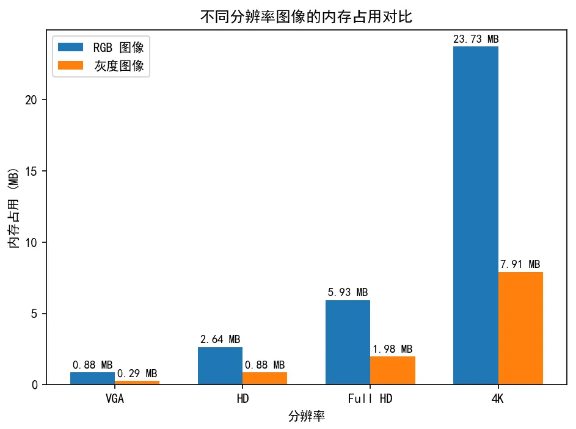

> 图 8.11 不同分辨率的内存占用对比
>

需要注意的是,上面的计算展示的是图像在内存中未压缩时的原始大小。在实际应用中，同样是 1920x1080 分辨率的图片，保存为文件时的大小可能差异很大，这主要是因为：

1. 图像压缩算法：常见的 JPEG、PNG 等格式会使用不同的压缩算法，压缩后的文件大小取决于图像内容的复杂度和压缩质量的设置。
2. 压缩质量：相同的图像使用不同的压缩质量参数，会产生不同大小的文件，质量越高文件越大。

但无论文件大小如何，当图像被加载到内存中进行处理时，都会占用我们上面计算的空间。这就是为什么在边缘设备上处理高分辨率图像时需要特别注意内存管理。

#### 1.3.3. 不同分辨率的比较

理解不同分辨率对图像细节和处理性能的影响对于边缘 AI 开发至关重要。让我们通过一个示例来直观理解这一点。这个示例将：

1. 展示不同分辨率下同一图像的效果
2. 计算每种分辨率的内存占用
3. 分析压缩比和图像质量的关系

下面是实现这些功能的代码：

```python
import cv2
import numpy as np
import matplotlib
import matplotlib.pyplot as plt

# 设置字体为中文支持的字体，如 SimHei（黑体）
matplotlib.rcParams['font.sans-serif'] = ['SimHei']
matplotlib.rcParams['axes.unicode_minus'] = False  # 用来正常显示负号

def show_different_resolutions(image_path):
    """
    展示图像在不同分辨率下的效果，分辨率越低图像越小
    
    参数:
        image_path: 输入图像的路径
    """
    # 读取原始图像
    image = cv2.imread(image_path)
    if image is None:
        print(f"无法读取图像：{image_path}")
        return
        
    # 转换为 RGB
    image_rgb = cv2.cvtColor(image, cv2.COLOR_BGR2RGB)
    original_height, original_width = image.shape[:2]
    
    # 定义不同的分辨率
    resolutions = {
        'VGA (640×480)': (640, 480),
        'HD (1280×720)': (1280, 720),
        'Full HD (1920×1080)': (1920, 1080)
    }
    
    # 创建图表
    plt.figure(figsize=(15, 10))
    
    # 显示原始图像
    plt.subplot(2, 2, 1)
    plt.title(f'原始图像 ({original_width}×{original_height})')
    plt.imshow(image_rgb)
    plt.axis('off')
    
    # 显示不同分辨率的图像，按照实际比例缩小并居中
    for i, (name, (width, height)) in enumerate(resolutions.items(), 1):
        # 调整图像大小
        resized = cv2.resize(image_rgb, (width, height))
        
        # 计算缩放比例
        scale_x = width / original_width
        scale_y = height / original_height
        
        # 创建子图
        ax = plt.subplot(2, 2, i + 1)
        ax.set_title(f'{name}\n宽缩放比: {scale_x:.2f}, 高缩放比: {scale_y:.2f}')
        
        # 创建一个白色背景画布，大小为原始分辨率
        canvas = np.ones((original_height, original_width, 3), dtype=np.uint8) * 255  # 全白背景
        
        # 计算居中的偏移量
        offset_x = (original_width - width) // 2
        offset_y = (original_height - height) // 2
        
        # 将调整后的图像放置在画布的中心
        canvas[offset_y:offset_y + height, offset_x:offset_x + width, :] = resized
        
        # 显示图片
        ax.imshow(canvas)
        ax.axis('off')
        ax.set_aspect('equal')  # 强制保持宽高比
    
    # 调整布局
    plt.tight_layout()
    plt.show()
    
    # 打印各分辨率的内存占用
    print("\n不同分辨率的内存占用（RGB 图像）：")
    for name, (width, height) in resolutions.items():
        memory_mb = (width * height * 3) / (1024 * 1024)  # 3 表示 RGB 三个通道
        print(f"{name}：{memory_mb:.2f} MB")

# 使用示例
show_different_resolutions('image.jpg')

```

运行这段代码，我们可以得到以下输出：

1. 一个包含 4 个子图的窗口，显示：
    + 原始图像
    + VGA 分辨率效果
    + HD 分辨率效果
    + Full HD 分辨率效果

    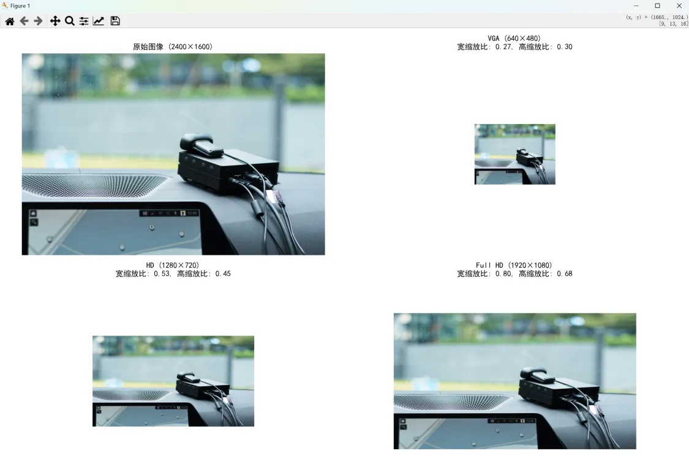

    > 图 8.12 不同分辨率的比较
    >

2. 控制台输出不同分辨率的内存占用：

    ```plain
    不同分辨率的内存占用（RGB 图像）：
    VGA (640×480)：0.88 MB
    HD (1280×720)：2.64 MB
    Full HD (1920×1080)：5.93 MB
    ```

#### 1.3.4. 在边缘设备中的分辨率选择

在开发边缘 AI 应用时，选择合适的分辨率需要考虑以下因素：

1. **硬件性能限制**
    + 处理器速度
    + 内存容量
    + 存储空间
2. **应用需求**
    + 目标识别：通常需要足够的细节，建议至少 HD 分辨率
    + 人脸检测：视距离而定，一般 VGA 分辨率即可
    + 文字识别：需要较高分辨率确保文字清晰
    + 实时监控：可以使用较低分辨率以提高处理速度
3. **性能与质量平衡**
    + 更高分辨率 = 更多细节 + 更慢处理速度
    + 更低分辨率 = 更少细节 + 更快处理速度

在实际应用中，建议从较低分辨率开始测试，然后根据应用的性能表现和质量要求，逐步调整到合适的分辨率。这样可以帮助我们找到最适合特定应用场景的分辨率设置。

## 2. OpenCV 简介

[OpenCV](https://opencv.org/)（Open Source Computer Vision Library）是一个开源的计算机视觉库，它为图像处理和计算机视觉应用提供了丰富的工具和函数。在边缘 AI 开发中，OpenCV 扮演着核心角色，它具有以下重要特点：

+ 跨平台支持，可在 Windows、Linux、MacOS 等系统上运行
+ 丰富的图像处理和分析功能
+ 优秀的性能和执行效率
+ 活跃的社区支持和丰富的学习资源


> 图 8.13 OpenCV 官网
>

### 2.1. 基本功能

OpenCV 提供了多个功能模块，其中最基础和常用的包括：

1. **图像处理基础功能**
    + 图像的读取、显示和保存
    + 图像的缩放、旋转和裁剪
    + 颜色空间转换
    + 图像滤波和增强
2. **视频处理功能**
    + 视频文件的读写
    + 摄像头实时视频采集
    + 视频帧处理
3. **图像分析功能**
    + 边缘检测
    + 特征点提取
    + 目标检测和跟踪

在开始使用 OpenCV 之前，我们需要确保正确安装并导入相关库：

```python
import cv2

# 检查 OpenCV 版本
print(f"OpenCV 版本：{cv2.__version__}")
```

运行这段代码，我们会看到当前安装的 OpenCV 版本号，例如：

```plain
OpenCV 版本：4.5.4
```

### 2.2. 图像操作

图像操作是进行图像处理的第一步。在 OpenCV 中，所有图像操作都是围绕着 NumPy 数组进行的，这使得操作既灵活又高效。让我们从最基础的图像读取和显示开始学习。

#### 2.2.1. 读取和显示图像

在 OpenCV 中，读取图像使用 `imread()` 函数，显示图像使用 `imshow()` 函数。这两个函数是最基础也是最常用的图像操作函数。

```python
# 读取图像
image = cv2.imread('image.jpg')

# 检查图像是否成功读取
if image is None:
    print("无法读取图像")
else:
    # 显示图像
    cv2.imshow('Image Display', image)
    print("按任意键关闭图像窗口...")
    # 等待按键
    cv2.waitKey(0)
    # 关闭所有窗口
    cv2.destroyAllWindows()
```

让我们通过一个简单的例子来理解如何使用它们：

```python
import cv2

def load_and_show_image(image_path):
    """
    读取并显示图像
    
    参数:
        image_path: 图像文件路径
    """
    # 读取图像
    print(f"正在读取图像：{image_path}")
    image = cv2.imread(image_path)
    
    # 检查图像是否成功读取
    if image is None:
        print("无法读取图像")
    else:
        # 显示图像
        cv2.imshow('Image Display', image)
        print("按任意键关闭图像窗口...")
        # 等待按键
        cv2.waitKey(0)
        # 关闭所有窗口
        cv2.destroyAllWindows()

# 使用示例
load_and_show_image('image.jpg')
```

运行这段代码后，我们会看到类似以下输出：

```plain
正在读取图像：image.jpg
按任意键关闭图像窗口...
```

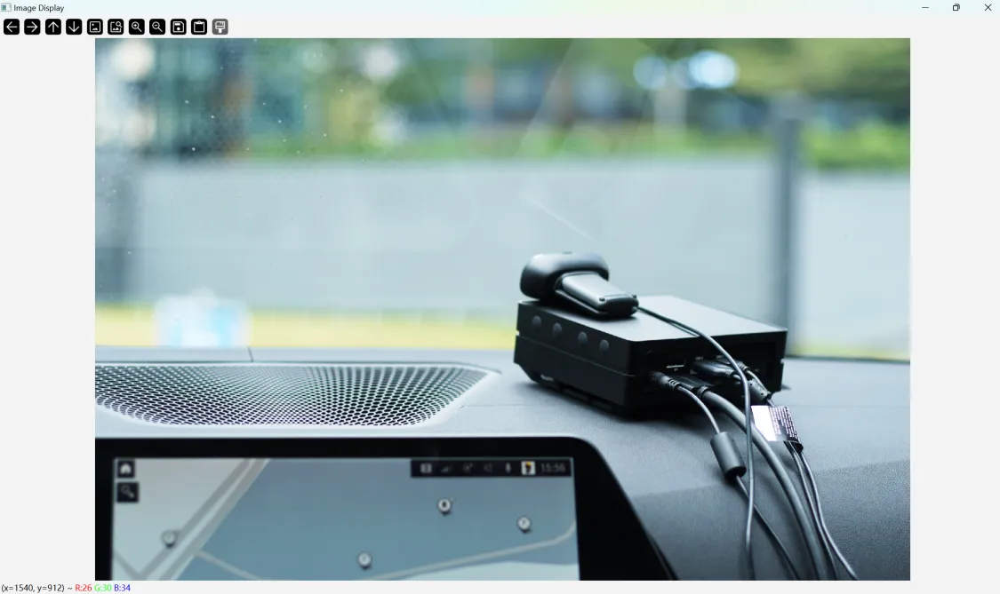

> 图 8.14 OpenCV 读取和显示图像
>

在这个示例中需要注意几个重要的点：

1. `imread()` 函数默认以 BGR 颜色格式读取图像，这与我们常见的 RGB 格式不同
2. 图像读取失败时会返回 None，所以需要进行错误检查
3. `waitKey(0)` 表示无限等待键盘输入，这在开发调试时很有用
4. 使用完窗口后应当调用 `destroyAllWindows()` 释放资源

#### 2.2.2. 保存图像

在处理完图像后，我们通常需要将结果保存下来。OpenCV 提供了 `imwrite()` 函数来实现这个功能。这个函数可以将图像保存为多种格式，如 JPG、PNG 等。

```python
# 保存图像
cv2.imwrite('processed.jpg', image)
```

让我们来看一个完整的例子：

```python
import cv2

def process_and_save_image(input_path, output_path):
    """
    读取图像，转换为灰度图，并保存结果
    
    参数：
        input_path: 输入图像路径
        output_path: 输出图像路径
    """
    # 读取图像
    print(f"正在读取图像：{input_path}")
    image = cv2.imread(input_path)
    
    if image is None:
        print("错误：无法读取图像")
        return
    
    # 转换为灰度图
    print("正在转换为灰度图...")
    gray_image = cv2.cvtColor(image, cv2.COLOR_BGR2GRAY)
    
    # 保存结果
    print(f"正在保存结果到：{output_path}")
    success = cv2.imwrite(output_path, gray_image)
    
    if success:
        print("图像保存成功！")
    else:
        print("错误：图像保存失败")

# 使用示例
process_and_save_image('image.jpg','gray_image.png')
```

运行这段代码，我们会看到如下输出：

```plain
正在读取图像：image.jpg
正在转换为灰度图...
正在保存结果到：gray_image.jpg
图像保存成功！
```

然后我们可以在代码中指定的目录下找到我们保存的图像（示例代码中没有指定路径，因此默认将图片保存到项目的根目录下）：

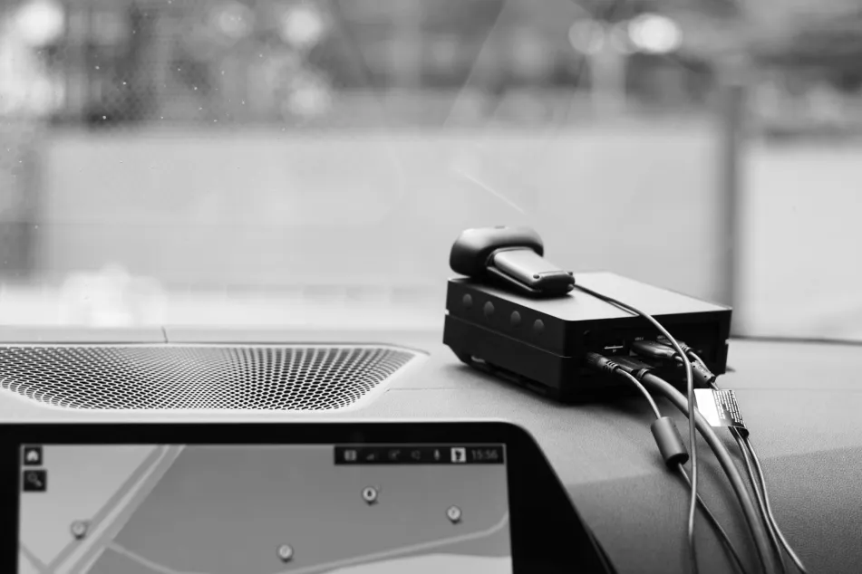

> 图 8.15 OpenCV 保存灰度图像示意图
>

这个示例展示了一个完整的图像处理流程：

1. 读取原始图像
2. 进行图像处理（这里是转换为灰度图）
3. 保存处理结果

> 需要注意的是：
>
> 1. 保存图像时应选择合适的格式，JPEG 适合照片，PNG 适合需要透明背景的图像
> 2. `imwrite()` 函数会根据文件扩展名自动选择编码格式
> 3. 保存操作可能因权限或磁盘空间等原因失败，所以要检查返回值
>

### 2.3. 基本处理

#### 2.3.1. 颜色空间转换

在实际的边缘 AI 应用中，我们经常需要在不同的颜色空间之间转换图像。OpenCV 提供了 `cvtColor()` 函数来实现这种转换。在使用这个函数时，我们需要明确指定转换的类型。

最常见的颜色空间转换包括：

+ BGR 转 RGB：处理显示问题时使用 `cv2.COLOR_BGR2RGB`
+ BGR 转灰度图：简化处理时使用 `cv2.COLOR_BGR2GRAY`
+ BGR 转 HSV：处理颜色识别时使用 `cv2.COLOR_BGR2HSV`

> 注意：OpenCV 默认使用 BGR 颜色顺序，而非通常的 RGB 顺序，这是历史遗留问题。因此，读取的图像是 BGR 格式，许多其他库（如 Matplotlib）则使用 RGB 格式。在将 OpenCV 图像传递给这些库时，需要显式进行颜色转换，否则显示的颜色会不正确。
然而，在使用 cv2.imshow() 显示图像时，OpenCV 会正确处理 BGR 格式，不需要转换为 RGB。因此，显示图像时不需要颜色空间转换，只有在传给其他库时才需要转换 BGR 为 RGB。
>

为了更好地理解颜色空间转换的过程，以下示例展示了如何将一个图像转换为不同的颜色空间：RGB、灰度图和HSV，并显示它们的效果：

```python
import cv2

def display_color_spaces(image_path):
    """
    展示不同颜色空间的图像效果
    
    参数：
        image_path：输入图像路径
    """
    # 读取图像
    image = cv2.imread(image_path)
    if image is None:
        print("错误：无法读取图像")
        return
    
    # 转换到不同的颜色空间
    rgb = cv2.cvtColor(image, cv2.COLOR_BGR2RGB)  # 将BGR转换为RGB
    gray = cv2.cvtColor(image, cv2.COLOR_BGR2GRAY)  # 转为灰度图像
    hsv = cv2.cvtColor(image, cv2.COLOR_BGR2HSV)  # 转为HSV图像
    hsv_bgr = cv2.cvtColor(hsv, cv2.COLOR_HSV2BGR)  # 将HSV转换为BGR以便于正确显示，因为人眼更适应RGB颜色空间。
    
    # 显示原图图像
    cv2.imshow('Original Image', image)

    # 显示RGB图像
    cv2.imshow('RGB Image', rgb)
    
    # 显示灰度图像
    cv2.imshow('Grayscale Image', gray)
    
    # 显示HSV图像
    cv2.imshow('HSV Image', hsv_bgr)
    
    # 等待用户按键后关闭所有显示窗口
    cv2.waitKey(0)
    cv2.destroyAllWindows()

# 使用示例
display_color_spaces('image.jpg')
```

运行结果会显示四个图像，分别展示原始图像、转化到 RGB 的图像、灰度图像和 HSV 图像的效果。

#### 2.3.2. 图像属性

在 OpenCV 中，图像以 NumPy 数组的形式存储，因此我们可以通过数组的属性来获取图像的基本信息。了解这些属性对于正确处理图像至关重要。

主要的图像属性包括：

1. **形状（shape）**  
    shape 属性告诉我们数组在每个维度上的大小。对于图像来说，这表示了图像的尺寸和通道数：

    ```python
    # 读取一张图像
    img = cv2.imread('test.jpg')

    # 获取图像形状
    print(f"图像形状：{img.shape}")  # 输出格式：(高度, 宽度, 通道数)
    ```

2. **维度（ndim）**  
    ndim 属性表示数组的维度数量。对于图像来说：
        + 灰度图像是 2 维数组
        + 彩色图像是 3 维数组

    ```python
    # 检查维度数
    print(f"维度数量：{img.ndim}")  # 彩色图像输出：3
    ```

3. **数据类型（dtype）**  
    dtype 属性表示数组中元素的数据类型。图像数据通常使用 uint8（无符号 8 位整数，范围 0-255）：

    ```python
    # 查看数据类型
    print(f"数据类型：{img.dtype}")  # 通常输出：uint8
    ```

4. **元素个数（size）**  
    size 属性给出数组中的总元素数量：

    ```python
    # 获取像素总数
    print(f"元素总数：{img.size}")  # 输出：宽度 × 高度 × 通道数
    ```

    让我们通过一个示例来查看这些属性：

    ```python
    import cv2

    def print_image_info(image_path):
        """
        打印图像的基本信息
        
        参数：
            image_path：图像文件路径
        """
        # 读取图像
        img = cv2.imread(image_path)
        
        if img is None:
            print("错误：无法读取图像")
            return
        
        # 打印各种属性
        print("图像基本信息：")
        print(f"尺寸（高度 x 宽度 x 通道数）：{img.shape}")
        print(f"维度数量：{img.ndim}")
        print(f"数据类型：{img.dtype}")
        print(f"像素值范围：{img.min()} 到 {img.max()}")
        print(f"元素总数：{img.size}")  # 输出：宽度 × 高度 × 通道数

    # 使用示例
    print_image_info('image.jpg')
    ```

    运行这段代码，我们会看到类似这样的输出：

    ```plain
    图像基本信息：
    尺寸（高度 x 宽度 x 通道数）：(1600, 2400, 3)
    维度数量：3
    数据类型：uint8
    像素值范围：0 到 255
    元素总数：11520000
    ```

这些基本信息对于图像处理至关重要，它们不仅帮助我们理解图像的存储结构，还能指导我们选择合适的处理方法，从而避免常见的处理错误。通过了解这些基本概念和操作，我们就可以开始进行更复杂的图像处理任务了。在下一课中，我们将学习更多高级的 OpenCV 操作。

## 3. NumPy 基础

### 3.1. NumPy 简介

NumPy（Numerical Python）是 Python 中最重要的数值计算库。在图像处理中，NumPy 是不可或缺的工具。前面我们已经了解到图像本质上就是数字数组，而 NumPy 正是专门用来处理这些数组数据的强大工具。

#### 3.1.1. 为什么在图像处理中使用 NumPy？

1. **图像本质上是数组**：还记得我们之前看到的那个 16×16 的彩色图标吗？在计算机中，不同类型的图像都是以数组形式存储的：
    + 灰度图像是二维数组：就像我们看到的 [0] 到 [255] 的灰度值表示
    + 彩色图像是三维数组：正如我们看到的 [R,G,B] 值组合
    + HSV 图像也是三维数组：以 [H,S,V] 的形式表示颜色

    让我们通过 NumPy 来实际查看之前那个 16×16 图标的数组表示：

    ```python
    import numpy as np
    import cv2

    # 读取我们的16×16彩色图标
    icon = cv2.imread('16x16icon.png')
    icon_rgb = cv2.cvtColor(icon, cv2.COLOR_BGR2RGB)

    print("彩色图像的数组表示（RGB值）：")
    print(icon_rgb)  # 显示完整的RGB值
    print("\n图像形状：", icon_rgb.shape)
    print("RGB数组元素总数：", icon_rgb.size)  # 显示RGB数组的总元素数

    # 转换为灰度图像
    icon_gray = cv2.cvtColor(icon, cv2.COLOR_BGR2GRAY)

    print("\n灰度图像的数组表示：")
    print(icon_gray)  # 显示完整的灰度值
    print("\n图像形状：", icon_gray.shape)
    print("灰度数组元素总数：", icon_gray.size)  # 显示灰度数组的总元素数

    print("\n数据量比较：RGB图像是灰度图像的", icon_rgb.size/icon_gray.size, "倍")
    ```

    运行结果：

    ```plain
    彩色图像的数组表示（RGB值）：
    [[[  0   0   0]
    [  0   0   0]
    [  0   0   0]
    [  0   0   0]
    [  0   0   0]
    [  0   0   0]
    [  0   0   0]
    [  0   0   0]
    [  0   0   0]
    [  0   0   0]
    [  0   0   0]
    [109 121 145]
    [119 138 161]
    [111 130 150]
    [  0   0   0]
    [  0   0   0]]

    [[  0   0   0]
    [200 163  85]
    [212 185 106]
    [216 191 111]
    [204 176  95]
    [  0   0   0]
    [  0   0   0]
    [  0   0   0]
    [  0   0   0]
    [201 172  89]
    [172 159 114]
    [140 158 178]
    [169 186 205]
    [151 169 190]
    [124 142 163]
    [106 127 148]]

        ......

    [[  0   0   0]
    [  0   0   0]
    [122 139 159]
    [129 147 168]
    [129 147 168]
    [129 147 168]
    [129 147 168]
    [129 147 168]
    [129 147 168]
    [129 147 168]
    [129 147 168]
    [129 147 168]
    [129 147 168]
    [122 139 159]
    [  0   0   0]
    [  0   0   0]]]

    图像形状： (16, 16, 3)
    RGB数组元素总数： 768

    灰度图像的数组表示：
    [[  0   0   0   0   0   0   0   0   0   0   0 120 135 127   0   0]
    [  0 165 184 189 175   0   0   0   0 171 158 155 183 166 139 123]
    [139 189 233 225 214 162 156 156 156 213 187 151 133 146 139   0]
    [155 214 180 160 235 185 190 190 183 218 181 126   0 127 111   0]
    [152 196 223 204 225 158 152 152 152 196 182 164 140 151 143 127]
    [  0 175 186 193 183 143   0   0   0 154 141 144 176 154 137 122]
    [  0   0   0 151 190 164 122   0   0   0   0  95 127 114   0   0]
    [  0   0   0 135 185 189 139   0   0   0   0   0   0   0   0   0]
    [  0   0   0 114 158 190 153 113   0   0   0   0   0   0   0   0]
    [  0   0   0   0 140 189 182 135   0   0   0   0   0   0   0   0]
    [  0   0   0   0 154 187 197 187 171   0   0   0   0   0   0   0]
    [  0   0   0 226 186 213 169 229 183 127   0   0   0   0   0   0]
    [  0   0   0 172 221 214 169 229 224 175   0   0   0   0   0   0]
    [  0   0 132 151 162 162 163 162 162 150 134 133 134 128   0   0]
    [  0   0 148 189 190 190 190 190 190 190 190 190 189 148   0   0]
    [  0   0 136 144 144 144 144 144 144 144 144 144 144 136   0   0]]

    图像形状： (16, 16)
    灰度数组元素总数： 256

    数据量比较：RGB图像是灰度图像的 3.0 倍
    ```

    通过这个实例，我们可以清楚地看到：

    + 彩色图像是一个 16×16×3 的三维数组，每个像素都由三个数字（RGB 值）表示
    + 灰度图像是一个 16×16 的二维数组，每个像素只需一个数字表示亮度
    + RGB 图像的数据量是灰度图像的 3 倍，这说明了为什么在一些对性能要求高的场景下，我们可能会优先选择使用灰度图像
    + NumPy 让我们能够轻松地访问和处理这些像素值

    这种直观的数组表示帮助我们理解为什么需要 NumPy 来处理图像数据。

2. **高效的数据处理**
    + 比 Python 列表操作更快
    + 内存使用更高效
    + 提供丰富的数学函数
3. **与 OpenCV 的无缝集成**
    + OpenCV 图像在 Python 中就是 NumPy 数组
    + 可以直接使用 NumPy 函数处理图像
    + 便于进行图像的数值计算

### 3.2. 创建 NumPy 数组

让我们通过一些简单的例子来学习如何创建 NumPy 数组。首先需要导入 NumPy 库：

```python
import numpy as np
```

#### 3.2.1. 从列表创建数组

最基本的创建数组方式是从 Python 列表转换：

```python
# 创建一个简单的一维数组（可以理解为一行像素值）
arr1d = np.array([1, 2, 3, 4, 5])
print("一维数组：")
print(arr1d)
print("数组形状：", arr1d.shape)
print("数组维度：", arr1d.ndim)
```

运行结果：

```plain
一维数组：
[1 2 3 4 5]
数组形状：(5,)
数组维度：1
```

让我们再创建一个二维数组，这更接近灰度图像的结构：

```python
# 创建一个二维数组（可以看作是一个灰度图像的小片段）
arr2d = np.array([[1, 2, 3],
                  [4, 5, 6],
                  [7, 8, 9]])
print("二维数组：")
print(arr2d)
print("数组形状：", arr2d.shape)
print("数组维度：", arr2d.ndim)
```

运行结果：

```plain
二维数组：
[[1 2 3]
 [4 5 6]
 [7 8 9]]
数组形状：(3, 3)
数组维度：2
```

#### 3.2.2. 创建特殊数组

NumPy 提供了许多便捷的函数来创建特定类型的数组。在图像处理中，这些特殊数组经常用于创建模板、掩码或初始化图像数据。让我们来看看最常用的几种：

1. **全零数组**  
    zeros() 函数创建一个所有元素都是 0 的数组，常用于创建背景图像或掩码：

    ```python
    # 创建 3x3 的全零数组
    zeros_array = np.zeros((3, 3))
    print("全零数组：")
    print(zeros_array)
    ```

    运行结果：

    ```plain
    全零数组：
    [[0. 0. 0.]
    [0. 0. 0.]
    [0. 0. 0.]]
    ```

2. **全一数组**  
    ones() 函数创建一个所有元素都是 1 的数组，在归一化和掩码运算中很有用：

    ```python
    # 创建 2x4 的全一数组
    ones_array = np.ones((2, 4))
    print("全一数组：")
    print(ones_array)
    ```

    运行结果：

    ```plain
    全一数组：
    [[1. 1. 1. 1.]
    [1. 1. 1. 1.]]
    ```

3. **单位矩阵**  
    eye() 函数创建一个对角线为 1，其他位置为 0 的矩阵，在图像变换中经常使用：

    ```python
    # 创建 3x3 的单位矩阵
    identity_array = np.eye(3)
    print("单位矩阵：")
    print(identity_array)
    ```

    运行结果：

    ```plain
    单位矩阵：
    [[1. 0. 0.]
    [0. 1. 0.]
    [0. 0. 1.]]
    ```

4. **等差数列数组**  
    arange() 函数创建一个指定范围内的等差数列，常用于创建像素值渐变：

    ```python
    # 创建从 0 到 10 的等差数列，步长为 2
    range_array = np.arange(0, 10, 2)
    print("等差数列数组：")
    print(range_array)
    ```

    运行结果：

    ```plain
    等差数列数组：
    [0 2 4 6 8]
    ```

这些特殊数组的创建方法不仅简化了我们的编程工作，还能提高代码的效率。例如，当我们需要创建一个黑色背景图像时，可以直接使用 zeros() 函数，而不需要手动设置每个像素值。

### 3.3. NumPy 数组的基本操作

在图像处理中，我们经常需要对数组进行各种操作。让我们来学习一些最常用的操作及其在图像处理中的应用。

#### 3.3.1. 索引和切片

NumPy 数组支持强大的索引和切片功能，这在提取和修改图像的特定区域时非常有用。让我们通过一个模拟图像数据的例子来学习：

```python
import numpy as np

# 创建一个示例数组（模拟一个小的灰度图像）
img = np.array([[10, 20, 30, 40],
                [50, 60, 70, 80],
                [90, 100, 110, 120]])

print("原始数组（模拟灰度图像）：")
print(img)
print("\n数组形状：", img.shape)
```

运行结果：

```plain
原始数组（模拟灰度图像）：
[[ 10  20  30  40]
 [ 50  60  70  80]
 [ 90 100 110 120]]

数组形状：(3, 4)
```

现在让我们来学习不同的访问方式：

1. **获取单个元素**  
    使用行号和列号访问单个像素值：

    ```python
    # 获取第 2 行第 3 个元素（索引从 0 开始）
    print("第 2 行第 3 个元素：", img[1, 2])  # 输出：70
    ```

2. **获取一行数据**  
    提取图像的某一行：

    ```python
    # 获取第 2 行
    print("第 2 行：", img[1])  # 输出：[50 60 70 80]
    ```

3. **获取一列数据**  
    提取图像的某一列：

    ```python
    # 获取第 1 列
    print("第 1 列：", img[:, 0])  # 输出：[10 50 90]
    ```

4. **获取子区域**  
    提取图像的一个矩形区域（在图像处理中称为 ROI，感兴趣区域）：

    ```python
    # 获取中心 2x2 区域
    roi = img[0:2, 1:3]
    print("中心 2x2 区域：")
    print(roi)
    ```

    运行结果：

    ```plain
    中心 2x2 区域：
    [[20 30]
    [60 70]]
    ```

在实际的图像处理中，这些索引和切片操作让我们能够灵活地处理图像的不同区域。我们可以提取特定区域进行分析，修改局部区域的像素值，甚至可以将多个图像区域组合在一起。

#### 3.3.2. 数组运算

在图像处理中，我们经常需要对图像进行一些基本的数学运算，例如调整灰度图像的亮度或对比度。NumPy 提供了丰富的数组运算功能，让这些操作变得简单高效。

1. **基本算术运算**  
    让我们通过一个简单的例子来理解 NumPy 数组的基本运算。我们创建一个3×3的小型图像数组，其中的数值从0到160逐渐增大，形成一个从黑到白的渐变效果：

    ```python
    import numpy as np
    import matplotlib.pyplot as plt
    import matplotlib

    # 设置字体为中文支持的字体，如 SimHei（黑体）
    matplotlib.rcParams['font.sans-serif'] = ['SimHei']
    matplotlib.rcParams['axes.unicode_minus'] = False  # 用来正常显示负号

    # 创建一个3x3的示例图像数组
    img = np.array([[0, 20, 40],
                    [60, 80, 100],
                    [120, 140, 160]])

    print("原始图像数据：")
    print(img)

    # 增加亮度（所有像素值加50）
    brighter = img + 50
    print("\n增加亮度后：")
    print(brighter)

    # 调整对比度（所有像素值乘以1.5）
    contrast = img * 1.5
    print("\n调整对比度后：")
    print(contrast.astype(int)) # 转换为整数便于显示

    # 以下内容为可视化展示效果，具体知识会在下一部分展开学习
    # 创建图形显示结果
    plt.figure(figsize=(12, 4))

    # 显示原始图像
    plt.subplot(131)
    plt.imshow(img, cmap='gray', vmin=0, vmax=255)  # 显式设置vmin和vmax
    plt.title('原始图像')
    plt.colorbar()

    # 显示增加亮度后的图像
    plt.subplot(132)
    plt.imshow(brighter, cmap='gray', vmin=0, vmax=255)  # 显式设置vmin和vmax
    plt.title('增加亮度后')
    plt.colorbar()

    # 显示调整对比度后的图像
    plt.subplot(133)
    plt.imshow(contrast.astype(np.uint8), cmap='gray', vmin=0, vmax=255)  # 显式设置vmin和vmax
    plt.title('调整对比度后')
    plt.colorbar()

    plt.tight_layout()
    plt.show()
    ```

    运行这段代码，我们可以看到数组的具体变化：

    ```plain
    原始图像数据：
    [[  0  20  40]
    [ 60  80 100]
    [120 140 160]]

    增加亮度后：
    [[ 50  70  90]
    [110 130 150]
    [170 190 210]]

    调整对比度后：
    [[  0  30  60]
    [ 90 120 150]
    [180 210 240]]
    ```

    通过这些结果，我们可以观察到 NumPy 数组的基本算术运算特性：

    + 加法运算（+）：将数组中的每个元素都加上一个数值，可以用来提高图像的整体亮度。例如将所有像素值加50，使图像变得更亮。
    + 乘法运算（*）：将数组中的每个元素都乘以一个数值，可以用来调整图像的对比度。例如将所有像素值乘以1.5，增加明暗对比。

    通过可视化的代码，我们可以看到这些运算的效果：

    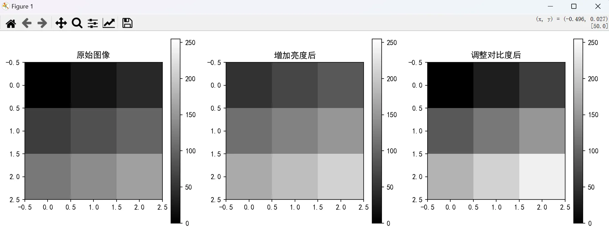

    > 图 8.16 调整亮度与对比度示意图
    >

    这个例子展示了 NumPy 强大的数组运算能力。在实际的图像处理中，虽然我们处理的是更大的图像，但原理是完全相同的。需要注意的是，在实际应用中，我们要确保运算结果不超出像素值的有效范围（0-255）。

2. **统计运算**  
    在图像分析中，我们常常需要计算一些统计值来了解图像的整体特征：

    ```python
    import numpy as np

    # 创建一个 3x3 的示例图像数组
    img = np.array([[0, 20, 40],
                    [60, 80, 100],
                    [120, 140, 160]])

    # 计算基本统计量
    print(f"最小像素值：{np.min(img)}")  # 最暗的点
    print(f"最大像素值：{np.max(img)}")  # 最亮的点
    print(f"平均像素值：{np.mean(img)}")  # 整体亮度
    print(f"像素标准差：{np.std(img):.2f}")  # 对比度的一个指标

    # 找出最大值和最小值的位置
    min_pos = np.unravel_index(np.argmin(img), img.shape)
    max_pos = np.unravel_index(np.argmax(img), img.shape)
    print(f"\n最暗点位置：{min_pos}")
    print(f"最亮点位置：{max_pos}")
    ```

    运行结果：

    ```plain
    最小像素值：0
    最大像素值：160
    平均像素值：80.0
    像素标准差：51.64

    最暗点位置：(0, 0)
    最亮点位置：(2, 2)
    ```

    通过分析像素值的分布特征，我们可以评估图像的整体亮度和对比度，进而进行自动调整和优化。同时，这些统计信息也帮助我们识别异常区域，评估图像质量，为后续的图像处理任务提供重要参考。

#### 3.3.3. 形状操作

在图像处理中，我们经常需要改变数组的形状，特别是在处理不同大小的图像或转换颜色空间时。NumPy 提供了几个关键的形状操作函数，让我们逐一了解。

1. **reshape 函数**  
    reshape 函数可以改变数组的形状，而不改变其数据内容。这在处理图像数据时非常实用：

    ```python
    import numpy as np

    # 创建一个一维数组
    arr = np.arange(12)  # 创建 0-11 的数组
    print("原始数组：")
    print(arr)
    print("形状：", arr.shape)

    # 重塑为 3x4 的数组（模拟一个小型灰度图像）
    img_2d = arr.reshape(3, 4)
    print("\n重塑为 3x4 数组：")
    print(img_2d)
    print("新形状：", img_2d.shape)

    # 重塑为 2x2x3 的数组（模拟一个小型彩色图像）
    img_3d = arr.reshape(2, 2, 3)
    print("\n重塑为 2x2x3 数组：")
    print(img_3d)
    print("新形状：", img_3d.shape)
    ```

    运行结果：

    ```plain
    原始数组：
    [ 0  1  2  3  4  5  6  7  8  9 10 11]
    形状：(12,)

    重塑为 3x4 数组：
    [[ 0  1  2  3]
    [ 4  5  6  7]
    [ 8  9 10 11]]
    新形状：(3, 4)

    重塑为 2x2x3 数组：
    [[[ 0  1  2]
    [ 3  4  5]]
    [[ 6  7  8]
    [ 9 10 11]]]
    新形状：(2, 2, 3)
    ```

2. **转置操作**  
    转置操作可以交换数组的维度，这在图像处理中很常见：

    ```python
    import numpy as np

    # 创建一个 2x3 的数组
    img = np.array([[1, 2, 3],
                    [4, 5, 6]])

    print("原始数组：")
    print(img)
    print("形状：", img.shape)

    # 进行转置
    img_t = img.T
    print("\n转置后：")
    print(img_t)
    print("新形状：", img_t.shape)
    ```

    运行结果：

    ```plain
    原始数组：
    [[1 2 3]
    [4 5 6]]
    形状：(2, 3)

    转置后：
    [[1 4]
    [2 5]
    [3 6]]
    新形状：(3, 2)
    ```

    形状操作在图像处理中具有广泛的应用。它使我们能够在不同维度的数据表示之间自如转换，例如将一维数据重组为图像格式，或者在不同类型的图像（如灰度图和彩色图）之间进行转换。

通过掌握这些基本操作，我们就可以灵活地处理各种图像数据，为后续的深入处理和分析打下基础。

## 4. Matplotlib 数据可视化基础

### 4.1. Matplotlib 简介

在边缘 AI 开发中，我们经常需要展示和分析图像处理的结果。Matplotlib 是 Python 中最常用的数据可视化库之一，它为我们提供了强大的图像显示和数据可视化功能。

使用 Matplotlib，我们可以：

+ 显示原始图像和处理后的图像
+ 绘制图像的直方图，分析像素分布
+ 在同一窗口中对比多个处理结果
+ 为图像添加标题、标注等说明信息

### 4.2. 基本使用方法

在开始使用 Matplotlib 之前，我们需要先导入相关的库：

```python
import matplotlib.pyplot as plt
```

#### 4.2.1. 创建简单的图表

在进行图像处理之前，让我们先通过一个简单的示例来了解 Matplotlib 的基本使用方法。这个例子将展示如何创建一个基本的折线图，包括如何设置标题和坐标轴标签：

```python
import matplotlib.pyplot as plt
import numpy as np
import matplotlib

# 设置字体为中文支持的字体，如 SimHei（黑体）
matplotlib.rcParams['font.sans-serif'] = ['SimHei']
matplotlib.rcParams['axes.unicode_minus'] = False  # 用来正常显示负号

# 创建示例数据
x = np.array([1, 2, 3, 4, 5])
y = x * 2

# 创建折线图
plt.figure(figsize=(8, 6))  # 设置图形大小，单位为英寸（宽度 8 英寸，高度 6 英寸）
plt.plot(x, y, 'b-', label='y = 2x')  # 'b-' 表示蓝色实线
plt.title('简单的折线图')  # 设置标题
plt.xlabel('X 轴')  # 设置 x 轴标签
plt.ylabel('Y 轴')  # 设置 y 轴标签
plt.legend()  # 显示图例
plt.grid(True)  # 显示网格
plt.show()  # 显示图形
```

运行这段代码，我们会得到一个简单的折线图，这有助于我们理解 Matplotlib 的基本工作方式。

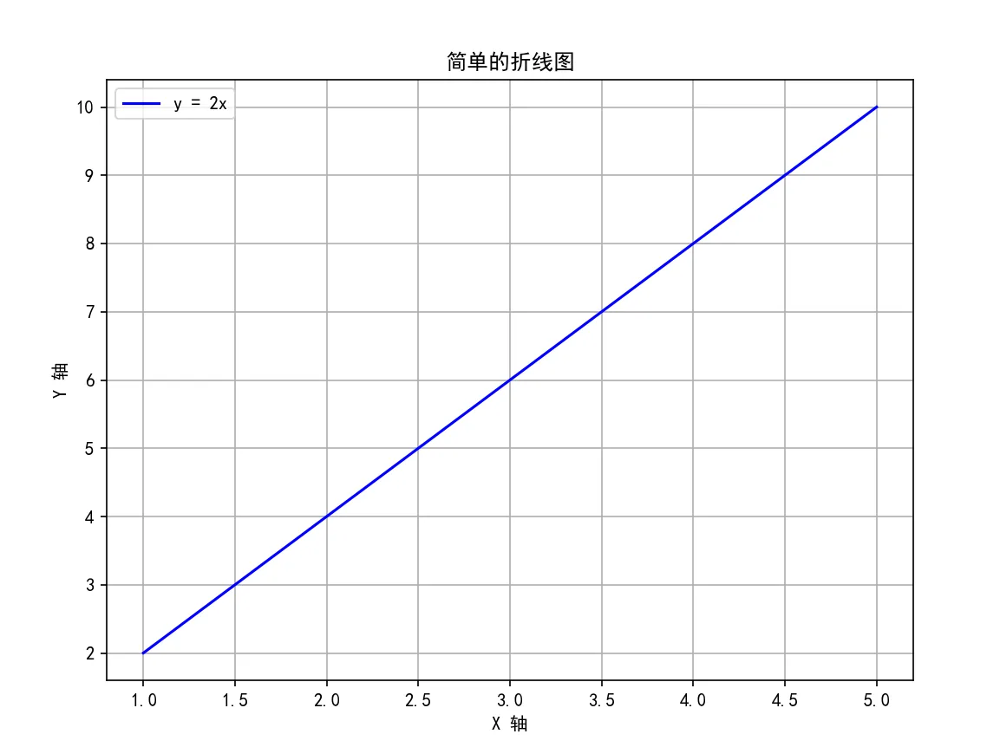

> 图 8.17 Matplotlib 创建的简单折线图示例
>

#### 4.2.2. 显示图像

在边缘 AI 应用中，我们需要可视化原始图像和处理结果。Matplotlib 提供了比 OpenCV 更灵活的图像显示方式。让我们通过一个例子来学习如何显示图像：

```python
import cv2
import matplotlib.pyplot as plt
import matplotlib

# 设置字体为中文支持的字体，如 SimHei（黑体）
matplotlib.rcParams['font.sans-serif'] = ['SimHei']
matplotlib.rcParams['axes.unicode_minus'] = False  # 用来正常显示负号

def display_image(image_path):
    """
    读取并显示图像
    
    参数:
        image_path: 图像文件路径
    """
    # 读取图像
    img = cv2.imread(image_path)
    if img is None:
        print("错误：无法读取图像")
        return
    
    # OpenCV 使用 BGR 顺序，需要转换为 RGB
    img_rgb = cv2.cvtColor(img, cv2.COLOR_BGR2RGB)
    
    # 创建图形并显示图像
    plt.figure(figsize=(10, 8))
    plt.imshow(img_rgb)
    plt.title('使用 Matplotlib 显示图像')
    plt.axis('off')  # 关闭坐标轴
    plt.show()

# 使用示例
display_image('image.jpg')
```

示例运行结果：

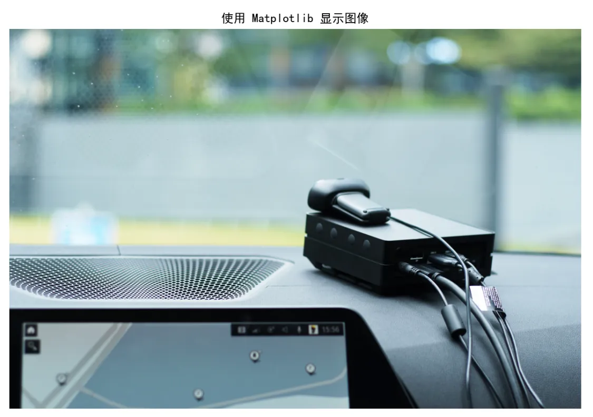

> 图 8.18 使用 Matplotlib 显示的图像示例
>

在这个例子中需要注意几个重要点：

1. OpenCV 读取的图像是 BGR 格式，需要转换为 RGB 才能正确显示
2. figsize 参数控制图像窗口的大小
3. axis('off') 可以关闭坐标轴，使显示更清晰

#### 4.2.3. 图像直方图

在图像处理中，直方图是一个非常重要的分析工具，它可以帮助我们理解图像的像素分布情况。直方图可以显示图像中不同像素值出现的频率，这对于分析图像的亮度、对比度等特征非常有帮助。让我们来看一个创建图像直方图的例子：

```python
import cv2
import matplotlib.pyplot as plt
import matplotlib

# 设置字体为中文支持的字体，如 SimHei（黑体）
matplotlib.rcParams['font.sans-serif'] = ['SimHei']
matplotlib.rcParams['axes.unicode_minus'] = False  # 用来正常显示负号

def plot_image_histogram(image_path):
    """
    显示图像及其直方图
    
    参数:
        image_path: 图像文件路径
    """
    # 读取图像并转换为灰度图
    img = cv2.imread(image_path)
    gray_img = cv2.cvtColor(img, cv2.COLOR_BGR2GRAY)
    
    # 创建子图
    plt.figure(figsize=(12, 5))
    
    # 显示原始灰度图像
    plt.subplot(1, 2, 1)  # 创建一个 1 行 2 列的子图，选择第 1 个位置用于显示灰度图像
    plt.imshow(gray_img, cmap='gray')
    plt.title('灰度图像')
    plt.axis('off')  # 关闭坐标轴显示，仅显示图像本身
    
    # 显示直方图
    plt.subplot(1, 2, 2)  # 选择第二个位置，用于显示灰度图像的直方图。
    plt.hist(gray_img.ravel(), bins=256, range=[0, 256], 
             density=True, color='gray', alpha=0.75)  # 绘制灰度直方图，将灰度图像展平为一维数组，划分为 256 个桶，标准化为概率密度，颜色为灰色，透明度为 0.75
    plt.title('灰度直方图')
    plt.xlabel('像素值')
    plt.ylabel('频率')
    plt.grid(True)
    
    plt.tight_layout()  # 调整子图的布局，确保子图之间不重叠
    plt.show()

plot_image_histogram('image.jpg')
```

运行这段代码，我们会得到两个并排的图：左边是原始灰度图像，右边是对应的直方图。

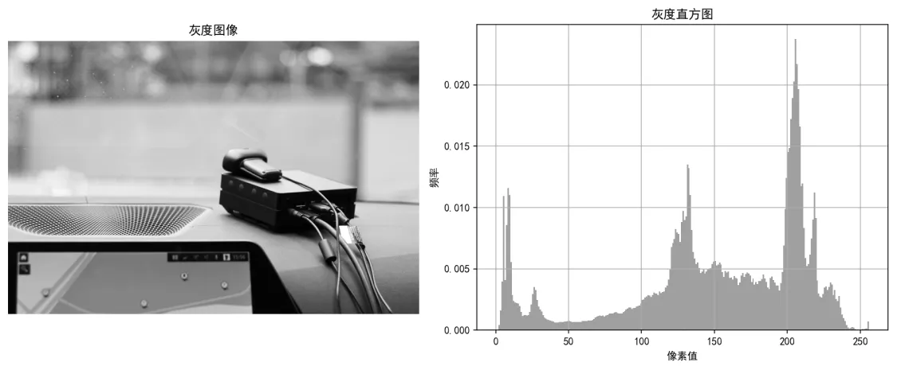

> 图 8.19 灰度图像及其直方图示例
>

这个直方图显示了：

+ x 轴：像素值（0-255）
+ y 轴：每个像素值出现的频率
+ 峰值：表示图像中最常见的像素值
+ 分布：反映了图像的对比度和亮度特征

#### 4.2.4. 子图显示

在实际的图像处理工作中，我们经常需要同时展示多个图像来进行对比分析。Matplotlib 提供了强大的子图功能，使我们能够在一个窗口中组织和显示多个图像。让我们通过一个完整的例子来学习如何展示 RGB 图像及其三个颜色通道：

```python
import cv2
import matplotlib.pyplot as plt
import matplotlib

# 设置字体为中文支持的字体，如 SimHei（黑体）
matplotlib.rcParams['font.sans-serif'] = ['SimHei']
matplotlib.rcParams['axes.unicode_minus'] = False  # 用来正常显示负号

def show_rgb_channels(image_path):
    """
    显示 RGB 图像及其三个颜色通道
    
    参数：
        image_path：图像文件路径
    """
    # 读取图像并转换颜色空间
    image = cv2.imread(image_path)
    image_rgb = cv2.cvtColor(image, cv2.COLOR_BGR2RGB)
    
    # 创建图形和子图
    plt.figure(figsize=(12, 8))
    
    # 设置总标题
    plt.suptitle('RGB 图像分析', fontsize=16)
    
    # 显示原始图像
    plt.subplot(2, 2, 1)
    plt.imshow(image_rgb)
    plt.title('原始图像')
    plt.axis('off')
    
    # 显示各个颜色通道
    channels = ['红色通道', '绿色通道', '蓝色通道']
    cmaps = ['Reds', 'Greens', 'Blues']
    
    for i, (channel, cmap) in enumerate(zip(channels, cmaps)):
        plt.subplot(2, 2, i + 2)
        plt.imshow(image_rgb[:, :, i], cmap=cmap)  # 其中 `:` 表示选择所有行和所有列，i 是通道索引（0：红色，1：绿色，2：蓝色）
        plt.title(channel)
        plt.axis('off')
    
    plt.tight_layout()
    plt.show()

show_rgb_channels('image.jpg')
```

运行这段代码会得到一个包含四个子图的窗口：

1. 左上角显示原始 RGB 图像
2. 右上角显示红色通道
3. 左下角显示绿色通道
4. 右下角显示蓝色通道

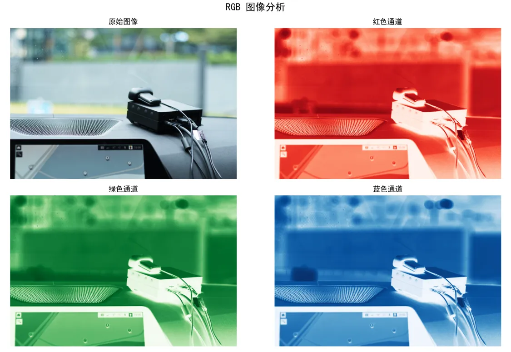

> 图 8.20 RGB 图像及其颜色通道分析示例
>

在创建子图时需要注意以下几点：

1. `figure(figsize=(12, 8))` 设置整个图形的大小
2. `subplot(2, 2, n)` 中的参数分别表示行数、列数和当前子图的位置
3. `tight_layout()` 自动调整子图之间的间距
4. 每个子图都可以单独设置标题、坐标轴等属性

#### 4.2.5. 保存图像

在完成图像处理和可视化后，我们通常需要保存结果以供后续使用。Matplotlib 提供了多种格式的保存选项，让我们来学习如何保存处理结果。

```python
import cv2
import matplotlib.pyplot as plt
import matplotlib

# 设置字体为中文支持的字体，如 SimHei（黑体）
matplotlib.rcParams['font.sans-serif'] = ['SimHei']
matplotlib.rcParams['axes.unicode_minus'] = False  # 用来正常显示负号

def process_and_save_visualization(image_path):
    """
    处理图像并保存可视化结果
    
    参数：
        image_path：输入图像的路径
    """
    # 读取并处理图像
    image = cv2.imread(image_path)
    image_rgb = cv2.cvtColor(image, cv2.COLOR_BGR2RGB)
    gray_image = cv2.cvtColor(image, cv2.COLOR_BGR2GRAY)
    
    # 创建图形
    plt.figure(figsize=(10, 5))
    
    # 显示原始图像和灰度图像
    plt.subplot(1, 2, 1)
    plt.imshow(image_rgb)
    plt.title('原始图像')
    plt.axis('off')
    
    plt.subplot(1, 2, 2)
    plt.imshow(gray_image, cmap='gray')
    plt.title('灰度图像')
    plt.axis('off')
    
    # 调整布局
    plt.tight_layout()
    
    # 保存为不同格式
    plt.savefig('result.png', dpi=300, bbox_inches='tight')  # PNG格式
    plt.savefig('result.pdf', bbox_inches='tight')           # PDF格式
    plt.savefig('result.svg', bbox_inches='tight')           # SVG格式
    
    print('可视化结果已保存')
    plt.show()

process_and_save_visualization('image.jpg')
```

在保存图像时，我们可以使用不同的参数来控制输出质量和格式：

1. **DPI（每英寸点数）设置**

    ```python
    # 保存高分辨率图像
    plt.savefig('high_res.png', dpi=300)  # 300 DPI
    ```

2. **边界调整**

    ```python
    # 自动调整边界以去除空白
    plt.savefig('tight.png', bbox_inches='tight')
    ```

3. **透明背景**

    ```python
    # 保存带透明背景的图像
    plt.savefig('transparent.png', transparent=True)
    ```

    不同的文件格式适用于不同的使用场景：

    + PNG 格式：支持透明背景，适合网页显示和一般用途
    + PDF 格式：矢量格式，适合打印和出版
    + SVG 格式：可缩放的矢量格式，适合网页和需要编辑的场景

通过合理使用这些保存选项，我们可以确保处理结果以最合适的方式保存和展示。在边缘 AI 开发中，这对于记录实验结果、生成报告和分享研究成果都是非常重要的。

## 5. 实践案例

在学习了图像处理的基本概念和工具后，让我们通过两个实际案例来巩固所学知识。这些案例将帮助我们理解如何将 NumPy、OpenCV 和 Matplotlib 结合使用，开发实用的边缘图像处理应用。通过这些案例，我们不仅可以加深对前面所学知识的理解，还能获得解决实际问题的经验。

### 5.1. 案例一：边缘设备图像分析工具

#### 5.1.1. 案例描述

开发一个用于边缘设备的图像分析工具，该工具需要实现以下功能：

1. 读取图像文件的输入
2. 对图像进行基础分析（大小、颜色分布等）
3. 生成分析报告并可视化结果
4. 保存分析结果

#### 5.1.2. 流程图

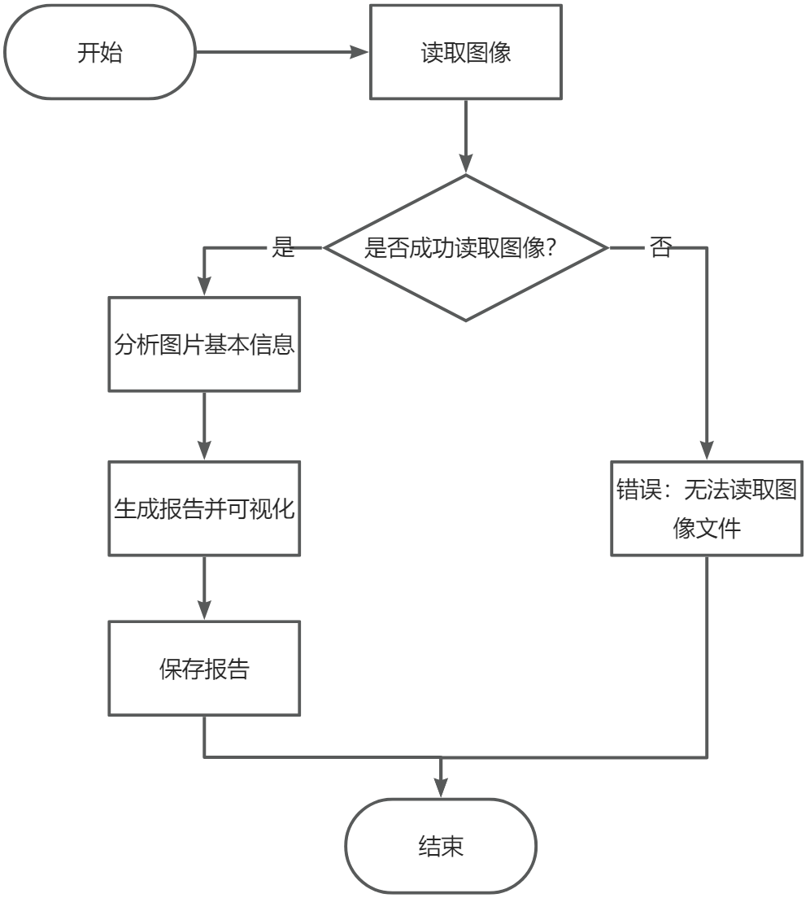

> 图 8.21 图像分析工具流程图
>

#### 5.1.3. AI 辅助编程

让我们使用 AI 助手来实现这个工具。首先，向 AI 助手描述需求：

```plain
我需要开发一个图像分析工具，要求使用 OpenCV、Matplotlib 和 NumPy 库，具备以下功能：

1. 读取并显示图像：
  - 工具能够加载指定路径的图像文件，并显示图像内容。
  - 支持常见格式，如 JPG、PNG 等。
2. 分析并显示图像的基本信息：
  - 显示图像的基本属性，包括图像的尺寸（高度、宽度）、通道数（RGB 或灰度等），以及图像数据的类型（如 uint8、float32 等）。
3. 生成并显示颜色分布直方图：
  - 分析图像的颜色分布情况，并生成红、绿、蓝三个颜色通道的直方图。
  - 直方图应显示每个颜色通道的像素值分布，并区分不同的颜色（如红色、绿色、蓝色）。
4. 将分析结果可视化并保存：
  - 将图像及分析结果整合到一个显示界面中。界面包括原始图像、颜色直方图、基本信息及颜色统计数据等。
  - 将所有分析结果生成报告并保存为图像文件（如 PNG 格式），包括图像本身和各项统计数据。
5. 统一的显示界面：
  - 所有内容应在一个窗口中显示，包括：原始图像、颜色通道直方图、基本信息和颜色统计。
  - 结果应能进行交互式展示或生成静态图像，方便查看和保存。
  
请确保：
- 字体支持中文显示。
- 程序能够处理错误和异常情况（如图像文件无法读取）。
- 使用合适的颜色、布局，使界面清晰易懂。
```

根据这个需求，我们可以实现以下代码：

```python
import cv2
import numpy as np
import matplotlib.pyplot as plt
import matplotlib

# 设置字体为中文支持的字体，如 SimHei（黑体）
matplotlib.rcParams['font.sans-serif'] = ['SimHei']
matplotlib.rcParams['axes.unicode_minus'] = False  # 用来正常显示负号

class ImageAnalyzer:
    """图像分析工具类"""
    
    def __init__(self, image_path):
        """
        初始化图像分析器
        
        参数：
            image_path：图像文件路径
        """
        self.image_path = image_path
        self.image = None
        self.image_rgb = None
        self.info = {}
        
    def load_image(self):
        """加载图像并进行基础处理"""
        # 读取图像
        self.image = cv2.imread(self.image_path)
        if self.image is None:
            raise ValueError("无法读取图像文件")
            
        # 转换颜色空间
        self.image_rgb = cv2.cvtColor(self.image, cv2.COLOR_BGR2RGB)
        
        # 获取基本信息
        self.info['尺寸'] = self.image.shape[:2]
        self.info['通道数'] = self.image.shape[2]
        self.info['数据类型'] = self.image.dtype
        
    def analyze_colors(self):
        """分析图像的颜色分布"""
        colors = ['红', '绿', '蓝']
        color_stats = {}
        
        for i, color in enumerate(colors):
            channel = self.image_rgb[:,:,i]
            color_stats[color] = {
                '平均值': np.mean(channel),
                '标准差': np.std(channel),
                '最大值': np.max(channel),
                '最小值': np.min(channel)
            }
        
        self.info['颜色统计'] = color_stats
        
    def generate_report(self):
        """生成分析报告并可视化"""
        plt.figure(figsize=(15, 10))
        
        # 显示原始图像
        plt.subplot(2, 2, 1)
        plt.imshow(self.image_rgb)
        plt.title('原始图像')
        plt.axis('off')
        
        # 显示颜色通道直方图
        plt.subplot(2, 2, 2)
        colors = ['red', 'green', 'blue']
        for i, color in enumerate(colors):
            plt.hist(self.image_rgb[:,:,i].ravel(), 
                    bins=256, range=[0, 256], 
                    color=color, alpha=0.5, 
                    label=f'{color}通道')
        plt.title('颜色分布直方图')
        plt.xlabel('像素值')
        plt.ylabel('频率')
        plt.legend()
        
        # 显示基本信息
        plt.subplot(2, 2, 3)
        info_text = '\n'.join([
            f"图像尺寸: {self.info['尺寸']}",
            f"通道数: {self.info['通道数']}",
            f"数据类型: {self.info['数据类型']}"
        ])
        plt.text(0.1, 0.5, info_text, fontsize=12)
        plt.axis('off')
        
        # 显示颜色统计信息
        plt.subplot(2, 2, 4)
        stats_text = []
        for color, stats in self.info['颜色统计'].items():
            stats_text.append(f"{color}通道:")
            stats_text.extend([f"  {k}: {v:.2f}" for k, v in stats.items()])
        plt.text(0.1, 0.5, '\n'.join(stats_text), fontsize=12)
        plt.axis('off')
        
        plt.tight_layout()
        
        # 保存结果
        plt.savefig('analysis_report.png', dpi=300, bbox_inches='tight')
        plt.show()

def analyze_image(image_path):
    """
    主函数：执行完整的图像分析流程
    
    参数：
        image_path：图像文件路径
    """
    analyzer = ImageAnalyzer(image_path)
    
    try:
        # 加载图像
        print("正在加载图像...")
        analyzer.load_image()
        
        # 分析颜色
        print("正在分析颜色分布...")
        analyzer.analyze_colors()
        
        # 生成报告
        print("正在生成分析报告...")
        analyzer.generate_report()
        
        print("分析完成！结果已保存为 'analysis_report.png'")
        
    except Exception as e:
        print(f"错误：{str(e)}")

# 使用示例
if __name__ == "__main__":
    analyze_image('image.jpg')
```

运行结果：

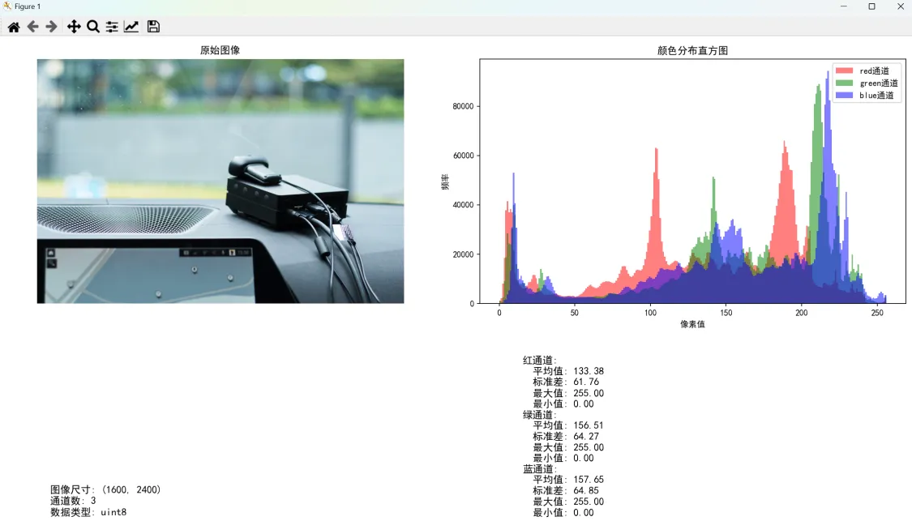

> 图 8.22 图像分析报告示例
>

### 5.2. 案例二：智能图像预处理器

#### 5.2.1. 案例描述

在边缘 AI 设备上进行实时目标检测时，图像预处理是非常重要的一环。我们需要开发一个图像预处理器，具备以下功能：

1. 从指定文件加载图像
2. 调整图像大小以适应 AI 模型的输入要求
3. 对图像进行基本的增强处理（例如亮度、对比度调整）
4. 实时显示处理前后的效果对比
5. 将处理后的图像保存到指定目录

#### 5.2.2. 流程图

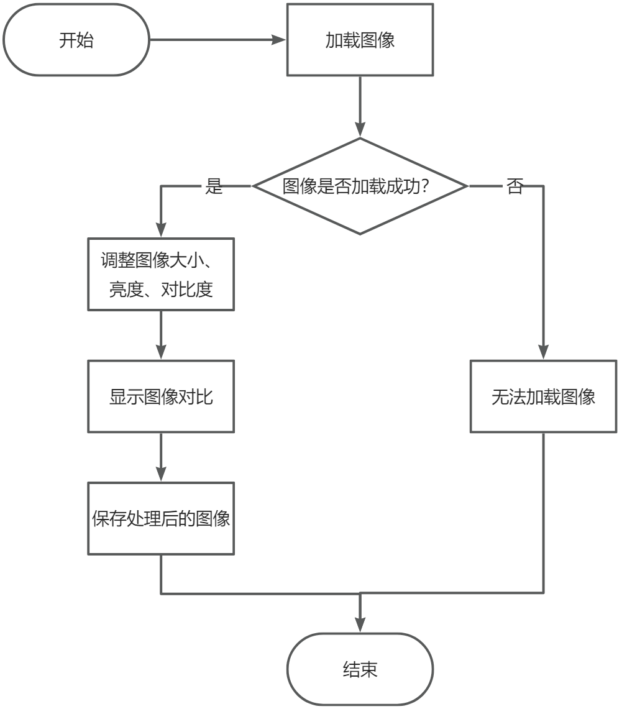

> 图 8.23 图像预处理流程图
>

#### 5.2.3. AI 辅助编程

让我们向 AI 助手描述需求：

```plain
请帮助我实现一个图像预处理器，要求使用 OpenCV 和 Matplotlib 库，具备以下功能：
1. 从文件读取图像：
  - 支持从指定路径加载常见格式的图像文件（如 JPG、PNG 等），并将其转换为 RGB 颜色空间。
2. 图像尺寸调整：
  - 能将加载的图像调整为指定的目标尺寸，默认为 224×224，允许用户自定义目标尺寸。
3. 图像增强处理：
  - 亮度调整： 支持通过调整因子增加或减少图像亮度。例如，通过乘以因子（>1 增加亮度，<1 降低亮度）。
  - 对比度调整： 支持调整图像的对比度。例如，通过调整 alpha（增益因子）和 beta（亮度偏移）来改变图像的对比度。
4. 图像对比展示：
  - 使用 Matplotlib 显示原始图像和处理后的图像，并进行左右对比，方便查看效果。每张图像应该有标题和无坐标轴。
5. 保存处理后的图像：
  - 支持将处理后的图像保存到指定的输出目录。文件名应包含时间戳（如 processed_YYYYMMDD_HHMMSS.jpg）。
  - 输出目录如果不存在，程序应自动创建。
其他要求：
- 如果图像加载失败，程序应抛出适当的错误信息（例如：图像文件不存在或无法读取）。
- 所有的图像处理操作（如亮度和对比度调整）应该是可配置的，允许用户输入不同的调整因子。
- 请确保图像保存时正确地从 RGB 转换回 BGR 格式，以兼容 OpenCV 保存图像的要求。
- 使用适当的函数和类来组织代码，保持代码的清晰和可复用性。
```

根据需求，AI 助手生成的代码如下：

```python
import cv2
import numpy as np
import matplotlib.pyplot as plt
from pathlib import Path
import datetime
import matplotlib

# 设置字体为中文支持的字体，如 SimHei（黑体）
matplotlib.rcParams['font.sans-serif'] = ['SimHei']
matplotlib.rcParams['axes.unicode_minus'] = False  # 用来正常显示负号

class ImagePreprocessor:
    """图像预处理器"""
    
    def __init__(self, target_size=(224, 224)):
        """
        初始化图像预处理器
        
        参数：
            target_size: 输出图像的目标尺寸，默认为 (224, 224)
        """
        self.target_size = target_size
        self.current_image = None
        self.processed_image = None
        
    def load_image(self, source):
        """
        加载图像（从文件）
        
        参数：
            source: 图像文件路径
        """
        # 从文件加载图像
        self.current_image = cv2.imread(source)
            
        if self.current_image is None:
            raise ValueError("无法加载图像")
            
        # 转换为 RGB 颜色空间
        self.current_image = cv2.cvtColor(self.current_image, cv2.COLOR_BGR2RGB)
        self.processed_image = self.current_image.copy()
        
    def resize_image(self):
        """调整图像尺寸"""
        self.processed_image = cv2.resize(self.processed_image, self.target_size)
        
    def adjust_brightness(self, factor=1.0):
        """
        调整图像亮度
        
        参数：
            factor: 亮度调整因子，>1 增加亮度，<1 降低亮度
        """
        self.processed_image = cv2.convertScaleAbs(
            self.processed_image, 
            alpha=factor, 
            beta=0
        )
        
    def adjust_contrast(self, factor=1.0):
        """
        调整图像对比度
        
        参数：
            factor: 对比度调整因子
        """
        mean = np.mean(self.processed_image)
        self.processed_image = cv2.convertScaleAbs(
            self.processed_image, 
            alpha=factor, 
            beta=(1.0 - factor) * mean
        )
        
    def show_comparison(self):
        """显示原始图像和处理后的图像对比"""
        plt.figure(figsize=(12, 5))
        
        plt.subplot(1, 2, 1)
        plt.imshow(self.current_image)
        plt.title('原始图像')
        plt.axis('off')
        
        plt.subplot(1, 2, 2)
        plt.imshow(self.processed_image)
        plt.title('处理后的图像')
        plt.axis('off')
        
        plt.tight_layout()
        plt.show()
        
    def save_image(self, output_dir='processed_images'):
        """
        保存处理后的图像
        
        参数：
            output_dir: 输出目录
        """
        # 创建输出目录
        Path(output_dir).mkdir(parents=True, exist_ok=True)
        
        # 生成带时间戳的文件名
        timestamp = datetime.datetime.now().strftime("%Y%m%d_%H%M%S")
        filename = f"{output_dir}/processed_{timestamp}.jpg"
        
        # 保存图像
        cv2.imwrite(filename, cv2.cvtColor(self.processed_image, cv2.COLOR_RGB2BGR))
        print(f"图像已保存至: {filename}")

# 使用示例
if __name__ == "__main__":
    # 创建预处理器实例
    preprocessor = ImagePreprocessor(target_size=(224, 224))
    
    # 加载示例图像
    preprocessor.load_image("image.jpg")
    
    # 进行图像处理
    preprocessor.resize_image()            # 调整尺寸
    preprocessor.adjust_brightness(1.2)    # 增加亮度
    preprocessor.adjust_contrast(1.3)      # 增加对比度
    
    # 显示对比结果
    preprocessor.show_comparison()
    
    # 保存处理后的图像
    preprocessor.save_image()
```

运行这个示例会得到如下结果：

+ 原始图像和处理后的图像会并排显示
+ 处理后的图像会被保存在 processed_images 目录下
+ 图像文件名包含时间戳，方便追踪和管理

## 6. 总结

通过本课的学习，我们掌握了数字图像处理的基础知识和工具使用技能。从像素、颜色空间和分辨率等基本概念，到 NumPy、OpenCV 和 Matplotlib 等实用工具的使用，我们建立起了进行图像处理的基础能力。通过实践案例的训练，我们也学会了如何将这些知识应用到实际的边缘 AI 场景中。这些基础知识将为我们后续开发更复杂的计算机视觉应用打下坚实基础。

## 7. 课后拓展

+ **阅读材料**
  + [OpenCV 官方文档 - 图像处理基础](https://docs.opencv.org/4.x/d2/d96/tutorial_py_table_of_contents_imgproc.html)
  + [NumPy 官方文档 - 数组操作](https://numpy.org/doc/stable/user/quickstart.html)
  + [Matplotlib 官方文档 - 图像可视化](https://matplotlib.org/stable/tutorials/images.html)
+ **实践练习**
    1. **图像预处理工具**

        **任务描述：**
        + 开发一个图像预处理工具，实现以下功能：
            + 支持批量读取图像文件
            + 调整图像大小到指定分辨率
            + 转换颜色空间（RGB、灰度）
            + 保存处理后的图像
        + 要求能处理常见图像格式（jpg、png等）
        + 实现友好的进度显示

        **提示：**
        + 使用 OpenCV 进行图像读取和处理
        + 通过 Matplotlib 显示处理效果
        + 注意处理图像读取和保存时的异常

    2. **图像分析器**

        **任务描述：**
        + 创建一个图像分析工具，实现：
            + 统计图像的亮度分布
            + 分析RGB通道的特征
            + 生成图像质量报告
            + 可视化分析结果
        + 支持批量处理多个图像
        + 生成分析报告

        **提示：**
        + 使用 NumPy 进行统计分析
        + 用 Matplotlib 创建可视化图表
        + 合理组织和展示分析结果
        + 处理异常图像情况

    3. **图像增强工具**

        **任务描述：**
        + 开发一个图像增强工具，包含：
            + 亮度和对比度调整
            + 颜色平衡优化
            + 图像锐化处理
            + 降噪处理
        + 实现实时预览效果
        + 支持参数调整和效果比较

        **提示：**
        + 使用 OpenCV 的图像处理函数
        + 通过 Matplotlib 实现交互式显示
        + 注意处理参数范围和边界情况
        + 保持原始图像以便比较

        <br>

    参考答案：[08-数字图像处理基础课后题参考答案](https://github.com/Seeed-Studio/Seeed_Studio_Courses/blob/Edge-AI-101-with-Nvidia-Jetson-Course/docs/cn/2/08/Homework_Answer.md)
