# 第9课：OpenCV 基础操作

## 课程简介

在第八课中，我们学习了数字图像的基本概念，包括像素、颜色空间和分辨率，并初步接触了 OpenCV 库。本课将深入 OpenCV 的实际应用，系统学习图像处理的基本操作。通过本课的学习，我们将掌握在边缘设备上处理和分析图像的核心技能。

## 课程目标

+ 掌握 OpenCV 的核心操作：熟练运用图像读取、显示和保存功能
+ 掌握基本的图像几何变换技术：包括缩放、旋转、翻转和裁剪
+ 理解图像滤波和阈值化原理，能够根据需求选择合适的处理方法
+ 通过实践操作，将理论知识转化为实际编程技能

---

## 1. OpenCV 图像处理基础

承接第八课的基础知识，我们深入学习 OpenCV 的实际应用。在上一课中，我们了解了图像的基本概念，现在让我们通过编程来操作这些图像数据。

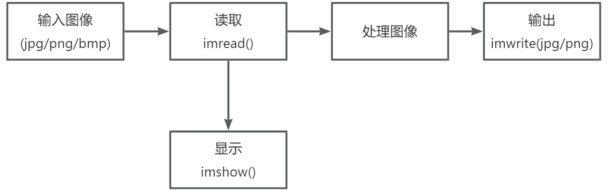

> 图 9.1 OpenCV 图像处理的基本工作流程
>

### 1.1. 图像的读取与显示

在进行任何图像处理之前，我们首先需要将图像加载到计算机内存中。这就像是将照片放入相册之前，我们需要先把照片从相机中取出来。

#### 1.1.1. 图像读取基础

OpenCV 使用 `imread()` 函数来读取图像，就像是一个搬运工，将存储在硬盘上的图像文件搬运到计算机的内存中，并提供多种读取模式供我们根据需求选择，接着进行后续的图像处理。以下是常见的图像读取模式及其效果：

| **图像读取模式** | **读取方式** | **结果描述** | **示例图像效果** |
| --- | --- | --- | --- |
| **彩色模式 (IMREAD_COLOR)** | `cv2.imread('image.jpg', cv2.IMREAD_COLOR)` | 默认读取模式，返回一个彩色图像，使用BGR颜色空间 | 显示原始彩色图像 |
| **灰度模式 (IMREAD_GRAYSCALE)** | `cv2.imread('image.jpg', cv2.IMREAD_GRAYSCALE)` | 将图像转换为灰度图像，仅包含亮度信息 | 显示黑白灰度图像 |
| **原始模式 (IMREAD_UNCHANGED)** | `cv2.imread('image.jpg', cv2.IMREAD_UNCHANGED)` | 保持图像的原始格式，包括透明度（如果有的话） | 显示原始图像（如有透明通道则显示透明区域） |

在使用 `imread()` 读取图像时，注意以下几点：

1. 图像路径：可以使用相对路径或绝对路径。
2. 默认读取模式：`imread()` 默认以彩色模式读取图像（BGR格式）。
3. 返回值：`imread()` 返回一个 NumPy 数组，表示读取的图像数据。

以下是使用不同读取模式加载图像的示例代码：

```python
import cv2

# 以不同模式读取图像
img_color = cv2.imread('image.jpg', cv2.IMREAD_COLOR)     # 默认彩色模式
img_gray = cv2.imread('image.jpg', cv2.IMREAD_GRAYSCALE)  # 灰度模式
img_unchanged = cv2.imread('image.jpg', cv2.IMREAD_UNCHANGED)  # 保持原始格式

# 检查图像是否正确读取
if img_color is None:
    print("错误：无法读取图像")
    exit()
```

#### 1.1.2. 图像显示技术

在实际开发中，我们需要及时观察图像处理的结果。OpenCV 提供了 imshow() 函数来显示图像，这是最基本的图像显示方法。然而，在开发过程中，我们往往还需要一些更强大的可视化工具，这时就可以使用 Matplotlib 库来实现更灵活的图像显示。接下来，我们将分别介绍这两种显示方法。

1. **使用 OpenCV 显示图像**

    首先，我们来看一下如何使用 OpenCV 的 `imshow()` 函数来显示图像。以下是一个简单的代码示例：

    让我们先来学习 OpenCV 的显示方法：

    ```python
    import cv2

    # 以默认彩色模式读取图像
    image = cv2.imread('image.jpg', cv2.IMREAD_COLOR)

    # 转为灰度图像
    image_gray = cv2.cvtColor(image, cv2.COLOR_BGR2GRAY)

    # 创建一个可调整大小的窗口
    cv2.namedWindow('Image Display', cv2.WINDOW_NORMAL)

    # 显示图像
    cv2.imshow('Image Display', image)

    # 在显示图像后给出提示信息
    print("按 's' 键保存灰度图像")
    print("按 'q' 键退出程序")

    # 等待按键
    key = cv2.waitKey(0)

    # 根据按键决定操作
    if key == ord('s'):  # 如果按下's'键，则保存灰度图像
        print("按下了 's' 键，保存灰度图像")
        cv2.imwrite('saved_image_gray.jpg', image_gray)
    elif key == ord('q'):  # 如果按下'q'键，则退出
        print("按下了 'q' 键，退出程序")
        cv2.destroyAllWindows()
    ```

    运行代码后，会使用 OpenCV 以彩色模式读取并显示图像，并提供退出或保存灰度图像的操作。

    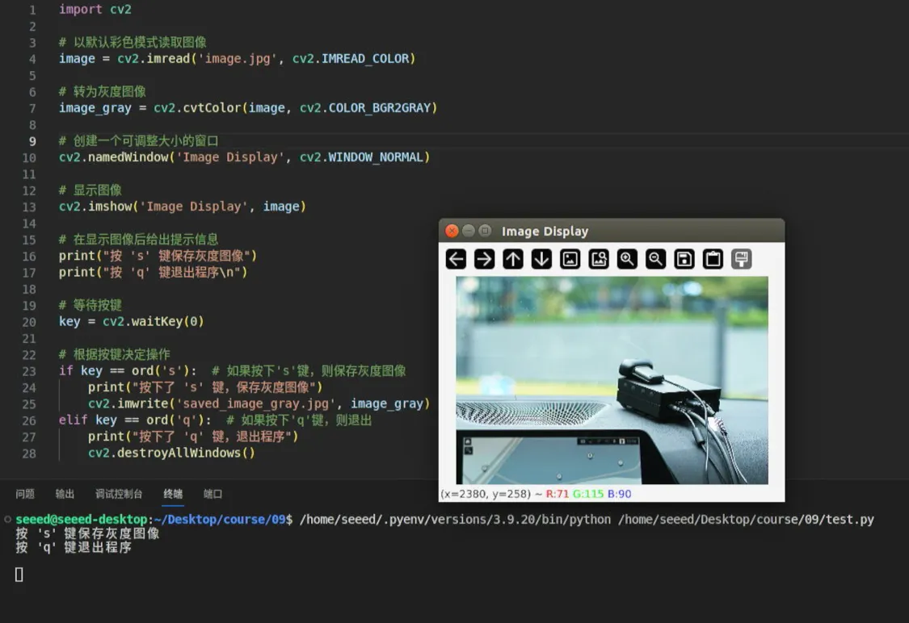

    > 图 9.2 OpenCV 显示方法示意图
    >

    虽然 OpenCV 的显示方法简单直观，但在开发过程中，我们可能需要同时展示多个图像，或者为图像添加标注信息。这时，使用 Matplotlib 会是一个更好的选择。

2. **使用 Matplotlib 显示图像**

    Matplotlib 不仅能显示图像，还可以支持多图布局、标题、坐标轴等图像标注功能。以下是一个使用 Matplotlib 显示图像的代码示例：

    ```python
    import cv2
    import matplotlib.pyplot as plt
    import matplotlib

    # 设置中文字体
    matplotlib.rcParams['font.sans-serif'] = ['SimHei']  # 设置字体为黑体，支持显示中文
    matplotlib.rcParams['axes.unicode_minus'] = False  # 解决负号显示问题

    # 以默认彩色模式读取图像
    image = cv2.imread('image.jpg', cv2.IMREAD_COLOR)

    # 将彩色图像转换为灰度图像
    image_gray = cv2.cvtColor(image, cv2.COLOR_BGR2GRAY)

    # 创建一个图形，包含两个子图，图形大小为 10x4 英寸
    plt.figure(figsize=(10, 4))

    # 显示原始图像
    plt.subplot(121)  # 第一个子图
    # 将 OpenCV 默认的 BGR 图像转换为 RGB，以便 Matplotlib 正确显示
    plt.imshow(cv2.cvtColor(image, cv2.COLOR_BGR2RGB))
    plt.title('原始图像')  # 设置标题
    plt.axis('off')  # 关闭坐标轴

    # 显示处理后的灰度图像
    plt.subplot(122)  # 第二个子图
    # 使用 'cmap="gray"' 参数让 Matplotlib 以灰度色图来显示灰度图像
    plt.imshow(image_gray, cmap='gray')
    plt.title('处理后的图像')  # 设置标题
    plt.axis('off')  # 关闭坐标轴

    # 自动调整子图布局，避免标题或图像重叠
    plt.tight_layout()

    # 显示图形
    plt.show()
    ```

    通过上述代码，我们可以同时展示原始图像和处理后的灰度图像，并为每个子图添加标题。在 Matplotlib 中，图像标注功能更加丰富，适合进行多图展示和对比分析。

    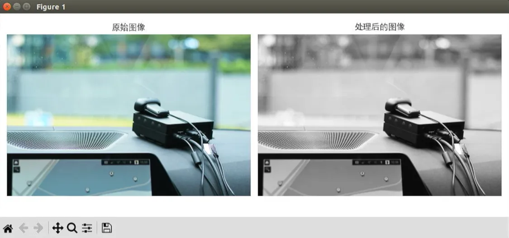

    > 图 9.3 Matplotlib 显示方法示意图
    >

3. **OpenCV 与 Matplotlib 显示方式对比**

    OpenCV 和 Matplotlib 都有其独特的优点，适合不同的应用场景。以下是两者的比较：

    | **显示方式** | **OpenCV (imshow)** | **Matplotlib** |
    | --- | --- | --- |
    | **响应速度** | 实时显示，响应速度快 | 相对较慢，适合静态展示 |
    | **交互性** | 可以创建交互式窗口 | 不支持交互式窗口，但支持交互式工具（如缩放） |
    | **应用场景** | 适合实时图像处理任务 | 适合结果展示和对比分析 |
    | **布局与显示** | 适合单一图像显示 | 支持复杂布局和多图显示 |
    | **图像标注** | 标注功能较少 | 提供丰富的图像标注功能（如标题、坐标轴等） |

    需要注意的是，OpenCV 使用 BGR 颜色格式，而 Matplotlib 使用 RGB 格式，因此在使用 Matplotlib 显示图像时，需要先将颜色空间从 BGR 转换为 RGB：

    ```python
    # 颜色空间转换
    rgb_image = cv2.cvtColor(bgr_image, cv2.COLOR_BGR2RGB)
    plt.imshow(rgb_image)
    ```

    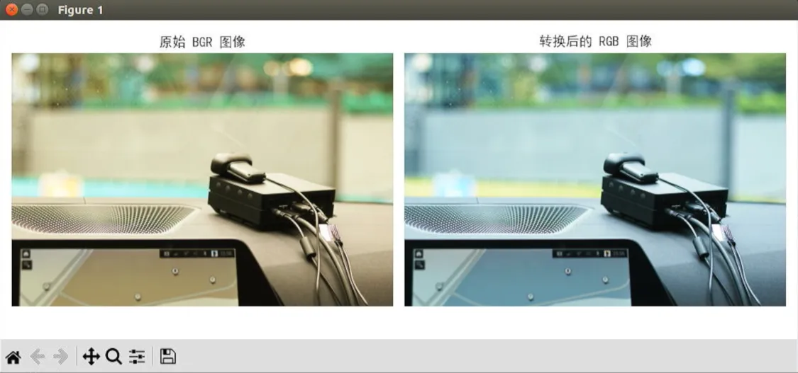

    > 图 9.4 原始 BGR 图像与 RGB 转换后图像对比
    >

#### 1.1.3. 图像保存与格式转换

处理完图像后，我们需要将结果保存下来。就像是拍完照片需要存储一样，OpenCV 提供了 imwrite() 函数让我们能够将处理后的图像保存为不同的格式。

```python
import cv2

# 读取图像
image = cv2.imread('image.jpg')

# 基本的保存方式
cv2.imwrite('output.jpg', image)  # 保存为JPEG格式
cv2.imwrite('output.png', image)  # 保存为PNG格式
cv2.imwrite('output.bmp', image)  # 保存为BMP格式

# 设置JPEG的压缩质量（0-100，默认95）
cv2.imwrite('high_quality.jpg', image, [cv2.IMWRITE_JPEG_QUALITY, 90])

# 设置PNG的压缩级别（0-9，默认3）
cv2.imwrite('compressed.png', image, [cv2.IMWRITE_PNG_COMPRESSION, 9])
```

常用图像格式对比：

| **格式** | **压缩方式** | **文件大小** | **适用场景** |
| --- | --- | --- | --- |
| **JPEG** | 有损压缩 | 小 | 照片、自然图像（不支持透明度） |
| **PNG** | 无损压缩 | 大 | 图标、截图、需要透明度的图像（支持透明度） |
| **BMP** | 无压缩 | 大 | 原始图像数据保存（无损保真，适合专业用途） |

> 保存图像时需要注意：
>
> 1. 确保有文件写入权限
> 2. 根据需求选择合适的格式
> 3. 可以通过参数控制图像质量
>

## 2. 图像的几何变换

在第八课中，我们学习了图像的像素和分辨率概念。基于这些基础知识，我们现在来探讨如何对图像进行几何变换，包括改变图像的大小、角度和方向等操作。

### 2.1. 图像缩放

#### 2.1.1. 基本概念

图像缩放是一种常见的几何变换操作，通过改变图像的分辨率来调整图像大小。在实际应用中，我们常常需要将图像调整到特定的尺寸，例如将不同大小的输入图像统一调整为模型所需的尺寸，或者根据显示需求进行调整。

OpenCV 提供了 `resize()` 函数来实现图像缩放。通过该函数，我们可以选择以下两种方式来指定目标尺寸：

1. 直接指定目标图像的宽度和高度
2. 通过缩放因子对图像进行等比例缩放

在执行缩放操作时，OpenCV 提供了多种插值方法来控制图像缩放的质量。下面是常见的插值方法及其原理：

1. **最近邻插值（INTER_NEAREST）**

    最近邻插值是最简单、计算速度最快的插值方法，但图像质量较差。它通过选择离目标像素最近的原始像素值来进行计算。

    **原理：**  
    原始像素被复制到目标像素位置，所有目标像素都使用相邻的源像素。

    示意图：

    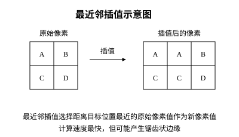

    > 图 9.5 最邻近插值示意图
    >

    适用场景：适合需要快速处理的场景。

2. **双线性插值（INTER_LINEAR）**

    双线性插值是默认的插值方法，能在速度和质量之间取得平衡。它通过对周围四个像素的加权平均来计算目标像素的值。

    **原理：**  
    通过对周围四个像素进行加权平均，生成新的像素值。权重取决于目标像素与周围像素的距离。

    示意图：

    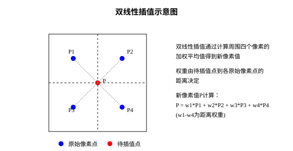

    > 图 9.6 双线性插值示意图
    >

    适用场景：适合大多数应用，能够平衡计算速度和质量。

3. **双三次插值（INTER_CUBIC）**

    双三次插值提供最好的图像质量，但计算量较大。它通过对周围16个像素点进行三次多项式加权计算，适合对图像质量有较高要求的场景。

    **原理：**  
    使用三次多项式对16个像素进行加权处理，得到平滑过渡效果，尤其适合放大图像时。

    示意图：

    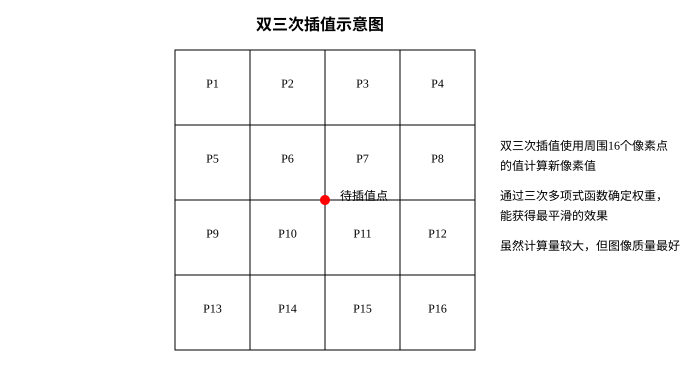

    > 图 9.7 双三次插值示意图
    >

    适用场景：适合高质量图像缩放，尤其是需要放大图像时。

4. **区域插值（INTER_AREA）**

    区域插值适用于缩小图像时，能够避免摩尔纹现象（即像素化或模糊的伪影）。它通过对原图像像素区域进行平均计算，来生成新的像素值。

    **原理：**  
    在缩小时，算法将多个相邻的像素块的平均值映射到目标像素。

    示意图：

    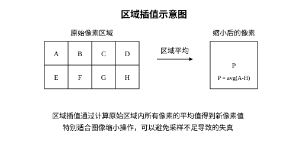

    > 图 9.8 区域插值示意图
    >

    适用场景：适合图像缩小操作，能够保留图像特征，减少失真。

#### 2.1.2. 实例展示

接下来，我们通过一个示例来观察不同插值方法的效果。以下代码展示了如何使用 OpenCV 对图像进行缩放并显示不同插值方法的效果：

```python
import cv2
import matplotlib.pyplot as plt
import numpy as np
import matplotlib

# 设置中文字体
matplotlib.rcParams['font.sans-serif'] = ['SimHei']
matplotlib.rcParams['axes.unicode_minus'] = False

# 读取图像
image = cv2.imread('image.jpg')
if image is None:
    print("无法读取图像文件")
    exit()

# 将BGR格式转换为RGB格式（Matplotlib使用RGB格式）
image = cv2.cvtColor(image, cv2.COLOR_BGR2RGB)

# 获取原始图像尺寸
height, width = image.shape[:2]
print(f"原始图像尺寸：{width}x{height}")

# 创建图形
plt.figure(figsize=(15, 10))

# 显示原始图像
plt.subplot(231)
plt.imshow(image)
plt.title('原始图像')
plt.axis('off')

# 使用不同的插值方法进行缩放
methods = {
    '最近邻插值': cv2.INTER_NEAREST,
    '双线性插值': cv2.INTER_LINEAR,
    '双三次插值': cv2.INTER_CUBIC,
    '区域插值': cv2.INTER_AREA
}

# 缩放到原始尺寸的一半
new_width = width // 2
new_height = height // 2

# 显示不同插值方法的缩放结果
for idx, (name, method) in enumerate(methods.items(), 2):
    resized = cv2.resize(image, (new_width, new_height), interpolation=method)
    plt.subplot(2, 3, idx)
    plt.imshow(resized)
    plt.title(f'{name}\n{new_width}x{new_height}')
    plt.axis('off')

plt.tight_layout()
plt.show()
```

通过运行这段代码，你将看到一个包含原始图像和缩放后的图像的窗口，其中展示了不同插值方法的效果。

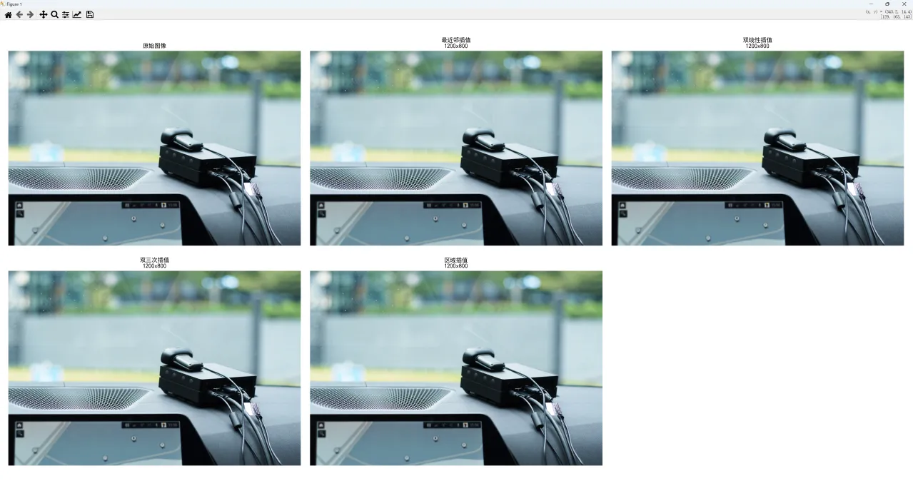

> 图 9.9 使用不同插值方法的缩放效果对比
>

在实际开发中，我们需要根据应用场景的具体需求选择合适的插值方法。如果对图像处理速度有较高要求，可以选择最近邻插值；如果需要较好的图像质量，可以选择双线性插值或双三次插值；如果主要进行图像缩小操作，建议使用区域插值。

### 2.2. 图像旋转

#### 2.2.1. 基本概念

图像旋转是另一种重要的几何变换，它可以改变图像的方向。在第八课我们学习了像素坐标系统，图像旋转实际上就是根据指定的旋转角度，重新计算每个像素的位置。OpenCV 通过仿射变换矩阵来实现这种像素位置的重新映射。

在进行图像旋转时，我们需要考虑以下几个关键要素：

1. 旋转角度：决定图像旋转的度数。正值表示逆时针旋转，负值表示顺时针旋转。
2. 旋转中心：定义图像旋转的中心点，通常我们选择图像的中心作为旋转的参考点。
3. 缩放因子：旋转时，可以同时对图像进行缩放。默认情况下，缩放因子为1.0，表示保持原始图像的大小。
4. 输出图像大小：决定旋转后图像的尺寸。可以选择保持原始尺寸，或者调整为足够大以展示完整旋转后的图像。

接下来，我们通过实例来学习如何使用 OpenCV 来实现图像的旋转。

#### 2.2.2. 旋转图像的实现

首先，我们需要使用 OpenCV 中的 `cv2.getRotationMatrix2D` 和 `cv2.warpAffine` 函数来实现图像旋转。

+ `**cv2.getRotationMatrix2D(center, angle, scale)**`：计算旋转矩阵，用于指定旋转的中心、旋转的角度和缩放因子。返回一个 2x3 的矩阵。
  + `center`：旋转的中心点，通常是图像的中心。
  + `angle`：旋转角度，单位为度，正值表示逆时针旋转。
  + `scale`：缩放因子，默认值为1.0，表示不进行缩放。
+ `**cv2.warpAffine(image, M, dsize)**`：应用仿射变换。它使用由 `cv2.getRotationMatrix2D` 计算出来的旋转矩阵来重新映射图像的每个像素。`dsize` 参数决定输出图像的尺寸。

让我们通过一个完整的示例来学习图像旋转。这段代码展示了如何在保持原始图像尺寸的情况下进行旋转。当旋转角度为非 90° 倍数时，图像可能会出现黑色边框，且部分图像可能被裁剪。  

```python
import cv2
import numpy as np
import matplotlib.pyplot as plt
import matplotlib

# 设置中文字体
matplotlib.rcParams['font.sans-serif'] = ['SimHei']
matplotlib.rcParams['axes.unicode_minus'] = False

def rotate_image(image, angle, scale=1.0):
    """
    旋转图像
    
    参数：
        image: 输入图像
        angle: 旋转角度（正值为逆时针）
        scale: 缩放因子
    """
# 获取图像尺寸
    height, width = image.shape[:2]
    
# 计算图像中心点
    center = (width // 2, height // 2)
    
# 计算旋转矩阵
    rotation_matrix = cv2.getRotationMatrix2D(center, angle, scale)
    
# 执行旋转
    rotated = cv2.warpAffine(image, rotation_matrix, (width, height))
    
    return rotated

# 读取图像
image = cv2.imread('image.jpg')
if image is None:
    print("无法读取图像文件")
    exit()

# 转换为RGB格式
image = cv2.cvtColor(image, cv2.COLOR_BGR2RGB)

# 创建图形显示不同角度的旋转效果
plt.figure(figsize=(15, 10))

# 显示原始图像
plt.subplot(231)
plt.imshow(image)
plt.title('原始图像')
plt.axis('off')

# 展示不同角度的旋转效果
angles = [45, 90, 135, 180, 270]
for idx, angle in enumerate(angles, 2):
    rotated = rotate_image(image, angle)
    plt.subplot(2, 3, idx)
    plt.imshow(rotated)
    plt.title(f'旋转 {angle}°')
    plt.axis('off')

plt.tight_layout()
plt.show()
```

运行这段代码，我们会看到一个包含多个子图的窗口，展示了不同旋转角度的效果：

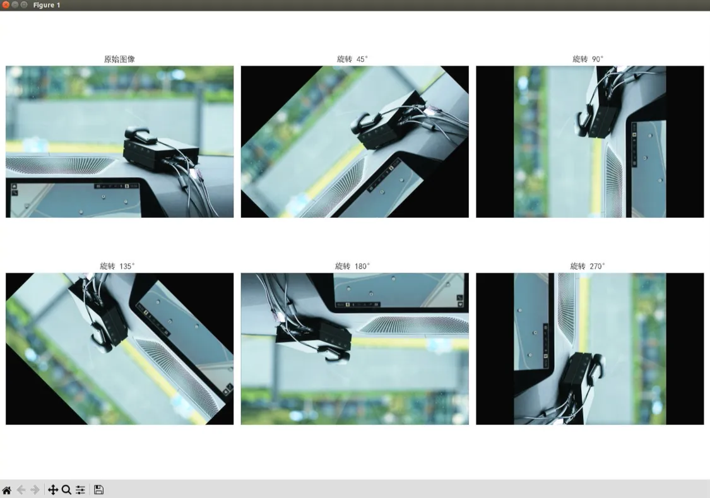

> 图 9.10 不同角度的图像旋转效果展示
>

通过观察旋转结果，我们可以注意到：

1. 旋转后的图像可能会出现黑色边框，这是因为我们保持了原始图像尺寸
2. 旋转 90°、180° 和 270° 不会丢失图像信息
3. 其他角度的旋转可能会导致部分图像内容超出显示范围

如果我们希望显示完整的旋转图像，不丢失任何图像内容，可以使用一种改进的旋转方法。

#### 2.2.3. 改进后的旋转方法

在某些情况下，旋转后的图像可能会被裁切掉一部分内容。为了确保图像在旋转后完整显示，我们可以创建一个更大的画布，将旋转后的图像完全放置在其中。我们将使用一个新的函数 `rotate_image_complete`，该函数会根据旋转后的图像对画布进行动态调整，以保证不会裁切掉任何部分。

以下是改进后的旋转代码示例：

```python
import cv2
import numpy as np
import matplotlib.pyplot as plt
import matplotlib

# 设置中文字体
matplotlib.rcParams['font.sans-serif'] = ['SimHei']
matplotlib.rcParams['axes.unicode_minus'] = False

def rotate_image_complete(image, angle):
    """
    旋转图像并显示完整内容
    
    参数：
        image: 输入图像
        angle: 旋转角度
    """
# 获取图像尺寸
    height, width = image.shape[:2]
    
# 计算旋转后的图像大小
    diagonal = int(np.sqrt(height**2 + width**2))
    
# 创建一个更大的正方形画布
    square_size = diagonal
    square_center = square_size // 2
    
# 计算旋转矩阵
    rotation_matrix = cv2.getRotationMatrix2D(
        (square_center, square_center), 
        angle, 
        1.0
    )
    
# 创建新画布
    canvas = np.full((square_size, square_size, 3), 
                    255 if image.dtype == np.uint8 else 1.0, 
                    dtype=image.dtype)
    
# 将原图复制到画布中心
    start_x = square_center - width // 2
    start_y = square_center - height // 2
    canvas[start_y:start_y+height, start_x:start_x+width] = image
    
# 执行旋转
    rotated = cv2.warpAffine(canvas, rotation_matrix, (square_size, square_size))
    
    return rotated


# 读取图像
image = cv2.imread('image.jpg')
if image is None:
    print("无法读取图像文件")
    exit()

# 转换为RGB格式
image = cv2.cvtColor(image, cv2.COLOR_BGR2RGB)

# 创建新的图形展示完整旋转效果
plt.figure(figsize=(12, 6))

plt.subplot(121)
plt.imshow(image)
plt.title('原始图像')
plt.axis('off')

plt.subplot(122)
rotated_complete = rotate_image_complete(image, 45)
plt.imshow(rotated_complete)
plt.title('完整旋转 45°')
plt.axis('off')

plt.tight_layout()
plt.show()
```

运行这段代码，我们可以看到完整保留了旋转后的图像内容：

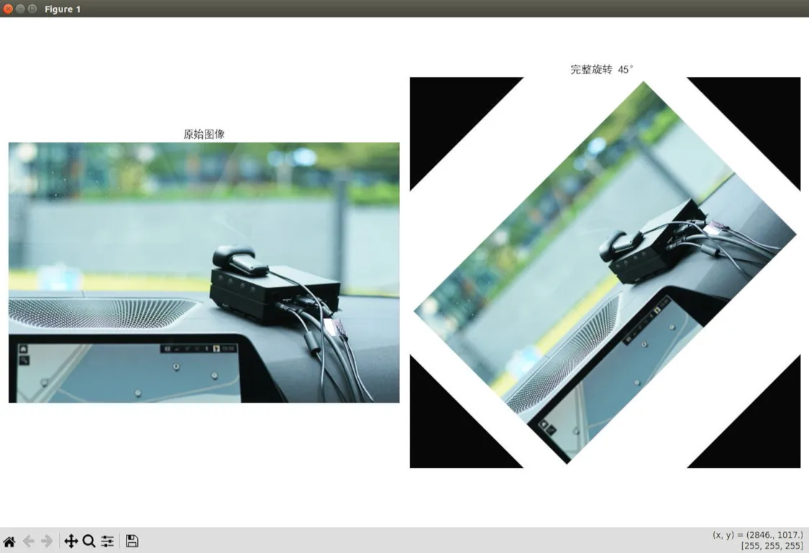

> 图 9.11 显示完整旋转图像效果
>

在实际应用中，我们需要根据具体需求选择合适的旋转方式：

+ 如果需要保持原始图像尺寸，使用第一种方法
+ 如果需要显示完整的旋转图像，使用第二种方法
+ 对于特定角度（如90°的倍数），可以使用更简单的方法实现

### 2.3. 图像翻转

图像翻转是一种简单但实用的几何变换，它可以创建图像的镜像效果。在图像处理和机器学习中，图像翻转常被用作数据增强的方法，通过创建原始图像的镜像版本来扩充训练数据集。

OpenCV 提供了 flip() 函数来实现图像翻转，这个函数通过一个简单的参数来控制翻转的方向：

+ 水平翻转（参数值为 1）：将图像沿垂直轴翻转，就像照镜子一样
+ 垂直翻转（参数值为 0）：将图像沿水平轴翻转，就像图像倒置
+ 同时水平和垂直翻转（参数值为-1）：相当于将图像旋转180度

让我们通过一个实例来观察不同翻转方式的效果：

```python
import cv2
import matplotlib.pyplot as plt
import matplotlib

# 设置中文字体
matplotlib.rcParams['font.sans-serif'] = ['SimHei']
matplotlib.rcParams['axes.unicode_minus'] = False

# 读取图像
image = cv2.imread('image.jpg')
if image is None:
    print("无法读取图像文件")
    exit()

# 转换为RGB格式
image = cv2.cvtColor(image, cv2.COLOR_BGR2RGB)

# 执行不同方向的翻转
horizontal_flip = cv2.flip(image, 1)  # 水平翻转
vertical_flip = cv2.flip(image, 0)    # 垂直翻转
both_flip = cv2.flip(image, -1)       # 同时水平和垂直翻转

# 创建图形展示翻转效果
plt.figure(figsize=(12, 8))

# 显示原始图像和各种翻转效果
images = {
    '原始图像': image,
    '水平翻转': horizontal_flip,
    '垂直翻转': vertical_flip,
    '水平+垂直翻转': both_flip
}

for idx, (title, img) in enumerate(images.items(), 1):
    plt.subplot(2, 2, idx)
    plt.imshow(img)
    plt.title(title)
    plt.axis('off')

plt.tight_layout()
plt.show()
```

运行这段代码，我们会看到一个包含四个子图的窗口，展示了原始图像及其各种翻转效果：

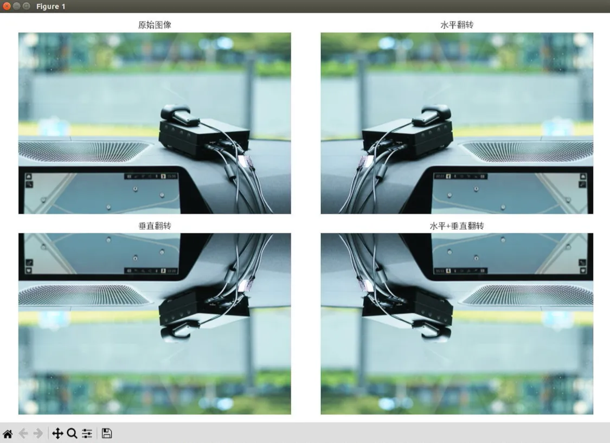

> 图 9.12 不同翻转方式的效果对比
>

通过观察翻转结果，我们可以发现：

1. 水平翻转最为常用，它创建了物体的镜像效果，常用于数据增强
2. 垂直翻转使图像上下颠倒，在特定场景（如航拍图像处理）中可能有用
3. 同时进行水平和垂直翻转相当于将图像旋转180度

在实际应用中，图像翻转有多种用途：

+ 数据增强：在训练机器学习模型时，通过翻转来增加训练样本的多样性
+ 图像校正：修正摄像头安装位置导致的图像方向问题
+ 特殊效果：创建艺术效果或满足特定的显示需求

### 2.4. 图像裁剪

#### 2.4.1. 基本概念

图像裁剪是从原始图像中提取感兴趣区域（Region of Interest, ROI）的过程。在第八课中，我们学习了图像实际上是一个由像素组成的数组。基于这个概念，在 OpenCV 中，图像裁剪可以直接通过 NumPy 的数组切片操作来实现，这种方法既简单又高效。

图像裁剪的基本原理： 在进行图像裁剪时，我们通过指定一个矩形区域，来提取图像中的一部分。裁剪区域的确定需要以下两个要素：

+ 裁剪区域的起始坐标（左上角点）：即裁剪区域的 `(x, y)` 坐标。
+ 裁剪区域的宽度和高度：即裁剪区域的尺寸。

在 Python 中，图像数据是通过 NumPy 数组来表示的，因此我们可以通过数组切片的方式来进行裁剪。裁剪的基本语法如下：

```python
cropped_image = image[y:y+height, x:x+width]
```

> 其中：
>
> + x, y 是裁剪区域左上角的坐标
> + width, height 是需要裁剪的宽度和高度
>

接下来，我们通过一个实例来学习如何使用 OpenCV 和 NumPy 来实现图像裁剪。

#### 2.4.2. 实现图像裁剪

首先，我们需要定义一个裁剪函数。以下是几个常见的裁剪场景：

1. 从图像的左上角裁剪。
2. 从图像的中心裁剪。
3. 从图像的自定义区域裁剪。

让我们首先实现一个从图像中心进行裁剪的函数：

```python
def crop_center(image, crop_width, crop_height):
    """
    从图像中心裁剪指定大小的区域
    """
# 获取图像的高度和宽度
    height, width = image.shape[:2]

# 计算裁剪区域的左上角坐标
    start_x = (width - crop_width) // 2
    start_y = (height - crop_height) // 2

# 使用NumPy数组切片来裁剪图像
    return image[start_y:start_y+crop_height, start_x:start_x+crop_width]
```

> + `image.shape[:2]` 用于获取图像的高度和宽度。
> + `(width - crop_width) // 2` 和 `(height - crop_height) // 2` 用来计算裁剪区域左上角的坐标，使得裁剪区域居中。
>

现在，我们将通过一个完整的示例来演示所有三种裁剪方式的具体实现：

```python
import cv2
import matplotlib.pyplot as plt
import matplotlib

# 设置中文字体
matplotlib.rcParams['font.sans-serif'] = ['SimHei']
matplotlib.rcParams['axes.unicode_minus'] = False

def crop_center(image, crop_width, crop_height):
    """
    从图像中心裁剪指定大小的区域
    """
    height, width = image.shape[:2]
    start_x = (width - crop_width) // 2
    start_y = (height - crop_height) // 2
    
    return image[start_y:start_y+crop_height, start_x:start_x+crop_width]

# 读取图像
image = cv2.imread('image.jpg')
if image is None:
    print("无法读取图像文件")
    exit()

# 转换为RGB格式
image = cv2.cvtColor(image, cv2.COLOR_BGR2RGB)

# 获取图像尺寸
height, width = image.shape[:2]

# 创建几种不同的裁剪示例
# 1. 从左上角裁剪
top_left = image[0:height//2, 0:width//2]

# 2. 从中心裁剪
center_crop = crop_center(image, width//2, height//2)

# 3. 自定义区域裁剪
custom_crop = image[height//2:3*height//4, width//2:3*width//4]

# 创建图形展示裁剪效果
plt.figure(figsize=(15, 10))

# 显示原始图像和裁剪结果
images = {
    '原始图像': image,
    '左上角裁剪': top_left,
    '中心裁剪': center_crop,
    '自定义区域裁剪': custom_crop
}

for idx, (title, img) in enumerate(images.items(), 1):
    plt.subplot(2, 2, idx)
    plt.imshow(img)
    plt.title(f'{title}\n尺寸: {img.shape[1]}x{img.shape[0]}')
    plt.axis('off')

plt.tight_layout()
plt.show()
```

运行这段代码，我们会看到一个包含四个子图的窗口，展示了原始图像和不同裁剪效果：

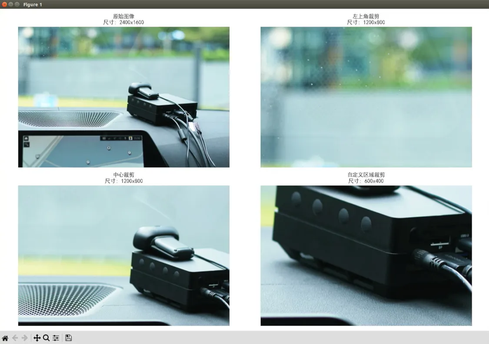

> 图 9.13 不同裁剪方式的效果对比
>

通过观察裁剪结果，我们可以发现：

1. 裁剪操作可以精确地提取我们感兴趣的图像区域
2. 裁剪后的图像保持了原始图像的像素值和颜色信息
3. 不同的裁剪方式可以满足不同的应用需求

图像裁剪在实际中有很多用途，比如去除不需要的部分、提取感兴趣的区域、生成缩略图或预览图，以及标准化图像尺寸等。

在裁剪时，需要注意以下几点：确保裁剪区域不超出图像边界，合理选择裁剪区域的位置和大小，并根据需求选择合适的裁剪方式。掌握这些要点，能帮助我们更高效地进行图像处理。

## 3. 图像滤波

图像滤波是提高图像质量的重要手段。在实际应用中，由于各种原因（如传感器噪声、光照条件等），获取的图像往往会包含一些不需要的信息或噪声。通过滤波操作，我们可以去除这些干扰，使图像更清晰或者突出特定的特征。

让我们首先理解滤波的基本概念。在第八课中，我们学习了像素是图像的基本单位。图像滤波就是通过处理每个像素及其周围像素的值，来得到新的像素值的过程。根据处理目的的不同，我们可以选择不同类型的滤波器。

### 3.1. 均值滤波

均值滤波是一种常见的图像去噪技术，常用于去除图像中的“噪声”。想象在下雨天拍照时，图像可能会出现一些像雨点一样的噪声，均值滤波就可以帮助我们减少这些噪声的影响。它的原理非常简单：在图像上滑动一个小的矩形窗口（滤波核），计算窗口内所有像素的平均值，并用这个平均值替代窗口中心的像素值，从而达到平滑图像的效果。

#### 3.1.1. 均值滤波原理

假设图像中有一个3×3的区域，像素值如下：

```plain
100  150  100
120  255  130
110  140  120
```

如果我们对中心点（值为255）进行3×3的均值滤波，就是计算这9个数的平均值：  
(100 + 150 + 100 + 120 + 255 + 130 + 110 + 140 + 120) ÷ 9 ≈ 136

这样，中心位置的值就从255变成了136，有效地减少了这个"异常"值对图像的影响。

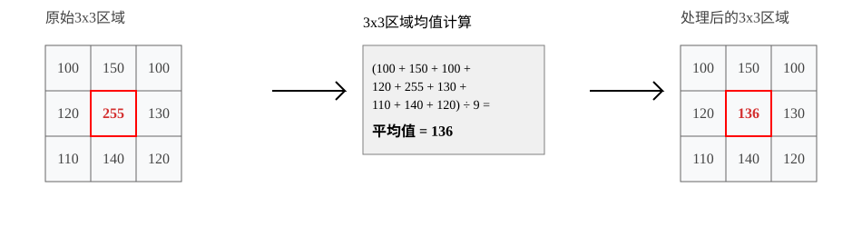

> 图 9.14 均值滤波原理示意图
>

#### 3.1.2. 使用 OpenCV 实现均值滤波

在 OpenCV 中，均值滤波可以通过 `cv2.blur()` 函数实现。接下来我们通过一个简单的示例来实际操作，首先我们会向图像添加“椒盐噪声”，然后对其应用均值滤波。

让我们通过代码来实际观察均值滤波的效果：

```python
import cv2
import matplotlib.pyplot as plt
import numpy as np
import matplotlib

# 设置中文字体
matplotlib.rcParams['font.sans-serif'] = ['SimHei']
matplotlib.rcParams['axes.unicode_minus'] = False

def add_salt_pepper_noise(image):
    """添加椒盐噪声"""
    noise = np.zeros(image.shape, np.uint8)
# 添加白点
    cv2.randu(noise, 0, 255)
    white = noise > 250
# 添加黑点
    cv2.randu(noise, 0, 255)
    black = noise > 250
    
    noisy_image = image.copy()
    noisy_image[white] = 255
    noisy_image[black] = 0
    return noisy_image

# 读取图像并转换为灰度图像
image = cv2.imread('image.jpg', cv2.IMREAD_GRAYSCALE)
if image is None:
    print("无法读取图像文件")
    exit()

# 添加椒盐噪声
noisy_image = add_salt_pepper_noise(image)

# 应用3×3均值滤波
blur_3x3 = cv2.blur(noisy_image, (3, 3))

# 展示局部放大效果
def show_zoom_effect(img, title, zoom_pos, zoom_size=100):
    """显示图像的局部放大效果"""
    x, y = zoom_pos
    zoomed = img[y:y+zoom_size, x:x+zoom_size]
    return zoomed

# 选择一个包含明显噪声的区域
zoom_pos = (1200, 650)  # 这个位置需要根据实际图像调整

# 创建图形展示滤波效果
plt.figure(figsize=(15, 10))

# 显示原始图像、噪声图像和滤波结果
images = {
    '原始图像': image,
    '添加噪声后': noisy_image,
    '均值滤波后': blur_3x3
}

for idx, (title, img) in enumerate(images.items(), 1):
# 显示完整图像
    plt.subplot(2, 3, idx)
    plt.imshow(img, cmap='gray')  # 使用灰度显示
    plt.title(title)
    plt.axis('off')
    
# 显示局部放大图
    plt.subplot(2, 3, idx+3)
    zoomed = show_zoom_effect(img, title, zoom_pos)
    plt.imshow(zoomed, cmap='gray')  # 使用灰度显示
    plt.title(f'{title} - 局部放大')
    plt.axis('off')

plt.tight_layout()
plt.show()
```

> **代码讲解**：
>
> 1. `cv2.imread()`：读取图像文件。
> 2. `cv2.cvtColor()`：将图像从 BGR 色彩空间转换为 RGB。
> 3. `cv2.blur()`：进行均值滤波操作，第一个参数是图像，第二个参数是滤波核的大小，这里使用了 3×3 的核。
> 4. `cv2.randu()`：生成随机数，用来模拟图像中的椒盐噪声。
> 5. `plt.imshow()`：显示图像，`matplotlib` 用于展示图像和滤波效果。
>

运行这段代码，我们会看到六个子图，分别展示了：

1. 原始图像及其局部放大区域
2. 添加噪声后的图像及其局部放大区域
3. 均值滤波后的图像及其局部放大区域

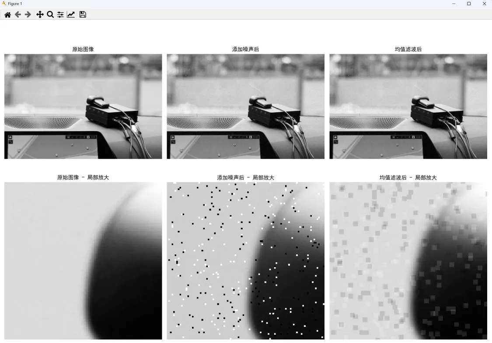

> 图 9.15 均值滤波前后对比及局部放大效果
>

通过观察局部放大的区域，我们可以清楚地看到：

1. 噪声在图像中表现为随机的黑白点
2. 均值滤波后，这些黑白点被周围像素的平均值替代，图像变得更加平滑
3. 同时，图像的边缘和细节也变得略微模糊

均值滤波就像是给图像蒙上了一层轻纱，虽然去除了噪声，但也可能会使图像的细节变得模糊。这就是为什么在实际应用中，我们需要根据具体情况来选择是否使用均值滤波，以及选择合适的滤波核大小。

### 3.2. 高斯滤波

在均值滤波中，我们对邻域内的所有像素一视同仁，赋予了相同的权重。但在现实世界中，距离越近的像素通常有更强的关联性。高斯滤波正是基于这一原理，它给予中心像素周围不同位置的像素不同的权重，这种方式更符合自然世界的规律。

高斯滤波的基本思路可以类比为：你站在一个下雨的窗前，看向远处的景物。离你最近的雨滴对你的视线影响最大，而远处的雨滴则影响较小。高斯滤波通过类似的原理处理图像，给不同位置的像素赋予不同的影响力。

#### 3.2.1. 高斯滤波原理

为了理解高斯滤波如何为像素分配权重，来看一个 5×5 的高斯核（为了便于理解，数值已经简化）：

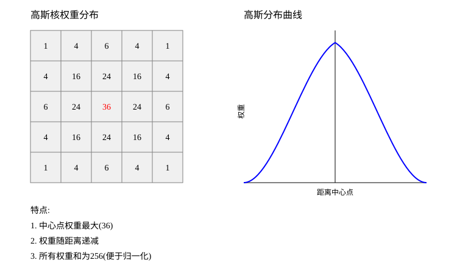

> 图 9.16 高斯滤波原理示意图
>

注意中心点的权重最大（36），向四周逐渐递减。这种权重分布遵循高斯分布（也叫正态分布），就像是一个倒扣的钟形曲线。

#### 3.2.2. 使用 OpenCV 实现高斯滤波

在 OpenCV 中，高斯滤波可以通过 `cv2.GaussianBlur()` 函数实现。接下来，我们将通过一个具体的示例来演示高斯滤波的效果。在这个例子中，我们还会添加高斯噪声，并展示高斯滤波与均值滤波的对比效果。

```python
import cv2
import matplotlib.pyplot as plt
import numpy as np
import matplotlib

# 设置中文字体
matplotlib.rcParams['font.sans-serif'] = ['SimHei']
matplotlib.rcParams['axes.unicode_minus'] = False

def add_gaussian_noise(image, mean=0, sigma=25):
    """添加高斯噪声"""
    noise = np.random.normal(mean, sigma, image.shape).astype(np.uint8)
    noisy_image = cv2.add(image, noise)
    return noisy_image

# 读取图像
image = cv2.imread('image.jpg')
if image is None:
    print("无法读取图像文件")
    exit()

# 转换为RGB格式
image = cv2.cvtColor(image, cv2.COLOR_BGR2RGB)

# 添加高斯噪声
noisy_image = add_gaussian_noise(image)

# 应用高斯滤波
gaussian_3 = cv2.GaussianBlur(noisy_image, (5, 5), 0)  # sigma=0让OpenCV自动计算
gaussian_5 = cv2.GaussianBlur(noisy_image, (5, 5), 2)  # 指定sigma=2

# 为了对比，也应用一个均值滤波
mean_blur = cv2.blur(noisy_image, (5, 5))

# 创建图形展示各种滤波效果
plt.figure(figsize=(15, 8))

# 选择一个包含细节的区域进行放大显示
x, y = 1200, 650  # 具体位置需要根据实际图像调整
zoom_size = 100

images = {
    '原始图像': image,
    '添加噪声': noisy_image,
    '高斯滤波': gaussian_3,
    '均值滤波': mean_blur
}

for idx, (title, img) in enumerate(images.items()):
# 显示完整图像
    plt.subplot(2, 4, idx+1)
    plt.imshow(img)
    plt.title(title)
    plt.axis('off')
    
# 显示局部放大图
    plt.subplot(2, 4, idx+5)
    zoomed = img[y:y+zoom_size, x:x+zoom_size]
    plt.imshow(zoomed)
    plt.title(f'{title}\n(局部放大)')
    plt.axis('off')

plt.tight_layout()
plt.show()
```

> **代码讲解：**
>
> 1. `cv2.imread()`：读取图像文件。
> 2. `cv2.cvtColor()`：将图像从 BGR 色彩空间转换为 RGB。
> 3. `cv2.GaussianBlur()`：对图像应用高斯滤波，第二个参数是滤波核的大小，第三个参数是高斯核的标准差（σ）。若 σ=0，则 OpenCV 会自动计算一个合适的值。
> 4. `np.random.normal()`：生成具有高斯分布的噪声，用于模拟图像中的高斯噪声。
> 5. `cv2.blur()`：进行均值滤波，用于与高斯滤波做对比。
>

运行代码后，你将看到一个包含多个子图的窗口：

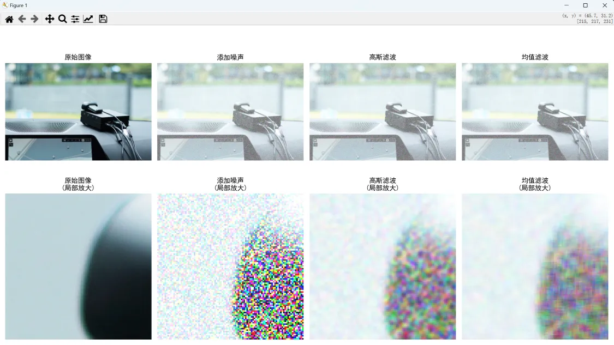

> 图 9.17 高斯滤波前后对比及局部放大效果
>

通过观察处理结果，我们可以发现高斯滤波相比均值滤波有以下优点：

1. 更好地保留了图像的边缘信息，图像看起来不会过于模糊
2. 噪声的去除更加自然，不会产生明显的块状效果
3. 处理后的图像过渡更加平滑

这就像是你通过一层磨砂玻璃看东西，高斯滤波让图像的细节保留得更好，而不是完全模糊掉。在实际应用中，高斯滤波是一种被广泛使用的图像平滑方法，特别是在需要在去噪的同时尽可能保留图像细节的场景中。

### 3.3. 中值滤波

中值滤波是一种与均值滤波和高斯滤波不同的图像平滑技术。在中值滤波中，我们不是计算邻域内像素的平均值或加权平均值，而是直接取邻域内所有像素的中间值（即中位数）来替代中心像素的值。这种方法特别适用于处理“椒盐噪声”（即图像中随机出现的黑点和白点）。

#### 3.3.1. 中值滤波原理

让我们通过一个生活中的例子来理解中值滤波：假设你在看一张老照片，上面有一些年代留下的斑点，这些斑点就像图像中的噪声。中值滤波的作用就是修复这些斑点，它会通过使用周围正常区域的颜色值来替代异常的像素值。

举个具体的例子，假设我们有以下3×3区域的像素值：

```plain
20  50  20
20  200 20
20  20  20
```

这里的200明显是一个异常值（可能是噪声）。按照大小顺序排列所有数值：

```plain
20, 20, 20, 20, 20, 20, 20, 50, 200
```

中值就是第5个数：20。这样，异常的200就被更合理的20所替代。

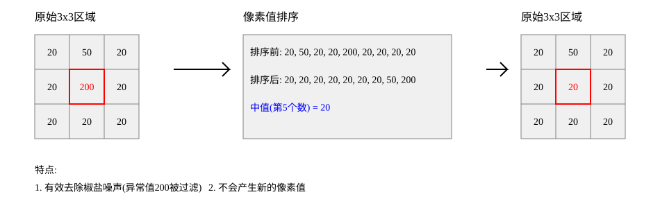

> 图 9.18 中值滤波原理示意图
>

#### 3.3.2. 使用 OpenCV 实现中值滤波

在 OpenCV 中，我们可以使用 `cv2.medianBlur()` 函数来实现中值滤波。这个函数的第一个参数是输入图像，第二个参数是滤波核的大小（必须是奇数，比如 3, 5, 7 等）。接下来，我们将通过一个例子来演示中值滤波的效果，并与均值滤波和高斯滤波做对比。

```python
import cv2
import matplotlib.pyplot as plt
import numpy as np
import matplotlib

# 设置中文字体
matplotlib.rcParams['font.sans-serif'] = ['SimHei']
matplotlib.rcParams['axes.unicode_minus'] = False

def add_salt_and_pepper_noise(image, prob=0.05):
    """添加椒盐噪声"""
    noisy_image = image.copy()
# 添加白点（盐）
    salt_mask = np.random.random(image.shape[:2]) < prob/2
    noisy_image[salt_mask] = 255
# 添加黑点（椒）
    pepper_mask = np.random.random(image.shape[:2]) < prob/2
    noisy_image[pepper_mask] = 0
    return noisy_image

# 读取图像
image = cv2.imread('image.jpg')
if image is None:
    print("无法读取图像文件")
    exit()

# 转换为RGB格式
image = cv2.cvtColor(image, cv2.COLOR_BGR2RGB)

# 添加椒盐噪声
noisy_image = add_salt_and_pepper_noise(image)

# 应用不同的滤波方法
median_filtered = cv2.medianBlur(noisy_image, 3)  # 中值滤波
mean_filtered = cv2.blur(noisy_image, (3, 3))     # 均值滤波
gaussian_filtered = cv2.GaussianBlur(noisy_image, (3, 3), 0)  # 高斯滤波

# 创建图形比较不同滤波效果
plt.figure(figsize=(15, 8))

# 选择一个包含明显噪声的区域
x, y = 1150, 650  # 具体位置需要根据实际图像调整
zoom_size = 200

images = {
    '原始图像': image,
    '椒盐噪声': noisy_image,
    '中值滤波': median_filtered,
    '均值滤波': mean_filtered,
    '高斯滤波': gaussian_filtered
}

# 显示完整图像和局部放大效果
for idx, (title, img) in enumerate(images.items()):
# 完整图像
    plt.subplot(2, 5, idx+1)
    plt.imshow(img)
    plt.title(title)
    plt.axis('off')
    
# 局部放大
    plt.subplot(2, 5, idx+6)
    zoomed = img[y:y+zoom_size, x:x+zoom_size]
    plt.imshow(zoomed)
    plt.title(f'{title}\n(局部放大)')
    plt.axis('off')

plt.tight_layout()
plt.show()
```

> **代码讲解：**
>
> 1. `cv2.imread()`：读取图像文件。
> 2. `cv2.cvtColor()`：将图像从 BGR 色彩空间转换为 RGB。
> 3. `cv2.medianBlur()`：应用中值滤波，第二个参数为滤波核大小。
> 4. `np.random.random()`：生成随机数，用于模拟椒盐噪声。
> 5. `cv2.blur()`：应用均值滤波，使用 3×3 的卷积核。
> 6. `cv2.GaussianBlur()`：应用高斯滤波，使用 3×3 的卷积核，标准差为 0。
>

运行代码后，你将看到一个包含多个子图的窗口：

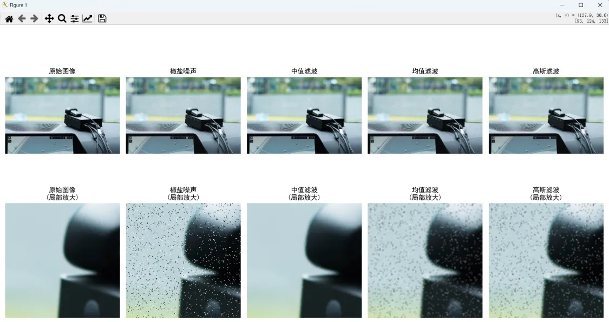

> 图 9.19 中值滤波前后对比及局部放大效果
>

通过对比不同滤波方法的效果，我们可以发现：

1. 中值滤波特别擅长去除椒盐噪声，能够有效消除随机的黑白点
2. 与均值滤波和高斯滤波相比，中值滤波在处理噪声时不会产生新的像素值，而是选择已存在的像素值
3. 中值滤波能更好地保持图像边缘的清晰度

在实际应用中，中值滤波的这些特点使它特别适合处理以下场景：

+ 去除老照片上的斑点和划痕
+ 处理扫描文档时出现的椒盐噪声
+ 清理数字图像中的随机干扰点

### 3.4. 双边滤波

在前面介绍的滤波方法中，虽然我们能够去除噪声，但它们常常会模糊图像的边缘。双边滤波（Bilateral Filter）是一种更智能的滤波方法，它能够在平滑图像的同时保留边缘的清晰度。这使得它特别适用于人像处理、图像修复等场景。

#### 3.4.1. 双边滤波原理

双边滤波在传统滤波的基础上，增加了两个权重因素来决定每个像素的贡献：

1. 空间距离权重：与高斯滤波类似，距离中心点越远的像素权重越小。即，对于距离中心较远的像素，它的影响力越小。
2. 像素值相似度权重：与中心像素的颜色差异越大的像素，权重越小。也就是说，颜色差异较大的像素将不会对中心像素的处理产生过大影响。

换句话说，双边滤波不仅考虑“这个点离中心有多远”（空间距离），还会考虑“这个点的颜色与中心点有多相似”（像素值相似度）。

#### 3.4.2. 使用 OpenCV 实现双边滤波

为了实现双边滤波，我们使用 OpenCV 中的 `cv2.bilateralFilter()` 函数。该函数的参数如下：

+ **第一个参数**：输入图像。
+ **第二个参数**：过滤窗口的直径（即相邻像素的最大距离）。
+ **第三个参数**：控制颜色相似度的标准差，数值越大，意味着相似颜色的像素对中心像素的影响越大。
+ **第四个参数**：控制空间距离的标准差，数值越大，意味着距离较远的像素仍会对中心像素产生影响。

让我们通过代码来观察双边滤波的效果，在这个例子中，我们将演示如何添加噪声，并使用高斯滤波和双边滤波对比去噪效果：

```python
import cv2
import matplotlib.pyplot as plt
import numpy as np
import matplotlib

# 设置中文字体
matplotlib.rcParams['font.sans-serif'] = ['SimHei']
matplotlib.rcParams['axes.unicode_minus'] = False

def add_mixed_noise(image):
    """添加混合噪声（高斯噪声和椒盐噪声）"""
# 添加高斯噪声
    gaussian_noise = np.random.normal(0, 25, image.shape).astype(np.uint8)
    noisy_image = cv2.add(image, gaussian_noise)
    
# 添加少量椒盐噪声
    salt_pepper_prob = 0.02
    salt_mask = np.random.random(image.shape[:2]) < salt_pepper_prob/2
    pepper_mask = np.random.random(image.shape[:2]) < salt_pepper_prob/2
    
    noisy_image[salt_mask] = 255
    noisy_image[pepper_mask] = 0
    
    return noisy_image

# 读取图像
image = cv2.imread('image.jpg')
if image is None:
    print("无法读取图像文件")
    exit()

# 转换为RGB格式
image = cv2.cvtColor(image, cv2.COLOR_BGR2RGB)

# 添加噪声
noisy_image = add_mixed_noise(image)

# 应用不同的滤波方法
gaussian_filtered = cv2.GaussianBlur(noisy_image, (5, 5), 0)
bilateral_filtered = cv2.bilateralFilter(noisy_image, 9, 75, 75)

# 创建图形展示滤波效果
plt.figure(figsize=(15, 10))

images = {
    '原始图像': image,
    '含噪声图像': noisy_image,
    '高斯滤波': gaussian_filtered,
    '双边滤波': bilateral_filtered
}

# 选择一个包含边缘的区域
x, y = 1200, 650  # 具体位置需要根据实际图像调整
zoom_size = 150

for idx, (title, img) in enumerate(images.items()):
# 显示完整图像
    plt.subplot(2, 4, idx+1)
    plt.imshow(img)
    plt.title(title)
    plt.axis('off')
    
# 显示局部放大图
    plt.subplot(2, 4, idx+5)
    zoomed = img[y:y+zoom_size, x:x+zoom_size]
    plt.imshow(zoomed)
    plt.title(f'{title}\n(局部放大)')
    plt.axis('off')

plt.tight_layout()
plt.show()
```

运行代码后，你将看到一个包含多个子图的窗口：

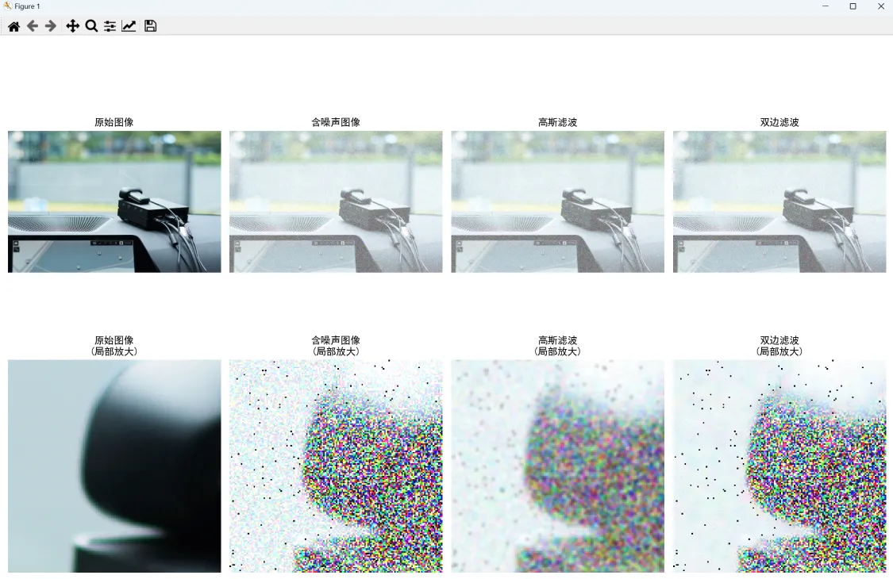

> 图 9.20 双边滤波前后对比及局部放大效果
>

观察处理结果，我们可以发现双边滤波的独特优势：

1. 平滑区域内部：在颜色相近的区域，双边滤波能够有效地平滑噪声
2. 保持边缘清晰：在颜色差异明显的区域（如物体轮廓），双边滤波会保持边缘的锐利度
3. 保留细节：相比高斯滤波，双边滤波能够更好地保留图像中的细节信息

双边滤波在许多应用场景中非常有用，尤其适合处理人像美化、建筑图像和产品图像优化等需要同时去噪和保留细节的任务。然而，它也有一些局限性，如计算速度较慢、参数设置复杂，以及在某些情况下噪声抑制效果不如其他滤波方法明显。因此，使用时需要根据具体需求权衡效果与性能。

### 3.5. 图像锐化

图像锐化的目的是增强图像中的边缘和细节，与之前提到的平滑滤波不同。平滑滤波通过去除噪声让图像变得柔和，而锐化则是让图像中的边缘和细节更加清晰和突出。可以把它想象成电视机的锐度调节：降低锐度让画面柔和，而提高锐度则让画面更加清晰。

在数字图像处理中，锐化的基本原理是增强图像中的高频部分，也就是图像中变化较为剧烈的区域。例如，我们在绘画时会通过加重物体轮廓来让其更加醒目。同样，在图像处理中，我们使用卷积核来对图像进行处理，从而增强这些高频区域。

#### 3.5.1. 使用 OpenCV 实现图像锐化

接下来，我们通过代码来实现图像锐化。我们将使用卷积操作来增强图像中的细节。具体来说，OpenCV 提供的 `filter2D()` 函数可以帮助我们通过应用卷积核对图像进行滤波。卷积核是一个小矩阵，定义了我们希望在图像中应用的滤波模式。在锐化中，我们常常使用类似以下的卷积核：

+ **锐化卷积核 1**：增强图像中的细节和边缘，效果较为强烈。
+ **锐化卷积核 2**：提供更温和的锐化效果。

让我们通过代码来观察锐化效果：

```python
import cv2
import matplotlib.pyplot as plt
import numpy as np
import matplotlib

# 设置中文字体
matplotlib.rcParams['font.sans-serif'] = ['SimHei']
matplotlib.rcParams['axes.unicode_minus'] = False

# 读取图像
image = cv2.imread('image.jpg')
if image is None:
    print("无法读取图像文件")
    exit()

# 转换为RGB格式
image = cv2.cvtColor(image, cv2.COLOR_BGR2RGB)

# 定义不同的锐化卷积核
sharpen_kernel_1 = np.array([[-1,-1,-1],
                            [-1, 9,-1],
                            [-1,-1,-1]])

sharpen_kernel_2 = np.array([[0,-1,0],
                            [-1,5,-1],
                            [0,-1,0]])

# 应用不同的锐化效果
sharpened_1 = cv2.filter2D(image, -1, sharpen_kernel_1)
sharpened_2 = cv2.filter2D(image, -1, sharpen_kernel_2)

# 创建图形展示锐化效果
plt.figure(figsize=(15, 10))

# 选择一个包含细节的区域
x, y = 1150, 650  # 具体位置需要根据实际图像调整
zoom_size = 200

images = {
    '原始图像': image,
    '强锐化效果': sharpened_1,
    '温和锐化效果': sharpened_2
}

for idx, (title, img) in enumerate(images.items()):
# 显示完整图像
    plt.subplot(2, 3, idx+1)
    plt.imshow(img)
    plt.title(title)
    plt.axis('off')
    
# 显示局部放大图
    plt.subplot(2, 3, idx+4)
    zoomed = img[y:y+zoom_size, x:x+zoom_size]
    plt.imshow(zoomed)
    plt.title(f'{title}\n(局部放大)')
    plt.axis('off')

plt.tight_layout()
plt.show()
```

> **代码解析：**
>
> 1. cv2.imread()：读取图像文件。
> 2. cv2.cvtColor()：将读取的图像从 BGR 格式转换为 RGB 格式，以便显示时正确呈现颜色。
> 3. filter2D()：应用卷积操作。这个函数将我们定义的卷积核（如 `sharpen_kernel_1` 或 `sharpen_kernel_2`）应用到图像上，从而实现锐化效果。卷积核中的每个值代表像素之间的权重关系，用来突出或削弱图像的特定部分。
> 4. plt.imshow() 和 plt.subplot()：这些函数用于绘制图像及其放大区域，帮助我们清楚地观察锐化效果。
>

运行代码后，你将看到一个包含多个子图的窗口：

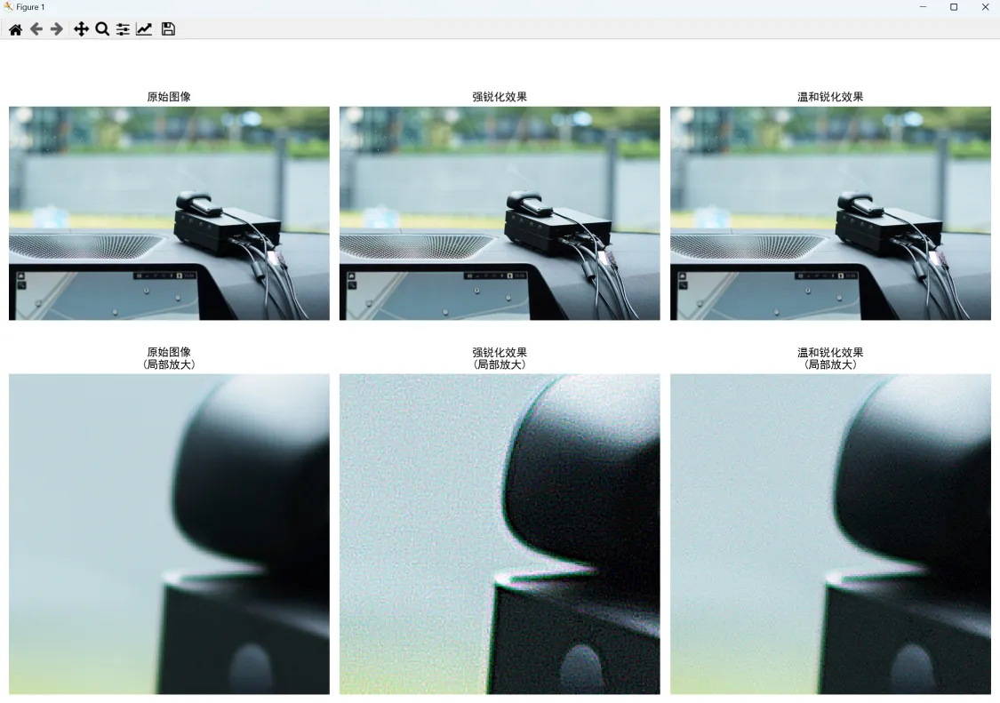

> 图 9.21 图像锐化前后对比及局部放大效果
>

通过观察不同锐化效果的对比，我们可以得出以下结论：

1. 锐化后图像的边缘和细节变得更加突出，尤其是在图像的高对比度区域（如物体的边缘）。
2. 强锐化效果（卷积核 1）：边缘会被显著增强，但也可能带来噪声的放大，产生不自然的效果。
3. 温和锐化效果（卷积核 2）：提供了更加平滑的锐化效果，能够较好地增强图像细节，同时避免过度放大噪声。

图像锐化在许多实际应用中非常有用，如提高模糊图像的清晰度、增强文本图像的可读性、突出医学图像细节以及改善老照片的视觉效果。然而，过度锐化可能导致一些问题，比如放大噪声、产生光晕效果或使图像看起来不自然。因此，在实际应用中，需要根据需求合理调整锐化程度，避免不良效果。

## 4. 图像阈值化

图像阈值化是一种将灰度图像转换为二值图像的基本技术。在图像处理中，我们经常需要将图像中的目标物体与背景分离。阈值化就像是在图像的灰度级中画一条分界线，将所有像素分为两类：高于阈值的像素归为一组（通常设为白色，值为 255），低于阈值的像素归为另一组（通常设为黑色，值为 0）。

### 4.1. 全局阈值化

全局阈值化是最基本的阈值化方法，它使用一个固定的阈值来处理整张图像。这个过程我们可以通过一个简单的例子来理解：

想象你有一张黑白照片。照片中有深色的文字和浅色的背景。如果我们把灰度值想象成高度，那么文字就像是"山谷"（较低的灰度值），背景就像是"高原"（较高的灰度值）。全局阈值化就是在这个"地形"中选择一个高度作为分界线：高于这个高度的都变成白色，低于的都变成黑色。

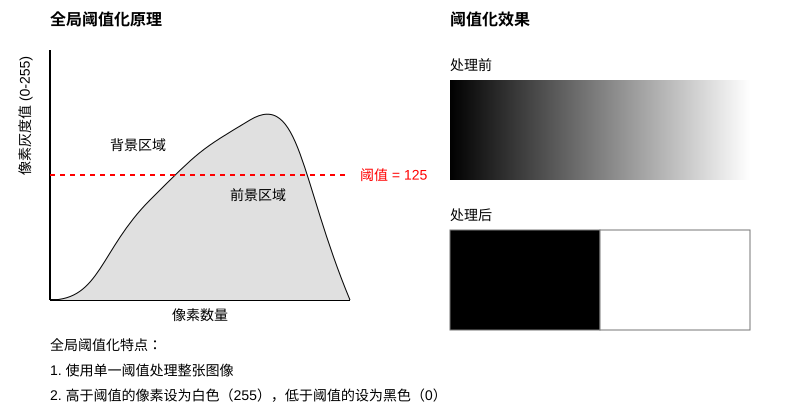

> 图 9.22 全局阈值化原理图
>

OpenCV 提供了 cv2.threshold() 函数来实现这一功能。这个函数有几种不同的阈值化类型：

+ THRESH_BINARY：大于阈值的像素设为最大值（白色），小于阈值的设为 0（黑色）
+ THRESH_BINARY_INV：与 THRESH_BINARY 相反，大于阈值的设为 0，小于阈值的设为最大值
+ THRESH_TRUNC：大于阈值的像素设为阈值，小于阈值的保持不变
+ THRESH_TOZERO：大于阈值的像素保持不变，小于阈值的设为 0
+ THRESH_TOZERO_INV：与 THRESH_TOZERO 相反

让我们通过一个示例来观察这些不同类型的效果：

```python
import cv2
import matplotlib.pyplot as plt
import numpy as np
import matplotlib

# 设置中文字体
matplotlib.rcParams['font.sans-serif'] = ['SimHei']
matplotlib.rcParams['axes.unicode_minus'] = False

# 读取图像并转为灰度图
image = cv2.imread('image.jpg')
if image is None:
    print("无法读取图像文件")
    exit()

gray = cv2.cvtColor(image, cv2.COLOR_BGR2GRAY)

# 设置阈值
threshold_value = 127

# 应用不同类型的阈值化
_, binary = cv2.threshold(gray, threshold_value, 255, cv2.THRESH_BINARY)
_, binary_inv = cv2.threshold(gray, threshold_value, 255, cv2.THRESH_BINARY_INV)
_, trunc = cv2.threshold(gray, threshold_value, 255, cv2.THRESH_TRUNC)
_, tozero = cv2.threshold(gray, threshold_value, 255, cv2.THRESH_TOZERO)
_, tozero_inv = cv2.threshold(gray, threshold_value, 255, cv2.THRESH_TOZERO_INV)

# 创建图形展示不同阈值化效果
plt.figure(figsize=(15, 10))

# 准备显示图像和对应的直方图
images = {
    '原始灰度图': gray,
    '二值化\n(THRESH_BINARY)': binary,
    '反二值化\n(THRESH_BINARY_INV)': binary_inv,
    '截断\n(THRESH_TRUNC)': trunc,
    '阈值化为零\n(THRESH_TOZERO)': tozero,
    '反阈值化为零\n(THRESH_TOZERO_INV)': tozero_inv
}

# 第一行：显示原始图像和前两种阈值化结果
for idx, (title, img) in enumerate(list(images.items())[:3]):
    plt.subplot(2, 3, idx+1)
    plt.imshow(img, cmap='gray')
    plt.title(title)
    plt.axis('off')

# 第二行：显示后三种阈值化结果
for idx, (title, img) in enumerate(list(images.items())[3:]):
    plt.subplot(2, 3, idx+4)
    plt.imshow(img, cmap='gray')
    plt.title(title)
    plt.axis('off')

plt.tight_layout()
plt.show()

# 展示直方图和阈值位置
plt.figure(figsize=(10, 5))
hist = cv2.calcHist([gray], [0], None, [256], [0, 256])
plt.plot(hist, color='gray')
plt.axvline(x=threshold_value, color='r', linestyle='--', label='阈值')
plt.fill_between(range(256), hist.reshape(-1), color='gray', alpha=0.5)
plt.title('图像直方图与阈值位置')
plt.xlabel('像素值')
plt.ylabel('像素数量')
plt.legend()
plt.grid(True)
plt.show()
```

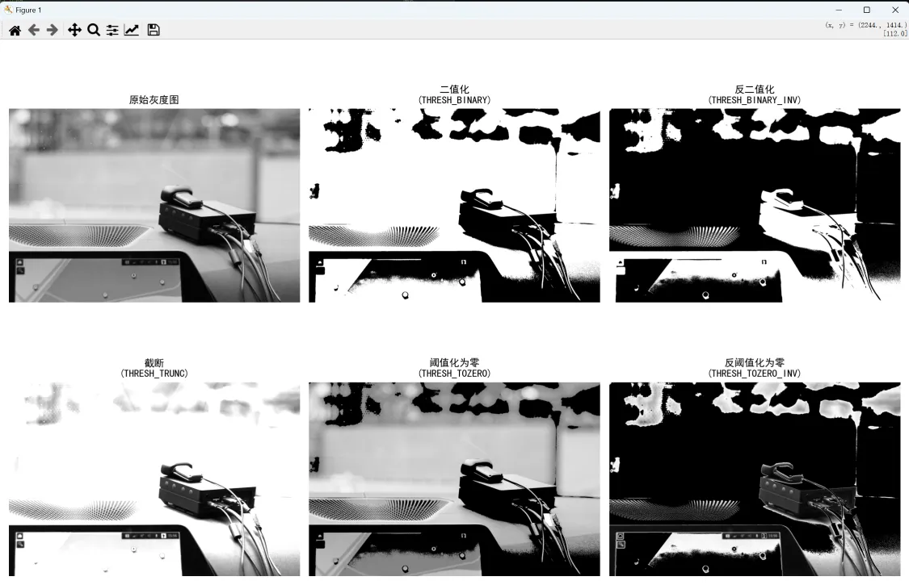

> 图 9.23 全局阈值化的多种类型
>

通过运行这段代码，我们可以观察到不同阈值化方法的特点：

1. 二值化（THRESH_BINARY）：
    + 最基本的阈值化方式
    + 适合将目标和背景明显分开的场景
    + 常用于文字识别、物体分割等任务
2. 反二值化（THRESH_BINARY_INV）：
    + 与二值化的结果相反
    + 当目标物体比背景暗时特别有用
    + 常用于处理深色文字的文档
3. 截断（THRESH_TRUNC）：
    + 保留了部分原始图像的灰度信息
    + 适合需要突出亮区域的场景
    + 可用于高光区域的分析
4. 阈值化为零（THRESH_TOZERO）：
    + 保留了高于阈值部分的灰度信息
    + 适合分析图像中较亮的区域
    + 可用于选择性地保留图像特征
5. 反阈值化为零（THRESH_TOZERO_INV）：
    + 保留了低于阈值部分的灰度信息
    + 适合分析图像中较暗的区域
    + 可用于阴影分析

要注意的是，全局阈值化虽然简单直观，但它有一个明显的局限性：它使用同一个阈值处理整张图像。这在光照不均匀或目标物体与背景对比度不一致的情况下可能会产生不理想的结果。这就是为什么我们需要更先进的阈值化方法，比如接下来要介绍的自适应阈值化。

### 4.2. Otsu阈值化

前面讨论的全局阈值化方法需要我们手动设定阈值，这往往需要多次尝试才能找到合适的值。Otsu 阈值化则提供了一种自动计算最优阈值的方法。这种方法特别适合处理具有双峰直方图的图像，即图像的像素值分布呈现两个明显的峰值。

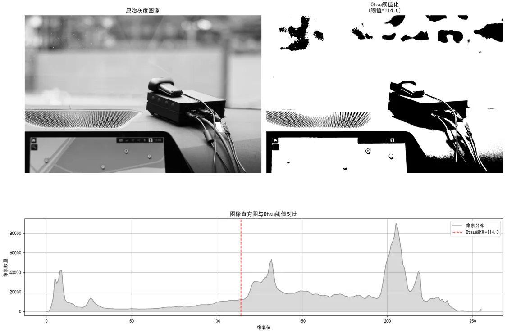

> 图 9.24 Otsu阈值化示意图
>

让我们通过一个实际的例子来理解 Otsu 方法的工作原理：

```python
import cv2
import matplotlib.pyplot as plt
import numpy as np
import matplotlib

# 设置中文字体
matplotlib.rcParams['font.sans-serif'] = ['SimHei']
matplotlib.rcParams['axes.unicode_minus'] = False

# 读取并处理图像
image = cv2.imread('image.jpg')
if image is None:
    print("无法读取图像文件")
    exit()

gray = cv2.cvtColor(image, cv2.COLOR_BGR2GRAY)

# 计算Otsu阈值
ret, otsu_thresh = cv2.threshold(gray, 0, 255, cv2.THRESH_BINARY + cv2.THRESH_OTSU)

# 对比不同阈值的效果
ret_simple, simple_thresh = cv2.threshold(gray, 127, 255, cv2.THRESH_BINARY)

# 计算直方图
hist = cv2.calcHist([gray], [0], None, [256], [0, 256])

# 创建图形
plt.figure(figsize=(15, 10))

# 第一行：显示原始图像和阈值化结果
plt.subplot(231)
plt.imshow(gray, cmap='gray')
plt.title('原始灰度图像')
plt.axis('off')

plt.subplot(232)
plt.imshow(simple_thresh, cmap='gray')
plt.title(f'简单阈值化\n(阈值=127)')
plt.axis('off')

plt.subplot(233)
plt.imshow(otsu_thresh, cmap='gray')
plt.title(f'Otsu阈值化\n(阈值={ret:.1f})')
plt.axis('off')

# 第二行：显示直方图和阈值位置
plt.subplot(212)
plt.plot(hist.ravel(), color='gray', alpha=0.7, label='像素分布')
plt.axvline(x=ret, color='r', linestyle='--', label=f'Otsu阈值={ret:.1f}')
plt.axvline(x=127, color='b', linestyle='--', label='简单阈值=127')
plt.fill_between(range(256), hist.ravel(), color='gray', alpha=0.3)
plt.title('图像直方图与阈值对比')
plt.xlabel('像素值')
plt.ylabel('像素数量')
plt.legend()
plt.grid(True)

plt.tight_layout()
plt.show()
```

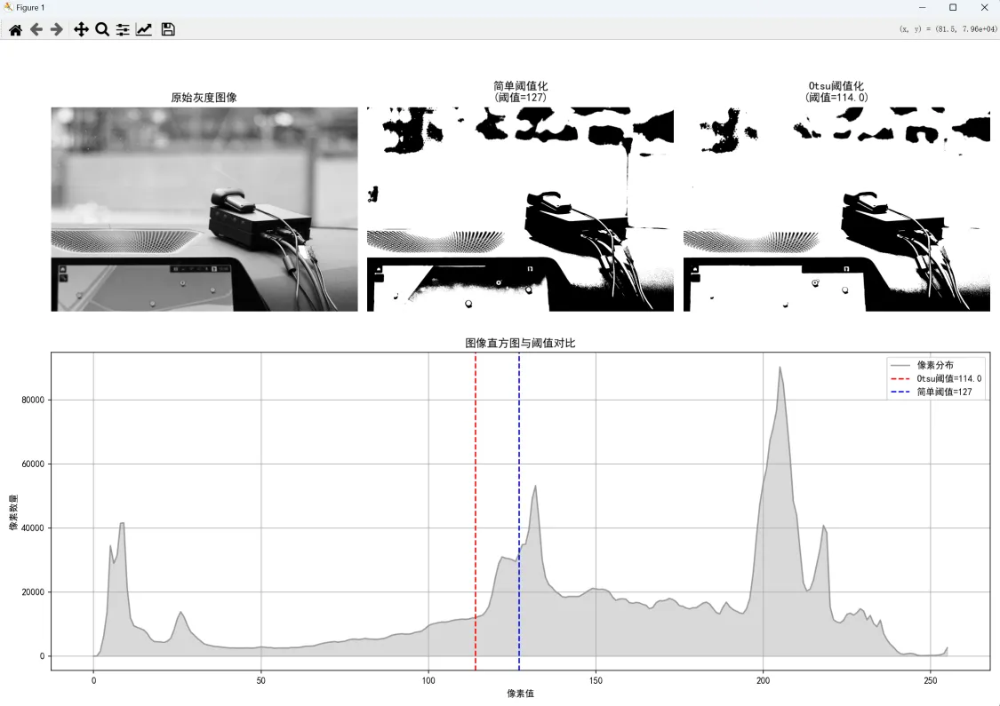

> 图 9.25 Otsu阈值化对比图
>

Otsu 方法的工作原理是通过最大化类间方差来找到最优阈值：

1. 对于每个可能的阈值，将图像分为前景和背景两部分
2. 计算两部分的方差（衡量像素值的分散程度）
3. 选择使得前景和背景两部分方差之和最小的阈值作为最终阈值

通过观察结果，我们可以发现 Otsu 方法的优势：

1. 自动确定最优阈值，无需手动调节
2. 对双峰分布的图像效果特别好
3. 处理结果通常比简单阈值化更加合理

Otsu 方法在以下场景特别有用：

+ 物体分割：分离前景物体和背景
+ 文字识别：将文字从背景中提取出来
+ 医学图像分析：分离不同组织类型

需要注意的是，Otsu 方法也有其局限性：

1. 仅适用于双峰分布的图像
2. 对于噪声敏感
3. 在图像直方图分布比较平坦时效果可能不理想

### 4.3. 自适应阈值化

自适应阈值化是一种更智能的图像分割方法。不同于全局阈值化使用固定阈值，自适应阈值化会根据每个像素邻域内的灰度分布来确定该像素的阈值。这种方法特别适合处理光照不均匀的图像。

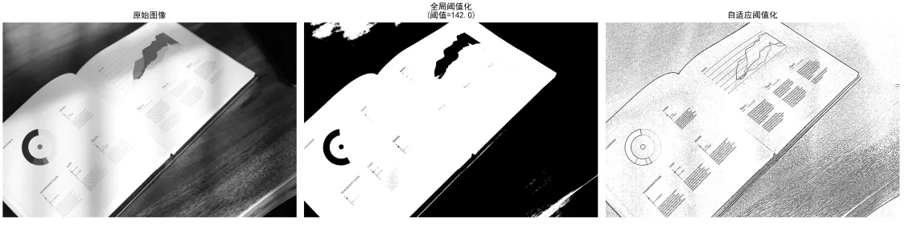

> 图 9.26 自适应阈值化示意图
>

让我们通过一个日常的例子来理解：想象你在阅读一本光照明暗不均的书，书页上有些区域因为光线不均而形成阴影。如果用全局阈值化，可能会将阴影区域的文字错误地识别为背景。而自适应阈值化就像是我们阅读时会根据局部的明暗变化来调整判断，从而能够正确识别阴影下的文字。

OpenCV 提供了 adaptiveThreshold() 函数来实现自适应阈值化，它支持两种计算邻域阈值的方法：

1. 均值法（ADAPTIVE_THRESH_MEAN_C）：使用邻域内所有像素的平均值
2. 高斯法（ADAPTIVE_THRESH_GAUSSIAN_C）：使用高斯加权平均值，离中心越近的像素权重越大

让我们通过代码来观察这两种方法的效果：

```python
import cv2
import matplotlib.pyplot as plt
import numpy as np
import matplotlib

# 设置中文字体
matplotlib.rcParams['font.sans-serif'] = ['SimHei']
matplotlib.rcParams['axes.unicode_minus'] = False

def create_uneven_lighting(image):
    """创建模拟的不均匀光照效果"""
    rows, cols = image.shape
# 创建渐变光照
    gradient = np.zeros((rows, cols), dtype=np.uint8)
    center = (cols // 3, rows // 3)
    for i in range(rows):
        for j in range(cols):
            distance = np.sqrt((i - center[1])**2 + (j - center[0])**2)
            gradient[i,j] = max(0, min(255, 255 - distance/2))
    return cv2.addWeighted(image, 0.7, gradient, 0.3, 0)

# 读取图像并转为灰度图
image = cv2.imread('image.jpg')
if image is None:
    print("无法读取图像文件")
    exit()

gray = cv2.cvtColor(image, cv2.COLOR_BGR2GRAY)

# 创建不均匀光照的图像
uneven_light = create_uneven_lighting(gray)

# 全局阈值化
_, global_thresh = cv2.threshold(uneven_light, 127, 255, cv2.THRESH_BINARY)

# 自适应阈值化 - 均值法
adaptive_mean = cv2.adaptiveThreshold(
    uneven_light,
    255,
    cv2.ADAPTIVE_THRESH_MEAN_C,
    cv2.THRESH_BINARY,
    blockSize=11,
    C=2
)

# 自适应阈值化 - 高斯法
adaptive_gaussian = cv2.adaptiveThreshold(
    uneven_light,
    255,
    cv2.ADAPTIVE_THRESH_GAUSSIAN_C,
    cv2.THRESH_BINARY,
    blockSize=11,
    C=2
)

# 显示结果
plt.figure(figsize=(15, 10))

images = {
    '原始灰度图像': gray,
    '不均匀光照图像': uneven_light,
    '全局阈值化': global_thresh,
    '自适应均值阈值化': adaptive_mean,
    '自适应高斯阈值化': adaptive_gaussian
}

for idx, (title, img) in enumerate(images.items(), 1):
    plt.subplot(2, 3, idx)
    plt.imshow(img, cmap='gray')
    plt.title(title)
    plt.axis('off')

plt.tight_layout()
plt.show()
```

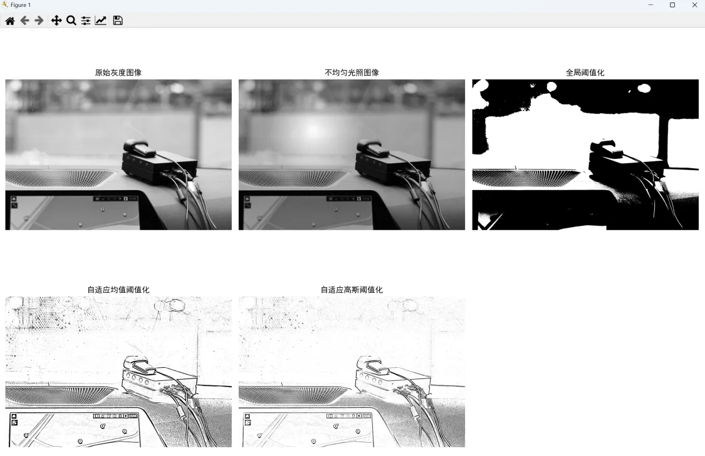

> 图 9.27 自适应阈值化对比图
>

这段代码展示了自适应阈值化的两个关键参数：

1. blockSize：用于计算阈值的邻域大小，必须是奇数
2. C：从计算出的平均值或加权平均值中减去的常数

通过观察结果，我们可以发现自适应阈值化的优势：

1. 能够克服不均匀光照的影响
2. 更好地保持局部细节
3. 对图像中的渐变变化具有更强的适应性

自适应阈值化在以下场景特别有用：

+ 文档扫描：处理有褶皱或光照不均的纸张
+ 工业检测：处理表面有阴影的零件图像
+ 生物医学图像：分析显微镜下组织样本的图像

### 4.4. 选择合适的阈值化方法

在前面我们学习了三种不同的阈值化方法：全局阈值化、Otsu 阈值化和自适应阈值化。每种方法都有其适用场景和限制，让我们系统地分析如何选择合适的阈值化方法。

首先，我们需要评估图像的特征。分析以下几个关键问题可以帮助我们做出选择：

1. 图像的光照是否均匀？
2. 前景和背景的对比度如何？
3. 图像是否包含噪声？
4. 处理速度是否是关键考虑因素？

让我们通过一个实例来比较不同阈值化方法的效果：

```python
import cv2
import matplotlib.pyplot as plt
import numpy as np
import matplotlib

# 设置中文字体
matplotlib.rcParams['font.sans-serif'] = ['SimHei']
matplotlib.rcParams['axes.unicode_minus'] = False

def compare_thresholding_methods(image_path):
    """比较不同阈值化方法的效果和性能
    
    参数：
        image_path：输入图像的路径
    """
# 读取图像并转为灰度图
    image = cv2.imread(image_path)
    if image is None:
        print("无法读取图像文件")
        return
        
    gray = cv2.cvtColor(image, cv2.COLOR_BGR2GRAY)
    
# 创建不均匀光照效果（模拟）
    rows, cols = gray.shape
    gradient = np.zeros((rows, cols), dtype=np.uint8)
    for i in range(rows):
        gradient[i, :] = int(255 * (i / rows))
    uneven_light = cv2.addWeighted(gray, 0.7, gradient, 0.3, 0)
    
# 计算处理时间和结果
    results = []
    times = []
    titles = []
    
# 1. 全局阈值化
    start_time = cv2.getTickCount()
    _, global_thresh = cv2.threshold(uneven_light, 127, 255, cv2.THRESH_BINARY)
    time_global = (cv2.getTickCount() - start_time) / cv2.getTickFrequency()
    
# 2. Otsu 阈值化
    start_time = cv2.getTickCount()
    _, otsu_thresh = cv2.threshold(uneven_light, 0, 255, cv2.THRESH_BINARY + cv2.THRESH_OTSU)
    time_otsu = (cv2.getTickCount() - start_time) / cv2.getTickFrequency()
    
# 3. 自适应阈值化
    start_time = cv2.getTickCount()
    adaptive_thresh = cv2.adaptiveThreshold(
        uneven_light, 255,
        cv2.ADAPTIVE_THRESH_GAUSSIAN_C,
        cv2.THRESH_BINARY, 11, 2
    )
    time_adaptive = (cv2.getTickCount() - start_time) / cv2.getTickFrequency()
    
# 整理结果
    results = [uneven_light, global_thresh, otsu_thresh, adaptive_thresh]
    titles = ['原始图像', 
              f'全局阈值化\n{time_global:.4f}秒',
              f'Otsu阈值化\n{time_otsu:.4f}秒',
              f'自适应阈值化\n{time_adaptive:.4f}秒']
    
# 显示结果
    plt.figure(figsize=(15, 10))
    for idx, (img, title) in enumerate(zip(results, titles), 1):
        plt.subplot(2, 2, idx)
        plt.imshow(img, cmap='gray')
        plt.title(title)
        plt.axis('off')
    
    plt.tight_layout()
    plt.show()
    
# 打印性能对比
    print("\n性能对比：")
    print(f"全局阈值化处理时间：{time_global:.4f} 秒")
    print(f"Otsu阈值化处理时间：{time_otsu:.4f} 秒")
    print(f"自适应阈值化处理时间：{time_adaptive:.4f} 秒")

# 使用示例
compare_thresholding_methods('image.jpg')
```

运行这段代码，我们可以看到不同方法的效果对比和处理时间。

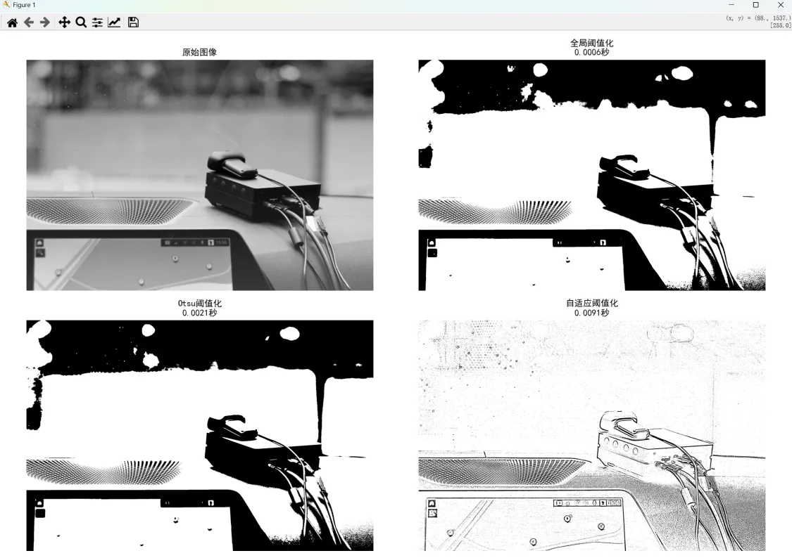

> 图 9.28 三种阈值化效果对比
>

根据结果，我们可以为不同场景推荐合适的阈值化方法：

1. 全局阈值化适用于：
    + 光照均匀的场景
    + 前景和背景对比度明显
    + 需要快速处理的应用
    + 计算资源有限的设备
2. Otsu 阈值化适用于：
    + 图像直方图呈双峰分布
    + 不确定最佳阈值的情况
    + 批量处理不同图像
    + 对处理速度要求不高的场景
3. 自适应阈值化适用于：
    + 光照不均匀的场景
    + 需要保留局部细节
    + 处理文档图像
    + 对处理质量要求较高的应用

在实际应用中，我们还需要考虑：

+ 如果对处理速度有要求，可以先尝试全局阈值化
+ 如果不确定最佳阈值，可以使用 Otsu 方法作为起点
+ 如果效果都不理想，再考虑使用自适应阈值化
+ 处理大量图像时，可以先在样本上测试不同方法的效果

## 5. 实践案例

在掌握了基础的 OpenCV 操作、图像滤波和阈值化方法后，让我们通过几个实例来实践这些知识。通过这些案例，我们将学习如何将不同的图像处理技术整合起来，解决实际问题。

### 5.1. 案例一：文档图像增强系统

#### 5.1.1. 案例描述

开发一个文档图像增强系统，该系统需要实现以下功能：

1. 对文档图像进行预处理，去除噪声和不均匀光照的影响
2. 使用合适的阈值化方法将文档转换为清晰的黑白图像
3. 提供处理结果的可视化展示
4. 评估不同处理方法的效果

#### 5.1.2. 流程图

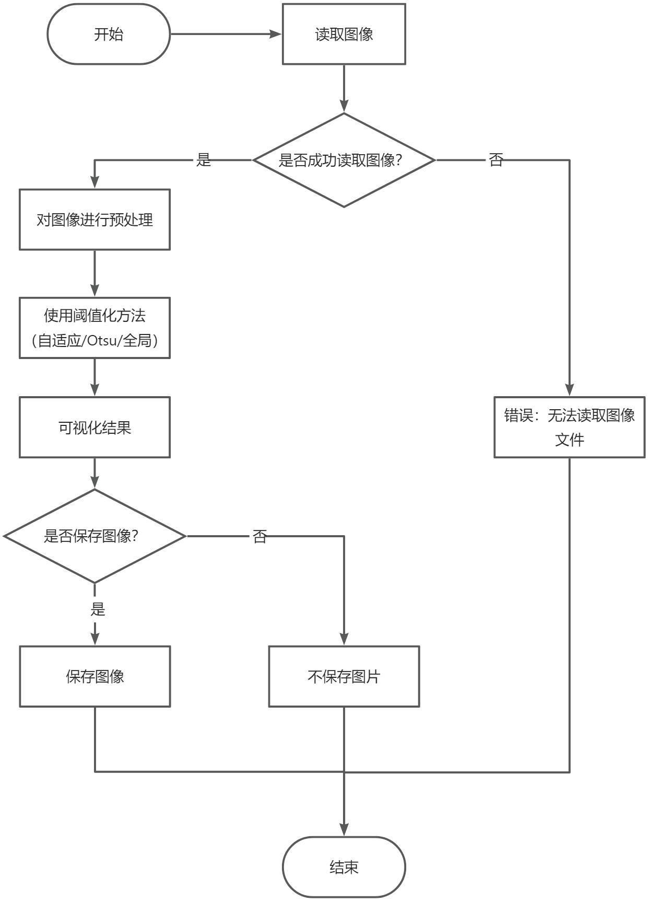

> 图 9.29 文档图像增强系统流程图
>

#### 5.1.3. AI 辅助编程

让我们向 AI 助手描述需求：

```plain
我需要开发一个文档图像增强系统，具有以下功能：

1. 图像预处理能力：
   - 能够读取各种常见格式的文档图像（如 JPG、PNG 等）
   - 对图像进行降噪处理，去除扫描或拍摄产生的噪点

2. 图像增强功能：
   - 实现多种阈值化方法（全局阈值化、Otsu 方法、自适应阈值化）
   - 允许用户通过参数选择不同的处理方法

3. 结果展示和评估：
   - 能够同时显示原始图像和处理后的效果
   - 支持多种处理方法的结果对比
   - 可保存处理结果为图像文件

4. 使用实现特点：
   - 基于Matplotlib的可视化展示
   - 控制台程序批量处理
   - 模块化代码结构方便扩展

请使用 OpenCV 和 Matplotlib 实现这些功能，并确保代码结构清晰，便于维护和扩展。
```

根据需求，AI 助手生成的代码如下：

```python
import cv2
import matplotlib.pyplot as plt
import numpy as np
import matplotlib

# 设置中文字体
matplotlib.rcParams['font.sans-serif'] = ['SimHei']
matplotlib.rcParams['axes.unicode_minus'] = False

class DocumentEnhancer:
    """文档图像增强器"""
    
    def __init__(self):
        """初始化增强器"""
        pass
        
    def preprocess(self, image):
        """预处理步骤"""
# 转换为灰度图
        gray = cv2.cvtColor(image, cv2.COLOR_BGR2GRAY)
        
# 使用高斯滤波去除噪声
        blurred = cv2.GaussianBlur(gray, (5, 5), 0)
        
        return blurred
        
    def enhance(self, image, method='adaptive'):
        """
        使用指定方法增强图像
        
        参数：
            image: 输入图像
            method: 使用的阈值化方法，可选 'adaptive', 'otsu', 'global'
        """
        processed = self.preprocess(image)
        
        if method == 'adaptive':
# 使用自适应阈值化
            result = cv2.adaptiveThreshold(
                processed, 255,
                cv2.ADAPTIVE_THRESH_GAUSSIAN_C,
                cv2.THRESH_BINARY,
                blockSize=11,
                C=2
            )
        elif method == 'otsu':
# 使用Otsu阈值化
            _, result = cv2.threshold(
                processed, 0, 255,
                cv2.THRESH_BINARY + cv2.THRESH_OTSU
            )
        else:
# 使用全局阈值化
            _, result = cv2.threshold(
                processed, 127, 255,
                cv2.THRESH_BINARY
            )
            
        return result
        
    def visualize_results(self, image, save_path=None):
        """
        可视化不同方法的处理结果
        """
# 获取不同方法的处理结果
        adaptive_result = self.enhance(image, 'adaptive')
        otsu_result = self.enhance(image, 'otsu')
        global_result = self.enhance(image, 'global')
        
# 创建图形展示结果
        plt.figure(figsize=(15, 10))
        
        images = {
            '原始图像': cv2.cvtColor(image, cv2.COLOR_BGR2RGB),
            '自适应阈值化': adaptive_result,
            'Otsu阈值化': otsu_result,
            '全局阈值化': global_result
        }
        
        for idx, (title, img) in enumerate(images.items(), 1):
            plt.subplot(2, 2, idx)
            plt.imshow(img, cmap='gray' if idx > 1 else None)
            plt.title(title)
            plt.axis('off')
            
        plt.tight_layout()
        
        if save_path:
            plt.savefig(save_path)
        plt.show()

# 使用示例
def process_document(image_path):
# 读取图像
    image = cv2.imread(image_path)
    if image is None:
        print("无法读取图像文件")
        return
        
# 创建增强器实例
    enhancer = DocumentEnhancer()
    
# 处理并展示结果
    enhancer.visualize_results(image, 'enhanced_results.png')

# 处理示例文档
process_document('image.jpg')
```

#### 5.1.4. 处理结果分析

通过运行上述代码，我们可以得到不同处理方法的效果对比：

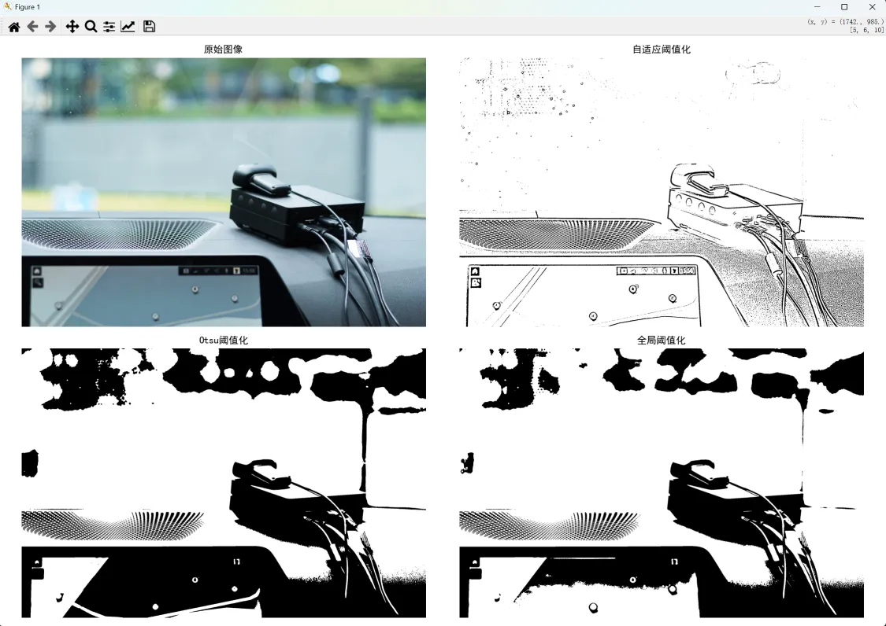

> 图 9.30 图像增强系统效果展示
>

从结果可以观察到：

1. 自适应阈值化方法能很好地处理光照不均的情况
2. Otsu 方法在文档对比度较好的区域效果明显
3. 全局阈值化方法最简单，但效果相对较差

### 5.2. 几何图形分析系统

#### 5.2.1. 案例描述

开发一个几何图形分析系统，用于处理包含简单几何形状（如圆形、三角形、矩形等）的图像。这个案例将综合运用本课所学的图像处理技术，包括基本操作、几何变换、滤波和阈值化，来实现对几何图形的预处理和分析。

系统需要实现以下功能：

1. 对包含几何图形的图像进行预处理
2. 通过几何变换调整图形的方向和大小
3. 使用不同的滤波方法处理图像
4. 通过阈值化方法提取几何形状
5. 比较不同处理方法的效果

#### 5.2.2. 流程图

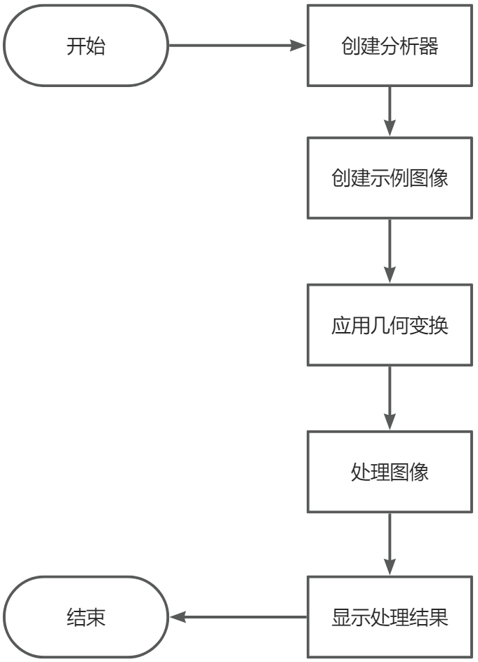

> 图 9.31 几何图形分析系统流程图
>

#### 5.2.3. AI 辅助编程

让我们向 AI 助手描述需求：

```plain
请帮我开发一个几何图形分析系统，需要具备以下功能：

1. 图形创建和处理能力：
   - 能够创建包含基本几何图形（圆形、矩形、三角形等）的示例图像
   - 支持图像的基本几何变换，包括旋转和缩放
   - 能够处理图像填充和边界问题

2. 图像分析功能：
   - 支持多种图像滤波方法：
     * 高斯滤波用于降噪
     * 中值滤波处理椒盐噪声
     * 双边滤波保持边缘特征
   - 实现多种阈值化处理：
     * 全局阈值化
     * 自适应阈值化
     * Otsu 阈值化

3. 可视化展示：
   - 在同一界面中展示所有处理结果
   - 清晰显示不同处理方法的效果对比
   - 为每种处理方法提供合适的标题和说明

4. 系统要求：
   - 代码结构要清晰，使用面向对象的方式组织
   - 提供良好的错误处理机制
   - 确保处理结果可视化时支持中文显示
   - 具备良好的可扩展性，便于添加新的处理方法

请使用 OpenCV、NumPy 和 Matplotlib 库来实现这些功能，并确保代码易于理解和维护。
```

根据需求，AI 助手生成的代码如下：

```python
import cv2
import numpy as np
import matplotlib.pyplot as plt
import matplotlib

# 设置中文字体
matplotlib.rcParams['font.sans-serif'] = ['SimHei']
matplotlib.rcParams['axes.unicode_minus'] = False

class ShapeAnalyzer:
    """几何图形分析器"""
    
    def __init__(self):
        """初始化图形分析器"""
        self.image = None
        self.processed = None
    
    def create_sample_image(self, size=(400, 400)):
        """创建包含几何图形的示例图像"""
# 创建白色背景
        image = np.ones((size[0], size[1], 3), dtype=np.uint8) * 255
        
# 绘制圆形
        cv2.circle(image, (100, 100), 50, (0, 0, 0), -1)
        
# 绘制矩形
        cv2.rectangle(image, (200, 200), (300, 300), (0, 0, 0), -1)
        
# 绘制三角形
        pts = np.array([[320, 50], [250, 150], [390, 150]], np.int32)
        cv2.fillPoly(image, [pts], (0, 0, 0))
        
        self.image = image
        return image
    
    def apply_transformations(self, image):
        """应用几何变换"""
# 旋转
        center = (image.shape[1] // 2, image.shape[0] // 2)
        matrix = cv2.getRotationMatrix2D(center, 30, 1.0)
        rotated = cv2.warpAffine(image, matrix, (image.shape[1], image.shape[0]))
        
# 缩放
        scaled = cv2.resize(rotated, None, fx=0.8, fy=0.8)
        
# 填充至原始大小
        y_pad = (image.shape[0] - scaled.shape[0]) // 2
        x_pad = (image.shape[1] - scaled.shape[1]) // 2
        padded = cv2.copyMakeBorder(scaled, y_pad, y_pad, x_pad, x_pad, 
                                  cv2.BORDER_CONSTANT, value=(255, 255, 255))
        
        return padded
    
    def process_image(self, image):
        """处理图像"""
# 转换为灰度图
        gray = cv2.cvtColor(image, cv2.COLOR_BGR2GRAY)
        
# 应用不同的滤波方法
        gaussian = cv2.GaussianBlur(gray, (5, 5), 0)
        median = cv2.medianBlur(gray, 5)
        bilateral = cv2.bilateralFilter(gray, 9, 75, 75)
        
# 应用不同的阈值化方法
        _, global_thresh = cv2.threshold(gaussian, 127, 255, cv2.THRESH_BINARY)
        adaptive_thresh = cv2.adaptiveThreshold(gaussian, 255, 
            cv2.ADAPTIVE_THRESH_GAUSSIAN_C, cv2.THRESH_BINARY, 11, 2)
        _, otsu_thresh = cv2.threshold(gaussian, 0, 255, 
            cv2.THRESH_BINARY + cv2.THRESH_OTSU)
        
        return {
            'original': image,
            'gray': gray,
            'gaussian': gaussian,
            'median': median,
            'bilateral': bilateral,
            'global_thresh': global_thresh,
            'adaptive_thresh': adaptive_thresh,
            'otsu_thresh': otsu_thresh
        }
    
    def display_results(self, results):
        """显示处理结果"""
        plt.figure(figsize=(15, 10))
        
        titles = {
            'original': '原始图像',
            'gray': '灰度图像',
            'gaussian': '高斯滤波',
            'median': '中值滤波',
            'bilateral': '双边滤波',
            'global_thresh': '全局阈值化',
            'adaptive_thresh': '自适应阈值化',
            'otsu_thresh': 'Otsu阈值化'
        }
        
        for idx, (key, title) in enumerate(titles.items(), 1):
            plt.subplot(2, 4, idx)
            if key == 'original':
                plt.imshow(results[key])
            else:
                plt.imshow(results[key], cmap='gray')
            plt.title(title)
            plt.axis('off')
        
        plt.tight_layout()
        plt.show()

# 使用示例
def analyze_shapes():
# 创建分析器实例
    analyzer = ShapeAnalyzer()
    
# 创建示例图像
    image = analyzer.create_sample_image()
    
# 应用几何变换
    transformed = analyzer.apply_transformations(image)
    
# 处理图像
    results = analyzer.process_image(transformed)
    
# 显示结果
    analyzer.display_results(results)

# 运行分析
analyze_shapes()
```

#### 5.2.4. 处理结果分析

通过运行代码，我们可以观察到几何图形处理的完整过程：

1. 图像变换效果：
    + 旋转和缩放操作保持了图形的完整性
    + 边界填充确保了图像大小的一致性
2. 滤波效果比较：
    + 高斯滤波在保持边缘的同时有效降噪
    + 中值滤波对椒盐噪声有很好的抑制效果
    + 双边滤波在平滑图像的同时保持了边缘锐利
3. 阈值化效果对比：
    + 全局阈值化简单直接，适用于对比度好的图像
    + 自适应阈值化能更好地处理光照不均的情况
    + Otsu阈值化自动找到最优阈值，效果稳定

## 6. 总结

通过本课的学习，我们掌握了 OpenCV 的核心操作技术。从基本的图像操作（读取、显示、保存），到图像的几何变换（缩放、旋转、翻转、裁剪），再到图像滤波与阈值化等处理方法，我们建立了完整的图像处理技术体系。通过实践案例的训练，我们也学会了如何将这些技术应用到实际问题中。这些知识不仅帮助我们理解了图像处理的基本原理，也为后续开发更复杂的计算机视觉应用打下了坚实基础。

## 7. 课后拓展

+ **阅读材料**
  + [OpenCV 官方教程 - 核心操作](https://docs.opencv.org/4.x/d7/d4d/tutorial_py_thresholding.html)
  + [OpenCV 图像处理详解](https://docs.opencv.org/4.x/d2/d96/tutorial_py_table_of_contents_imgproc.html)
  + [数字图像处理基础](https://docs.opencv.org/4.x/d6/d00/tutorial_py_root.html)
+ **实践练习**
    1. **图像增强器**

        **任务描述：**
        + 开发一个图像增强工具，实现以下功能：
            + 应用不同的滤波方法处理图像
            + 对比并评估不同处理方法的效果
        + 要求处理过程可视化，便于观察效果

        **提示：**
        + 使用 OpenCV 的图像处理函数
        + 通过 Matplotlib 实现可视化
        + 注意处理参数的选择和优化

    2. **图像几何变换工具**

        **任务描述：**
        + 实现一个图像几何变换工具，包括：
            + 图像的缩放功能（支持不同的插值方法）
            + 图像的旋转功能（支持任意角度旋转）
            + 图像的翻转功能（支持水平和垂直翻转）

        **提示：**
        + 使用 OpenCV 的几何变换函数
        + 注意比较不同插值方法的效果
        + 处理图像旋转时注意边界的填充

    3. **阈值化方法比较实验**

        **任务描述：**
        + 对比不同阈值化方法的效果：
            + 实现全局阈值化、自适应阈值化和 Otsu 方法
            + 分析不同方法在各种场景下的表现
            + 总结每种方法的适用条件

        **提示：**
        + 使用不同类型的图像进行测试
        + 记录和比较处理结果
        + 撰写分析报告

        <br>

    参考答案：[09-OpenCV 基础操作课后题参考答案](https://github.com/Seeed-Studio/Seeed_Studio_Courses/blob/Edge-AI-101-with-Nvidia-Jetson-Course/docs/cn/2/09/Homework_Answer.md)
