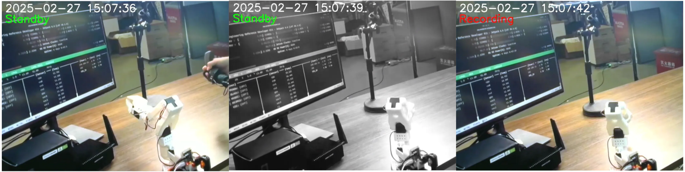
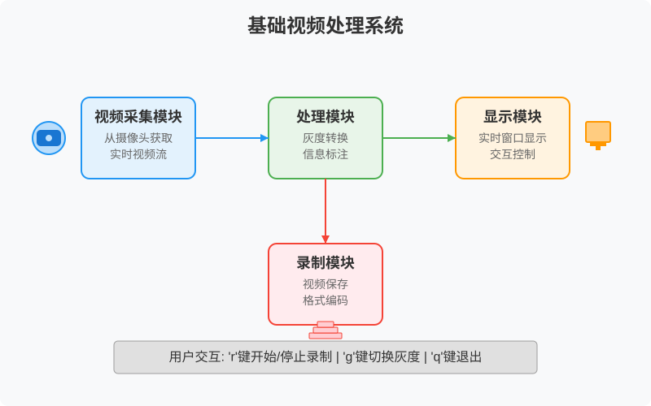
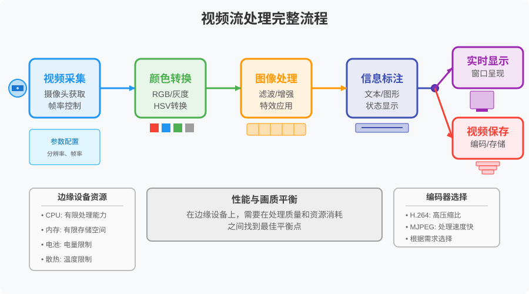
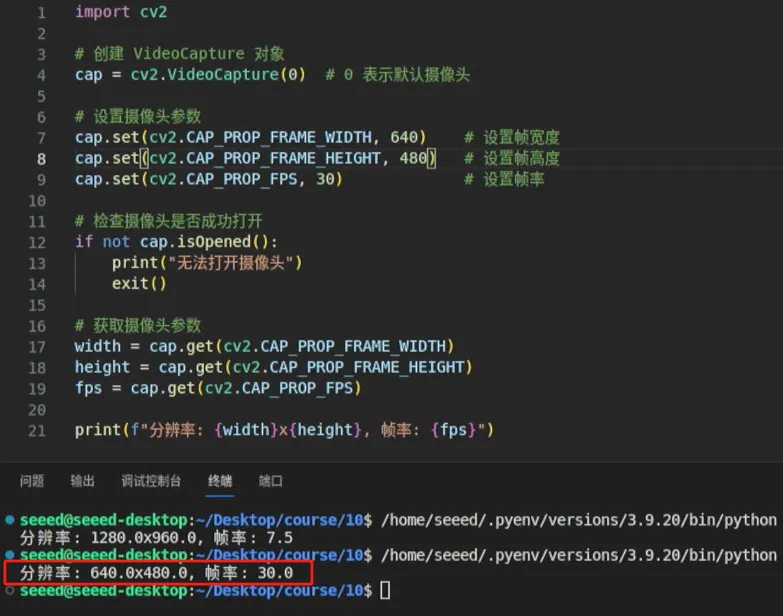
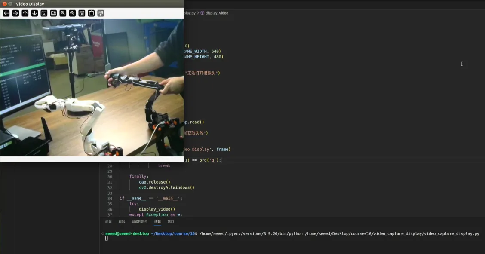
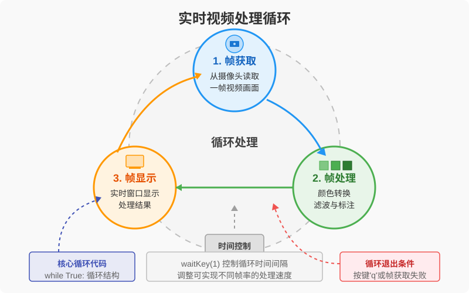
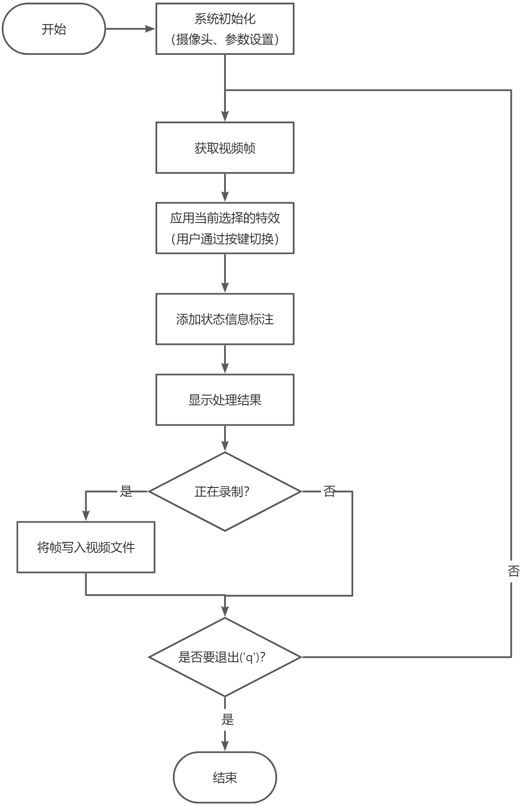

# 第10课：OpenCV 视频流处理：基础视频处理系统

## 课程简介

在本课中，我们将开发一个基础视频处理系统来学习 OpenCV 的视频流处理技术。这个系统将实现实时视频采集、基本图像处理、信息标注和视频保存等功能。虽然系统功能相对简单，但它涵盖了视频处理的核心要素。通过这个项目的开发，学生将掌握视频流处理的基础知识和技能，为后续开发更复杂的视频应用打下坚实基础。

## 课程目标

1. 理解视频流的基本概念，掌握帧率、编码格式等基础知识。
2. 学会使用 OpenCV 进行视频流处理，包括捕获、显示和保存。
3. 掌握为视频添加文本和图形标注的方法。
4. 能够应用所学知识解决实际视频处理问题。

---

## 1. 项目预览：基础视频处理系统

在开始学习具体知识点之前，让我们先了解我们要实现的视频处理系统。这是一个功能简单但涵盖了基础视频处理要素的实时视频处理系统。



> 图 10.1 最终系统运行效果图
>

这个系统将实现以下基本功能：

1. 实时视频显示：从摄像头获取视频并显示在窗口中
2. 视频录制：按下 'r' 键开始/停止录制视频
3. 状态显示：在画面上显示当前时间和帧数
4. 基础处理：支持灰度显示模式（按下 'g' 键切换）

通过实现这个简单但完整的系统，我们将学习：

+ 如何获取和显示视频流
+ 如何保存视频文件
+ 如何在视频上添加文字信息
+ 如何对视频进行基本处理



> 图 10.2 系统功能示意图
>

让我们开始逐步学习每个知识点，最后将它们整合成这个完整的系统。

## 2. 视频流基础知识

在开始开发我们的视频处理系统之前，首先需要理解视频流是什么，以及与之相关的一些基本概念。这些知识将帮助我们更好地理解和实现系统的各项功能。

### 2.1. 什么是视频流?

视频流是连续图像序列的实时传输和处理。从技术角度看，它由一系列称为“帧”的静态图像以特定频率依次显示，创造出连续运动的视觉效果。这一原理与早期的翻页动画类似，只是现代视频技术将这一过程自动化并大幅提高了速度和质量。

在当代数字环境中，视频流应用广泛：

+ 实时直播平台中的视频内容传输
+ 安防监控系统的连续画面采集和分析
+ 远程会议系统中的双向视频通信
+ 智能设备上的计算机视觉应用

### 2.2. 理解视频帧(Frame)

视频帧是构成视频流的基本单元，本质上是视频特定时刻的静态图像截取。每一帧包含完整的图像数据，具有三个关键属性：

1. 色彩信息：每个像素点的颜色数据，通常以RGB或其他颜色空间表示
2. 画面大小(分辨率)：帧的像素尺寸（宽×高），如1920×1080（全高清）或3840×2160（4K）
3. 颜色精细度(位深度)：每个像素的颜色精度，如8位（256色阶）或10位（1024色阶）

这些属性共同决定了视频的视觉质量和数据量。高分辨率、高位深度的视频提供更精细的画面，但也需要更多的处理能力和存储空间。

### 2.3. 认识帧率(Frame Rate)

帧率（Frame Rate）指每秒显示的图像帧数，单位为FPS（Frames Per Second）。不同应用场景通常采用不同的帧率标准：

+ 24 FPS：电影行业标准，为观众提供具有电影感的观看体验
+ 30 FPS：电视和大多数网络视频的常用标准，平衡了流畅度和数据量
+ 60+ FPS：游戏和体育直播等需要捕捉快速动作的场景，提供更流畅的运动轨迹

帧率直接影响视频质量与系统资源消耗之间的平衡：

+ 帧率过低会导致画面卡顿，运动不连贯
+ 帧率过高虽然画面流畅，但需要更多的计算资源和带宽

在实际开发中，需要根据应用场景和硬件性能选择合适的帧率，特别是在边缘设备上进行实时视频处理时，这种平衡尤为重要。

### 2.4. 视频编码格式(Codec)

当我们要保存视频时，需要选择合适的“压缩方式”，这就是编码格式。就像我们存储照片可以选择 JPG 或 PNG 格式一样，视频也有不同的存储格式。

两种常见的编码格式：

1. **H.264**：一种高效的视频压缩标准
    + 提供高压缩率，显著减小文件体积
    + 在保持较小文件大小的同时维持优质画面质量
    + 广泛兼容，支持各类设备和平台播放
2. **MJPEG**：Motion JPEG 编码方式
    + 计算复杂度低，编解码速度快
    + 适合实时视频采集和处理场景
    + 相对较大的文件体积，但处理过程简单高效

通过了解不同编码格式的特点，我们可以根据应用场景选择最合适的视频存储方式，在视频质量、文件大小和处理效率之间取得平衡。

### 2.5. 视频流的完整处理流程



> 图 10.3 视频流的完整处理流程
>

完成了这些基础概念的学习，我们就能系统化理解视频处理的完整链路：从摄像头采集符合质量要求的视频流，进行必要的处理，到最终输出或存储处理结果。在实际部署场景中，关键要在处理性能和视觉质量之间建立最佳平衡，尤其是在 Jetson 这类边缘设备上，受限于硬件资源时更需要优化策略——比如将输入分辨率从 640×480 缩减至 320×240 可缩短 30% 单帧处理耗时，或将处理帧率从 30fps 调整到 15fps 使每帧获得双倍计算资源。

## 3. 视频采集与显示

在了解了视频流的基本概念后，让我们开始实现系统的第一个功能：从摄像头采集视频并实时显示。这是整个视频处理系统的基础，也是与用户交互的第一步。

### 3.1. 摄像头初始化

#### 3.1.1. 初始化操作

在开始进行视频采集之前，我们需要先完成摄像头的初始化工作。这就像在开始拍摄前，我们需要先调试好相机的各项参数一样。在 OpenCV 中，我们使用一个叫做 VideoCapture 的工具来连接和控制摄像头。

让我们先来看看如何初始化摄像头：

```python
# 创建 VideoCapture 对象
cap = cv2.VideoCapture(0)  # 0 表示默认摄像头

# 设置摄像头参数
cap.set(cv2.CAP_PROP_FRAME_WIDTH, 640)    # 设置帧宽度
cap.set(cv2.CAP_PROP_FRAME_HEIGHT, 480)   # 设置帧高度
cap.set(cv2.CAP_PROP_FPS, 30)             # 设置帧率

# 检查摄像头是否成功打开
if not cap.isOpened():
    print("无法打开摄像头")
    exit()
```

让我们来理解这段代码中的关键函数：

+ `cv2.VideoCapture(0)`：创建一个摄像头对象，参数 0 表示使用电脑默认的摄像头。如果你连接了多个摄像头，可以使用 1、2 等数字来选择不同的摄像头。
+ `cap.set()`：设置摄像头的参数。它需要两个参数：
  + 第一个参数指定要设置的属性（如宽度、高度、帧率等）
  + 第二个参数是要设置的具体数值
+ `cap.isOpened()`：检查摄像头是否成功打开，返回 True 或 False

#### 3.1.2. 摄像头兼容性和选择

在视频处理应用中，摄像头的选择和兼容性是一个重要考量因素。在 Jetson 平台上，我们常用的摄像头类型主要包括两种：

1. **USB 摄像头**：
    + 使用简单，即插即用
    + 兼容性好
    + 是大多数应用的首选
2. **CSI 摄像头**：
    + 与 Jetson 直接连接
    + 提供更低的延迟和更高的数据传输率
    + 适用于对性能要求较高的场景

无论使用哪种摄像头，我们都可能遇到兼容性问题。例如，有些摄像头可能不支持我们设置的分辨率或帧率，此时程序会自动采用最接近的支持值。为了解决这类问题，我们可以：

+ 在初始化后立即获取实际应用的参数值，确保后续处理基于正确的参数
+ 采用渐进式配置方法，从理想参数开始，逐步降低到摄像头支持的范围

在本课程中，我们使用标准 USB 摄像头进行演示，因为它设置简单且适用于大多数基础应用场景。

#### 3.1.3. 摄像头参数的获取

正如我们刚才讨论的摄像头兼容性问题，不同摄像头对参数的支持可能存在差异。这就是为什么我们需要掌握如何获取摄像头的实际参数值。通过 cap.get() 函数，我们可以检查并确认摄像头实际应用的参数设置：

```python
# 获取摄像头参数
width = cap.get(cv2.CAP_PROP_FRAME_WIDTH)
height = cap.get(cv2.CAP_PROP_FRAME_HEIGHT)
fps = cap.get(cv2.CAP_PROP_FPS)

print(f"分辨率: {width}x{height}, 帧率: {fps}")
```

这里使用的 `cap.get()` 函数用于获取摄像头的各项参数，它接受一个参数来指定要获取的属性类型。



> 图 10.4 摄像头参数获取
>

### 3.2. 视频帧读取

成功初始化摄像头后，下一步就是从摄像头读取视频画面。这个过程就像是在不断拍摄照片，每一次都会得到一帧图像。

```python
# 读取视频帧
ret, frame = cap.read()

# 检查帧是否正确读取
if not ret:
    print("无法接收帧")
    exit()
```

> `cap.read()` 函数会返回两个值：
>
> + `ret`：一个布尔值，表示这一帧是否成功获取
> + `frame`：如果成功获取，这里将包含这一帧的图像数据
>

为了确保程序的稳定性，我们通常会编写一个更安全的获取函数：

```python
def get_frame(cap):
    """安全地获取视频帧"""
    try:
        ret, frame = cap.read()
        if not ret:
            return None
        return frame
    except Exception as e:
        print(f"帧获取错误: {e}")
        return None
```

### 3.3. 实时显示

获取到视频帧后，我们需要将其显示出来。OpenCV 提供了便捷的窗口显示功能：

```python
# 创建命名窗口
cv2.namedWindow('Video Display', cv2.WINDOW_NORMAL)

# 显示帧
cv2.imshow('Video Display', frame)

# 等待键盘事件，1 毫秒
key = cv2.waitKey(1)

# 检查是否按下 'q' 键退出
if key == ord('q'):
    break
```

> 让我们了解这些关键函数：
>
> + `cv2.namedWindow()`：创建一个显示窗口，第一个参数是窗口名称，第二个参数设置窗口是否可调整大小
> + `cv2.imshow()`：显示图像，第一个参数是窗口名称，第二个参数是要显示的图像数据
> + `cv2.waitKey()`：等待键盘输入，参数是等待的毫秒数。返回按键的 ASCII 码
> + `ord()`：将字符转换为对应的 ASCII 码值
>

最后，我们来看一个完整的视频采集和显示程序。这个程序综合了我们前面学习的所有内容：

```python
import cv2
import numpy as np

def setup_camera():
    """初始化摄像头"""
    cap = cv2.VideoCapture(0)
    cap.set(cv2.CAP_PROP_FRAME_WIDTH, 640)
    cap.set(cv2.CAP_PROP_FRAME_HEIGHT, 480)
    
    if not cap.isOpened():
        raise RuntimeError("无法打开摄像头")
    return cap

def display_video():
    """视频采集和显示主程序"""
    cap = setup_camera()
    
    try:
        while True:
            ret, frame = cap.read()
            if not ret:
                print("视频帧获取失败")
                break
                
            cv2.imshow('Video Display', frame)
            
            if cv2.waitKey(1) == ord('q'):
                break
                
    finally:
        cap.release()
        cv2.destroyAllWindows()

if __name__ == '__main__':
    try:
        display_video()
    except Exception as e:
        print(f"程序错误: {e}")
```

> 代码解析：
>
> + `try-finally` 结构：确保程序无论是正常结束还是发生错误，都能正确释放资源
> + `cap.release()`：释放摄像头资源
> + `cv2.destroyAllWindows()`：关闭所有 OpenCV 创建的窗口
>



> 图 10.5 视频采集与显示
>

这样的视频采集和显示系统是所有视频处理应用的基础。理解了这些概念，我们就可以在此基础上添加更多的功能，如视频特效、对象检测等。

## 4. 视频保存技术

视频保存是一个重要功能，让我们能够将处理后的视频永久保存下来。在 OpenCV 中，我们使用 VideoWriter 类来实现这个功能，就像一个数字录像机一样，可以将视频流保存成文件。

### 4.1. VideoWriter 设置

在开始保存视频之前，我们需要配置一些重要的参数，这些参数会决定最终视频文件的质量和特性。让我们先了解如何创建一个基本的视频写入器：

```python
import cv2

# 定义编码器
fourcc = cv2.VideoWriter_fourcc(*'XVID')  # XVID 编码器

# 创建 VideoWriter 对象
out = cv2.VideoWriter(
    'output.avi',           # 输出文件名
    fourcc,                 # 编码器
    20.0,                  # 帧率
    (640, 480)            # 帧大小
)
```

> 这段代码中的关键函数：
>
> + `cv2.VideoWriter_fourcc()`：创建视频编码器，参数是四个字符编码名称
> + `cv2.VideoWriter()`：创建视频写入器，需要四个主要参数：
>   + 文件名：保存的视频文件路径
>   + 编码器：决定视频的压缩方式
>   + 帧率：每秒保存的帧数
>   + 帧大小：视频的分辨率
>

OpenCV 支持多种常用的视频编码器，每种都有其特点：

| **编码器** | **介绍** | **文件大小** | **画质** | **使用场景** |
| --- | --- | --- | --- | --- |
| **H.264** | 高效的视频编码算法 | 文件小 | 画质好 | 用于流媒体、高清视频存储 |
| **MJPG** | Motion JPEG，逐帧编码 | 文件大 | 画质较差 | 适合快速处理视频 |
| **XVID** | 视频编码，基于AVI格式 | 文件中等 | 画质适中 | 一般视频存储与处理 |

可以用 cv2.VideoWriter_fourcc() 创建视频编码器：

```python
# 常用编码器选项
fourcc_h264 = cv2.VideoWriter_fourcc(*'H264')  # H.264编码，文件小，画质好
fourcc_mjpg = cv2.VideoWriter_fourcc(*'MJPG')  # Motion JPEG，处理快，但文件大
fourcc_xvid = cv2.VideoWriter_fourcc(*'XVID')  # AVI 格式，适合一般用途
```

为了更好地管理视频保存，我们可以创建一个专门的函数来处理写入器的配置：

```python
def create_video_writer(filename, frame_width, frame_height, fps=30.0):
    """创建配置完善的 VideoWriter 对象"""
    fourcc = cv2.VideoWriter_fourcc(*'XVID')
    out = cv2.VideoWriter(
        filename,
        fourcc,
        fps,
        (frame_width, frame_height)
    )
    
    if not out.isOpened():
        raise RuntimeError("无法创建视频文件")
    return out
```

### 4.2. 帧写入操作

在配置好 VideoWriter 后，我们需要实现视频帧的写入功能。这个过程就像是把一张张照片按顺序存储到视频文件中。为了确保这个过程的可靠性，我们需要认真处理每一个环节。

首先，让我们看看如何安全地写入单帧图像：

```python
def write_frame(writer, frame):
    """写入视频帧"""
    try:
        writer.write(frame)
        return True
    except Exception as e:
        print(f"帧写入错误: {e}")
        return False
```

这个函数使用了：

+ `writer.write()`：VideoWriter 的核心方法，用于写入一帧图像
+ 异常处理机制：确保即使写入失败也不会导致程序崩溃

接下来，我们来实现一个完整的视频录制功能：

```python
import cv2

def create_video_writer(filename, frame_width, frame_height, fps=30.0):
    """创建配置完善的 VideoWriter 对象"""
    fourcc = cv2.VideoWriter_fourcc(*'XVID')
    out = cv2.VideoWriter(
        filename,
        fourcc,
        fps,
        (frame_width, frame_height)
    )
    
    if not out.isOpened():
        raise RuntimeError("无法创建视频文件")
    return out

def write_frame(writer, frame):
    """写入视频帧"""
    try:
        writer.write(frame)
        return True
    except Exception as e:
        print(f"帧写入错误: {e}")
        return False

def record_video(duration_seconds=10):
    """录制指定时长的视频"""
    cap = cv2.VideoCapture(0)
    if not cap.isOpened():
        raise RuntimeError("无法打开摄像头")
        
    frame_width = int(cap.get(cv2.CAP_PROP_FRAME_WIDTH))
    frame_height = int(cap.get(cv2.CAP_PROP_FRAME_HEIGHT))
    fps = int(cap.get(cv2.CAP_PROP_FPS))
    
    out = create_video_writer(
        'recorded_video.avi',
        frame_width,
        frame_height,
        fps
    )
    
    try:
        frames_to_capture = duration_seconds * fps
        frame_count = 0
        
        while frame_count < frames_to_capture:
            ret, frame = cap.read()
            if not ret:
                break
                
            if write_frame(out, frame):
                frame_count += 1
            
            cv2.imshow('Recording', frame)
            if cv2.waitKey(1) == ord('q'):
                break
                
    finally:
        cap.release()
        out.release()
        cv2.destroyAllWindows()

record_video()
```

让我们分析这段代码的关键部分：

+ 获取视频参数：从摄像头获取实际的分辨率和帧率
+ 计算总帧数：根据录制时长和帧率计算需要采集的帧数
+ 录制循环：不断读取和保存视频帧，直到达到预定时长
+ 资源管理：使用 try-finally 确保资源正确释放

通过这些技术的组合，我们可以构建一个稳定可靠的视频保存系统。这个系统不仅能够正确保存视频，还能妥善处理各种可能出现的错误情况。

## 5. 视频处理与增强

视频处理与增强是视频处理系统中的核心功能。通过这些技术，我们可以优化视频质量，添加重要信息，以及实现各种视觉效果。让我们从最基础的处理技术开始学习。

### 5.1. 基础处理技术

#### 5.1.1. 颜色空间转换

在视频处理中，最基本也是最常用的操作是颜色空间转换。不同的颜色空间适用于不同的处理任务。例如，在进行人脸检测时，我们通常使用灰度图像；而在进行颜色识别时，HSV 颜色空间可能是更好的选择。

让我们首先了解如何实现颜色空间的转换：

```python
def color_space_conversion(frame):
    """颜色空间转换示例"""
    # BGR 转 RGB
    rgb_frame = cv2.cvtColor(frame, cv2.COLOR_BGR2RGB)
    
    # BGR 转灰度
    gray_frame = cv2.cvtColor(frame, cv2.COLOR_BGR2GRAY)
    
    # BGR 转 HSV
    hsv_frame = cv2.cvtColor(frame, cv2.COLOR_BGR2HSV)
    
    return rgb_frame, gray_frame, hsv_frame
```

这段代码展示了如何使用 OpenCV 将视频帧转换为不同的颜色空间。在第 8 课中我们已经详细学习了这些颜色空间的特点，这里我们主要关注如何在视频处理中应用这些知识。cv2.cvtColor 函数是实现颜色空间转换的核心工具，它可以将 BGR 格式（OpenCV 的默认格式）转换为 RGB、灰度或 HSV 等其他颜色空间。对于需要复习这些颜色空间基础知识的同学，可以参考第 8 课的内容。

#### 5.1.2. 实时视频处理



> 图 10.6 实时视频处理流程图
>

实时视频处理是一个循环过程，通常包括三个主要步骤：首先，从摄像头获取视频帧；然后，对每一帧应用所需的处理；最后，显示处理结果。这个过程不断重复，形成了一个连续的处理流。通过控制每次循环的时间间隔，我们可以实现不同的处理速度，从而满足不同应用的需求。

现在，让我们看看如何在实时视频处理中应用这些转换：

```python
import cv2

def color_space_conversion(frame):
    """颜色空间转换示例"""
    # BGR 转 RGB
    rgb_frame = cv2.cvtColor(frame, cv2.COLOR_BGR2RGB)
    
    # BGR 转灰度
    gray_frame = cv2.cvtColor(frame, cv2.COLOR_BGR2GRAY)
    
    # BGR 转 HSV
    hsv_frame = cv2.cvtColor(frame, cv2.COLOR_BGR2HSV)
    
    return rgb_frame, gray_frame, hsv_frame

def process_video_colors():
    cap = cv2.VideoCapture(0)
    
    while True:
        ret, frame = cap.read()
        if not ret:
            break
            
        rgb, gray, hsv = color_space_conversion(frame)
        
        # 显示不同颜色空间的结果
        cv2.imshow('Original (BGR)', frame)
        cv2.imshow('Grayscale', gray)
        
        if cv2.waitKey(1) == ord('q'):
            break
            
    cap.release()
    cv2.destroyAllWindows()


process_video_colors()
```

这段代码展示了如何在视频流中实时查看不同颜色空间的效果。通过同时显示原始图像和转换后的图像，我们可以直观地理解颜色空间转换的结果。主要的函数调用包括：

+ `cv2.VideoCapture(0)`：打开默认摄像头
+ `cv2.imshow()`：显示图像
+ `cv2.waitKey(1)`：等待键盘输入，参数 1 表示等待 1 毫秒

### 5.2. 图像增强

图像增强是提升视频质量的重要手段。我们可以通过调整亮度、对比度，以及应用各种滤镜来改善视频的视觉效果。让我们创建一个专门的类来处理这些增强功能：

```python
class VideoEnhancer:
    """视频增强处理类"""
    def __init__(self):
        self.brightness_alpha = 1.0  # 亮度系数
        self.contrast_beta = 0       # 对比度调整值
```

在这个类的初始化函数中，我们定义了两个重要的参数：

+ `brightness_alpha`：控制亮度的倍数，大于 1 时增加亮度，小于 1 时降低亮度
+ `contrast_beta`：控制对比度的偏移量，正值增加对比度，负值降低对比度

让我们来实现亮度和对比度的调整功能：

```python
def adjust_brightness_contrast(self, frame):
    """调整亮度和对比度"""
    return cv2.convertScaleAbs(
        frame,
        alpha=self.brightness_alpha,
        beta=self.contrast_beta
    )
```

`cv2.convertScaleAbs()` 是一个强大的函数，它可以同时调整图像的亮度和对比度：

+ `alpha` 参数：控制对比度（范围通常在 0.0 到 3.0 之间）
+ `beta` 参数：控制亮度（范围通常在 -100 到 100 之间）

接下来，让我们实现一些基础的滤镜效果：

```python
def apply_basic_filters(self, frame):
    """应用基础滤镜效果"""
    # 高斯模糊
    blurred = cv2.GaussianBlur(frame, (5, 5), 0)
    
    # 锐化处理
    kernel = np.array([[-1,-1,-1],
                      [-1, 9,-1],
                      [-1,-1,-1]])
    sharpened = cv2.filter2D(frame, -1, kernel)
    
    return blurred, sharpened
```

这段代码实现了两种常用的图像滤镜：

+ 高斯模糊：使用 `cv2.GaussianBlur()` 函数，参数 (5, 5) 表示滤波核的大小
+ 图像锐化：使用 `cv2.filter2D()` 函数应用自定义的锐化卷积核

让我们将这些视频增强功能整合起来，创建一个完整的示例程序，实时展示不同增强效果的对比：

```python
import cv2
import numpy as np

class VideoEnhancer:
    """视频增强处理类"""
    def __init__(self):
        self.brightness_alpha = 1.0  # 亮度系数
        self.contrast_beta = 0       # 对比度调整值
        
    def adjust_brightness_contrast(self, frame):
        """调整亮度和对比度"""
        return cv2.convertScaleAbs(
            frame,
            alpha=self.brightness_alpha,
            beta=self.contrast_beta
        )
    
    def apply_basic_filters(self, frame):
        """应用基础滤镜效果"""
        # 高斯模糊
        blurred = cv2.GaussianBlur(frame, (5, 5), 0)
        
        # 锐化处理
        kernel = np.array([[-1,-1,-1],
                        [-1, 9,-1],
                        [-1,-1,-1]])
        sharpened = cv2.filter2D(frame, -1, kernel)
        
        return blurred, sharpened

def enhance_video_stream():
    """实时视频增强处理示例"""
    cap = cv2.VideoCapture(0)
    enhancer = VideoEnhancer()
    
    while True:
        ret, frame = cap.read()
        if not ret:
            break
            
        # 应用增强效果
        enhanced = enhancer.adjust_brightness_contrast(frame)
        blurred, sharpened = enhancer.apply_basic_filters(frame)
        
        # 显示结果
        cv2.imshow('Original', frame)
        cv2.imshow('Enhanced', enhanced)
        cv2.imshow('Sharpened', sharpened)
        
        if cv2.waitKey(1) == ord('q'):
            break
            
    cap.release()
    cv2.destroyAllWindows()


enhance_video_stream()
```

这个程序会同时显示原始视频、调整亮度后的效果和锐化处理的效果，帮助我们直观理解这些增强技术的作用。通过同时显示原始画面和处理后的效果，我们可以直观地比较不同处理方法的结果。

### 5.3. 视频标注

视频标注是在视频中添加额外信息的技术，包括文本和图形两种形式。这些标注可以帮助我们突出显示重要信息，添加说明文字，或者标记特定区域。

#### 5.3.1. 文本标注

文本标注是在视频中添加文字信息的技术。一个好的文本标注应该清晰易读，这通常需要考虑字体、大小、颜色和位置等因素。在某些情况下，还需要添加背景色块，以确保文本在各种复杂背景下都能清晰显示。OpenCV 提供了强大的文本绘制功能，让我们可以灵活地控制这些参数。

现在，让我们来看如何在视频中添加文本信息。这段代码实现了一个带背景的文本标注函数。它首先计算文本的尺寸，然后绘制一个稍大一些的背景矩形，最后在矩形上绘制文本：

```python
def add_text_overlay(frame, text, position, font_scale=1.0):
    """添加文本标注"""
    font = cv2.FONT_HERSHEY_SIMPLEX
    color = (255, 255, 255)  # 白色
    thickness = 2
    
    # 添加文本背景以提高可读性
    (text_width, text_height), baseline = cv2.getTextSize(
        text, font, font_scale, thickness
    )
    
    cv2.rectangle(
        frame,
        (position[0], position[1] - text_height - 5),
        (position[0] + text_width, position[1] + 5),
        (0, 0, 0),
        -1
    )
    
    cv2.putText(
        frame,
        text,
        position,
        font,
        font_scale,
        color,
        thickness
    )
```

这段代码实现了带背景的文本标注，包含以下关键步骤：

1. 使用 `cv2.getTextSize()` 计算文本尺寸
2. 使用 `cv2.rectangle()` 绘制文本背景
3. 使用 `cv2.putText()` 绘制文本

这种方法可以确保文本在各种背景下都清晰可见，特别适合在复杂场景中显示重要信息。

#### 5.3.2. 图形标注

除了文本，我们还经常需要在视频中添加图形标注，如矩形框标记特定区域，圆形突出重点对象，或者线条连接相关元素。这些图形标注可以直观地引导观众注意力，标识关键信息，在视频分析、目标检测和教学演示中都有广泛应用。

OpenCV 提供了多种图形绘制函数，让我们能够轻松创建各种形状的标注。这段代码展示了如何绘制矩形、圆形和线条，这些是最常用的基本图形：

```python
class VideoAnnotator:
    """视频标注工具类"""
    def draw_shapes(self, frame):
        """绘制基本图形"""
        # 绘制矩形
        cv2.rectangle(
            frame,
            (100, 100),
            (200, 200),
            (0, 255, 0),
            2
        )
        
        # 绘制圆形
        cv2.circle(
            frame,
            (300, 150),
            50,
            (0, 0, 255),
            2
        )
        
        # 绘制线条
        cv2.line(
            frame,
            (400, 100),
            (500, 200),
            (255, 0, 0),
            2
        )
```

这段代码展示了三种基本的图形绘制函数：

+ `cv2.rectangle()`：绘制矩形，需要指定左上角和右下角坐标
+ `cv2.circle()`：绘制圆形，需要指定圆心坐标和半径
+ `cv2.line()`：绘制直线，需要指定起点和终点坐标

通过调整位置、大小和颜色参数，我们可以创建满足各种需求的标注效果。

#### 5.3.3. 完整的视频标注

现在，让我们创建一个完整的视频标注示例，将文本和图形标注结合起来：

```python
import cv2
from datetime import datetime

def add_text_overlay(frame, text, position, font_scale=1.0):
    """添加文本标注"""
    font = cv2.FONT_HERSHEY_SIMPLEX
    color = (255, 255, 255)  # 白色
    thickness = 2
    
    # 添加文本背景以提高可读性
    (text_width, text_height), baseline = cv2.getTextSize(
        text, font, font_scale, thickness
    )
    
    cv2.rectangle(
        frame,
        (position[0], position[1] - text_height - 5),
        (position[0] + text_width, position[1] + 5),
        (0, 0, 0),
        -1
    )
    
    cv2.putText(
        frame,
        text,
        position,
        font,
        font_scale,
        color,
        thickness
    )

class VideoAnnotator:
    """视频标注工具类"""
    def draw_shapes(self, frame):
        """绘制基本图形"""
        # 绘制矩形
        cv2.rectangle(
            frame,
            (100, 100),
            (200, 200),
            (0, 255, 0),
            2
        )
        
        # 绘制圆形
        cv2.circle(
            frame,
            (300, 150),
            50,
            (0, 0, 255),
            2
        )
        
        # 绘制线条
        cv2.line(
            frame,
            (400, 100),
            (500, 200),
            (255, 0, 0),
            2
        )
    def add_text_overlay(frame, text, position, font_scale=1.0):
        """添加文本标注"""
        font = cv2.FONT_HERSHEY_SIMPLEX
        color = (255, 255, 255)  # 白色
        thickness = 2
        
        # 添加文本背景以提高可读性
        (text_width, text_height), baseline = cv2.getTextSize(
            text, font, font_scale, thickness
        )
        
        cv2.rectangle(
            frame,
            (position[0], position[1] - text_height - 5),
            (position[0] + text_width, position[1] + 5),
            (0, 0, 0),
            -1
        )
        
        cv2.putText(
            frame,
            text,
            position,
            font,
            font_scale,
            color,
            thickness
        )

def annotate_video():
    """视频标注示例"""
    cap = cv2.VideoCapture(0)
    annotator = VideoAnnotator()
    
    while True:
        ret, frame = cap.read()
        if not ret:
            break
            
        # 添加标注
        annotator.draw_shapes(frame)
        
        # 添加时间戳
        timestamp = datetime.now().strftime("%Y-%m-%d %H:%M:%S")
        add_text_overlay(frame, timestamp, (10, 30))
        
        cv2.imshow('Annotated Video', frame)
        
        if cv2.waitKey(1) == ord('q'):
            break
            
    cap.release()
    cv2.destroyAllWindows()

annotate_video()
```

这个示例程序会在实时视频上添加当前时间戳，并绘制多种基本图形，展示不同标注方式的效果。这种组合标注在许多实际应用中都非常有用，如视频监控、教学演示和用户界面等。

通过掌握这些视频处理和增强技术，我们可以：

+ 根据不同需求选择合适的颜色空间
+ 通过各种增强手段改善视频质量
+ 添加文本和图形信息以提升视频的可用性

这些技术使我们能够根据不同需求选择合适的处理方法，优化视频质量，添加重要信息，从而提升视频的可用性和表现力。这些都是开发更复杂视频应用的基础。

## 6. 项目实现：基础视频处理系统

现在我们已经学习了所有必要的知识点，让我们把它们整合起来，实现我们的基础视频处理系统。

```python
import cv2
import time
from datetime import datetime

class VideoProcessor:
    """基础视频处理系统"""
    
    def __init__(self):
        self.cap = None
        self.writer = None
        self.is_recording = False
        self.is_grayscale = False
        
    def initialize(self):
        """初始化系统"""
        self.cap = cv2.VideoCapture(0)
        if not self.cap.isOpened():
            raise RuntimeError("无法打开摄像头")
        
        # 设置基本参数
        self.cap.set(cv2.CAP_PROP_FRAME_WIDTH, 640)
        self.cap.set(cv2.CAP_PROP_FRAME_HEIGHT, 480)
        
    def create_video_writer(self):
        """创建视频写入器"""
        filename = f"output_{int(time.time())}.avi"
        fourcc = cv2.VideoWriter_fourcc(*'XVID')
        frame_size = (int(self.cap.get(cv2.CAP_PROP_FRAME_WIDTH)),
                     int(self.cap.get(cv2.CAP_PROP_FRAME_HEIGHT)))
        
        self.writer = cv2.VideoWriter(filename, fourcc, 20.0, frame_size)
        
    def process_frame(self, frame):
        """处理单帧图像"""
        # 添加时间戳和录制状态
        timestamp = datetime.now().strftime("%Y-%m-%d %H:%M:%S")
        status = "Recording" if self.is_recording else "Standby"
        
        # 转换为灰度图像（如果启用）
        if self.is_grayscale:
            frame = cv2.cvtColor(cv2.cvtColor(frame, cv2.COLOR_BGR2GRAY), cv2.COLOR_GRAY2BGR)
        
        # 添加状态信息
        cv2.putText(frame, timestamp, (10, 30), cv2.FONT_HERSHEY_SIMPLEX, 
                    1, (255, 255, 255), 2)
        cv2.putText(frame, status, (10, 60), cv2.FONT_HERSHEY_SIMPLEX, 
                    1, (0, 0, 255) if self.is_recording else (0, 255, 0), 2)
        
        return frame
        
    def run(self):
        """运行系统"""
        self.initialize()
        
        try:
            while True:
                ret, frame = self.cap.read()
                if not ret:
                    break
                
                # 处理帧
                processed_frame = self.process_frame(frame)
                
                # 显示结果
                cv2.imshow('Video Processing', processed_frame)
                
                # 如果正在录制，保存帧
                if self.is_recording:
                    self.writer.write(processed_frame)
                
                # 处理键盘事件
                key = cv2.waitKey(1)
                if key == ord('q'):  # 退出
                    break
                elif key == ord('r'):  # 开始/停止录制
                    if not self.is_recording:
                        self.create_video_writer()
                    else:
                        self.writer.release()
                    self.is_recording = not self.is_recording
                elif key == ord('g'):  # 切换灰度模式
                    self.is_grayscale = not self.is_grayscale
                    
        finally:
            self.cleanup()
            
    def cleanup(self):
        """清理资源"""
        if self.cap:
            self.cap.release()
        if self.writer:
            self.writer.release()
        cv2.destroyAllWindows()

def main():
    """主程序入口"""
    processor = VideoProcessor()
    try:
        processor.run()
    except Exception as e:
        print(f"发生错误: {e}")

if __name__ == '__main__':
    main()
```

这个实现将我们前面学习的所有知识点整合在一起：

+ 视频采集与显示：使用 `VideoCapture` 获取和显示视频流
+ 视频保存：使用 `VideoWriter` 保存处理后的视频
+ 视频处理：实现灰度转换功能
+ 视频标注：添加时间戳和录制状态信息

系统支持三个主要功能：按 'r' 键开始/停止录制，按 'g' 键切换灰度模式，按 'q' 键退出程序。在系统运行时，我们可以看到画面上显示当前时间和录制状态。通过按键控制，我们可以轻松切换灰度显示模式，开始或停止录制视频。

通过这个简单但完整的系统，我们可以看到各个知识点是如何协同工作的。这个系统虽然功能简单，但包含了视频处理的基本要素，可以作为更复杂应用的基础。

## 7. 实践案例：视频特效处理器

在掌握了基础视频处理系统的开发后，让我们通过一个更有趣的实践案例来巩固所学知识。我们将开发一个视频特效处理器，它能够实时应用多种视频效果，并支持通过快捷键灵活切换不同效果。

### 7.1. 案例描述

这个视频特效处理器将基于我们之前学习的视频流处理技术，但提供更丰富的功能和更友好的用户交互。相比基础视频处理系统，它将支持多种不同的图像处理效果，让用户可以方便地在不同效果间切换，并保存处理后的视频。

### 7.2. 流程图



> 图 10.7 视频特效处理器流程图
>

视频特效处理器的工作流程如图：系统初始化后，获取视频帧并应用当前选择的特效，然后添加状态信息标注并显示处理结果。如果正在录制，则将帧写入视频文件。用户可以通过按键切换不同的特效、开始或停止录制，以及退出程序。整个流程形成一个循环，直到用户选择退出。

### 7.3. AI 辅助编程

让我们向 AI 助手描述需求：

```plain
请帮我开发一个视频特效处理器，需要实现以下功能：

1. 基本要求：
   - 从摄像头实时采集视频
   - 支持5种不同的视频特效，并通过数字键1-5直接切换
   - 能够录制处理后的视频

2. 具体特效需求：
   - 1键：显示原始图像
   - 2键：灰度效果
   - 3键：高斯滤波（模糊效果）
   - 4键：全局阈值化
   - 5键：自适应阈值化

3. 交互功能：
   - 数字键1-5直接切换对应特效
   - 按'r'键开始/停止录制
   - 按'q'键退出程序
   - 在画面上显示当前特效名称、录制状态和时间戳

4. 技术要求：
   - 使用OpenCV进行视频处理
   - 采用面向对象的编程方式
   - 确保资源的正确释放
   - 代码结构清晰，便于理解和扩展
```

根据需求，AI 助手生成的代码如下：

```python
import cv2
import numpy as np
import time
from datetime import datetime
import os

class VideoEffectProcessor:
    """视频特效处理器"""
    
    def __init__(self):
        self.cap = None
        self.writer = None
        self.current_effect = '1-Original'  # 使用英文避免中文编码问题
        self.is_recording = False
        # 定义特效字典 - 使用英文名称
        self.effects = {
            '1-Original': self.original_effect,
            '2-Grayscale': self.grayscale_effect,
            '3-Gaussian Blur': self.gaussian_blur_effect,
            '4-Global Threshold': self.global_threshold_effect,
            '5-Adaptive Threshold': self.adaptive_threshold_effect
        }
        # 中英文映射
        self.effect_names_cn = {
            '1-Original': '1-原始图像',
            '2-Grayscale': '2-灰度效果',
            '3-Gaussian Blur': '3-高斯滤波',
            '4-Global Threshold': '4-全局阈值化',
            '5-Adaptive Threshold': '5-自适应阈值化'
        }
        # 录制状态映射
        self.recording_status = {
            True: 'Recording',  # 正在录制
            False: 'Not Recording'  # 未录制
        }
    
    def initialize(self):
        """初始化视频捕获"""
        print("正在初始化摄像头...")
        # 尝试不同的摄像头索引
        for i in range(3):  # 尝试索引0,1,2
            self.cap = cv2.VideoCapture(i)
            if self.cap.isOpened():
                print(f"成功打开摄像头 {i}")
                break
        
        if not self.cap.isOpened():
            raise RuntimeError("无法打开任何摄像头")
        
        # 设置摄像头参数
        self.cap.set(cv2.CAP_PROP_FRAME_WIDTH, 640)
        self.cap.set(cv2.CAP_PROP_FRAME_HEIGHT, 480)
        print("摄像头初始化完成")
        
        # 创建窗口
        cv2.namedWindow('Video Effects', cv2.WINDOW_NORMAL)
        cv2.resizeWindow('Video Effects', 640, 480)
        
    def create_writer(self, filename):
        """创建视频写入器"""
        fourcc = cv2.VideoWriter_fourcc(*'XVID')
        frame_size = (int(self.cap.get(cv2.CAP_PROP_FRAME_WIDTH)),
                     int(self.cap.get(cv2.CAP_PROP_FRAME_HEIGHT)))
        fps = 20.0  # 使用固定帧率
        
        # 确保输出目录存在
        os.makedirs('output', exist_ok=True)
        output_path = os.path.join('output', filename)
        
        self.writer = cv2.VideoWriter(output_path, fourcc, fps, frame_size)
        if not self.writer.isOpened():
            raise RuntimeError(f"无法创建视频文件: {output_path}")
        return output_path
    
    # 特效实现 - 所有特效都确保返回正确格式的帧
    def original_effect(self, frame):
        """原始图像"""
        return frame.copy()
        
    def grayscale_effect(self, frame):
        """灰度效果"""
        gray = cv2.cvtColor(frame, cv2.COLOR_BGR2GRAY)
        # 确保返回彩色图像(3通道)
        return cv2.cvtColor(gray, cv2.COLOR_GRAY2BGR)
        
    def gaussian_blur_effect(self, frame):
        """高斯滤波效果"""
        return cv2.GaussianBlur(frame.copy(), (15, 15), 0)
        
    def global_threshold_effect(self, frame):
        """全局阈值化效果"""
        gray = cv2.cvtColor(frame, cv2.COLOR_BGR2GRAY)
        _, thresh = cv2.threshold(gray, 127, 255, cv2.THRESH_BINARY)
        # 转回3通道
        return cv2.cvtColor(thresh, cv2.COLOR_GRAY2BGR)
        
    def adaptive_threshold_effect(self, frame):
        """自适应阈值化效果"""
        gray = cv2.cvtColor(frame, cv2.COLOR_BGR2GRAY)
        thresh = cv2.adaptiveThreshold(gray, 255, cv2.ADAPTIVE_THRESH_GAUSSIAN_C,
                                      cv2.THRESH_BINARY, 11, 2)
        # 转回3通道
        return cv2.cvtColor(thresh, cv2.COLOR_GRAY2BGR)
    
    def process_frame(self, frame):
        """处理单帧图像"""
        # 检查帧是否有效
        if frame is None or frame.size == 0:
            print("警告: 接收到空帧或无效帧")
            # 创建黑色帧
            blank_frame = np.zeros((480, 640, 3), dtype=np.uint8)
            self.add_status_info(blank_frame)
            return blank_frame
            
        # 应用当前选择的特效
        try:
            effect_func = self.effects[self.current_effect]
            processed = effect_func(frame)
            
            # 确保处理后的帧有正确的形状
            if processed is None or processed.shape != frame.shape:
                print(f"警告: 特效处理后的帧无效，使用原始帧")
                processed = frame.copy()
            
            # 添加状态信息
            self.add_status_info(processed)
            return processed
            
        except Exception as e:
            print(f"处理帧时出错: {e}")
            # 出错时返回原始帧并添加状态信息
            self.add_status_info(frame.copy())
            return frame.copy()
    
    def add_status_info(self, frame):
        """添加状态信息到画面 - 使用英文避免中文乱码"""
        # 获取当前特效的英文名称
        current_effect = self.current_effect
        
        # 准备状态文本 - 全部使用英文
        info_text = [
            f"Effect: {current_effect}",
            f"Status: {self.recording_status[self.is_recording]}",
            f"Time: {datetime.now().strftime('%Y-%m-%d %H:%M:%S')}",
            "Keys: 1-5=Effects, R=Record, Q=Quit"
        ]
        
        # 添加半透明背景
        overlay = frame.copy()
        cv2.rectangle(overlay, (5, 5), (400, 130), (0, 0, 0), -1)
        cv2.addWeighted(overlay, 0.5, frame, 0.5, 0, frame)
        
        # 添加文本
        y_offset = 30
        for text in info_text:
            cv2.putText(frame, text, (10, y_offset),
                       cv2.FONT_HERSHEY_SIMPLEX, 0.7,
                       (255, 255, 255), 2)
            y_offset += 30
    
    def run(self):
        """运行视频特效处理器"""
        self.initialize()
        
        try:
            print("开始视频处理循环...")
            frame_count = 0
            
            # 首先确认能否读取帧
            ret, test_frame = self.cap.read()
            if not ret or test_frame is None:
                print("警告: 初始帧读取失败，请检查摄像头连接")
            else:
                print(f"成功读取测试帧，尺寸: {test_frame.shape}")
            
            while True:
                # 读取帧
                ret, frame = self.cap.read()
                if not ret:
                    print(f"无法获取视频帧 #{frame_count}")
                    # 短暂暂停并继续尝试
                    time.sleep(0.1)
                    continue
                
                frame_count += 1
                if frame_count % 30 == 0:
                    print(f"已处理 {frame_count} 帧")
                
                # 处理帧
                processed_frame = self.process_frame(frame)
                
                # 保存帧(如果正在录制)
                if self.is_recording and self.writer:
                    self.writer.write(processed_frame)
                
                # 显示帧 - 使用英文窗口名
                cv2.imshow('Video Effects', processed_frame)
                
                # 处理键盘事件
                key = cv2.waitKey(1) & 0xFF
                if key == ord('q'):
                    print("用户请求退出")
                    break
                elif key == ord('r'):
                    self.toggle_recording()
                elif key >= ord('1') and key <= ord('5'):
                    self.change_effect(chr(key))
                    
        finally:
            self.cleanup()
    
    def toggle_recording(self):
        """切换录制状态"""
        if not self.is_recording:
            filename = f"effect_video_{int(time.time())}.avi"
            try:
                output_path = self.create_writer(filename)
                self.is_recording = True
                print(f"开始录制: {output_path}")
            except Exception as e:
                print(f"录制失败: {e}")
        else:
            if self.writer:
                self.writer.release()
                self.writer = None
            self.is_recording = False
            print("停止录制")
    
    def change_effect(self, key):
        """更改特效"""
        effect_map = {
            '1': '1-Original',
            '2': '2-Grayscale',
            '3': '3-Gaussian Blur',
            '4': '4-Global Threshold',
            '5': '5-Adaptive Threshold'
        }
        
        if key in effect_map:
            self.current_effect = effect_map[key]
            print(f"切换特效: {self.current_effect}")
    
    def cleanup(self):
        """清理资源"""
        print("清理资源...")
        if self.cap:
            self.cap.release()
        if self.writer:
            self.writer.release()
        cv2.destroyAllWindows()
        print("程序结束")

def main():
    """主程序入口"""
    print("视频特效处理器启动...")
    processor = VideoEffectProcessor()
    try:
        processor.run()
    except Exception as e:
        print(f"发生错误: {e}")
        import traceback
        traceback.print_exc()

if __name__ == '__main__':
    main()
```

### 7.4. 运行效果

通通过运行这个视频特效处理器，我们可以实现：

1. 5种不同的视频特效：
    + 原始图像：显示未经处理的摄像头画面
    + 灰度效果：将彩色图像转换为灰度图像高斯滤波：应用模糊效果使图像平滑
    + 全局阈值化：使用固定阈值将图像转换为黑白二值图像
    + 自适应阈值化：根据图像局部区域自动调整阈值
2. 便捷的交互控制：
    + 数字键 1-5 直接切换对应特效
    + 按 'r' 键开始/停止录制视频
    + 按 'q' 键退出程序
3. 清晰的状态显示：
    + 当前使用的特效名称
    + 录制状态（是否正在录制）
    + 当前时间

### 7.5. 案例总结

这个视频特效处理器项目成功地将本课所学的所有核心知识点整合在一起：

+ 视频采集：使用 VideoCapture 从摄像头获取视频流
+ 图像处理：应用多种 OpenCV 处理函数实现不同特效
+ 视频保存：使用 VideoWriter 保存处理后的视频
+ 状态显示：添加文本信息展示系统状态

通过面向对象的设计方法，我们实现了功能模块的良好组织和代码的高可维护性。这个案例不仅巩固了视频流处理的基础知识，还展示了如何将这些技术应用到实际项目中，为学生开发更复杂的视频处理应用提供了参考模板。

## 8. 总结

通过本课的学习，我们掌握了 OpenCV 视频流处理的核心技能。从视频流的基本概念入手，我们深入理解了帧率、编码格式等关键要素的作用。在实践环节中，我们学会了使用 OpenCV 进行视频的读取、显示和保存，并掌握了为视频添加文本标注和图形绘制的技术。这些知识和技能为后续开发更高级的视频处理应用打下了坚实基础。在未来的课程中，我们将在此基础上探索深度学习在视频处理中的应用、实时目标检测等更高级的主题。

## 9. 课后拓展

+ **阅读材料**
  + [OpenCV 中文教程](https://github.com/HLearning/OpenCV-Python-Tutorials/blob/master/docs/2.%20OpenCV%E4%B8%AD%E7%9A%84%20Gui%E7%89%B9%E6%80%A7/2.2.%20%E8%A7%86%E9%A2%91%E5%85%A5%E9%97%A8.md)

+ **实践练习**
    1. **视频分辨率转换器**

        **任务描述：**

        + 开发一个视频分辨率转换工具，能够实时调整视频分辨率
        + 支持多种常见分辨率的切换（如 640x480、1280x720）
        + 显示当前分辨率信息

        **提示：**

        + 使用 VideoCapture 设置摄像头分辨率
        + 添加帧率显示功能
        + 实现实时分辨率切换

    2. **视频时间戳记录器**

        **任务描述：**

        + 开发一个视频录制系统，在视频上添加时间戳和自定义文本
        + 支持开始/停止录制功能
        + 在视频中显示录制状态和时长

        **提示：**

        + 使用 VideoWriter 保存视频
        + 添加文本标注显示时间信息
        + 实现录制状态管理

        <br>

    参考答案：[10-OpenCV 视频流处理课后题参考答案](https://github.com/Seeed-Studio/Seeed_Studio_Courses/blob/Edge-AI-101-with-Nvidia-Jetson-Course/docs/cn/2/10/Homework_Answer.md)