# 第11课：边缘检测与形态学操作

## 课程简介

在图像处理领域，边缘检测和形态学操作是两项非常重要的基础技术。边缘检测就像是在照片中找出物体的轮廓线，而形态学操作则像是对这些轮廓线进行修整和优化。通过本课程，我们将学习如何使用 OpenCV 实现这些技术，并将它们应用到实际项目中，开发一个能够自动提取和增强物体边缘的系统。

## 课程目标

+ 理解边缘检测的原理，学会使用 Canny 算法进行边缘检测
+ 掌握形态学操作：腐蚀、膨胀、开运算、闭运算等
+ 应用形态学操作进行图像的去噪和特征提取
+ 通过实践操作，开发一个简单的图像处理程序

---

## 1. 课程引入：实际项目案例

### 1.1. 主项目：图像边缘提取与优化系统

在我们开始学习专业知识之前，先来了解一下我们这节课的目标：开发一个图像边缘提取与优化系统。

想象一下，你有一张普通的照片，而你希望把照片中物体的轮廓线提取出来，就像素描画一样。这个系统能够：

1. 自动检测照片中物体的边缘（轮廓线）
2. 去除不重要的细节和噪点
3. 优化边缘线，使其更加清晰和连续
4. 显示原始图像和处理后的边缘图像，便于对比分析

这样的系统有很多实用场景，比如：

+ 将手绘草图数字化并美化
+ 提取照片中物体的形状用于识别
+ 制作照片的艺术效果
+ 辅助设计和创作

要实现这个系统，我们需要学习两项核心技术：边缘检测和形态学操作。通过本课程的学习，你将掌握这两项技术的原理和使用方法，并最终实现一个完整的边缘提取与优化系统。

处理流程如下图所示：

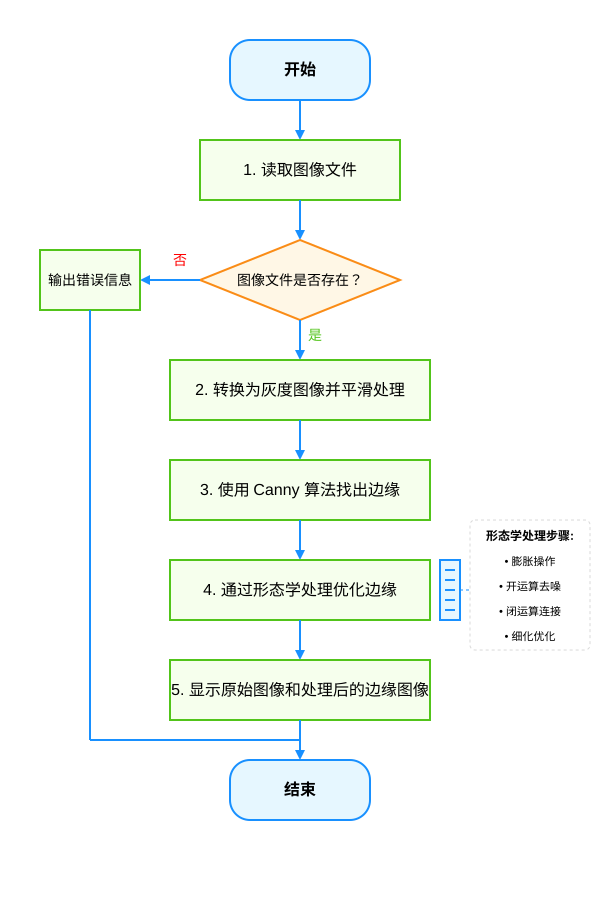

> 图 11.1 项目处理流程图
>

1. 图像获取：读取图像文件
2. 预处理：转换为灰度图像并进行平滑处理
3. 边缘检测：使用 Canny 算法找出边缘
4. 形态学处理：使用腐蚀、膨胀等操作优化边缘
5. 结果展示：显示原始图像和处理后的边缘图像

下面我们将逐步学习实现这个系统所需的技术。

## 2. 边缘检测基础

### 2.1. 什么是边缘？

在我们的图像边缘提取系统中，第一步是要找出图像中的边缘。那么，什么是边缘呢？

简单来说，边缘是图像中亮度或颜色发生明显变化的区域。就像我们在现实生活中能分辨物体的边界一样，在图像中，边缘通常表示物体与背景的分界线或物体表面的纹理变化。

例如，看下面这张图片，我们可以清楚地看到设备与背景之间的边界形成了明显的边缘：


> 图 11.2 图像中的边缘示例
>

边缘通常有这些特点：

+ 像素值突然变化（比如从亮到暗）
+ 在灰度图像中表现为明暗对比明显的区域
+ 常常是物体轮廓或重要特征的位置

### 2.2. 边缘检测的目的与应用

为什么我们要检测图像中的边缘呢？

边缘包含了图像中最重要的视觉信息，通过检测边缘，我们可以：

1. **减少数据量**：一张完整图像可能有几百万个像素，但边缘图像只保留了最关键的轮廓信息，大大减少了数据量
2. **突出关键特征**：边缘通常代表物体的轮廓，是识别物体的重要线索
3. **为后续处理奠定基础**：边缘检测常常是图像分割、目标识别等高级处理的前置步骤

边缘检测在很多领域都有应用：

+ **物体识别**：通过边缘提取物体的形状特征
+ **图像分割**：利用边缘将图像分成不同的区域
+ **图像增强**：强化边缘可以使图像看起来更清晰
+ **特征提取**：从图像中提取有价值的形状信息

### 2.3. 边缘检测的基本原理

边缘检测的基本原理其实很直观：我们寻找图像中像素值变化明显的地方。

想象你从左到右读取图像的每一行像素。如果你遇到一个突然的变化（比如像素值从暗变亮或从亮变暗），那么这个变化发生的地方很可能就是一个边缘。

```python
10  10  10  10  10  10  10  
10  50  50  50  50  50  10  
10  50 100 100 100  50  10  
10  50 100 100 100  50  10  
10  50 100 100 100  50  10  
10  50  50  50  50  50  10  
10  10  10  10  10  10  10  
```

> 图 11.3 像素值变化示意图
>

在数学上，我们使用“梯度”来描述这种变化。梯度表示图像在水平和垂直方向上的变化率。梯度大的地方，像素值变化剧烈，很可能是边缘所在的位置。

### 2.4. 主要边缘检测算法

在实际应用中，有几种常用的边缘检测算法。让我们来了解一下三种最基本的算法：

#### 2.4.1. Sobel 算子

Sobel 算子就像是一个简单的“变化检测器”，它通过计算图像在水平和垂直方向上的变化来找出边缘。

工作原理：

+ **方向性检测**：Sobel 算子分别检测图像中水平方向和垂直方向的亮度变化。它使用特定的数学计算方法，对每个像素周围的区域进行分析，计算出该像素在不同方向上的亮度变化程度。
+ **边缘判断**：当某个位置的水平或垂直方向上的亮度变化值较大时，Sobel 算子会将其识别为边缘点。图像中亮度变化越剧烈的区域，被判定为边缘的可能性越大。

Sobel 算子的优点是计算简单且能够一定程度上抵抗噪声，但检测出的边缘可能不够精细。

#### 2.4.2. Laplacian 算子

Laplacian 算子是另一种边缘检测方法，它通过计算图像的“二阶导数”来寻找边缘。

工作原理：

+ **变化率的变化**：与 Sobel 关注亮度值的变化不同，Laplacian 算子关注的是变化率本身的变化。这可以理解为检测图像中"坡度变化"的位置，即亮度值变化速度发生改变的地方。
+ **零交叉检测**：在边缘处，这种变化率的变化会产生所谓的"零交叉"现象——从正值变为负值，或从负值变为正值。Laplacian 算子通过寻找这些零交叉点来精确定位边缘位置。

Laplacian 算子可以定位边缘的精确位置，但对图像噪声非常敏感，通常需要先对图像进行高斯平滑处理。

#### 2.4.3. Canny 算子

Canny 边缘检测是目前最流行的边缘检测算法之一，它结合了多种技术，能够提供最优的边缘检测效果。

Canny 算法的主要优点：

+ 能够准确检测真实边缘，同时减少噪声影响
+ 检测到的边缘位置准确
+ 对每个真实边缘只产生一个响应（避免多重边缘）

由于 Canny 算法的出色性能，我们将在下一部分重点学习并应用它。

## 3. Canny 边缘检测

在我们的边缘提取系统中，我们将使用 Canny 边缘检测算法，因为它能够提供高质量的边缘检测结果。现在让我们了解 Canny 算法是如何工作的。

### 3.1. Canny 算法的基本原理与步骤

Canny 算法通过一系列精心设计的步骤，将照片中的重要轮廓线提取出来。这个过程包含五个主要步骤：

#### 3.1.1. 高斯滤波

第一步是平滑图像，减少噪点的影响。噪点会干扰边缘检测，可能被误认为是边缘。

在计算机处理中，我们使用高斯滤波器来平滑图像，减少噪点的影响。这一步很重要，因为噪点可能被误认为是边缘。详细内容可以参考第 9 课。

在 OpenCV 中，我们可以使用 `cv2.GaussianBlur()` 函数实现高斯滤波：

```python
# 对图像进行高斯滤波
img_blur = cv2.GaussianBlur(img_gray, (5, 5), 0)
```

#### 3.1.2. 计算梯度

第二步是寻找图像中的"变化区域"，计算每个点的梯度强度和方向。

在这一步，算法计算图像中每个点的梯度（变化强度和方向）。梯度的强度越大，表示该点的变化越剧烈，越可能是边缘。梯度的方向则指示了边缘可能的走向。

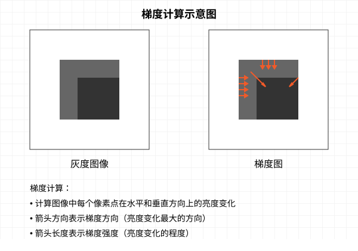

> 图 11.4 梯度计算示意图
>

#### 3.1.3. 非极大值抑制

第三步是"精炼边缘"，将粗的边缘线变成细线。

在这一步，算法沿着梯度方向查看，如果一个点的梯度强度不是该方向上的最大值，则将其抑制（设为零）。这样可以将粗的边缘线变成细线。

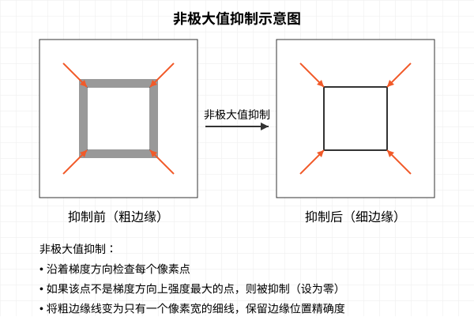

> 图 11.5 非极大值抑制示意图
>

#### 3.1.4. 双阈值算法

第四步是"确定边缘"，使用高低两个阈值来确定哪些点是边缘。

算法使用两个阈值（高阈值和低阈值）来分类边缘点：

+ 梯度强度大于高阈值的点被认为是"强边缘"，直接保留
+ 梯度强度小于低阈值的点被认为是"非边缘"，直接丢弃
+ 梯度强度介于两个阈值之间的点被标记为"弱边缘"，需要进一步判断

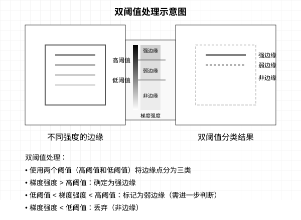

> 图 11.6 双阈值处理示意图
>

#### 3.1.5. 边缘追踪

最后一步是"连接边缘"，确保边缘的连续性。

在这一步，算法会检查每个"弱边缘"点，如果它与"强边缘"点相连，则将其保留；否则将其丢弃。这样可以得到更加连续的边缘线。

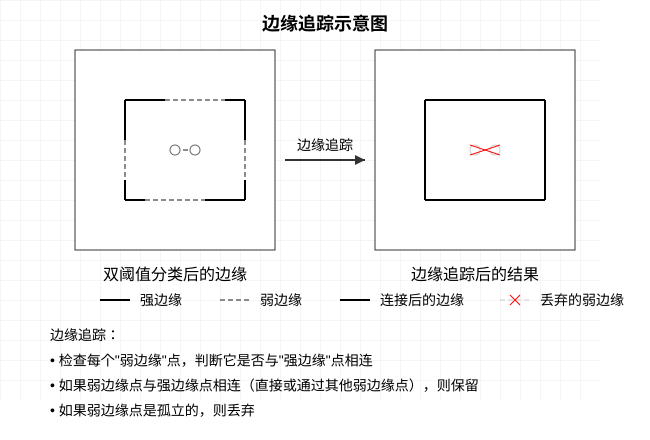

> 图 11.7 边缘追踪示意图
>

### 3.2. 在 OpenCV 中使用 Canny 函数

了解了 Canny 算法的原理后，我们可以使用 OpenCV 提供的 `cv2.Canny()` 函数轻松实现边缘检测。这个函数帮我们封装了上述步骤，使用起来非常方便。

基本用法：

```python
edges = cv2.Canny(image, threshold1, threshold2)
```

> 参数说明：
>
> + `image`：输入图像，通常是灰度图像
> + `threshold1`：低阈值
> + `threshold2`：高阈值
>

下面是一个完整的示例：

```python
import cv2
import numpy as np
import matplotlib.pyplot as plt
import matplotlib

# 设置中文字体
matplotlib.rcParams['font.sans-serif'] = ['SimHei']
matplotlib.rcParams['axes.unicode_minus'] = False

# 读取图像并转为灰度图
img = cv2.imread('image.jpg')
img_gray = cv2.cvtColor(img, cv2.COLOR_BGR2GRAY)

# 高斯滤波去噪
img_blur = cv2.GaussianBlur(img_gray, (5, 5), 0)

# 应用 Canny 边缘检测
edges = cv2.Canny(img_blur, 20, 60)

# 显示结果
plt.figure(figsize=(10, 8))
plt.subplot(131), plt.imshow(cv2.cvtColor(img, cv2.COLOR_BGR2RGB))
plt.title('原始图像'), plt.axis('off')
plt.subplot(132), plt.imshow(img_gray, cmap='gray')
plt.title('灰度图像'), plt.axis('off')
plt.subplot(133), plt.imshow(edges, cmap='gray')
plt.title('Canny 边缘'), plt.axis('off')
plt.tight_layout()
plt.show()
```

### 3.3. Canny 算法参数选择

要获得好的边缘检测效果，合理设置 Canny 算法的参数非常重要。以下是一些实用的参数选择建议：

1. **高低阈值的比例**：一般来说，高阈值应该是低阈值的 2-3 倍。例如，如果低阈值是 50，则高阈值可以设为 100-150。
2. **根据图像特点调整阈值**：
    + 对比度高的图像可以使用较高的阈值（如 100-200）
    + 对比度低的图像应使用较低的阈值（如 30-100）
    + 有噪点的图像应先进行更强的高斯滤波，再使用较高的阈值

## 4. 形态学操作基础

在我们的边缘提取系统中，仅仅使用 Canny 算法进行边缘检测往往是不够的。检测到的边缘可能有噪点、断裂或不连续的问题。这时，我们需要使用形态学操作来"修整"这些边缘。

### 4.1. 为什么需要形态学处理？

形态学操作可以改变图像中物体的形状而不改变其本质特征。在我们的边缘提取系统中，形态学操作可以帮助我们：

1. **去除噪点**：消除边缘检测结果中的小斑点和杂点
2. **连接断开的边缘**：把断断续续的边缘线连接起来，形成完整的轮廓
3. **平滑边缘**：使边缘线条更加平滑，减少锯齿状
4. **提取特定形状**：强化或提取图像中特定形状的特征

形态学操作主要在二值图像（只有黑白两种颜色的图像）上进行，通过一系列简单的规则对图像进行变换。

### 4.2. 结构元素（Structuring Element）

#### 4.2.1. 什么是结构元素？

结构元素可以理解为一个小型的"探测器"或"滤镜"，它决定了我们如何处理图像中的每个像素及其周围区域。当我们对图像进行形态学操作时，这个结构元素会在图像上逐个位置移动，根据结构元素的形状和大小，决定哪些像素需要被修改。

#### 4.2.2. 结构元素的作用

想象一下，我们要清理一张带有噪点的草稿纸。如果我们使用一个小橡皮（小结构元素），可以精确地擦除小细节；如果使用一个大橡皮（大结构元素），则会一次擦除较大区域。同样，不同形状的橡皮（圆形、方形、十字形）会产生不同的擦除效果。

在 OpenCV 中，我们可以创建三种基本形状的结构元素：

```python
# 创建一个 5x5 的矩形结构元素（像一个小方块）
kernel_rect = cv2.getStructuringElement(cv2.MORPH_RECT, (5, 5))

# 创建一个 5x5 的椭圆形结构元素（像一个小圆点）
kernel_ellipse = cv2.getStructuringElement(cv2.MORPH_ELLIPSE, (5, 5))

# 创建一个 5x5 的十字形结构元素（像一个小十字）
kernel_cross = cv2.getStructuringElement(cv2.MORPH_CROSS, (5, 5))
```

这些结构元素的形状决定了形态学操作的效果：

+ **大小影响**：结构元素越大，形态学操作的影响范围就越广。例如，大的结构元素在腐蚀操作中会去除更多的前景像素，在膨胀操作中会添加更多的前景像素。
+ **形状影响**：
  + 矩形结构元素（MORPH_RECT）：对各个方向均匀作用，适合处理方块状或矩形特征。
  + 椭圆形结构元素（MORPH_ELLIPSE）：作用更加圆滑，适合处理圆形或曲线特征。
  + 十字形结构元素（MORPH_CROSS）：主要沿水平和垂直方向作用，适合处理线条特征。

### 4.3. 腐蚀操作（Erosion）

腐蚀操作是最基本的形态学操作之一，它的效果是“缩小”或“削弱”图像中的白色区域（前景）。

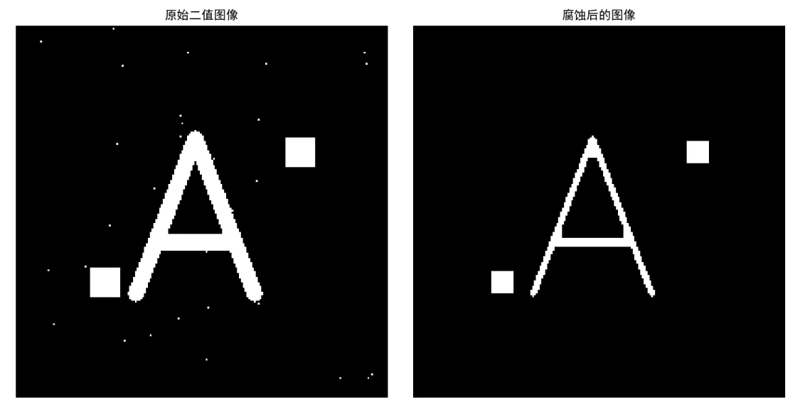

> 图 11.8 腐蚀的概念
>

例如上面这个字母A的二值图像，其周围散布着一些小的白色噪点。腐蚀操作就像是用橡皮轻轻擦过图像边缘，使字母A的线条变细，同时那些小的白色噪点会完全消失。

在 OpenCV 中，腐蚀操作通过 `cv2.erode()` 函数实现：

```python
eroded = cv2.erode(img, kernel, iterations=1)
```

> 参数说明：
>
> + `img`：输入图像，通常是二值图像
> + `kernel`：结构元素
> + `iterations`：腐蚀操作的次数，默认为 1
>

腐蚀操作的主要作用：

+ 去除小的白色噪点
+ 分离连在一起的物体
+ 使物体轮廓变细


> 图 11.9 腐蚀操作前后对比
>

当对边缘检测结果（如 Canny 算法输出）应用腐蚀操作时，由于边缘线通常只有 1 像素宽，腐蚀操作很容易导致边缘完全消失，结果图像可能显示为全黑或近似全黑。这是正常现象，而非程序错误。  

### 4.4. 膨胀操作（Dilation）

膨胀操作与腐蚀操作相反，它的效果是"扩大"或"加强"图像中的白色区域。

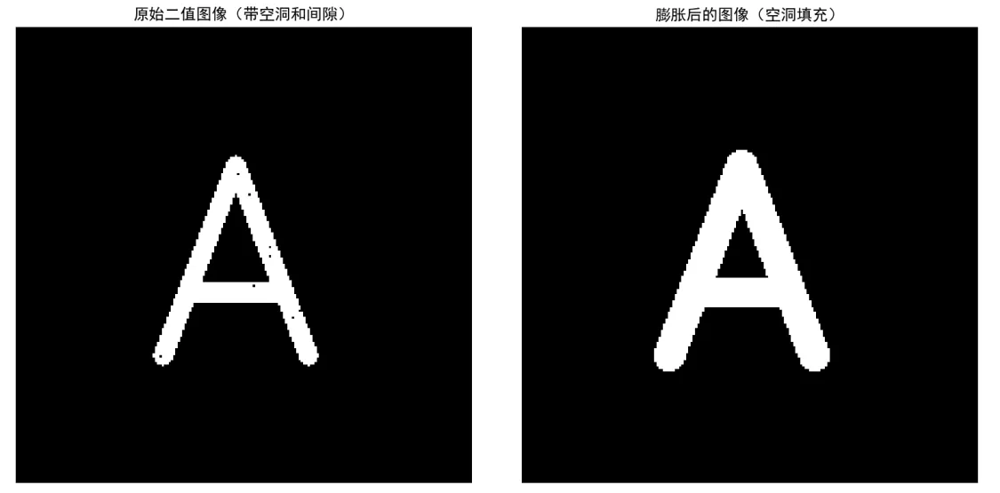

> 图 11.10 膨胀的概念
>

继续使用字母A的例子，如果字母A的线条中存在一些小空洞或断裂，膨胀操作就像是用画笔沿着字母轮廓加粗，使线条变粗，同时填充那些小空洞，连接断开的部分。

在 OpenCV 中，膨胀操作通过 `cv2.dilate()` 函数实现：

```python
dilated = cv2.dilate(img, kernel, iterations=1)
```

> 参数与腐蚀操作相同。
>

膨胀操作的主要作用：

+ 填充物体内部的小空洞
+ 连接断开的部分
+ 使物体轮廓变粗

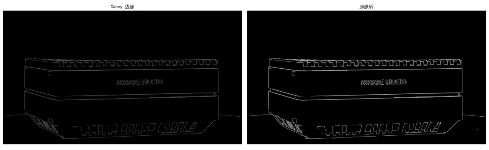

> 图 11.11 膨胀操作前后对比
>

在我们的边缘提取系统中，膨胀操作可以帮助我们连接断开的边缘，使边缘更加连续。

### 4.5. 腐蚀和膨胀的应用示例

让我们通过一个例子来看看腐蚀和膨胀操作如何应用于边缘优化：

```python
import cv2
import numpy as np
import matplotlib.pyplot as plt
import matplotlib

# 设置中文字体
matplotlib.rcParams['font.sans-serif'] = ['SimHei']
matplotlib.rcParams['axes.unicode_minus'] = False

# 读取图像并转为灰度图
img = cv2.imread('image.jpg')
img_gray = cv2.cvtColor(img, cv2.COLOR_BGR2GRAY)

# 高斯滤波去噪
img_blur = cv2.GaussianBlur(img_gray, (5, 5), 0)

# 应用 Canny 边缘检测
edges = cv2.Canny(img_blur, 20, 60)

# 创建结构元素
kernel = cv2.getStructuringElement(cv2.MORPH_RECT, (2, 2))

# 应用膨胀操作
dilated = cv2.dilate(edges, kernel, iterations=1)

# 应用腐蚀操作
# 注意：直接对边缘图像腐蚀可能导致结果近似全黑
eroded = cv2.erode(edges, kernel, iterations=1)

# 显示结果
plt.figure(figsize=(15, 5))
plt.subplot(131), plt.imshow(edges, cmap='gray')
plt.title('Canny 边缘'), plt.axis('off')
plt.subplot(132), plt.imshow(eroded, cmap='gray')
plt.title('腐蚀后（可能近似全黑）'), plt.axis('off')
plt.subplot(133), plt.imshow(dilated, cmap='gray')
plt.title('膨胀后'), plt.axis('off')
plt.tight_layout()
plt.show()
```

从结果中，我们可以观察到：

+ 腐蚀操作应用于细线边缘时通常会导致大部分边缘消失，因为边缘本身就非常细
+ 膨胀操作增加了边缘的宽度，连接了一些断开的部分，但可能引入了更多噪声

因此，在处理边缘图像时，膨胀操作通常比腐蚀更加实用，或者需要先膨胀再腐蚀。

## 5. 高级形态学操作

前面我们学习了基本的腐蚀和膨胀操作，现在我们来看一些更高级的形态学操作，它们是通过组合基本操作实现的。

### 5.1. 开运算（Opening）

开运算是先进行腐蚀，然后再进行膨胀的组合操作。这种操作先收缩物体，去掉小的突出部分，然后再将主体部分扩张回来。

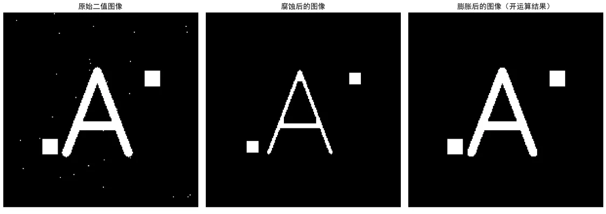

> 图 11.12 开运算的概念
>

开运算的主要效果是去除小的噪点，同时保持物体的大小和形状基本不变。

在 OpenCV 中，开运算通过 `cv2.morphologyEx()` 函数实现：

```python
opening = cv2.morphologyEx(img, cv2.MORPH_OPEN, kernel)
```

> 参数说明：
>
> + `img`：输入图像
> + `cv2.MORPH_OPEN`：表示执行开运算
> + `kernel`：结构元素
>

开运算的主要应用包括：

+ 去除图像中的小噪点
+ 分离轻微连接的物体
+ 平滑物体轮廓但不改变其大小

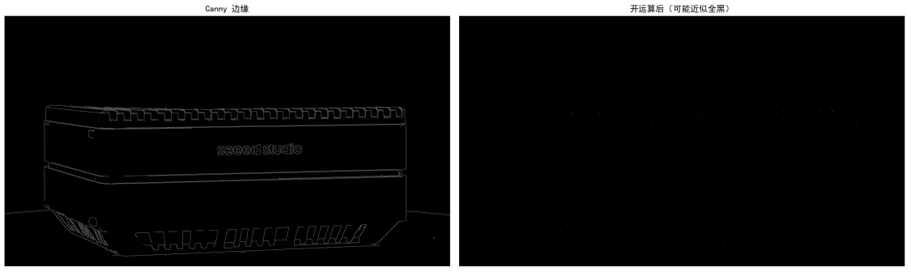

> 图 11.13 开运算前后对比
>

当应用于边缘检测结果时，开运算往往会导致许多边缘线消失，因为开运算的第一步是腐蚀。因此，在处理边缘图像时，开运算主要用于去除小的孤立噪点，而不适合用于一般的边缘优化。如果需要保留边缘并去除噪点，通常需要先膨胀边缘，再进行开运算。

### 5.2. 闭运算（Closing）

闭运算是先进行膨胀，然后再进行腐蚀的组合操作。这种操作先扩大物体，填充小的空洞，然后再将外部边缘收缩回来。

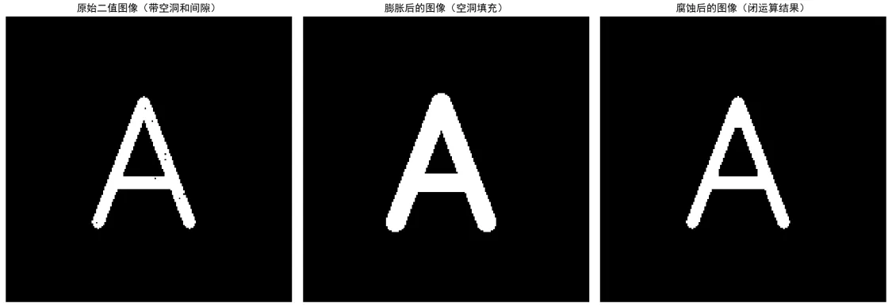

> 图 11.14 闭运算的概念
>

闭运算的主要效果是填充物体轮廓内的小空洞，连接靠近的边缘，平滑物体的外轮廓。

在 OpenCV 中，闭运算也通过 `cv2.morphologyEx()` 函数实现：

```python
closing = cv2.morphologyEx(img, cv2.MORPH_CLOSE, kernel)
```

闭运算的主要应用包括：

+ 填充物体内部的小空洞
+ 连接断开的边缘
+ 平滑轮廓但不明显改变其大小

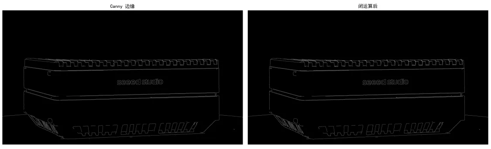

> 图 11.15 闭运算前后对比
>

对于边缘检测结果，闭运算特别有用，因为它首先进行膨胀操作扩展边缘，然后通过腐蚀保持整体形状。这种操作顺序非常适合连接边缘检测中断开的边缘线，是处理 Canny 等边缘检测结果的常用方法。在实际应用中，先膨胀后腐蚀的闭运算通常比单独的腐蚀或开运算更适合用于边缘优化。

### 5.3. 开闭运算的应用示例

让我们通过一个例子来看看开运算和闭运算如何应用于边缘优化：

```python
import cv2
import numpy as np
import matplotlib.pyplot as plt
import matplotlib

# 设置中文字体
matplotlib.rcParams['font.sans-serif'] = ['SimHei']
matplotlib.rcParams['axes.unicode_minus'] = False

# 读取图像并转为灰度图
img = cv2.imread('image.jpg')
img_gray = cv2.cvtColor(img, cv2.COLOR_BGR2GRAY)

# 高斯滤波去噪
img_blur = cv2.GaussianBlur(img_gray, (5, 5), 0)

# 应用 Canny 边缘检测
edges = cv2.Canny(img_blur, 20, 60)

# 创建结构元素
kernel = cv2.getStructuringElement(cv2.MORPH_RECT, (2, 2))

# 应用开运算
# 注意：由于边缘线很细，开运算可能导致大部分边缘消失
opening = cv2.morphologyEx(edges, cv2.MORPH_OPEN, kernel)

# 应用闭运算
closing = cv2.morphologyEx(edges, cv2.MORPH_CLOSE, kernel)

# 为了更好地展示开运算效果，先膨胀边缘再应用开运算
dilated_edges = cv2.dilate(edges, kernel, iterations=2)
opening_after_dilation = cv2.morphologyEx(dilated_edges, cv2.MORPH_OPEN, kernel)

# 显示结果
plt.figure(figsize=(15, 5))
plt.subplot(131), plt.imshow(edges, cmap='gray')
plt.title('Canny 边缘'), plt.axis('off')
plt.subplot(132), plt.imshow(opening, cmap='gray')
plt.title('开运算后（可能近似全黑）'), plt.axis('off')
plt.subplot(133), plt.imshow(closing, cmap='gray')
plt.title('闭运算后'), plt.axis('off')
plt.tight_layout()
plt.show()

# 显示额外的结果示例
plt.figure(figsize=(15, 5))
plt.subplot(131), plt.imshow(edges, cmap='gray')
plt.title('原始边缘'), plt.axis('off')
plt.subplot(132), plt.imshow(dilated_edges, cmap='gray')
plt.title('先膨胀后的边缘'), plt.axis('off')
plt.subplot(133), plt.imshow(opening_after_dilation, cmap='gray')
plt.title('膨胀后再开运算'), plt.axis('off')
plt.tight_layout()
plt.show()
```

从结果中，我们可以观察到：

+ 开运算对边缘图像的影响：由于 Canny 边缘检测结果通常只有 1 像素宽，直接应用开运算（先腐蚀后膨胀）很可能导致大部分边缘消失，图像呈现近似全黑的状态。这是因为第一步腐蚀操作就已经移除了大部分细线边缘。
+ 闭运算的有效性：闭运算（先膨胀后腐蚀）对边缘图像非常有效，能够连接断开的边缘，形成更加连续的轮廓，同时保留主要的边缘结构。
+ 推荐的处理顺序：如果确实需要使用开运算处理边缘图像（例如去除小噪点），建议先对边缘进行膨胀操作使边缘变粗，然后再应用开运算，如示例中的第二个图形所示。这样可以保留更多的有效边缘信息。

在实际应用中，我们通常会根据具体需求选择合适的形态学操作顺序。例如，对于噪点较多的边缘图像，可以先进行闭运算连接边缘，再应用适当的开运算去除噪点；而对于边缘断裂严重的图像，则可以侧重于闭运算的应用。

## 6. 项目实现：智能边缘增强系统

现在我们已经学习了边缘检测和形态学操作的基本原理和技术，是时候将这些知识整合起来，实现一个完整的智能边缘增强系统。

```python
import cv2
import numpy as np
import matplotlib.pyplot as plt
import matplotlib

# 设置中文字体
matplotlib.rcParams['font.sans-serif'] = ['SimHei']
matplotlib.rcParams['axes.unicode_minus'] = False

def edge_enhancement_system(image_path):
    """图像边缘增强系统"""
    
    # 1. 读取图像并转为灰度图
    print("正在读取图像...")
    img = cv2.imread(image_path)
    if img is None:
        print(f"无法读取图像: {image_path}")
        return
    
    img_gray = cv2.cvtColor(img, cv2.COLOR_BGR2GRAY)
    
    # 2. 高斯滤波去噪
    print("正在进行预处理...")
    img_blur = cv2.GaussianBlur(img_gray, (5, 5), 0)
    
    # 3. Canny 边缘检测
    print("正在进行边缘检测...")
    edges = cv2.Canny(img_blur, 20, 60)
    
    # 4. 形态学操作优化边缘
    print("正在优化边缘...")
    # 创建结构元素
    kernel = cv2.getStructuringElement(cv2.MORPH_RECT, (3, 3))

    # 先使用膨胀操作
    dilated = cv2.dilate(edges, kernel, iterations=1)
    
    # 再使用开运算去除噪点
    opening = cv2.morphologyEx(dilated, cv2.MORPH_OPEN, kernel)
    
    # 最后使用闭运算连接断开的边缘
    closing = cv2.morphologyEx(opening, cv2.MORPH_CLOSE, kernel)
    
    # 5. 显示结果
    print("处理完成，显示结果...")
    plt.figure(figsize=(12, 8))
    
    plt.subplot(221)
    plt.imshow(cv2.cvtColor(img, cv2.COLOR_BGR2RGB))
    plt.title('原始图像')
    plt.axis('off')
    
    plt.subplot(222)
    plt.imshow(img_gray, cmap='gray')
    plt.title('灰度图像')
    plt.axis('off')
    
    plt.subplot(223)
    plt.imshow(edges, cmap='gray')
    plt.title('Canny 边缘')
    plt.axis('off')
    
    plt.subplot(224)
    plt.imshow(closing, cmap='gray')
    plt.title('形态学优化后的边缘')
    plt.axis('off')
    
    plt.tight_layout()
    plt.show()
    
    return {
        'original': img,
        'gray': img_gray,
        'edges': edges,
        'enhanced': closing
    }

# 使用系统示例
def main():
    image_path = 'image.jpg'  # 替换为您的图像路径
    results = edge_enhancement_system(image_path)
    
    # 可以进一步使用结果进行其他操作
    if results:
        print("边缘增强成功完成！")

if __name__ == "__main__":
    main()
```

我们的智能边缘增强系统具有以下功能：

1. **图像获取**：读取输入的图像文件。
2. **预处理**：
    + 将彩色图像转换为灰度图像
    + 应用高斯滤波去除噪点
3. **边缘检测**：使用 Canny 算法检测图像边缘。
4. **边缘优化**：
    + 先进行膨胀，然后使用开运算去除边缘检测结果中的小噪点
    + 使用闭运算连接断开的边缘线
5. **结果展示**：同时显示原始图像、灰度图像、边缘检测结果和最终优化后的边缘图像，以便直观比较

该系统将集成我们前面学习的所有知识点，展示边缘检测和形态学操作在实际应用中的效果。通过这个边缘增强系统，我们可以看到 Canny 边缘检测和形态学操作在实际应用中的效果，以及它们如何协同工作提升边缘质量。

## 7. 总结

在本课中，我们系统地学习了边缘检测和形态学操作的原理和应用方法。我们首先理解了边缘检测的基本概念和 Canny 算法的工作原理，然后深入学习了腐蚀、膨胀、开运算、闭运算等形态学操作的特点和用途。通过实践案例，我们将这些知识整合起来，实现了一个智能边缘增强系统。边缘检测和形态学操作是图像处理和计算机视觉中的基础技术，掌握这些技术对于解决实际问题至关重要。在后续的学习中，我们可以将这些技术应用于更复杂的任务，如目标检测、图像分割和特征提取等。

## 8. 课后拓展

+ **阅读材料**
  + [OpenCV 官方文档 - Canny 边缘检测](https://docs.opencv.org/master/da/d22/tutorial_py_canny.html)
  + [OpenCV 官方文档 - 形态学变换](https://docs.opencv.org/master/d9/d61/tutorial_py_morphological_ops.html)
+ **实践练习**
    1. **基础边缘检测与优化**

        **任务描述**:

        + 使用 Canny 算法对提供的图像进行边缘检测
        + 尝试不同的高斯滤波参数和 Canny 阈值，观察效果差异
        + 使用形态学操作（腐蚀和膨胀）优化边缘检测结果

        **提示**:

        + 尝试不同的 Canny 阈值组合（如 50-150，100-200）
        + 使用不同大小的高斯滤波核（3×3，5×5）
        + 观察并记录参数变化对边缘检测效果的影响

    2. **形态学操作实践 (Morphological Operations Practice)**

        **任务描述**:

        + 对边缘检测结果应用不同的形态学操作（腐蚀、膨胀、开运算、闭运算）
        + 比较不同操作对去除噪点和连接断开边缘的效果
        + 尝试不同大小和形状的结构元素（矩形、椭圆形、十字形）

        **提示**:

        + 创建 3×3 和 5×5 大小的不同形状结构元素
        + 应用单次和多次迭代的形态学操作
        + 特别关注开运算对去噪和闭运算对连接断开边缘的效果

    3. **边缘提取应用 (Edge Extraction Application)**

        **任务描述:**

        + 设计一个简单的边缘提取流程，包括预处理、边缘检测和形态学优化
        + 处理不同类型的图像（如风景、物体、文本）
        + 为每种图像类型找到最适合的处理参数

        **提示**:

        + 遵循课程中介绍的处理流程：预处理→边缘检测→形态学操作
        + 对比 Sobel、Laplacian 和 Canny 算法的边缘检测效果
        + 通过实验找到每种图像类型的最佳处理参数组合

        </br>

    参考答案：[11-边缘检测与形态学操作课后题参考答案](https://github.com/Seeed-Studio/Seeed_Studio_Courses/blob/Edge-AI-101-with-Nvidia-Jetson-Course/docs/cn/2/11/Homework_Answer.md)
