# 第12课：轮廓检测与特征提取

## 课程简介

在本课中，我们将学习计算机视觉中两个重要的概念：轮廓检测和特征提取。轮廓检测帮助我们识别图像中物体的边界形状，而特征提取则让我们能够从图像中提取独特的关键点信息。通过组合这两种技术，我们可以实现简单的物体识别和图像匹配。本课程将通过实践项目，带领大家开发一个能够识别特定物体的基础系统。

## 课程目标

+ 掌握轮廓检测的原理和基本方法：能够在图像中检测物体轮廓
+ 理解特征点的概念：学习 ORB 特征检测与匹配的基本使用
+ 实现图像之间的特征匹配，理解图像配准的原理。
+ 整合所学技术：开发一个简单的对象识别系统

---

## 1. 课程引入

### 1.1. 课程概述与目标

在前几课中，我们学习了图像处理的基础知识、边缘检测和形态学操作等技术。本课将在这些基础上，进一步学习如何提取图像中更高级的特征信息，从而实现简单的物体识别功能。

本课程将围绕以下核心技术展开：

+ **轮廓检测**：识别图像中物体的边界形状
+ **特征点提取**：找出图像中独特和稳定的关键点
+ **特征匹配**：比较不同图像中的特征点，找到对应关系

通过学习这些技术，我们将能够在不同的场景中识别特定的物体。

### 1.2. 项目预览：简易对象识别系统

作为本课的实践项目，我们将开发一个简易的对象识别系统，该系统能够在场景图像中识别特定物体的位置。

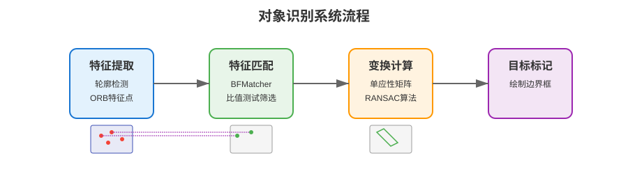

> 图 12.1 对象识别系统功能流程图
>

该系统具有以下功能：

1. **物体轮廓识别**：检测图像中物体的形状轮廓
2. **特征点提取与匹配**：在目标物体和场景图像中提取关键特征点，并进行匹配
3. **目标定位**：在场景图像中标记出目标物体的位置

这个项目综合应用了本课所学的所有知识点，在实际开发过程中，我们会逐步构建系统的各个组件，最终整合成一个完整的对象识别应用。

### 1.3. 轮廓检测与特征提取在边缘AI中的应用

轮廓检测和特征提取技术在边缘 AI 设备上有广泛的应用场景：

+ **工业领域**：产品质量检测、零部件识别
+ **安防监控**：异常物体检测、特定物品追踪
+ **智能家居**：手势识别、物品识别
+ **移动设备**：增强现实应用、文档扫描

这些应用都需要在有限的计算资源下高效运行。

---

## 2. 轮廓检测基础

### 2.1. 轮廓的概念与意义

#### 2.1.1. 轮廓的定义

轮廓（Contour）是指图像中具有相同颜色或灰度值的连续点的集合，它描绘了图像中物体的外形边界。与我们在第11课学习的边缘不同，轮廓通常是闭合的曲线，代表了完整的物体边界，而边缘可能是分散的线段。

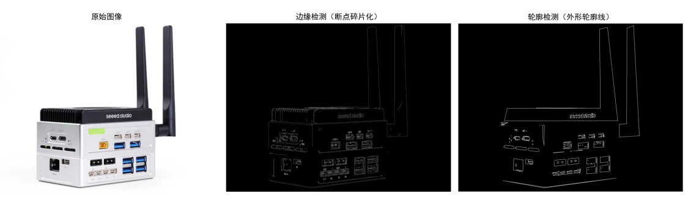

> 图 12.2 边缘与轮廓的区别
>

可以将轮廓理解为物体的"外形轮廓线"，就像是用笔沿着物体的外形描绘出的线条。

#### 2.1.2. 轮廓在对象识别中的作用

在对象识别系统中，轮廓提供了关于物体形状的重要信息：

1. **形状分析**：通过轮廓可以计算物体的面积、周长、质心等几何特征
2. **物体识别**：不同物体通常有不同的轮廓形状，可以通过形状特征区分不同物体
3. **位置定位**：轮廓可以帮助确定物体在图像中的位置
4. **物体计数**：计算图像中轮廓的数量可以用于物体计数

### 2.2. 轮廓检测的前置处理

为了成功检测轮廓，我们需要先对图像进行一系列的预处理步骤，使轮廓检测更加准确。

#### 2.2.1. 灰度转换

首先，我们需要将彩色图像转换为灰度图像，这样可以将三通道的彩色信息简化为单通道的灰度信息，减少计算复杂度。

```python
# 读取彩色图像
img = cv2.imread('shapes.jpg')

# 转换为灰度图像
gray = cv2.cvtColor(img, cv2.COLOR_BGR2GRAY)
```

#### 2.2.2. 图像平滑和二值化

接下来，我们通常需要对灰度图像进行平滑处理和二值化，这些内容在第九课中已经详细讲解过，这里只简单回顾一下：

```python
# 高斯模糊处理
blurred = cv2.GaussianBlur(gray, (5, 5), 0)

# 二值化处理
ret, binary = cv2.threshold(blurred, 127, 255, cv2.THRESH_BINARY)
```

通过上述预处理步骤，我们得到了一个干净的二值图像，可以为后续的轮廓检测提供良好的基础。

### 2.3. OpenCV中的轮廓检测方法

#### 2.3.1. findContours函数详解

在 OpenCV 中，轮廓检测主要通过 `findContours()` 函数实现。这个函数的基本语法如下：

```python
contours, hierarchy = cv2.findContours(image, mode, method)
```

> **参数说明**：
>
> + **image**：输入的二值图像
> + **mode**：轮廓检索模式，决定了检测到的轮廓之间的层级关系
> + **method**：轮廓近似方法，决定了轮廓点的存储方式
>
> **返回值**：
>
> + **contours**：检测到的轮廓列表，每个轮廓都是一个 NumPy 数组，包含轮廓上的点坐标
> + **hierarchy**：轮廓的层级信息，描述轮廓之间的嵌套关系
>

需要注意的是，`findContours()` 函数会修改输入的图像，因此在调用该函数前，最好先复制一份图像：

```python
binary_copy = binary.copy()
contours, hierarchy = cv2.findContours(
    binary_copy, cv2.RETR_EXTERNAL, cv2.CHAIN_APPROX_SIMPLE)
```

#### 2.3.2. 常用的轮廓检索模式

OpenCV 提供了几种不同的轮廓检索模式：

1. `cv2.RETR_EXTERNAL`：只检测最外层轮廓，忽略内部的轮廓
2. `cv2.RETR_LIST`：检测所有轮廓，但不建立轮廓之间的层级关系
3. `cv2.RETR_TREE`：检测所有轮廓，并建立完整的轮廓层级结构

在大多数情况下，使用 `cv2.RETR_EXTERNAL` 就足够了，特别是当我们只关心物体的外轮廓时。

#### 2.3.3. 轮廓近似方法

OpenCV 提供了两种轮廓近似方法：

1. `cv2.CHAIN_APPROX_NONE`：存储轮廓上的所有点
2. `cv2.CHAIN_APPROX_SIMPLE`：压缩水平、垂直和对角线方向上的冗余点，只保留拐点

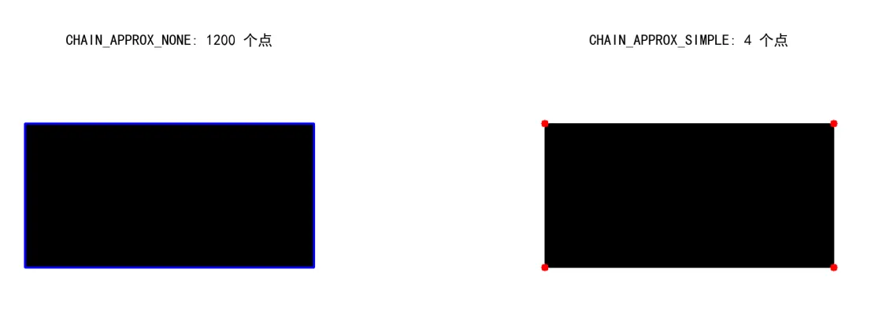

> 图 12.3 不同轮廓近似方法对比
>

在实际应用中，通常使用 `cv2.CHAIN_APPROX_SIMPLE` 方法，因为它能够有效减少数据量，同时不会丢失关键的形状信息。

### 2.4. 轮廓的绘制与可视化

检测到轮廓后，我们通常需要将轮廓绘制在图像上，以便直观地观察检测结果。OpenCV 提供了 `drawContours()` 函数来实现这一功能。

```python
cv2.drawContours(image, contours, contourIdx, color, thickness)
```

> **参数说明**：
>
> + **image**：要绘制轮廓的图像
> + **contours**：轮廓列表，由 `findContours()` 返回
> + **contourIdx**：要绘制的轮廓的索引，如果为 -1，则绘制所有轮廓
> + **color**：轮廓的颜色，如 (0, 255, 0) 表示绿色
> + **thickness**：轮廓线条的粗细，如果为 -1，则填充轮廓
>

以下是一个绘制轮廓的示例：

```python
# 在原图上绘制所有轮廓
cv2.drawContours(img, contours, -1, (0, 255, 0), 2)

# 在原图上绘制特定轮廓（索引为 0 的轮廓）
cv2.drawContours(img, contours, 0, (255, 0, 0), 2)

# 创建空白图像并绘制轮廓
blank = np.zeros_like(img)
cv2.drawContours(blank, contours, -1, (0, 255, 0), 2)
```

通过调整颜色和线条粗细，可以使轮廓在图像上更加清晰可见。此外，还可以选择性地绘制特定轮廓，或者在空白图像上绘制轮廓，以便更好地观察轮廓形状。

### 2.5. 轮廓特征分析

检测到轮廓后，我们可以计算各种轮廓特征，用于分析物体的形状和属性。

#### 2.5.1. 面积与周长计算

轮廓的面积和周长是最基本的几何特征：

```python
# 计算轮廓面积
area = cv2.contourArea(contour)

# 计算轮廓周长（第二个参数表示轮廓是否闭合）
perimeter = cv2.arcLength(contour, True)
```

面积和周长可以用于过滤噪声轮廓（通常面积很小），或者区分不同大小的物体。

#### 2.5.2. 质心计算

质心表示轮廓的几何中心位置，可以通过轮廓的矩（moments）来计算：

```python
# 计算轮廓的矩
M = cv2.moments(contour)

# 计算质心坐标
if M["m00"] != 0:  # 避免除以零
    cx = int(M["m10"] / M["m00"])
    cy = int(M["m01"] / M["m00"])
```

质心坐标可用于确定物体的位置，在图像上标记物体，或计算物体间的相对位置关系。

#### 2.5.3. 轮廓近似与形状识别

轮廓通常包含大量点，我们可以对轮廓进行简化，只保留重要的拐点：

```python
# 轮廓近似
epsilon = 0.02 * cv2.arcLength(contour, True)  # 近似精度
approx = cv2.approxPolyDP(contour, epsilon, True)
```

> 其中，`epsilon` 是近似精度，值越小，近似越精确，保留的点越多。
>

通过近似后的轮廓点数，我们可以判断物体的形状：

+ 3 个点：三角形
+ 4 个点：矩形或正方形
+ 5 个点：五边形
+ 大于 5 个点且接近圆形：可能是圆形

```python
# 根据轮廓点数判断形状
vertices = len(approx)
if vertices == 3:
    shape = "Triangle"
elif vertices == 4:
# 可以进一步判断是矩形还是正方形
    shape = "Rectangle"
elif vertices == 5:
    shape = "Pentagon"
elif vertices > 5:
    shape = "Circle"
```

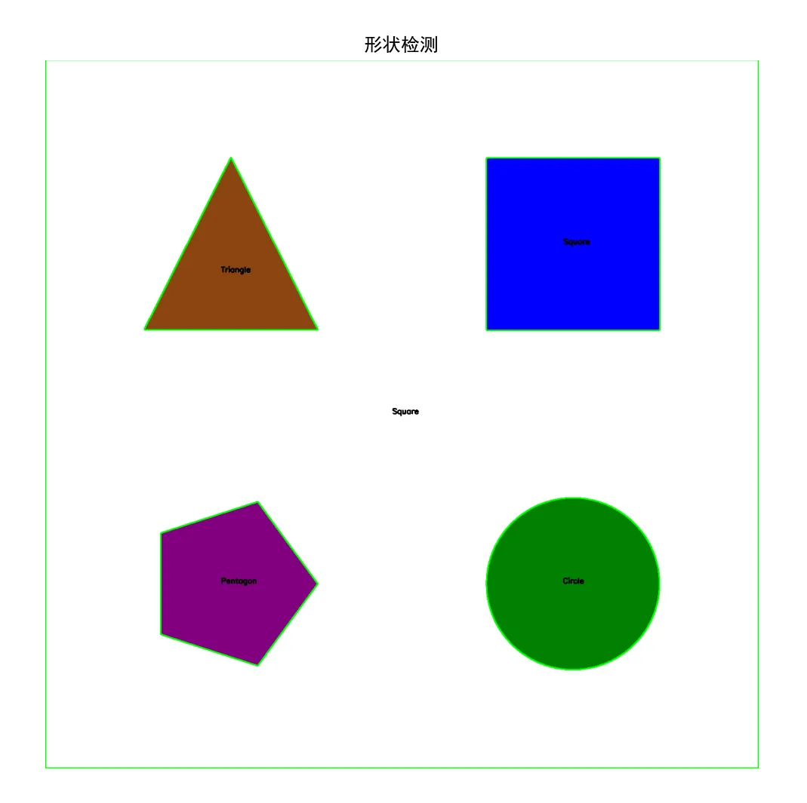

> 图 12.4 不同形状轮廓的近似结果
>

### 2.6. 轮廓检测的简单应用

下面是一个使用轮廓检测来识别几何形状的简单应用示例：

```python
import cv2
import numpy as np

def detect_shapes(image_path):
    # 读取图像
    img = cv2.imread(image_path)
    if img is None:
        print("无法读取图像，请检查图像路径")
        return None
    
    # 转换为灰度图像
    gray = cv2.cvtColor(img, cv2.COLOR_BGR2GRAY)
    
    # 高斯模糊
    blurred = cv2.GaussianBlur(gray, (5, 5), 0)
    
    # 二值化
    _, binary = cv2.threshold(blurred, 127, 255, cv2.THRESH_BINARY)
    
    # 轮廓检测
    contours, _ = cv2.findContours(
        binary.copy(), cv2.RETR_EXTERNAL, cv2.CHAIN_APPROX_SIMPLE)
    
    # 分析每个轮廓
    for contour in contours:
        # 计算面积，过滤小轮廓
        area = cv2.contourArea(contour)
        if area < 100:
            continue
        
        # 轮廓近似
        epsilon = 0.02 * cv2.arcLength(contour, True)
        approx = cv2.approxPolyDP(contour, epsilon, True)
        
        # 确定形状
        vertices = len(approx)
        if vertices == 3:
            shape = "Triangle"
        elif vertices == 4:
            # 计算边界矩形
            x, y, w, h = cv2.boundingRect(approx)
            aspect_ratio = float(w) / h
            if 0.95 <= aspect_ratio <= 1.05:
                shape = "Square"
            else:
                shape = "Rectangle"
        elif vertices == 5:
            shape = "Pentagon"
        else:
            shape = "Circle"
        
        # 计算质心
        M = cv2.moments(contour)
        if M["m00"] != 0:
            cx = int(M["m10"] / M["m00"])
            cy = int(M["m01"] / M["m00"])
            
            # 在图像上标记形状名称
            cv2.putText(img, shape, (cx - 20, cy), 
                       cv2.FONT_HERSHEY_SIMPLEX, 1.0, (0, 0, 0), 2)
        
        # 绘制轮廓
        cv2.drawContours(img, [contour], -1, (0, 255, 0), 2)
    
    return img

# 处理图像并显示结果
result = detect_shapes('shapes.jpg')
if result is not None:
    cv2.imshow('Detected Shapes', result)
    cv2.waitKey(0)
    cv2.destroyAllWindows()
```

这个示例展示了轮廓检测的基本应用：

1. 图像预处理（灰度转换、模糊处理、二值化）
2. 轮廓检测
3. 轮廓分析（计算面积、周长等特征）
4. 形状识别（根据轮廓点数判断形状）
5. 结果可视化（绘制轮廓和形状名称）

通过这样的应用，我们可以自动识别和分类图像中的几何形状，为更复杂的对象识别系统奠定基础。

轮廓检测为我们提供了物体的外形信息，这对于识别形状规则的物体很有效。然而，在我们的对象识别系统中，还需要处理物体在不同角度、尺度下的识别问题，以及应对部分遮挡的情况。这就需要我们进一步学习特征点检测与描述技术，它能够从图像中提取更加局部和独特的特征信息。

---

## 3. 特征点检测与描述

### 3.1. 特征点的概念与作用

#### 3.1.1. 特征点的定义

特征点（也称为关键点或兴趣点）是图像中具有显著特性的点，这些点在旋转、缩放、光照变化等条件下保持相对稳定。简单来说，它们是图像中"与众不同"的点，容易被识别和匹配。

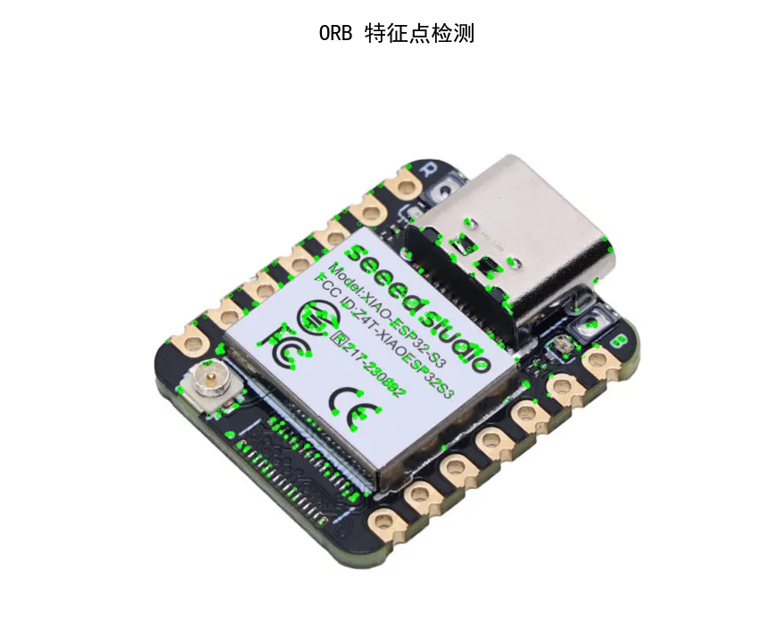

> 图 12.5 图像中的特征点示例
>

常见的特征点包括：

+ 角点（如两条边的交点）
+ 高对比度区域
+ 纹理丰富的区域
+ 小物体或特殊形状的中心点

#### 3.1.2. 特征点在对象识别中的作用

特征点在对象识别系统中扮演着关键角色：

1. **物体识别**：不同的物体通常有不同的特征点分布
2. **姿态估计**：通过匹配特征点，可以确定物体的位置和方向
3. **图像配准**：特征点匹配可以将不同视角下的图像对齐

与轮廓检测相比，特征点检测更加关注图像的局部细节，能够处理部分遮挡、旋转、缩放等复杂场景。

### 3.2. ORB特征检测简介

#### 3.2.1. ORB算法的原理

ORB (Oriented FAST and Rotated BRIEF) 算法是一种高效的特征点检测和描述算法，它结合了 FAST 角点检测和 BRIEF 特征描述，并对它们进行了改进，使其具有旋转不变性。

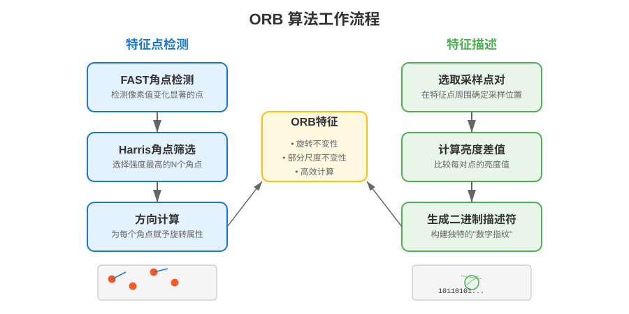

> 图 12.6 ORB 算法原理图
>

ORB 算法包括两个主要部分：

1. **特征点检测（基于改进的FAST）**：
    + 首先使用 FAST 算法检测角点
    + 计算角点的 Harris 响应值，选择前 N 个最强的角点
    + 为每个角点计算方向信息，赋予其旋转不变性
2. **特征描述（基于改进的BRIEF）**：
    + 在每个关键点周围选取一组点对
    + 根据这些点对的亮度对比生成二进制描述符
    + 考虑关键点的方向，对采样模式进行旋转，实现旋转不变性

#### 3.2.2. ORB算法的优势

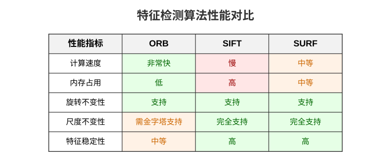

> 图 12.7 不同算法性能对比图
>

与其他特征检测算法相比，ORB 具有以下优势：

1. **计算效率高**：ORB 算法的计算速度是 SIFT 的数十倍，适合资源受限的边缘设备
2. **内存占用少**：ORB 的特征描述符是二进制形式的，比 SIFT 和 SURF 的浮点描述符更节省内存
3. **旋转不变性**：能够检测并匹配不同旋转角度下的同一特征
4. **尺度不变性**（部分支持）：通过在图像金字塔上运行，可以检测不同尺度下的特征

这些特性使 ORB 成为在边缘设备上进行特征检测和匹配的理想选择，特别适合我们的对象识别系统。

### 3.3. 在 OpenCV 中使用 ORB

#### 3.3.1. 创建 ORB 检测器

在 OpenCV 中，我们使用 `ORB_create()` 函数来创建 ORB 特征检测器。这个函数允许我们配置多个参数，以满足不同的需求：

```python
# 创建默认参数的 ORB 检测器
orb = cv2.ORB_create()

# 创建自定义参数的 ORB 检测器
orb = cv2.ORB_create(
    nfeatures=500,       # 检测的特征点数量上限
    scaleFactor=1.2,     # 图像金字塔的缩放因子
    nlevels=8,           # 图像金字塔的层数
    edgeThreshold=31,    # 边缘阈值，防止检测到图像边缘的特征
    firstLevel=0,        # 金字塔的第一层
    WTA_K=2,             # 用于计算描述符的点数
    scoreType=cv2.ORB_HARRIS_SCORE,  # 使用Harris角点响应值
    patchSize=31,        # 特征点补丁的大小
    fastThreshold=20     # FAST算法的阈值
)
```

对于大多数应用，默认参数已经足够好。但在某些情况下，调整参数可以提高检测效果：

+ 增加 `nfeatures` 可以检测更多特征点，但会增加计算量
+ 调整 `scaleFactor` 和 `nlevels` 可以影响算法对不同尺度的适应能力
+ 降低 `fastThreshold` 可以检测更多特征点，但可能增加噪声点

#### 3.3.2. 检测关键点并计算描述符

创建 ORB 检测器后，我们可以使用它来检测图像中的关键点并计算它们的描述符：

```python
# 读取图像并转换为灰度图
img = cv2.imread('object.jpg')
gray = cv2.cvtColor(img, cv2.COLOR_BGR2GRAY)

# 检测关键点并计算描述符
keypoints, descriptors = orb.detectAndCompute(gray, None)

print(f"检测到 {len(keypoints)} 个特征点")
```

> 返回的 `keypoints` 是一个包含 `KeyPoint` 对象的列表，每个对象包含关键点的位置、大小、方向等信息。而 `descriptors` 是一个 NumPy 数组，每一行对应一个关键点的描述符，在 ORB 算法中，每个描述符是一个 256 位的二进制串，在 NumPy 中表示为 32 个字节。
>

这个过程中，ORB 算法完成了两项任务：

1. **检测关键点**：找出图像中的角点或显著特征点
2. **计算描述符**：为每个关键点生成一个描述向量，用于后续匹配

#### 3.3.3. 绘制检测到的关键点

为了可视化检测结果，我们可以使用 OpenCV 的 `drawKeypoints()` 函数将关键点绘制在图像上：

```python
# 绘制关键点
img_with_keypoints = cv2.drawKeypoints(
    img,                # 输入图像
    keypoints,          # 检测到的关键点
    None,               # 输出图像，None表示自动创建
    color=(0, 255, 0),  # 关键点的颜色（绿色）
    flags=cv2.DRAW_MATCHES_FLAGS_DRAW_RICH_KEYPOINTS  # 绘制模式
)

# 显示结果
cv2.imshow('ORB Keypoints', img_with_keypoints)
cv2.waitKey(0)
cv2.destroyAllWindows()
```

> `flags` 参数控制关键点的绘制方式：
>
> + `cv2.DRAW_MATCHES_FLAGS_DEFAULT`：只绘制关键点的位置
> + `cv2.DRAW_MATCHES_FLAGS_DRAW_RICH_KEYPOINTS`：绘制包含大小和方向的完整关键点信息
>

使用 `DRAW_RICH_KEYPOINTS` 模式时，关键点会显示为圆圈，圆圈的大小表示关键点的尺度，圆圈上的线表示关键点的方向。

### 3.4. 特征点完整示例

下面是一个完整的 ORB 特征检测示例：

```python
import cv2
import numpy as np
import matplotlib.pyplot as plt

def detect_orb_features(image_path, num_features=500):
    # 读取图像
    img = cv2.imread(image_path)
    if img is None:
        print(f'无法读取图像：{image_path}')
        return None
    
    # 转换为灰度图
    gray = cv2.cvtColor(img, cv2.COLOR_BGR2GRAY)
    
    # 创建 ORB 检测器
    orb = cv2.ORB_create(nfeatures=num_features)
    
    # 检测关键点并计算描述符
    keypoints, descriptors = orb.detectAndCompute(gray, None)
    
    print(f'检测到 {len(keypoints)} 个特征点')
    
    # 绘制关键点
    img_with_keypoints = cv2.drawKeypoints(
        img, keypoints, None, 
        color=(0, 255, 0), 
        flags=cv2.DRAW_MATCHES_FLAGS_DRAW_RICH_KEYPOINTS
    )
    
    return img_with_keypoints, keypoints, descriptors

# 示例使用
result_img, kp, des = detect_orb_features('object-2.jpg')

if result_img is not None:
    # 转换 BGR 图像为 RGB
    result_img_rgb = cv2.cvtColor(result_img, cv2.COLOR_BGR2RGB)
    
    # 使用 Matplotlib 显示图像
    plt.figure(figsize=(10, 6))
    plt.imshow(result_img_rgb)
    plt.axis('off')  # 隐藏坐标轴
    plt.title('ORB Features')
    plt.show()
```

通过这个示例，我们可以看到 ORB 算法能够有效地检测图像中的特征点。这些特征点的位置、大小和方向信息，以及对应的描述符，将是后续特征匹配的基础。

通过特征提取，我们已经能够从参考图像和场景图像中分别提取出特征点及其描述符。在我们的对象识别系统中，下一步就是将这些特征点进行匹配，找出两幅图像中对应的点对。这一步至关重要，因为它建立了目标物体和场景之间的联系，让系统能够判断目标物体是否存在于场景中。接下来，我们将学习特征匹配技术，为最终的目标定位做准备。

---

## 4. 特征匹配与图像配准

### 4.1. 特征匹配的基本原理

特征匹配是在两幅图像中找到对应特征点的过程。通过比较特征点的描述符，我们可以判断两个特征点是否对应同一个物体表面上的物理点。

简单来说，特征匹配就像是在两张照片中找到同一个人的过程 —— 我们通过比较各个人的特征（如面部特征、身高、发型等）来确定哪些是同一个人。在图像中，我们用特征描述符来表示每个特征点的"特征"，然后通过计算描述符之间的距离或相似度来进行匹配。

在对象识别系统中，特征匹配是连接特征检测和目标定位的关键环节。通过有效的特征匹配，我们可以确定目标物体在场景中的存在和位置。

### 4.2. BFMatcher 特征匹配器

#### 4.2.1. BFMatcher 的工作原理

BFMatcher（Brute-Force Matcher，暴力匹配器）是 OpenCV 提供的一种简单而有效的特征匹配方法。顾名思义，它使用暴力匹配策略，将第一幅图像中的每个特征点与第二幅图像中的所有特征点进行比较，找出最佳匹配。

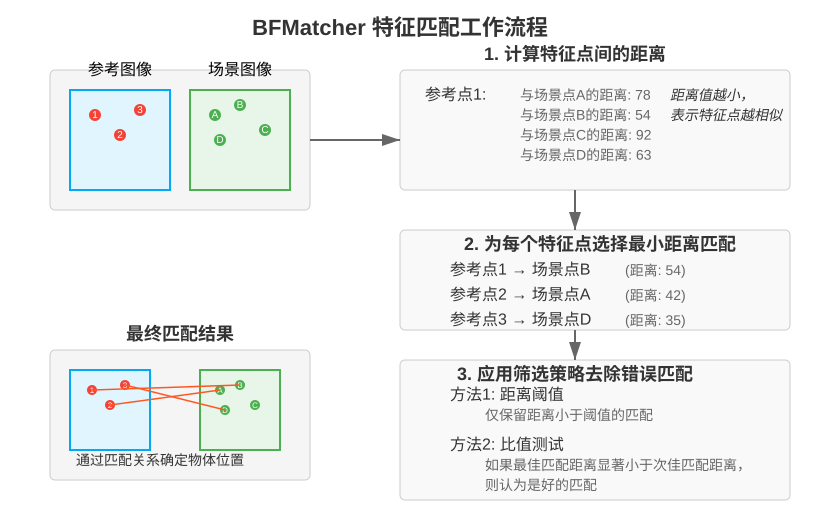

> 图 12.8 BFMatcher 工作原理图
>

基本工作流程如下：

1. 计算第一幅图像中每个特征描述符与第二幅图像中所有特征描述符之间的距离
2. 选取距离最小的匹配作为最佳匹配
3. 应用筛选策略去除可能的错误匹配

BFMatcher 虽然计算量较大，但实现简单且匹配效果良好，特别适合特征点数量不太多的情况。

#### 4.2.2. 创建并配置 BFMatcher

在 OpenCV 中，我们使用 `cv2.BFMatcher()` 函数创建 BFMatcher 对象：

```python
# 创建 BFMatcher 对象
bf = cv2.BFMatcher(normType, crossCheck)
```

> **参数说明**：
>
> + **normType**：用于计算描述符之间距离的度量方式
>   + 对于 ORB、BRIEF、BRISK 等二进制描述符，使用 `cv2.NORM_HAMMING`
>   + 对于 SIFT、SURF 等浮点描述符，使用 `cv2.NORM_L2`
> + **crossCheck**：是否启用交叉检查（默认为 False）
>   + 如果为 True，则只返回相互最佳的匹配
>   + 这可以提高匹配质量，但可能减少匹配数量
>

**示例**：

```python
# 为 ORB 描述符创建 BFMatcher
bf = cv2.BFMatcher(cv2.NORM_HAMMING, crossCheck=True)
```

#### 4.2.3. 使用 BFMatcher 进行特征匹配

BFMatcher 提供了两种匹配方法：

1. **简单匹配（match）**：为每个描述符找到最佳匹配

    ```python
    matches = bf.match(des1, des2)
    ```

2. **K近邻匹配（knnMatch）**：为每个描述符找到 K 个最佳匹配

    ```python
    matches = bf.knnMatch(des1, des2, k=2)
    ```

对于简单匹配，返回值是一个 `DMatch` 对象的列表，每个对象包含匹配的索引和距离信息：

+ `match.queryIdx`：第一幅图像中特征点的索引
+ `match.trainIdx`：第二幅图像中特征点的索引
+ `match.distance`：两个特征点之间的距离（越小越好）

对于 K 近邻匹配，返回值是一个列表的列表，每个内部列表包含 K 个 `DMatch` 对象。

#### 4.2.4. 匹配结果的筛选与优化

特征匹配通常会产生一些错误的匹配，我们需要通过一些策略来筛选和优化匹配结果：

1. **基于距离的筛选**（适用于简单匹配）：

    ```python
    # 按照距离排序
    matches = sorted(matches, key=lambda x: x.distance)

    # 选择前N个最佳匹配
    good_matches = matches[:30]

    # 或者设置距离阈值
    good_matches = [m for m in matches if m.distance < threshold]
    ```

2. **比值测试**（适用于 K 近邻匹配）：

    ```python
    # 使用 Lowe's ratio test 筛选匹配点
    good_matches = []
    for m, n in matches:  # m 是最近邻，n 是次近邻
        if m.distance < 0.75 * n.distance:
            good_matches.append(m)
    ```

    比值测试的原理是：如果最佳匹配比次佳匹配好很多，那么这个匹配很可能是正确的。

#### 4.2.5. 可视化匹配结果

OpenCV 提供了 `drawMatches()` 和 `drawMatchesKnn()` 函数来可视化匹配结果：

```python
# 绘制简单匹配结果
img_matches = cv2.drawMatches(
    img1, kp1, img2, kp2, good_matches, None,
    flags=cv2.DrawMatchesFlags_NOT_DRAW_SINGLE_POINTS
)

# 绘制 K 近邻匹配结果（需要调整格式）
knn_matches_to_draw = [matches[i][:1] for i in range(len(matches)) if len(matches[i]) > 0]
img_matches = cv2.drawMatchesKnn(
    img1, kp1, img2, kp2, knn_matches_to_draw, None,
    flags=cv2.DrawMatchesFlags_NOT_DRAW_SINGLE_POINTS
)


# 调整图像大小以适应屏幕显示
height, width = img_matches.shape[:2]
max_display_width = 1200  # 设置最大显示宽度
if width > max_display_width:
    scale = max_display_width / width
    new_size = (int(width * scale), int(height * scale))
    img_matches = cv2.resize(img_matches, new_size, interpolation=cv2.INTER_AREA)

# 显示结果
cv2.imshow('Feature Matches', img_matches)
cv2.waitKey(0)
cv2.destroyAllWindows()
```

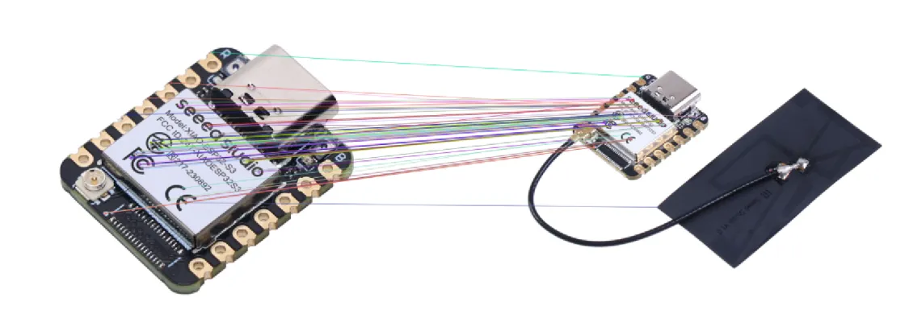

> 图 12.9 特征匹配可视化示例图
>

绘制匹配结果可以帮助我们直观地查看匹配效果，便于调整匹配参数和策略。在绘制的图像中，左侧是第一幅图像，右侧是第二幅图像，连线表示匹配的特征点对。线越多表示匹配的特征点越多，而线的分布是否合理则反映了匹配的质量。

#### 4.2.6. 完整特征匹配示例

下面是一个使用 ORB 特征检测和 BFMatcher 进行特征匹配的完整示例：

```python
import cv2
import numpy as np

def match_features_knn(img1_path, img2_path):
    # 读取图像（以彩色模式读取）
    img1_color = cv2.imread(img1_path, cv2.IMREAD_COLOR)  # 使用 cv2.IMREAD_COLOR 读取彩色图像
    img2_color = cv2.imread(img2_path, cv2.IMREAD_COLOR)  # 使用 cv2.IMREAD_COLOR 读取彩色图像
    
    if img1_color is None or img2_color is None:
        print('无法读取图像')
        return None
    
    # 将彩色图像转换为灰度图像以进行特征检测
    img1 = cv2.cvtColor(img1_color, cv2.COLOR_BGR2GRAY)
    img2 = cv2.cvtColor(img2_color, cv2.COLOR_BGR2GRAY)
    
    # 创建 ORB 检测器
    orb = cv2.ORB_create(nfeatures=1000)
    
    # 检测关键点并计算描述符
    kp1, des1 = orb.detectAndCompute(img1, None)
    kp2, des2 = orb.detectAndCompute(img2, None)
    
    print(f'图像 1: 检测到 {len(kp1)} 个特征点')
    print(f'图像 2: 检测到 {len(kp2)} 个特征点')
    
    # 创建 BFMatcher 对象
    bf = cv2.BFMatcher(cv2.NORM_HAMMING, crossCheck=False)  # 取消 crossCheck 以便使用 KNN
    
    # 进行 KNN 特征匹配（k=2，每个特征点匹配两个最近的邻居）
    knn_matches = bf.knnMatch(des1, des2, k=2)
    
    # 应用 Lowe’s ratio test 过滤匹配点
    good_matches = []
    for m, n in knn_matches:
        if m.distance < 0.75 * n.distance:  # 0.75 是经验阈值，越小筛选越严格
            good_matches.append(m)
    
    print(f'初始匹配数量: {len(knn_matches)}')
    print(f'通过 Lowe 过滤后保留的匹配数: {len(good_matches)}')
    
    # 正确绘制 KNN 匹配（使用彩色图像）
    knn_matches_to_draw = [[m] for m in good_matches]  # 转换为 list[list[DMatch]]
    img_matches = cv2.drawMatchesKnn(
        img1_color, kp1, img2_color, kp2, knn_matches_to_draw, None,
        flags=cv2.DrawMatchesFlags_NOT_DRAW_SINGLE_POINTS
    )

    # 调整图像大小以适应屏幕显示
    height, width = img_matches.shape[:2]
    max_display_width = 1200  # 设置最大显示宽度
    if width > max_display_width:
        scale = max_display_width / width
        new_size = (int(width * scale), int(height * scale))
        img_matches = cv2.resize(img_matches, new_size, interpolation=cv2.INTER_AREA)
    
    return img_matches

# 示例使用
result = match_features_knn('object-2.jpg', 'scene-2.jpg')
if result is not None:
    cv2.imshow('Feature Matching (KNN + Lowe)', result)
    cv2.waitKey(0)
    cv2.destroyAllWindows()
```

这个示例展示了特征匹配的完整流程：

1. 读取两幅图像并转换为灰度图
2. 使用 ORB 算法检测特征点并计算描述符
3. 创建 BFMatcher 并进行特征匹配
4. 筛选好的匹配并绘制匹配结果

有了匹配的特征点后，下一个关键问题是：如何利用这些匹配点确定物体在图像中的位置？这就需要使用图像配准技术，特别是基于单应性矩阵的配准方法。

### 4.3. 图像配准技术

#### 4.3.1. 图像配准的基本概念

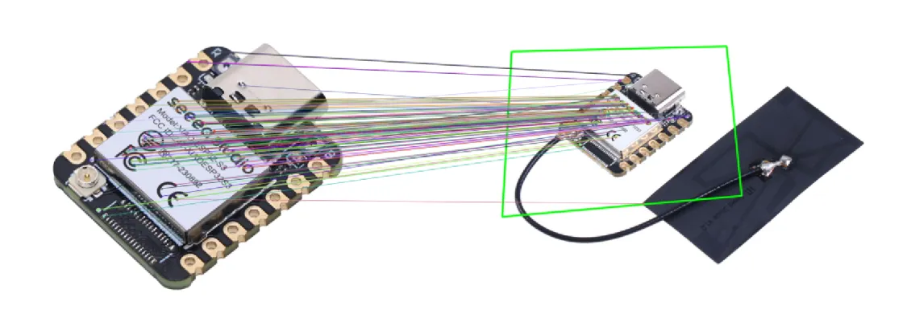

> 图12.10 图像配准示例图
>

图像配准是一种将两幅相关图像对齐的技术。想象一下，你有两张照片：一张是你要寻找的物体（如图中的 XIAO 开发板），另一张是包含这个物体的场景（如图中连接天线的开发板）。图像配准能够帮助我们确定：

1. 物体是否存在于场景中
2. 如果存在，它在场景中的具体位置和方向

配准的基本原理是找到两幅图像之间的空间变换关系，然后将一幅图像变换到另一幅图像的坐标系中。这个变换关系通常用一个变换矩阵来表示，如平移矩阵、旋转矩阵或单应性矩阵。

#### 4.3.2. 单应性矩阵计算：连接两幅图像的桥梁

单应性矩阵是一种数学工具，可以描述两幅平面图像之间的变换关系。它是一个 3×3 的矩阵，能够处理平移、旋转、缩放甚至透视变换。

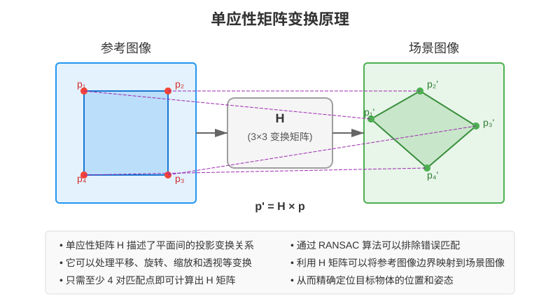

> 图 12.11 单应性矩阵计算原理图
>

在对象识别中，单应性矩阵告诉我们：目标物体从参考图像到场景图像经历了什么样的变换。有了这个矩阵，我们就能在场景中准确定位目标物体。

在 OpenCV 中，我们使用 `findHomography()` 函数来计算单应性矩阵：

```python
# 从匹配点中获取对应点的坐标
src_pts = np.float32([kp1[m.queryIdx].pt for m in good_matches]).reshape(-1, 1, 2)
dst_pts = np.float32([kp2[m.trainIdx].pt for m in good_matches]).reshape(-1, 1, 2)

# 计算单应性矩阵
H, mask = cv2.findHomography(src_pts, dst_pts, cv2.RANSAC, 5.0)
```

> **参数说明**：
>
> + `src_pts` 和 `dst_pts` 是两幅图像中对应的特征点坐标
> + `cv2.RANSAC` 是一种特殊算法，可以排除错误匹配的点，仅使用正确的匹配来计算矩阵
> + `H` 是计算得到的单应性矩阵
> + `mask` 标记了哪些匹配被认为是可靠的（内点）
>

#### 4.3.3. RANSAC：过滤错误匹配的有效工具

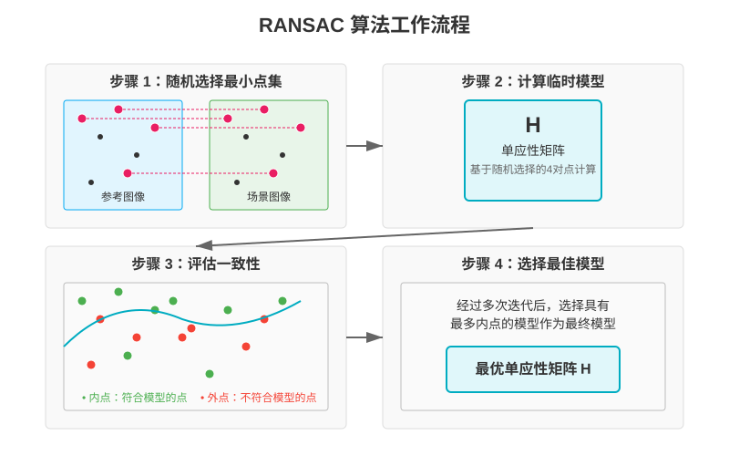

> 图 12.12 RANSAC 算法原理图
>

RANSAC（随机抽样一致性）是一种强大的算法，用于从包含许多错误数据的集合中找出正确的模型。在特征匹配中，它的工作原理是：

1. 随机选择最少数量的匹配点对（计算单应性矩阵需要4对点）
2. 用这些点计算临时单应性矩阵
3. 检查所有其他匹配点与这个矩阵的一致性
4. 如果一致的点（内点）足够多，就认为找到了好的模型
5. 重复多次，选择内点最多的模型

通过这一过程，RANSAC 能有效排除错误匹配，提高配准精度。

#### 4.3.4. 物体定位：找出场景中的目标

获得单应性矩阵后，我们可以使用 `perspectiveTransform()` 函数将目标图像中的点映射到场景图像中：

```python
# 获取目标图像的四个角点
h, w = img1.shape
pts = np.float32([[0, 0], [0, h-1], [w-1, h-1], [w-1, 0]]).reshape(-1, 1, 2)

# 将角点映射到场景图像中
dst = cv2.perspectiveTransform(pts, H)

# 在场景图像中绘制目标边框
scene_color = cv2.cvtColor(img2, cv2.COLOR_GRAY2BGR)
cv2.polylines(scene_color, [np.int32(dst)], True, (0, 255, 0), 3)
```

这段代码将目标图像的四个角点映射到场景图像中，然后绘制一个多边形边框来标示目标的位置。

#### 4.3.5. 完整的图像配准示例

下面是一个使用特征匹配和单应性矩阵进行图像配准的完整示例：

```python
import cv2
import numpy as np

def object_detection(obj_path, scene_path):
    # 读取图像（以彩色模式读取）
    obj = cv2.imread(obj_path, cv2.IMREAD_COLOR)  # 使用 cv2.IMREAD_COLOR 读取彩色图像
    scene = cv2.imread(scene_path, cv2.IMREAD_COLOR)  # 使用 cv2.IMREAD_COLOR 读取彩色图像
    
    if obj is None or scene is None:
        print('无法读取图像')
        return None
    
    # 将彩色图像转换为灰度图像以进行特征检测
    obj_gray = cv2.cvtColor(obj, cv2.COLOR_BGR2GRAY)
    scene_gray = cv2.cvtColor(scene, cv2.COLOR_BGR2GRAY)
    
    # 创建 ORB 检测器
    orb = cv2.ORB_create(nfeatures=2000)
    
    # 检测关键点并计算描述符（使用灰度图像）
    kp1, des1 = orb.detectAndCompute(obj_gray, None)
    kp2, des2 = orb.detectAndCompute(scene_gray, None)
    
    # 创建 BFMatcher
    bf = cv2.BFMatcher(cv2.NORM_HAMMING)
    
    # 使用 KNN 匹配
    matches = bf.knnMatch(des1, des2, k=2)
    
    # 应用比值测试筛选匹配点
    good_matches = []
    for m, n in matches:
        if m.distance < 0.75 * n.distance:
            good_matches.append(m)
    
    print(f'匹配数量: {len(good_matches)}')
    
    if len(good_matches) >= 10:
        # 获取匹配点坐标
        src_pts = np.float32([kp1[m.queryIdx].pt for m in good_matches]).reshape(-1, 1, 2)
        dst_pts = np.float32([kp2[m.trainIdx].pt for m in good_matches]).reshape(-1, 1, 2)
        
        # 计算单应性矩阵
        H, mask = cv2.findHomography(src_pts, dst_pts, cv2.RANSAC, 5.0)
        
        # 获取目标图像的四个角点
        h, w = obj_gray.shape
        pts = np.float32([[0, 0], [0, h-1], [w-1, h-1], [w-1, 0]]).reshape(-1, 1, 2)
        
        # 将角点映射到场景图像中
        dst = cv2.perspectiveTransform(pts, H)
        
        # 绘制目标边框（直接在彩色场景图像上绘制）
        cv2.polylines(scene, [np.int32(dst)], True, (0, 255, 0), 3, cv2.LINE_AA)
        
        # 绘制匹配结果（使用彩色图像）
        match_img = cv2.drawMatches(obj, kp1, scene, kp2, good_matches, None,
                                   flags=cv2.DrawMatchesFlags_NOT_DRAW_SINGLE_POINTS)
        
        # 调整图像大小以适应屏幕显示
        height, width = match_img.shape[:2]
        max_display_width = 1200  # 设置最大显示宽度
        if width > max_display_width:
            scale = max_display_width / width
            new_size = (int(width * scale), int(height * scale))
            match_img = cv2.resize(match_img, new_size, interpolation=cv2.INTER_AREA)
        
        return match_img
    else:
        print('匹配点不足，无法进行对象检测')
        return None

# 示例使用
result = object_detection('object.jpg', 'scene.jpg')
if result is not None:
    cv2.imshow('Object Detection', result)
    cv2.waitKey(0)
    cv2.destroyAllWindows()
```

这个示例展示了一个完整的对象识别流程：

1. 读取目标图像和场景图像
2. 使用 ORB 检测特征点并计算描述符
3. 使用 BFMatcher 进行特征匹配，并应用比值测试筛选匹配点
4. 如果有足够的匹配点，计算单应性矩阵
5. 将目标图像的四个角点映射到场景图像中
6. 在场景图像中绘制目标边框，并显示匹配结果

通过这种方法，我们可以在复杂场景中准确定位目标物体的位置，即使目标物体经过旋转、缩放或部分遮挡。

至此，我们已经掌握了构建对象识别系统所需的全部技术组件：轮廓检测帮助我们理解物体的形状特征，特征点提取和匹配让我们能够在不同图像间找到对应关系，而图像配准技术则使我们能够精确定位目标物体。

---

## 5. 项目实现：简易对象识别系统

### 5.1. 整合前面所学知识

正如我们在课程开始时预览的那样，简易对象识别系统需要整合轮廓检测、特征提取和特征匹配等技术。现在，我们已经学习了这些技术的原理和实现方法，可以将它们组合起来构建一个完整的系统。

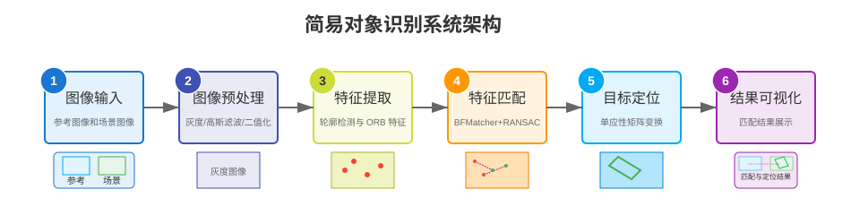

> 图 12.13 对象识别系统流程图
>

系统首先读取参考图像和场景图像，然后通过图像预处理提高后续分析的质量。接下来，系统同时进行轮廓检测和特征点提取，获取图像的形状和局部特征信息。在特征匹配阶段，系统使用 BFMatcher 找出对应点对，并通过单应性矩阵计算目标物体的变换关系。最后，系统在场景图像中标记出识别结果，直观地展示整个识别过程。

### 5.2. 简易对象识别系统

以下是一个综合运用轮廓检测和特征匹配的简易对象识别系统示例：

```python
import cv2
import numpy as np
import matplotlib.pyplot as plt
import matplotlib

# 设置中文字体
matplotlib.rcParams['font.sans-serif'] = ['SimHei']
matplotlib.rcParams['axes.unicode_minus'] = False

def integrated_object_recognition(reference_path, scene_path):
    """整合轮廓检测和特征匹配的对象识别系统"""
    
    # 1. 读取图像
    reference = cv2.imread(reference_path)
    scene = cv2.imread(scene_path)
    
    if reference is None or scene is None:
        print("无法读取图像")
        return False
    
    # 2. 图像预处理
    # 创建图像副本用于绘制结果
    reference_display = reference.copy()
    scene_display = scene.copy()
    
    # 转换为灰度图
    ref_gray = cv2.cvtColor(reference, cv2.COLOR_BGR2GRAY)
    scene_gray = cv2.cvtColor(scene, cv2.COLOR_BGR2GRAY)
    
    # 高斯模糊去噪
    ref_blur = cv2.GaussianBlur(ref_gray, (5, 5), 0)
    scene_blur = cv2.GaussianBlur(scene_gray, (5, 5), 0)
    
    # 二值化处理
    _, ref_binary = cv2.threshold(ref_blur, 127, 255, cv2.THRESH_BINARY)
    _, scene_binary = cv2.threshold(scene_blur, 127, 255, cv2.THRESH_BINARY)
    
    # 3. 轮廓检测
    ref_contours, _ = cv2.findContours(ref_binary.copy(), cv2.RETR_TREE, cv2.CHAIN_APPROX_SIMPLE)
    scene_contours, _ = cv2.findContours(scene_binary.copy(), cv2.RETR_TREE, cv2.CHAIN_APPROX_SIMPLE)
    
    # 绘制参考图像的轮廓
    cv2.drawContours(reference_display, ref_contours, -1, (0, 255, 0), 2)
    
    print(f"参考图像: 检测到 {len(ref_contours)} 个轮廓")
    print(f"场景图像: 检测到 {len(scene_contours)} 个轮廓")
    
    # 4. 特征点检测与匹配
    # 创建ORB检测器
    orb = cv2.ORB_create(nfeatures=6000)
    
    # 检测特征点并计算描述符
    kp1, des1 = orb.detectAndCompute(ref_gray, None)
    kp2, des2 = orb.detectAndCompute(scene_gray, None)
    
    print(f"参考图像: 检测到 {len(kp1)} 个特征点")
    print(f"场景图像: 检测到 {len(kp2)} 个特征点")
    
    # 使用BFMatcher进行特征匹配
    bf = cv2.BFMatcher(cv2.NORM_HAMMING)
    matches = bf.knnMatch(des1, des2, k=2)
    
    # 应用比值测试筛选好的匹配
    good_matches = []
    for m, n in matches:
        if m.distance < 0.8 * n.distance:
            good_matches.append(m)
    
    print(f"有效匹配数量: {len(good_matches)}")
    
    # 5. 目标定位与可视化
    result_image = scene.copy()
    
    # 绘制场景中的所有轮廓
    cv2.drawContours(result_image, scene_contours, -1, (255, 0, 0), 1)
    
    # 如果匹配点足够多，进行目标定位
    if len(good_matches) >= 10:
        # 获取匹配点坐标
        src_pts = np.float32([kp1[m.queryIdx].pt for m in good_matches]).reshape(-1, 1, 2)
        dst_pts = np.float32([kp2[m.trainIdx].pt for m in good_matches]).reshape(-1, 1, 2)
        
        # 计算单应性矩阵
        H, mask = cv2.findHomography(src_pts, dst_pts, cv2.RANSAC, 5.0)
        
        # 获取参考图像的四个角点
        h, w = ref_gray.shape
        pts = np.float32([[0, 0], [0, h-1], [w-1, h-1], [w-1, 0]]).reshape(-1, 1, 2)
        
        # 将角点映射到场景图像中
        dst = cv2.perspectiveTransform(pts, H)
        
        # 在场景图像中绘制目标边框
        cv2.polylines(result_image, [np.int32(dst)], True, (0, 255, 0), 3)
        
        # 6. 可视化结果
        fig, axes = plt.subplots(2, 2, figsize=(12, 10))
        
        # 6.1 显示参考图像及其轮廓
        axes[0, 0].imshow(cv2.cvtColor(reference_display, cv2.COLOR_BGR2RGB))
        axes[0, 0].set_title('参考图像及轮廓')
        axes[0, 0].axis('off')
        
        # 6.2 显示参考图像的特征点
        ref_keypoints = cv2.drawKeypoints(reference, kp1, None, 
                                        color=(0, 255, 0), 
                                        flags=cv2.DRAW_MATCHES_FLAGS_DRAW_RICH_KEYPOINTS)
        axes[0, 1].imshow(cv2.cvtColor(ref_keypoints, cv2.COLOR_BGR2RGB))
        axes[0, 1].set_title('参考图像特征点')
        axes[0, 1].axis('off')
        
        # 6.3 显示特征匹配结果
        match_img = cv2.drawMatches(reference, kp1, scene, kp2, 
                                    good_matches, None, 
                                    flags=cv2.DrawMatchesFlags_NOT_DRAW_SINGLE_POINTS)
        axes[1, 0].imshow(cv2.cvtColor(match_img, cv2.COLOR_BGR2RGB))
        axes[1, 0].set_title('特征匹配')
        axes[1, 0].axis('off')
        
        # 6.4 显示最终识别结果
        axes[1, 1].imshow(cv2.cvtColor(result_image, cv2.COLOR_BGR2RGB))
        axes[1, 1].set_title('最终识别结果')
        axes[1, 1].axis('off')
        
        plt.tight_layout()
        plt.show()
        
        return True
    else:
        print("匹配点不足，无法识别目标")
        
        # 显示轮廓检测结果
        plt.figure(figsize=(12, 5))
        plt.subplot(1, 2, 1)
        plt.imshow(cv2.cvtColor(reference_display, cv2.COLOR_BGR2RGB))
        plt.title('参考图像及轮廓')
        plt.axis('off')
        
        plt.subplot(1, 2, 2)
        plt.imshow(cv2.cvtColor(result_image, cv2.COLOR_BGR2RGB))
        plt.title('场景图像及轮廓')
        plt.axis('off')
        
        plt.tight_layout()
        plt.show()
        
        return False

# 使用示例
integrated_object_recognition('object.jpg', 'scene.jpg')
```

系统分为几个主要模块：图像读取与预处理、轮廓检测、特征点提取和匹配、目标定位与可视化。这里的 ORB 特征点检测参数设置为 6000，以确保提取足够多的特征点；比值测试阈值设为 0.8，控制匹配点的筛选精度；RANSAC 算法的阈值为 5.0，用于筛选单应性矩阵计算中的内点。

需要注意的是，在实际应用中，这些参数需要根据具体场景进行调整。比如对于纹理丰富的图像，可以降低 ORB 的 nfeatures 值；对于需要更精确匹配的场景，可以降低比值测试阈值；如果物体变形较大，则可能需要提高 RANSAC 的距离阈值。本代码提供的是理解特征检测和匹配原理的基础框架，在实际项目中可能需要结合更多技术来提高识别的准确性和鲁棒性。

### 5.3. 运行效果展示

运行该程序后，我们可以得到如下效果：

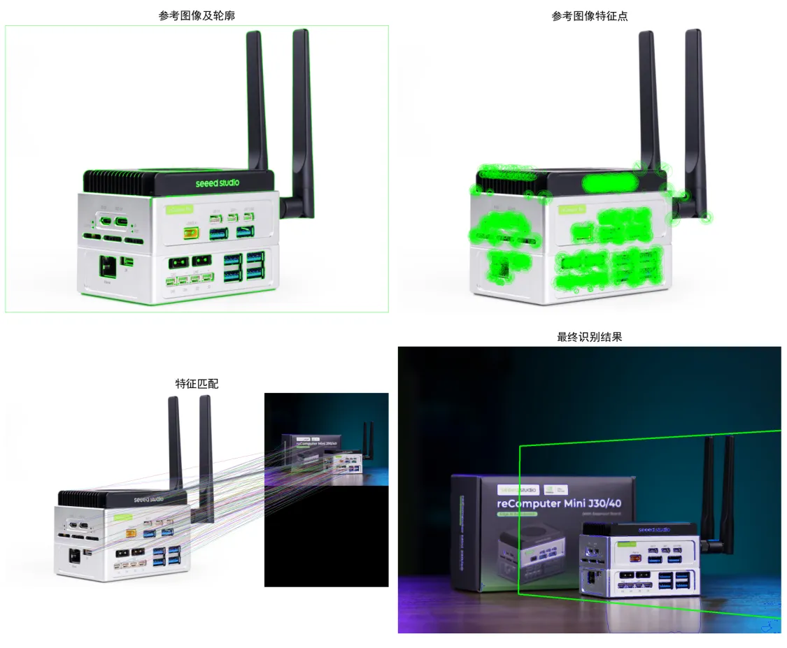

> 图 12.14 对象识别系统运行效果
>

在这个结果中，我们可以清晰地看到：

+ 在左上角，我们可以看到参考图像及其检测到的轮廓，绿色线条勾勒出物体的边界形状。
+ 右上角显示了参考图像中提取的特征点，这些绿色圆圈代表图像中的关键区域。
+ 左下角展示了参考图像与场景图像之间的特征点匹配情况，连线表示找到的对应关系。
+ 右下角是最终的识别结果，我们可以看到目标物体被绿色边框精确标记，而蓝色线条则显示场景中检测到的所有轮廓。

通过这种综合展示，我们可以直观地理解轮廓检测和特征匹配在对象识别中的协同作用。

### 5.4. 在边缘设备上的优化

在 Jetson 等边缘设备上运行对象识别系统时，我们需要考虑资源限制，进行必要的优化：

1. **减少特征点数量**

    对于 ORB 等特征提取算法，可以适当降低 `nfeatures` 参数值，减少检测和计算的特征点数量。较少的特征点意味着更低的计算负担和内存占用，同时在大多数应用场景中仍能保持足够的识别准确度。

2. **降低图像分辨率**

    高分辨率图像处理需要更多的计算资源。在边缘设备上，可以在预处理阶段对输入图像进行适当缩放，减少需要处理的像素数量。这种简单的处理可以显著提升系统性能，特别是在处理实时视频流时。

3. **选择性处理**

    对于视频流应用，可以实施帧采样策略，例如每隔几帧处理一次，而不是处理每一帧图像。这种方法可以大幅降低系统负载，在保持可接受的响应速度的同时，减轻处理器和内存压力。

通过这些优化措施，我们可以显著提高对象识别系统在边缘设备上的运行效率，实现更接近实时的性能表现。

## 6. 总结

通过本课的学习，我们掌握了轮廓检测和特征提取这两项计算机视觉的核心技术，并将它们整合应用于对象识别系统。我们学习了如何使用 OpenCV 检测物体轮廓并分析其几何特征；深入理解了 ORB 特征点检测算法的原理及其在复杂场景中的应用优势；掌握了特征匹配和图像配准的方法，能够通过BFMatcher和单应性矩阵精确定位目标物体；最终，我们将这些技术组合成一个完整的对象识别系统，能够在场景图像中识别和定位特定物体，并探讨了在边缘设备上的优化策略。

## 7. 课后拓展

+ **阅读材料**
  + [OpenCV 中文教程 - 轮廓检测](https://github.com/HLearning/OpenCV-Python-Tutorials/blob/master/docs/4.%20OpenCV%E4%B8%AD%E7%9A%84%E5%9B%BE%E5%83%8F%E5%A4%84%E7%90%86/4.9.1.%20%E8%BD%AE%E5%BB%93%EF%BC%9A%E5%85%A5%E9%97%A8.md)
  + [ORB 特征检测与匹配官方文档](https://docs.opencv.org/4.x/d1/d89/tutorial_py_orb.html)
+ **实践练习**
    1. **轮廓分析与形状识别**

        **任务描述**：

        + 开发一个程序，利用轮廓检测识别图像中的基本几何形状（圆形、三角形、矩形等）
        + 根据轮廓特征（顶点数量、面积、周长等）对不同形状进行分类
        + 在图像上标注识别出的形状名称

        **提示**：

        + 使用 `cv2.findContours()` 检测二值图像中的轮廓
        + 使用 `cv2.approxPolyDP()` 近似轮廓，根据顶点数判断形状
        + 计算轮廓的面积和周长，进一步辅助形状判断

    2. **特征点匹配与物体识别**

        **任务描述**：

        + 创建一个简单的物体识别程序，能够在场景图像中找到目标物体
        + 使用 ORB 算法提取并匹配特征点
        + 在场景图像中标记出目标物体的位置

        **提示**：

        + 从目标物体和场景图像中提取 ORB 特征点
        + 使用 BFMatcher 匹配特征点，并应用比值测试筛选匹配
        + 计算单应性矩阵，在场景图像中绘制目标边框

    3. **结合轮廓和特征点的对象识别**

        **任务描述**：

        + 开发一个结合轮廓检测和特征匹配的对象识别系统
        + 先使用轮廓检测进行初步目标定位
        + 再使用特征点匹配进行精确识别
        + 比较纯轮廓方法和纯特征点方法的优缺点

        **提示**：

        + 使用轮廓检测找到可能的目标区域
        + 在这些区域内进行特征点提取和匹配
        + 对比分析不同方法的识别准确率和效率

        </br>

    参考答案：[12-轮廓检测与特征提取课后题参考答案](https://github.com/Seeed-Studio/Seeed_Studio_Courses/blob/Edge-AI-101-with-Nvidia-Jetson-Course/docs/cn/2/12/Homework_Answer.md)
