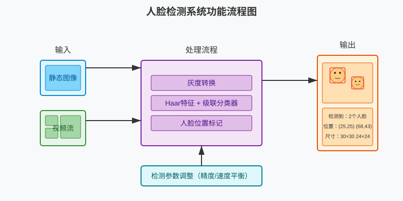
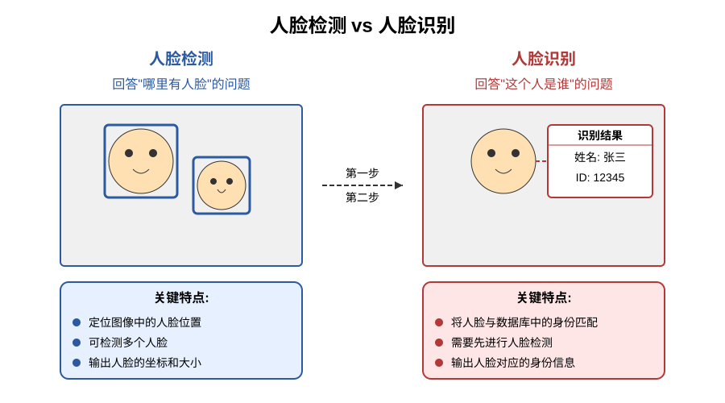
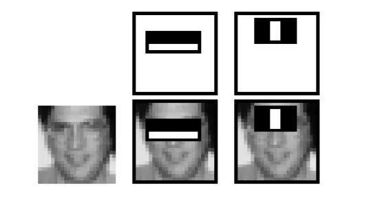
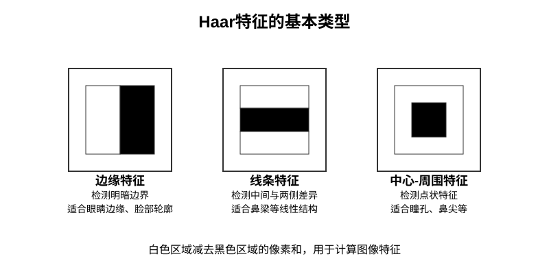
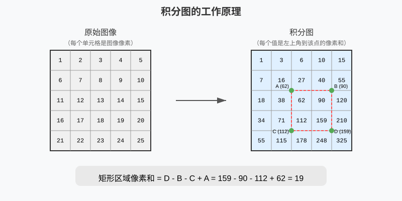
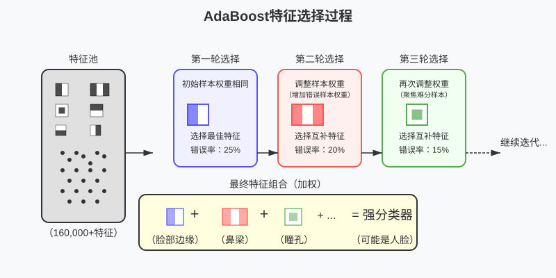
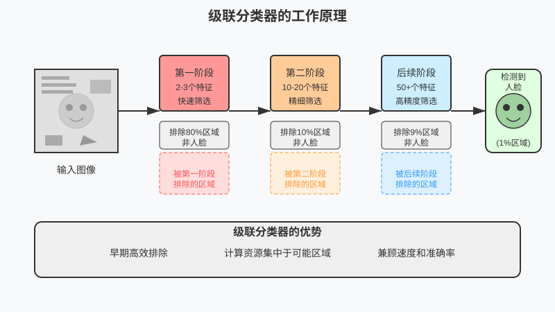
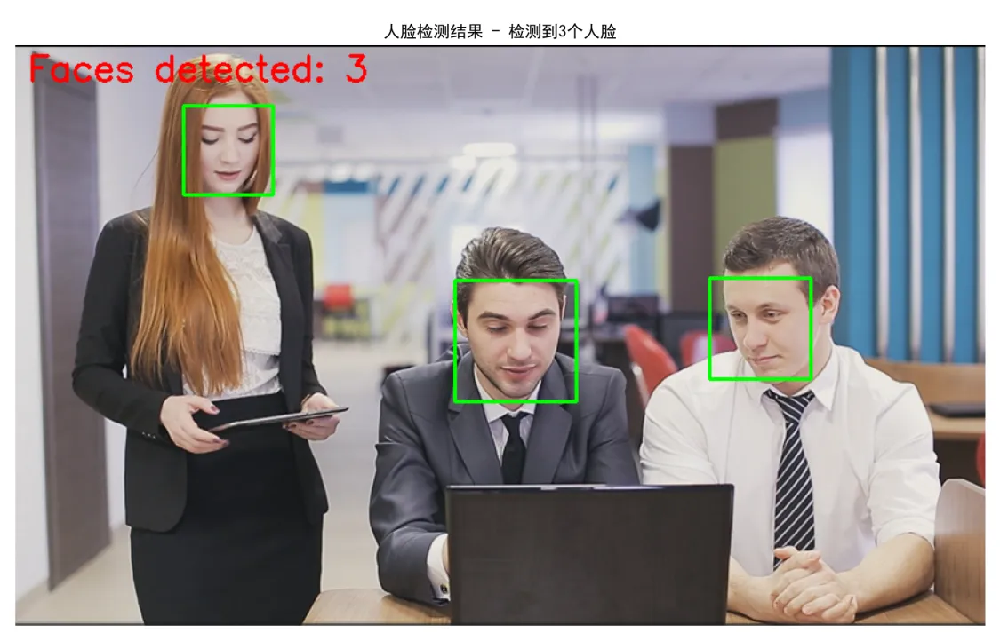
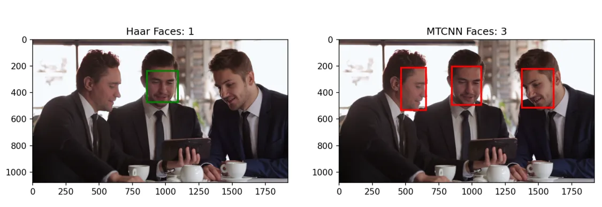

# 第13课：人脸检测基础

## 课程简介

在本课中，我们将学习人脸检测的基本原理和实现方法。人脸检测是计算机视觉领域的基础任务，也是众多高级应用的前提条件。通过本课的学习，您将了解 Haar 特征和级联分类器的工作机制，掌握使用 OpenCV 进行人脸检测的方法，并能够构建一个基础的人脸检测系统，实现对静态图像和实时视频中人脸的准确定位和标记。

## 课程目标

+ 了解人脸检测的基本原理：理解 Haar 特征和级联分类器的工作机制
+ 掌握使用 OpenCV 进行人脸检测的方法：能够检测静态图像和视频中的人脸
+ 编写一个简单的人脸检测程序：实现人脸的位置标记和显示
+ 讨论人脸检测的应用场景和重要性：为后续的深度学习部分做铺垫

---

## 1. 课程引入

### 1.1. 课程概述与目标

在前几课中，我们学习了图像处理的基础知识、边缘检测和轮廓检测等技术。本节课将学习如何识别图像中的人脸，这是许多人机交互、安防监控和社交媒体应用的核心技术。

本课程将围绕以下核心技术展开：

+ **人脸检测基础**：了解人脸检测的意义和应用场景
+ **Haar 特征**：理解基于 Haar 特征的目标检测原理
+ **级联分类器**：掌握级联分类器的工作机制
+ **OpenCV 实现**：使用 OpenCV 库实现人脸检测功能

通过学习这些技术，我们将能够构建一个能够在不同场景中检测人脸的系统。

### 1.2. 项目预览：智能人脸检测系统

作为本课的实践项目，我们将开发一个智能人脸检测系统，该系统能够从静态图像和视频中识别并标记人脸位置。



> 图 13.1 人脸检测系统功能流程图
>

该系统具有以下功能：

1. **静态图像人脸检测**：读取图像，检测并标记所有人脸位置
2. **视频人脸检测**：处理视频文件或摄像头输入，检测视频中的人脸
3. **多人脸同时检测**：能够同时识别画面中的多个人脸
4. **可调整的检测参数**：根据不同场景优化检测效果

这个项目综合应用了本课所学的所有知识点，我们将首先实现静态图像的人脸检测，然后扩展到视频处理，最终构建一个完整的人脸检测应用。

---

## 2. 人脸检测基础知识

### 2.1. 人脸检测简介

人脸检测是计算机视觉中最基础也最常见的应用之一。简单来说，人脸检测就是让计算机自动找出图像或视频中"哪里有人脸"。

在我们的日常生活中，人脸检测技术已经无处不在：

+ 手机相机自动聚焦在人脸上
+ 社交媒体照片中自动标记人脸
+ 安防系统监控特定区域是否有人出现

### 2.2. 人脸检测与人脸识别的区别

许多人容易混淆人脸检测和人脸识别，它们其实是两个不同的任务：



> 图 13.2 人脸检测与人脸识别的区别
>

+ **人脸检测**：确定图像中是否存在人脸，以及人脸的位置和范围（回答"哪里有人脸"的问题）
+ **人脸识别**：确定检测到的人脸属于谁，通常需要与数据库中的人脸进行比对（回答"这个人是谁"的问题）

人脸检测通常是人脸识别的第一步——只有先找到人脸在哪里，才能进一步判断这个人是谁。

## 3. Haar 特征与级联分类器

### 3.1. 计算机如何"看见"人脸

人类可以轻松识别照片中的人脸，但计算机只能"看到"数字。对计算机来说，一张图片就是一个数字矩阵，每个数字代表一个像素的亮度值。

在2001年，Paul Viola 和 Michael Jones 提出了一种巧妙的方法，让计算机能够快速准确地找出图像中的人脸。这种方法被称为 Viola-Jones 算法，它建立在四个关键概念上：

+ **Haar 特征**：简单的视觉模式，用于捕捉人脸的特征
+ **积分图**：一种快速计算的技巧，大大提高处理速度
+ **特征筛选**：从众多特征中选出最有用的
+ **级联检测**：像过滤器一样逐步筛选图像区域

### 3.2. Haar 特征：寻找脸部的"线索"

Haar 特征是一种简单而巧妙的方法，用于检测图像中的特定模式。它基于一个简单观察：人脸上不同部位的明暗分布有一定规律，比如：

+ 眼睛区域通常比周围的脸颊更暗
+ 鼻梁通常比两侧的脸颊更亮
+ 嘴巴的区域与下巴相比有明显的明暗变化



> 图 13.3 人脸上常见的明暗模式
>

Haar 特征正是通过计算图像中特定区域的明暗差异来检测这些模式。它就像一个模板，放在图像上不同位置，计算白色区域与黑色区域的像素值差异。

### 3.3. Haar 特征的类型

Haar 特征有三种基本类型，每种类型适合检测不同的面部特征：



> 图 13.4 三种基本的 Haar 特征类型
>

1. **边缘特征**：由两个相邻的矩形组成，一个白色一个黑色
    + 适合检测如眼睛边缘、脸部轮廓等明暗变化明显的边缘
    + 计算方法：白色区域像素和 - 黑色区域像素和
2. **线条特征**：由三个矩形组成，中间一个与两侧颜色相反
    + 适合检测如鼻梁这样中间与两侧有明显差异的结构
    + 计算方法：中间区域像素和 - 两侧区域像素和
3. **中心-周围特征**：由中心区域和环绕它的外围区域组成
    + 适合检测如瞳孔、鼻尖等点状特征
    + 计算方法：中心区域像素和 - 周围区域像素和

这些基本特征可以通过改变位置、尺寸和比例产生大量变体。在一个典型的 24×24 像素检测窗口中，可能的特征组合数量非常庞大：

+ 不同类型的特征（边缘、线条、中心-周围）
+ 每种特征可以在窗口内的不同位置（x, y 坐标）
+ 每种特征可以有不同的宽度和高度
+ 不同的比例和方向

这些组合的总数超过 160,000 个，这意味着仅从一个小窗口就可以提取大量的特征用于分析图像。

### 3.4. 积分图：计算的"捷径"

计算如此多的 Haar 特征可能需要大量计算资源，但 Viola 和 Jones 使用了一个巧妙的方法——积分图，使这一过程变得非常高效。



> 图 13.5 积分图的工作原理
>

积分图是一种预计算的数据结构：

+ 图中每个位置 (x, y) 的值 = 从图像左上角 (0, 0) 到 (x, y) 这个矩形区域内所有像素值的总和
+ 有了积分图后，计算任意矩形区域内像素和只需 4 个值的简单加减法
+ 这将计算从"需要遍历矩形中每个像素"变成了"只需 4 次查表和 3 次加减法"

积分图的引入将计算任意矩形区域像素和的时间复杂度从 O(width×height) 降低到 O(1)，大大提高了 Haar 特征计算的效率。

### 3.5. 特征选择：找出真正有用的特征

从大量可能的 Haar 特征中，如何选择最有效的特征用于人脸检测？Viola-Jones 算法采用了 AdaBoost（自适应增强）算法来解决这个问题。

AdaBoost 是一种集成学习方法，其工作原理如下：

1. 初始化：给每个训练样本赋予相同的权重
2. 迭代训练过程：
    + 基于当前样本权重，从特征池中选择错误率最低的单个特征（弱分类器）
    + 根据该特征的分类错误率，计算其在最终分类器中的权重
    + 提高被错误分类的样本的权重，降低被正确分类的样本的权重
3. 最终分类器：将所有选出的弱分类器按权重组合成强分类器



> 图 13.6 AdaBoost特征选择过程
>

AdaBoost 的数学原理基于错误率最小化和熵的概念，它能够从大量特征中自动选择最具判别力的特征子集。这些选出的特征能够以最小的数量实现最高的检测准确率，大大提高了算法的效率。

### 3.6. 级联分类器：高效的"筛选系统"

即使通过 AdaBoost 选择了少量最有效的特征，如果要在图像的每个位置都检查所有这些特征，计算量仍然很大。Viola 和 Jones 提出的解决方案是"级联分类器"。



> 图 13.7 级联分类器的工作原理
>

级联分类器由多个阶段组成，每个阶段都是一个 AdaBoost 训练出的强分类器：

1. **第一级检测器**：只使用少量特征（如 2-3 个），快速排除明显不是人脸的区域
2. **第二级检测器**：使用更多特征（如 10-20 个），进一步筛选通过第一级的区域
3. **后续级别**：特征数量逐渐增加，检测更加精细
4. **最终级别**：使用全部选定的特征，精确判断是否为人脸

这种结构的关键优势在于其计算效率：

+ 大多数图像区域（约 60-80%）在第一级就被排除掉了
+ 只有极少数可能包含人脸的区域会经过完整的检测过程
+ 计算资源主要集中在少数有可能是人脸的区域上
+ 总体检测速度大大提高，同时保持高准确率

级联结构可以看作是一种自适应的计算分配策略，将复杂计算优先分配给最可能包含目标的图像区域。

### 3.7. Viola-Jones 算法的优势

Viola-Jones 算法成为人脸检测领域的经典方法，主要有以下几个优势：

1. **速度快**：通过积分图和级联结构，实现了实时检测
2. **准确率高**：通过 AdaBoost 选择的特征具有很强的判别能力
3. **资源需求低**：不需要大量计算资源，适合在普通设备上运行
4. **使用简单**：无需复杂的图像预处理，容易实现和应用

这些优势使得 Viola-Jones 算法在计算资源有限的设备上也能实现高效的人脸检测，为各种实际应用奠定了基础。

## 4. OpenCV 人脸检测实现

了解了人脸检测的基本原理后，我们将学习如何使用 OpenCV 库实现人脸检测。OpenCV 已经为我们提供了预训练好的 Haar 级联分类器模型，让我们能够直接应用这些模型进行人脸检测。

### 4.1. OpenCV 中的级联分类器

OpenCV 提供了 `CascadeClassifier` 类来实现基于 Haar 特征的目标检测。这个类可以加载预训练的级联分类器模型（XML 文件），然后用于检测图像中的特定目标，包括人脸、眼睛、微笑等。

| **文件名** | **功能描述** |
| --- | --- |
| haarcascade_frontalface_default.xml | 前视人脸检测（最常用） |
| haarcascade_eye.xml | 眼睛检测 |
| haarcascade_smile.xml | 微笑检测 |
| haarcascade_profileface.xml | 侧脸检测 |
| haarcascade_fullbody.xml | 全身检测 |
| haarcascade_upperbody.xml | 上半身检测 |
| haarcascade_lowerbody.xml | 下半身检测 |
| haarcascade_eye_tree_eyeglasses.xml | 戴眼镜的眼睛检测 |
| haarcascade_frontalface_alt.xml | 前视人脸检测（替代版本） |
| haarcascade_frontalface_alt2.xml | 前视人脸检测（替代版本2） |

> 注：这些预训练模型位于 OpenCV 安装目录的 haarcascades 文件夹中，可以通过 cv2.data.haarcascades 获取路径。
>

OpenCV 内置了多个预训练模型，其中 `haarcascade_frontalface_default.xml` 是比较常用的前视人脸检测模型。

### 4.2. 人脸检测基本步骤

使用 OpenCV 进行人脸检测的基本步骤如下：

#### 4.2.1. 步骤 1：加载级联分类器模型

```python
import cv2

# 获取人脸检测模型的完整路径
face_cascade_path = cv2.data.haarcascades + 'haarcascade_frontalface_default.xml'

# 加载人脸检测模型
face_cascade = cv2.CascadeClassifier(face_cascade_path)

# 检查模型是否成功加载
if face_cascade.empty():
    print("错误：无法加载级联分类器模型")
else:
    print("成功加载人脸检测模型")
```

这段代码首先导入 OpenCV 库，然后获取预训练的人脸检测模型的路径。`cv2.data.haarcascades`指向 OpenCV 安装目录中的预训练模型文件夹，我们在其后添加具体的模型文件名。最后，我们检查模型是否成功加载，以确保后续操作能正常进行。

#### 4.2.2. 步骤 2：读取图像并预处理

```python
# 读取图像
img = cv2.imread('image.jpg')

# 检查图像是否成功加载
if img is None:
    print("错误：无法读取图像")
    exit()

# 转换为灰度图像
gray = cv2.cvtColor(img, cv2.COLOR_BGR2GRAY)
```

#### 4.2.3. 步骤 3：执行人脸检测

```python
# 执行人脸检测
faces = face_cascade.detectMultiScale(
    gray,               # 输入图像（灰度图）
    scaleFactor=1.1,    # 图像缩放因子
    minNeighbors=5,     # 最小邻居数
    minSize=(30, 30)    # 最小目标尺寸
)

# 输出检测到的人脸数量
print(f"检测到 {len(faces)} 个人脸")
```

> **参数说明**：
>
> + **gray**：输入的灰度图像
> + **scaleFactor**：这个参数决定了图像金字塔的构建方式。值为1.1表示每次将图像尺寸缩小10%。该值越接近1.0，构建的图像金字塔层次越多，检测越精确但速度越慢
> + **minNeighbors**： 这是一个质量控制参数。每个候选区域至少需要被检测到的次数。在滑动窗口过程中，同一个人脸可能被多次检测到，此参数控制了有多少次重叠检测才认为存在人脸。值越大，误检率越低，但可能增加漏检  
> + **minSize**：可能的最小目标尺寸，小于此尺寸的目标将被忽略
>

这里使用的 `detectMultiScale` 函数是 OpenCV 中执行目标检测的核心函数，它返回一个列表，每个元素是一个形如(x, y, w, h)的元组，表示检测到的人脸矩形区域的左上角坐标(x, y)和宽高(w, h)。

#### 4.2.4. 步骤 4：处理检测结果

```python
# 在图像上标记人脸位置
for (x, y, w, h) in faces:
    # 绘制矩形框
    cv2.rectangle(img, (x, y), (x + w, y + h), (0, 255, 0), 2)
    
# 显示结果
cv2.imshow('人脸检测', img)
cv2.waitKey(0)
cv2.destroyAllWindows()
```

函数 `cv2.rectangle` 用于在图像上绘制矩形框，参数分别是图像对象、左上角坐标、右下角坐标、颜色（BGR格式）和线条粗细。

### 4.3. 静态图像人脸检测示例

下面是一个完整的静态图像人脸检测程序，将上述步骤整合在一起：

```python
import cv2
import matplotlib.pyplot as plt
import numpy as np
import matplotlib

# 设置中文字体
matplotlib.rcParams['font.sans-serif'] = ['SimHei']
matplotlib.rcParams['axes.unicode_minus'] = False

def detect_faces(image_path):
    """
    在静态图像中检测人脸
    
    参数：
        image_path：图像文件路径
    
    返回：
        处理后的图像和检测到的人脸数量
    """
    # 加载 Haar 级联分类器
    face_cascade = cv2.CascadeClassifier(cv2.data.haarcascades + 'haarcascade_frontalface_default.xml')
    
    # 检查模型是否成功加载
    if face_cascade.empty():
        print('错误：无法加载人脸检测模型')
        return None, 0
    
    # 读取图像
    img = cv2.imread(image_path)
    
    # 检查图像是否成功加载
    if img is None:
        print(f'错误：无法读取图像 {image_path}')
        return None, 0
    
    # 转换为灰度图像
    gray = cv2.cvtColor(img, cv2.COLOR_BGR2GRAY)
    
    # 检测人脸
    faces = face_cascade.detectMultiScale(
        gray,
        scaleFactor=1.1,  # 每次缩小10%构建图像金字塔
        minNeighbors=5,   # 至少5次重叠检测才认为是人脸
        minSize=(30, 30)  # 最小人脸尺寸为30x30像素
    )
    
    # 检查是否检测到人脸
    num_faces = len(faces)
    if num_faces == 0:
        print('未检测到人脸')
    else:
        print(f'检测到 {num_faces} 个人脸')
        
        # 在原始图像上绘制矩形框
        for (x, y, w, h) in faces:
            cv2.rectangle(img, (x, y), (x + w, y + h), (0, 255, 0), 2)
        
        # 添加检测到的人脸数量文本
        cv2.putText(img, f'人脸数量：{num_faces}', (10, 30), 
                    cv2.FONT_HERSHEY_SIMPLEX, 1, (0, 0, 255), 2)
    
    return img, num_faces

# 使用示例
image_path = 'face.jpg'  # 替换为你的图像路径
result_image, face_count = detect_faces(image_path)

# 使用matplotlib显示结果
if result_image is not None:
    # OpenCV图像是BGR格式，需要转换为RGB以便正确显示
    rgb_image = cv2.cvtColor(result_image, cv2.COLOR_BGR2RGB)
    
    # 创建图像显示
    plt.figure(figsize=(10, 8))
    plt.imshow(rgb_image)
    plt.title(f'人脸检测结果 - 检测到{face_count}个人脸')
    plt.axis('off')  # 不显示坐标轴
    plt.tight_layout()
    plt.show()
```

这个程序展示了使用 OpenCV 进行人脸检测的完整流程。首先使用`CascadeClassifier`类加载预训练的 Haar 级联分类器模型，这是实现基于 Haar 特征检测的基础。接着通过`cvtColor`函数将图像转换为灰度图，这是 Haar 特征检测的必要预处理步骤。然后，程序调用`detectMultiScale`函数执行核心的人脸检测操作，这个函数实现了 Viola-Jones 算法中的级联检测过程，可以通过调整参数来平衡检测精度和速度。



> 图 13.8 人脸检测示例
>

最后，程序使用`rectangle`函数在检测到的人脸位置绘制边框，并用`putText`函数添加人脸数量信息，直观地展示检测结果。

我们还可以通过调整不同的参数（如`scaleFactor`、`minNeighbors`等）来观察检测结果的变化，从而理解这些参数对人脸检测性能的影响。

## 5. 实践项目：视频人脸检测

掌握了静态图像的人脸检测后，我们将进一步实现对视频的人脸检测。这一功能使我们的系统能够在实际应用中发挥更大的作用。

### 5.1. 从静态图像到视频流的转变

视频本质上是一系列连续的图像帧，因此视频中的人脸检测可以看作是对每一帧图像进行处理。但与静态图像处理相比，视频处理需要考虑以下几个额外的因素：

1. **连续性处理**：需要不断读取、处理和显示视频帧
2. **处理速度**：需要在短时间内完成每一帧的分析
3. **资源管理**：需要合理管理计算资源，避免内存泄漏
4. **退出机制**：提供方便的方式终止视频处理

### 5.2. 视频人脸检测的基本结构

视频人脸检测的基本程序结构如下：

1. **初始化**：加载级联分类器模型，打开视频流
2. **主循环**：不断读取、处理和显示视频帧
    + 读取一帧
    + 图像预处理（转换为灰度图）
    + 人脸检测
    + 结果标记和显示
    + 检查退出条件
3. **清理**：释放资源，关闭窗口

### 5.3. 视频人脸检测示例

下面是一个简单的视频人脸检测程序，可以处理本地视频文件：

```python
import cv2

def detect_faces_in_video(video_path):
    # 加载 Haar 级联分类器
    face_cascade = cv2.CascadeClassifier(cv2.data.haarcascades + 'haarcascade_frontalface_default.xml')
    
    # 检查模型是否成功加载
    if face_cascade.empty():
        print('错误：无法加载人脸检测模型')
        return
    
    # 打开视频文件
    cap = cv2.VideoCapture(video_path)
    
    # 检查视频是否成功打开
    if not cap.isOpened():
        print('错误：无法打开视频文件')
        return
    
    print('按 q 键退出')
    
    while True:
        # 读取一帧
        ret, frame = cap.read()
        
        # 检查是否已到视频末尾
        if not ret:
            print('视频播放完毕')
            break
        
        # 转换为灰度图像
        gray = cv2.cvtColor(frame, cv2.COLOR_BGR2GRAY)
        
        # 检测人脸
        faces = face_cascade.detectMultiScale(
            gray,
            scaleFactor=1.1,
            minNeighbors=5,
            minSize=(30, 30)
        )
        
        # 绘制人脸矩形框
        for (x, y, w, h) in faces:
            cv2.rectangle(frame, (x, y), (x + w, y + h), (0, 255, 0), 2)
        
        # 显示人脸数量
        cv2.putText(frame, f'Number of faces: {len(faces)}', (10, 30),  
                    cv2.FONT_HERSHEY_SIMPLEX, 1, (0, 0, 255), 2)
        
        # 显示结果
        cv2.imshow('Video Face Detection', frame)
        
        # 按 q 键退出
        if cv2.waitKey(30) & 0xFF == ord('q'):
            break
    
    # 释放资源
    cap.release()
    cv2.destroyAllWindows()

# 使用示例
video_path = 'video.mp4'  # 替换为你的视频文件路径
detect_faces_in_video(video_path)
```

这个程序与静态图像处理的主要区别在于：

1. 使用 `cv2.VideoCapture` 获取视频流
2. 在循环中持续处理每一帧
3. 提供了按键退出机制
4. 最后释放资源，避免内存泄漏

### 5.4. 扩展到实时视频人脸检测与性能优化

要将上面的视频人脸检测代码修改为实时视频处理，只需要进行以下简单调整：

1. 将视频源改为摄像头：`cap = cv2.VideoCapture(0)`，其中`0`表示默认摄像头
2. 减少帧间延迟：将`waitKey(30)`改为`waitKey(1)`以实现更快的响应速度

在实时视频处理中，性能优化变得尤为重要，以下是几种常用的优化技巧：

1. **降低处理分辨率**：处理较小的图像可以显著提高速度

    ```python
    # 缩小图像
    small_frame = cv2.resize(frame, (0, 0), fx=0.5, fy=0.5)
    # 在小图上检测人脸
    small_gray = cv2.cvtColor(small_frame, cv2.COLOR_BGR2GRAY)
    faces = face_cascade.detectMultiScale(small_gray)
    # 将结果映射回原始尺寸
    faces = [(x*2, y*2, w*2, h*2) for (x, y, w, h) in faces]
    ```

2. **跳帧处理**：不必处理每一帧，可以每隔几帧处理一次

    ```python
    # 只处理每3帧中的1帧
    if frame_count % 3 == 0:
    # 执行人脸检测
    ```

3. **参数优化**：调整`detectMultiScale`的参数可以在速度和准确率之间取得平衡
    + 增大`scaleFactor`(如1.2或1.3)可以加快检测速度，但可能降低精度
    + 减少`minNeighbors`可以检测到更多潜在人脸，但可能增加误检率

通过以上优化措施，即使在资源受限的边缘设备上，也能实现流畅的实时人脸检测功能。学生可以在理解了基本原理后，自行尝试这些优化方法，观察它们对系统性能的影响。

## 6. 未来展望与技术趋势

Viola-Jones 算法是人脸检测领域的一个里程碑，我们通过本课的学习已经掌握了它的核心原理及应用方法。但在实际应用中，这种传统方法也存在一些局限性：

+ 对人脸姿态敏感，主要适合检测正面人脸
+ 在复杂光照环境下性能会下降
+ 对人脸遮挡的适应性较弱
+ 特征表达能力有限，难以捕捉复杂的面部特征



> 图 13.9 传统方法与深度学习的对比
>

随着深度学习技术的快速发展，人脸检测已经迎来了新的技术革命。基于深度学习的方法在准确率、鲁棒性和处理速度上都取得了显著提升。例如，基于卷积神经网络的模型能够自动学习更为复杂的面部特征，大幅提高检测准确率。

在后续课程中，我们将系统学习深度学习技术，包括 PyTorch 基础、神经网络模型构建、卷积神经网络原理以及目标检测等内容，为大家打开计算机视觉的新世界。这些技术将帮助我们开发出更强大、更智能的视觉应用系统。

## 7. 总结

在本课中，我们学习了人脸检测的基本原理和实现方法，主要内容包括：

1. **人脸检测基础**：了解了人脸检测的概念、应用场景及其与人脸识别的区别
2. **Haar 特征与级联分类器**：掌握了 Viola-Jones 算法的核心组件，包括 Haar 特征、积分图和级联分类器的工作原理
3. **OpenCV 实现**：学习了如何使用 OpenCV 加载预训练模型，并实现静态图像中的人脸检测
4. **实时视频人脸检测**：将人脸检测技术应用到实时视频流中，实现了一个功能完整的人脸检测系统

通过本课的学习，我们掌握了传统人脸检测技术的理论基础和实践技能，为后续学习更先进的计算机视觉技术奠定了基础。人脸检测作为计算机视觉的基础任务，不仅有广泛的应用价值，还是更高级功能（如人脸识别、表情分析）的前提条件。

## 8. 课后拓展

+ **阅读材料**
  + [OpenCV 中文教程 - 人脸检测](https://github.com/HLearning/OpenCV-Python-Tutorials/blob/master/docs/10.%20%E7%9B%AE%E6%A0%87%E6%A3%80%E6%B5%8B/10.1.%20%E9%87%87%E7%94%A8Haar%20Cascades%E8%BF%9B%E8%A1%8C%E4%BA%BA%E8%84%B8%E6%A3%80%E6%B5%8B.md)
  + [haarcascades 模型文件目录](https://github.com/opencv/opencv/tree/4.x/data/haarcascades)
+ **实践练习**
    1. **调整参数优化人脸检测**

        **任务描述**：

        + 通过调整`detectMultiScale`方法的参数，优化人脸检测效果
        + 系统地测试不同参数组合对检测结果的影响
        + 找出特定场景下的最佳参数配置

        **提示**：

        + 创建一个测试框架，可以方便地调整和记录不同参数
        + 使用多种测试图像，包括不同光照条件、多人场景、不同距离的人脸
        + 记录每组参数下的检测结果、漏检率和误检率

    2. **多特征联合检测**

        **任务描述**：

        + 开发一个能同时检测人脸、眼睛和微笑的系统
        + 实现简单的表情识别功能（如判断是否微笑）
        + 在实时视频中展示检测结果

        **提示**：

        + 使用多个级联分类器模型，如`haarcascade_eye.xml`和`haarcascade_smile.xml`
        + 先检测人脸，然后在人脸区域内检测眼睛和微笑
        + 设计合理的显示方式，如不同颜色的矩形框或文字标签

        </br>

    参考答案：[13-人脸检测基础课后题参考答案](https://github.com/Seeed-Studio/Seeed_Studio_Courses/blob/Edge-AI-101-with-Nvidia-Jetson-Course/docs/cn/2/13/Homework_Answer.md)
