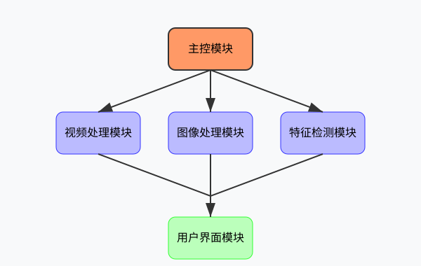
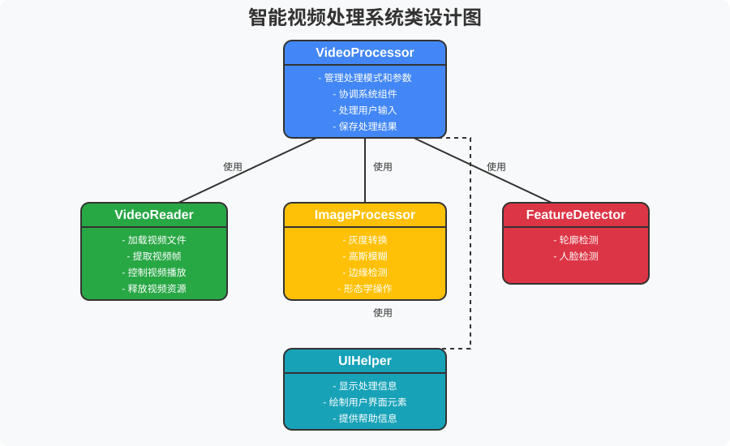
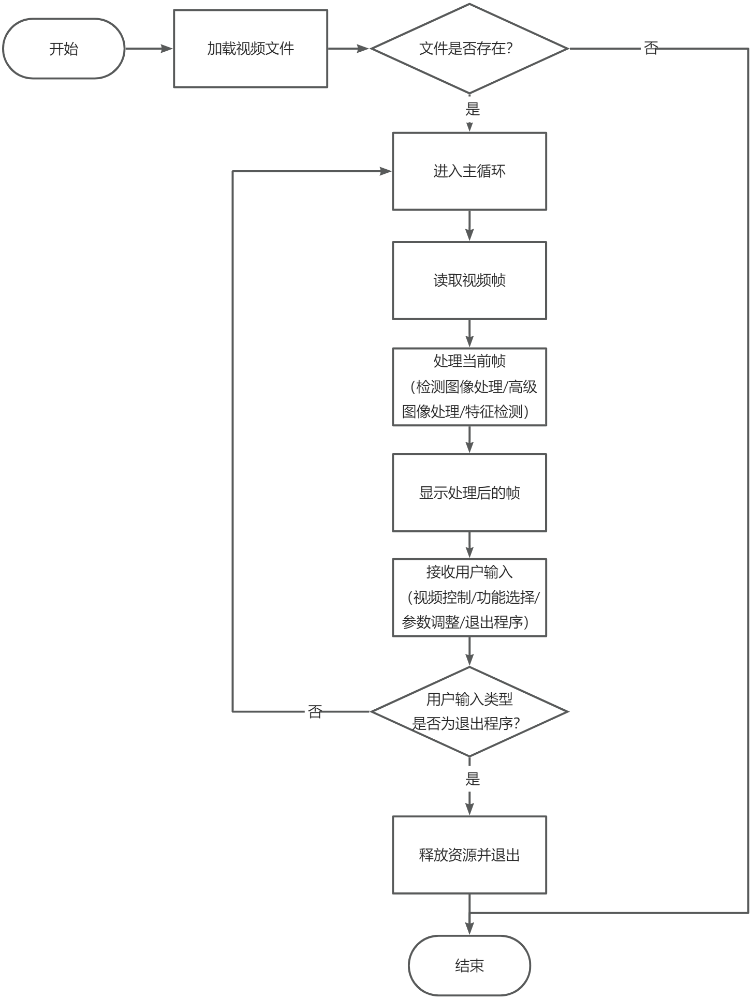
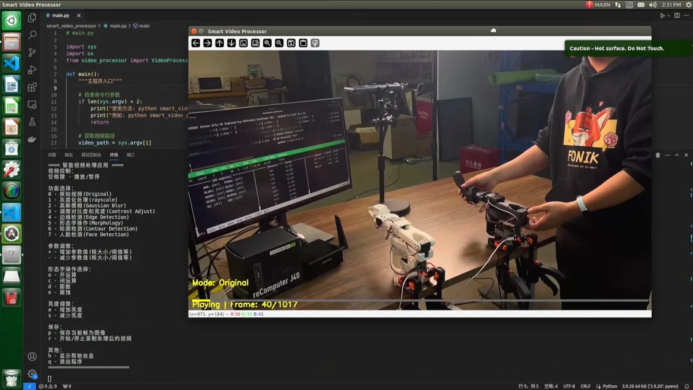
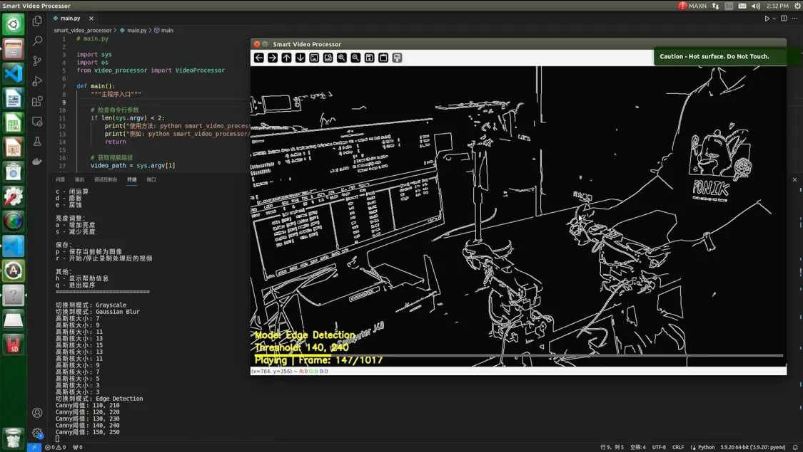

# 第14课：计算机视觉实践项目

在本课中，我们将综合运用前几节课所学的 OpenCV 知识，通过完成一个小型项目来巩固计算机视觉编程能力。本次实践将涵盖视频处理、图像处理、边缘检测、形态学操作、轮廓检测和人脸检测等内容。我们将开发一个"综合视频处理应用"，该应用能够对视频执行多种处理操作，并能够检测视频中的特定特征。通过这个项目，我们将学习如何将各种计算机视觉技术集成到一个应用程序中，为今后开发更复杂的应用打下基础。

## 课程目标

+ 综合应用本章所学的 OpenCV 知识，完成一个功能完整的视频处理应用
+ 掌握项目开发的基本流程，包括需求分析、系统设计和代码实现
+ 熟练使用图像处理和计算机视觉技术，提高项目实践能力
+ 总结本章学习内容，为进入深度学习部分做准备

---

## 1. 项目概述

### 1.1. 项目简介

"综合视频处理应用"是一个集成了多种图像处理和分析功能的 Python 应用程序。它不仅能够应用基本的图像处理技术（如灰度转换、高斯模糊等），还能执行更高级的操作（如边缘检测、形态学处理），以及特征检测（如轮廓检测和人脸检测）。用户可以加载视频文件，对视频进行各种处理和分析，浏览处理结果并保存处理后的视频。

### 1.2. 开发目标

本项目的主要开发目标包括：

1. **视频处理**：实现视频加载、处理和保存功能
2. **多功能集成**：集成多种图像处理功能，包括基础处理和高级分析功能
3. **用户友好界面**：提供简单直观的用户交互方式，便于操作和使用
4. **模块化设计**：采用模块化设计，使代码结构清晰、易于扩展和维护

### 1.3. 核心需求

| **核心需求** | **内容** |
| --- | --- |
| 1. 视频处理 | + 加载和播放视频文件   + 浏览和导航视频内容   + 保存处理后的视频 |
| 2. 图像处理 | + 基础处理：灰度转换、高斯模糊、对比度调整   + 高级处理：边缘检测、形态学操作   + 支持处理参数调整 |
| 3. 特征检测 | + 轮廓检测：检测并显示视频帧中的轮廓   + 人脸检测：检测并标记视频帧中的人脸   + 显示检测结果的统计信息 |
| 4. 用户交互 | + 通过键盘快捷键切换功能和控制视频播放   + 调整处理参数和显示设置   + 在界面上显示当前模式和参数信息 |

## 2. 项目设计

### 2.1. 系统架构

为了实现上述需求，我们设计了一个模块化的系统架构，如下图所示：



> 图 14.1 系统架构图
>

系统由以下几个主要模块组成：

1. **主控模块**：协调整个应用的运行流程，管理用户输入和视频处理
2. **视频处理模块**：负责视频的加载、解码、播放和保存
3. **图像处理模块**：实现各种图像处理算法
4. **特征检测模块**：实现轮廓检测和人脸检测等功能
5. **用户界面模块**：负责界面显示和用户交互

### 2.2. 类设计



> 图 14.2 系统的类设计图
>

基于模块化设计原则，我们将系统划分为以下几个主要类：

1. **VideoProcessor 类**：作为系统的核心类，负责协调整个应用的工作流程，管理视频播放和处理。
2. **VideoReader 类**：负责视频文件的加载、解码和帧提取，提供视频播放控制功能。
3. **ImageProcessor 类**：负责实现各种图像处理算法，包括灰度转换、高斯模糊、对比度调整、边缘检测和形态学操作等。
4. **FeatureDetector 类**：负责实现特征检测功能，包括轮廓检测和人脸检测，并提供检测结果的统计信息。
5. **UIHelper 类**：负责用户界面相关的功能，包括显示处理模式、参数信息和操作指南等。

### 2.3. 功能流程

应用程序的主要功能流程如下图所示：



> 图 14.3 功能流程图
>

用户可以通过键盘快捷键控制视频播放、选择不同的处理功能和调整参数，系统会实时显示处理结果和相关信息。

### 2.4. 项目结构

项目的文件结构如下：

```plain
smart_video_processor/
│
├── main.py               # 程序入口
├── video_processor.py    # 视频处理核心类
├── video_reader.py       # 视频读取类
├── image_processor.py    # 图像处理类
├── feature_detector.py   # 特征检测类
└── ui_helper.py          # 用户界面辅助类
```

---

## 3. 基于 AI 辅助的项目开发实践

在本节中，我们将展示如何使用 AI 辅助工具高效地开发这个项目。类似于我们在第 7 课中所做的，我们将先明确整个项目的需求，然后逐步实现各个模块，展示面向对象编程在视觉项目中的应用。

### 3.1. 项目开发策略

在使用 AI 助手进行开发时，我们需要遵循以下策略：

1. **清晰的需求描述**
    + 向 AI 提供详细的功能需求
    + 说明性能和可靠性要求
    + 指明代码风格偏好
2. **迭代式开发**
    + 先获取基础实现
    + 根据反馈逐步改进
    + 及时进行代码审查
3. **质量控制**
    + 要求 AI 提供完整的文档注释
    + 确保错误处理机制
    + 验证代码的可维护性

### 3.2. 项目总体需求描述

首先，让我们向 AI 助手描述整个项目的需求：

```plain
我需要开发一个综合视频处理应用，这是一个使用OpenCV的Python程序，用于对视频进行各种处理和分析。应用的主要功能包括：

1. 视频处理功能：
   - 加载视频文件并播放
   - 提供基本的视频控制功能（播放/暂停）
   - 保存处理后的视频

2. 图像处理功能：
   - 基础处理：灰度转换、高斯模糊、对比度调整
   - 高级处理：边缘检测（Canny算法）、形态学操作（开/闭/膨胀/腐蚀）

3. 特征检测功能：
   - 轮廓检测：检测并显示视频帧中的轮廓
   - 人脸检测：使用Haar级联分类器检测并标记视频帧中的人脸

4. 用户交互功能：
   - 通过键盘快捷键控制视频播放和处理功能
   - 在界面上显示当前模式和参数信息
   - 提供参数调整功能，如调整模糊核大小、边缘检测阈值等

5. 组件关系：
    项目需要采用模块化设计，主要包括以下几个类：
    - VideoProcessor：核心类，协调整个应用的工作流程
    - VideoReader：负责视频文件的加载和播放控制
    - ImageProcessor：实现各种图像处理算法
    - FeatureDetector：实现特征检测功能
    - UIHelper：处理用户界面相关功能

6. 项目结构：
    smart_video_processor/
    │
    ├── main.py               # 程序入口
    ├── video_processor.py    # 视频处理核心类
    ├── video_reader.py       # 视频读取类
    ├── image_processor.py    # 图像处理类
    ├── feature_detector.py   # 特征检测类
    └── ui_helper.py          # 用户界面辅助类

请帮我实现这个项目，该项目的开发将分为多个阶段。我后续会逐个提出各个模块的具体需求，请你在得到我给出的具体需求之后提供相应的代码实现。
```

### 3.3. 开发 VideoReader 类

让我们从项目的基础组件开始 - VideoReader 类。这个类负责视频文件的读取和控制，是整个项目的重要基础。

#### 3.3.1. 向 AI 描述需求

向 AI 助手描述 VideoReader 类的具体需求：

```plain
我需要开发一个VideoReader类，用于处理视频文件的读取和控制。这个类需要具备以下功能：

1. 加载视频文件并获取基本信息（如帧率、总帧数、尺寸等）
2. 读取视频帧，支持逐帧读取和随机访问
3. 提供视频播放控制功能，如播放、暂停
4. 释放视频资源

请实现这个类，确保代码清晰、易于理解，并添加必要的注释。
```

#### 3.3.2. VideoReader 类实现

```python
# video_reader.py

import cv2
import numpy as np
import time

class VideoReader:
    """视频读取类，负责视频文件的加载和播放控制"""
    
    def __init__(self):
        """初始化视频读取器"""
        self.video_path = None
        self.cap = None
        self.is_opened = False
        self.is_playing = False
        
        # 视频属性
        self.total_frames = 0
        self.fps = 0
        self.frame_width = 0
        self.frame_height = 0
        self.current_frame_index = 0
    
    def open(self, video_path):
        """
        打开视频文件
        
        Args:
            video_path: 视频文件路径
            
        Returns:
            bool: 是否成功打开视频
        """
        # 释放之前可能打开的视频
        self.release()
        
        # 打开新视频
        self.video_path = video_path
        self.cap = cv2.VideoCapture(video_path)
        self.is_opened = self.cap.isOpened()
        
        if self.is_opened:
            # 获取视频属性
            self.total_frames = int(self.cap.get(cv2.CAP_PROP_FRAME_COUNT))
            self.fps = self.cap.get(cv2.CAP_PROP_FPS)
            self.frame_width = int(self.cap.get(cv2.CAP_PROP_FRAME_WIDTH))
            self.frame_height = int(self.cap.get(cv2.CAP_PROP_FRAME_HEIGHT))
            self.current_frame_index = 0
            self.is_playing = True
            
            print(f"视频已加载: {video_path}")
            print(f"帧率: {self.fps}, 总帧数: {self.total_frames}, 尺寸: {self.frame_width}x{self.frame_height}")
            return True
        else:
            print(f"无法打开视频: {video_path}")
            return False
    
    def read(self):
        """
        读取当前帧，根据播放状态控制
        
        Returns:
            tuple: (是否成功读取, 帧数据)
        """
        if not self.is_opened:
            return False, None
        
        # 检查是否正在播放
        if not self.is_playing:
            # 如果暂停，返回当前帧
            return self.read_frame_at(self.current_frame_index)
        
        # 读取当前帧并前进
        ret, frame = self.read_frame_at(self.current_frame_index)
        if ret:
            self.current_frame_index += 1
            # 检查是否到达视频末尾
            if self.current_frame_index >= self.total_frames:
                self.current_frame_index = 0  # 循环播放
        
        return ret, frame
    
    def read_frame_at(self, frame_index):
        """
        读取指定索引的帧
        
        Args:
            frame_index: 帧索引
            
        Returns:
            tuple: (是否成功读取, 帧数据)
        """
        if not self.is_opened or frame_index < 0 or frame_index >= self.total_frames:
            return False, None
        
        # 设置帧位置
        self.cap.set(cv2.CAP_PROP_POS_FRAMES, frame_index)
        ret, frame = self.cap.read()
        
        # 如果读取失败但索引有效，可能是视频编码问题，尝试关闭并重新打开
        if not ret and frame_index < self.total_frames:
            video_path = self.video_path
            self.cap.release()
            self.cap = cv2.VideoCapture(video_path)
            self.cap.set(cv2.CAP_PROP_POS_FRAMES, frame_index)
            ret, frame = self.cap.read()
        
        return ret, frame
    
    def play(self):
        """开始播放视频"""
        if not self.is_opened:
            return
        
        self.is_playing = True
        print("视频播放")
    
    def pause(self):
        """暂停视频播放"""
        if not self.is_opened:
            return
        
        self.is_playing = False
        print("视频暂停")
    
    def toggle_play_pause(self):
        """切换播放/暂停状态"""
        if self.is_playing:
            self.pause()
        else:
            self.play()
    
    def get_progress(self):
        """
        获取播放进度
        
        Returns:
            float: 播放进度 (0.0 - 1.0)
        """
        if not self.is_opened or self.total_frames == 0:
            return 0.0
        
        return self.current_frame_index / self.total_frames
    
    def get_video_info(self):
        """
        获取视频信息
        
        Returns:
            dict: 包含视频信息的字典
        """
        return {
            "path": self.video_path,
            "total_frames": self.total_frames,
            "fps": self.fps,
            "width": self.frame_width,
            "height": self.frame_height,
            "current_frame": self.current_frame_index,
            "is_playing": self.is_playing
        }
    
    def release(self):
        """释放视频资源"""
        if self.cap is not None:
            self.cap.release()
            self.cap = None
            self.is_opened = False
            self.is_playing = False
            print("视频资源已释放")
```

#### 3.3.3. 代码审查和测试

在实际应用中，我们需要对生成的代码进行审查和测试，确保它能够正常工作并满足我们的需求：

1. **功能完整性检查**：验证是否实现了所有需求功能
2. **错误处理检查**：确保针对异常情况（如文件不存在、编码问题等）有适当的处理
3. **代码结构检查**：验证类的组织是否合理、方法划分是否清晰
4. **实际测试**：使用不同类型的视频文件测试功能

测试代码示例：

```python
# 测试 VideoReader 类
reader = VideoReader()
if reader.open("sample_video.mp4"):
    # 读取前 10 帧
    for i in range(10):
        ret, frame = reader.read()
        if ret:
            print(f"读取到第 {i+1} 帧，尺寸: {frame.shape}")
    
    # 测试暂停/播放功能
    reader.pause()
    print("暂停后的帧索引:", reader.current_frame_index)
    ret, frame1 = reader.read()
    ret, frame2 = reader.read()
    # 验证暂停时帧不会前进
    print("两次读取帧相同:", np.array_equal(frame1, frame2))
    
    # 测试随机访问
    ret, frame = reader.read_frame_at(20)
    print("随机访问第 20 帧:", ret)
    
    # 释放资源
    reader.release()
```

### 3.4. 开发 ImageProcessor 类

接下来，我们开发 ImageProcessor 类，它负责实现各种图像处理算法。

#### 3.4.1. 向 AI 描述需求

向 AI 助手描述 ImageProcessor 类的具体需求：

```plain
我需要开发一个ImageProcessor类，用于实现各种图像处理功能。这个类需要具备以下功能：

1. 基础图像处理：
   - 灰度转换：将彩色图像转换为灰度图像
   - 高斯模糊：对图像应用高斯模糊滤波
   - 对比度和亮度调整：调整图像的对比度和亮度

2. 高级图像处理：
   - 边缘检测：使用Canny算法进行边缘检测
   - 形态学操作：实现开运算、闭运算、膨胀和腐蚀

请实现这个类，确保代码清晰、易于理解，并添加必要的注释。
```

#### 3.4.2. ImageProcessor 类实现

```python
# image_processor.py

import cv2
import numpy as np

class ImageProcessor:
    """图像处理类，实现各种图像处理算法"""
    
    def __init__(self):
        """初始化图像处理器"""
        pass
    
    def to_gray(self, frame):
        """
        将图像转换为灰度
        
        Args:
            frame: 输入彩色图像
            
        Returns:
            灰度图像(转换为BGR以便显示和绘制文字)
        """
        # 转换为灰度图
        gray = cv2.cvtColor(frame, cv2.COLOR_BGR2GRAY)
        
        # 转回BGR以便于显示和添加彩色文字
        return cv2.cvtColor(gray, cv2.COLOR_GRAY2BGR)
    
    def apply_blur(self, frame, kernel_size):
        """
        应用高斯模糊
        
        Args:
            frame: 输入图像
            kernel_size: 高斯核大小(必须是正奇数)
            
        Returns:
            模糊后的图像
        """
        # 确保核大小为奇数
        if kernel_size % 2 == 0:
            kernel_size += 1
            
        # 应用高斯模糊
        return cv2.GaussianBlur(frame, (kernel_size, kernel_size), 0)
    
    def adjust_contrast(self, frame, alpha, beta):
        """
        调整图像对比度和亮度
        
        Args:
            frame: 输入图像
            alpha: 对比度因子(>1增加对比度，<1降低对比度)
            beta: 亮度增益
            
        Returns:
            调整后的图像
        """
        # 使用 convertScaleAbs 调整对比度和亮度
        return cv2.convertScaleAbs(frame, alpha=alpha, beta=beta)
    
    def detect_edges(self, frame, threshold1, threshold2):
        """
        边缘检测
        
        Args:
            frame: 输入图像
            threshold1: Canny 算法的低阈值
            threshold2: Canny 算法的高阈值
            
        Returns:
            边缘图像(转换为BGR以便显示和绘制文字)
        """
        # 转换为灰度图
        gray = cv2.cvtColor(frame, cv2.COLOR_BGR2GRAY)
        
        # 应用 Canny 边缘检测算法
        edges = cv2.Canny(gray, threshold1, threshold2)
        
        # 转回BGR以便于显示和添加彩色文字
        return cv2.cvtColor(edges, cv2.COLOR_GRAY2BGR)
    
    def apply_morphology(self, frame, operation, kernel_size):
        """
        应用形态学操作
        
        Args:
            frame: 输入图像
            operation: 形态学操作类型(cv2.MORPH_*)
            kernel_size: 结构元素大小
            
        Returns:
            处理后的图像(转换为BGR以便显示和绘制文字)
        """
        # 转换为灰度图
        gray = cv2.cvtColor(frame, cv2.COLOR_BGR2GRAY)
        
        # 创建结构元素
        kernel = cv2.getStructuringElement(cv2.MORPH_RECT, (kernel_size, kernel_size))
        
        # 应用形态学操作
        if operation == cv2.MORPH_OPEN:
            # 开运算(先腐蚀后膨胀)
            result = cv2.morphologyEx(gray, cv2.MORPH_OPEN, kernel)
        elif operation == cv2.MORPH_CLOSE:
            # 闭运算(先膨胀后腐蚀)
            result = cv2.morphologyEx(gray, cv2.MORPH_CLOSE, kernel)
        elif operation == cv2.MORPH_DILATE:
            # 膨胀
            result = cv2.dilate(gray, kernel, iterations=1)
        elif operation == cv2.MORPH_ERODE:
            # 腐蚀
            result = cv2.erode(gray, kernel, iterations=1)
        else:
            # 默认使用原图
            result = gray
        
        # 转回BGR以便于显示和添加彩色文字
        return cv2.cvtColor(result, cv2.COLOR_GRAY2BGR)
```

#### 3.4.3. 代码审查与测试

与 VideoReader 类类似，我们需要对 ImageProcessor 类进行审查和测试：

1. **功能验证**：测试每种图像处理方法的效果
2. **参数边界测试**：验证对于极端参数值（如非常大的核大小）的处理
3. **性能测试**：测量处理大图像时的性能

```python
# 测试 ImageProcessor 类
import time

# 自动排列窗口显示在一行中（水平堆叠）
def show_image_in_row(title, image, index, tile_width=100, y_offset=50):
    """
    在同一行中水平排列图像窗口
    :param title: 窗口标题
    :param image: 要显示的图像
    :param index: 当前是第几张图（从0开始）
    :param tile_width: 每个窗口的水平间距
    :param y_offset: 窗口显示的Y坐标（行的起始位置）
    """
    cv2.imshow(title, image)
    x = index * tile_width
    cv2.moveWindow(title, x, y_offset)

# 实例化图像处理器
processor = ImageProcessor()
img = cv2.imread("test_image.jpg")

# 窗口索引（控制水平方向的排列）
win_idx = 0

# 显示原图 & 灰度图
gray = processor.to_gray(img)
show_image_in_row("Original Image", img, win_idx); win_idx += 1
show_image_in_row("Grayscale Image", gray, win_idx); win_idx += 1

# 显示不同核大小的模糊图
for kernel_size in [3, 7, 15]:
    start_time = time.time()
    blurred = processor.apply_blur(img, kernel_size)
    end_time = time.time()
    print(f"核大小 {kernel_size} 的处理时间: {end_time - start_time:.4f}秒")
    show_image_in_row(f"Blurred (Kernel={kernel_size})", blurred, win_idx)
    win_idx += 1

# 边缘检测图
edges = processor.detect_edges(img, 100, 200)
show_image_in_row("Edge Detection", edges, win_idx); win_idx += 1

# 形态学操作图
morph_ops = [
    (cv2.MORPH_OPEN, "Opening"),
    (cv2.MORPH_CLOSE, "Closing"),
    (cv2.MORPH_DILATE, "Dilation"),
    (cv2.MORPH_ERODE, "Erosion"),
]

for op, name in morph_ops:
    result = processor.apply_morphology(img, op, 5)
    show_image_in_row(name, result, win_idx)
    win_idx += 1

cv2.waitKey(0)
cv2.destroyAllWindows()
```

### 3.5. 开发 FeatureDetector 类

现在，我们开发 FeatureDetector 类，它负责实现特征检测功能。

#### 3.5.1. 向 AI 描述需求

向 AI 助手描述 FeatureDetector 类的具体需求：

```plain
我需要开发一个FeatureDetector类，用于实现特征检测功能。这个类需要具备以下功能：

1. 轮廓检测：
   - 检测图像中的轮廓
   - 绘制检测到的轮廓
   - 分析轮廓特征，如面积、周长等
   - 识别基本形状（可选）

2. 人脸检测：
   - 使用Haar级联分类器检测人脸
   - 在图像上标记检测到的人脸
   - 提供人脸检测的统计信息

请实现这个类，确保代码清晰、易于理解，并添加必要的注释。
```

#### 3.5.2. FeatureDetector 类实现

```python
# feature_detector.py

import cv2
import numpy as np

class FeatureDetector:
    """特征检测类，实现轮廓检测和人脸检测等功能"""
    
    def __init__(self):
        """初始化特征检测器"""
        self.face_cascade = None
    
    def initialize(self):
        """初始化特征检测器，加载必要的模型"""
        # 加载人脸检测的 Haar 级联分类器
        self.face_cascade = cv2.CascadeClassifier(cv2.data.haarcascades + 'haarcascade_frontalface_default.xml')
        if self.face_cascade.empty():
            print("警告：无法加载人脸检测模型")
            return False
        return True
    
    def detect_contours(self, frame):
        """
        轮廓检测
        
        Args:
            frame: 输入图像
            
        Returns:
            标记轮廓后的图像
        """
        # 创建结果图像的副本
        result = frame.copy()
        
        # 转换为灰度图像
        gray = cv2.cvtColor(frame, cv2.COLOR_BGR2GRAY)
        
        # 阈值处理
        ret, binary = cv2.threshold(gray, 127, 255, cv2.THRESH_BINARY)
        
        # 查找轮廓
        contours, hierarchy = cv2.findContours(
            binary, cv2.RETR_TREE, cv2.CHAIN_APPROX_SIMPLE)
        
        # 绘制轮廓
        cv2.drawContours(result, contours, -1, (0, 255, 0), 2)
        
        # 计算轮廓信息
        if len(contours) > 0:
            # 绘制轮廓数量
            cv2.putText(result, f"轮廓数量: {len(contours)}", 
                       (10, 30), cv2.FONT_HERSHEY_SIMPLEX, 0.7, (0, 0, 255), 2)
            
            # 分析最大轮廓
            max_contour = max(contours, key=cv2.contourArea)
            area = cv2.contourArea(max_contour)
            perimeter = cv2.arcLength(max_contour, True)
            
            # 显示轮廓信息
            cv2.putText(result, f"最大轮廓: 面积={area:.1f}, 周长={perimeter:.1f}", 
                       (10, 60), cv2.FONT_HERSHEY_SIMPLEX, 0.7, (0, 0, 255), 2)
            
            # 基本形状识别
            self._recognize_shape(result, max_contour)
        
        return result
    
    def _recognize_shape(self, image, contour):
        """
        识别轮廓的基本形状并标注
        
        Args:
            image: 要标注的图像
            contour: 要识别的轮廓
        """
        # 轮廓近似，使用周长的2%作为精度
        epsilon = 0.02 * cv2.arcLength(contour, True)
        approx = cv2.approxPolyDP(contour, epsilon, True)
        
        # 获取轮廓的极值点
        x, y, w, h = cv2.boundingRect(contour)
        
        # 根据顶点数量识别形状
        shape = "未知形状"
        if len(approx) == 3:
            shape = "三角形"
        elif len(approx) == 4:
            # 计算长宽比，判断是矩形还是正方形
            aspect_ratio = float(w) / h
            shape = "正方形" if 0.95 <= aspect_ratio <= 1.05 else "矩形"
        elif len(approx) == 5:
            shape = "五边形"
        elif len(approx) == 6:
            shape = "六边形"
        elif len(approx) > 10:
            # 计算圆形度
            area = cv2.contourArea(contour)
            perimeter = cv2.arcLength(contour, True)
            circularity = 4 * np.pi * area / (perimeter * perimeter)
            if circularity > 0.8:
                shape = "圆形"
        
        # 标注形状
        cv2.putText(image, shape, (x, y - 10), 
                   cv2.FONT_HERSHEY_SIMPLEX, 0.5, (255, 0, 0), 2)
    
    def detect_faces(self, frame):
        """
        人脸检测
        
        Args:
            frame: 输入图像
            
        Returns:
            标记人脸后的图像
        """
        # 创建结果图像的副本
        result = frame.copy()
        
        # 检查人脸检测模型是否已加载
        if self.face_cascade is None or self.face_cascade.empty():
            cv2.putText(result, "错误: 人脸检测模型未加载", 
                       (10, 30), cv2.FONT_HERSHEY_SIMPLEX, 0.7, (0, 0, 255), 2)
            return result
        
        # 转换为灰度图
        gray = cv2.cvtColor(frame, cv2.COLOR_BGR2GRAY)
        
        # 检测人脸
        faces = self.face_cascade.detectMultiScale(
            gray,
            scaleFactor=1.1,
            minNeighbors=5,
            minSize=(30, 30)
        )
        
        # 绘制人脸矩形框
        for (x, y, w, h) in faces:
            cv2.rectangle(result, (x, y), (x+w, y+h), (255, 0, 0), 2)
        
        # 显示人脸数量
        cv2.putText(result, f"检测到 {len(faces)} 个人脸", 
                   (10, 30), cv2.FONT_HERSHEY_SIMPLEX, 0.7, (0, 0, 255), 2)
        
        return result
```

#### 3.5.3. 代码审查与测试

我们需要对 FeatureDetector 类进行测试，特别是人脸检测功能：

1. **模型加载测试**：验证人脸检测模型是否成功加载
2. **轮廓检测测试**：使用不同形状的图像测试轮廓检测
3. **人脸检测测试**：使用含有不同数量、大小和角度的人脸的图像测试人脸检测

```python
# 测试 FeatureDetector 类
import cv2

detector = FeatureDetector()
if not detector.initialize():
    print("无法初始化特征检测器")
    exit()

# 测试轮廓检测
shapes_img = cv2.imread("shapes.jpg")
if shapes_img is not None:
    contour_result = detector.detect_contours(shapes_img)
    cv2.imshow("Contour Detection", contour_result)

# 测试人脸检测
face_img = cv2.imread("faces.jpg")
if face_img is not None:
    face_result = detector.detect_faces(face_img)
    cv2.imshow("Face Detection", face_result)

cv2.waitKey(0)
cv2.destroyAllWindows()
```

### 3.6. 开发 UIHelper 类

接下来，我们开发 UIHelper 类，它负责处理用户界面相关功能。

#### 3.6.1. 向 AI 描述需求

向 AI 助手描述 UIHelper 类的具体需求：

```plain
我需要开发一个UIHelper类，用于处理用户界面相关功能。这个类需要具备以下功能：

1. 在视频帧上显示信息：
   - 显示当前处理模式和参数信息
   - 显示视频播放控制信息（如播放/暂停状态、当前帧/总帧数）
   - 显示处理结果的统计信息

2. 显示帮助信息：
   - 显示可用的键盘快捷键和功能说明
   - 显示操作指南

请实现这个类，确保代码清晰、易于理解，并添加必要的注释。
```

#### 3.6.2. UIHelper 类实现

```python
# ui_helper.py

import cv2
import numpy as np

class UIHelper:
    """用户界面辅助类，负责界面信息显示和交互"""
    
    def __init__(self):
        """初始化UI辅助器"""
        # 形态学操作名称映射
        self.morph_op_names = {
            cv2.MORPH_OPEN: "开运算",
            cv2.MORPH_CLOSE: "闭运算",
            cv2.MORPH_DILATE: "膨胀",
            cv2.MORPH_ERODE: "腐蚀"
        }
    
    def draw_info(self, frame, mode, mode_name, parameters, video_info=None):
        """
        在视频帧上绘制信息
        
        Args:
            frame: 要绘制信息的帧
            mode: 当前模式编号
            mode_name: 当前模式名称
            parameters: 参数字典
            video_info: 视频信息字典（可选）
        """
        # 添加模式信息
        cv2.putText(frame, f"模式: {mode_name}", 
                   (10, frame.shape[0] - 70), 
                   cv2.FONT_HERSHEY_SIMPLEX, 0.7, (0, 255, 255), 2)
        
        # 根据模式添加特定参数信息
        if mode == 2:  # 高斯模糊
            kernel_size = parameters['blur_kernel_size']
            cv2.putText(frame, f"核大小: {kernel_size}x{kernel_size}", 
                       (10, frame.shape[0] - 40), 
                       cv2.FONT_HERSHEY_SIMPLEX, 0.7, (0, 255, 255), 2)
                       
        elif mode == 3:  # 对比度调整
            alpha = parameters['contrast_alpha']
            beta = parameters['contrast_beta']
            cv2.putText(frame, f"对比度: {alpha:.1f}, 亮度: {beta}", 
                       (10, frame.shape[0] - 40), 
                       cv2.FONT_HERSHEY_SIMPLEX, 0.7, (0, 255, 255), 2)
                       
        elif mode == 4:  # 边缘检测
            threshold1 = parameters['canny_threshold1']
            threshold2 = parameters['canny_threshold2']
            cv2.putText(frame, f"阈值: {threshold1}, {threshold2}", 
                       (10, frame.shape[0] - 40), 
                       cv2.FONT_HERSHEY_SIMPLEX, 0.7, (0, 255, 255), 2)
                       
        elif mode == 5:  # 形态学操作
            operation = parameters['morph_operation']
            kernel_size = parameters['morph_kernel_size']
            op_name = self.morph_op_names.get(operation, "未知")
            cv2.putText(frame, f"操作: {op_name}, 核大小: {kernel_size}x{kernel_size}", 
                       (10, frame.shape[0] - 40), 
                       cv2.FONT_HERSHEY_SIMPLEX, 0.7, (0, 255, 255), 2)
        
        # 如果提供了视频信息，显示播放状态
        if video_info:
            current_frame = video_info.get("current_frame", 0) + 1
            total_frames = video_info.get("total_frames", 0)
            is_playing = video_info.get("is_playing", False)
            
            # 显示视频信息
            status = "播放中" if is_playing else "暂停"
            cv2.putText(frame, f"{status} | 帧: {current_frame}/{total_frames}", 
                       (10, frame.shape[0] - 10), 
                       cv2.FONT_HERSHEY_SIMPLEX, 0.7, (0, 255, 255), 2)
            
            # 绘制进度条
            if total_frames > 0:
                progress = current_frame / total_frames
                bar_width = frame.shape[1] - 20
                bar_height = 5
                bar_x = 10
                bar_y = frame.shape[0] - 30
                
                # 绘制背景
                cv2.rectangle(frame, (bar_x, bar_y), (bar_x + bar_width, bar_y + bar_height), (100, 100, 100), -1)
                
                # 绘制进度
                progress_width = int(bar_width * progress)
                cv2.rectangle(frame, (bar_x, bar_y), (bar_x + progress_width, bar_y + bar_height), (0, 255, 255), -1)
    
    def display_help(self):
        """显示帮助信息"""
        help_text = """
==== 综合视频处理应用 ====
视频控制：
空格键 - 播放/暂停

功能选择：
0 - 原始视频
1 - 灰度化处理
2 - 高斯模糊
3 - 调整对比度和亮度
4 - 边缘检测
5 - 形态学操作
6 - 轮廓检测
7 - 人脸检测

参数调整：
+ - 增加参数值(核大小/阈值等)
- - 减少参数值(核大小/阈值等)

形态学操作选择：
o - 开运算
c - 闭运算
d - 膨胀
e - 腐蚀

亮度调整：
a - 增加亮度
s - 减少亮度

保存：
p - 保存当前帧为图像
r - 开始/停止录制处理后的视频

其他：
h - 显示帮助信息
q - 退出程序
============================
"""
        print(help_text)
```

#### 3.6.3. 代码审查与测试

用户界面是应用程序与用户交互的桥梁，因此确保 UIHelper 类能够正常工作对于整个应用的用户体验至关重要。特别是对于 OpenCV 中的文本显示和用户界面元素，我们需要注意以下几点：

1. **界面布局适应性**：界面元素应根据不同分辨率的视频自动调整位置
2. **信息可读性**：确保文本颜色和背景有足够对比度，便于阅读
3. **性能影响**：绘制界面元素不应对程序性能产生显著影响

以下是针对 UIHelper 类的测试代码：

```python
# 测试 UIHelper 类
def test_ui_helper():
    # 创建 UIHelper 实例
    ui_helper = UIHelper()
    
    # 创建测试帧
    frame_sizes = [(640, 480), (1280, 720), (320, 240)]  # 测试不同分辨率
    
    # 创建模拟参数和视频信息
    parameters = {
        'blur_kernel_size': 5,
        'contrast_alpha': 1.5,
        'contrast_beta': 10,
        'canny_threshold1': 100,
        'canny_threshold2': 200,
        'morph_operation': cv2.MORPH_OPEN,
        'morph_kernel_size': 7
    }
    
    video_info = {
        "current_frame": 99,
        "total_frames": 1000,
        "is_playing": True
    }
    
    # 测试各种模式和分辨率组合
    for size in frame_sizes:
        for mode in range(8):  # 测试所有处理模式
            print(f"测试分辨率 {size}，模式 {mode}")
            # 创建黑色测试帧
            test_frame = np.zeros((size[1], size[0], 3), dtype=np.uint8)
            
            # 绘制一些内容以便更好地观察
            cv2.rectangle(test_frame, (50, 50), (size[0]-50, size[1]-50), (0, 0, 255), 2)
            
            # 测试 draw_info 方法
            mode_name = f"Mode-{mode}"
            ui_helper.draw_info(test_frame, mode, mode_name, parameters, video_info)
            
            # 显示结果
            cv2.imshow(f"UI Test - Resolution {size}, Mode {mode}", test_frame)
            key = cv2.waitKey(0)
            cv2.destroyAllWindows()
            
            # 按q键退出整个测试
            if key == ord('q'):
                return
    
    # 测试帮助信息显示
    ui_helper.display_help()
    print("UIHelper 类测试完成")

# 运行测试
if __name__ == "__main__":
    test_ui_helper()
```

### 3.7. 开发 VideoProcessor 类

现在，我们可以开发 VideoProcessor 类，它是整个应用的核心，协调其他组件的工作。

#### 3.7.1. 向 AI 描述需求

向 AI 助手描述 VideoProcessor 类的具体需求：

```plain
我需要开发一个VideoProcessor类，作为综合视频处理应用的核心类。这个类需要具备以下功能：

1. 协调整个应用的工作流程：
   - 管理VideoReader、ImageProcessor、FeatureDetector和UIHelper各个组件
   - 处理视频的加载、播放和保存

2. 实现处理模式管理：
   - 支持多种处理模式（原始、灰度、模糊、对比度调整、边缘检测、形态学、轮廓检测、人脸检测）
   - 管理各种处理参数

3. 用户交互处理：
   - 处理键盘输入，实现功能切换和参数调整
   - 控制视频播放（播放/暂停/前进/后退）

4. 视频保存功能：
   - 保存当前帧为图像
   - 录制处理后的视频

请实现这个类，确保代码清晰、易于理解，并添加必要的注释。
```

#### 3.7.2. VideoProcessor 类实现

```python
# video_processor.py

import cv2
import numpy as np
import os
import time
from video_reader import VideoReader
from image_processor import ImageProcessor
from feature_detector import FeatureDetector
from ui_helper import UIHelper

class VideoProcessor:
    """视频处理核心类，负责协调视频处理和用户交互"""
    
    # 处理模式常量
    MODE_ORIGINAL = 0      # 原始视频
    MODE_GRAYSCALE = 1     # 灰度图像
    MODE_BLUR = 2          # 高斯模糊
    MODE_CONTRAST = 3      # 对比度调整
    MODE_EDGE = 4          # 边缘检测
    MODE_MORPHOLOGY = 5    # 形态学操作
    MODE_CONTOUR = 6       # 轮廓检测
    MODE_FACE = 7          # 人脸检测
    
    def __init__(self):
        """初始化视频处理器"""
        self.current_mode = self.MODE_ORIGINAL  # 当前处理模式
        
        # 初始化各组件
        self.video_reader = VideoReader()
        self.image_processor = ImageProcessor()
        self.feature_detector = FeatureDetector()
        self.ui_helper = UIHelper()
        
        # 视频录制
        self.video_writer = None
        self.is_recording = False
        
        # 参数设置
        self.parameters = {
            'blur_kernel_size': 5,       # 高斯模糊核大小
            'contrast_alpha': 1.0,       # 对比度因子
            'contrast_beta': 0,          # 亮度增益
            'canny_threshold1': 100,     # Canny 低阈值
            'canny_threshold2': 200,     # Canny 高阈值
            'morph_operation': cv2.MORPH_OPEN,  # 形态学操作类型
            'morph_kernel_size': 5,      # 形态学操作核大小
        }
        
        # 模式名称映射
        self.mode_names = {
            self.MODE_ORIGINAL: "原始视频",
            self.MODE_GRAYSCALE: "灰度图像",
            self.MODE_BLUR: "高斯模糊",
            self.MODE_CONTRAST: "对比度调整",
            self.MODE_EDGE: "边缘检测",
            self.MODE_MORPHOLOGY: "形态学操作",
            self.MODE_CONTOUR: "轮廓检测",
            self.MODE_FACE: "人脸检测"
        }
    
    def initialize(self, video_path):
        """
        初始化处理器并加载视频
        
        Args:
            video_path: 视频文件路径
            
        Returns:
            bool: 是否成功初始化
        """
        # 加载视频
        if not self.video_reader.open(video_path):
            return False
        
        # 初始化特征检测器
        if not self.feature_detector.initialize():
            print("警告: 无法初始化特征检测器")
        
        print("系统初始化完成")
        return True
    
    def process_frame(self, frame):
        """
        根据当前模式处理视频帧
        
        Args:
            frame: 输入视频帧
            
        Returns:
            处理后的视频帧
        """
        if frame is None:
            return None
            
        # 创建原始帧的副本
        processed_frame = frame.copy()
        
        # 根据模式处理帧
        if self.current_mode == self.MODE_GRAYSCALE:
            processed_frame = self.image_processor.to_gray(frame)
            
        elif self.current_mode == self.MODE_BLUR:
            kernel_size = self.parameters['blur_kernel_size']
            processed_frame = self.image_processor.apply_blur(frame, kernel_size)
            
        elif self.current_mode == self.MODE_CONTRAST:
            alpha = self.parameters['contrast_alpha']
            beta = self.parameters['contrast_beta']
            processed_frame = self.image_processor.adjust_contrast(frame, alpha, beta)
            
        elif self.current_mode == self.MODE_EDGE:
            threshold1 = self.parameters['canny_threshold1']
            threshold2 = self.parameters['canny_threshold2']
            processed_frame = self.image_processor.detect_edges(frame, threshold1, threshold2)
            
        elif self.current_mode == self.MODE_MORPHOLOGY:
            operation = self.parameters['morph_operation']
            kernel_size = self.parameters['morph_kernel_size']
            processed_frame = self.image_processor.apply_morphology(frame, operation, kernel_size)
            
        elif self.current_mode == self.MODE_CONTOUR:
            processed_frame = self.feature_detector.detect_contours(frame)
            
        elif self.current_mode == self.MODE_FACE:
            processed_frame = self.feature_detector.detect_faces(frame)
        
        # 添加界面信息
        self.ui_helper.draw_info(processed_frame, self.current_mode, 
                               self.mode_names[self.current_mode], 
                               self.parameters, 
                               self.video_reader.get_video_info())
        
        return processed_frame
    
    def handle_input(self, key):
        """
        处理用户输入
        
        Args:
            key: 按键代码
            
        Returns:
            bool: 是否继续运行程序
        """
        # 模式切换
        if key >= ord('0') and key <= ord('7'):
            self.current_mode = key - ord('0')
            print(f"切换到模式: {self.mode_names[self.current_mode]}")
            return True
        
        # 视频控制（播放/暂停）
        elif key == ord(' '):  # 空格键
            self.video_reader.toggle_play_pause()
            return True
        
        # 参数调整
        elif key == ord('+'):
            self._increase_parameter()
            return True
        elif key == ord('-'):
            self._decrease_parameter()
            return True
        
        # 形态学操作切换
        elif key == ord('o') and self.current_mode == self.MODE_MORPHOLOGY:
            self.parameters['morph_operation'] = cv2.MORPH_OPEN
            print("形态学操作: 开运算")
            return True
        elif key == ord('c') and self.current_mode == self.MODE_MORPHOLOGY:
            self.parameters['morph_operation'] = cv2.MORPH_CLOSE
            print("形态学操作: 闭运算")
            return True
        elif key == ord('d') and self.current_mode == self.MODE_MORPHOLOGY:
            self.parameters['morph_operation'] = cv2.MORPH_DILATE
            print("形态学操作: 膨胀")
            return True
        elif key == ord('e') and self.current_mode == self.MODE_MORPHOLOGY:
            self.parameters['morph_operation'] = cv2.MORPH_ERODE
            print("形态学操作: 腐蚀")
            return True
        
        # 亮度调整
        elif key == ord('a') and self.current_mode == self.MODE_CONTRAST:
            self.parameters['contrast_beta'] = min(self.parameters['contrast_beta'] + 10, 100)
            print(f"亮度: {self.parameters['contrast_beta']}")
            return True
        elif key == ord('s') and self.current_mode == self.MODE_CONTRAST:
            self.parameters['contrast_beta'] = max(self.parameters['contrast_beta'] - 10, -100)
            print(f"亮度: {self.parameters['contrast_beta']}")
            return True
        
        # 保存功能
        elif key == ord('p'):
            self._save_current_frame()
            return True
        elif key == ord('r'):
            self._toggle_recording()
            return True
        
        # 帮助信息
        elif key == ord('h'):
            self.ui_helper.display_help()
            return True
        
        # 退出程序
        elif key == ord('q'):
            return False
        
        return True
    
    def _increase_parameter(self):
        """增加当前模式相关参数"""
        if self.current_mode == self.MODE_BLUR:
            # 高斯模糊核大小(必须是奇数)
            self.parameters['blur_kernel_size'] = min(self.parameters['blur_kernel_size'] + 2, 25)
            self.parameters['blur_kernel_size'] = self.parameters['blur_kernel_size'] if self.parameters['blur_kernel_size'] % 2 == 1 else self.parameters['blur_kernel_size'] + 1
            print(f"高斯核大小: {self.parameters['blur_kernel_size']}")
            
        elif self.current_mode == self.MODE_CONTRAST:
            # 对比度增加
            self.parameters['contrast_alpha'] = min(self.parameters['contrast_alpha'] + 0.1, 3.0)
            print(f"对比度: {self.parameters['contrast_alpha']:.1f}")
            
        elif self.current_mode == self.MODE_EDGE:
            # Canny 阈值增加
            self.parameters['canny_threshold1'] = min(self.parameters['canny_threshold1'] + 10, 200)
            self.parameters['canny_threshold2'] = min(self.parameters['canny_threshold2'] + 10, 300)
            print(f"Canny 阈值: {self.parameters['canny_threshold1']}, {self.parameters['canny_threshold2']}")
            
        elif self.current_mode == self.MODE_MORPHOLOGY:
            # 形态学核大小
            self.parameters['morph_kernel_size'] = min(self.parameters['morph_kernel_size'] + 2, 25)
            print(f"形态学核大小: {self.parameters['morph_kernel_size']}")
    
    def _decrease_parameter(self):
        """减少当前模式相关参数"""
        if self.current_mode == self.MODE_BLUR:
            # 高斯模糊核大小(必须是奇数且至少为3)
            self.parameters['blur_kernel_size'] = max(self.parameters['blur_kernel_size'] - 2, 3)
            print(f"高斯核大小: {self.parameters['blur_kernel_size']}")
            
        elif self.current_mode == self.MODE_CONTRAST:
            # 对比度减少
            self.parameters['contrast_alpha'] = max(self.parameters['contrast_alpha'] - 0.1, 0.1)
            print(f"对比度: {self.parameters['contrast_alpha']:.1f}")
            
        elif self.current_mode == self.MODE_EDGE:
            # Canny 阈值减少
            self.parameters['canny_threshold1'] = max(self.parameters['canny_threshold1'] - 10, 10)
            self.parameters['canny_threshold2'] = max(self.parameters['canny_threshold2'] - 10, 20)
            print(f"Canny 阈值: {self.parameters['canny_threshold1']}, {self.parameters['canny_threshold2']}")
            
        elif self.current_mode == self.MODE_MORPHOLOGY:
            # 形态学核大小
            self.parameters['morph_kernel_size'] = max(self.parameters['morph_kernel_size'] - 2, 3)
            print(f"形态学核大小: {self.parameters['morph_kernel_size']}")
    
    def _save_current_frame(self):
        """保存当前帧为图像"""
        # 获取当前时间作为文件名
        timestamp = time.strftime("%Y%m%d_%H%M%S")
        filename = f"frame_{timestamp}.jpg"
        
        # 确保目录存在
        if not os.path.exists("output"):
            os.makedirs("output")
        
        # 获取当前帧
        ret, frame = self.video_reader.read_frame_at(self.video_reader.current_frame_index)
        if ret:
            # 处理帧
            processed_frame = self.process_frame(frame)
            
            # 保存图像
            filepath = os.path.join("output", filename)
            cv2.imwrite(filepath, processed_frame)
            print(f"已保存当前帧到: {filepath}")
    
    def _toggle_recording(self):
        """切换录制状态"""
        if self.is_recording:
            # 停止录制
            if self.video_writer is not None:
                self.video_writer.release()
                self.video_writer = None
            self.is_recording = False
            print("录制已停止")
        else:
            # 开始录制
            # 确保目录存在
            if not os.path.exists("output"):
                os.makedirs("output")
            
            # 获取当前时间作为文件名
            timestamp = time.strftime("%Y%m%d_%H%M%S")
            filename = f"recording_{timestamp}.mp4"
            filepath = os.path.join("output", filename)
            
            # 获取视频信息
            fps = self.video_reader.fps
            width = self.video_reader.frame_width
            height = self.video_reader.frame_height
            
            # 创建视频写入器
            fourcc = cv2.VideoWriter_fourcc(*'mp4v')
            self.video_writer = cv2.VideoWriter(filepath, fourcc, fps, (width, height))
            
            self.is_recording = True
            print(f"开始录制到: {filepath}")
    
    def run(self, video_path):
        """
        运行视频处理主循环
        
        Args:
            video_path: 视频文件路径
        """
        if not self.initialize(video_path):
            return
        
        # 显示帮助信息
        self.ui_helper.display_help()
        
        while True:
            # 读取视频帧
            ret, frame = self.video_reader.read()
            if not ret:
                print("视频播放结束或无法读取视频帧")
                break
            
            # 处理帧
            processed_frame = self.process_frame(frame)
            
            # 录制视频
            if self.is_recording and self.video_writer is not None:
                self.video_writer.write(processed_frame)
            
            # 显示处理后的帧
            cv2.imshow('综合视频处理器', processed_frame)
            
            # 处理键盘输入
            key = cv2.waitKey(1) & 0xFF
            if not self.handle_input(key):
                break
        
        # 释放资源
        self.video_reader.release()
        if self.video_writer is not None:
            self.video_writer.release()
        cv2.destroyAllWindows()
        print("程序已退出")
```

### 3.8. 开发主程序

最后，我们开发主程序，作为应用的入口点。

#### 3.8.1. 向 AI 描述需求

向 AI 助手描述主程序的具体需求：

```plain
我需要开发一个main.py文件，作为综合视频处理应用的入口点。这个程序需要：

1. 解析命令行参数，获取视频文件路径
2. 创建VideoProcessor对象并启动应用
3. 处理可能的异常情况，如视频文件不存在等

请实现这个程序，确保代码清晰、易于理解，并添加必要的注释。
```

#### 3.8.2. 主程序实现

```python
# main.py

import sys
import os
from video_processor import VideoProcessor

def main():
    """主程序入口"""
    
    # 检查命令行参数
    if len(sys.argv) < 2:
        print("使用方法: python smart_video_processor/main.py <视频文件路径>")
        print("例如: python smart_video_processor/main.py ../samples/video.mp4")
        return
    
    # 获取视频路径
    video_path = sys.argv[1]
    
    # 检查文件是否存在
    if not os.path.exists(video_path):
        print(f"错误: 视频文件不存在: {video_path}")
        return
    
    # 检查文件扩展名
    _, ext = os.path.splitext(video_path)
    valid_extensions = ['.mp4', '.avi', '.mov', '.mkv', '.wmv']
    if ext.lower() not in valid_extensions:
        print(f"警告: 文件扩展名 {ext} 可能不是受支持的视频格式")
        print(f"支持的格式: {', '.join(valid_extensions)}")
    
    try:
        # 创建视频处理器
        processor = VideoProcessor()
        
        # 运行主循环
        processor.run(video_path)
    except Exception as e:
        print(f"程序运行时出错: {e}")
        import traceback
        traceback.print_exc()

if __name__ == "__main__":
    main()
```

## 4. 项目演示

通过前面的开发，我们已经完成了"综合视频处理应用"的全部功能实现。现在让我们来运行并演示这个应用，看看它是如何工作的。

### 4.1. 运行项目

使用以下命令运行应用程序：

```bash
python <main.py的路径> <视频文件路径>
```

例如：

```plain
python smart_video_processor/main.py test_video.mp4
```

### 4.2. 功能演示

当应用程序启动后，你会看到一个窗口显示视频内容，以及控制台中的帮助信息。以下是一些主要功能的演示：

1. **基础视频控制**
    + 使用空格键可以暂停/播放视频
    + 界面底部会显示当前播放状态和进度条
2. **切换处理模式**
    + 按下数字键 0-7 可以切换不同的处理模式
    + 例如，按下 "1" 键切换到灰度处理模式（如图 14.4 所示）
    + 按下 "4" 键切换到边缘检测模式（如图 14.5 所示）

    

    > 图 14.4 灰度处理模式
    >

    

    > 图 14.5 边缘检测模式
    >

3. **调整处理参数**
    + 使用 "+" 和 "-" 键可以调整当前模式的参数
    + 例如，在高斯模糊模式下，可以调整核大小
    + 在边缘检测模式下，可以调整阈值
4. **特征检测**
    + 按下 "6" 键可以切换到轮廓检测模式
    + 按下 "7" 键可以切换到人脸检测模式
    + 系统会自动检测并标记视频中的轮廓或人脸
5. **保存功能**
    + 按下 "p" 键可以保存当前帧为图像
    + 按下 "r" 键可以开始/停止录制处理后的视频

这个项目成功地将我们前面所学的 OpenCV 知识应用到了实际开发中。在项目开发过程中，我们使用了面向对象编程的思想，将系统分为多个功能模块，使得代码结构清晰、易于维护和扩展。通过 AI 辅助开发，我们提高了开发效率，但也需要自己进行代码审查和优化，确保代码的质量和性能。

## 5. 项目扩展方向

在完成基本功能后，我们可以考虑以下扩展方向，以增强应用的功能和用户体验：

1. **功能增强**：可以添加更多图像处理功能，如颜色空间转换、特殊效果滤镜、视频剪辑等，或改进现有功能的性能和精度。
2. **用户体验优化**：可以开发图形用户界面替代键盘操作，提供更直观的交互方式，如使用 PyQt 或 Tkinter 框架。
3. **项目架构优化**：将项目模块化成标准包结构，便于维护和分发。例如：

```plain
smart_video_processor/
├── __init__.py
├── main.py
├── core/
│   ├── __init__.py
│   ├── video_processor.py
│   └── ...
└── output/
```

## 6. 运行时可能遇到的问题

在使用应用程序时，可能会遇到以下常见问题：

1. **路径问题**：如果使用相对路径，可能会导致文件找不到。解决方法是使用绝对路径或确保在正确的目录下运行程序。
2. **视频编解码器问题**：某些视频格式可能需要额外的编解码器。如果遇到无法读取视频的问题，尝试将视频转换为常见格式（如 MP4）。
3. **内存占用过高**：处理高分辨率视频时可能会消耗大量内存。可以考虑降低视频分辨率或优化处理算法。
4. **人脸检测模型加载失败**：确保 OpenCV 库安装正确，包含所需的模型文件。如果无法找到 Haar 级联分类器，可以手动指定完整路径。

## 7. 总结

本课中，我们综合运用了 OpenCV 的各种知识并结合 AI 辅助工具，开发了一个功能完整的综合视频处理应用，实现了视频的基础处理、高级图像分析和特征检测。通过模块化设计，我们将系统分为视频读取、图像处理、特征检测和用户界面等组件，实现了代码的清晰组织和功能解耦。AI 辅助工具帮助我们从需求分析到代码实现提高了开发效率，但我们也注意到 AI 生成的代码可能存在不足，需要我们根据实际需求进行审查、调整和优化，人的介入和判断在整个开发过程中仍然是必不可少的。这个实践项目不仅巩固了我们对计算机视觉基础知识的理解，也为后续深入学习深度学习技术奠定了坚实基础。

## 8. 课后拓展

+ **阅读材料**
  + [OpenCV 官方文档 - VideoCapture 类](https://docs.opencv.org/4.x/d8/dfe/classcv_1_1VideoCapture.html)
  + [OpenCV 官方文档 - 图像处理模块](https://docs.opencv.org/4.x/d7/dbd/group__imgproc.html)
+ **实践练习**
    1. **实时视频流处理**

        **任务描述：**

        + 修改当前项目，使其能够处理摄像头的实时视频流而非视频文件
        + 添加帧率计算和显示功能，实时显示处理性能
        + 优化处理流程，确保应用能够流畅运行

        **提示：**

        + 将 `VideoReader` 类改为支持摄像头输入
        + 使用 `time` 模块来计算和显示帧率
        + 考虑降低处理分辨率或简化处理步骤以提高性能

    2. **基本形状分析与测量**

        **任务描述：**

        + 在当前项目基础上，添加一个形状分析模式，能够分析视频中的基本几何形状
        + 测量并显示检测到的形状的面积、周长、近似度等基本特征
        + 支持识别和标记基本形状（圆形、三角形、矩形、正方形等）

        **提示：**

        + 利用已学的轮廓检测功能作为基础
        + 使用 `cv2.approxPolyDP()` 函数近似轮廓形状
        + 结合第 12 课学习的轮廓特征计算方法对形状进行分析
        + 计算一些基本的形状特征，如圆形度 (4π×面积/周长²)，帮助识别圆形

        </br>

    参考答案：[14-计算机视觉实践项目课后题参考答案](https://github.com/Seeed-Studio/Seeed_Studio_Courses/blob/Edge-AI-101-with-Nvidia-Jetson-Course/docs/cn/2/14/Homework_Answer.md)