# 第15课：深度学习概述与数据准备

在本课中，我们将开始探索深度学习的基本概念，了解神经网络的基本组成，以及深度学习在边缘计算中的重要性。同时，我们将学习深度学习中数据集的准备和预处理技术，这是训练高质量模型的基础。我们将通过一个简单的图像分类案例，理解数据对深度学习的重要性，并掌握基本的数据处理方法。这些知识和技能将为我们后续开发边缘AI应用打下坚实基础。

## 课程目标

+ 理解深度学习的基本概念和工作原理
+ 了解神经网络的基础结构和主要组成部分
+ 认识深度学习在边缘计算中的应用价值和挑战
+ 掌握数据集准备与预处理的关键步骤，包括数据收集、清洗和增强

---

## 1. 深度学习基础概念

### 1.1. 从传统方法到深度学习

在之前的课程中，我们使用 OpenCV 进行图像处理时，主要依赖于人工设计的特征提取方法，例如：

+ 使用 Canny 算子检测边缘
+ 使用阈值化方法进行图像分割
+ 使用形态学操作提取特征

这些方法虽然有效，但都需要我们手动设计和调整参数。我们可以将传统计算机视觉方法理解为"基于规则"的方法 - 程序员需要明确定义算法的每个步骤。而深度学习则提供了一种全新的方法：让计算机自动学习如何从数据中提取特征。

### 1.2. 什么是深度学习？

深度学习是机器学习的一个分支，它试图模仿人类大脑的工作方式，通过大量数据的学习来掌握规律。

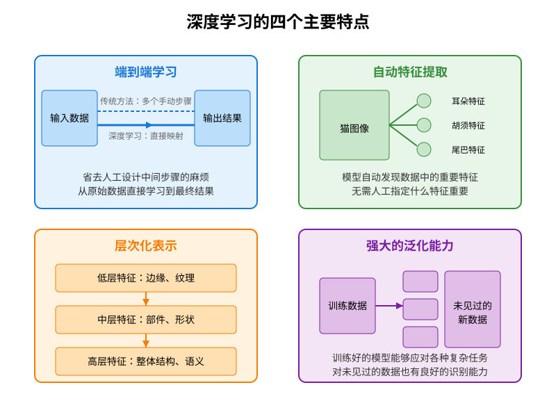

> 图 15.1 深度学习的主要特点
>

深度学习具有以下主要特点：

1. **端到端学习**：
    + 可以直接从原始数据（如图像）学习到最终结果（如物体类别）
    + 不需要人工设计中间的特征提取步骤
2. **自动特征提取**：
    + 能够自动发现数据中的重要特征
    + 不需要人工设计特征提取算法
3. **层次化表示**：
    + 通过多层结构逐步学习越来越抽象的特征
    + 低层可能学习边缘和纹理，高层可能学习物体的形状和组成
4. **强大的泛化能力**：
    + 能够处理各种复杂的任务
    + 对未见过的数据也有良好的识别能力

### 1.3. 神经网络基础

#### 1.3.1. 生物神经元与人工神经元

在了解人工神经网络之前，让我们先看看它的灵感来源 —— 生物神经元。人类大脑中有数十亿个神经元，每个神经元都通过树突接收信号，通过轴突传递信号。

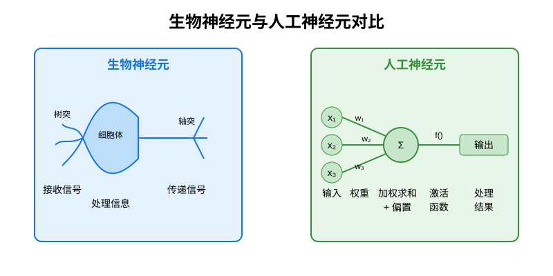

> 图 15.2 生物神经元与人工神经元的对比
>

人工神经元（也称为感知器）模仿了生物神经元的工作原理。让我们以一个具体例子来理解：假设我们要判断一张图片中是否有猫，我们可以提取三个特征：耳朵形状、胡须存在和尾巴长度。

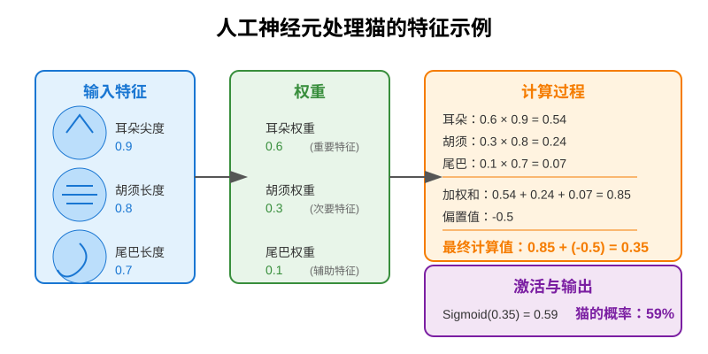

> 图 15.3 简单的神经元计算示例
>

人工神经元包含以下关键组件：

1. **输入 (x₁, x₂, ..., xₙ)**
    + 这些是我们用来做决策的特征值
    + 例如：x₁ = 0.9（尖耳朵特征值），x₂ = 0.8（胡须特征值），x₃ = 0.7（长尾巴特征值）
    + 每个输入代表从图像中提取的一个特征，值越大表示该特征越明显
2. **权重 (w₁, w₂, ..., wₙ)**
    + 权重表示每个特征对判断结果的重要性
    + 例如：w₁ = 0.6（耳朵形状很重要），w₂ = 0.3（胡须次要重要），w₃ = 0.1（尾巴长度不太重要）
    + 权重是神经网络通过学习获得的，反映了不同特征的重要程度
    + 正权重表示该特征存在会增加"是猫"的可能性
3. **偏置 (b)**
    + 偏置是一个调整项，用于控制神经元的激活阈值
    + 例如：b = -0.5（一个负偏置，要求特征的加权和必须大于0.5才会倾向于激活）
    + 可以理解为判断的基础难度或默认倾向
4. **加权求和**
    + 神经元计算：(w₁×x₁) + (w₂×x₂) + (w₃×x₃) + b
    + 在我们的例子中：(0.6×0.9) + (0.3×0.8) + (0.1×0.7) + (-0.5) = 0.54 + 0.24 + 0.07 - 0.5 = 0.35
    + 这个结果表示各个特征综合考虑后的初步判断值
5. **激活函数 (f)**
    + 激活函数将加权和转换为最终输出
    + 例如使用Sigmoid函数：f(0.35) = 1/(1+e^(-0.35)) ≈ 0.59
    + 这个结果可以解释为"图片包含猫的概率约为59%"

这样，一个简单的人工神经元就完成了从输入特征到输出结果的转换。在实际的神经网络中，会有多个神经元相互连接，共同处理更复杂的问题。

#### 1.3.2. 激活函数的作用

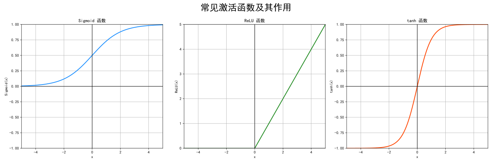

> 图 15.4 三种常见的激活函数
>

激活函数是神经网络中不可或缺的部分，它的作用可以通过以下几点来理解：

1. **引入非线性**：没有激活函数的神经网络只能表达线性关系。例如，在二维平面上只能画一条直线来区分两类数据。但现实中的问题往往更复杂，需要曲线甚至是复杂的边界来区分。 比如，判断一个人是否健康不能仅用"体重越低越健康"这种线性关系，因为过轻和过重都不健康。激活函数让神经网络能够学习这种"非线性"的关系。
2. **转换信号范围**：激活函数将神经元的输出转换到特定的范围，使其适合不同的任务需求
    + **Sigmoid 函数**：将任意值映射到 0-1 之间，适合表示概率或进行二分类。
    + **tanh 函数**：将值映射到 -1 到 1 之间，在处理既有正负影响的数据时很有用。
    + **ReLU 函数**：保留正值，将负值变为 0，简化计算并解决梯度消失问题。
3. **不同激活函数的直观理解与示例**
    + **Sigmoid 函数**：假设你在决定是否带伞。多种因素（天气预报、云量、湿度）的加权和可能是任何数值，但你最终需要的是一个 0 到 1 之间的概率——下雨的可能性有多大。Sigmoid 函数就是将这个加权和转换为概率的工具。
    + **ReLU 函数**：假设你在评估投资项目。ReLU 可以理解为"只关注正收益"的策略——如果预计收益为正，则保持不变；如果预计收益为负，则直接放弃（输出 0）。这种简单策略使计算高效，又避免了负值带来的问题。 例如，输入值为 [2, -1, 3, -2] 经过 ReLU 后变为 [2, 0, 3, 0]，只保留了正面因素。
    + **tanh 函数**：考虑一个情感分析系统，需要判断文本的情感是正面还是负面。tanh 函数的输出范围从 -1（非常负面）到 +1（非常正面），0 表示中性，这正好符合情感的表达方式。 例如，对于输入值 [2, -1, 0.5]，tanh 会输出约 [0.96, -0.76, 0.46]，保留了方向性但限制了范围。
4. **打破线性组合的局限**：如果多层神经网络没有激活函数，不管有多少层，最终效果等同于一层线性变换。这就像多次应用线性方程 y=ax+b，最终仍然得到一个形如 y=cx+d 的线性方程。 添加激活函数后，每一层都会产生非线性变换，就像引入了不同类型的数学运算（平方、开方、指数等）。例如：
    + 线性层：y = 2x + 1
    + 应用 ReLU：y = max(0, 2x + 1)
    + 再经过一个线性层：z = 3y - 2
    + 最终结果：z = 3·max(0, 2x + 1) - 2

这种组合能够表达复杂的非线性关系，是神经网络强大能力的关键所在。

#### 1.3.3. 神经元的数学表达

一个神经元的计算过程可以用数学公式表示：

$$
\text{output} = f\left(\sum_{i=1}^n w_i x_i + b\right)
$$

> 其中：
>
> + $ w_i $是权重（表示各特征的重要性）
> + $ x_i $是输入（表示特征值）
> + $ b $ 是偏置（调整激活阈值）
> + $ f $是激活函数（引入非线性变换）
>

这一过程可以理解为：神经元对各个输入信号进行加权求和，加上一个偏置值，然后通过激活函数进行非线性变换，最终输出一个信号。

让我们用 Python 代码实现一个简单的神经元，并通过识别猫的例子来理解它：

```python
import numpy as np

class Neuron:
    def __init__(self, weights, bias):
        # 初始化神经元的权重和偏置
        self.weights = weights
        self.bias = bias
    
    def sigmoid(self, x):
        """Sigmoid激活函数：将任意值映射到0-1之间"""
        return 1 / (1 + np.exp(-x))
    
    def forward(self, inputs):
        """前向计算过程"""
        # np.dot计算点积，相当于w1*x1 + w2*x2 + w3*x3 ...
        # 例如：np.dot([1,2,3], [4,5,6]) = 1*4 + 2*5 + 3*6 = 32
        weighted_sum = np.dot(self.weights, inputs) + self.bias
        
        # 通过激活函数转换结果
        return self.sigmoid(weighted_sum)

# 示例：识别猫的简单神经元
# 假设我们有三个特征：耳朵尖锐程度(0-1)，胡须长度(0-1)，尾巴长度(0-1)
cat_detector = Neuron(
    weights=np.array([0.9, 0.5, 0.1]),  # 尖耳朵更重要，其次是胡须，最后是尾巴
    bias=-0.8                           # 偏置值，调整识别阈值
)

# 测试特征
# 典型猫特征：尖耳朵(0.9)，明显胡须(0.8)，长尾巴(0.7)
cat_features = np.array([0.9, 0.8, 0.7])
cat_score = cat_detector.forward(cat_features)
print(f"猫的识别分数：{cat_score:.4f}")  # 输出约为0.6177，超过0.5表示判定为猫。值越接近1，可能性越大

# 狗特征：圆耳朵(低尖锐度0.3)，短胡须(0.4)，中等尾巴(0.6)
dog_features = np.array([0.3, 0.4, 0.6])
dog_score = cat_detector.forward(dog_features)
print(f"狗的识别分数：{dog_score:.4f}")  # 输出约为0.4329，低于0.5表示判定为不是猫
```

这个例子展示了神经元如何用数学计算来识别物体。在实际应用中，权重不是我们手动设置的，而是通过大量数据训练得到的。这个简单的神经元已经可以执行基础的分类任务，比如判断"是猫/不是猫"，但对于复杂任务，我们需要将多个神经元组合成网络。

#### 1.3.4. 神经网络结构

单个神经元的能力有限，但当我们把多个神经元按层组织起来，就形成了强大的神经网络。一个基本的神经网络包含三种类型的层：

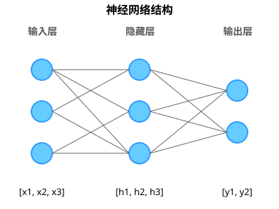

> 图 15.5 基本的神经网络结构
>

1. **输入层**
    + 负责接收原始数据，每个神经元对应一个输入特征
    + 例如：在猫狗识别任务中，输入层可能有4个神经元，分别接收：
        + 耳朵形状（尖度值）
        + 胡须长度（密度值）
        + 尾巴长度（厘米值）
        + 毛发纹理（粗糙度值）
    + 输入层不做计算，只是将数据传递给下一层
2. **隐藏层**
    + 位于输入层和输出层之间，负责特征提取和转换
    + 可以有多个隐藏层，每层包含多个神经元
    + 例如：在猫狗识别网络中，第一个隐藏层可能有6个神经元：
        + 第 1-2 个神经元学习耳朵特征（如"尖耳朵"、"圆耳朵"）
        + 第 3-4 个神经元学习面部特征（如"长胡须"、"短胡须"）
        + 第 5-6 个神经元学习体型特征（如"细长尾巴"、"短粗尾巴"）
    + 第二个隐藏层可能有 3 个神经元，组合前一层特征：
        + 第 1 个神经元可能识别"尖耳朵+长胡须"组合
        + 第 2 个神经元可能识别"圆耳朵+短胡须"组合
        + 第 3 个神经元可能识别其他特征组合
    + 隐藏层是网络的"思考中心"，层数越多，网络可以学习的模式越复杂
3. **输出层**
    + 产生网络的最终判断结果
    + 神经元数量取决于任务类型：
        + 二分类（如"是猫/不是猫"）：通常有 2 个输出神经元，输出接近 1 表示是猫，接近 0 表示不是
        + 多分类（如"猫/狗/兔/仓鼠"）：4 个输出神经元，每个对应一种动物，值最大的表示预测结果

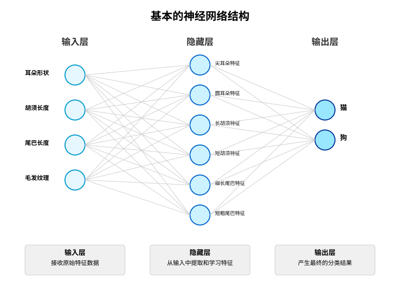

> 图 15.6 猫狗分类网络示例
>

数据在神经网络中的流动过程：

1. 输入层接收原始特征（如动物的耳朵形状、胡须长度等数值）
2. 数据传递到第一个隐藏层，每个隐藏层神经元计算其输入的加权和，并应用激活函数
3. 第一个隐藏层的输出成为第二个隐藏层的输入，依此类推
4. 最后一个隐藏层的输出传递到输出层，产生最终结果（如动物的类别）

随着隐藏层数量的增加，网络的"深度"也增加，这就是"深度学习"名称的由来。深度网络能够学习更复杂的特征和模式，但也需要更多的数据和计算资源来训练。

### 1.4. 深度学习的工作原理

深度神经网络的工作原理可以分为两个主要阶段：前向传播（用于预测）和反向传播（用于学习）。这两个过程共同构成了深度学习系统的核心机制，使神经网络能够从数据中学习并不断改进。

#### 1.4.1. 前向传播（Forward Propagation）

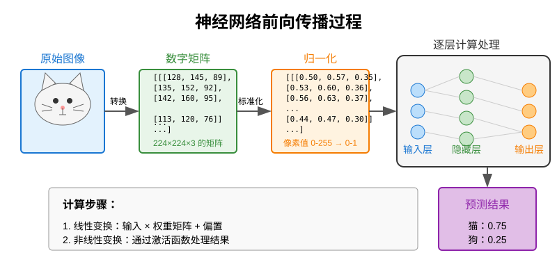

> 图 15.7 前向传播流程图
>

前向传播是神经网络进行预测的过程，数据从输入层流向输出层，逐层计算，最终产生预测结果。

**工作流程：**

1. **输入处理**
    + 将图片转换为数字矩阵（我们在 OpenCV 课程中已经学过）
    + 例如：一张 224×224 的彩色图片变成 224×224×3 的数字矩阵
    + 对数据进行归一化（如将像素值从 0-255 转换到 0-1 范围）
2. **逐层计算**
    + 数据从输入层开始，依次通过每一层隐藏层，最后到达输出层
    + 每一层都执行两个基本步骤：
        + 线性变换：输入与权重矩阵相乘，再加上偏置
        + 非线性变换：通过激活函数处理结果
    + 每一层的输出作为下一层的输入

下面是一个简单神经网络的前向传播代码示例，用于猫狗分类：

```python
import numpy as np

def relu(x):
    """ReLU激活函数：只保留正值，负值变为0"""
    return np.maximum(0, x)

class AnimalClassifier:
    def __init__(self):
    # 初始化一个简单的神经网络参数
    # 这个网络有3个输入特征（耳朵形状、胡须长度、尾巴长度），
    # 4个隐藏神经元，2个输出（猫、狗）
                
        # 第一层权重：3个特征连接到4个隐藏神经元
        # 每行代表一个输入特征对所有隐藏神经元的权重
        self.layer1_weights = np.array([
            [0.5, -0.3, 0.2, -0.1],  # 耳朵形状特征的权重
            [0.2, 0.4, 0.1, 0.3],    # 胡须长度特征的权重
            [-0.1, 0.1, 0.4, 0.2]    # 尾巴长度特征的权重
        ])
        # 第一层的偏置值
        self.layer1_bias = np.array([0.1, 0.2, 0.1, 0.1])
        
        # 第二层权重：4个隐藏神经元连接到2个输出（猫、狗）
        # 每行代表一个隐藏神经元对所有输出神经元的权重
        self.layer2_weights = np.array([
            [0.5, -0.4],  # 第1个隐藏神经元到输出的权重
            [-0.3, 0.6],  # 第2个隐藏神经元到输出的权重
            [0.4, -0.2],  # 第3个隐藏神经元到输出的权重
            [0.1, 0.2]    # 第4个隐藏神经元到输出的权重
        ])
        # 第二层的偏置值
        self.layer2_bias = np.array([0.2, 0.1])
    
    def forward(self, x):
        """前向传播计算"""
        # 第一层计算（输入层到隐藏层）
        # x形状: [3]（3个特征）
        # layer1_weights形状: [3, 4]
        # 点积结果形状: [4]
        layer1_out = np.dot(x, self.layer1_weights) + self.layer1_bias
        
        # 应用ReLU激活函数
        layer1_activated = relu(layer1_out)
        
        # 第二层计算（隐藏层到输出层）
        # layer1_activated形状: [4]
        # layer2_weights形状: [4, 2]
        # 点积结果形状: [2]（两个类别：猫、狗）
        layer2_out = np.dot(layer1_activated, self.layer2_weights) + self.layer2_bias
        
        # 使用softmax函数将输出转换为概率分布
        exp_scores = np.exp(layer2_out)
        probabilities = exp_scores / np.sum(exp_scores)
        
        return probabilities
    
    def predict(self, features):
        """预测动物类别"""
        probs = self.forward(features)
        # 返回概率最大的类别索引（0表示猫，1表示狗）及对应的概率值
        return np.argmax(probs), probs

# 使用示例
classifier = AnimalClassifier()

# 特征表示：[耳朵尖度(0-1), 胡须长度(0-1), 尾巴长度(0-1)]
# 猫的特征：尖耳朵(0.9)，长胡须(0.8)，长尾巴(0.7)
cat_features = np.array([0.9, 0.8, 0.7])

# 狗的特征：圆耳朵(0.3)，短胡须(0.4)，短尾巴(0.3)
dog_features = np.array([0.3, 0.4, 0.3])

# 预测猫
cat_class, cat_probs = classifier.predict(cat_features)
print(f"猫的特征预测结果: {'猫' if cat_class == 0 else '狗'}")
print(f"预测概率: 猫 {cat_probs[0]:.2f}, 狗 {cat_probs[1]:.2f}")

# 预测狗
dog_class, dog_probs = classifier.predict(dog_features)
print(f"狗的特征预测结果: {'猫' if dog_class == 0 else '狗'}")
print(f"预测概率: 猫 {dog_probs[0]:.2f}, 狗 {dog_probs[1]:.2f}")
```

这个例子展示了一个简单的神经网络如何通过前向传播过程对猫和狗进行分类。实际的深度学习模型通常有更多层和神经元，但基本原理相同。

运行这段代码，我们可以发现一个有趣的现象：虽然我们为猫和狗设置了明显不同的特征，但模型还是会错误地将狗识别为猫。这是因为网络的权重参数还不够优化，无法正确区分猫和狗的特征。在实际应用中，这样的错误预测正是我们需要通过"反向传播"来修正的问题。

#### 1.4.2. 反向传播（Backward Propagation）

反向传播是神经网络学习和改进的核心机制。当网络预测结果与实际标签存在差异时（如上面例子中将狗错误地识别为猫），反向传播会计算需要对网络权重做出的调整，使其在未来预测时更准确。

**工作流程**

1. **计算误差**
    + 比较网络的预测值与真实标签
    + 例如：对于一张猫的图片，如果网络给出"猫概率 = 0.3，狗概率 = 0.7"，而正确标签是"猫=1，狗=0"，说明网络预测有误
    + 使用损失函数（如交叉熵损失）量化这种误差
2. **误差传递**
    + 误差从输出层开始，向输入层方向传递
    + 计算每个权重参数对最终误差的影响程度（这就是"梯度"）
    + 直观理解：如果增加某个权重会增大误差，那么它的梯度为正；如果增加某个权重会减小误差，那么它的梯度为负
3. **参数更新**
    + 根据计算出的梯度，更新网络权重和偏置
    + 更新公式：新权重 = 旧权重 - 学习率 × 梯度
    + 学习率是一个小的正数（如 0.01），控制每次更新的步长

在实际开发中，我们不需要手动编写反向传播的复杂代码。现代深度学习框架（如PyTorch、TensorFlow等）已经自动处理了这一过程。这些框架会在训练模型时自动计算梯度并更新权重，大大简化了深度学习模型的开发。

**反向传播的直观例子：**

以我们前面的猫狗分类器错误为例：

1. 模型错误地将狗（特征：圆耳朵，短胡须，短尾巴）识别为猫
2. 系统自动计算误差：真实标签是"狗"，但预测是"猫"，误差很大
3. 反向传播过程自动调整权重，可能会：
    + 减少"圆耳朵"对"猫"类别的影响（降低误导作用）
    + 增加"圆耳朵"对"狗"类别的影响（增强正确识别能力）
4. 在训练多次后，模型会逐渐学会正确区分猫和狗的特征

在深度学习中，这个过程会重复数千甚至数百万次（称为"训练轮次"或"epochs"），网络在每次迭代中都会微调其权重，逐渐提高预测准确率。

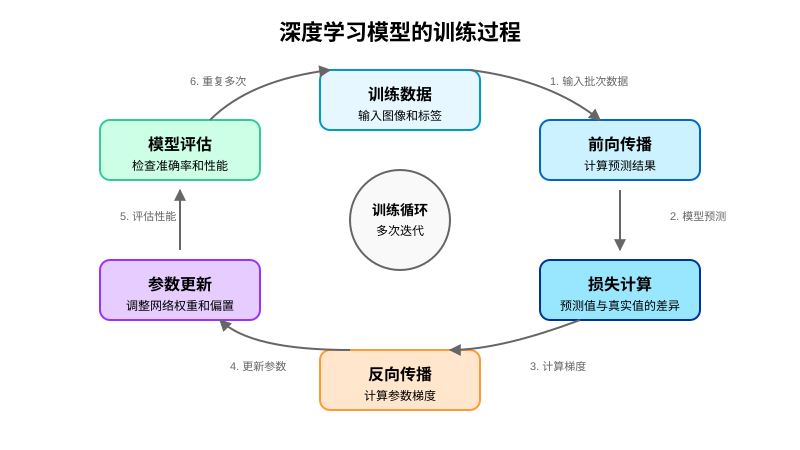

> 图 15.8 深度学习模型的训练过程
>

**反向传播的核心意义：**

反向传播是神经网络能够自主学习的关键机制。没有这个过程，神经网络就只能使用随机或人为设定的权重，无法从经验中学习和改进。通过前向传播和反向传播的反复循环，网络可以逐渐掌握复杂的模式和规律，就像人类通过尝试、错误和纠正来学习新技能一样。

## 2. 边缘设备上深度学习的挑战与优化

在前面的课程中，我们了解了边缘计算的概念和特点。在本节中，我们将探讨深度学习在边缘设备（如我们的 reComputer J1020 v2）上运行时面临的主要挑战，以及可能的优化方法。

### 2.1. 边缘 AI 的优势

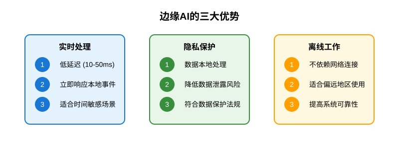

> 图 15.9 边缘 AI 的优势
>

边缘 AI（在设备端运行人工智能模型）相比云端 AI 具有多方面的优势：

1. **实时处理：**
    + **低延迟**：数据无需传输到云端，处理延迟通常在 10-50 毫秒范围内，适合自动驾驶、工业控制等对时间敏感的应用
    + **实时反馈**：能够立即响应本地事件，对智能监控、人机交互等场景至关重要
2. **隐私保护**
    + **数据本地化**：敏感数据在设备内处理，不需要传输到外部服务器，大幅降低数据泄露风险
    + **合规性**：符合数据保护法规，适用于医疗、安防等对隐私有严格要求的领域
3. **离线工作**
    + **独立运行**：不依赖网络连接，适合偏远地区或网络不稳定的环境
    + **持续服务**：即使网络中断也能继续工作，提高系统的可靠性和鲁棒性

### 2.2. 边缘 AI 的挑战

尽管边缘 AI 具有诸多优势，但在 Jetson 等边缘设备上部署深度学习模型也面临一系列挑战：

1. **资源限制**

    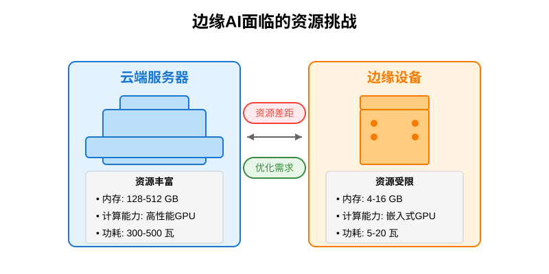

    > 图 15.10 边缘 AI 的资源限制挑战
    >

    边缘设备的计算资源远低于服务器，这对 AI 模型部署形成了严峻挑战：

    + **内存限制**：边缘设备通常只有几 GB 内存，而大型 AI 模型可能需要数十 GB
    + **计算能力**：处理器性能有限，需要在准确率和执行速度之间做出平衡

    下面的代码可以帮助我们了解设备的资源状况，这是部署前的重要准备步骤。通过监控系统资源，我们可以确定设备能够支持多大规模的深度学习模型，以及在运行时需要多少计算和内存资源：

    ```python
    import os
    import psutil

    def check_system_resources():
        """监控系统资源使用情况"""
    # 获取内存信息
        memory = psutil.virtual_memory()
        
        print("系统资源监控：")
        print(f"总内存：{memory.total / 1024 / 1024:.0f}MB")
        print(f"可用内存：{memory.available / 1024 / 1024:.0f}MB")
        print(f"内存使用率：{memory.percent}%")
        
    # 获取CPU信息
        cpu_percent = psutil.cpu_percent(interval=1)
        print(f"CPU使用率：{cpu_percent}%")

    # 运行资源监控
    check_system_resources()
    ```

2. **模型优化**

    为了在资源受限的边缘设备上高效运行深度学习模型，需要采用多种优化技术：

    + **模型压缩**：减少模型大小，通常可以将原始模型缩小 5-10 倍而精度损失很小
    + **量化**：将模型权重从 float32（32位浮点数）转换为 int8（8位整数），可减少 75% 的内存占用
    + **剪枝**：移除网络中不重要的连接，可以减少 30-80% 的计算量，同时基本保持原有精度

### 2.3. Jetson 平台的优化方案

NVIDIA 为 Jetson 平台提供了多种优化工具和技术：

1. **TensorRT**

    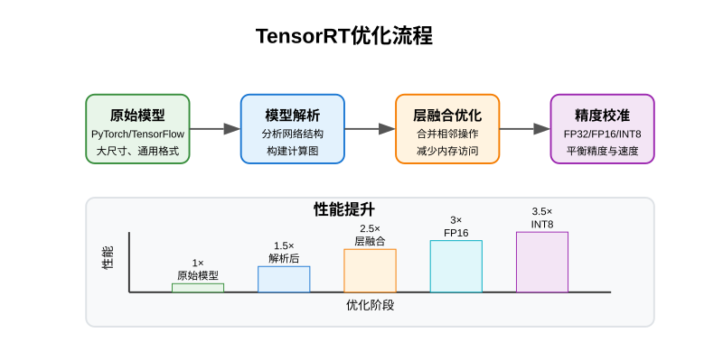

    > 图 15.11 TensorRT 的优化流程图
    >

    TensorRT 是 NVIDIA 开发的深度学习推理优化器，专为高性能推理设计：

    + **自动优化**：自动分析网络结构，合并层，优化计算路径，常能提升 3-5 倍性能
    + **混合精度**：支持 FP32/FP16/INT8 多种精度，智能平衡模型精度和执行速度

2. **CUDA 优化**

    Jetson 平台的一大优势是拥有 CUDA 加速能力。以下代码演示了如何检查设备的 GPU 资源，这是开发边缘 AI 应用的第一步——了解可用的计算资源：

    ```python
    try:
        import torch
        
        def check_gpu_availability():
            """检查GPU是否可用"""
            print("CUDA设备检查：")
            if torch.cuda.is_available():
                print("GPU可用：")
                print(f"设备名称：{torch.cuda.get_device_name(0)}")
                print(f"设备数量：{torch.cuda.device_count()}")
                memory = torch.cuda.get_device_properties(0).total_memory
                print(f"显存大小：{memory / 1024 / 1024:.0f}MB")
            else:
                print("GPU不可用，将使用CPU")

        # 运行GPU检查
        check_gpu_availability()
        
    except ImportError:
        print("PyTorch未安装，请先安装PyTorch")
    ```

    CUDA 优化的核心是利用 GPU 的并行计算能力：

    + **并行计算**：神经网络的矩阵运算非常适合 GPU 的并行架构，可提升 10-50 倍的计算速度
    + **内存优化**：通过减少主机内存和 GPU 显存之间的数据传输，提高整体性能

## 3. 深度学习数据准备：从收集到预处理

深度学习模型的性能很大程度上取决于训练数据的质量和数量。在本节中，我们将学习一套完整的数据准备流程，从数据收集开始，经过标注、组织，再到预处理和增强，为模型训练打下坚实基础。

### 3.1. 数据的重要性与收集策略

#### 3.1.1. 数据的重要性

在深度学习中，数据质量和数量对模型性能至关重要。深度学习模型需要从大量数据中学习复杂的模式，数据不足或质量不佳会直接影响最终结果。

数据的数量和多样性直接影响模型的泛化能力。如果模型只接触到有限的例子，它可能会过度拟合这些例子的特定特征，而无法在新数据上表现良好。例如，如果模型只见过白天拍摄的猫的图片，它可能无法识别夜晚拍摄的猫。

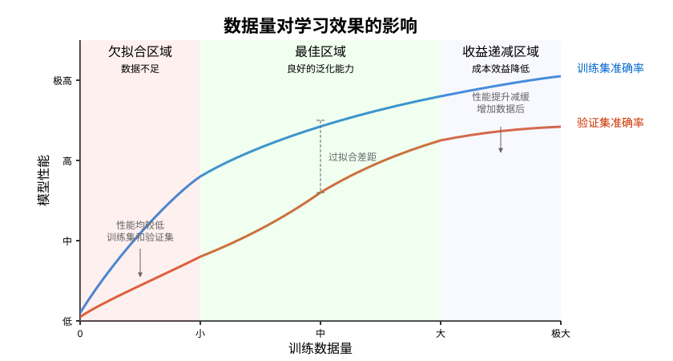

> 图 15.12 数据量对学习效果的影响示意图
>

#### 3.1.2. 数据集的类型

根据任务的不同，我们需要准备不同类型的数据集：

1. **分类数据集**
    + 用途：判断图像属于哪个类别
    + 示例：区分猫和狗
    + 标注方式：每张图片对应一个类别标签
2. **检测数据集**
    + 用途：找出图像中目标的位置和类别
    + 示例：定位图片中的猫或狗的位置
    + 标注方式：目标位置框和类别
3. **分割数据集**
    + 用途：精确划分图像中不同区域
    + 示例：区分图片中猫的轮廓和背景
    + 标注方式：像素级别的标注

#### 3.1.3. 数据收集方法

对于我们的猫狗分类项目，有两种主要的数据获取途径：

1. **使用公开数据集**
    + **经典数据集**：
        + **Kaggle 猫狗数据集**：包含 25,000 张高质量的猫狗图片[https://www.kaggle.com/c/dogs-vs-cats/data](https://www.kaggle.com/c/dogs-vs-cats/data)
        + **Oxford-IIIT Pet 数据集**：包含 37 个品种的猫狗图片，每个品种约 200 张[https://www.robots.ox.ac.uk/~vgg/data/pets/](https://www.robots.ox.ac.uk/~vgg/data/pets/)

    ```python
    # 使用 TorchVision 下载 Oxford Pets 数据集
    from torchvision.datasets import OxfordIIITPet
    dataset = OxfordIIITPet(root='./data', split='trainval', download=True)
    ```

2. **自主采集数据**
    + **数据采集策略**：
        + **多样性**：确保覆盖不同角度、光照条件、背景和姿态
        + **均衡性**：猫和狗的图片数量应大致相等
        + **代表性**：采集的数据应反映实际使用场景
    + **采集方法**：
        + 使用摄像头或手机拍摄
        + 从网络获取相关图像（注意版权问题）

采集数据后，下一步就是数据标注和组织，为预处理环节做准备。

### 3.2. 数据标注与组织

#### 3.2.1. 分类数据的标注与组织

对于猫狗分类任务，标注相对简单，主要是将图像与对应的类别标签关联。最常用的组织方式是采用标准的目录结构：

```plain
dataset/
    ├── train/          # 训练集目录
    │   ├── cat/        # 猫类别文件夹
    │   │   ├── cat_001.jpg
    │   │   ├── cat_002.jpg
    │   │   └── ...
    │   └── dog/        # 狗类别文件夹
    │       ├── dog_001.jpg
    │       ├── dog_002.jpg
    │       └── ...
    └── val/            # 验证集目录
        ├── cat/
        └── dog/
```

这种结构有几个重要优势：

+ 清晰直观，易于理解和管理
+ 与深度学习框架的数据加载器兼容
+ 方便扩展到更多类别

下面是一个数据集管理工具的实现，它可以自动创建这种目录结构并组织图像：

```python
import os
import shutil
from pathlib import Path
from sklearn.model_selection import train_test_split

def create_dataset_structure(base_path, classes):
    """
    创建标准的数据集目录结构
    
    参数:
        base_path: 数据集根目录
        classes: 类别列表
    """
    splits = ['train', 'val']  # 定义数据集划分（训练集和验证集）
    
    # 双重循环创建每个划分下的每个类别目录
    for split in splits:
        for cls in classes:
            # 构建目录路径，如 ./dataset/train/cat
            path = Path(base_path) / split / cls
            # 创建目录，parents=True确保父目录存在，exist_ok=True表示目录已存在时不报错
            path.mkdir(parents=True, exist_ok=True)
            print(f"创建目录: {path}")

def organize_images(source_dir, dataset_dir, class_name, test_size=0.2):
    """
    整理图片到指定的数据集目录，自动划分到 train 和 val 目录
    
    参数:
        source_dir: 源图片目录
        dataset_dir: 数据集根目录
        class_name: 类别名称
        test_size: 验证集的比例，默认 20%
    """
    # 获取源目录下所有jpg图片的路径
    source_path = Path(source_dir)
    img_paths = list(source_path.glob("*.jpg"))  # 只处理jpg格式图片
    
    # 使用sklearn的函数将图片路径随机划分为训练集和验证集
    # test_size=0.2表示20%用于验证集，random_state设定随机种子确保结果可复现
    train_paths, val_paths = train_test_split(img_paths, test_size=test_size, random_state=42)
    
    # 将图片复制到对应的目录
    for split, img_list in zip(['train', 'val'], [train_paths, val_paths]):
        for img_path in img_list:
            # 构建目标目录路径，如 ./dataset/train/cat
            target_dir = Path(dataset_dir) / split / class_name
            target_dir.mkdir(parents=True, exist_ok=True)
            
            # 创建新文件名，加入类别前缀，如 cat_image1.jpg
            new_name = f"{class_name}_{img_path.name}"
            # 复制图片到目标位置，保留元数据（如创建时间）
            shutil.copy2(img_path, target_dir / new_name)
            print(f"复制: {img_path.name} -> {target_dir / new_name}")

# 使用示例
if __name__ == "__main__":
    # 创建猫狗分类的数据集结构
    create_dataset_structure("./pets_dataset", ["cat", "dog"])
    
    # 整理猫图片和狗图片，自动划分训练集和验证集
    organize_images("./raw_cats", "./pets_dataset", "cat")
    organize_images("./raw_dogs", "./pets_dataset", "dog")
```

这段代码完成了两个主要任务：

1. 创建标准的数据集目录结构，包括训练集和验证集下的不同类别文件夹
2. 将原始图片整理归类到对应目录，并自动进行训练集和验证集的随机划分

数据集划分是深度学习中的重要实践：

+ **训练集**：用于模型学习的主要数据（通常占80%）
+ **验证集**：用于调整超参数和评估模型（通常占20%）
+ **测试集**：用于最终评估模型（有时另外设置）

#### 3.2.2. 标注工具与质量控制

对于更复杂的任务（如目标检测或图像分割），可以使用专业的标注工具：

1. **LabelImg**：适合目标检测任务的矩形框标注[https://github.com/HumanSignal/labelImg](https://github.com/HumanSignal/labelImg)
2. **VGG Image Annotator**：支持多种标注类型（点、线、框、多边形）[https://www.robots.ox.ac.uk/~vgg/software/via/via_demo.html](https://www.robots.ox.ac.uk/~vgg/software/via/via_demo.html)
3. **Labelme**：支持复杂的多边形分割标注[https://github.com/wkentaro/labelme](https://github.com/wkentaro/labelme)

无论使用何种标注方法，确保标注质量至关重要：

+ **命名规范**：使用一致的命名模式
+ **标签一致性**：同一类别的标签应保持一致
+ **标注准确性**：特别是边界框和分割标注，需要尽量精确

完成数据收集和标注后，我们需要进行数据预处理，使其适合深度学习模型的训练。

### 3.3. 数据预处理技术

原始收集的图像数据通常存在多种问题，需要进行预处理才能用于模型训练：

#### 3.3.1. 预处理的必要性

1. **不一致性问题**
    + 图像大小各异（有的可能是 4000×3000 像素，有的只有 640×480 像素）
    + 像素值范围不同（0-255 的整数或 0-1 的浮点数）
    + 图像方向和比例不统一
2. **质量问题**
    + 清晰度不一（模糊或噪声）
    + 光照条件各异（过亮、过暗或色彩失真）
    + 不相关的背景或干扰元素

预处理的目的是将这些不同质量和格式的原始数据转换为标准化、一致性的格式，使模型能够更高效地学习。

#### 3.3.2. 基本预处理流程

一个完整的图像预处理流程通常包括以下步骤：

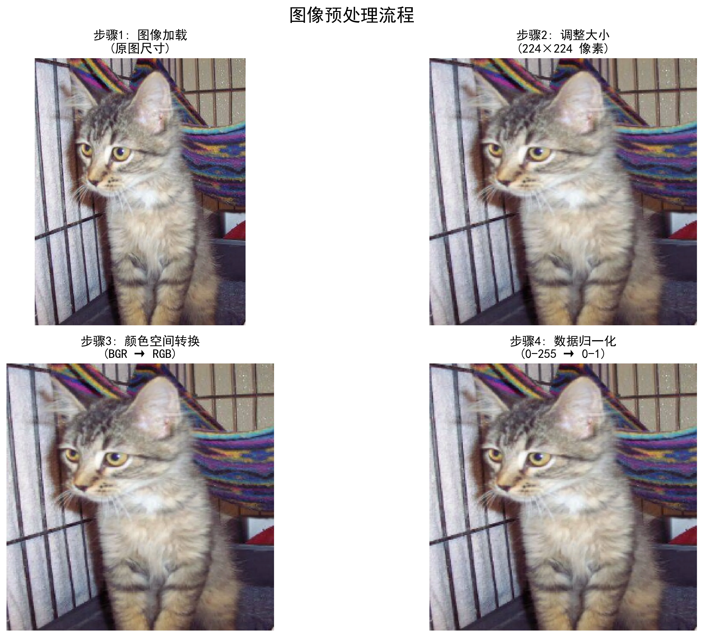

> 图 15.13 图像预处理流程示例
>

1. **图像加载**
    + 读取各种格式的图像文件（jpg、png等）
    + 转换颜色空间（通常从 OpenCV 的 BGR 转为标准 RGB）
    + 检查图像完整性，过滤损坏的文件
2. **大小调整**
    + 将所有图像调整为统一尺寸（如 224×224 像素）
    + 可选择保持原始宽高比（避免图像变形）
    + 必要时进行填充或裁剪
3. **颜色空间转换**
    + 确保颜色空间一致（如 RGB 或灰度）
    + 调整色彩平衡和对比度（可选）
4. **数据归一化**
    + 将像素值从 0-255 的整数范围转换到 0-1 的浮点范围
    + 或转换到均值为 0、方差为 1 的分布（减均值除方差）
    + 使数据分布一致，有助于模型更快收敛

下面是一个批量图像预处理的实用工具代码，它可以处理整个目录中的图像，并将其转换为深度学习模型可用的格式：

```python
import cv2
import numpy as np
import matplotlib.pyplot as plt
import os
from pathlib import Path

class BatchImageProcessor:
    def __init__(self, target_size=(224, 224)):
        self.target_size = target_size
    
    def process_directory(self, input_dir, output_dir=None, show_samples=False):
        """批量处理整个目录中的图像"""
        # 创建输出目录（如果不存在）
        if output_dir:
            os.makedirs(output_dir, exist_ok=True)
        
        # 获取所有图像文件
        valid_extensions = ['.jpg', '.jpeg', '.png', '.bmp']
        image_paths = [f for f in Path(input_dir).glob('*') 
                      if f.suffix.lower() in valid_extensions]
        
        if not image_paths:
            print(f"在 {input_dir} 中没有找到图像文件")
            return
        
        print(f"找到 {len(image_paths)} 个图像文件，开始处理...")
        
        # 存储处理结果
        processed_images = []
        
        # 处理每个图像
        for i, img_path in enumerate(image_paths):
            try:
                # 加载图像
                image = cv2.imread(str(img_path))
                if image is None:
                    print(f"无法读取图像: {img_path}")
                    continue
                
                # BGR转RGB
                image = cv2.cvtColor(image, cv2.COLOR_BGR2RGB)
                
                # 调整大小
                resized = cv2.resize(image, self.target_size)
                
                # 归一化
                normalized = resized.astype(np.float32) / 255.0
                
                # 保存处理结果
                if output_dir:
                    output_path = Path(output_dir) / f"processed_{img_path.name}"
                    # 保存前转回BGR
                    save_img = cv2.cvtColor((normalized * 255).astype(np.uint8), 
                                           cv2.COLOR_RGB2BGR)
                    cv2.imwrite(str(output_path), save_img)
                
                processed_images.append({
                    'path': img_path,
                    'normalized': normalized
                })
                
                # 显示处理进度
                print(f"已处理: {i+1}/{len(image_paths)}", end='\r')
                
            except Exception as e:
                print(f"处理图像 {img_path} 时出错: {e}")
        
        print(f"\n成功处理了 {len(processed_images)}/{len(image_paths)} 张图像")
        
#         # 显示样本结果
#         if show_samples and processed_images:
#             self._show_sample_results(processed_images, min(5, len(processed_images)))
        
        return processed_images
    
#     def _show_sample_results(self, processed_images, num_samples):
#         """显示样本处理结果"""
#         fig, axes = plt.subplots(num_samples, 2, figsize=(10, num_samples * 2.5))
        
#         if num_samples == 1:
#             axes = [axes]  # 确保axes是二维的
        
#         for i in range(num_samples):
#             # 原始图像
#             original = cv2.imread(str(processed_images[i]['path']))
#             original = cv2.cvtColor(original, cv2.COLOR_BGR2RGB)
            
#             # 显示原始图像
#             axes[i][0].imshow(original)
#             axes[i][0].set_title(f"原始: {processed_images[i]['path'].name}")
#             axes[i][0].axis('off')
            
#             # 显示处理后的图像
#             axes[i][1].imshow(processed_images[i]['normalized'])
#             axes[i][1].set_title(f"处理后 ({self.target_size[0]}x{self.target_size[1]})")
#             axes[i][1].axis('off')
        
#         plt.tight_layout()
#         plt.show()

# 使用示例
processor = BatchImageProcessor(target_size=(224, 224))
processed = processor.process_directory("./images", "./processed_images", show_samples=True)
```

这个处理工具可以批量处理整个数据集，将不同格式、大小的图像转换为统一的标准格式，为模型训练做好准备。使用时只需指定目标尺寸和输入/输出目录即可。

#### 3.3.3. 数据增强技术

数据增强解决了数据量不足的问题，通过对现有图像应用各种变换，创造更多训练样本：

1. **数据增强的作用**
    + 扩充数据集规模：从几百张图像扩展到几千张
    + 增加数据多样性：模拟不同角度、光照和环境
    + 减少过拟合：帮助模型学习更泛化的特征
    + 提高模型鲁棒性：使模型对各种变化更加稳健

    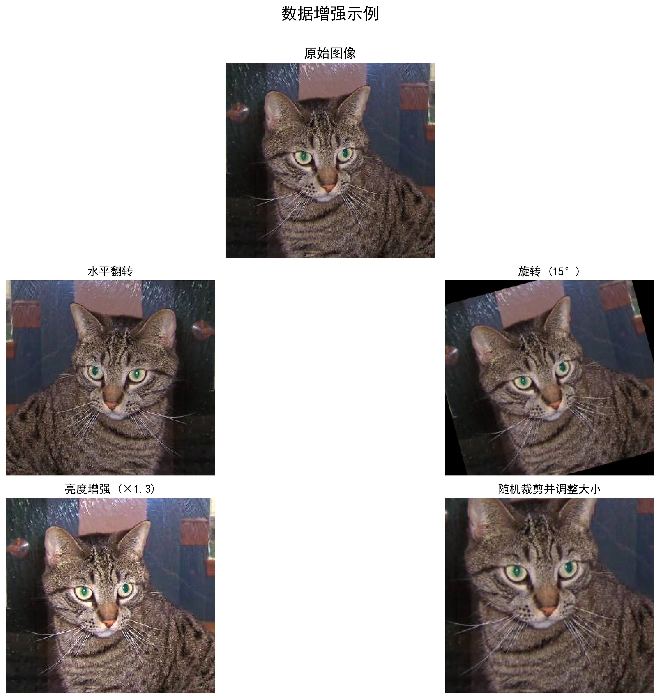

    > 图 15.14 数据增强的作用示意图
    >

2. **常用增强方法**
    + **几何变换**：水平翻转、随机旋转、随机裁剪、缩放
    + **颜色变换**：亮度调整、对比度变化、色调变化

    下面是一个批量数据增强工具，可以对整个数据集应用多种增强方法：

    ```python
    import cv2
    import numpy as np
    import matplotlib.pyplot as plt
    import os
    from pathlib import Path
    import random

    class BatchAugmenter:
        def __init__(self, augmentation_methods=None):
            """
            初始化批量数据增强器
            
            参数:
                augmentation_methods: 要应用的增强方法列表，默认为所有方法
            """
            # 可用的增强方法
            self.available_methods = {
                'horizontal_flip': self.horizontal_flip,
                'rotate': self.rotate,
                'brightness': self.adjust_brightness,
                'contrast': self.adjust_contrast,
                'crop': self.random_crop
            }
            
            # 设置要使用的增强方法
            if augmentation_methods is None:
                self.methods = list(self.available_methods.keys())
            else:
                self.methods = [m for m in augmentation_methods if m in self.available_methods]
        
        def horizontal_flip(self, image):
            """水平翻转图像"""
            return cv2.flip(image, 1)
        
        def rotate(self, image, angle_range=(-10, 10)):
            """随机旋转图像"""
            angle = random.uniform(*angle_range)
            h, w = image.shape[:2]
            M = cv2.getRotationMatrix2D((w/2, h/2), angle, 1.0)
            return cv2.warpAffine(image, M, (w, h))
        
        def adjust_brightness(self, image, factor_range=(0.8, 1.2)):
            """调整图像亮度"""
            factor = random.uniform(*factor_range)
            return np.clip(image * factor, 0, 255).astype(np.uint8)
        
        def adjust_contrast(self, image, factor_range=(0.8, 1.2)):
            """调整图像对比度"""
            factor = random.uniform(*factor_range)
            mean = np.mean(image, axis=(0, 1), keepdims=True)
            return np.clip((image - mean) * factor + mean, 0, 255).astype(np.uint8)
        
        def random_crop(self, image, crop_percent=(0.8, 0.9)):
            """随机裁剪图像然后调整回原始大小"""
            h, w = image.shape[:2]
            percent = random.uniform(*crop_percent)
            
            # 计算裁剪区域
            new_h, new_w = int(h * percent), int(w * percent)
            start_h = random.randint(0, h - new_h)
            start_w = random.randint(0, w - new_w)
            
            # 裁剪图像
            cropped = image[start_h:start_h+new_h, start_w:start_w+new_w]
            
            # 调整回原始大小
            return cv2.resize(cropped, (w, h))
        
        def augment_image(self, image, num_augmentations=1):
            """对单个图像应用多种增强方法"""
            augmented_images = []
            
            for _ in range(num_augmentations):
                # 随机选择要应用的方法
                methods_to_apply = random.sample(
                    self.methods, 
                    k=random.randint(1, min(3, len(self.methods)))
                )
                
                # 复制原始图像
                img_copy = image.copy()
                
                # 应用选择的增强方法
                methods_applied = []
                for method in methods_to_apply:
                    img_copy = self.available_methods[method](img_copy)
                    methods_applied.append(method)
                
                augmented_images.append({
                    'image': img_copy,
                    'methods': methods_applied
                })
            
            return augmented_images
        
        def augment_directory(self, input_dir, output_dir, augmentations_per_image=2, 
                            show_samples=False):
            """批量增强整个目录中的图像"""
            # 创建输出目录
            os.makedirs(output_dir, exist_ok=True)
            
            # 获取所有图像文件
            valid_extensions = ['.jpg', '.jpeg', '.png', '.bmp']
            image_paths = [f for f in Path(input_dir).glob('*') 
                        if f.suffix.lower() in valid_extensions]
            
            if not image_paths:
                print(f"在 {input_dir} 中没有找到图像文件")
                return
            
            print(f"找到 {len(image_paths)} 个图像文件，开始数据增强...")
            
            # 存储增强结果样本
            sample_results = []
            
            # 处理每个图像
            total_augmented = 0
            for i, img_path in enumerate(image_paths):
                try:
                    # 加载图像
                    image = cv2.imread(str(img_path))
                    if image is None:
                        print(f"无法读取图像: {img_path}")
                        continue
                    
                    # BGR转RGB
                    image = cv2.cvtColor(image, cv2.COLOR_BGR2RGB)
                    
                    # 进行数据增强
                    augmented = self.augment_image(image, augmentations_per_image)
                    
                    # 保存增强后的图像
                    for j, aug in enumerate(augmented):
                        # 生成输出文件名
                        output_name = f"{img_path.stem}_aug{j+1}{img_path.suffix}"
                        output_path = Path(output_dir) / output_name
                        
                        # 保存图像(转回BGR)
                        save_img = cv2.cvtColor(aug['image'], cv2.COLOR_RGB2BGR)
                        cv2.imwrite(str(output_path), save_img)
                        
                        total_augmented += 1
                    
                    # 保存样本结果用于显示
                    if i < 5:  # 只保存前5张图像的结果作为样本
                        sample_results.append({
                            'original': image,
                            'augmented': augmented,
                            'filename': img_path.name
                        })
                    
                    # 显示处理进度
                    print(f"已处理: {i+1}/{len(image_paths)}", end='\r')
                    
                except Exception as e:
                    print(f"处理图像 {img_path} 时出错: {e}")
            
            print(f"\n成功创建了 {total_augmented} 张增强图像")
            
    #         # 显示样本结果（可选）
    #         if show_samples and sample_results:
    #             self._show_sample_results(sample_results)
        
    #     def _show_sample_results(self, sample_results):
    #         """显示样本增强结果（可选）"""
    #         for sample in sample_results:
    #             # 计算行数和列数
    #             n_augmentations = len(sample['augmented'])
    #             fig, axes = plt.subplots(1, n_augmentations + 1, figsize=(3 * (n_augmentations + 1), 3))
                
    #             # 显示原始图像
    #             axes[0].imshow(sample['original'])
    #             axes[0].set_title(f"原始: {sample['filename']}")
    #             axes[0].axis('off')
                
    #             # 显示增强后的图像
    #             for i, aug in enumerate(sample['augmented']):
    #                 axes[i+1].imshow(aug['image'])
    #                 axes[i+1].set_title(f"增强 #{i+1}\n{', '.join(aug['methods'])}")
    #                 axes[i+1].axis('off')
                
    #             plt.tight_layout()
    #             plt.show()

    # 使用示例
    augmenter = BatchAugmenter()
    augmenter.augment_directory("./images", "./augmented_images", 
                            augmentations_per_image=3, show_samples=True)
    ```

    这个数据增强工具的强大之处在于它可以灵活组合多种增强方法，并随机应用于每张图像，从而生成大量多样化的训练样本。使用这个工具，我们可以将原始数据集扩展到原来的数倍大小。

3. **增强策略的选择**
    + 保持类别特征的完整性：增强不应改变物体的本质特征
    + 与实际应用场景匹配：模拟模型实际使用环境中的变化
    + 参数选择适度：过大的变化可能产生不自然的结果

适当的数据预处理和增强能显著提高模型的训练效果，是从数据收集到模型训练的重要桥梁。通过这套完整的数据准备流程，我们为下一步的深度学习模型训练打下了坚实基础。

## 4. 课程项目预览：智能监控系统

在本章课程中，我们将逐步构建一个基于深度学习的智能监控系统。这个项目将整合之前学习的 Python 编程和 OpenCV 计算机视觉技术，以及接下来要学习的深度学习知识，是对所学内容的综合应用。

### 4.1. 项目愿景

我们计划开发的系统将具备以下核心能力：

+ 实时检测视频中的物体和人员
+ 根据检测结果自动记录关键事件
+ 在边缘设备上高效运行

### 4.2. 技术路线

这个项目将使用我们的 reComputer J1020 v2 作为硬件平台，结合 USB 摄像头进行视频采集。在软件层面，我们将整合：

+ 视频处理模块：基于 OpenCV
+ 深度学习模型：适合边缘设备的高效模型
+ 事件处理模块：定制化的逻辑处理

随着课程的推进，我们将逐步学习完成这个系统所需的知识。通过这个项目，我们可以亲身体验如何将深度学习技术应用到实际问题中。

## 5. 学习路线图：从基础到实战

在本课中，我们学习了深度学习的基本概念和数据准备技术，这些是构建边缘AI应用的基石。接下来，我们将沿着循序渐进的路线，逐步扩展知识体系并应用到实际项目中。

### 5.1. 学习路线规划

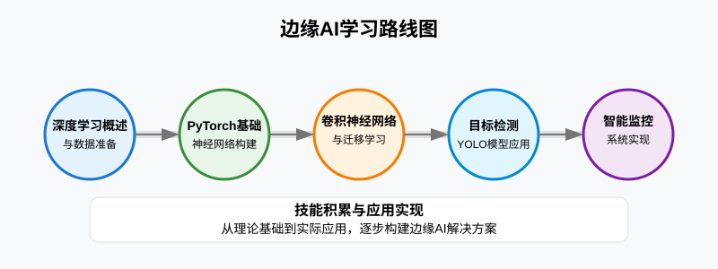

> 图 15.15 本章学习路线图
>

我们的后续学习将按照以下路线展开：

+ **PyTorch 基础**：学习深度学习框架的核心组件，掌握如何从零构建神经网络模型，完成完整的训练、评估和推理流程。
+ **卷积神经网络与迁移学习**：理解 CNN 架构和工作原理，学习如何利用预训练模型加速开发，在边缘设备上高效部署图像分类模型。
+ **目标检测技术**：掌握目标检测的基本原理，学习 YOLO 模型的结构和应用，在 Jetson 平台上实现高效目标检测。
+ **智能监控系统集成**：整合所学知识构建完整应用，实现实时视频分析和事件检测，优化系统在边缘设备上的性能。

通过这个完整的学习路径，我们将建立从基础理论到实际应用的完整技能体系，最终能够在 Jetson 平台上开发出实用的边缘 AI 解决方案。今天学习的概念和技术是这个学习旅程的第一步，为后续课程打下了坚实基础。

## 6. 总结

在本课中，我们开启了深度学习的学习之旅，了解了神经网络的结构和工作原理，探讨了深度学习在边缘计算中的应用和面临的挑战。同时，我们学习了深度学习数据集的准备与预处理技术，掌握了数据收集、标注和预处理的基本方法。

我们还介绍了未来学习的路线图，明确了从PyTorch基础、卷积神经网络到目标检测的学习路径，为后续的实践学习做好了准备。在接下来的课程中，我们将学习更多深度学习的核心概念，并逐步构建起完整的边缘AI技能体系。

## 7. 课后拓展

+ **阅读材料**
  + [PyTorch 官方教程](https://pytorch.org/tutorials/beginner/basics/intro.html)
  + [深度学习基础 - 动手学深度学习](https://d2l.ai/chapter_introduction/index.html)
+ **实践练习**
    1. **神经元计算模拟器**

        **任务描述**：

        + 编写一个程序来模拟单个神经元的计算过程，帮助理解神经网络的基本工作原理
        + 实现一个接收3个输入特征的神经元，并使用sigmoid激活函数
        + 通过调整权重和偏置，观察神经元对不同输入的响应变化
        + 设计一个简单的猫特征识别器，展示神经元如何进行基本分类

        **提示**：

        + 关注神经元的四个关键组成部分：输入特征、权重、偏置和激活函数
        + 使用numpy库进行向量计算，提高代码效率
        + 尝试不同的权重组合，观察它们对最终分类结果的影响
        + 记录每一步的中间计算结果，帮助理解神经元的信息处理流程

    2. **一键式图像预处理与增强工具（待确认）**

        **任务描述**：

        + 基于课程中的`BatchImageProcessor`（预处理）和`BatchAugmenter`（数据增强）两个类，构建一个完整的图像处理管道
        + 实现从原始图像到训练就绪数据的一键式转换流程
        + 保证预处理和增强步骤的正确顺序执行，先预处理再增强
        + 支持按类别处理图像并维持目录结构

        **提示**：

        + 使用`BatchImageProcessor`处理所有原始图像，标准化尺寸和像素值
        + 使用`BatchAugmenter`对预处理后的图像进行增强，扩充数据集
        + 设计合理的目录结构，区分原始、预处理和增强后的图像
        + 考虑训练集和验证集的分离，通常只对训练集进行增强

        </br>

    参考答案：[15-深度学习概述与数据准备课后题参考答案](https://github.com/Seeed-Studio/Seeed_Studio_Courses/blob/Edge-AI-101-with-Nvidia-Jetson-Course/docs/cn/3/15/Homework_Answer.md)
