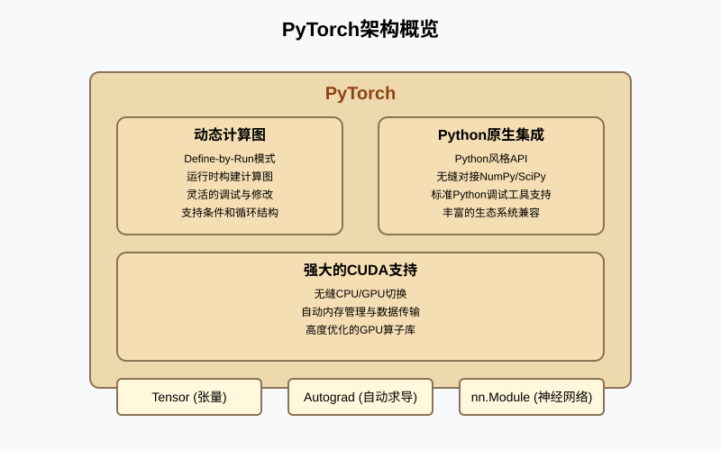
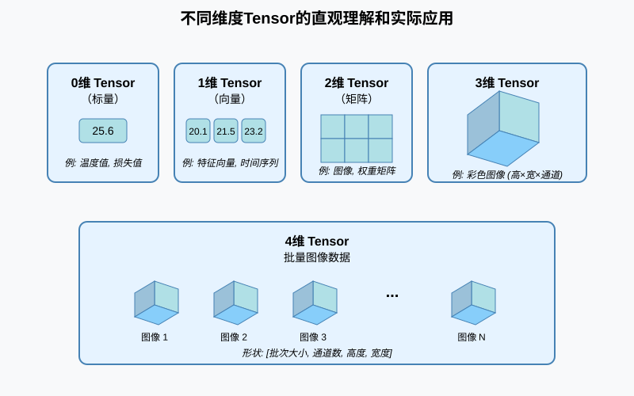
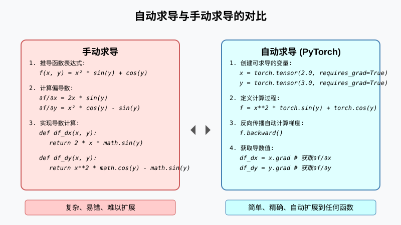
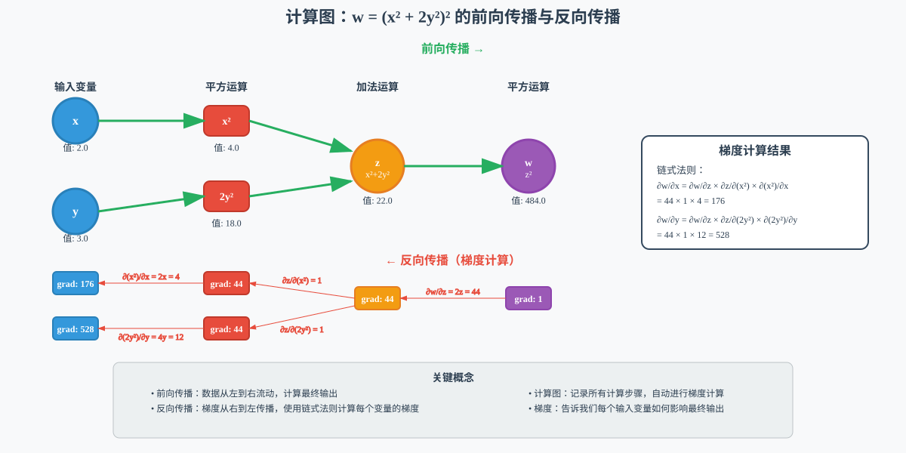
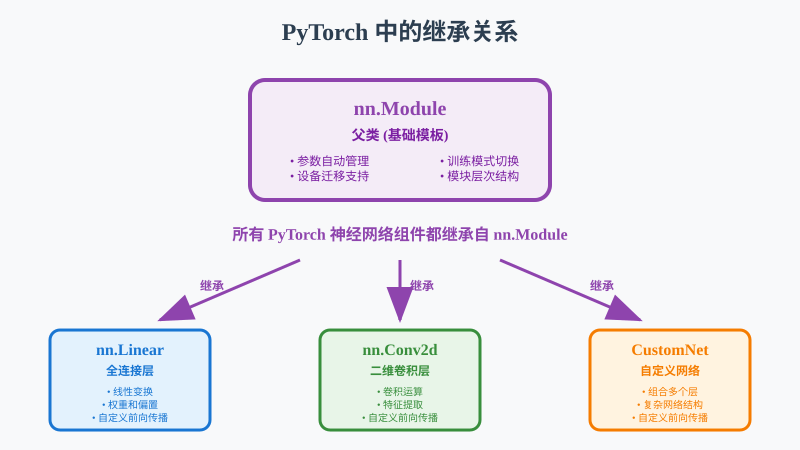
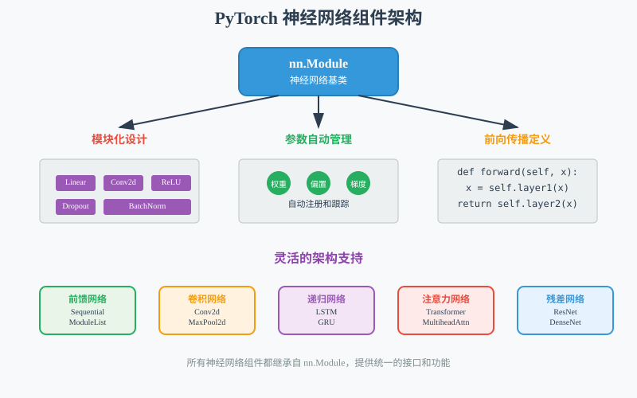
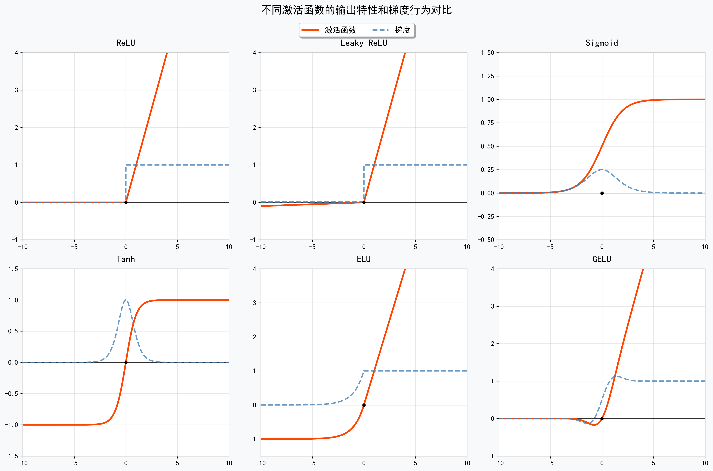
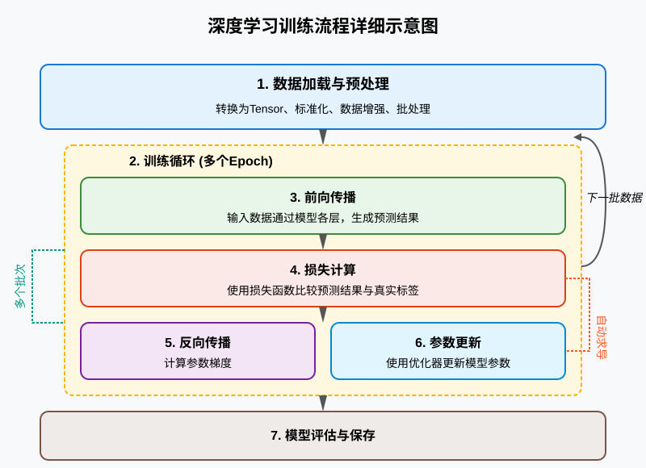
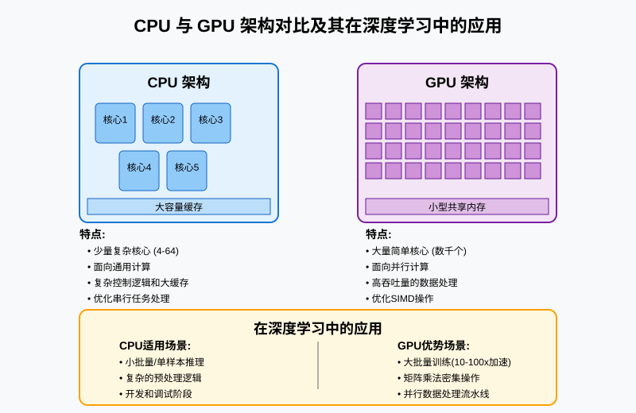
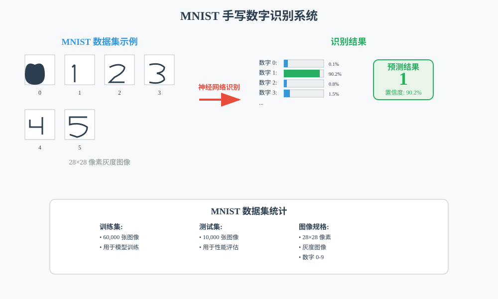

# 第16课：PyTorch基础与神经网络构建

## 课程简介

在本课中，我们将深入学习 PyTorch 这一现代深度学习框架的核心概念和实践应用。PyTorch 以其直观的动态计算图、Python 原生支持和强大的自动求导功能而广受欢迎，特别适合初学者入门和研究人员进行算法实验。

本课程将通过理论讲解与实践操作相结合的方式，带领您掌握 PyTorch 的核心组件。我们将从最基础的 Tensor 操作开始，逐步深入理解自动求导机制的工作原理，学习如何构建和训练神经网络模型，最终在 Jetson 平台上充分利用 GPU 加速能力。这些技能将为后续学习卷积神经网络、目标检测等高级技术打下坚实的基础。

## 课程目标

+ 掌握 Tensor 的概念和基本操作
+ 理解自动求导机制和计算图的工作原理
+ 学习如何构建简单的神经网络模型
+ 掌握模型训练的完整流程，包括前向传播、损失计算和反向传播

## 1. 课程引入：手写数字识别实践

### 1.1. 主项目：MNIST手写数字识别

在深入学习 PyTorch 的技术细节之前，让我们先了解本课的实际项目目标：构建一个能够识别手写数字的神经网络模型，这将成为我们理解深度学习基础的绝佳示例。

MNIST 数据集是深度学习领域的"Hello World"级经典数据集，包含 60,000 张训练图像和 10,000 张测试图像，每张图像是一个 28×28 像素的灰度图，表示从 0 到 9 的某个数字。


> 图 16.1 MNIST数据集示例图像
>

通过构建这个项目，我们将深入理解 PyTorch 的各个组件如何协同工作：

+ **数据处理**：学习如何加载和预处理图像数据
+ **模型构建**：设计一个简单但有效的神经网络结构
+ **参数优化**：使用损失函数和优化器训练模型
+ **模型评估**：评测模型性能并可视化结果

这个项目虽然简单，但包含了深度学习的所有核心步骤，是理解 PyTorch 基础的理想起点。构建完成后，我们将拥有一个能够以高准确率识别手写数字的模型，并且掌握应用到更复杂项目的基本技能。

## 2. PyTorch 基础概念

### 2.1. 什么是 PyTorch

PyTorch 是由 Facebook（现 Meta）AI Research 开发的开源深度学习框架，自 2016 年发布以来迅速成为学术界和工业界的首选工具之一。它的成功源于几个关键特性的完美结合：



> 图 16.2  PyTorch 架构概览
>

**动态计算图的革命性创新**：与传统的静态图框架不同，PyTorch 采用动态计算图（Define-by-Run）模式。这意味着计算图在程序执行过程中动态构建，使得模型结构可以根据输入数据灵活调整。这种设计特别适合处理变长序列、条件分支等复杂场景，让研究人员能够更自然地表达算法思想。

**Python 原生集成的简洁性**：PyTorch 与 Python 生态系统无缝集成，API 设计遵循 Python 的哲学原则。这种设计让开发者能够利用 Python 丰富的科学计算库（如 NumPy、SciPy、matplotlib）和调试工具，大大降低了学习成本和开发难度。

**强大的 CUDA 支持**：PyTorch 内置对 NVIDIA CUDA 的全面支持，能够自动管理 CPU 和 GPU 之间的数据传输和计算分配。在我们的 Jetson 平台上，这一特性尤为重要，因为它能够充分发挥 GPU 的并行计算优势，实现数十倍的性能提升。

### 2.2. 环境配置与验证

在 Jetson 平台上正确配置 PyTorch 环境是确保后续开发顺利进行的关键步骤。以下程序将全面检查我们的开发环境：

```python
import torch
import sys
import numpy as np

def check_pytorch_environment():
    """全面检查 PyTorch 环境配置"""
    print("=== PyTorch环境检查 ===")
    print(f"Python版本: {sys.version}")
    print(f"PyTorch版本: {torch.__version__}")
    
    # 检查CUDA可用性
    cuda_available = torch.cuda.is_available()
    print(f"CUDA可用性: {cuda_available}")
    
    if cuda_available:
        print(f"CUDA版本: {torch.version.cuda}")
        print(f"GPU设备数量: {torch.cuda.device_count()}")
        
        # 检查GPU设备信息
        for i in range(torch.cuda.device_count()):
            gpu_name = torch.cuda.get_device_name(i)
            print(f"GPU {i}: {gpu_name}")
        
        # 显示GPU内存状况
        current_device = torch.cuda.current_device()
        memory_allocated = torch.cuda.memory_allocated(current_device) / 1024**2
        memory_reserved = torch.cuda.memory_reserved(current_device) / 1024**2
        total_memory = torch.cuda.get_device_properties(current_device).total_memory / 1024**2
        print(f"GPU总内存: {total_memory:.0f}MB")
        print(f"当前已分配: {memory_allocated:.0f}MB")
        print(f"当前已保留: {memory_reserved:.0f}MB")
    
    # 功能验证测试
    print("\n=== 功能测试 ===")
    
    # CPU Tensor操作测试
    cpu_tensor = torch.tensor([1.0, 2.0, 3.0])
    print(f"CPU Tensor创建成功: {cpu_tensor}")
    
    # GPU Tensor操作测试
    if cuda_available:
        gpu_tensor = torch.tensor([1.0, 2.0, 3.0]).cuda()
        print(f"GPU Tensor创建成功: {gpu_tensor}")

# 执行环境检查
check_pytorch_environment()
```

这段代码创建了一个全面的环境检查函数，它会验证 Python 和 PyTorch 版本、检测 CUDA 可用性、显示 GPU 设备信息和内存状况。通过 `torch.cuda.is_available()` 函数，我们可以检查 CUDA 是否可用，这是使用 GPU 加速的前提条件。该程序还会进行简单的功能测试，创建 CPU 和 GPU 上的 Tensor，确保基本功能正常运行。在 Jetson 设备上，这些信息特别重要，因为它们帮助我们确认设备配置是否符合要求，以及有多少计算资源可供使用。

## 3. Tensor 深入理解

### 3.1. Tensor 概念全面解析

Tensor（张量）是 PyTorch 的核心数据结构，可以理解为"具备自动求导能力的多维数组"。与普通的 NumPy 数组不同，Tensor 不仅能够高效存储和处理数值数据，还能自动追踪计算历史，为反向传播算法提供必要信息。

为了更好地理解 Tensor 的概念，我们可以通过生活中的实际例子来类比不同维度的 Tensor：

+ **标量（0维Tensor）**：就像温度计上的一个读数，比如当前室温 25.6°C，它是一个独立的数值。在深度学习中，损失值、学习率等参数通常是标量。
+ **向量（1维Tensor）**：类似于一天中每小时的温度记录 [20.1, 21.5, 23.2, 25.6, 27.8]，是一串有序排列的数值。在深度学习中，特征向量、权重向量等都是 1 维 Tensor。
+ **矩阵（2维Tensor）**：如同一个月中每天每小时的温度记录表，有行和列两个维度。在深度学习中，图像的单个颜色通道、全连接层的权重矩阵等都是 2 维 Tensor。
+ **三维 Tensor**：可以想象为一年中每个月每天每小时的三维温度数据立体结构，增加了第三个维度。在深度学习中，彩色图像（高度×宽度×颜色通道）是典型的 3 维 Tensor。
+ **四维 Tensor**：在深度学习中最为常见，通常用于批量处理图像数据（批次大小×颜色通道×图像高度×图像宽度）。



> 图 16.3 不同维度Tensor的直观理解和实际应用
>

下面是一个展示不同维度 Tensor 的简单代码示例：

```python
import torch

# 0维 Tensor - 标量
loss_value = torch.tensor(0.5)
print(f"损失值（标量）: {loss_value}, 形状: {loss_value.shape}")

# 1维 Tensor - 向量
feature_vector = torch.tensor([0.1, 0.3, 0.8, 0.2, 0.9])
print(f"特征向量: {feature_vector}, 形状: {feature_vector.shape}")

# 2维 Tensor - 矩阵
weight_matrix = torch.randn(3, 4)  # 3个输入连接到4个输出
print(f"权重矩阵形状: {weight_matrix.shape}")

# 3维 Tensor - 单张彩色图像
single_image = torch.randn(3, 224, 224)  # RGB图像，224x224像素
print(f"单张图像形状: {single_image.shape}")

# 4维 Tensor - 批量图像数据
batch_images = torch.randn(32, 3, 224, 224)  # 32张RGB图像
print(f"批量图像形状: {batch_images.shape}")
```

上面的代码创建了不同维度的 Tensor，并打印它们的形状属性来展示维度信息。`torch.tensor()` 函数用于从 Python 数据结构（如列表）创建 Tensor，而 `torch.randn()` 则创建符合标准正态分布的随机 Tensor，这是初始化神经网络参数的常用方法。`.shape` 属性返回 Tensor 的形状，表示为每个维度的大小。了解这些不同维度的 Tensor 是构建深度学习模型的基础，例如权重矩阵用于存储连接层之间的权重，而 4D Tensor 则用于批量处理图像数据，大大提高训练效率。

### 3.2. Tensor 创建方法详解

PyTorch 提供了多种灵活的 Tensor 创建方法，每种方法都针对特定的使用场景进行了优化。以下是一些常用的创建方法：

```python
import torch
import numpy as np

# 从Python数据结构创建
list_data = [1, 2, 3, 4, 5]
tensor_from_list = torch.tensor(list_data)
print(f"从列表创建: {tensor_from_list}")  # 输出: tensor([1, 2, 3, 4, 5])

# 从NumPy数组创建
numpy_array = np.array([[1, 2], [3, 4]])
tensor_from_numpy = torch.from_numpy(numpy_array)
print(f"从NumPy创建:\n{tensor_from_numpy}")  # 输出: tensor([[1, 2], [3, 4]])

# 创建特殊结构的Tensor
zeros_tensor = torch.zeros(3, 4)
print(f"全零矩阵:\n{zeros_tensor}")  # 输出: tensor([[0., 0., 0., 0.], ...])

ones_tensor = torch.ones(2, 3)
print(f"全一矩阵:\n{ones_tensor}")  # 输出: tensor([[1., 1., 1.], [1., 1., 1.]])

identity_tensor = torch.eye(3)
print(f"单位矩阵:\n{identity_tensor}")  # 输出: tensor([[1., 0., 0.], [0., 1., 0.], [0., 0., 1.]])

# 随机Tensor创建
random_uniform = torch.rand(2, 3)
print(f"均匀分布随机数:\n{random_uniform}")  # 输出: tensor([[0.1234, 0.5678, ...], ...])

random_normal = torch.randn(2, 3)
print(f"正态分布随机数:\n{random_normal}")  # 输出: tensor([[-0.1234, 1.5678, ...], ...])

# 数值序列
linear_space = torch.linspace(0, 1, 5)
print(f"等间距序列: {linear_space}")  # 输出: tensor([0.0000, 0.2500, 0.5000, 0.7500, 1.0000])

arange_tensor = torch.arange(0, 10, 2)
print(f"步进序列: {arange_tensor}")  # 输出: tensor([0, 2, 4, 6, 8])
```

这段代码展示了 PyTorch 中创建 Tensor 的几种常用方法。

1. 基础创建方法：
    + `torch.tensor()` 是最基本的方法，可以直接从 Python 列表创建 Tensor
    + `torch.from_numpy()` 让我们方便地将 NumPy 数组转换为 Tensor
2. 特殊结构创建：
    + `torch.zeros()` 和 `torch.ones()` 创建全 0 或全 1 的 Tensor，在初始化模型参数时很有用
    + `torch.eye()` 创建单位矩阵，在特定算法中经常需要
3. 随机 Tensor 创建：
    + `torch.rand()` 创建 0-1 之间均匀分布的随机 Tensor
    + `torch.randn()` 创建服从标准正态分布的随机 Tensor，初始化神经网络权重时常用
4. 数值序列：
    + `torch.linspace()` 和 `torch.arange()` 用于创建等间隔的数字序列

选择合适的创建方法能让代码更简洁，也能提高程序效率。

### 3.3. Tensor 操作详解

PyTorch 提供了丰富的 tensor 运算操作，涵盖了从基本算术到高级线性代数的各个方面：

```python
import torch

# 创建示例 tensor
a = torch.tensor([[1., 2.], [3., 4.]])
b = torch.tensor([[5., 6.], [7., 8.]])

# 元素级运算
print(f"加法 (a + b):\n{a + b}")
print(f"乘法 (a * b):\n{a * b}")  # 元素级乘法

# 矩阵运算
print(f"矩阵乘法 torch.mm(a, b):\n{torch.mm(a, b)}")
print(f"矩阵乘法 a @ b:\n{a @ b}")  # 简化语法

# 形状操作
x = torch.randn(2, 3, 4)
print(f"原始形状: {x.shape}")
print(f"重塑为 (6, 4): {x.view(6, 4).shape}")
print(f"增加维度: {x.unsqueeze(0).shape}")

# 索引和切片
tensor = torch.arange(1, 25).reshape(4, 6)
print(f"第一行: {tensor[0]}")
print(f"第二列: {tensor[:, 1]}")
print(f"子矩阵 [1:3, 2:5]:\n{tensor[1:3, 2:5]}")

# 统计运算
data = torch.randn(3, 4)
print(f"总和: {torch.sum(data)}")
print(f"均值: {torch.mean(data)}")
print(f"各行求和: {torch.sum(data, dim=1)}")

# 就地操作（In-place）
x = torch.tensor([1., 2., 3.])
x.add_(1)  # 等价于 x = x + 1，但更节省内存
print(f"就地加法后: {x}")
```

这段代码展示了 PyTorch 中的常用 Tensor 操作，是构建任何深度学习模型的基础。

1. 基本算术运算：
    + 元素级操作（如 `+`, `*`）对每个位置的元素分别进行计算
    + PyTorch 支持广播机制，允许不同形状的 Tensor 进行运算
2. 矩阵运算：
    + `torch.mm()` 或简便的 `@` 符号可以执行矩阵乘法，这是神经网络的核心操作
3. 形状操作：
    + `view()` 和 `reshape()` 帮助我们调整 Tensor 的维度
    + `unsqueeze()` 可以增加维度，在处理批量数据时特别有用
4. 索引和切片：
    + 与 NumPy 非常类似，可以轻松提取和修改 Tensor 中的数据
5. 统计运算：
    + `sum()`, `mean()` 等函数可以计算整个 Tensor 或指定维度的统计量
6. 内存优化：
    + 以下划线结尾的方法（如 `add_()`）是"就地操作"，可以直接修改原 Tensor 而不创建新的
    + 这种操作在处理大型模型时可以显著节省内存

掌握这些基本操作是编写高效 PyTorch 代码的关键。

## 4. 自动求导机制详解

### 4.1. 自动求导的重要性与原理

自动求导（Automatic Differentiation，简称 Autograd）是 PyTorch 的核心特性之一，也是现代深度学习框架能够高效训练复杂神经网络的关键技术。

在深度学习中，我们需要通过梯度下降算法来优化模型参数，这要求计算损失函数相对于每个参数的偏导数（梯度）。对于包含数百万甚至数十亿参数的现代神经网络，手动推导和计算这些梯度几乎是不可能的任务。



> 图 16.4 自动求导与手动求导的对比
>

PyTorch 实现了一个精确高效的自动求导系统，它通过以下核心机制大幅简化了梯度计算：

1. **计算历史追踪**：在执行张量运算时，PyTorch 自动构建一个完整的操作记录，精确捕获每个数学变换及其参数，为后续的导数计算提供必要的计算图结构。
2. **动态计算图构建**：与静态图框架不同，PyTorch 采用动态计算图模式，在程序执行过程中实时构建计算图。这种"定义即运行"的方式使得模型结构可以根据条件语句动态变化，无需预先定义完整计算过程。
3. **反向传播自动化**：当调用反向传播函数时，PyTorch 系统从输出节点开始，利用微积分中的链式法则，沿着计算图逆向计算每个节点的梯度，并将结果累积到相应参数。
4. **资源优化管理**：PyTorch 实现了高效的内存管理策略，包括中间结果的即时释放和计算调度优化，确保梯度计算过程在资源受限环境中仍能维持高效运行。

这些机制协同工作，使得即使是复杂网络的梯度计算也变得直接且高效，让开发者能够专注于模型设计而非底层导数计算的实现细节。

下面是一个简单的例子，展示自动求导的使用：

```python
import torch

# 简单函数：f(x) = x^2 + 2x + 1
x = torch.tensor(3.0, requires_grad=True)
f = x**2 + 2*x + 1
f.backward()
print(f"f'(3.0) = {x.grad.item()}")  # 应该输出 8 (2x + 2，其中 x=3)
```

这段代码展示了 PyTorch 自动求导的基本工作原理。

自动求导的关键步骤：

+ 创建 Tensor 时设置 `requires_grad=True`，告诉 PyTorch 需要跟踪计算历史
+ 进行正常的数学运算，PyTorch 会自动构建计算图
+ 调用 `backward()` 方法，PyTorch 自动计算梯度
+ 结果存储在 Tensor 的 `.grad` 属性中

在这个例子中：

+ 原函数是 f(x) = x² + 2x + 1
+ 导数是 f'(x) = 2x + 2
+ 当 x = 3 时，f'(3) = 8，与自动计算的结果一致

这个简单的例子展示了 PyTorch 如何自动处理导数计算，而在复杂的神经网络中，这一功能将大大简化训练过程。

### 4.2. 计算图原理深入理解

计算图是理解自动求导工作方式的关键概念。我们可以将它想象成一张"路线图"，展示数据如何从输入转换到输出，以及梯度如何从输出传回输入。

```python
import torch

# 创建叶子节点（需要梯度的输入）
x = torch.tensor(2.0, requires_grad=True)
y = torch.tensor(3.0, requires_grad=True)

# 构建计算图
z = x**2 + 2*y**2  # z = x² + 2y²
w = z**2           # w = z²

# 检查计算图结构
print(f"z 的梯度函数: {z.grad_fn}")
print(f"w 的梯度函数: {w.grad_fn}")

# 反向传播计算梯度
w.backward()

# 查看梯度值
print(f"∂w/∂x = {x.grad.item()}")  # 4x * (x² + 2y²) = 4*2*(4+18) = 176
print(f"∂w/∂y = {y.grad.item()}")  # 8y * (x² + 2y²) = 8*3*(4+18) = 528
```

让我们用一个简单的例子来理解计算图：

1. 创建输入节点：`x` 和 `y` 是计算图的起点，通过设置 `requires_grad=True` 告诉 PyTorch 需要计算它们的梯度
2. 构建计算图：当我们执行 `z = x**2 + 2*y**2` 和 `w = z**2` 时，PyTorch 会自动记录计算步骤，这就像在画一张连接各个计算节点的地图
3. 梯度函数：每个变量的 `grad_fn` 属性记录了它是如何被创建的，比如加法、乘法或幂运算
4. 反向传播：当我们调用 `w.backward()` 时，PyTorch 从输出 `w` 开始，沿着计算图向后传递，计算每个变量对最终结果的影响（即梯度）



> 图 16.5 计算图的详细结构和梯度传播过程
>

这个过程有点像计算河流如何影响海洋：我们从海洋（输出）开始，追踪每条河流（变量）对海洋水量的贡献（梯度）。梯度值告诉我们每个输入变量如何影响最终结果，这正是训练神经网络所需的关键信息。

理解计算图对于调试模型训练问题非常重要，尤其是在处理梯度消失或爆炸等情况时。

### 4.3. 梯度计算实践与注意事项

在实际使用自动求导时，有几个重要的注意事项：

1. **梯度累积**

    默认情况下，每次调用 `backward()` 时，梯度会累加到参数的 `.grad` 属性中。如果要进行多次反向传播，需要手动清零梯度：

    ```python
    import torch

    # 梯度累积示例
    x = torch.tensor(1.0, requires_grad=True)

    # 第一次前向传播和反向传播
    y1 = x * 2
    y1.backward()
    print(f"第一次梯度: {x.grad}")  # 输出: 2.0

    # 梯度会累积!
    y2 = x * 3
    y2.backward()
    print(f"累积后梯度: {x.grad}")  # 输出: 5.0 (2.0 + 3.0)

    # 手动清零梯度
    x.grad.zero_()
    ```

    这段代码演示了梯度累积现象和如何处理。每次调用 `backward()` 时，计算得到的梯度会累加到已有梯度上，而不是覆盖它。这可能导致意外的结果，特别是在训练循环中。在训练神经网络时，通常需要在每次参数更新前调用 `optimizer.zero_grad()` 来清零梯度，确保每次更新只考虑当前批次的梯度。不过，梯度累积也可以是一种有意的策略，用于模拟大批量训练，特别是在内存受限的情况下。通过累积多个小批次的梯度，再一次性更新参数，可以达到类似大批量训练的效果。

2. **非标量输出的反向传播**

    当模型输出不是标量（如向量或矩阵）时，调用 `backward()` 需要提供额外的梯度参数。不过在实际深度学习应用中，损失函数通常都是标量（如交叉熵损失、均方误差等），所以这种情况比较少见。有兴趣的话可以找相关资料去了解。

3. **阻断梯度流动**

    PyTorch 提供了 `detach()` 方法和 `torch.no_grad()` 上下文管理器来阻断梯度流动。这些技术主要用于以下场景：

    + 模型评估时（不需要计算梯度，节省内存）
    + 迁移学习中冻结某些网络层
    + 实现特殊的训练策略

    在当前阶段，我们先掌握基本的自动求导机制即可，这些更高级的技术可以在后续有需要时再去详细学习。

## 5. 神经网络构建

### 5.1. 神经网络基础概念

在 PyTorch 中，神经网络通过继承 `nn.Module` 基类来实现，所有的层和模型都是这个类的子类。`nn.Module` 是 PyTorch 中构建神经网络的基础类，它提供了一个统一的框架，简化了神经网络组件的创建和管理。当我们创建自定义神经网络时，只需继承 `nn.Module` 并实现自己的初始化和前向传播逻辑，就能享受 PyTorch 提供的各种自动化功能。



> 图 16.6 PyTorch 中的继承关系
>

这种设计符合现代神经网络的几个核心原则：

+ **模块化设计**：每个神经网络层都是一个独立的模块，具有明确定义的输入、输出和参数。
+ **参数自动管理**：PyTorch 自动跟踪和管理所有可学习参数。
+ **前向传播定义**：通过定义 `forward` 方法，我们明确指定数据通过网络的流动路径。
+ **灵活的架构支持**：PyTorch 支持从简单的前馈网络到复杂的递归、残差、注意力网络等各种架构。



> 图 16.7 神经网络组件在 PyTorch 中的实现结构
>

### 5.2. nn.Module 类深度解析

`nn.Module` 是 PyTorch 中所有神经网络组件的基类，提供了构建和管理神经网络所需的基础功能：

```python
import torch
import torch.nn as nn
import torch.nn.functional as F

class SimpleNetwork(nn.Module):
    def __init__(self, input_size, hidden_size, output_size):
        # 必须调用父类构造函数
        super(SimpleNetwork, self).__init__()
        
        # 定义网络层 - 这些层会自动注册为模块的参数
        self.input_layer = nn.Linear(input_size, hidden_size)
        self.hidden_layer = nn.Linear(hidden_size, hidden_size)
        self.output_layer = nn.Linear(hidden_size, output_size)
        
        # Dropout层用于正则化
        self.dropout = nn.Dropout(0.2)
        
        # 初始化权重
        self._initialize_weights()
    
    def _initialize_weights(self):
        """自定义权重初始化方法"""
        for module in self.modules():
            if isinstance(module, nn.Linear):
                # Xavier初始化
                nn.init.xavier_uniform_(module.weight)
                nn.init.constant_(module.bias, 0)
    
    def forward(self, x):
        """定义前向传播过程"""
        # 输入层
        x = self.input_layer(x)
        x = F.relu(x)
        x = self.dropout(x)
        
        # 隐藏层
        x = self.hidden_layer(x)
        x = F.relu(x)
        x = self.dropout(x)
        
        # 输出层
        x = self.output_layer(x)
        
        return x

# 创建网络实例
net = SimpleNetwork(input_size=784, hidden_size=256, output_size=10)
print(net)
```

这个例子展示了如何使用 `nn.Module` 构建一个简单的神经网络。在 `__init__` 方法中，我们定义了网络的所有层和组件，它们会自动注册为模块的参数。这种注册机制是 PyTorch 的一个重要特性，它使得参数管理变得非常简单。

`forward` 方法定义了数据如何通过网络流动，这是动态计算图的核心。每次我们传入输入数据时，PyTorch 都会根据这个方法构建一个新的计算图，追踪所有操作并准备反向传播。

`_initialize_weights` 方法展示了如何自定义权重初始化策略，这对训练效果有重要影响。在这个例子中，我们使用 Xavier 初始化来帮助控制前向传播信号的方差，这有助于解决深度网络中的梯度消失或爆炸问题。

`nn.Module` 的关键特性包括参数自动注册、模块层次结构、设备迁移和训练模式切换等。当我们使用 `.to(device)` 方法时，整个网络及其所有参数都会被移动到指定设备（如 GPU）。通过 `.train()` 和 `.eval()` 方法，我们可以切换网络的训练和评估模式，这会影响 dropout 和 batch normalization 等层的行为。

### 5.3. 实际应用的网络架构设计

下面我们来构建一个用于图像分类的神经网络模型：

```python
import torch
import torch.nn as nn

class ImageClassifier(nn.Module):
    def __init__(self, num_classes=10, input_channels=3):
        super(ImageClassifier, self).__init__()
        
        # 特征提取部分
        self.features = nn.Sequential(
            nn.Linear(input_channels * 224 * 224, 1024),
            nn.BatchNorm1d(1024),
            nn.ReLU(inplace=True),
            nn.Dropout(0.3),
            
            nn.Linear(1024, 512),
            nn.BatchNorm1d(512),
            nn.ReLU(inplace=True),
            nn.Dropout(0.4),
        )
        
        # 分类器部分
        self.classifier = nn.Sequential(
            nn.Linear(512, 256),
            nn.ReLU(inplace=True),
            nn.Dropout(0.5),
            nn.Linear(256, num_classes)
        )
        
        # 注意力机制
        self.attention = nn.Sequential(
            nn.Linear(512, 128),
            nn.Tanh(),
            nn.Linear(128, 1),
            nn.Sigmoid()
        )
    
    def forward(self, x):
        # 展平输入
        batch_size = x.size(0)
        x = x.view(batch_size, -1)
        
        # 特征提取
        features = self.features(x)
        
        # 注意力机制
        attention_weights = self.attention(features)
        attended_features = features * attention_weights
        
        # 分类
        output = self.classifier(attended_features)
        
        return output

# 创建模型实例
model = ImageClassifier(num_classes=10)
print(model)
# 输出:
# ImageClassifier(
#   (features): Sequential(
#     (0): Linear(in_features=150528, out_features=1024, bias=True)
#     (1): BatchNorm1d(1024, eps=1e-05, momentum=0.1, affine=True, track_running_stats=True)
#     ...
#   )
#   (classifier): Sequential(...)
#   (attention): Sequential(...)
# )

# 测试前向传播
test_input = torch.randn(2, 3, 224, 224)  # 批大小为2，3通道，224x224分辨率
output = model(test_input)
print(f"输入形状: {test_input.shape}")  # 输出: torch.Size([2, 3, 224, 224])
print(f"输出形状: {output.shape}")       # 输出: torch.Size([2, 10])
```

这个模型设计展示了如何组织一个实用的神经网络。让我们用简单的语言理解它的结构：

1. **整体架构**：模型分为三个主要部分 - 特征提取、注意力机制和分类器，就像一条处理数据的流水线
2. **特征提取部分**：
    + 接收图像并从中提取重要特征
    + 使用多个全连接层（`nn.Linear`）逐步处理信息
    + 每个处理步骤后都有以下组件：
        + 批量归一化（`BatchNorm`）：让训练更稳定，就像给数据"标准化"
        + 激活函数（`ReLU`）：引入非线性变换，增强模型表达能力
        + 随机丢弃（`Dropout`）：随机关闭一些神经元，防止过拟合
3. **注意力机制**：
    + 帮助模型"集中注意力"在重要特征上
    + 计算权重系数，强调重要特征，弱化次要特征
    + 类似于我们看图片时会关注关键部分而非全部细节
4. **分类器部分**：
    + 接收处理过的特征，输出最终预测
    + 几个简化的处理层，最终连接到输出类别
5. **前向传播**：
    + `forward` 方法定义了数据通过网络的路径
    + 先展平图像，然后依次通过特征提取、注意力处理和分类

这种模块化设计让代码更清晰，也更容易扩展和维护。每个组件都有明确的职责，就像一个团队中的不同角色协同工作。

### 5.4. 激活函数的选择与影响

激活函数是神经网络中的关键组件，它们引入非线性特性，使网络能够学习复杂的模式。不同的激活函数具有不同的特性和适用场景：



> 图 16.8 不同激活函数的输出特性和梯度行为对比
>

+ **ReLU**：最常用的激活函数，计算简单，有效缓解梯度消失，但存在"死神经元"问题
+ **Leaky ReLU**：改进版 ReLU，允许负输入产生小的梯度，解决死神经元问题
+ **ELU**：指数线性单元，具有 ReLU 的优点，同时提供平滑的梯度
+ **GELU**：高斯误差线性单元，被广泛用于 Transformer 架构
+ **Sigmoid**：传统的激活函数，输出范围为 [0,1]，但存在梯度饱和问题
+ **Tanh**：双曲正切函数，输出范围为 [-1,1]，中心化输出，但也存在梯度饱和问题

在 PyTorch 中使用激活函数的方式有两种：

```python
# 方式1：作为层使用
model = nn.Sequential(
    nn.Linear(784, 256),
    nn.ReLU(),  # 作为层
    nn.Linear(256, 10)
)

# 方式2：作为函数使用
def forward(self, x):
    x = self.linear1(x)
    x = F.relu(x)  # 作为函数
    x = self.linear2(x)
    return x
```

下面的代码展示了 PyTorch 中激活函数两种方式的实际应用。

```python
import torch
import torch.nn as nn
import torch.nn.functional as F

# 方式1：作为层使用
model = nn.Sequential(
    nn.Linear(784, 256),
    nn.ReLU(),  # 作为层
    nn.Linear(256, 10)
)
print(model)
# 输出:
# Sequential(
#   (0): Linear(in_features=784, out_features=256, bias=True)
#   (1): ReLU()
#   (2): Linear(in_features=256, out_features=10, bias=True)
# )

# 方式2：作为函数使用
class FunctionalModel(nn.Module):
    def __init__(self):
        super(FunctionalModel, self).__init__()
        self.linear1 = nn.Linear(784, 256)
        self.linear2 = nn.Linear(256, 10)
        
    def forward(self, x):
        x = self.linear1(x)
        x = F.relu(x)  # 作为函数
        x = self.linear2(x)
        return x

functional_model = FunctionalModel()
print(functional_model)
# 输出:
# FunctionalModel(
#   (linear1): Linear(in_features=784, out_features=256, bias=True)
#   (linear2): Linear(in_features=256, out_features=10, bias=True)
# )

# 注意在打印模型时，第二种方式不会显示ReLU激活函数
# 但两种方式在功能上是等价的
```

PyTorch 提供了两种使用激活函数的方式：

1. 作为层使用 (`nn.ReLU()`)：
    + 激活函数作为模型的一部分，在模型结构中可见
    + 适合用在 `nn.Sequential` 这样的顺序结构中
    + 模型打印输出中会显示激活函数层
2. 作为函数使用 (`F.relu()`)：
    + 激活函数只是一个操作，不是模型结构的一部分
    + 更灵活，可以在任何地方调用
    + 模型打印输出中不会显示激活函数

两种方式在功能上基本等同，选择哪种主要取决于代码风格和具体需求。作为层使用时可以设置额外参数，如 `inplace=True` 可以节省内存。

## 6. 模型训练流程

### 6.1. 深度学习训练流程解析

神经网络的训练是一个系统性的优化过程，旨在通过迭代调整网络参数来最小化预定义的损失函数。这个过程涉及多个关键步骤：



> 图 16.9 深度学习训练流程详细示意图
>

1. **前向传播阶段**：将输入数据通过网络传递，逐层计算激活值，最终产生预测结果。
2. **损失计算阶段**：将网络预测结果与真实标签进行比较，使用损失函数量化两者之间的差异。
3. **反向传播阶段**：利用链式法则计算损失函数相对于每个网络参数的梯度。
4. **参数更新阶段**：根据计算得到的梯度，使用优化算法更新网络参数。
5. **性能评估阶段**：在验证集上评估更新后模型的性能，监控训练进度。

### 6.2. 损失函数与优化器详解

损失函数和优化器是训练神经网络的核心组件。损失函数衡量模型预测与真实值的差距，优化器负责更新模型参数以减小这个差距。

#### 6.2.1. 常用损失函数

PyTorch 提供了多种损失函数适用于不同任务：

+ **分类问题**：
  + `nn.CrossEntropyLoss`：多分类问题的标准选择，内部结合了 softmax
  + `nn.BCEWithLogitsLoss`：二分类问题的首选，数值稳定性好
+ **回归问题**：
  + `nn.MSELoss`：均方误差，最常用的回归损失函数
  + `nn.L1Loss`：平均绝对误差，对异常值不太敏感

#### 6.2.2. 常用优化器

优化器决定了如何根据梯度更新模型参数：

+ **SGD**：最基础的随机梯度下降优化器，可设置动量
+ **Adam**：自适应学习率优化器，融合了动量和RMSProp的优点，通常是首选
+ **AdamW**：Adam的改进版，更好地处理权重衰减

#### 6.2.3. 学习率调度器

学习率调度器可以在训练过程中动态调整学习率：

+ `StepLR`：每隔固定步数将学习率乘以一个因子
+ `ReduceLROnPlateau`：当指标停止改善时降低学习率
+ `CosineAnnealingLR`：余弦周期调整学习率

这些组件配合使用，能显著提高模型训练的效率和效果。选择适合任务的损失函数和优化器是深度学习成功的关键因素之一

```python
# 损失函数示例
criterion = nn.CrossEntropyLoss()

# 优化器示例
optimizer = torch.optim.Adam(model.parameters(), lr=0.001, weight_decay=1e-4)

# 学习率调度器
scheduler = torch.optim.lr_scheduler.StepLR(optimizer, step_size=10, gamma=0.1)
```

下面的代码展示了如何创建损失函数、优化器和学习率调度器：

```python
import torch
import torch.nn as nn
import torch.nn.functional as F

# 创建一个简单的模型用于演示
model = nn.Linear(10, 2)  # 10个输入特征，2个输出类别

# 常用损失函数示例
criterion1 = nn.CrossEntropyLoss()
criterion2 = nn.BCEWithLogitsLoss()
criterion3 = nn.MSELoss()

# 使用示例
inputs = torch.randn(3, 10)  # 3个样本，10个特征
targets_class = torch.tensor([0, 1, 0])  # 分类任务的标签
targets_regression = torch.randn(3, 2)   # 回归任务的标签

outputs = model(inputs)
loss1 = criterion1(outputs, targets_class)
loss3 = criterion3(outputs, targets_regression)

print(f"CrossEntropyLoss: {loss1.item():.4f}")  # 输出类似: 1.2345
print(f"MSELoss: {loss3.item():.4f}")          # 输出类似: 0.8765

# 优化器示例
optimizer = torch.optim.Adam(model.parameters(), lr=0.001, weight_decay=1e-4)
print(f"优化器初始学习率: {optimizer.param_groups[0]['lr']}")  # 输出: 0.001

# 学习率调度器
scheduler = torch.optim.lr_scheduler.StepLR(optimizer, step_size=10, gamma=0.1)
optimizer.step()  # 模拟一步优化
scheduler.step()  # 调整学习率
print(f"10步后学习率将变为: {optimizer.param_groups[0]['lr'] * gamma:.6f}")  # 输出: 0.0001
```

在代码中，`nn.CrossEntropyLoss` 是多分类问题的标准损失函数，计算预测分布与真实标签之间的交叉熵。`torch.optim.Adam` 是一种广泛使用的优化器，它结合了动量和自适应学习率，通常有不错的收敛性能。`lr` 参数设置基础学习率，`weight_decay` 参数实现 L2 正则化，减少过拟合风险。

学习率调度器是控制训练过程中学习率变化的工具。`lr_scheduler.StepLR` 是一种简单的调度策略，每 `step_size` 个 epoch 将学习率乘以 `gamma`。这种递减策略可以帮助模型在训练初期快速收敛，后期进行微调。合适的学习率调度可以显著提高模型的性能和训练稳定性。这些组件共同作用，影响模型训练的收敛速度、稳定性和最终性能。

### 6.3. 完整训练循环实现

以下是一个完整的训练循环实现，包含了现代深度学习训练的各种技术：

```python
import torch
import torch.nn as nn
import torch.nn.functional as F

# 定义一个简化版的训练循环，可以实际运行
def simplified_train_model(model, train_loader, val_loader, criterion, optimizer, num_epochs=2, device='cpu'):
    """简化版训练循环，展示核心概念"""
    # 将模型移到指定设备
    model = model.to(device)
    
    # 训练历史记录
    history = {'train_loss': [], 'val_loss': []}
    
    for epoch in range(num_epochs):
        print(f'Epoch {epoch+1}/{num_epochs}')
        print('-' * 10)
        
        # 训练阶段
        model.train()
        train_loss = 0.0
        
        for inputs, labels in train_loader:
            inputs, labels = inputs.to(device), labels.to(device)
            
            # 梯度清零
            optimizer.zero_grad()
            
            # 前向传播
            outputs = model(inputs)
            loss = criterion(outputs, labels)
            
            # 反向传播
            loss.backward()
            
            # 参数更新
            optimizer.step()
            
            train_loss += loss.item()
        
        avg_train_loss = train_loss / len(train_loader)
        history['train_loss'].append(avg_train_loss)
        
        # 验证阶段
        model.eval()
        val_loss = 0.0
        
        with torch.no_grad():
            for inputs, labels in val_loader:
                inputs, labels = inputs.to(device), labels.to(device)
                
                outputs = model(inputs)
                loss = criterion(outputs, labels)
                
                val_loss += loss.item()
        
        avg_val_loss = val_loss / len(val_loader)
        history['val_loss'].append(avg_val_loss)
        
        print(f'训练损失: {avg_train_loss:.4f}, 验证损失: {avg_val_loss:.4f}')
    
    return model, history

# 创建简单的数据加载器用于示例
def create_dummy_data_loaders():
    """创建示例数据加载器"""
    # 创建伪数据
    X_train = torch.randn(100, 10)  # 100个样本，10个特征
    y_train = torch.randint(0, 2, (100,))  # 二分类问题
    
    X_val = torch.randn(20, 10)
    y_val = torch.randint(0, 2, (20,))
    
    # 创建数据集
    train_dataset = torch.utils.data.TensorDataset(X_train, y_train)
    val_dataset = torch.utils.data.TensorDataset(X_val, y_val)
    
    # 创建数据加载器
    train_loader = torch.utils.data.DataLoader(train_dataset, batch_size=10, shuffle=True)
    val_loader = torch.utils.data.DataLoader(val_dataset, batch_size=10)
    
    return train_loader, val_loader

# 示例运行
simple_model = nn.Linear(10, 2)
criterion = nn.CrossEntropyLoss()
optimizer = torch.optim.SGD(simple_model.parameters(), lr=0.01)

train_loader, val_loader = create_dummy_data_loaders()

trained_model, history = simplified_train_model(
    simple_model, train_loader, val_loader, criterion, optimizer, num_epochs=2
)

print("\n训练完成!")
print(f"最终训练损失: {history['train_loss'][-1]:.4f}")
print(f"最终验证损失: {history['val_loss'][-1]:.4f}")
```

这段代码实现了一个完整的训练循环，清晰展示了神经网络训练的整个流程。

1. 训练准备：
    + 使用 `model.to(device)` 将模型移到合适的设备（CPU 或 GPU）
    + 创建历史记录字典，用于跟踪训练进度
2. 训练循环结构：
    + 外层循环遍历预设的训练周期（epochs）
    + 每个周期包含训练和验证两个阶段
3. 训练阶段关键步骤：
    1. 使用 `model.train()` 激活训练模式（影响 Dropout 和 BatchNorm 等层）
    2. 对每批数据执行以下操作：
        + 将数据移动到正确设备
        + 清除之前的梯度（`optimizer.zero_grad()`）
        + 前向传播计算预测结果
        + 计算损失值
        + 反向传播计算梯度（`loss.backward()`）
        + 更新模型参数（`optimizer.step()`）
4. 验证阶段关键步骤：
    1. 使用 `model.eval()` 切换到评估模式
    2. 使用 `torch.no_grad()` 禁用梯度计算（节省内存）
    3. 对验证集数据进行前向传播并计算损失

这个训练循环包含了现代深度学习训练的基本流程，是实际项目开发的重要框架。通过记录训练和验证的损失值，我们还可以可视化训练过程，评估模型的学习情况。

## 7. GPU 加速应用

### 7.1. 深度学习中 GPU 加速的原理与重要性

图形处理单元（GPU）在深度学习中发挥着至关重要的作用，其并行计算架构特别适合神经网络训练中的大量矩阵运算。



> 图 16.10 CPU 与 GPU 架构对比及其在深度学习中的应用
>

CPU 和 GPU 在架构上存在根本差异：CPU 设计用于通用计算，具有复杂的控制逻辑和大容量缓存，适合处理复杂的串行任务；而 GPU 拥有数千个简单的计算核心，专为高度并行的数值计算而优化。

深度学习训练中的操作具有高度的并行性特征：

+ **矩阵乘法**：神经网络的核心操作，涉及大量独立的乘加计算
+ **元素级运算**：激活函数、归一化等操作可以对 tensor 的每个元素独立执行
+ **批量处理**：多个样本的同时处理进一步增加了并行化的机会

在 PyTorch 中使用 GPU 非常简单：

```python
import torch
import torch.nn as nn

# 完整的GPU使用示例
def demonstrate_gpu_usage():
    """演示PyTorch中的GPU使用"""
    # 检查GPU可用性
    device = torch.device('cuda' if torch.cuda.is_available() else 'cpu')
    print(f"使用设备: {device}")

    # 创建直接在GPU上的tensor
    if device.type == 'cuda':
        gpu_tensor = torch.randn(1000, 1000, device=device)
        print(f"直接在GPU上创建的Tensor形状: {gpu_tensor.shape}")
        print(f"Tensor设备: {gpu_tensor.device}")
    
        # 将已有tensor移动到GPU
        cpu_tensor = torch.randn(500, 500)
        print(f"CPU Tensor设备: {cpu_tensor.device}")
        
        gpu_tensor2 = cpu_tensor.to(device)
        print(f"移动到GPU后的Tensor设备: {gpu_tensor2.device}")
    
        # 创建一个简单模型
        model = nn.Linear(100, 10)
        print(f"模型初始设备: {next(model.parameters()).device}")
        
        # 模型迁移到GPU
        model.to(device)
        print(f"迁移后模型设备: {next(model.parameters()).device}")
        
        # 测试模型
        test_input = torch.randn(32, 100, device=device)
        output = model(test_input)
        print(f"输入形状: {test_input.shape}, 输出形状: {output.shape}")
    else:
        print("当前环境不支持CUDA，所有操作将在CPU上执行")

# 执行演示
demonstrate_gpu_usage()
```

这个例子展示了在 PyTorch 中使用 GPU 的基本方法。首先通过 `torch.device()` 创建一个设备对象，根据系统中 CUDA 是否可用自动选择 GPU 或 CPU。PyTorch 提供了几种在 GPU 上创建和使用 Tensor 的方法：可以直接在指定设备上创建 Tensor（通过 `device` 参数），也可以使用 `.to(device)` 方法将已有 Tensor 移动到指定设备。

对于神经网络模型，只需简单地调用 `model.to(device)` 即可将所有模型参数移动到指定设备，这极大地简化了设备管理。在训练循环中，我们需要确保输入数据和标签与模型在同一设备上，所以要使用 `.to(device)` 方法进行转换。这种设计使得代码可以在有无 GPU 的环境中无缝切换，非常适合开发和部署阶段。在 Jetson 等边缘计算设备上，合理利用 GPU 加速能力是实现实时处理的关键。

### 7.2. 高效的 GPU 内存管理策略

在资源受限的边缘设备上，高效的 GPU 内存管理对于确保模型正常运行和最优性能至关重要。以下是一些实用策略：

1. **及时删除不需要的 tensor**：

    ```python
    # 使用后立即删除
    x = torch.randn(10000, 10000, device='cuda')
    y = x * 2
    del x  # 立即释放内存
    torch.cuda.empty_cache()  # 清理缓存
    ```

    这段代码展示了如何立即释放不再需要的 Tensor 所占用的内存。在处理大型模型或大量数据时，内存管理变得尤为重要。使用 `del` 语句可以删除 Python 变量引用，但 GPU 内存可能不会立即释放，因为 PyTorch 使用缓存机制来提高内存分配效率。调用 `torch.cuda.empty_cache()` 可以尝试释放 GPU 缓存，回收未使用的内存。在内存受限的环境中，如 Jetson 设备，这种做法可以避免内存耗尽错误，确保长时间运行的应用不会崩溃。

2. **使用 inplace 操作**：

    ```python
    # 普通操作创建新tensor
    x = torch.ones(1000, 1000, device='cuda')
    y = x + 1  # 创建新tensor

    # inplace操作修改现有tensor
    x.add_(1)  # 不创建新tensor，节省内存
    ```

    这段代码对比了普通操作和就地操作（inplace operation）的区别。普通操作如 `x + 1` 会创建一个新的 Tensor 来存储结果，而就地操作如 `x.add_(1)` 则直接修改原 Tensor，不创建新的内存空间。就地操作通常以下划线结尾（如 `add_`, `mul_`），它们可以显著减少内存占用和分配开销，特别是对于大型 Tensor。在内存受限的环境中，如 Jetson 设备，合理使用就地操作可以有效控制内存使用，避免频繁的内存分配和释放操作，提高运行效率。

3. **启用混合精度训练**：

    除了上述方法外，对于支持的设备，还可以启用混合精度训练来减少内存使用。混合精度训练使用 float16（半精度）代替 float32（单精度）进行部分计算，可以将内存使用减少近一半，同时提高计算速度。PyTorch 提供了 `torch.cuda.amp` 模块来简化混合精度训练的实现。这种技术在边缘设备上尤其有用，可以在不显著影响模型精度的情况下，大幅提高处理能力。

### 7.3. CPU 与 GPU 间的数据传输

在实际应用中，CPU 和 GPU 之间的数据传输可能成为性能瓶颈。以下是一些基本的优化技巧：

```python
# 使用固定内存加速传输
dataloader = DataLoader(dataset, batch_size=32, pin_memory=True)

# 异步传输不阻塞CPU
gpu_tensor = cpu_tensor.to(device, non_blocking=True)
```

这些优化可以在处理大型数据集或部署到资源受限设备时提高性能。随着对 PyTorch 的深入学习，我们在未来可以进一步探索这些高级优化技术。

## 8. 项目实践：MNIST手写数字识别

### 8.1. 项目介绍

在本项目中，我们将应用前面学习的 PyTorch 知识，构建一个简单但功能完整的神经网络模型，用于识别手写数字。我们将使用 MNIST 数据集，这是深度学习领域的"Hello World"级经典数据集，包含 60,000 张训练图像和 10,000 张测试图像，每张图像是一个 28×28 像素的灰度图，代表 0-9 中的一个数字。

这个项目虽然简单，但包含了深度学习项目的所有核心环节：

+ 数据加载与预处理
+ 模型构建
+ 训练与验证
+ 模型评估
+ 可视化结果



> 图 16.11 MNIST 数据集示例和识别效果
>

### 8.2. 实现方法

我们将通过以下步骤实现这个项目：

1. 使用 PyTorch 内置的数据加载功能获取 MNIST 数据集
2. 构建一个简单但有效的神经网络模型
3. 定义损失函数和优化器
4. 实现训练循环
5. 评估模型性能并可视化结果

这个项目的美妙之处在于，我们可以用非常少的代码实现一个完整的深度学习应用，同时展示 PyTorch 的核心功能。

### 8.3. AI助手辅助项目实现

在实际项目开发中，利用AI助手可以大大提高效率。这里展示如何使用AI助手来帮助我们实现这个项目。

#### 8.3.1. 向AI助手提供的提示词

```plain
我想使用PyTorch实现一个MNIST手写数字识别项目。请帮我生成以下部分的代码：

1. 数据加载与预处理
2. 构建一个简单的神经网络模型（两层全连接层）
3. 定义训练函数
4. 评估模型性能的函数
5. 可视化预测结果的函数

请确保代码简洁明了，适合PyTorch初学者阅读，并添加必要的注释。
```

#### 8.3.2. 项目实现

根据AI助手的帮助，我们得到了以下完整的项目代码：

```python
import torch
import torch.nn as nn
import torch.optim as optim
import torchvision
import torchvision.transforms as transforms
import matplotlib.pyplot as plt
import numpy as np
from torch.utils.data import DataLoader

# 设置随机种子，确保结果可复现
torch.manual_seed(42)

# 1. 数据加载与预处理
def load_data(batch_size=64):
    """加载MNIST数据集并进行预处理"""
    # 定义转换：将图像转换为Tensor，并标准化
    transform = transforms.Compose([
        transforms.ToTensor(),
        transforms.Normalize((0.1307,), (0.3081,))  # MNIST数据集的均值和标准差
    ])

    # 加载训练集和测试集
    train_dataset = torchvision.datasets.MNIST(
        root='./data', 
        train=True, 
        download=True, 
        transform=transform
    )

    test_dataset = torchvision.datasets.MNIST(
        root='./data', 
        train=False, 
        download=True, 
        transform=transform
    )

    # 创建数据加载器
    train_loader = DataLoader(
        train_dataset, 
        batch_size=batch_size, 
        shuffle=True
    )

    test_loader = DataLoader(
        test_dataset, 
        batch_size=batch_size, 
        shuffle=False
    )

    return train_loader, test_loader

# 2. 构建神经网络模型
class SimpleNN(nn.Module):
    def __init__(self, input_size=784, hidden_size=128, num_classes=10):
        super(SimpleNN, self).__init__()
        # 第一层：输入层 -> 隐藏层
        self.fc1 = nn.Linear(input_size, hidden_size)
        # 激活函数
        self.relu = nn.ReLU()
        # 第二层：隐藏层 -> 输出层
        self.fc2 = nn.Linear(hidden_size, num_classes)

    def forward(self, x):
        # 将输入展平为向量
        x = x.view(-1, 28*28)
        # 第一层
        x = self.fc1(x)
        x = self.relu(x)
        # 第二层
        x = self.fc2(x)
        return x

# 3. 训练模型
def train_model(model, train_loader, num_epochs=5, learning_rate=0.001):
    """训练神经网络模型"""
    # 定义损失函数和优化器
    criterion = nn.CrossEntropyLoss()
    optimizer = optim.Adam(model.parameters(), lr=learning_rate)

    # 用于记录训练过程中的损失
    loss_history = []

    # 训练循环
    for epoch in range(num_epochs):
        running_loss = 0.0

        for i, (images, labels) in enumerate(train_loader):
            # 梯度清零
            optimizer.zero_grad()

            # 前向传播
            outputs = model(images)
            loss = criterion(outputs, labels)

            # 反向传播和优化
            loss.backward()
            optimizer.step()

            # 记录损失
            running_loss += loss.item()

            # 每100个批次打印一次信息
            if (i+1) % 100 == 0:
                print(f'Epoch [{epoch+1}/{num_epochs}], Step [{i+1}/{len(train_loader)}], Loss: {loss.item():.4f}')

        # 每个epoch结束后记录平均损失
        epoch_loss = running_loss / len(train_loader)
        loss_history.append(epoch_loss)
        print(f'Epoch [{epoch+1}/{num_epochs}], Loss: {epoch_loss:.4f}')

    return model, loss_history

# 4. 评估模型
def evaluate_model(model, test_loader):
    """评估模型在测试集上的性能"""
    model.eval()  # 设置为评估模式
    correct = 0
    total = 0

    with torch.no_grad():  # 禁用梯度计算
        for images, labels in test_loader:
            outputs = model(images)
            _, predicted = torch.max(outputs.data, 1)
            total += labels.size(0)
            correct += (predicted == labels).sum().item()
    
    accuracy = 100 * correct / total
    print(f'测试集准确率: {accuracy:.2f}%')
    return accuracy

# 5. 可视化结果
def visualize_results(model, test_loader, num_images=5):
    """可视化模型预测结果"""
    model.eval()
    
    # 获取一批测试数据
    dataiter = iter(test_loader)
    images, labels = next(dataiter)
    
    # 预测结果
    outputs = model(images)
    _, predicted = torch.max(outputs, 1)
    
    # 展示图像和预测结果
    fig = plt.figure(figsize=(12, 4))
    for i in range(num_images):
        ax = fig.add_subplot(1, num_images, i+1)
        # 将图像转换回原始格式并显示
        img = images[i].squeeze().numpy()
        ax.imshow(img, cmap='gray')
        ax.set_title(f'预测: {predicted[i]}, 实际: {labels[i]}')
        ax.axis('off')
    
    plt.tight_layout()
    plt.show()

# 主函数
def main():
    # 设置参数
    batch_size = 64
    input_size = 784  # 28x28
    hidden_size = 128
    num_classes = 10
    num_epochs = 5
    learning_rate = 0.001
    
    # 加载数据
    train_loader, test_loader = load_data(batch_size)
    
    # 创建模型
    model = SimpleNN(input_size, hidden_size, num_classes)
    
    # 训练模型
    model, loss_history = train_model(
        model, train_loader, num_epochs, learning_rate
    )
    
    # 评估模型
    accuracy = evaluate_model(model, test_loader)
    
    # 可视化损失曲线
    plt.figure(figsize=(10, 5))
    plt.plot(loss_history)
    plt.title('训练损失')
    plt.xlabel('Epoch')
    plt.ylabel('Loss')
    plt.show()
    
    # 可视化预测结果
    visualize_results(model, test_loader)

# 执行主函数
if __name__ == "__main__":
    main()
```

### 8.4. 代码解析

项目代码分为五个主要部分：

1. **数据加载与预处理**
    + 使用 `torchvision.datasets.MNIST` 加载经典的 MNIST 数据集
    + 通过 `transforms` 将图像标准化，转换为 Tensor
    + 使用 `DataLoader` 实现批量处理和洗牌
2. **模型构建**
    + 创建一个简单的两层全连接神经网络
    + 第一层将 28×28=784 个输入特征映射到 128 个隐藏单元
    + 中间使用 ReLU 激活函数
    + 最后一层将隐藏特征映射到 10 个类别（对应数字 0-9）
3. **训练循环**
    + 使用交叉熵损失函数，适合分类问题
    + 使用 Adam 优化器自动调整学习率
    + 实现完整的训练过程：梯度清零、前向传播、计算损失、反向传播、参数更新
    + 记录训练损失以监控学习进度
4. **模型评估**
    + 在测试集上评估模型性能
    + 使用 `model.eval()` 切换到评估模式
    + 使用 `torch.no_grad()` 禁用梯度计算，节省内存
    + 计算并显示测试集准确率
5. **结果可视化**
    + 显示部分测试图像及其预测结果
    + 绘制训练损失曲线，展示学习过程

这个项目虽然简单，但包含了深度学习项目的所有核心组件。通过这个项目，我们可以看到前面学习的 PyTorch 知识是如何应用到实际问题中的。

### 8.5. 项目效果

运行上述代码后，模型在 MNIST 测试集上能够达到约 97% 的准确率，这对于一个简单的两层网络来说已经相当不错了。可视化结果显示，大多数数字都能被正确识别，只有一些特别复杂或不清晰的图像会被错误分类。

通过这个项目，我们展示了 PyTorch 的强大功能和易用性。只需不到 200 行代码，我们就实现了一个完整的深度学习应用，包括数据处理、模型构建、训练、评估和可视化。这为后续学习更复杂的模型（如卷积神经网络）奠定了坚实的基础。

## 9. 总结

本课程系统介绍了 PyTorch 深度学习框架的核心技术，建立了从基础理论到实际应用的完整知识体系。我们掌握了 Tensor 作为核心数据结构的创建与操作方法，深入理解了自动求导机制在神经网络训练中的关键作用，学会了使用 nn.Module 构建网络架构并配置训练组件。通过完整的模型训练流程实践，我们熟悉了前向传播、损失计算、反向传播和参数优化的工作机制。同时掌握了 GPU 加速技术在 Jetson 平台上的应用方法。最终通过 MNIST 手写数字识别项目，将理论知识成功转化为实际开发能力。这些技能为后续学习卷积神经网络和目标检测等高级技术奠定了坚实基础。

## 10. 课后拓展

+ **阅读材料**
  + [PyTorch 官方教程](https://pytorch.org/tutorials/)：提供从入门到进阶的完整学习路径和实例代码
  + [《动手学深度学习》PyTorch版](https://zh-v2.d2l.ai/)：理论与实践并重的权威教材，适合系统性学习
  + [PyTorch 官方文档](https://pytorch.org/docs/stable/index.html)：详细的 API 参考手册，便于开发时查询
+ **实践练习**
    1. **Tensor 操作与自动求导综合练习**

        **任务描述**：

        + 构建一个 Tensor 操作练习程序，通过实际计算加深对 PyTorch 核心数据结构的理解
        + 实现手动的矩阵乘法运算，模拟神经网络中的线性变换过程
        + 对比不同 Tensor 创建方法的性能差异，理解内存管理的重要性
        + 使用自动求导功能计算简单函数的梯度，验证手动推导的结果

        **提示**：

        + 使用 `torch.randn()`, `torch.zeros()`, `torch.ones()` 等方法创建不同类型的 Tensor
        + 利用 `torch.mm()` 或 `@` 操作符进行矩阵乘法运算
        + 通过 `requires_grad=True` 参数启用梯度跟踪，使用 `backward()` 计算梯度
        + 使用 `torch.cuda.is_available()` 检查 GPU 可用性，对比 CPU 和 GPU 上的计算性能

    2. **神经网络构建与训练流程实现**

        **任务描述**：

        + 使用 nn.Module 构建一个两层的全连接神经网络，处理简单的分类任务
        + 实现完整的训练循环，包括前向传播、损失计算、反向传播和参数更新
        + 比较不同激活函数（ReLU、Sigmoid、Tanh）对模型训练效果的影响
        + 可视化训练过程中损失函数的变化趋势，分析模型的收敛情况

        **提示**：

        + 使用 `nn.Linear` 定义全连接层，`nn.ReLU()` 等定义激活函数
        + 选择合适的损失函数，如 `nn.CrossEntropyLoss` 用于分类任务
        + 使用 `torch.optim.Adam` 或 `torch.optim.SGD` 作为优化器
        + 在每个训练周期使用 `optimizer.zero_grad()` 清零梯度，避免梯度累积问题
        + 利用 `matplotlib` 绘制训练损失曲线，观察模型学习过程

        </br>

    参考答案：[16-PyTorch基础与神经网络构建课后题参考答案](https://github.com/Seeed-Studio/Seeed_Studio_Courses/blob/Edge-AI-101-with-Nvidia-Jetson-Course/docs/cn/3/16/Homework_Answer.md)
