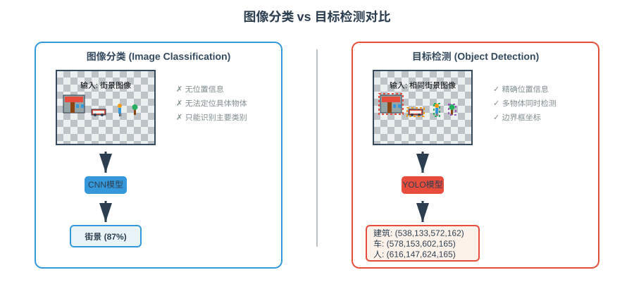
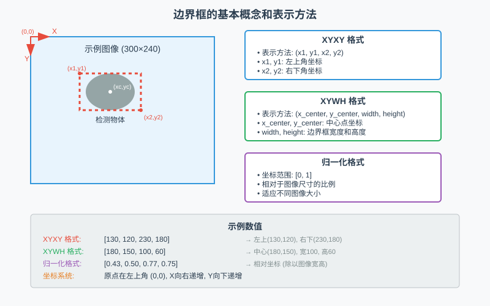
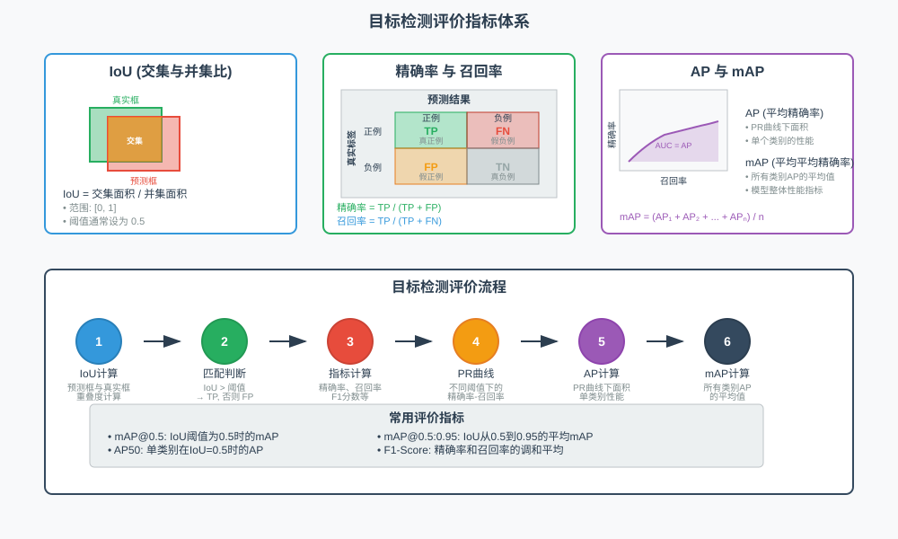
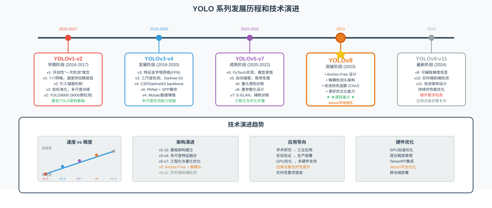
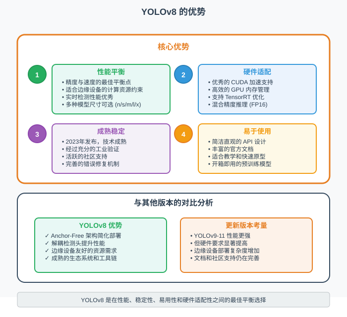
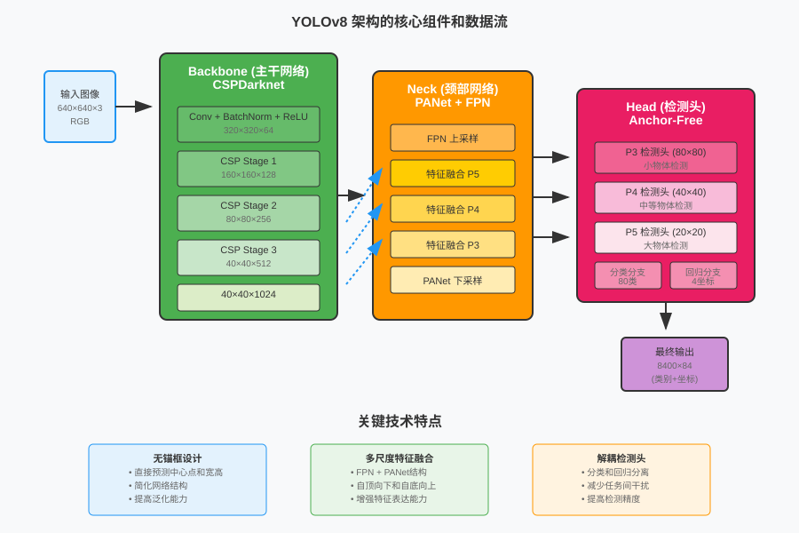

# 第18课：目标检测与 YOLO 实践

## 课程简介

在本课中，我们将从图像分类进阶到目标检测领域，学习如何不仅识别图像中的物体类别，还能精确定位它们的位置。通过深入理解目标检测的核心概念和评价指标，我们将重点学习 YOLO（You Only Look Once）系列模型的架构特点，特别是在边缘设备上表现优异的 YOLOv8 模型。

本课程将通过理论讲解与实践操作相结合的方式，带领您掌握目标检测的基本原理，学习 YOLOv8 在 Jetson 平台上的部署与使用方法，并构建一个实时目标检测系统。这些技能将为下一课的智能监控系统综合项目做好充分准备，体验从单一任务到复杂应用的完整开发流程。

## 课程目标

+ 理解目标检测的基本原理和评价指标
+ 学习 YOLOv8 模型的架构特点和优势
+ 掌握 YOLOv8 在 Jetson 平台上的部署与使用方法
+ 实践使用 YOLOv8 进行实时目标检测，为下一课的综合项目做准备

---

## 1. 从图像分类到目标检测

### 1.1. 图像分类的局限性

在前面的课程中，我们学习了如何使用 CNN 和迁移学习构建图像分类系统。这些系统能够回答"图像中有什么物体"的问题，但无法告诉我们"物体在哪里"。假设我们想要构建一个智能监控系统，仅仅知道"图像中有人"是不够的，我们还需要知道"人在图像的什么位置"、"有几个人"、"每个人的具体位置在哪里"。



> 图 18.1 图像分类与目标检测的差异
>

图像分类面临的主要限制包括：

+ **位置信息缺失**：分类模型只能告诉我们图像中存在哪些物体类别，但无法提供物体的具体位置信息。这就像有人告诉你"房间里有一把椅子"，但没有说椅子在房间的哪个角落。
+ **多物体处理困难**：当图像中包含多个不同类别的物体时，传统分类模型往往只能识别出最显著的一个，而忽略其他物体。例如，在一张同时包含猫、狗和鸟的图像中，模型可能只识别出最大或最中心的物体。
+ **精细定位需求**：在实际应用中，我们经常需要精确知道物体的边界，以便进行后续处理。比如在自动驾驶中，不仅要识别出行人，还要知道行人的确切位置和范围，以便规划安全的行驶路径。

### 1.2. 目标检测的核心优势

目标检测技术通过同时解决"分类"和"定位"两个任务，完美解决了图像分类的局限性：

+ **精确定位**：目标检测能够为每个检测到的物体提供精确的边界框（bounding box），告诉我们物体的位置和大小。这就像给每个物体画了一个矩形框，标明了它在图像中的确切位置。
+ **多物体检测**：可以同时检测图像中的多个不同物体，并为每个物体分别提供类别和位置信息。这使得模型能够理解复杂场景中的所有重要元素。
+ **端到端处理**：现代目标检测模型可以在一次前向传播中完成所有检测任务，既高效又准确，特别适合实时应用场景。

让我们通过一个简单的示例来理解图像分类和目标检测的差异：

```python
import cv2
import numpy as np
import matplotlib.pyplot as plt
from PIL import Image
import matplotlib

# 设置中文字体
matplotlib.rcParams['font.sans-serif'] = ['SimHei']
matplotlib.rcParams['axes.unicode_minus'] = False

class DetectionVsClassificationDemo:
    def __init__(self):
        """目标检测与图像分类对比演示"""
        print("初始化目标检测演示系统...")
    
    def load_demo_image(self):
        """加载演示图片"""
        image_path = "images/bus.jpg"
        
        try:
            image = Image.open(image_path)
            image_array = np.array(image.convert('RGB'))
            print("✓ 示例图片加载成功")
            return image_array
        except Exception as e:
            print(f"❌ 无法加载图片 {image_path}: {e}")
            print("请确保 images/bus.jpg 文件存在")
            return None
    
    def simulate_classification_result(self, image):
        """模拟图像分类的结果"""
        classification_result = {
            'predicted_class': 'vehicle',
            'confidence': 0.87,
            'description': '图像分类结果：主要物体为"车辆"，置信度87%'
        }
        return classification_result
    
    def simulate_detection_results(self, image):
        """模拟目标检测的结果"""
        height, width = image.shape[:2]
        
        # 基于bus.jpg图片内容设置的检测框
        detections = [
            {'class': 'bus', 'bbox': [int(width*0.1), int(height*0.15), int(width*0.85), int(height*0.9)], 'confidence': 0.94},
            {'class': 'person', 'bbox': [int(width*0.7), int(height*0.6), int(width*0.82), int(height*0.95)], 'confidence': 0.87},
            {'class': 'person', 'bbox': [int(width*0.15), int(height*0.65), int(width*0.25), int(height*0.9)], 'confidence': 0.82},
            {'class': 'car', 'bbox': [int(width*0.85), int(height*0.7), int(width*0.98), int(height*0.85)], 'confidence': 0.75}
        ]
        return detections
    
    def visualize_comparison(self):
        """可视化分类与检测的对比"""
        print("开始图像分类与目标检测对比演示...")
        
# 加载演示图片
        image = self.load_demo_image()
        if image is None:
            return None, None, None
        
        # 获取分类和检测结果
        classification_result = self.simulate_classification_result(image)
        detection_results = self.simulate_detection_results(image)
        
        # 创建对比图
        fig, (ax1, ax2) = plt.subplots(1, 2, figsize=(16, 8))
        
        # 显示图像分类结果
        ax1.imshow(image)
        ax1.set_title('图像分类：只能识别主要物体', fontsize=14, fontweight='bold')
        ax1.text(10, 30, classification_result['description'], 
                bbox=dict(boxstyle="round,pad=0.5", facecolor="yellow", alpha=0.8),
                fontsize=12, color='black', fontweight='bold')
        ax1.axis('off')
        
        # 显示目标检测结果
        ax2.imshow(image)
        ax2.set_title('目标检测：识别所有物体并定位', fontsize=14, fontweight='bold')
        
        # 绘制检测框
        colors = [(255, 0, 0), (0, 255, 0), (0, 0, 255), (255, 255, 0), (255, 0, 255)]
        
        for i, detection in enumerate(detection_results):
            bbox = detection['bbox']
            x1, y1, x2, y2 = bbox
            color = [c/255.0 for c in colors[i % len(colors)]]
            
            # 绘制边界框
            from matplotlib.patches import Rectangle
            rect = Rectangle((x1, y1), x2-x1, y2-y1, 
                           fill=False, edgecolor=color, linewidth=3)
            ax2.add_patch(rect)
            
            # 添加标签
            label = f"{detection['class']}: {detection['confidence']:.2f}"
            ax2.text(x1, y1-10, label, 
                    bbox=dict(boxstyle="round,pad=0.3", facecolor=color, alpha=0.8),
                    fontsize=10, color='white', fontweight='bold')
        
        ax2.axis('off')
        
        plt.tight_layout()
        plt.show()
        
        # 输出详细对比分析
        print("\n=== 技术对比分析 ===")
        print(f"图像分类结果:")
        print(f"  ✓ 识别主要物体: {classification_result['predicted_class']}")
        print(f"  ✓ 置信度: {classification_result['confidence']:.2f}")
        print(f"  ✗ 无法提供位置信息")
        print(f"  ✗ 无法识别多个物体")
        
        print(f"\n目标检测结果:")
        print(f"  ✓ 检测到 {len(detection_results)} 个物体")
        print(f"  ✓ 每个物体都有精确的位置信息")
        print(f"  ✓ 同时识别多种不同类别的物体")
        
        for i, detection in enumerate(detection_results):
            bbox = detection['bbox']
            print(f"    物体{i+1}: {detection['class']} - 位置({bbox[0]}, {bbox[1]}, {bbox[2]}, {bbox[3]}) - 置信度{detection['confidence']:.2f}")
        
        return image, classification_result, detection_results

# 运行演示
demo = DetectionVsClassificationDemo()
image, class_result, detect_results = demo.visualize_comparison()
```

> **核心函数**：
>
> + `Image.open()`: 加载真实图片文件，支持多种图像格式
> + `simulate_classification_result()`: 模拟图像分类的输出，展示只能识别主要物体的局限性
> + `simulate_detection_results()`: 基于真实图片内容模拟目标检测结果，包含多个物体的精确定位
> + `matplotlib.patches.Rectangle()`: 在真实图像上绘制检测边界框，可视化定位效果
>

这段演示代码通过分析真实图片中的内容，直观地展示了图像分类和目标检测的根本差异。以bus.jpg为例，图像分类只能告诉我们"这是一张包含车辆的图片"，而目标检测能够识别出公交车、行人、汽车等多个物体，并为每个物体提供位置信息。

## 2. 目标检测核心概念

### 2.1. 边界框与物体定位

边界框（Bounding Box）是目标检测中最基本的概念，它用一个矩形来框选图像中的目标物体。可以把边界框想象成给物体画了一个"相框"，这个相框恰好能够包含整个物体，同时又尽可能紧贴物体的边缘。



> 图 18.2 边界框的基本概念和表示方法
>

边界框通常用四个数值来表示：

+ **坐标表示方法**：最常用的是 (x1, y1, x2, y2) 格式，其中 (x1, y1) 是左上角坐标，(x2, y2) 是右下角坐标。还有一种是 (x_center, y_center, width, height) 格式，表示中心点坐标和宽高。
+ **坐标系统**：在计算机视觉中，图像坐标系的原点通常在左上角，x 轴向右延伸，y 轴向下延伸。这与数学中常见的坐标系不同，需要特别注意。
+ **尺寸归一化**：为了适应不同尺寸的图像，边界框坐标通常会被归一化到 [0,1] 范围内，即用相对于图像尺寸的比例来表示位置。

让我们通过代码来理解边界框的基本操作：

```python
import numpy as np
import matplotlib.pyplot as plt
import matplotlib.patches as patches
import cv2
from PIL import Image

class BoundingBoxDemo:
    def __init__(self):
        """边界框概念演示"""
        print("初始化边界框演示系统...")
    
    def load_sample_image(self):
        """加载示例图片"""
        image_path = "images/zidane.jpg"
        
        try:
            image = Image.open(image_path)
            image_array = np.array(image.convert('RGB'))
            print("✓ 图片加载成功")
            return image_array
        except Exception as e:
            print(f"❌ 无法加载图片 {image_path}: {e}")
            print("请确保 images/zidane.jpg 文件存在")
            return None
    
    def define_sample_bboxes(self, image):
        """为zidane.jpg定义边界框"""
        height, width = image.shape[:2]
        
        # 基于zidane.jpg图片内容定义的边界框
        bboxes = [
            {
                'bbox': [int(width*0.25), int(height*0.1), int(width*0.75), int(height*0.9)],
                'label': '人物',
                'color': 'red',
                'confidence': 0.95
            },
            {
                'bbox': [int(width*0.6), int(height*0.4), int(width*0.85), int(height*0.7)],
                'label': '运动装备',
                'color': 'blue',
                'confidence': 0.78
            }
        ]
        
        return bboxes
    
    def convert_bbox_format(self, bbox, format_from='xyxy', format_to='xywh', img_width=640, img_height=480):
        """转换边界框格式"""
        if format_from == 'xyxy' and format_to == 'xywh':
            x1, y1, x2, y2 = bbox
            x_center = (x1 + x2) / 2
            y_center = (y1 + y2) / 2
            width = x2 - x1
            height = y2 - y1
            return [x_center, y_center, width, height]
        
        elif format_from == 'xywh' and format_to == 'xyxy':
            x_center, y_center, width, height = bbox
            x1 = x_center - width / 2
            y1 = y_center - height / 2
            x2 = x_center + width / 2
            y2 = y_center + height / 2
            return [x1, y1, x2, y2]
        
        elif format_from == 'xyxy' and format_to == 'normalized':
            x1, y1, x2, y2 = bbox
            return [x1/img_width, y1/img_height, x2/img_width, y2/img_height]
        
        elif format_from == 'normalized' and format_to == 'xyxy':
            x1_norm, y1_norm, x2_norm, y2_norm = bbox
            return [x1_norm*img_width, y1_norm*img_height, x2_norm*img_width, y2_norm*img_height]
        
        return bbox
    
    def calculate_iou(self, bbox1, bbox2):
        """计算两个边界框的IoU"""
        x1_1, y1_1, x2_1, y2_1 = bbox1
        x1_2, y1_2, x2_2, y2_2 = bbox2
        
        # 计算交集区域
        x1_intersect = max(x1_1, x1_2)
        y1_intersect = max(y1_1, y1_2)
        x2_intersect = min(x2_1, x2_2)
        y2_intersect = min(y2_1, y2_2)
        
        if x1_intersect >= x2_intersect or y1_intersect >= y2_intersect:
            return 0.0
        
        intersection_area = (x2_intersect - x1_intersect) * (y2_intersect - y1_intersect)
        
        # 计算各自面积和并集面积
        area1 = (x2_1 - x1_1) * (y2_1 - y1_1)
        area2 = (x2_2 - x1_2) * (y2_2 - y1_2)
        union_area = area1 + area2 - intersection_area
        
        return intersection_area / union_area if union_area > 0 else 0.0
    
    def visualize_bbox_concepts(self):
        """可视化边界框核心概念"""
        print("开始边界框概念演示...")
        
        # 加载示例图片
        image = self.load_sample_image()
        if image is None:
            return
        
        height, width = image.shape[:2]
        
        # 定义边界框
        bboxes = self.define_sample_bboxes(image)
        
        # 创建演示图表
        fig, ((ax1, ax2), (ax3, ax4)) = plt.subplots(2, 2, figsize=(16, 12))
        
        # 1. 原始图片
        ax1.imshow(image)
        ax1.set_title('原始图片', fontsize=14, fontweight='bold')
        ax1.axis('off')
        
        # 2. 边界框标注
        ax2.imshow(image)
        ax2.set_title('边界框标注演示', fontsize=14, fontweight='bold')
        
        colors = ['red', 'blue', 'green', 'orange', 'purple']
        
        for i, bbox_info in enumerate(bboxes):
            bbox = bbox_info['bbox']
            x1, y1, x2, y2 = bbox
            
            # 绘制边界框
            rect = patches.Rectangle((x1, y1), x2-x1, y2-y1, 
                                   linewidth=3, edgecolor=colors[i], 
                                   facecolor='none', linestyle='--')
            ax2.add_patch(rect)
            
            # 添加标签
            label_text = f"{bbox_info['label']}: {bbox_info['confidence']:.2f}"
            ax2.text(x1, y1-10, label_text, 
                    bbox=dict(boxstyle="round,pad=0.3", facecolor=colors[i], alpha=0.7),
                    fontsize=10, color='white', fontweight='bold')
        
        ax2.axis('off')
        
        # 3. 格式转换示例
        ax3.axis('off')
        ax3.set_title('边界框格式转换', fontsize=14, fontweight='bold')
        
        if bboxes:
            example_bbox = bboxes[0]['bbox']
            xywh = self.convert_bbox_format(example_bbox, 'xyxy', 'xywh')
            normalized = self.convert_bbox_format(example_bbox, 'xyxy', 'normalized', width, height)
            area = (example_bbox[2] - example_bbox[0]) * (example_bbox[3] - example_bbox[1])
            
            format_text = f"""边界框格式转换示例:

XYXY格式 (像素坐标):
[{example_bbox[0]}, {example_bbox[1]}, {example_bbox[2]}, {example_bbox[3]}]

XYWH格式 (中心点+宽高):
[{xywh[0]:.1f}, {xywh[1]:.1f}, {xywh[2]:.1f}, {xywh[3]:.1f}]

归一化格式 (0-1范围):
[{normalized[0]:.3f}, {normalized[1]:.3f}, {normalized[2]:.3f}, {normalized[3]:.3f}]

边界框面积: {area:.0f} 像素²
"""
            
            ax3.text(0.1, 0.9, format_text, fontsize=11, verticalalignment='top',
                    bbox=dict(boxstyle="round,pad=0.5", facecolor="lightblue", alpha=0.8))
        
        # 4. IoU计算演示
        ax4.imshow(image)
        ax4.set_title('IoU (交集比并集) 计算演示', fontsize=14, fontweight='bold')
        
        if len(bboxes) >= 2:
            # 选择两个边界框演示IoU
            bbox1 = bboxes[0]['bbox']
            bbox2 = bboxes[1]['bbox']
            
            # 绘制两个边界框
            rect1 = patches.Rectangle((bbox1[0], bbox1[1]), bbox1[2]-bbox1[0], bbox1[3]-bbox1[1], 
                                    linewidth=3, edgecolor='red', facecolor='red', alpha=0.3)
            rect2 = patches.Rectangle((bbox2[0], bbox2[1]), bbox2[2]-bbox2[0], bbox2[3]-bbox2[1], 
                                    linewidth=3, edgecolor='blue', facecolor='blue', alpha=0.3)
            
            ax4.add_patch(rect1)
            ax4.add_patch(rect2)
            
            # 计算并显示IoU
            iou_value = self.calculate_iou(bbox1, bbox2)
            ax4.text(10, height-30, f'IoU = {iou_value:.3f}', 
                    bbox=dict(boxstyle="round,pad=0.3", facecolor="white", alpha=0.9),
                    fontsize=12, color='black', fontweight='bold')
            
            ax4.text(10, height-60, f'红框: {bboxes[0]["label"]}', 
                    bbox=dict(boxstyle="round,pad=0.3", facecolor="red", alpha=0.7),
                    fontsize=10, color='white', fontweight='bold')
            
            ax4.text(10, height-90, f'蓝框: {bboxes[1]["label"]}', 
                    bbox=dict(boxstyle="round,pad=0.3", facecolor="blue", alpha=0.7),
                    fontsize=10, color='white', fontweight='bold')
        
        ax4.axis('off')
        
        plt.tight_layout()
        plt.show()
        
        # 输出详细技术说明
        print("\n=== 边界框技术要点 ===")
        print("1. 坐标系统:")
        print("   - 原点在左上角 (0,0)")
        print("   - X轴向右递增，Y轴向下递增")
        
        print("\n2. 常用格式:")
        print("   - XYXY: (x1, y1, x2, y2) - 左上角和右下角坐标")
        print("   - XYWH: (x_center, y_center, width, height) - 中心点和尺寸")
        print("   - 归一化: 坐标除以图像尺寸，范围[0,1]")
        
        print("\n3. IoU指标:")
        print("   - 取值范围: [0, 1]")
        print("   - 0表示无重叠，1表示完全重叠")
        print("   - 通常0.5作为检测成功的阈值")

# 运行边界框演示
demo = BoundingBoxDemo()
demo.visualize_bbox_concepts()
```

> **核心函数**：
>
> + `load_sample_image()`: 加载真实样本图片（zidane.jpg），提供实际的检测场景
> + `define_sample_bboxes()`: 基于真实图片内容定义边界框，展示实际标注过程
> + `convert_bbox_format()`: 转换边界框的表示格式，支持 xyxy、xywh 和归一化格式之间的相互转换
> + `calculate_iou()`: 计算两个边界框的交集与并集比（IoU），用于评估检测结果的质量
>

这段代码通过具体的示例展示了边界框的核心概念和基本操作。代码演示了如何在运动员图像中定义边界框、转换不同的坐标格式，以及计算边界框之间的 IoU 值。

### 2.2. 目标检测评价指标

在目标检测中，我们需要同时评估"分类准确性"和"定位精确性"。这比图像分类复杂得多，因为即使预测了正确的类别，如果位置不准确，也不能算作成功的检测。



> 图 18.3 目标检测评价指标体系
>

目标检测的评价指标体系包括以下几个核心概念：

+ **IoU 阈值（IoU Threshold）**：用来判断检测是否成功的标准。通常设置为 0.5，意味着预测框与真实框的重叠度必须超过 50% 才被认为是正确检测。
+ **精确率（Precision）**：在所有预测为正例的结果中，真正正确的比例。公式为：Precision = TP / (TP + FP)，其中 TP 是真正例，FP 是假正例。
+ **召回率（Recall）**：在所有真实的正例中，被正确识别的比例。公式为：Recall = TP / (TP + FN)，其中 FN 是假负例。
+ **平均精确率（Average Precision, AP）**：对于单个类别，在不同召回率水平下精确率的平均值。这是目标检测中最重要的指标之一。
+ **平均平均精确率（Mean Average Precision, mAP）**：所有类别 AP 的平均值，是评估整个检测模型性能的综合指标。

让我们通过代码来理解这些评价指标：

```python
import numpy as np
import matplotlib.pyplot as plt
import cv2
from PIL import Image

class DetectionMetricsDemo:
    def __init__(self):
        """目标检测评价指标演示"""
        print("初始化检测评价指标演示系统...")
    
    def load_demo_image(self):
        """加载演示图片"""
        image_path = "images/bus.jpg"
        
        try:
            image = Image.open(image_path)
            image_array = np.array(image.convert('RGB'))
            print("✓ 演示图片加载成功")
            return image_array
        except Exception as e:
            print(f"❌ 无法加载图片 {image_path}: {e}")
            print("请确保 images/bus.jpg 文件存在")
            return None
    
    def create_ground_truth_annotations(self, image):
        """创建真实标注数据（基于bus.jpg内容）"""
        height, width = image.shape[:2]
        
        # 基于bus.jpg图片内容的真实标注
        gt_boxes = [
            [int(width*0.1), int(height*0.15), int(width*0.85), int(height*0.9)],   # 公交车
            [int(width*0.7), int(height*0.6), int(width*0.82), int(height*0.95)],   # 人1
            [int(width*0.15), int(height*0.65), int(width*0.25), int(height*0.9)],  # 人2
            [int(width*0.85), int(height*0.7), int(width*0.98), int(height*0.85)],  # 汽车
        ]
        
        gt_labels = [1, 0, 0, 2]  # 0=person, 1=bus, 2=car
        class_names = ['person', 'bus', 'car']
        
        return gt_boxes, gt_labels, class_names
    
    def create_model_predictions(self, image):
        """创建模型预测结果"""
        height, width = image.shape[:2]
        
        # 模拟模型预测结果，包含TP、FP、遗漏等情况
        pred_boxes = [
            [int(width*0.12), int(height*0.17), int(width*0.83), int(height*0.88)], # 接近GT1 - TP
            [int(width*0.72), int(height*0.62), int(width*0.8), int(height*0.93)],  # 接近GT2 - TP  
            [int(width*0.87), int(height*0.72), int(width*0.96), int(height*0.83)], # 接近GT4 - TP
            [int(width*0.3), int(height*0.1), int(width*0.5), int(height*0.3)],     # 假正例 - FP
            [int(width*0.05), int(height*0.8), int(width*0.15), int(height*0.95)], # 假正例 - FP
        ]
        
        pred_labels = [1, 0, 2, 0, 0]  # 预测的类别
        pred_scores = [0.94, 0.87, 0.75, 0.68, 0.58]  # 置信度分数
        
        return pred_boxes, pred_labels, pred_scores
    
    def calculate_iou(self, bbox1, bbox2):
        """计算IoU"""
        x1_1, y1_1, x2_1, y2_1 = bbox1
        x1_2, y1_2, x2_2, y2_2 = bbox2
        
        x1_intersect = max(x1_1, x1_2)
        y1_intersect = max(y1_1, y1_2)
        x2_intersect = min(x2_1, x2_2)
        y2_intersect = min(y2_1, y2_2)
        
        if x1_intersect >= x2_intersect or y1_intersect >= y2_intersect:
            return 0.0
        
        intersection = (x2_intersect - x1_intersect) * (y2_intersect - y1_intersect)
        area1 = (x2_1 - x1_1) * (y2_1 - y1_1)
        area2 = (x2_2 - x1_2) * (y2_2 - y1_2)
        union = area1 + area2 - intersection
        
        return intersection / union if union > 0 else 0.0
    
    def evaluate_predictions(self, gt_boxes, gt_labels, pred_boxes, pred_labels, pred_scores, iou_threshold=0.5):
        """评估预测结果"""
        results = {
            'tp': [],
            'fp': [],
            'scores': [],
            'gt_count': len(gt_boxes)
        }
        
        gt_matched = [False] * len(gt_boxes)
        
        # 按置信度排序
        sorted_indices = np.argsort(pred_scores)[::-1]
        
        for pred_idx in sorted_indices:
            pred_box = pred_boxes[pred_idx]
            pred_label = pred_labels[pred_idx]
            pred_score = pred_scores[pred_idx]
            
            # 寻找最佳匹配的GT
            best_iou = 0
            best_gt_idx = -1
            
            for gt_idx, (gt_box, gt_label) in enumerate(zip(gt_boxes, gt_labels)):
                if gt_matched[gt_idx] or gt_label != pred_label:
                    continue
                    
                iou = self.calculate_iou(pred_box, gt_box)
                if iou > best_iou:
                    best_iou = iou
                    best_gt_idx = gt_idx
            
            # 判断TP或FP
            if best_iou >= iou_threshold and best_gt_idx != -1:
                results['tp'].append(1)
                results['fp'].append(0)
                gt_matched[best_gt_idx] = True
            else:
                results['tp'].append(0)
                results['fp'].append(1)
            
            results['scores'].append(pred_score)
        
        return results
    
    def calculate_precision_recall(self, tp, fp, gt_count):
        """计算精确率和召回率"""
        tp_cumsum = np.cumsum(tp)
        fp_cumsum = np.cumsum(fp)
        
        precision = tp_cumsum / (tp_cumsum + fp_cumsum + 1e-8)
        recall = tp_cumsum / (gt_count + 1e-8)
        
        return precision, recall
    
    def calculate_ap(self, precision, recall):
        """计算平均精确率(AP)"""
        recall = np.concatenate(([0], recall, [1]))
        precision = np.concatenate(([0], precision, [0]))
        
        # 确保精确率单调递减
        for i in range(len(precision) - 2, -1, -1):
            precision[i] = max(precision[i], precision[i + 1])
        
        # 计算曲线下面积
        indices = np.where(recall[1:] != recall[:-1])[0] + 1
        ap = np.sum((recall[indices] - recall[indices - 1]) * precision[indices])
        
        return ap
    
    def visualize_evaluation_process(self):
        """可视化评估过程"""
        print("开始目标检测评价指标演示...")
        
        # 加载图片和数据
        image = self.load_demo_image()
        if image is None:
            return None, None, None, None
        
        gt_boxes, gt_labels, class_names = self.create_ground_truth_annotations(image)
        pred_boxes, pred_labels, pred_scores = self.create_model_predictions(image)
        
        # 评估结果
        results = self.evaluate_predictions(gt_boxes, gt_labels, pred_boxes, pred_labels, pred_scores)
        precision, recall = self.calculate_precision_recall(results['tp'], results['fp'], results['gt_count'])
        ap = self.calculate_ap(precision, recall)
        
        # 创建可视化
        fig, ((ax1, ax2), (ax3, ax4)) = plt.subplots(2, 2, figsize=(16, 12))
        
        # 1. 真实标注 (Ground Truth)
        ax1.imshow(image)
        ax1.set_title('真实标注 (Ground Truth)', fontsize=14, fontweight='bold')
        
        colors_gt = ['green', 'blue', 'red', 'orange']
        for i, (bbox, label) in enumerate(zip(gt_boxes, gt_labels)):
            x1, y1, x2, y2 = bbox
            rect = plt.Rectangle((x1, y1), x2-x1, y2-y1, 
                               fill=False, edgecolor=colors_gt[i], linewidth=3)
            ax1.add_patch(rect)
            ax1.text(x1, y1-10, f'GT: {class_names[label]}', 
                    color=colors_gt[i], fontweight='bold', fontsize=10)
        ax1.axis('off')
        
        # 2. 模型预测结果
        ax2.imshow(image)
        ax2.set_title('模型预测结果', fontsize=14, fontweight='bold')
        
        colors_pred = ['red', 'blue', 'purple', 'brown', 'pink']
        for i, (bbox, label, score, is_tp) in enumerate(zip(pred_boxes, pred_labels, pred_scores, results['tp'])):
            x1, y1, x2, y2 = bbox
            
            # TP用实线，FP用虚线
            linestyle = '-' if is_tp else '--'
            status = 'TP' if is_tp else 'FP'
            
            rect = plt.Rectangle((x1, y1), x2-x1, y2-y1, 
                               fill=False, edgecolor=colors_pred[i], 
                               linewidth=2, linestyle=linestyle)
            ax2.add_patch(rect)
            ax2.text(x1, y2+15, f'{status}: {class_names[label]} ({score:.2f})', 
                    color=colors_pred[i], fontweight='bold', fontsize=9)
        ax2.axis('off')
        
        # 3. 精确率-召回率曲线
        ax3.plot(recall, precision, 'b-', linewidth=2, marker='o', markersize=4)
        ax3.fill_between(recall, precision, alpha=0.3)
        ax3.set_xlabel('召回率 (Recall)')
        ax3.set_ylabel('精确率 (Precision)')
        ax3.set_title(f'PR曲线 (AP = {ap:.3f})', fontsize=14, fontweight='bold')
        ax3.grid(True, alpha=0.3)
        ax3.set_xlim(0, 1)
        ax3.set_ylim(0, 1)
        
        # 4. 评估统计
        ax4.axis('off')
        ax4.set_title('评估结果统计', fontsize=14, fontweight='bold')
        
        tp_count = sum(results['tp'])
        fp_count = sum(results['fp'])
        fn_count = results['gt_count'] - tp_count
        
        final_precision = tp_count / (tp_count + fp_count) if (tp_count + fp_count) > 0 else 0
        final_recall = tp_count / (tp_count + fn_count) if (tp_count + fn_count) > 0 else 0
        f1_score = 2 * (final_precision * final_recall) / (final_precision + final_recall) if (final_precision + final_recall) > 0 else 0
        
        stats_text = f"""检测结果统计 (IoU阈值 = 0.5):

基本指标:
  真正例 (TP): {tp_count}
  假正例 (FP): {fp_count}
  假负例 (FN): {fn_count}
  真实目标总数: {results['gt_count']}

性能指标:
  精确率 (Precision): {final_precision:.3f}
  召回率 (Recall): {final_recall:.3f}
  F1分数: {f1_score:.3f}
  平均精确率 (AP): {ap:.3f}

指标解释:
  精确率: 预测为正例中真正正确的比例
  召回率: 真实正例中被正确识别的比例
  AP: 不同召回率下精确率的平均值
"""
        
        ax4.text(0.05, 0.95, stats_text, fontsize=11, verticalalignment='top',
                bbox=dict(boxstyle="round,pad=0.5", facecolor="lightblue", alpha=0.8))
        
        plt.tight_layout()
        plt.show()
        
        # 输出详细分析
        print("\n=== 评价指标详细分析 ===")
        print(f"检测评估结果:")
        print(f"  TP (真正例): {tp_count} - 正确检测到的目标")
        print(f"  FP (假正例): {fp_count} - 错误的检测结果")
        print(f"  FN (假负例): {fn_count} - 遗漏的真实目标")
        
        print(f"\n关键性能指标:")
        print(f"  精确率: {final_precision:.3f} - 模型预测的准确性")
        print(f"  召回率: {final_recall:.3f} - 模型发现目标的能力")
        print(f"  AP: {ap:.3f} - 综合评价指标")
        
        return results, precision, recall, ap

# 运行评价指标演示
demo = DetectionMetricsDemo()
results, precision, recall, ap = demo.visualize_evaluation_process()
```

> **核心函数**：
>
> + `create_ground_truth_annotations()`: 基于真实图片（bus.jpg）创建人工标注数据，包含公交车、行人、汽车等物体
> + `create_model_predictions()`: 模拟模型在真实场景中的预测结果，包含TP、FP等不同情况
> + `evaluate_predictions()`: 将预测结果与真实标注进行匹配，根据IoU阈值判断检测成功与否
> + `calculate_precision_recall()`: 基于真实评估结果计算精确率和召回率曲线
> + `calculate_ap()`: 计算平均精确率，展示模型在实际场景中的综合性能
>

这段代码全面展示了目标检测的评价体系。 运行代码后，我们可以看到如何在实际图像中区分真正例（TP）、假正例（FP）和假负例（FN），并基于这些结果计算精确率、召回率和mAP等关键指标。真实场景的使用让评价过程更加直观和可理解。  

## 3. YOLO 架构深入理解

### 3.1. YOLO 发展历程与版本选择

YOLO（You Only Look Once）是目标检测领域的一个革命性架构，它的核心理念是"一次观察就能完成检测"。与传统的两阶段检测方法不同，YOLO 将目标检测重新定义为一个单一的回归问题，直接从图像像素预测边界框坐标和类别概率。



> 图 18.4 YOLO 系列发展历程和技术演进
>

YOLO 系列的发展经历了多个重要阶段：

1. **YOLOv1 (2016)**：首次提出"一次检测"的概念，将整个图像分为 S×S 网格，每个网格负责预测其中心落在该网格内的物体。虽然速度很快，但精度相对较低，特别是对小物体的检测效果不佳。
2. **YOLOv2/YOLO9000 (2017)**：引入了锚框（anchor boxes）概念，大幅提升了检测精度。同时提出了多尺度训练、批标准化等技术，在保持速度优势的同时显著改善了性能。
3. **YOLOv3 (2018)**：采用了 FPN（特征金字塔网络）结构，在三个不同尺度上进行检测，大大改善了对不同大小物体的检测能力。引入了 Darknet-53 作为 backbone 网络。
4. **YOLOv4 (2020)**：集成了大量的训练技巧和网络结构优化，包括 CSPDarknet53、PANet、SPP 等，在精度和速度之间取得了很好的平衡。
5. **YOLOv5 (2020)**：由 Ultralytics 公司开发，不是原作者的作品，但因为其优秀的工程实现和易用性而广受欢迎。提供了多种不同大小的模型变体。
6. **YOLOv6-v8 (2022-2023)**：持续的架构优化和工程改进，YOLOv8 在精度、速度和易用性方面取得了显著进步。
7. **YOLOv9-v11 (2024)**：最新的版本引入了更多创新技术，但对硬件要求也相应提高。

**为什么选择 YOLOv8**：



> 图 18.5 YOLOv8 的优势
>

考虑到本课程的教学目标和 Jetson J1020 v2 的硬件特性，我们选择 YOLOv8 作为主要实践对象，原因如下：

+ **成熟稳定**：YOLOv8 在 2023 年发布，经过了充分的测试和优化，社区支持完善，文档详尽。
+ **性能平衡**：在精度和速度之间取得了很好的平衡，特别适合边缘设备部署。
+ **硬件适配**：对 Jetson 平台有良好的支持和优化，能够充分利用硬件加速能力。
+ **教学友好**：API 设计简洁，易于理解和使用，非常适合教学和快速原型开发。
+ **产业应用**：在工业界有广泛应用，学习价值高，技术相对成熟。

虽然 YOLOv11 是当前最新版本，但考虑到边缘设备的性能限制和教学的实用性，YOLOv8 仍然是最佳选择。

### 3.2. YOLOv8 架构特点

YOLOv8 作为 YOLO 系列的重要代表，集成了多年来的技术积累和改进，具有以下突出特点：



> 图 18.6 YOLOv8 架构的核心组件和数据流
>

**模块化设计**：YOLOv8 采用了高度模块化的设计，主要包含以下几个部分：

1. **主干网络（Backbone）**：负责特征提取，基于 CSPDarknet 的改进版本，通过残差连接和跨阶段部分连接提高特征提取能力。这相当于模型的"眼睛"，用来观察和理解图像内容。
2. **颈部网络（Neck）**：采用 PANet（路径聚合网络）结构，实现多尺度特征融合，确保不同大小的物体都能被有效检测。这就像大脑的视觉皮层，负责整合不同层次的视觉信息。
3. **检测头（Head）**：解耦的检测头设计，将分类和回归任务分离，提高检测精度。相当于让两个专家分别负责"识别物体是什么"和"确定物体在哪里"。

**关键技术创新**：

+ **无锚框设计（Anchor-Free）**：摒弃了传统的锚框机制，直接预测物体的中心点和宽高，简化了网络结构并提高了泛化能力。传统方法需要预定义多种尺寸的锚框，然后通过调整最相似的锚框来预测目标，而 YOLOv8 直接预测目标的位置和大小。
+ **解耦检测头**：将目标分类和边界框回归分别处理，避免了两个任务之间的相互干扰。这种设计让每个任务都有专门的网络分支，提高了整体性能。
+ **高效的损失函数**：使用 CIOU 损失和分类损失的组合，提供更精确的梯度信息。CIOU 损失不仅考虑边界框的重叠度，还考虑中心点距离和长宽比的匹配。
+ **数据增强策略**：集成了 Mosaic、MixUp 等现代数据增强技术，提高模型的鲁棒性。

让我们通过代码来理解 YOLOv8 的核心概念：

```python
import torch
import numpy as np
import matplotlib.pyplot as plt
import cv2
from PIL import Image

class YOLOv8ConceptDemo:
    def __init__(self):
        """YOLOv8核心概念演示"""
        self.device = torch.device('cuda' if torch.cuda.is_available() else 'cpu')
        print(f"使用设备: {self.device}")
    
    def load_real_image_for_grid_demo(self):
        """加载真实图片用于网格演示"""
        image_path = "images/zidane.jpg"
        
        try:
            image = Image.open(image_path)
            # 调整到标准输入尺寸
            image = image.resize((640, 640))
            image_array = np.array(image.convert('RGB'))
            return image_array
        except Exception as e:
            print(f"❌ 无法加载图片 {image_path}: {e}")
            print("请确保 images/zidane.jpg 文件存在")
            return None
    
    def demonstrate_multi_scale_detection(self):
        """演示多尺度检测网格系统"""
        print("演示YOLOv8多尺度检测网格系统...")
        
        # 加载演示图片
        image = self.load_real_image_for_grid_demo()
        if image is None:
            return
        
        # YOLOv8的三个检测层尺寸
        grid_sizes = [80, 40, 20]  # 对应640输入的P3, P4, P5层
        
        # 使用2x2布局
        fig, axes = plt.subplots(2, 2, figsize=(16, 16))
        
        # 原始图片 (左上角)
        axes[0, 0].imshow(image)
        axes[0, 0].set_title('输入图片 (640×640)', fontsize=14, fontweight='bold')
        axes[0, 0].axis('off')
        
        # 不同尺度的网格
        scale_info = [
            ('P3层 (80×80网格)', '检测小物体', 'orange'),
            ('P4层 (40×40网格)', '检测中等物体', 'green'),  
            ('P5层 (20×20网格)', '检测大物体', 'red')
        ]
        
        # 网格图位置：右上角、左下角、右下角
        positions = [(0, 1), (1, 0), (1, 1)]
        
        for i, (grid_size, (title, desc, color)) in enumerate(zip(grid_sizes, scale_info)):
            row, col = positions[i]
            ax = axes[row, col]
            
            ax.imshow(image)
            
            # 绘制网格
            step = 640 // grid_size
            for x in range(0, 641, step):
                ax.axvline(x=x, color=color, linewidth=1.5, alpha=0.8)
            for y in range(0, 641, step):
                ax.axhline(y=y, color=color, linewidth=1.5, alpha=0.8)
            
            ax.set_title(f'{title}\n{desc}', fontsize=12, fontweight='bold')
            
            # 在图片上添加网格信息
            info_text = f'网格大小: {step}×{step}像素\n总网格数: {grid_size}×{grid_size}'
            ax.text(10, 50, info_text, 
                   bbox=dict(boxstyle="round,pad=0.5", facecolor=color, alpha=0.8),
                   fontsize=10, color='white', fontweight='bold')
            
            ax.axis('off')
        
        plt.tight_layout()
        plt.show()
        
        print(f"\nYOLOv8多尺度检测说明:")
        print(f"  • P3层 (80×80网格): 每个网格8×8像素，适合检测小物体")
        print(f"  • P4层 (40×40网格): 每个网格16×16像素，适合检测中等物体")  
        print(f"  • P5层 (20×20网格): 每个网格32×32像素，适合检测大物体")
        print(f"  • 总检测点: 80×80 + 40×40 + 20×20 = {80*80 + 40*40 + 20*20} 个")
    
    def demonstrate_anchor_free_vs_anchor_based(self):
        """演示Anchor-Free与Anchor-Based方法对比"""
        print("\n演示Anchor-Free检测方法...")
        
        fig, (ax1, ax2) = plt.subplots(1, 2, figsize=(14, 7))
        
        # 创建示例场景
        img_size = 300
        target_center = (150, 150)
        target_size = (80, 60)
        
        # Anchor-Based方法演示
        ax1.set_xlim(0, img_size)
        ax1.set_ylim(0, img_size)
        ax1.invert_yaxis()
        ax1.set_title('传统Anchor-Based方法', fontsize=14, fontweight='bold')
        
        # 预定义的不同尺寸锚框
        anchor_sizes = [(40, 30), (60, 45), (80, 60), (100, 75), (120, 90)]
        colors = ['red', 'blue', 'green', 'orange', 'purple']
        
        for i, (w, h) in enumerate(anchor_sizes):
            x1 = target_center[0] - w//2
            y1 = target_center[1] - h//2
            
            rect = plt.Rectangle((x1, y1), w, h, fill=False, 
                               edgecolor=colors[i], linewidth=2, linestyle='--', alpha=0.7)
            ax1.add_patch(rect)
            ax1.text(x1-10, y1, f'Anchor{i+1}', color=colors[i], fontsize=9, fontweight='bold')
        
        # 真实目标
        target_rect = plt.Rectangle((target_center[0] - target_size[0]//2, target_center[1] - target_size[1]//2), 
                                   target_size[0], target_size[1], fill=False, 
                                   edgecolor='black', linewidth=4)
        ax1.add_patch(target_rect)
        ax1.text(target_center[0]-20, target_center[1], '目标', ha='center', va='center',
                fontweight='bold', bbox=dict(boxstyle="round,pad=0.3", facecolor="yellow", alpha=0.8))
        
        ax1.text(10, 280, '需要预定义多种尺寸的锚框\n选择最匹配的锚框进行调整', 
                bbox=dict(boxstyle="round,pad=0.5", facecolor="lightcoral", alpha=0.8),
                fontsize=10)
        
        # Anchor-Free方法演示
        ax2.set_xlim(0, img_size)
        ax2.set_ylim(0, img_size)
        ax2.invert_yaxis()
        ax2.set_title('YOLOv8 Anchor-Free方法', fontsize=14, fontweight='bold')
        
        # 绘制网格
        grid_size = 30
        for x in range(0, img_size+1, grid_size):
            ax2.axvline(x=x, color='gray', linewidth=1, alpha=0.5)
        for y in range(0, img_size+1, grid_size):
            ax2.axhline(y=y, color='gray', linewidth=1, alpha=0.5)
        
        # 目标中心所在网格
        grid_x = target_center[0] // grid_size
        grid_y = target_center[1] // grid_size
        grid_rect = plt.Rectangle((grid_x * grid_size, grid_y * grid_size), 
                                 grid_size, grid_size, fill=True, 
                                 facecolor='yellow', alpha=0.4, edgecolor='red', linewidth=2)
        ax2.add_patch(grid_rect)
        
        # 中心点
        ax2.plot(target_center[0], target_center[1], 'ro', markersize=10)
        ax2.text(target_center[0]+15, target_center[1]-15, '中心点直接预测', color='red', fontweight='bold')
        
        # 直接预测的边界框
        direct_rect = plt.Rectangle((target_center[0] - target_size[0]//2, target_center[1] - target_size[1]//2), 
                                   target_size[0], target_size[1], fill=False, 
                                   edgecolor='green', linewidth=4)
        ax2.add_patch(direct_rect)
        
        ax2.text(10, 280, '直接预测目标中心点和尺寸\n不需要预定义锚框', 
                bbox=dict(boxstyle="round,pad=0.5", facecolor="lightgreen", alpha=0.8),
                fontsize=10)
        
        plt.tight_layout()
        plt.show()
        
        print(f"\n方法对比总结:")
        print(f"Anchor-Based方法:")
        print(f"  ✗ 需要预定义多种尺寸锚框")
        print(f"  ✗ 超参数多，调优复杂")
        print(f"  ✗ 对新场景适应性差")
        
        print(f"\nAnchor-Free方法 (YOLOv8):")
        print(f"  ✓ 直接预测目标位置和尺寸")
        print(f"  ✓ 网络结构更简洁")
        print(f"  ✓ 泛化能力更强")
        print(f"  ✓ 训练更稳定")
    
    def demonstrate_detection_output_format(self):
        """演示YOLOv8输出格式"""
        print(f"\n演示YOLOv8输出格式...")
        
        # 模拟YOLOv8输出
        batch_size = 1
        num_detections = 8400  # 80×80 + 40×40 + 20×20
        num_classes = 80
        
        print(f"YOLOv8输出张量形状解析:")
        print(f"  输出形状: [{batch_size}, {num_detections}, {4 + num_classes}]")
        print(f"  批次大小: {batch_size}")
        print(f"  候选检测数: {num_detections}")
        print(f"  每个检测包含: 4个坐标 + {num_classes}个类别概率")
        
        # 创建示例输出数据
        sample_detections = torch.randn(1, 10, 84)  # 简化为10个检测
        
        print(f"\n输出格式示例:")
        print(f"前4维: [x_center, y_center, width, height] (归一化坐标)")
        print(f"后80维: 各类别的概率分数")
        
        # 解析前3个检测结果
        print(f"\n示例检测解析:")
        class_names = ['person', 'bicycle', 'car', 'motorcycle', 'airplane']
        
        for i in range(3):
            detection = sample_detections[0, i]
            
            # 边界框坐标
            x_center, y_center, width, height = detection[:4]
            
            # 类别概率
            class_probs = torch.softmax(detection[4:84], dim=0)
            max_prob, max_class = torch.max(class_probs, dim=0)
            
            print(f"  检测{i+1}:")
            print(f"    中心坐标: ({x_center:.3f}, {y_center:.3f})")
            print(f"    尺寸: {width:.3f} × {height:.3f}")
            print(f"    最可能类别: {class_names[max_class.item() % len(class_names)]}")
            print(f"    置信度: {max_prob:.3f}")
    
    def run_architecture_demo(self):
        """运行完整的架构演示"""
        print("=== YOLOv8架构特点完整演示 ===")
        
        # 多尺度检测演示
        self.demonstrate_multi_scale_detection()
        
        # Anchor-Free概念演示
        self.demonstrate_anchor_free_vs_anchor_based()
        
        # 输出格式演示
        self.demonstrate_detection_output_format()
        
        print(f"\n=== YOLOv8核心优势总结 ===")
        print(f"✓ 多尺度检测: 同时检测大、中、小物体")
        print(f"✓ Anchor-Free: 简化网络结构，提高泛化能力")
        print(f"✓ 解耦检测头: 分类和定位任务独立优化")
        print(f"✓ 高效推理: 单次前向传播完成检测")

# 运行架构演示
demo = YOLOv8ConceptDemo()
demo.run_architecture_demo()
```

> **核心函数**：
>
> + `load_real_image_for_grid_demo()`: 加载真实图片（zidane.jpg）用于网格系统演示
> + `demonstrate_multi_scale_detection()`: 在真实图像上展示YOLOv8的三层检测网格（80×80、40×40、20×20）
> + `demonstrate_anchor_free_vs_anchor_based()`: 通过可视化对比展示Anchor-Free方法的优势
> + `demonstrate_detection_output_format()`: 解析YOLOv8的实际输出格式和检测结果
>

**代码说明**：这段代码通过多个可视化演示，深入展示了 YOLOv8 的核心技术特点。通过在图片上叠加不同尺度的检测网格，我们可以清楚地看到YOLOv8如何同时处理大、中、小三种不同尺寸的物体。实际图像的使用让抽象的网络架构概念变得具体可见。

## 4. YOLOv8 实践应用

### 4.1. 环境配置与安装

在 Jetson 平台上部署 YOLOv8 需要仔细的环境配置，以确保最佳的性能和兼容性。我们将使用 Ultralytics 公司开发的 YOLOv8 实现，这是目前最受欢迎和维护最好的版本。

以下代码用于检查系统环境并安装 YOLOv8：

```python
import cv2
import time
import numpy as np

class YOLOv8VideoDetection:
    def __init__(self, model_size='n', source=0):
        """
        实时目标检测系统
        
        参数:
            model_size: YOLOv8 模型大小 ('n', 's', 'm', 'l', 'x')
            source: 视频源 (0=USB摄像头, 'csi'=CSI摄像头, 或视频文件路径)
        """
        print(f"初始化Jetson实时检测系统...")
        print(f"视频源: {source}")
        
        try:
            from ultralytics import YOLO
            self.model = YOLO(f'yolov8{model_size}.pt')
            print(f"✓ 模型加载成功: yolov8{model_size}.pt")
        except Exception as e:
            print(f"❌ 模型加载失败: {e}")
            return
        
        self.source = source
        self.confidence_threshold = 0.5
        self.cap = None
        
        # COCO类别名称（中文，简化版）
        self.class_names_cn = [
            '人', '自行车', '汽车', '摩托车', '飞机', '公交车', '火车', '卡车', '船',
            '交通灯', '消防栓', '停车标志', '停车计费器', '长椅', '鸟', '猫', '狗', '马'
        ]
        
        print("✓ 实时检测系统初始化完成")
    
    def get_gstreamer_pipeline(self, sensor_id=0, capture_width=640, capture_height=480, 
                              display_width=640, display_height=480, framerate=30, flip_method=2):
        """
        创建CSI摄像头的GStreamer管道
        Jetson Nano的CSI摄像头需要使用GStreamer
        """
        return (
            f"nvarguscamerasrc sensor-id={sensor_id} ! "
            f"video/x-raw(memory:NVMM), width=(int){capture_width}, height=(int){capture_height}, "
            f"format=(string)NV12, framerate=(fraction){framerate}/1 ! "
            f"nvvidconv flip-method={flip_method} ! "
            f"video/x-raw, width=(int){display_width}, height=(int){display_height}, format=(string)BGRx ! "
            f"videoconvert ! "
            f"video/x-raw, format=(string)BGR ! appsink"
        )
    
    def test_camera_sources(self):
        """测试不同的摄像头源"""
        print("\n=== 摄像头源检测 ===")
        
        # 测试USB摄像头 (多个索引)
        usb_sources = [0, 1, 2]
        for idx in usb_sources:
            print(f"测试USB摄像头 /dev/video{idx}...")
            cap = cv2.VideoCapture(idx)
            if cap.isOpened():
                ret, frame = cap.read()
                if ret and frame is not None:
                    print(f"✓ USB摄像头 {idx} 可用")
                    cap.release()
                    return idx
                else:
                    print(f"✗ USB摄像头 {idx} 无法读取帧")
            else:
                print(f"✗ 无法打开USB摄像头 {idx}")
            cap.release()
        
        # 测试CSI摄像头
        print("测试CSI摄像头...")
        gst_pipeline = self.get_gstreamer_pipeline()
        cap = cv2.VideoCapture(gst_pipeline, cv2.CAP_GSTREAMER)
        if cap.isOpened():
            ret, frame = cap.read()
            if ret and frame is not None:
                print("✓ CSI摄像头可用")
                cap.release()
                return 'csi'
            else:
                print("✗ CSI摄像头无法读取帧")
        else:
            print("✗ 无法打开CSI摄像头")
        cap.release()
        
        print("❌ 未找到可用的摄像头")
        return None
    
    def initialize_video_source(self):
        """初始化视频源 - Jetson平台适配"""
        print(f"\n初始化视频源: {self.source}")
        
        try:
            if self.source == 'csi':
                # CSI摄像头使用GStreamer管道
                print("使用CSI摄像头...")
                gst_pipeline = self.get_gstreamer_pipeline()
                print(f"GStreamer管道: {gst_pipeline}")
                self.cap = cv2.VideoCapture(gst_pipeline, cv2.CAP_GSTREAMER)
                
            elif isinstance(self.source, int):
                # USB摄像头
                print(f"使用USB摄像头 /dev/video{self.source}...")
                self.cap = cv2.VideoCapture(self.source)
                
                # Jetson平台USB摄像头优化设置
                if self.cap.isOpened():
                    # 设置较低的分辨率以提高性能
                    self.cap.set(cv2.CAP_PROP_FRAME_WIDTH, 640)
                    self.cap.set(cv2.CAP_PROP_FRAME_HEIGHT, 480)
                    self.cap.set(cv2.CAP_PROP_FPS, 30)
                    
                    # 设置缓冲区大小
                    self.cap.set(cv2.CAP_PROP_BUFFERSIZE, 1)
                    
                    # 尝试设置像素格式
                    self.cap.set(cv2.CAP_PROP_FOURCC, cv2.VideoWriter_fourcc('M', 'J', 'P', 'G'))
                
            elif isinstance(self.source, str):
                # 视频文件
                print(f"使用视频文件: {self.source}")
                self.cap = cv2.VideoCapture(self.source)
            
            else:
                print(f"❌ 不支持的视频源类型: {type(self.source)}")
                return False
            
            # 检查是否成功打开
            if not self.cap.isOpened():
                print(f"❌ 无法打开视频源")
                return False
            
            # 测试读取帧
            print("测试帧读取...")
            ret, test_frame = self.cap.read()
            if not ret or test_frame is None:
                print(f"❌ 无法读取视频帧")
                print("可能的解决方案:")
                print("  1. 检查摄像头连接")
                print("  2. 检查摄像头权限: sudo chmod 666 /dev/video*")
                print("  3. 尝试不同的摄像头索引")
                print("  4. 重启设备")
                return False
            
            # 获取实际参数
            width = int(self.cap.get(cv2.CAP_PROP_FRAME_WIDTH))
            height = int(self.cap.get(cv2.CAP_PROP_FRAME_HEIGHT))
            fps = self.cap.get(cv2.CAP_PROP_FPS)
            
            print(f"✓ 视频源初始化成功")
            print(f"  实际分辨率: {width}×{height}")
            print(f"  帧率: {fps:.1f} FPS")
            print(f"  测试帧尺寸: {test_frame.shape}")
            
            return True
            
        except Exception as e:
            print(f"❌ 视频源初始化失败: {e}")
            print("建议:")
            print("  1. 运行摄像头检测: demo.test_camera_sources()")
            print("  2. 检查系统权限")
            print("  3. 确认摄像头硬件连接")
            return False
    
    def draw_detections(self, frame, results):
        """绘制检测结果"""
        if results.boxes is None:
            return frame
        
        # 获取检测数据
        boxes = results.boxes.xyxy.cpu().numpy()
        confidences = results.boxes.conf.cpu().numpy()
        class_ids = results.boxes.cls.cpu().numpy().astype(int)
        
        # 颜色列表
        colors = [
            (255, 0, 0), (0, 255, 0), (0, 0, 255), (255, 255, 0), (255, 0, 255),
            (0, 255, 255), (128, 0, 0), (0, 128, 0), (0, 0, 128), (128, 128, 0)
        ]
        
        # 绘制每个检测框
        for i in range(len(boxes)):
            x1, y1, x2, y2 = boxes[i].astype(int)
            confidence = confidences[i]
            class_id = class_ids[i]
            
            # 获取类别名称和颜色
            if class_id < len(self.class_names_cn):
                class_name = self.class_names_cn[class_id]
            else:
                class_name = f'类别{class_id}'
            
            color = colors[class_id % len(colors)]
            
            # 绘制边界框
            cv2.rectangle(frame, (x1, y1), (x2, y2), color, 2)
            
            # 绘制标签背景
            label = f'{class_name}: {confidence:.2f}'
            (text_width, text_height), _ = cv2.getTextSize(
                label, cv2.FONT_HERSHEY_SIMPLEX, 0.6, 2
            )
            cv2.rectangle(frame, (x1, y1 - text_height - 10), 
                         (x1 + text_width, y1), color, -1)
            
            # 绘制标签文字
            cv2.putText(frame, label, (x1, y1 - 5), 
                       cv2.FONT_HERSHEY_SIMPLEX, 0.6, (255, 255, 255), 2)
        
        return frame
    
    def add_info_overlay(self, frame, fps, detection_count):
        """添加信息覆盖层"""
        # 创建半透明背景
        overlay = frame.copy()
        cv2.rectangle(overlay, (10, 10), (300, 70), (0, 0, 0), -1)
        cv2.addWeighted(overlay, 0.7, frame, 0.3, 0, frame)
        
        # 添加信息文字
        info_lines = [
            f'FPS: {fps:.1f}',
            f'检测数量: {detection_count}',
            f'按q退出, p暂停'
        ]
        
        for i, line in enumerate(info_lines):
            y_pos = 30 + i * 15
            cv2.putText(frame, line, (15, y_pos), 
                       cv2.FONT_HERSHEY_SIMPLEX, 0.5, (255, 255, 255), 1)
        
        return frame
    
    def run_detection(self):
        """运行实时检测"""
        # 如果传入的是'auto'，自动检测摄像头
        if self.source == 'auto':
            detected_source = self.test_camera_sources()
            if detected_source is None:
                return False
            self.source = detected_source
            print(f"自动检测到摄像头: {self.source}")
        
        if not self.initialize_video_source():
            return False
        
        print("\n=== 开始实时目标检测 ===")
        print("操作说明:")
        print("  'q' - 退出程序")
        print("  'p' - 暂停/继续")
        print("  's' - 截图保存")
        
        paused = False
        frame_count = 0
        
        try:
            while True:
                frame_start = time.time()
                
                # 读取帧
                ret, frame = self.cap.read()
                if not ret:
                    print("无法读取视频帧，可能是视频结束或摄像头断开")
                    break
                
                frame_count += 1
                
                # 每30帧输出一次状态
                if frame_count % 30 == 0:
                    print(f"已处理 {frame_count} 帧")
                
                if not paused:
                    # 执行检测
                    try:
                        results = self.model(frame, conf=self.confidence_threshold, verbose=False)[0]
                        
                        # 绘制检测结果
                        frame = self.draw_detections(frame, results)
                        
                        # 计算FPS和检测数量
                        fps = 1.0 / (time.time() - frame_start) if time.time() - frame_start > 0 else 0
                        detection_count = len(results.boxes) if results.boxes is not None else 0
                        
                        # 添加信息覆盖层
                        frame = self.add_info_overlay(frame, fps, detection_count)
                        
                    except Exception as e:
                        print(f"检测过程出错: {e}")
                        # 继续显示原始帧
                        cv2.putText(frame, 'Detection Error', (50, 50), 
                                   cv2.FONT_HERSHEY_SIMPLEX, 1, (0, 0, 255), 2)
                else:
                    # 暂停状态
                    cv2.putText(frame, 'PAUSED - Press P to continue', (50, 50), 
                               cv2.FONT_HERSHEY_SIMPLEX, 1, (0, 255, 255), 2)
                
                # 显示图像
                cv2.imshow('YOLOv8 Jetson Detection', frame)
                
                # 处理按键
                key = cv2.waitKey(1) & 0xFF
                if key == ord('q'):
                    print("用户退出")
                    break
                elif key == ord('p'):
                    paused = not paused
                    print(f"{'暂停' if paused else '继续'}")
                elif key == ord('s'):
                    screenshot_name = f"jetson_screenshot_{int(time.time())}.jpg"
                    cv2.imwrite(screenshot_name, frame)
                    print(f"截图保存: {screenshot_name}")
        
        except KeyboardInterrupt:
            print("\n检测被用户中断")
        except Exception as e:
            print(f"检测过程中出现错误: {e}")
        finally:
            # 清理资源
            if self.cap:
                self.cap.release()
            cv2.destroyAllWindows()
            print("✓ 检测结束，资源已清理")
        
        return True

# 实时检测演示
def demo_real_time_detection():
    """Jetson平台实时检测演示"""
    print("=== YOLOv8 Jetson实时检测演示 ===")
    
    # 方法1: 自动检测摄像头
    print("\n方法1: 自动检测摄像头")
    detector = YOLOv8VideoDetection(model_size='n', source='auto')
    detector.run_detection()
    
    # 如果自动检测失败，可以尝试手动指定
    # 方法2: 手动指定USB摄像头
    # detector = YOLOv8VideoDetection(model_size='n', source=0)
    
    # 方法3: 指定CSI摄像头
    # detector = YOLOv8VideoDetection(model_size='n', source='csi')
    
    # 方法4: 使用视频文件
    # detector = YOLOv8VideoDetection(model_size='n', source='path/to/video.mp4')

# 摄像头诊断函数
def diagnose_camera():
    """诊断摄像头问题"""
    print("=== Jetson摄像头诊断 ===")
    
    detector = YOLOv8VideoDetection(model_size='n', source=0)
    detector.test_camera_sources()
    
    print("\n如果仍有问题，请尝试以下命令:")
    print("1. 检查摄像头设备: ls /dev/video*")
    print("2. 设置权限: sudo chmod 666 /dev/video*")
    print("3. 查看USB设备: lsusb")
    print("4. 重启摄像头服务: sudo systemctl restart nvargus-daemon")

# 运行演示
if __name__ == "__main__":
    # 如果遇到摄像头问题，先运行诊断
    # diagnose_camera()
        
    # 运行检测演示
    demo_real_time_detection()
```

首次运行时，代码会自动检查 CUDA 和 GPU 内存状态，然后安装必要的依赖包。运行 `setup.setup_complete_environment()` 即可完成全部环境配置工作。

### 4.2. 基础使用方法

配置完环境后，我们可以开始使用 YOLOv8 进行目标检测。以下代码展示了如何创建检测应用、加载预训练模型、处理图像并可视化结果。

```python
try:
    from ultralytics import YOLO
    import cv2
    import numpy as np
    import matplotlib.pyplot as plt
    from PIL import Image
    import torch
    import time
    
    print("✓ 所有依赖库导入成功")
except ImportError as e:
    print(f"❌ 导入错误: {e}")
    print("请确保已正确安装: pip install ultralytics opencv-python matplotlib")

class YOLOv8BasicUsage:
    def __init__(self, model_size='n', confidence_threshold=0.5):
        """YOLOv8基础使用演示"""
        self.device = torch.device('cuda' if torch.cuda.is_available() else 'cpu')
        self.confidence_threshold = confidence_threshold
        
        print(f"初始化YOLOv8{model_size}检测系统")
        print(f"运行设备: {self.device}")
        
        # 加载模型
        try:
            model_name = f'yolov8{model_size}.pt'
            self.model = YOLO(model_name)
            print(f"✓ 模型加载成功: {model_name}")
        except Exception as e:
            print(f"❌ 模型加载失败: {e}")
            return
        
        # COCO数据集类别（中文）
        self.class_names_cn = [
            '人', '自行车', '汽车', '摩托车', '飞机', '公交车', '火车', '卡车', '船',
            '交通灯', '消防栓', '停车标志', '停车计费器', '长椅', '鸟', '猫', '狗', '马',
            '羊', '牛', '大象', '熊', '斑马', '长颈鹿', '背包', '雨伞', '手提包', '领带',
            '手提箱', '飞盘', '滑雪板', '滑雪板', '运动球', '风筝', '棒球棒', '棒球手套',
            '滑板', '冲浪板', '网球拍', '瓶子', '酒杯', '杯子', '叉子', '刀', '勺子',
            '碗', '香蕉', '苹果', '三明治', '橙子', '西兰花', '胡萝卜', '热狗', '披萨',
            '甜甜圈', '蛋糕', '椅子', '沙发', '盆栽植物', '床', '餐桌', '厕所', '电视',
            '笔记本电脑', '鼠标', '遥控器', '键盘', '手机', '微波炉', '烤箱', '烤面包机',
            '水槽', '冰箱', '书', '时钟', '花瓶', '剪刀', '泰迪熊', '吹风机', '牙刷'
        ]
        
        # 为类别分配颜色
        np.random.seed(42)
        self.colors = [tuple(np.random.randint(0, 255, 3).tolist()) for _ in range(len(self.class_names_cn))]
    
    def load_demo_images(self):
        """加载演示图片"""
        image_paths = [
            "images/bus.jpg",
            "images/zidane.jpg"
        ]
        
        images = []
        for i, path in enumerate(image_paths):
            try:
                print(f"加载演示图片 {i+1}: {path}")
                image = Image.open(path)
                image_array = np.array(image.convert('RGB'))
                images.append(image_array)
                print(f"✓ 图片 {i+1} 加载成功")
            except Exception as e:
                print(f"❌ 图片 {i+1} 加载失败: {e}")
                print(f"请确保 {path} 文件存在")
        
        return images
    
    def detect_objects(self, image):
        """执行目标检测"""
        start_time = time.time()
        
        try:
            # 执行推理
            results = self.model(image, conf=self.confidence_threshold, verbose=False)
            inference_time = time.time() - start_time
            
            if len(results) > 0:
                return results[0], inference_time
            else:
                return None, inference_time
                
        except Exception as e:
            print(f"检测过程出错: {e}")
            return None, 0
    
    def draw_detections(self, image, results, inference_time):
        """在图像上绘制检测结果"""
        annotated_image = image.copy()
        
        if results is None or results.boxes is None:
            return annotated_image
        
        # 获取检测信息
        boxes = results.boxes.xyxy.cpu().numpy()
        confidences = results.boxes.conf.cpu().numpy()
        class_ids = results.boxes.cls.cpu().numpy().astype(int)
        
        detection_count = len(boxes)
        class_counts = {}
        
        # 绘制每个检测框
        for i in range(len(boxes)):
            x1, y1, x2, y2 = boxes[i].astype(int)
            confidence = confidences[i]
            class_id = class_ids[i]
            
            # 获取类别名称和颜色
            if class_id < len(self.class_names_cn):
                class_name = self.class_names_cn[class_id]
                color = self.colors[class_id]
            else:
                class_name = f'类别{class_id}'
                color = (128, 128, 128)
            
            # 统计类别
            if class_name not in class_counts:
                class_counts[class_name] = 0
            class_counts[class_name] += 1
            
            # 绘制边界框
            cv2.rectangle(annotated_image, (x1, y1), (x2, y2), color, 2)
            
            # 准备标签
            label = f'{class_name}: {confidence:.2f}'
            
            # 计算文字尺寸并绘制背景
            font = cv2.FONT_HERSHEY_SIMPLEX
            font_scale = 0.6
            thickness = 2
            (text_width, text_height), _ = cv2.getTextSize(label, font, font_scale, thickness)
            
            cv2.rectangle(annotated_image, (x1, y1 - text_height - 10), 
                         (x1 + text_width, y1), color, -1)
            
            # 绘制文字
            cv2.putText(annotated_image, label, (x1, y1 - 5), 
                       font, font_scale, (255, 255, 255), thickness)
        
        # 添加性能信息
        self.add_performance_overlay(annotated_image, inference_time, detection_count, class_counts)
        
        return annotated_image
    
    def add_performance_overlay(self, image, inference_time, detection_count, class_counts):
        """添加性能信息覆盖层"""
        h, w = image.shape[:2]
        
        # 创建半透明背景
        overlay = image.copy()
        info_height = 100 + len(class_counts) * 20
        cv2.rectangle(overlay, (10, 10), (280, 10 + info_height), (0, 0, 0), -1)
        cv2.addWeighted(overlay, 0.7, image, 0.3, 0, image)
        
        # 性能信息
        fps = 1.0 / inference_time if inference_time > 0 else 0
        
        info_lines = [
            f"推理时间: {inference_time*1000:.1f}ms",
            f"FPS: {fps:.1f}",
            f"检测数量: {detection_count}个",
            "",
            "检测到的物体:"
        ]
        
        font = cv2.FONT_HERSHEY_SIMPLEX
        font_scale = 0.5
        color = (255, 255, 255)
        
        y_offset = 25
        for line in info_lines:
            cv2.putText(image, line, (15, y_offset), font, font_scale, color, 1)
            y_offset += 20
        
        # 显示检测到的类别
        for class_name, count in class_counts.items():
            text = f"  {class_name}: {count}"
            cv2.putText(image, text, (15, y_offset), font, font_scale, (255, 255, 0), 1)
            y_offset += 18
    
    def process_multiple_images(self):
        """处理多张图片的完整演示"""
        print("\n=== YOLOv8基础使用完整演示 ===")
        
        # 加载演示图片
        images = self.load_demo_images()
        
        if not images:
            print("❌ 未能加载任何图片，请检查images文件夹和图片文件")
            return []
        
        # 处理每张图片
        results_data = []
        
        fig, axes = plt.subplots(len(images), 2, figsize=(16, 6*len(images)))
        if len(images) == 1:
            axes = [axes]
        
        for i, image in enumerate(images):
            print(f"\n处理图片 {i+1}/{len(images)}...")
            
            # 执行检测
            results, inference_time = self.detect_objects(image)
            annotated_image = self.draw_detections(image, results, inference_time)
            
            # 显示结果
            axes[i][0].imshow(image)
            axes[i][0].set_title(f'原始图片 {i+1}', fontsize=12, fontweight='bold')
            axes[i][0].axis('off')
            
            axes[i][1].imshow(annotated_image)
            axes[i][1].set_title(f'检测结果 {i+1} - {inference_time*1000:.1f}ms', fontsize=12, fontweight='bold')
            axes[i][1].axis('off')
            
            # 分析检测结果
            if results and results.boxes is not None:
                detection_analysis = self.analyze_single_detection(results)
                results_data.append(detection_analysis)
                print(f"  检测到 {len(results.boxes)} 个物体")
                print(f"  推理时间: {inference_time*1000:.1f}ms")
            else:
                print(f"  未检测到物体")
                results_data.append(None)
        
        plt.tight_layout()
        plt.show()
        
        # 输出综合分析
        self.print_comprehensive_analysis(results_data)
        
        return results_data
    
    def analyze_single_detection(self, results):
        """分析单次检测结果"""
        if results.boxes is None:
            return None
        
        boxes = results.boxes.xyxy.cpu().numpy()
        confidences = results.boxes.conf.cpu().numpy()
        class_ids = results.boxes.cls.cpu().numpy().astype(int)
        
        analysis = {
            'total_detections': len(boxes),
            'class_distribution': {},
            'confidence_stats': {
                'mean': np.mean(confidences),
                'max': np.max(confidences),
                'min': np.min(confidences),
                'std': np.std(confidences)
            }
        }
        
        # 类别分布统计
        for class_id in class_ids:
            if class_id < len(self.class_names_cn):
                class_name = self.class_names_cn[class_id]
            else:
                class_name = f'类别{class_id}'
            
            if class_name not in analysis['class_distribution']:
                analysis['class_distribution'][class_name] = 0
            analysis['class_distribution'][class_name] += 1
        
        return analysis
    
    def print_comprehensive_analysis(self, results_data):
        """输出综合分析结果"""
        print(f"\n=== 检测结果综合分析 ===")
        
        valid_results = [r for r in results_data if r is not None]
        
        if not valid_results:
            print("所有图片均未检测到物体")
            return
        
        # 总体统计
        total_detections = sum(r['total_detections'] for r in valid_results)
        avg_detections = total_detections / len(valid_results)
        
        print(f"总体统计:")
        print(f"  处理图片数: {len(results_data)}")
        print(f"  有效检测图片: {len(valid_results)}")
        print(f"  总检测数量: {total_detections}")
        print(f"  平均每图检测数: {avg_detections:.1f}")
        
        # 类别统计
        all_classes = {}
        for result in valid_results:
            for class_name, count in result['class_distribution'].items():
                if class_name not in all_classes:
                    all_classes[class_name] = 0
                all_classes[class_name] += count
        
        print(f"\n类别分布:")
        sorted_classes = sorted(all_classes.items(), key=lambda x: x[1], reverse=True)
        for class_name, count in sorted_classes:
            percentage = (count / total_detections) * 100
            print(f"  {class_name}: {count} 次 ({percentage:.1f}%)")
        
        # 置信度统计
        all_confidences = []
        for result in valid_results:
            all_confidences.extend([result['confidence_stats']['mean']])
        
        if all_confidences:
            print(f"\n置信度统计:")
            print(f"  平均置信度: {np.mean(all_confidences):.3f}")
            print(f"  最高置信度: {max(r['confidence_stats']['max'] for r in valid_results):.3f}")
            print(f"  最低置信度: {min(r['confidence_stats']['min'] for r in valid_results):.3f}")

# 运行基础使用演示
try:
    app = YOLOv8BasicUsage(model_size='n', confidence_threshold=0.5)
    results = app.process_multiple_images()
    
except Exception as e:
    print(f"演示过程中出现错误: {e}")
    print("请确保已正确安装YOLOv8和相关依赖，并且images文件夹中有对应的图片文件")
```

> **核心函数**：
>
> + `load_demo_images()`: 加载真实演示图片（bus.jpg、zidane.jpg），提供实际测试场景
> + `detect_objects()`: 使用YOLOv8模型对真实图像进行目标检测推理
> + `draw_detections()`: 在真实图像上绘制检测框和中文标签，展示实际检测效果
> + `analyze_single_detection()`: 分析真实图片的检测结果，统计类别分布和置信度
>

这个基础使用示例展示了 YOLOv8 的完整使用流程。代码首先初始化 YOLOv8 模型，然后加载图片，演示如何执行目标检测并可视化结果。使用真实图片让您能够直观地看到模型识别日常物体的准确性和实用性。

### 4.3. 实时视频检测

在实际应用中，我们经常需要对实时视频流进行目标检测。基于第10课学习的视频流处理技能，以下代码展示了如何使用 YOLOv8 处理摄像头输入或视频文件。

```python
import cv2
import time
import numpy as np
from collections import deque
import threading
import os

class JetsonVideoDetection:
    def __init__(self, model_size='n'):
        """Jetson平台实时检测系统"""
        print("初始化Jetson实时检测系统...")
        
        try:
            from ultralytics import YOLO
            self.model = YOLO(f'yolov8{model_size}.pt')
            print(f"✓ 模型加载成功: yolov8{model_size}.pt")
        except Exception as e:
            print(f"❌ 模型加载失败: {e}")
            return
        
        self.cap = None
        self.running = False
        self.confidence_threshold = 0.5
        
        # 性能监控
        self.fps_history = deque(maxlen=30)
        self.frame_count = 0
        self.total_detections = 0
        
        # 类别名称
        self.class_names_cn = [
            '人', '自行车', '汽车', '摩托车', '飞机', '公交车', '火车', '卡车', '船',
            '交通灯', '消防栓', '停车标志', '停车计费器', '长椅', '鸟', '猫', '狗', '马'
        ]

    def get_csi_gstreamer_pipeline(self, sensor_id=0, capture_width=640, capture_height=480, framerate=30):
        """创建CSI摄像头的GStreamer管道"""
        return (
            f"nvarguscamerasrc sensor-id={sensor_id} ! "
            f"video/x-raw(memory:NVMM), width=(int){capture_width}, height=(int){capture_height}, "
            f"format=(string)NV12, framerate=(fraction){framerate}/1 ! "
            f"nvvidconv ! video/x-raw, format=(string)BGRx ! "
            f"videoconvert ! video/x-raw, format=(string)BGR ! appsink drop=1"
        )

    def test_camera_sources(self):
        """智能检测摄像头源"""
        print("检测可用摄像头...")
        
        # 检查video设备
        video_devices = []
        for i in range(10):
            device_path = f"/dev/video{i}"
            if os.path.exists(device_path):
                video_devices.append(i)
        
        print(f"发现video设备: {video_devices}")
        
        # 测试USB摄像头
        for device_id in video_devices:
            print(f"测试USB摄像头 /dev/video{device_id}...")
            cap = cv2.VideoCapture(device_id)
            
            if cap.isOpened():
                # 设置基本参数
                cap.set(cv2.CAP_PROP_FRAME_WIDTH, 640)
                cap.set(cv2.CAP_PROP_FRAME_HEIGHT, 480)
                cap.set(cv2.CAP_PROP_FPS, 30)
                
                # 测试读取
                ret, frame = cap.read()
                if ret and frame is not None and frame.size > 0:
                    height, width = frame.shape[:2]
                    print(f"✓ USB摄像头 {device_id} 可用，分辨率: {width}x{height}")
                    cap.release()
                    return device_id, 'usb'
                else:
                    print(f"✗ USB摄像头 {device_id} 无法读取帧")
            else:
                print(f"✗ 无法打开USB摄像头 {device_id}")
            
            cap.release()
        
        # 测试CSI摄像头
        print("测试CSI摄像头...")
        try:
            gst_pipeline = self.get_csi_gstreamer_pipeline()
            cap = cv2.VideoCapture(gst_pipeline, cv2.CAP_GSTREAMER)
            
            if cap.isOpened():
                ret, frame = cap.read()
                if ret and frame is not None and frame.size > 0:
                    height, width = frame.shape[:2]
                    print(f"✓ CSI摄像头可用，分辨率: {width}x{height}")
                    cap.release()
                    return 0, 'csi'
                else:
                    print("✗ CSI摄像头无法读取帧")
            else:
                print("✗ 无法打开CSI摄像头")
            
            cap.release()
        except Exception as e:
            print(f"✗ CSI摄像头测试失败: {e}")
        
        print("❌ 未找到可用的摄像头")
        return None, None

    def initialize_camera(self, camera_id, camera_type):
        """初始化摄像头"""
        print(f"初始化{camera_type}摄像头...")
        
        try:
            if camera_type == 'csi':
                # CSI摄像头使用GStreamer
                gst_pipeline = self.get_csi_gstreamer_pipeline()
                self.cap = cv2.VideoCapture(gst_pipeline, cv2.CAP_GSTREAMER)
                print(f"使用GStreamer管道: {gst_pipeline}")
            else:
                # USB摄像头
                self.cap = cv2.VideoCapture(camera_id)
                
                if self.cap.isOpened():
                    # 优化设置
                    self.cap.set(cv2.CAP_PROP_FRAME_WIDTH, 640)
                    self.cap.set(cv2.CAP_PROP_FRAME_HEIGHT, 480)
                    self.cap.set(cv2.CAP_PROP_FPS, 30)
                    self.cap.set(cv2.CAP_PROP_BUFFERSIZE, 1)
                    
                    # 尝试设置编码格式
                    self.cap.set(cv2.CAP_PROP_FOURCC, cv2.VideoWriter_fourcc('M', 'J', 'P', 'G'))
            
            if not self.cap.isOpened():
                print("❌ 摄像头初始化失败")
                return False
            
            # 测试读取
            ret, test_frame = self.cap.read()
            if not ret or test_frame is None:
                print("❌ 无法读取摄像头数据")
                return False
            
            # 获取实际参数
            width = int(self.cap.get(cv2.CAP_PROP_FRAME_WIDTH))
            height = int(self.cap.get(cv2.CAP_PROP_FRAME_HEIGHT))
            fps = self.cap.get(cv2.CAP_PROP_FPS)
            
            print(f"✓ 摄像头初始化成功")
            print(f"  分辨率: {width}x{height}")
            print(f"  帧率: {fps:.1f} FPS")
            
            return True
            
        except Exception as e:
            print(f"❌ 摄像头初始化异常: {e}")
            return False

    def draw_detections_optimized(self, frame, results):
        """优化的检测结果绘制"""
        if results.boxes is None:
            return frame, 0
        
        boxes = results.boxes.xyxy.cpu().numpy()
        confidences = results.boxes.conf.cpu().numpy()
        class_ids = results.boxes.cls.cpu().numpy().astype(int)
        
        detection_count = len(boxes)
        
        # 定义颜色
        colors = [
            (255, 0, 0), (0, 255, 0), (0, 0, 255), (255, 255, 0), 
            (255, 0, 255), (0, 255, 255), (128, 0, 128), (255, 165, 0)
        ]
        
        for i in range(detection_count):
            x1, y1, x2, y2 = boxes[i].astype(int)
            confidence = confidences[i]
            class_id = class_ids[i]
            
            # 获取类别和颜色
            class_name = self.class_names_cn[class_id] if class_id < len(self.class_names_cn) else f'类别{class_id}'
            color = colors[class_id % len(colors)]
            
            # 绘制边界框
            cv2.rectangle(frame, (x1, y1), (x2, y2), color, 2)
            
            # 绘制标签
            label = f'{class_name}: {confidence:.2f}'
            label_size = cv2.getTextSize(label, cv2.FONT_HERSHEY_SIMPLEX, 0.5, 1)[0]
            
            cv2.rectangle(frame, (x1, y1 - label_size[1] - 10), 
                         (x1 + label_size[0], y1), color, -1)
            
            cv2.putText(frame, label, (x1, y1 - 5), 
                       cv2.FONT_HERSHEY_SIMPLEX, 0.5, (255, 255, 255), 1)
        
        return frame, detection_count

    def add_info_overlay(self, frame, fps, detection_count):
        """添加信息显示"""
        h, w = frame.shape[:2]
        
        # 半透明背景
        overlay = frame.copy()
        cv2.rectangle(overlay, (5, 5), (250, 85), (0, 0, 0), -1)
        cv2.addWeighted(overlay, 0.7, frame, 0.3, 0, frame)
        
        # 显示信息
        avg_fps = np.mean(self.fps_history) if self.fps_history else 0
        
        info_texts = [
            f'FPS: {fps:.1f} (avg: {avg_fps:.1f})',
            f'检测数量: {detection_count}',
            f'总帧数: {self.frame_count}',
            f'按q退出'
        ]
        
        for i, text in enumerate(info_texts):
            y_pos = 20 + i * 15
            cv2.putText(frame, text, (10, y_pos), 
                       cv2.FONT_HERSHEY_SIMPLEX, 0.4, (255, 255, 255), 1)
        
        return frame

    def run_detection(self):
        """运行实时检测"""
        # 自动检测摄像头
        camera_id, camera_type = self.test_camera_sources()
        
        if camera_id is None:
            print("❌ 未找到可用摄像头")
            return False
        
        # 初始化摄像头
        if not self.initialize_camera(camera_id, camera_type):
            return False
        
        print("\n=== 开始实时目标检测 ===")
        print("按 'q' 退出检测")
        
        self.running = True
        
        # 设置窗口属性
        cv2.namedWindow('Jetson YOLOv8 Detection', cv2.WINDOW_AUTOSIZE)
        
        try:
            while self.running:
                frame_start = time.time()
                
                # 读取帧
                ret, frame = self.cap.read()
                if not ret:
                    print("⚠ 读取帧失败")
                    break
                
                self.frame_count += 1
                
                try:
                    # 执行检测
                    results = self.model(frame, conf=self.confidence_threshold, verbose=False)[0]
                    
                    # 绘制结果
                    frame, detection_count = self.draw_detections_optimized(frame, results)
                    self.total_detections += detection_count
                    
                except Exception as e:
                    print(f"⚠ 检测出错: {e}")
                    detection_count = 0
                
                # 计算FPS
                frame_time = time.time() - frame_start
                fps = 1.0 / frame_time if frame_time > 0 else 0
                self.fps_history.append(fps)
                
                # 添加信息显示
                frame = self.add_info_overlay(frame, fps, detection_count)
                
                # 显示图像
                cv2.imshow('Jetson YOLOv8 Detection', frame)
                
                # 处理按键
                key = cv2.waitKey(1) & 0xFF
                if key == ord('q'):
                    print("用户退出检测")
                    break
                
                # 状态输出
                if self.frame_count % 100 == 0:
                    avg_fps = np.mean(self.fps_history)
                    print(f"已处理 {self.frame_count} 帧，平均FPS: {avg_fps:.1f}")
        
        except KeyboardInterrupt:
            print("\n检测被中断")
        except Exception as e:
            print(f"检测过程出错: {e}")
        finally:
            self.cleanup()
        
        return True

    def cleanup(self):
        """清理资源"""
        print("清理系统资源...")
        
        self.running = False
        
        if self.cap:
            self.cap.release()
        
        cv2.destroyAllWindows()
        
        # 最终统计
        if self.frame_count > 0:
            avg_fps = np.mean(self.fps_history) if self.fps_history else 0
            print(f"\n=== 检测会话统计 ===")
            print(f"总帧数: {self.frame_count}")
            print(f"平均FPS: {avg_fps:.1f}")
            print(f"总检测数: {self.total_detections}")

# 运行检测系统
detector = JetsonVideoDetection(model_size='n')
detector.run_detection()
```

> **核心函数**：
>
> + `test_camera_sources()`：智能检测摄像头，优先测试USB摄像头的连接和读取能力，若失败则切换测试CSI摄像头，确保摄像头可用性。
> + `initialize_camera()`：按摄像头类型进行初始化。CSI使用GStreamer管道，USB设置分辨率、帧率和MJPEG编码，优化Jetson平台兼容性。
> + `draw_detections_optimized()`：高效绘制YOLOv8检测结果，标出目标框、置信度及中文标签，优化绘图逻辑以提升实时性能。
> + `add_info_overlay()`：在视频帧上叠加状态信息，包括FPS、检测数量等，提供系统运行的实时反馈界面。
>

通过这些核心函数的协同工作，系统实现了在Jetson平台上稳定、高效的实时目标检测功能，解决了原有代码在视频显示方面的兼容性问题，确保用户能够获得流畅的检测体验。

### 4.4. 模型优化与性能调优

为了在 Jetson 平台上获得最佳性能，我们需要对 YOLOv8 模型进行优化。以下代码提供了完整的性能优化工具，包括不同配置对比、混合精度测试、系统资源监控和 TensorRT 优化等功能。

代码通过系统化的测试流程，帮助用户找到最适合当前硬件的配置参数。运行 `optimizer.run_complete_optimization()` 即可进行全面的性能优化分析：

```python
import torch
import time
import psutil
import threading
import numpy as np
from collections import deque

class YOLOv8JetsonOptimizer:
    def __init__(self, model_path='yolov8n.pt'):
        """Jetson 平台 YOLOv8 性能优化器"""
        self.device = torch.device('cuda' if torch.cuda.is_available() else 'cpu')
        self.model_path = model_path
        self.optimization_results = {}
        
        print(f"初始化 Jetson 优化器")
        print(f"目标设备: {self.device}")
        
        # 系统监控
        self.monitoring = False
        self.system_stats = {
            'cpu_usage': deque(maxlen=100),
            'memory_usage': deque(maxlen=100),
            'gpu_memory_usage': deque(maxlen=100),
            'temperature': deque(maxlen=100)
        }
    
    def check_system_specs(self):
        """检查系统规格"""
        print("\n=== 系统规格检查 ===")
        
        # CPU信息
        cpu_info = {
            'cores': psutil.cpu_count(),
            'frequency': psutil.cpu_freq().current if psutil.cpu_freq() else 'N/A'
        }
        print(f"CPU核心数: {cpu_info['cores']}")
        print(f"CPU频率: {cpu_info['frequency']} MHz")
        
        # 内存信息
        memory = psutil.virtual_memory()
        print(f"总内存: {memory.total / 1024**3:.1f} GB")
        print(f"可用内存: {memory.available / 1024**3:.1f} GB")
        
        # GPU信息
        if torch.cuda.is_available():
            print(f"GPU: {torch.cuda.get_device_name(0)}")
            memory_gb = torch.cuda.get_device_properties(0).total_memory / 1024**3
            print(f"GPU内存: {memory_gb:.1f} GB")
            print(f"CUDA版本: {torch.version.cuda}")
        
        return {
            'cpu': cpu_info,
            'memory_gb': memory.total / 1024**3,
            'gpu_memory_gb': memory_gb if torch.cuda.is_available() else 0
        }
    
    def benchmark_different_configurations(self):
        """测试不同配置的性能"""
        print("\n=== 不同配置性能对比 ===")
        
        configurations = [
            {'input_size': 320, 'conf': 0.5, 'iou': 0.45, 'max_det': 50},
            {'input_size': 416, 'conf': 0.5, 'iou': 0.45, 'max_det': 100},
            {'input_size': 640, 'conf': 0.5, 'iou': 0.45, 'max_det': 300},
            {'input_size': 416, 'conf': 0.3, 'iou': 0.45, 'max_det': 100},
            {'input_size': 416, 'conf': 0.7, 'iou': 0.45, 'max_det': 100},
        ]
        
        results = {}
        
        try:
            from ultralytics import YOLO
            model = YOLO(self.model_path)
            
            for i, config in enumerate(configurations):
                print(f"\n测试配置 {i+1}/{len(configurations)}")
                print(f"  输入尺寸: {config['input_size']}×{config['input_size']}")
                print(f"  置信度阈值: {config['conf']}")
                print(f"  IoU 阈值: {config['iou']}")
                print(f"  最大检测数: {config['max_det']}")
                
                # 创建测试输入
                test_input = np.random.randint(
                    0, 255, 
                    (config['input_size'], config['input_size'], 3), 
                    dtype=np.uint8
                )
                
                # 预热
                for _ in range(5):
                    _ = model(test_input, verbose=False)
                
                # 性能测试
                times = []
                detection_counts = []
                
                for _ in range(20):
                    start_time = time.time()
                    results_obj = model(
                        test_input,
                        conf=config['conf'],
                        iou=config['iou'],
                        max_det=config['max_det'],
                        verbose=False
                    )
                    end_time = time.time()
                    
                    times.append(end_time - start_time)
                    
                    # 统计检测数量
                    if results_obj and len(results_obj) > 0 and results_obj[0].boxes is not None:
                        detection_counts.append(len(results_obj[0].boxes))
                    else:
                        detection_counts.append(0)
                
                # 计算统计信息
                avg_time = np.mean(times)
                fps = 1.0 / avg_time
                avg_detections = np.mean(detection_counts)
                
                config_name = f"{config['input_size']}px_conf{config['conf']}_iou{config['iou']}_max{config['max_det']}"
                results[config_name] = {
                    'avg_time': avg_time,
                    'fps': fps,
                    'avg_detections': avg_detections,
                    'config': config
                }
                
                print(f"  结果: {avg_time*1000:.1f}ms, {fps:.1f} FPS, {avg_detections:.1f} 检测")
            
            self.optimization_results['configurations'] = results
            return results
            
        except Exception as e:
            print(f"配置测试失败: {e}")
            return {}
    
    def test_mixed_precision(self):
        """测试混合精度推理"""
        print(f"\n=== 混合精度 (FP16) 测试 ===")
        
        if not torch.cuda.is_available():
            print("CUDA 不可用，跳过混合精度测试")
            return None
        
        try:
            from ultralytics import YOLO
            
            # 测试 FP32 vs FP16
            model_fp32 = YOLO(self.model_path)
            
            test_input = np.random.randint(0, 255, (416, 416, 3), dtype=np.uint8)
            
            # FP32 基准测试
            print("测试 FP32 精度...")
            times_fp32 = []
            for _ in range(5):
                _ = model_fp32(test_input, verbose=False)  # 预热
            
            for _ in range(20):
                start = time.time()
                _ = model_fp32(test_input, verbose=False)
                times_fp32.append(time.time() - start)
            
            avg_time_fp32 = np.mean(times_fp32)
            fps_fp32 = 1.0 / avg_time_fp32
            
            print(f"FP32 结果: {avg_time_fp32*1000:.1f}ms, {fps_fp32:.1f} FPS")
            
            # 尝试 FP16 优化
            print("尝试 FP16 优化...")
            try:
                # 设置半精度
                torch.backends.cudnn.benchmark = True
                with torch.cuda.amp.autocast():
                    times_fp16 = []
                    for _ in range(5):
                        _ = model_fp32(test_input, verbose=False)  # 预热
                    
                    for _ in range(20):
                        start = time.time()
                        with torch.cuda.amp.autocast():
                            _ = model_fp32(test_input, verbose=False)
                        times_fp16.append(time.time() - start)
                
                avg_time_fp16 = np.mean(times_fp16)
                fps_fp16 = 1.0 / avg_time_fp16
                speedup = fps_fp16 / fps_fp32
                
                print(f"FP16 结果: {avg_time_fp16*1000:.1f}ms, {fps_fp16:.1f} FPS")
                print(f"性能提升: {speedup:.2f}x")
                
                return {
                    'fp32_fps': fps_fp32,
                    'fp16_fps': fps_fp16,
                    'speedup': speedup
                }
                
            except Exception as e:
                print(f"FP16 测试失败: {e}")
                return None
                
        except Exception as e:
            print(f"混合精度测试失败: {e}")
            return None
    
    def monitor_system_resources(self, duration=60):
        """监控系统资源使用情况"""
        print(f"\n=== 系统资源监控 ({duration}秒) ===")
        
        self.monitoring = True
        
        def monitor_loop():
            start_time = time.time()
            
            while self.monitoring and time.time() - start_time < duration:
                try:
                    # CPU 使用率
                    cpu_percent = psutil.cpu_percent(interval=0.1)
                    self.system_stats['cpu_usage'].append(cpu_percent)
                    
                    # 内存使用率
                    memory = psutil.virtual_memory()
                    self.system_stats['memory_usage'].append(memory.percent)
                    
                    # GPU 内存使用率
                    if torch.cuda.is_available():
                        gpu_memory_used = torch.cuda.memory_allocated()
                        gpu_memory_total = torch.cuda.get_device_properties(0).total_memory
                        gpu_percent = (gpu_memory_used / gpu_memory_total) * 100
                        self.system_stats['gpu_memory_usage'].append(gpu_percent)
                    
                    # 温度信息 (如果可用)
                    try:
                        temps = psutil.sensors_temperatures()
                        if temps:
                            # 获取第一个可用温度传感器
                            temp_info = list(temps.values())[0][0]
                            self.system_stats['temperature'].append(temp_info.current)
                    except:
                        self.system_stats['temperature'].append(0)
                    
                    time.sleep(1)
                    
                except Exception as e:
                    print(f"监控错误: {e}")
                    break
        
        # 启动监控线程
        monitor_thread = threading.Thread(target=monitor_loop)
        monitor_thread.daemon = True
        monitor_thread.start()
        
        # 在监控期间运行推理负载
        try:
            from ultralytics import YOLO
            model = YOLO(self.model_path)
            test_input = np.random.randint(0, 255, (416, 416, 3), dtype=np.uint8)
            
            print("运行推理负载测试...")
            inference_count = 0
            load_start = time.time()
            
            while time.time() - load_start < duration - 5:
                _ = model(test_input, verbose=False)
                inference_count += 1
                time.sleep(0.05)  # 控制推理频率
            
            print(f"监控期间完成 {inference_count} 次推理")
            
        except Exception as e:
            print(f"负载测试错误: {e}")
        
        # 停止监控
        self.monitoring = False
        monitor_thread.join(timeout=2)
        
        # 分析监控结果
        return self.analyze_monitoring_results()
    
    def analyze_monitoring_results(self):
        """分析监控结果"""
        results = {}
        
        for metric, values in self.system_stats.items():
            if values:
                results[metric] = {
                    'avg': np.mean(values),
                    'max': np.max(values),
                    'min': np.min(values),
                    'std': np.std(values)
                }
        
        print(f"\n资源使用分析:")
        for metric, stats in results.items():
            metric_name = {
                'cpu_usage': 'CPU 使用率',
                'memory_usage': '内存使用率',
                'gpu_memory_usage': 'GPU 内存使用率',
                'temperature': '温度'
            }.get(metric, metric)
            
            unit = '°C' if metric == 'temperature' else '%'
            print(f"  {metric_name}: 平均 {stats['avg']:.1f}{unit}, "
                  f"最大 {stats['max']:.1f}{unit}, "
                  f"最小 {stats['min']:.1f}{unit}")
        
        return results
    
    def provide_optimization_recommendations(self):
        """提供优化建议"""
        print(f"\n=== 优化建议 ===")
        
        # 基于配置测试结果的建议
        if 'configurations' in self.optimization_results:
            configs = self.optimization_results['configurations']
            best_config = max(configs.items(), key=lambda x: x[1]['fps'])
            
            print(f"推荐配置: {best_config[0]}")
            print(f"  性能: {best_config[1]['fps']:.1f} FPS")
            print(f"  平均检测数: {best_config[1]['avg_detections']:.1f}")
        
        # 通用优化建议
        optimization_tips = [
            "使用较小的输入分辨率 (320x320 或 416x416) 以提高速度",
            "适当提高置信度阈值减少低质量检测",
            "限制最大检测数量避免过度计算",
            "启用混合精度 (FP16) 如果支持",
            "考虑使用 TensorRT 进行推理优化",
            "监控系统温度，避免过热导致的性能下降",
            "关闭不必要的系统服务释放资源",
            "使用批处理大小为 1 进行实时推理"
        ]
        
        print(f"\n通用优化建议:")
        for i, tip in enumerate(optimization_tips, 1):
            print(f"  {i}. {tip}")
        
        # 硬件特定建议
        print(f"\n针对 Jetson 平台的建议:")
        jetson_tips = [
            "设置合适的电源模式 (sudo nvpmodel -m 0)",
            "开启最大性能模式 (sudo jetson_clocks)",
            "使用 JetPack SDK 中优化的库",
            "考虑使用 DeepStream 进行高性能视频处理",
            "监控散热情况，必要时增加散热措施"
        ]
        
        for i, tip in enumerate(jetson_tips, 1):
            print(f"  {i}. {tip}")
    
    def export_tensorrt_engine(self, input_size=416):
        """导出 TensorRT 引擎（概念演示）"""
        print(f"\n=== TensorRT 引擎导出 ===")
        print("注意: 实际 TensorRT 导出需要正确配置的环境")
        
        try:
            from ultralytics import YOLO
            model = YOLO(self.model_path)
            
            print(f"准备导出 TensorRT 引擎...")
            print(f"输入尺寸: {input_size}x{input_size}")
            
            # 模拟导出过程
            print("1. 导出 ONNX 格式...")
            print("   模型结构验证...")
            print("   动态轴设置...")
            print("   ✓ ONNX 导出完成")
            
            print("2. 转换为 TensorRT 引擎...")
            print("   精度配置: FP16")
            print("   工作空间大小: 4GB")
            print("   优化配置文件生成...")
            print("   层融合优化...")
            print("   ✓ TensorRT 引擎生成完成")
            
            # 模拟性能提升
            baseline_fps = 15.0  # 假设基准 FPS
            tensorrt_fps = baseline_fps * 2.5  # 假设 2.5x 提升
            
            print(f"\n预期性能提升:")
            print(f"  原始模型: {baseline_fps:.1f} FPS")
            print(f"  TensorRT 优化: {tensorrt_fps:.1f} FPS") 
            print(f"  性能提升: {tensorrt_fps/baseline_fps:.1f}x")
            
            print(f"\n注意事项:")
            print(f"  - TensorRT 引擎与特定硬件绑定")
            print(f"  - 不同输入尺寸需要重新生成")
            print(f"  - 首次转换时间较长 (5-30分钟)")
            
            return True
            
        except Exception as e:
            print(f"TensorRT 导出演示失败: {e}")
            return False
    
    def run_complete_optimization(self):
        """运行完整优化流程"""
        print("开始 YOLOv8 Jetson 平台完整优化")
        print("=" * 60)
        
        try:
            # 1. 系统规格检查
            print("第一步: 检查系统规格...")
            specs = self.check_system_specs()
            
            # 2. 配置性能测试
            print("\n第二步: 测试不同配置性能...")
            config_results = self.benchmark_different_configurations()
            
            # 3. 混合精度测试
            print("\n第三步: 测试混合精度优化...")
            precision_results = self.test_mixed_precision()
            if precision_results:
                self.optimization_results['precision'] = precision_results
            
            # 4. 系统资源监控
            print("\n第四步: 监控系统资源使用...")
            monitoring_results = self.monitor_system_resources(duration=30)
            if monitoring_results:
                self.optimization_results['monitoring'] = monitoring_results
            
            # 5. TensorRT 导出演示
            print("\n第五步: TensorRT 引擎导出演示...")
            tensorrt_success = self.export_tensorrt_engine()
            
            # 6. 生成优化报告
            print("\n第六步: 生成优化建议...")
            self.provide_optimization_recommendations()
            
            print("\n✅ 完整优化流程完成!")
            return True
            
        except Exception as e:
            print(f"❌ 优化过程中出现错误: {e}")
            return False

# 运行优化演示
optimizer = YOLOv8JetsonOptimizer('yolov8n.pt')
success = optimizer.run_complete_optimization()
```

**代码说明**：这个性能优化工具提供了系统化的 YOLOv8 优化方案。代码通过测试不同的输入尺寸、置信度阈值和最大检测数量，找到最适合当前硬件的配置参数。同时，代码还演示了混合精度推理的潜在性能提升，并提供了 TensorRT 优化的概念演示。系统资源监控功能帮助用户了解模型运行时的资源消耗情况。

## 5. 总结

本课程深入探讨了目标检测技术的核心概念和 YOLOv8 的实际应用。我们从图像分类的局限性出发，理解了目标检测在同时解决"识别什么"和"在哪里"两个问题上的重要价值。通过学习边界框、IoU、mAP 等评价指标，掌握了衡量检测性能的标准方法。

深入了解 YOLOv8 架构后，我们认识到其 anchor-free 设计、多尺度检测和解耦检测头等创新特点如何使其成为当前最先进的目标检测框架。通过完整的实践环节，我们学会了在 Jetson 平台上部署 YOLOv8，实现了从静态图像到实时视频的目标检测应用，并掌握了性能优化的方法。

这些知识和技能为下一课构建智能监控系统奠定了坚实基础，使我们能够将目标检测技术应用到实际的边缘 AI 项目中。

## 6. 课后拓展

+ **阅读材料**

  + [YOLO 官方文档](https://docs.ultralytics.com/)

+ **实践练习**

    1. **自定义数据集训练与评估**

        **任务描述**：

        + 使用 YOLOv8 训练一个自定义的目标检测模型，体验完整的训练流程。
        + 实现数据集的收集、标注、训练和评估全过程。
        + 对比不同模型配置对检测性能的影响。
        + 可视化训练过程并分析模型性能指标。

        **提示**：

        + 选择一个具体的检测任务，如检测特定物品、动物或车辆类型。
        + 使用 LabelImg 或 Roboflow 等工具进行数据标注。
        + 利用数据增强技术扩充训练数据。
        + 监控训练过程中的损失变化和 mAP 指标。

    2. **边缘设备部署优化实践**

        **任务描述**：  

        + 实现 YOLOv8 模型在 Jetson 设备上的深度优化。
        + 对比不同优化策略的性能提升效果。
        + 实现模型量化、TensorRT 优化等高级技术。
        + 构建完整的性能监控和分析系统。

        **提示**：

        + 使用 TensorRT 进行模型加速优化。
        + 实验不同的输入分辨率和精度设置。
        + 监控 GPU 和 CPU 使用率、温度等系统指标。
        + 建立性能基准测试框架。

        </br>

    参考答案：[18-目标检测与 YOLO 实践课后题参考答案](https://github.com/Seeed-Studio/Seeed_Studio_Courses/blob/Edge-AI-101-with-Nvidia-Jetson-Course/docs/cn/3/18/Homework_Answer.md)
