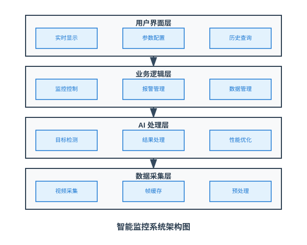
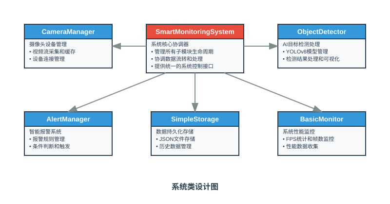
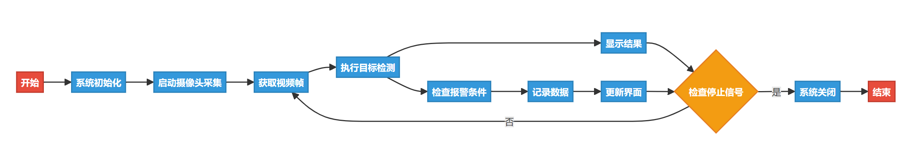

# 第19课：智能监控系统实现与优化

在本课中，我们将综合运用前 18 课学到的 Python 编程、OpenCV 图像处理、深度学习和 YOLOv8 目标检测技术，构建一个完整的智能监控系统。通过系统性的架构设计和模块化开发，我们将实现实时视频采集、智能目标检测、自动报警和数据存储等核心功能。同时，我们还将学习如何在边缘设备上优化系统性能，确保监控系统能够稳定、高效地运行。这个项目将是我们整个课程的集大成之作，展示边缘 AI 技术在实际应用中的强大潜力。

## 课程目标

+ 综合应用前面所学知识，设计完整的智能监控系统架构
+ 实现摄像头实时视频采集与 YOLOv8 目标检测功能的无缝集成
+ 开发智能报警机制和检测结果的持久化存储功能
+ 掌握边缘设备上的模型优化技术，提升系统性能和稳定性

---

## 1. 项目概述

### 1.1. 项目简介

"智能监控系统"是一个集成了计算机视觉、深度学习和边缘计算技术的综合性 AI 应用。该系统能够实时监控指定区域，自动识别和跟踪目标对象，在检测到特定事件时触发智能报警，并将所有监控数据进行结构化存储和分析。用户可以通过直观的界面查看实时监控画面、配置检测参数、查询历史记录，并根据实际需求调整系统行为。

### 1.2. 开发目标

本项目的主要开发目标包括：

1. **实时监控处理**：实现稳定的视频流采集和高效的实时处理能力
2. **智能检测分析**：集成 YOLOv8 模型实现准确的目标检测和识别
3. **智能报警系统**：开发灵活的报警触发机制和多样化的通知方式
4. **数据管理系统**：实现检测结果的持久化存储和历史数据分析
5. **性能优化方案**：针对边缘设备特点进行系统性能优化

### 1.3. 核心需求

| **核心需求** | **内容** |
| --- | --- |
| 1. 视频处理 | + 实时摄像头视频流采集和缓存管理      + 多线程并发处理避免阻塞      + 视频参数配置和异常恢复机制 |
| 2. 目标检测 | + 集成 YOLOv8 模型进行实时目标检测      + 支持多种目标类别的识别和过滤      + 检测结果的后处理和可视化显示 |
| 3. 智能报警 | + 基于规则的灵活报警触发机制      + 多级报警系统和冷却时间控制      + 报警历史记录和统计分析 |
| 4. 数据存储 | + 检测结果的结构化存储      + 系统运行日志和性能数据记录      + 历史数据查询和分析功能 |
| 5. 系统监控 | + 实时系统性能监控和资源使用统计      + 异常检测和自动恢复机制      + 用户界面状态显示和参数配置 |

## 2. 项目设计

### 2.1. 系统架构

为了实现上述需求，我们设计了一个分层模块化的系统架构，如下图所示：



> 图 19.1 智能监控系统架构图
>

系统采用分层架构设计，从底层到顶层依次包含数据采集层、AI 处理层、业务逻辑层和用户界面层。每一层都有明确的职责分工，层与层之间通过标准化接口进行通信，确保系统的可维护性和可扩展性。

### 2.2. 类设计



> 图 19.2 系统类设计图
>

基于模块化设计原则，我们将系统划分为以下几个主要类：

1. **SmartMonitoringSystem 类**：作为系统的核心协调器，负责管理所有子模块的生命周期和数据流转。
2. **CameraManager 类**：负责摄像头设备的管理、视频流采集和帧缓存处理。
3. **ObjectDetector 类**：负责 YOLOv8 模型的加载、目标检测推理和结果处理。
4. **AlertManager 类**：负责报警规则管理、条件判断和报警触发。
5. **SimpleStorage 类**：负责检测结果和报警记录的 JSON 文件存储。
6. **BasicMonitor 类**：负责基础的性能统计和帧数监控。

### 2.3. 功能流程

应用程序的主要功能流程如下图所示：



> 图 19.3 系统主要功能流程图
>

系统采用事件驱动的处理模式，通过多线程实现视频采集、AI 处理、报警管理等功能的并发执行，确保系统的实时性和响应性。

### 2.4. 项目结构

项目的文件结构如下：

```plain
smart_monitoring_system/
│
├── main.py                    # 程序入口和系统初始化
├── core/
│   ├── __init__.py           # 核心模块初始化
│   ├── smart_monitoring.py   # 主控制器类
│   ├── camera_manager.py     # 摄像头管理模块
│   ├── object_detector.py    # 目标检测模块
│   ├── alert_manager.py      # 报警管理模块
│   ├── simple_storage.py     # 数据存储模块
│   └── basic_monitor.py      # 系统监控模块
├── models/
│   └── yolov8n.pt           # YOLOv8 模型文件
├── data/
│   ├── detections.json      # 检测结果数据文件
│   ├── alerts.json          # 报警记录数据文件
│   └── logs/                # 系统日志目录
└── utils/
    ├── __init__.py          # 工具模块初始化
    └── logger.py            # 日志管理工具
```

---

## 3. 基于 AI 辅助的项目开发实践

在本节中，我们将展示如何使用 AI 辅助工具高效地开发智能监控系统。类似于第 14 课中的方法，我们将先明确整个项目的需求，然后逐步实现各个模块，展示面向对象编程在复杂 AI 系统中的应用。

### 3.1. 项目开发策略

在使用 AI 助手进行开发时，我们需要遵循以下策略：

1. **系统性需求分析**
    + 向 AI 提供完整的系统架构描述
    + 明确性能指标和约束条件
    + 详细描述各模块间的交互关系
2. **模块化迭代开发**
    + 先实现核心功能模块
    + 逐步添加高级特性
    + 持续进行集成测试
3. **性能导向优化**
    + 关注边缘设备的资源限制
    + 实现多线程并发处理
    + 优化模型推理性能

### 3.2. 项目总体需求描述

首先，让我们向 AI 助手描述整个智能监控系统的需求：

```plain
我需要开发一个智能监控系统，这是一个运行在边缘设备上的 Python 应用程序，用于实时监控和智能分析。系统需要：

1. 核心功能需求：
   - 实时摄像头视频流采集，支持多种摄像头接口
   - 基于 YOLOv8 的目标检测，重点检测人员和车辆
   - 智能报警系统，支持多种触发条件和报警方式
   - 简化的 JSON 文件数据存储，包括检测结果和报警记录
   - 基础的系统监控，包括 FPS 统计和帧数统计

2. 技术架构需求：
   - 采用分层模块化设计，便于维护和扩展
   - 支持多线程并发处理，确保实时性
   - 具备完善的异常处理和恢复机制
   - 针对 reComputer J1020 v2（搭载 NVIDIA Jetson Nano 模块）进行性能优化

3. 性能需求：
   - 支持实时视频处理（目标 10-25 FPS）
   - 内存使用控制在合理范围内（< 2GB）
   - CPU 使用率保持在 80% 以下
   - 系统能够长时间稳定运行（24小时+）

4. 可用性需求：
   - 提供直观的用户界面显示实时状态
   - 支持系统配置和参数调整
   - 提供历史数据查询和分析功能

5. 项目文件结构要求：
   请严格按照以下目录结构组织代码：

   smart_monitoring_system/
   │
   ├── main.py                    # 程序入口和系统初始化
   ├── core/
   │   ├── __init__.py           # 核心模块初始化
   │   ├── smart_monitoring.py   # 主控制器类
   │   ├── camera_manager.py     # 摄像头管理模块
   │   ├── object_detector.py    # 目标检测模块
   │   ├── alert_manager.py      # 报警管理模块
   │   ├── simple_storage.py     # 数据存储模块
   │   └── basic_monitor.py      # 系统监控模块
   ├── models/
   │   └── yolov8n.pt           # YOLOv8 模型文件
   ├── data/
   │   ├── detections.json      # 检测结果数据文件
   │   ├── alerts.json          # 报警记录数据文件
   │   └── logs/                # 系统日志目录
   └── utils/
       ├── __init__.py          # 工具模块初始化
       └── logger.py            # 日志管理工具

   请确保：
   - 所有模块文件按指定路径存放
   - 实现正确的包导入关系
   - 各模块职责明确，接口标准化
   - 配置文件和数据文件存放在对应目录

请帮我设计这个系统的详细实现方案，我将逐步向你请求各个模块的具体实现。
```

### 3.3. 开发 CameraManager 类

让我们从系统的基础组件开始 - CameraManager 类。这个类负责视频流的采集和管理，是整个系统的数据源。

#### 3.3.1. 向 AI 描述需求

向 AI 助手描述 CameraManager 类的具体需求：

```plain
我需要开发一个 CameraManager 类，用于管理摄像头设备和视频流采集。这个类需要：

1. 功能需求：
   - 支持多种摄像头接口（USB、CSI）
   - 实现稳定的视频流采集，包含异常恢复机制
   - 提供帧缓存和队列管理，避免内存溢出
   - 支持视频参数配置（分辨率、帧率等）
   - 实时统计采集性能（FPS、丢帧率等）

2. 性能需求：
   - 采用多线程避免主线程阻塞
   - 实现智能帧丢弃机制处理性能瓶颈
   - 内存使用优化，避免内存泄漏

3. 稳定性需求：
   - 完善的异常处理和设备重连机制
   - 资源自动释放和清理
   - 设备状态监控和诊断

请实现这个类，确保代码结构清晰、注释完善。
```

#### 3.3.2. CameraManager 类实现

```python
# core/camera_manager.py

import cv2
import threading
import queue
import time
import logging
from typing import Optional, Dict, Any, Tuple
from dataclasses import dataclass

@dataclass
class FrameData:
    """帧数据结构"""
    frame: Any
    timestamp: float
    frame_id: int
    width: int
    height: int

class CameraManager:
    """摄像头管理类，负责视频流采集和管理"""
    
    def __init__(self, config: Dict[str, Any] = None):
        """
        初始化摄像头管理器
        
        Args:
            config: 摄像头配置参数
        """
        self.config = config or self._get_default_config()
        
        # 摄像头设备相关
        self.cap = None
        self.camera_id = self.config.get('camera_id', 0)
        self.is_initialized = False
        
        # 采集控制
        self.is_capturing = False
        self.should_stop = False
        self.capture_thread = None
        
        # 帧缓存管理
        self.frame_queue = queue.Queue(maxsize=self.config.get('buffer_size', 5))
        self.latest_frame = None
        self.frame_lock = threading.Lock()
        
        # 统计信息
        self.total_frames = 0
        self.dropped_frames = 0
        self.start_time = None
        self.last_fps_time = time.time()
        self.fps_counter = 0
        self.current_fps = 0.0
        
        # 日志配置
        self.logger = logging.getLogger(__name__)
        
    def _get_default_config(self) -> Dict[str, Any]:
        """获取默认配置"""
        return {
            'camera_id': 0,
            'width': 640,
            'height': 480,
            'fps': 30,
            'buffer_size': 5,
            'retry_attempts': 3,
            'retry_delay': 1.0,
            'warmup_frames': 5
        }
    
    def initialize(self) -> bool:
        """
        初始化摄像头设备
        
        Returns:
            bool: 初始化是否成功
        """
        if self.is_initialized:
            self.logger.info("摄像头已经初始化")
            return True
        
        try:
            self.logger.info(f"正在初始化摄像头 {self.camera_id}")
            
            # 创建摄像头对象
            self.cap = cv2.VideoCapture(self.camera_id)
            
            if not self.cap.isOpened():
                self.logger.error(f"无法打开摄像头 {self.camera_id}")
                return False
            
            # 配置摄像头参数
            self._configure_camera()
            
            # 验证配置效果
            if not self._verify_camera_config():
                self.logger.warning("摄像头配置验证失败，使用默认设置")
            
            # 摄像头预热
            self._warmup_camera()
            
            self.is_initialized = True
            self.logger.info("摄像头初始化成功")
            return True
            
        except Exception as e:
            self.logger.error(f"摄像头初始化失败: {e}")
            if self.cap:
                self.cap.release()
                self.cap = None
            return False
    
    def _configure_camera(self):
        """配置摄像头参数"""
        # 设置分辨率
        self.cap.set(cv2.CAP_PROP_FRAME_WIDTH, self.config['width'])
        self.cap.set(cv2.CAP_PROP_FRAME_HEIGHT, self.config['height'])
        
        # 设置帧率
        self.cap.set(cv2.CAP_PROP_FPS, self.config['fps'])
        
        # 设置缓冲区大小（减少延迟）
        self.cap.set(cv2.CAP_PROP_BUFFERSIZE, 1)
        
        # 其他优化设置
        self.cap.set(cv2.CAP_PROP_FOURCC, cv2.VideoWriter_fourcc('M', 'J', 'P', 'G'))
    
    def _verify_camera_config(self) -> bool:
        """验证摄像头配置"""
        try:
            actual_width = int(self.cap.get(cv2.CAP_PROP_FRAME_WIDTH))
            actual_height = int(self.cap.get(cv2.CAP_PROP_FRAME_HEIGHT))
            actual_fps = self.cap.get(cv2.CAP_PROP_FPS)
            
            self.logger.info(f"摄像头配置: {actual_width}x{actual_height}@{actual_fps}fps")
            
            # 检查配置是否接近期望值
            width_ok = abs(actual_width - self.config['width']) <= 10
            height_ok = abs(actual_height - self.config['height']) <= 10
            
            return width_ok and height_ok
            
        except Exception as e:
            self.logger.error(f"验证摄像头配置失败: {e}")
            return False
    
    def _warmup_camera(self):
        """摄像头预热，丢弃初始几帧"""
        warmup_frames = self.config.get('warmup_frames', 5)
        self.logger.info(f"摄像头预热，丢弃前 {warmup_frames} 帧")
        
        for i in range(warmup_frames):
            ret, _ = self.cap.read()
            if not ret:
                self.logger.warning(f"预热第 {i+1} 帧读取失败")
                break
            time.sleep(0.1)
    
    def start_capture(self) -> bool:
        """
        开始视频采集
        
        Returns:
            bool: 启动是否成功
        """
        if self.is_capturing:
            self.logger.warning("视频采集已在运行")
            return True
        
        if not self.is_initialized:
            if not self.initialize():
                return False
        
        try:
            # 重置统计信息
            self.total_frames = 0
            self.dropped_frames = 0
            self.start_time = time.time()
            self.last_fps_time = time.time()
            self.fps_counter = 0
            
            # 设置采集状态
            self.is_capturing = True
            self.should_stop = False
            
            # 启动采集线程
            self.capture_thread = threading.Thread(
                target=self._capture_loop, 
                name="CameraCapture",
                daemon=True
            )
            self.capture_thread.start()
            
            self.logger.info("视频采集已启动")
            return True
            
        except Exception as e:
            self.logger.error(f"启动视频采集失败: {e}")
            self.is_capturing = False
            return False
    
    def stop_capture(self):
        """停止视频采集"""
        if not self.is_capturing:
            return
        
        self.logger.info("正在停止视频采集...")
        
        # 设置停止标志
        self.should_stop = True
        self.is_capturing = False
        
        # 等待采集线程结束
        if self.capture_thread and self.capture_thread.is_alive():
            self.capture_thread.join(timeout=3.0)
            if self.capture_thread.is_alive():
                self.logger.warning("采集线程未能及时结束")
        
        # 清空帧队列
        self._clear_frame_queue()
        
        self.logger.info("视频采集已停止")
    
    def _capture_loop(self):
        """视频采集主循环"""
        retry_count = 0
        max_retries = self.config.get('retry_attempts', 3)
        retry_delay = self.config.get('retry_delay', 1.0)
        
        self.logger.info("视频采集循环已启动")
        
        while not self.should_stop:
            try:
                # 读取帧
                ret, frame = self.cap.read()
                
                if not ret:
                    retry_count += 1
                    self.logger.warning(f"读取帧失败，重试 {retry_count}/{max_retries}")
                    
                    if retry_count >= max_retries:
                        self.logger.error("连续读取失败，停止采集")
                        break
                    
                    time.sleep(retry_delay)
                    continue
                
                # 重置重试计数
                retry_count = 0
                
                # 更新统计信息
                self.total_frames += 1
                self._update_fps_stats()
                
                # 创建帧数据
                frame_data = FrameData(
                    frame=frame,
                    timestamp=time.time(),
                    frame_id=self.total_frames,
                    width=frame.shape[1],
                    height=frame.shape[0]
                )
                
                # 更新最新帧
                with self.frame_lock:
                    self.latest_frame = frame_data
                
                # 添加到队列（非阻塞）
                try:
                    self.frame_queue.put_nowait(frame_data)
                except queue.Full:
                    # 队列满时丢弃最旧的帧
                    try:
                        self.frame_queue.get_nowait()
                        self.frame_queue.put_nowait(frame_data)
                        self.dropped_frames += 1
                    except queue.Empty:
                        pass
                
            except Exception as e:
                self.logger.error(f"采集循环异常: {e}")
                time.sleep(0.1)  # 短暂暂停避免错误循环
        
        self.logger.info("视频采集循环已结束")
    
    def _update_fps_stats(self):
        """更新 FPS 统计"""
        self.fps_counter += 1
        current_time = time.time()
        
        # 每秒更新一次 FPS
        if current_time - self.last_fps_time >= 1.0:
            self.current_fps = self.fps_counter / (current_time - self.last_fps_time)
            self.fps_counter = 0
            self.last_fps_time = current_time
    
    def get_frame(self) -> Optional[FrameData]:
        """
        获取最新帧（非阻塞）
        
        Returns:
            FrameData: 帧数据，如果无可用帧则返回 None
        """
        try:
            return self.frame_queue.get_nowait()
        except queue.Empty:
            return None
    
    def get_latest_frame(self) -> Optional[FrameData]:
        """
        获取最新帧（不从队列移除）
        
        Returns:
            FrameData: 最新帧数据
        """
        with self.frame_lock:
            return self.latest_frame
    
    def _clear_frame_queue(self):
        """清空帧队列"""
        while not self.frame_queue.empty():
            try:
                self.frame_queue.get_nowait()
            except queue.Empty:
                break
    
    def get_statistics(self) -> Dict[str, Any]:
        """
        获取采集统计信息
        
        Returns:
            Dict: 统计信息
        """
        runtime = time.time() - self.start_time if self.start_time else 0
        average_fps = self.total_frames / runtime if runtime > 0 else 0
        drop_rate = self.dropped_frames / self.total_frames if self.total_frames > 0 else 0
        
        return {
            'is_capturing': self.is_capturing,
            'is_initialized': self.is_initialized,
            'total_frames': self.total_frames,
            'dropped_frames': self.dropped_frames,
            'drop_rate': drop_rate,
            'current_fps': self.current_fps,
            'average_fps': average_fps,
            'runtime': runtime,
            'queue_size': self.frame_queue.qsize(),
            'camera_id': self.camera_id
        }
    
    def release(self):
        """释放摄像头资源"""
        self.stop_capture()
        
        if self.cap:
            self.cap.release()
            self.cap = None
        
        self.is_initialized = False
        self.logger.info("摄像头资源已释放")
```

#### 3.3.3. 代码审查和测试

在实际应用中，我们需要对生成的代码进行审查和测试：

```python
# 测试 CameraManager 类
def test_camera_manager():
    import time
    
    # 创建摄像头管理器
    config = {
        'camera_id': 0,
        'width': 640,
        'height': 480,
        'fps': 30
    }
    
    camera_manager = CameraManager(config)
    
    try:
        # 测试初始化
        if not camera_manager.initialize():
            print("摄像头初始化失败")
            return
        
        # 测试启动采集
        if not camera_manager.start_capture():
            print("启动采集失败")
            return
        
        # 运行 10 秒测试
        start_time = time.time()
        frame_count = 0
        
        while time.time() - start_time < 10:
            frame_data = camera_manager.get_frame()
            if frame_data:
                frame_count += 1
                print(f"获取到第 {frame_count} 帧，时间戳: {frame_data.timestamp}")
            
            time.sleep(0.1)
        
        # 显示统计信息
        stats = camera_manager.get_statistics()
        print("采集统计:")
        for key, value in stats.items():
            print(f"  {key}: {value}")
        
    finally:
        # 释放资源
        camera_manager.release()

if __name__ == "__main__":
    test_camera_manager()
```

### 3.4. 开发 ObjectDetector 类

接下来，我们开发 ObjectDetector 类，它负责集成 YOLOv8 模型进行目标检测。

#### 3.4.1. 向 AI 描述需求

```plain
我需要开发一个 ObjectDetector 类，集成 YOLOv8 模型进行实时目标检测。需求：

1. 功能需求：
   - 加载和管理 YOLOv8 模型
   - 对输入帧进行目标检测推理
   - 结果后处理，包括类别过滤和置信度筛选
   - 在图像上绘制检测结果的可视化

2. 性能需求：
   - 模型预热机制提升首次推理速度
   - 推理时间统计和性能监控
   - 内存使用优化

3. 配置需求：
   - 支持检测类别的灵活配置
   - 置信度阈值和 NMS 参数调整
   - 支持模型文件路径配置

请实现这个类，重点关注在边缘设备上的性能优化。
```

#### 3.4.2. ObjectDetector 类实现

```python
# core/object_detector.py

import cv2
import numpy as np
import time
import logging
from typing import List, Dict, Any, Optional, Tuple
from dataclasses import dataclass
from ultralytics import YOLO

@dataclass
class Detection:
    """检测结果数据类"""
    class_id: int
    class_name: str
    confidence: float
    bbox: Tuple[float, float, float, float]  # (x1, y1, x2, y2)
    timestamp: float

class ObjectDetector:
    """目标检测类，集成 YOLOv8 模型进行实时检测"""
    
    def __init__(self, config: Dict[str, Any] = None):
        """
        初始化目标检测器
        
        Args:
            config: 检测器配置参数
        """
        self.config = config or self._get_default_config()
        
        # 模型相关
        self.model = None
        self.model_loaded = False
        self.model_path = self.config.get('model_path', 'yolov8n.pt')
        
        # 检测参数
        self.confidence_threshold = self.config.get('confidence_threshold', 0.5)
        self.iou_threshold = self.config.get('iou_threshold', 0.45)
        self.target_classes = self.config.get('target_classes', ['person'])
        self.max_detections = self.config.get('max_detections', 100)
        
        # 性能统计
        self.total_detections = 0
        self.total_inference_time = 0.0
        self.inference_count = 0
        
        # 预处理参数
        self.input_size = self.config.get('input_size', 640)
        
        # 日志配置
        self.logger = logging.getLogger(__name__)
        
        # COCO 类别名称映射
        self.class_names = [
            'person', 'bicycle', 'car', 'motorcycle', 'airplane', 'bus', 'train', 'truck', 'boat',
            'traffic light', 'fire hydrant', 'stop sign', 'parking meter', 'bench', 'bird', 'cat',
            'dog', 'horse', 'sheep', 'cow', 'elephant', 'bear', 'zebra', 'giraffe', 'backpack',
            'umbrella', 'handbag', 'tie', 'suitcase', 'frisbee', 'skis', 'snowboard', 'sports ball',
            'kite', 'baseball bat', 'baseball glove', 'skateboard', 'surfboard', 'tennis racket',
            'bottle', 'wine glass', 'cup', 'fork', 'knife', 'spoon', 'bowl', 'banana', 'apple',
            'sandwich', 'orange', 'broccoli', 'carrot', 'hot dog', 'pizza', 'donut', 'cake',
            'chair', 'couch', 'potted plant', 'bed', 'dining table', 'toilet', 'tv', 'laptop',
            'mouse', 'remote', 'keyboard', 'cell phone', 'microwave', 'oven', 'toaster', 'sink',
            'refrigerator', 'book', 'clock', 'vase', 'scissors', 'teddy bear', 'hair drier', 'toothbrush'
        ]
    
    def _get_default_config(self) -> Dict[str, Any]:
        """获取默认配置"""
        return {
            'model_path': 'models/yolov8n.pt',
            'confidence_threshold': 0.5,
            'iou_threshold': 0.45,
            'target_classes': ['person'],
            'max_detections': 100,
            'input_size': 640,
            'device': 'cpu',  # 或 'cuda' 如果支持
            'warmup_runs': 3
        }
    
    def initialize(self) -> bool:
        """
        初始化检测模型
        
        Returns:
            bool: 初始化是否成功
        """
        if self.model_loaded:
            self.logger.info("模型已经加载")
            return True
        
        try:
            self.logger.info(f"正在加载 YOLOv8 模型: {self.model_path}")
            
            # 检查模型文件是否存在
            import os
            if not os.path.exists(self.model_path):
                self.logger.error(f"模型文件不存在: {self.model_path}")
                return False
            
            # 加载模型
            self.model = YOLO(self.model_path)
            
            # 设置设备
            device = self.config.get('device', 'cpu')
            if device == 'cuda':
                import torch
                if torch.cuda.is_available():
                    self.logger.info("使用 GPU 加速")
                else:
                    self.logger.warning("CUDA 不可用，使用 CPU")
                    device = 'cpu'
            
            # 模型预热
            self._warmup_model()
            
            self.model_loaded = True
            self.logger.info("YOLOv8 模型加载成功")
            return True
            
        except Exception as e:
            self.logger.error(f"模型加载失败: {e}")
            return False
    
    def _warmup_model(self):
        """模型预热，提升后续推理速度"""
        try:
            warmup_runs = self.config.get('warmup_runs', 3)
            self.logger.info(f"开始模型预热，运行 {warmup_runs} 次")
            
            # 创建随机输入
            dummy_input = np.random.randint(
                0, 255, 
                (self.input_size, self.input_size, 3), 
                dtype=np.uint8
            )
            
            for i in range(warmup_runs):
                start_time = time.time()
                _ = self.model(dummy_input, verbose=False)
                warmup_time = time.time() - start_time
                self.logger.debug(f"预热第 {i+1} 次，耗时: {warmup_time:.3f}秒")
            
            self.logger.info("模型预热完成")
            
        except Exception as e:
            self.logger.warning(f"模型预热失败: {e}")
    
    def detect(self, frame: np.ndarray) -> List[Detection]:
        """
        执行目标检测
        
        Args:
            frame: 输入图像帧
            
        Returns:
            List[Detection]: 检测结果列表
        """
        if not self.model_loaded or self.model is None:
            self.logger.warning("模型未加载，无法进行检测")
            return []
        
        if frame is None or frame.size == 0:
            self.logger.warning("输入帧无效")
            return []
        
        try:
            # 记录推理开始时间
            inference_start = time.time()
            
            # 执行推理
            results = self.model(
                frame,
                conf=self.confidence_threshold,
                iou=self.iou_threshold,
                max_det=self.max_detections,
                verbose=False
            )[0]
            
            # 记录推理时间
            inference_time = time.time() - inference_start
            self.total_inference_time += inference_time
            self.inference_count += 1
            
            # 解析检测结果
            detections = self._parse_results(results)
            
            # 过滤目标类别
            filtered_detections = self._filter_target_classes(detections)
            
            # 更新统计信息
            self.total_detections += len(filtered_detections)
            
            return filtered_detections
            
        except Exception as e:
            self.logger.error(f"目标检测失败: {e}")
            return []
    
    def _parse_results(self, results) -> List[Detection]:
        """
        解析 YOLOv8 检测结果
        
        Args:
            results: YOLOv8 结果对象
            
        Returns:
            List[Detection]: 解析后的检测结果
        """
        detections = []
        
        if results.boxes is None or len(results.boxes) == 0:
            return detections
        
        try:
            # 提取检测数据
            boxes = results.boxes.xyxy.cpu().numpy()
            confidences = results.boxes.conf.cpu().numpy()
            class_ids = results.boxes.cls.cpu().numpy().astype(int)
            
            current_time = time.time()
            
            for i in range(len(boxes)):
                class_id = class_ids[i]
                
                # 获取类别名称
                if class_id < len(self.class_names):
                    class_name = self.class_names[class_id]
                else:
                    class_name = f'unknown_{class_id}'
                
                # 创建检测对象
                detection = Detection(
                    class_id=int(class_id),
                    class_name=class_name,
                    confidence=float(confidences[i]),
                    bbox=tuple(boxes[i].tolist()),
                    timestamp=current_time
                )
                
                detections.append(detection)
            
        except Exception as e:
            self.logger.error(f"解析检测结果失败: {e}")
        
        return detections
    
    def _filter_target_classes(self, detections: List[Detection]) -> List[Detection]:
        """
        根据目标类别过滤检测结果
        
        Args:
            detections: 原始检测结果
            
        Returns:
            List[Detection]: 过滤后的检测结果
        """
        if not self.target_classes:
            return detections
        
        filtered = []
        for detection in detections:
            if detection.class_name in self.target_classes:
                filtered.append(detection)
        
        return filtered
    
    def draw_detections(self, frame: np.ndarray, detections: List[Detection]) -> np.ndarray:
        """
        在图像上绘制检测结果
        
        Args:
            frame: 输入图像
            detections: 检测结果列表
            
        Returns:
            np.ndarray: 绘制后的图像
        """
        if frame is None:
            return frame
        
        result_frame = frame.copy()
        
        # 定义类别颜色映射
        color_map = {
            'person': (0, 255, 0),      # 绿色
            'car': (255, 0, 0),         # 蓝色
            'bicycle': (0, 255, 255),   # 黄色
            'motorcycle': (255, 0, 255), # 品红
            'truck': (255, 128, 0),     # 橙色
            'bus': (128, 0, 255),       # 紫色
        }
        
        for detection in detections:
            try:
                # 获取边界框坐标
                x1, y1, x2, y2 = [int(coord) for coord in detection.bbox]
                
                # 确保坐标在图像范围内
                h, w = frame.shape[:2]
                x1, y1 = max(0, x1), max(0, y1)
                x2, y2 = min(w, x2), min(h, y2)
                
                # 选择颜色
                color = color_map.get(detection.class_name, (128, 128, 128))
                
                # 绘制边界框
                cv2.rectangle(result_frame, (x1, y1), (x2, y2), color, 2)
                
                # 准备标签文本
                label = f'{detection.class_name}: {detection.confidence:.2f}'
                
                # 计算标签位置
                label_size = cv2.getTextSize(label, cv2.FONT_HERSHEY_SIMPLEX, 0.6, 2)[0]
                label_y = max(y1 - 10, label_size[1] + 10)
                
                # 绘制标签背景
                cv2.rectangle(result_frame,
                             (x1, label_y - label_size[1] - 5),
                             (x1 + label_size[0], label_y + 5),
                             color, -1)
                
                # 绘制标签文字
                cv2.putText(result_frame, label, (x1, label_y - 5),
                           cv2.FONT_HERSHEY_SIMPLEX, 0.6, (255, 255, 255), 2)
                
            except Exception as e:
                self.logger.warning(f"绘制检测结果失败: {e}")
        
        return result_frame
    
    def get_statistics(self) -> Dict[str, Any]:
        """
        获取检测统计信息
        
        Returns:
            Dict: 统计信息
        """
        avg_inference_time = (
            self.total_inference_time / self.inference_count 
            if self.inference_count > 0 else 0
        )
        
        return {
            'model_loaded': self.model_loaded,
            'total_detections': self.total_detections,
            'inference_count': self.inference_count,
            'total_inference_time': self.total_inference_time,
            'avg_inference_time': avg_inference_time,
            'avg_fps': 1.0 / avg_inference_time if avg_inference_time > 0 else 0,
            'target_classes': self.target_classes,
            'confidence_threshold': self.confidence_threshold,
            'model_path': self.model_path
        }
    
    def update_config(self, new_config: Dict[str, Any]):
        """
        更新检测配置
        
        Args:
            new_config: 新的配置参数
        """
        if 'confidence_threshold' in new_config:
            self.confidence_threshold = new_config['confidence_threshold']
            self.logger.info(f"置信度阈值更新为: {self.confidence_threshold}")
        
        if 'target_classes' in new_config:
            self.target_classes = new_config['target_classes']
            self.logger.info(f"目标类别更新为: {self.target_classes}")
        
        if 'iou_threshold' in new_config:
            self.iou_threshold = new_config['iou_threshold']
            self.logger.info(f"IoU 阈值更新为: {self.iou_threshold}")
    
    def release(self):
        """释放模型资源"""
        if self.model:
            del self.model
            self.model = None
        
        self.model_loaded = False
        self.logger.info("检测模型资源已释放")
```

#### 3.4.3. 代码审查和测试

```python
def test_object_detector():
    """测试 ObjectDetector 类的功能"""
    import cv2
    import numpy as np
    
    # 创建检测器
    config = {
        'model_path': 'models/yolov8n.pt',
        'confidence_threshold': 0.5,
        'target_classes': ['person']
    }
    
    detector = ObjectDetector(config)
    
    try:
        # 测试初始化
        assert detector.initialize(), "检测器初始化失败"
        print("✓ 检测器初始化成功")
        
        # 测试检测功能
        test_image = np.random.randint(0, 255, (480, 640, 3), dtype=np.uint8)
        detections = detector.detect(test_image)
        print(f"✓ 检测完成，发现 {len(detections)} 个目标")
        
        # 测试绘制功能
        result_image = detector.draw_detections(test_image, detections)
        assert result_image is not None, "绘制检测结果失败"
        print("✓ 检测结果绘制成功")
        
        # 显示统计信息
        stats = detector.get_statistics()
        print("检测器统计信息:")
        for key, value in stats.items():
            print(f"  {key}: {value}")
            
    finally:
        detector.release()

if __name__ == "__main__":
    test_object_detector()
```

### 3.5. 开发 AlertManager 类

接下来，我们开发 AlertManager 类，它负责报警规则管理和报警触发。

#### 3.5.1. 向 AI 描述需求

```plain
我需要开发一个 AlertManager 类，负责智能报警系统的管理。需求：

1. 功能需求：
   - 支持多种报警规则的配置和管理
   - 根据检测结果判断是否触发报警
   - 实现报警冷却机制避免频繁触发
   - 提供报警历史记录和统计分析

2. 灵活性需求：
   - 支持不同的报警级别（低、中、高、严重）
   - 可配置的报警条件（目标类别、数量、置信度等）
   - 支持报警回调函数，便于扩展不同的通知方式

3. 性能需求：
   - 线程安全的报警检查
   - 高效的历史数据管理

请实现这个类，确保代码结构清晰。
```

#### 3.5.2. AlertManager 类实现

```python
# core/alert_manager.py

import time
import threading
import logging
from typing import List, Dict, Any, Callable, Optional
from dataclasses import dataclass
from enum import Enum

class AlertLevel(Enum):
    """报警级别枚举"""
    LOW = "低"
    MEDIUM = "中"
    HIGH = "高"
    CRITICAL = "严重"

@dataclass
class AlertRule:
    """报警规则数据类"""
    name: str
    target_classes: List[str]
    min_detections: int
    confidence_threshold: float
    level: AlertLevel
    cooldown_seconds: int = 5
    enabled: bool = True

@dataclass
class AlertInfo:
    """报警信息数据类"""
    rule_name: str
    level: str
    message: str
    timestamp: float
    detection_count: int
    detections: List[Any]

class AlertManager:
    """报警管理类，负责报警规则管理和触发"""
    
    def __init__(self, config: Dict[str, Any] = None):
        """
        初始化报警管理器
        
        Args:
            config: 报警配置参数
        """
        self.config = config or self._get_default_config()
        
        # 报警规则管理
        self.alert_rules: List[AlertRule] = []
        self.rule_last_triggered: Dict[str, float] = {}
        
        # 报警历史
        self.alert_history: List[Dict[str, Any]] = []
        self.max_history_size = self.config.get('max_history_size', 100)
        
        # 状态管理
        self.is_enabled = self.config.get('enabled', True)
        self.alert_callbacks: List[Callable] = []
        
        # 线程安全
        self.lock = threading.Lock()
        
        # 日志配置
        self.logger = logging.getLogger(__name__)
        
        # 加载默认规则
        self._load_default_rules()
    
    def _get_default_config(self) -> Dict[str, Any]:
        """获取默认配置"""
        return {
            'enabled': True,
            'max_history_size': 100,
            'default_cooldown': 5
        }
    
    def _load_default_rules(self):
        """加载默认报警规则"""
        default_rules = [
            AlertRule(
                name="人员检测",
                target_classes=['person'],
                min_detections=1,
                confidence_threshold=0.7,
                level=AlertLevel.MEDIUM,
                cooldown_seconds=3
            ),
            AlertRule(
                name="多人聚集",
                target_classes=['person'],
                min_detections=3,
                confidence_threshold=0.6,
                level=AlertLevel.HIGH,
                cooldown_seconds=10
            ),
            AlertRule(
                name="车辆检测",
                target_classes=['car', 'truck', 'bus'],
                min_detections=1,
                confidence_threshold=0.8,
                level=AlertLevel.LOW,
                cooldown_seconds=5
            )
        ]
        
        self.alert_rules.extend(default_rules)
        self.logger.info(f"已加载 {len(default_rules)} 条默认报警规则")
    
    def add_alert_rule(self, rule: AlertRule):
        """添加报警规则"""
        with self.lock:
            self.alert_rules.append(rule)
        self.logger.info(f"已添加报警规则: {rule.name}")
    
    def remove_alert_rule(self, rule_name: str) -> bool:
        """移除报警规则"""
        with self.lock:
            for i, rule in enumerate(self.alert_rules):
                if rule.name == rule_name:
                    del self.alert_rules[i]
                    self.logger.info(f"已移除报警规则: {rule_name}")
                    return True
        return False
    
    def add_callback(self, callback: Callable[[Dict[str, Any]], None]):
        """添加报警回调函数"""
        self.alert_callbacks.append(callback)
    
    def check_alerts(self, detections: List[Any]) -> List[AlertInfo]:
        """检查并触发报警"""
        if not self.is_enabled or not detections:
            return []
        
        triggered_alerts = []
        current_time = time.time()
        
        with self.lock:
            for rule in self.alert_rules:
                if not rule.enabled:
                    continue
                
                # 检查冷却时间
                last_triggered = self.rule_last_triggered.get(rule.name, 0)
                if current_time - last_triggered < rule.cooldown_seconds:
                    continue
                
                # 检查报警条件
                if self._check_rule_conditions(rule, detections):
                    alert_info = self._create_alert(rule, detections)
                    triggered_alerts.append(alert_info)
                    
                    # 更新触发时间
                    self.rule_last_triggered[rule.name] = current_time
                    
                    # 添加到历史
                    self._add_to_history(alert_info)
                    
                    # 触发回调
                    self._trigger_callbacks(alert_info)
        
        return triggered_alerts
    
    def _check_rule_conditions(self, rule: AlertRule, detections: List[Any]) -> bool:
        """检查报警规则条件"""
        matching_count = 0
        
        for detection in detections:
            if (hasattr(detection, 'class_name') and 
                detection.class_name in rule.target_classes and
                hasattr(detection, 'confidence') and
                detection.confidence >= rule.confidence_threshold):
                matching_count += 1
        
        return matching_count >= rule.min_detections
    
    def _create_alert(self, rule: AlertRule, detections: List[Any]) -> AlertInfo:
        """创建报警信息"""
        # 统计匹配的检测结果
        matching_detections = []
        class_counts = {}
        
        for detection in detections:
            if (hasattr(detection, 'class_name') and 
                detection.class_name in rule.target_classes):
                matching_detections.append(detection)
                class_name = detection.class_name
                class_counts[class_name] = class_counts.get(class_name, 0) + 1
        
        # 生成报警消息
        if len(class_counts) == 1:
            class_name, count = next(iter(class_counts.items()))
            message = f"检测到 {count} 个 {class_name}"
        else:
            parts = [f"{count}个{name}" for name, count in class_counts.items()]
            message = f"检测到 {', '.join(parts)}"
        
        return AlertInfo(
            rule_name=rule.name,
            level=rule.level.value,
            message=message,
            timestamp=time.time(),
            detection_count=len(matching_detections),
            detections=matching_detections
        )
    
    def _add_to_history(self, alert_info: AlertInfo):
        """添加到报警历史"""
        history_entry = {
            'rule_name': alert_info.rule_name,
            'level': alert_info.level,
            'message': alert_info.message,
            'timestamp': alert_info.timestamp,
            'detection_count': alert_info.detection_count
        }
        
        self.alert_history.append(history_entry)
        
        # 限制历史记录大小
        if len(self.alert_history) > self.max_history_size:
            self.alert_history.pop(0)
    
    def _trigger_callbacks(self, alert_info: AlertInfo):
        """触发报警回调"""
        alert_dict = {
            'rule_name': alert_info.rule_name,
            'level': alert_info.level,
            'message': alert_info.message,
            'timestamp': alert_info.timestamp,
            'detection_count': alert_info.detection_count
        }
        
        for callback in self.alert_callbacks:
            try:
                callback(alert_dict)
            except Exception as e:
                self.logger.error(f"报警回调执行失败: {e}")
    
    def get_statistics(self) -> Dict[str, Any]:
        """获取报警统计信息"""
        with self.lock:
            total_alerts = len(self.alert_history)
            
            # 按级别统计
            level_counts = {}
            for alert in self.alert_history:
                level = alert['level']
                level_counts[level] = level_counts.get(level, 0) + 1
            
            # 最近24小时报警
            current_time = time.time()
            recent_alerts = [
                alert for alert in self.alert_history 
                if current_time - alert['timestamp'] <= 86400
            ]
            
            return {
                'total_alerts': total_alerts,
                'level_distribution': level_counts,
                'recent_24h': len(recent_alerts),
                'active_rules': len([r for r in self.alert_rules if r.enabled]),
                'total_rules': len(self.alert_rules),
                'is_enabled': self.is_enabled
            }
```

#### 3.5.3. 代码审查和测试

```python
def test_alert_manager():
    """测试 AlertManager 类的功能"""
    from core.object_detector import Detection
    import time
    
    # 创建报警管理器
    alert_manager = AlertManager()
    
    # 创建测试检测结果
    test_detections = [
        Detection(
            class_id=0,
            class_name='person',
            confidence=0.8,
            bbox=(100, 100, 200, 300),
            timestamp=time.time()
        )
    ]
    
    # 测试报警检查
    alerts = alert_manager.check_alerts(test_detections)
    print(f"触发 {len(alerts)} 个报警")
    
    for alert in alerts:
        print(f"报警: {alert.level} - {alert.message}")
    
    # 测试统计信息
    stats = alert_manager.get_statistics()
    print("报警管理器统计:")
    for key, value in stats.items():
        print(f"  {key}: {value}")

if __name__ == "__main__":
    test_alert_manager()
```

### 3.6. 开发 SimpleStorage 类

接下来开发简化的数据存储模块，负责检测结果和系统数据的持久化。

#### 3.6.1. 向 AI 描述需求

```plain
我需要开发一个 SimpleStorage 类，负责系统数据的持久化存储。需求：

1. 功能需求：
   - 使用 JSON 文件存储检测结果和报警记录
   - 提供数据的增删改查接口
   - 支持历史数据的查询和统计分析
   - 实现内存缓存和批量写入优化

2. 性能需求：
   - 缓存机制优化，提高写入性能
   - 异步写入，避免阻塞主线程
   - 自动缓存大小管理

3. 数据管理需求：
   - 自动创建数据目录结构
   - 数据的备份和恢复功能
   - 过期数据清理机制

请实现这个类。
```

#### 3.6.2. SimpleStorage 类实现

```python
# core/simple_storage.py

import json
import os
import time
import threading
from typing import Dict, Any, List
from datetime import datetime

class SimpleStorage:
    """简化的 JSON 文件存储类"""
    
    def __init__(self, config: Dict[str, Any] = None):
        """初始化存储系统"""
        self.config = config or self._get_default_config()
        
        # 文件路径
        self.data_dir = self.config.get('data_dir', 'data')
        self.detections_file = os.path.join(self.data_dir, 'detections.json')
        self.alerts_file = os.path.join(self.data_dir, 'alerts.json')
        
        # 内存缓存
        self.detections_cache = []
        self.alerts_cache = []
        self.cache_size = self.config.get('cache_size', 100)
        
        # 线程安全
        self.lock = threading.Lock()
        
        # 确保目录存在
        os.makedirs(self.data_dir, exist_ok=True)
        
        # 加载现有数据
        self._load_existing_data()
    
    def _get_default_config(self) -> Dict[str, Any]:
        """获取默认配置"""
        return {
            'data_dir': 'data',
            'cache_size': 100
        }
    
    def _load_existing_data(self):
        """加载现有数据"""
        try:
            if os.path.exists(self.detections_file):
                with open(self.detections_file, 'r', encoding='utf-8') as f:
                    self.detections_cache = json.load(f)
        except Exception:
            self.detections_cache = []
        
        try:
            if os.path.exists(self.alerts_file):
                with open(self.alerts_file, 'r', encoding='utf-8') as f:
                    self.alerts_cache = json.load(f)
        except Exception:
            self.alerts_cache = []
    
    def save_detection(self, frame_id: int, detection: Any) -> bool:
        """保存检测结果"""
        try:
            detection_data = {
                'frame_id': frame_id,
                'timestamp': detection.timestamp,
                'class_id': detection.class_id,
                'class_name': detection.class_name,
                'confidence': detection.confidence,
                'bbox': detection.bbox,
                'created_at': datetime.now().isoformat()
            }
            
            with self.lock:
                self.detections_cache.append(detection_data)
                
                # 限制缓存大小
                if len(self.detections_cache) > self.cache_size:
                    self._save_detections_to_file()
                    self.detections_cache = self.detections_cache[-self.cache_size//2:]
            
            return True
        except Exception as e:
            print(f"保存检测结果失败: {e}")
            return False
    
    def save_alert(self, alert_info: Dict[str, Any]) -> bool:
        """保存报警记录"""
        try:
            alert_data = {
                'rule_name': alert_info['rule_name'],
                'level': alert_info['level'],
                'message': alert_info['message'],
                'timestamp': alert_info['timestamp'],
                'detection_count': alert_info.get('detection_count', 0),
                'created_at': datetime.now().isoformat()
            }
            
            with self.lock:
                self.alerts_cache.append(alert_data)
                
                # 限制缓存大小
                if len(self.alerts_cache) > self.cache_size:
                    self._save_alerts_to_file()
                    self.alerts_cache = self.alerts_cache[-self.cache_size//2:]
            
            return True
        except Exception as e:
            print(f"保存报警记录失败: {e}")
            return False
    
    def _save_detections_to_file(self):
        """保存检测结果到文件"""
        try:
            with open(self.detections_file, 'w', encoding='utf-8') as f:
                json.dump(self.detections_cache, f, ensure_ascii=False, indent=2)
        except Exception as e:
            print(f"保存检测文件失败: {e}")
    
    def _save_alerts_to_file(self):
        """保存报警记录到文件"""
        try:
            with open(self.alerts_file, 'w', encoding='utf-8') as f:
                json.dump(self.alerts_cache, f, ensure_ascii=False, indent=2)
        except Exception as e:
            print(f"保存报警文件失败: {e}")
    
    def get_recent_detections(self, limit: int = 50) -> List[Dict[str, Any]]:
        """获取最近的检测记录"""
        with self.lock:
            return self.detections_cache[-limit:]
    
    def get_recent_alerts(self, limit: int = 50) -> List[Dict[str, Any]]:
        """获取最近的报警记录"""
        with self.lock:
            return self.alerts_cache[-limit:]
    
    def get_statistics(self) -> Dict[str, Any]:
        """获取存储统计信息"""
        with self.lock:
            return {
                'total_detections': len(self.detections_cache),
                'total_alerts': len(self.alerts_cache),
                'cache_size': self.cache_size,
                'data_directory': self.data_dir
            }
    
    def close(self):
        """关闭存储系统，保存所有缓存数据"""
        with self.lock:
            if self.detections_cache:
                self._save_detections_to_file()
            if self.alerts_cache:
                self._save_alerts_to_file()
```

### 3.7. 开发 BasicMonitor 类

接下来开发基础监控模块，负责系统性能统计。

#### 3.7.1. 向 AI 描述需求

```plain
我需要开发一个 BasicMonitor 类，负责监控系统基础性能指标。需求：

1. 功能需求：
   - 监控 FPS 统计和帧数统计
   - 监控检测数量统计
   - 提供系统运行时间统计
   - 支持性能数据的历史记录

2. 性能需求：
   - 轻量级设计，最小化性能影响
   - 线程安全的数据统计
   - 高效的数据更新机制

3. 兼容性需求：
   - 简单易用的接口设计
   - 良好的扩展性

请实现这个类。
```

#### 3.7.2. BasicMonitor 类实现

```python
# core/basic_monitor.py

import time
import threading
from typing import Dict, Any
from collections import deque

class BasicMonitor:
    """基础监控类，提供 FPS 统计和帧数统计"""
    
    def __init__(self, config: Dict[str, Any] = None):
        """初始化基础监控器"""
        self.config = config or self._get_default_config()
        
        # 基础统计
        self.total_frames = 0
        self.total_detections = 0
        self.start_time = time.time()
        
        # FPS 统计
        self.fps_history = deque(maxlen=30)  # 保存30秒的 FPS 数据
        self.last_fps_update = time.time()
        self.current_fps = 0.0
        
        # 线程安全
        self.lock = threading.Lock()
    
    def _get_default_config(self) -> Dict[str, Any]:
        """获取默认配置"""
        return {
            'update_interval': 1.0
        }
    
    def update_frame_count(self):
        """更新帧数统计"""
        with self.lock:
            self.total_frames += 1
            self._update_fps()
    
    def update_detection_count(self, detection_count: int):
        """更新检测数量统计"""
        with self.lock:
            self.total_detections += detection_count
    
    def _update_fps(self):
        """更新 FPS 统计"""
        current_time = time.time()
        if current_time - self.last_fps_update >= 1.0:
            runtime = current_time - self.start_time
            if runtime > 0:
                self.current_fps = self.total_frames / runtime
                self.fps_history.append(self.current_fps)
            self.last_fps_update = current_time
    
    def get_fps(self) -> float:
        """获取当前 FPS"""
        with self.lock:
            return self.current_fps
    
    def get_frame_count(self) -> int:
        """获取总帧数"""
        with self.lock:
            return self.total_frames
    
    def get_detection_count(self) -> int:
        """获取总检测数"""
        with self.lock:
            return self.total_detections
    
    def get_status(self) -> Dict[str, Any]:
        """获取监控状态"""
        with self.lock:
            runtime = time.time() - self.start_time
            avg_fps = self.total_frames / runtime if runtime > 0 else 0
            
            return {
                'total_frames': self.total_frames,
                'total_detections': self.total_detections,
                'current_fps': self.current_fps,
                'average_fps': avg_fps,
                'runtime_seconds': runtime,
                'fps_history': list(self.fps_history)
            }
```

### 3.8. 开发 SmartMonitoringSystem 主控制器类

现在我们已经完成了所有基础模块的开发，接下来实现系统的核心协调器 - SmartMonitoringSystem 类。

#### 3.8.1. 向 AI 描述需求

```plain
我需要开发一个 SmartMonitoringSystem 类，作为整个智能监控系统的主控制器。需求：

1. 功能需求：
   - 协调管理所有子模块（摄像头、检测器、报警器等）
   - 实现主要的数据处理流程
   - 提供统一的系统控制接口
   - 支持多线程处理和显示功能

2. 架构需求：
   - 采用组合模式管理各个组件
   - 实现优雅的启动和关闭机制
   - 提供完整的状态监控和错误处理

3. 性能需求：
   - 高效的数据流处理
   - 实时显示功能
   - 资源管理和优化

请实现这个主控制器类，作为整个系统的核心。
```

#### 3.8.2. SmartMonitoringSystem 类实现

```python
# core/smart_monitoring.py

import cv2
import time
import threading
import logging
import signal
import sys
import numpy as np
from typing import Dict, Any, Optional, List
from datetime import datetime

from .camera_manager import CameraManager, FrameData
from .object_detector import ObjectDetector, Detection
from .alert_manager import AlertManager
from .simple_storage import SimpleStorage
from .basic_monitor import BasicMonitor

class SmartMonitoringSystem:
    """智能监控系统主控制器"""
    
    def __init__(self, config: Dict[str, Any] = None):
        """
        初始化智能监控系统
        
        Args:
            config: 系统配置
        """
        self.config = config or self._get_default_config()
        
        # 系统组件
        self.camera_manager = None
        self.object_detector = None
        self.alert_manager = None
        self.simple_storage = None
        self.basic_monitor = None
        
        # 运行状态
        self.is_running = False
        self.should_stop = False
        
        # 主处理线程
        self.main_thread = None
        self.display_thread = None
        
        # 统计信息
        self.start_time = None
        self.processed_frames = 0
        self.total_detections = 0
        self.total_alerts = 0
        
        # 界面控制
        self.display_enabled = self.config.get('display', {}).get('enabled', True)
        self.window_name = self.config.get('display', {}).get('window_name', 'Smart Monitoring System')
        
        # 日志配置
        self.logger = self._setup_logging()
        
        # 注册信号处理器
        signal.signal(signal.SIGINT, self._signal_handler)
        signal.signal(signal.SIGTERM, self._signal_handler)
    
    def _get_default_config(self) -> Dict[str, Any]:
        """获取默认系统配置"""
        return {
            'camera': {
                'camera_id': 0,
                'width': 640,
                'height': 480,
                'fps': 30
            },
            'detection': {
                'model_path': 'models/yolov8n.pt',
                'confidence_threshold': 0.5,
                'target_classes': ['person']
            },
            'alert': {
                'enabled': True
            },
            'storage': {
                'enabled': True,
                'data_dir': 'data'
            },
            'display': {
                'enabled': True,
                'window_name': 'Smart Monitoring System'
            },
            'performance': {
                'target_fps': 25,
                'processing_interval': 0.04  # 25 FPS
            }
        }
    
    def _setup_logging(self) -> logging.Logger:
        """设置日志系统"""
        logger = logging.getLogger('SmartMonitoring')
        logger.setLevel(logging.INFO)
        
        # 避免重复添加处理器
        if logger.handlers:
            return logger
        
        # 控制台处理器
        console_handler = logging.StreamHandler()
        console_handler.setLevel(logging.INFO)
        
        # 文件处理器
        try:
            import os
            os.makedirs('data/logs', exist_ok=True)
            file_handler = logging.FileHandler(
                'data/logs/monitoring_system.log', 
                encoding='utf-8'
            )
            file_handler.setLevel(logging.DEBUG)
        except Exception:
            file_handler = None
        
        # 格式化器
        formatter = logging.Formatter(
            '%(asctime)s - %(name)s - %(levelname)s - %(message)s'
        )
        console_handler.setFormatter(formatter)
        if file_handler:
            file_handler.setFormatter(formatter)
        
        # 添加处理器
        logger.addHandler(console_handler)
        if file_handler:
            logger.addHandler(file_handler)
        
        return logger
    
    def initialize(self) -> bool:
        """
        初始化系统所有组件
        
        Returns:
            bool: 初始化是否成功
        """
        self.logger.info("正在初始化智能监控系统...")
        
        try:
            # 初始化摄像头管理器
            self.camera_manager = CameraManager(self.config.get('camera'))
            if not self.camera_manager.initialize():
                self.logger.error("摄像头初始化失败")
                return False
            
            # 初始化目标检测器
            self.object_detector = ObjectDetector(self.config.get('detection'))
            if not self.object_detector.initialize():
                self.logger.error("目标检测器初始化失败")
                return False
            
            # 初始化报警管理器
            self.alert_manager = AlertManager(self.config.get('alert'))
            self.alert_manager.add_callback(self._handle_alert)
            
            # 初始化简化存储
            storage_config = self.config.get('storage')
            if storage_config and storage_config.get('enabled'):
                self.simple_storage = SimpleStorage(storage_config)
            
            # 初始化基础监控
            self.basic_monitor = BasicMonitor()
            
            self.logger.info("系统初始化完成")
            return True
            
        except Exception as e:
            self.logger.error(f"系统初始化失败: {e}")
            return False
    
    def start(self) -> bool:
        """
        启动监控系统
        
        Returns:
            bool: 启动是否成功
        """
        if self.is_running:
            self.logger.warning("系统已在运行中")
            return True
        
        if not self.initialize():
            return False
        
        try:
            # 启动摄像头采集
            if not self.camera_manager.start_capture():
                self.logger.error("启动摄像头采集失败")
                return False
            
            # 设置运行状态
            self.is_running = True
            self.should_stop = False
            self.start_time = time.time()
            
            # 启动主处理线程
            self.main_thread = threading.Thread(
                target=self._main_processing_loop,
                name="MainProcessing",
                daemon=True
            )
            self.main_thread.start()
            
            # 启动显示线程（如果启用）
            if self.display_enabled:
                self.display_thread = threading.Thread(
                    target=self._display_loop,
                    name="Display",
                    daemon=True
                )
                self.display_thread.start()
            
            self.logger.info("智能监控系统已启动")
            return True
            
        except Exception as e:
            self.logger.error(f"系统启动失败: {e}")
            self.is_running = False
            return False
    
    def stop(self):
        """停止监控系统"""
        if not self.is_running:
            return
        
        self.logger.info("正在停止智能监控系统...")
        
        # 设置停止标志
        self.should_stop = True
        self.is_running = False
        
        # 等待线程结束
        threads_to_join = [
            (self.main_thread, "主处理线程"),
            (self.display_thread, "显示线程")
        ]
        
        for thread, name in threads_to_join:
            if thread and thread.is_alive():
                self.logger.debug(f"等待 {name} 结束...")
                thread.join(timeout=5.0)
                if thread.is_alive():
                    self.logger.warning(f"{name} 未能及时结束")
        
        # 停止各组件
        if self.camera_manager:
            self.camera_manager.stop_capture()
            self.camera_manager.release()
        
        if self.object_detector:
            self.object_detector.release()
        
        if self.simple_storage:
            self.simple_storage.close()
        
        # 关闭显示窗口
        if self.display_enabled:
            cv2.destroyAllWindows()
        
        self.logger.info("智能监控系统已停止")
    
    def _main_processing_loop(self):
        """主处理循环"""
        processing_interval = self.config.get('performance', {}).get('processing_interval', 0.04)
        
        self.logger.info("主处理循环已启动")
        
        while not self.should_stop:
            loop_start_time = time.time()
            
            try:
                # 获取视频帧
                frame_data = self.camera_manager.get_frame()
                if frame_data is None:
                    time.sleep(0.01)
                    continue
                
                # 处理帧
                self._process_frame(frame_data)
                
            except Exception as e:
                self.logger.error(f"主处理循环错误: {e}")
            
            # 控制处理频率
            elapsed_time = time.time() - loop_start_time
            sleep_time = max(0, processing_interval - elapsed_time)
            if sleep_time > 0:
                time.sleep(sleep_time)
        
        self.logger.info("主处理循环已结束")
    
    def _process_frame(self, frame_data: FrameData):
        """
        处理单个视频帧
        
        Args:
            frame_data: 帧数据
        """
        try:
            # 执行目标检测
            detections = self.object_detector.detect(frame_data.frame)
            
            # 检查报警条件
            alerts = self.alert_manager.check_alerts(detections)
            
            # 更新统计信息
            self.processed_frames += 1
            self.total_detections += len(detections)
            self.total_alerts += len(alerts)
            
            # 更新监控器
            if self.basic_monitor:
                self.basic_monitor.update_frame_count()
                self.basic_monitor.update_detection_count(len(detections))
            
            # 保存数据
            if self.simple_storage:
                self._save_frame_data(frame_data, detections, alerts)
            
        except Exception as e:
            self.logger.error(f"处理帧数据失败: {e}")
    
    def _display_loop(self):
        """显示循环"""
        self.logger.info("显示循环已启动")
        
        while not self.should_stop:
            try:
                # 获取最新帧
                frame_data = self.camera_manager.get_latest_frame()
                if frame_data is None:
                    time.sleep(0.1)
                    continue
                
                # 执行检测（用于显示）
                detections = self.object_detector.detect(frame_data.frame)
                
                # 绘制检测结果
                display_frame = self.object_detector.draw_detections(
                    frame_data.frame, detections
                )
                
                # 添加系统信息
                self._add_system_overlay(display_frame, detections)
                
                # 显示图像
                cv2.imshow(self.window_name, display_frame)
                
                # 处理按键
                key = cv2.waitKey(1) & 0xFF
                if key == ord('q'):
                    self.logger.info("用户请求退出")
                    self.should_stop = True
                    break
                elif key == ord('s'):
                    self._save_screenshot(display_frame)
                elif key == ord(' '):
                    self._toggle_pause()
                
            except Exception as e:
                self.logger.error(f"显示循环错误: {e}")
                time.sleep(0.1)
        
        self.logger.info("显示循环已结束")
    
    def _add_system_overlay(self, frame: np.ndarray, detections: List[Detection]):
        """
        在帧上添加系统信息覆盖层
        
        Args:
            frame: 图像帧
            detections: 检测结果
        """
        try:
            h, w = frame.shape[:2]
            
            # 系统运行时间
            uptime = time.time() - self.start_time if self.start_time else 0
            uptime_str = f"{int(uptime//3600):02d}:{int((uptime%3600)//60):02d}:{int(uptime%60):02d}"
            
            # 获取统计信息
            camera_stats = self.camera_manager.get_statistics()
            detector_stats = self.object_detector.get_statistics()
            
            # 系统信息（使用英文）
            info_lines = [
                f"Uptime: {uptime_str}",
                f"FPS: {camera_stats.get('current_fps', 0):.1f}",
                f"Detections: {len(detections)}",
                f"Total Frames: {self.processed_frames}",
                f"Total Detections: {self.total_detections}"
            ]
            
            # 绘制半透明背景
            overlay = frame.copy()
            cv2.rectangle(overlay, (10, 10), (280, 140), (0, 0, 0), -1)
            cv2.addWeighted(overlay, 0.7, frame, 0.3, 0, frame)
            
            # 绘制信息文本
            for i, line in enumerate(info_lines):
                y_pos = 30 + i * 20
                cv2.putText(frame, line, (15, y_pos),
                           cv2.FONT_HERSHEY_SIMPLEX, 0.5, (255, 255, 255), 1)
            
            # 状态指示器
            status_color = (0, 255, 0) if self.is_running else (0, 0, 255)
            cv2.circle(frame, (w - 30, 30), 10, status_color, -1)
            
        except Exception as e:
            self.logger.warning(f"添加系统覆盖层失败: {e}")
    
    def _save_frame_data(self, frame_data: FrameData, detections: List[Detection], alerts: List):
        """
        保存帧数据到存储系统
        
        Args:
            frame_data: 帧数据
            detections: 检测结果
            alerts: 报警信息
        """
        try:
            if self.simple_storage:
                # 保存检测结果
                for detection in detections:
                    self.simple_storage.save_detection(frame_data.frame_id, detection)
                
                # 保存报警信息
                for alert in alerts:
                    alert_dict = {
                        'rule_name': alert.rule_name,
                        'level': alert.level,
                        'message': alert.message,
                        'timestamp': alert.timestamp,
                        'detection_count': alert.detection_count
                    }
                    self.simple_storage.save_alert(alert_dict)
                    
        except Exception as e:
            self.logger.warning(f"保存数据失败: {e}")
    
    def _handle_alert(self, alert_info: Dict[str, Any]):
        """
        处理报警回调
        
        Args:
            alert_info: 报警信息
        """
        timestamp = datetime.fromtimestamp(alert_info['timestamp']).strftime('%Y-%m-%d %H:%M:%S')
        level = alert_info['level']
        message = alert_info['message']
        
        self.logger.warning(f"[{level}] {timestamp} - {message}")
        
        # 这里可以添加其他报警处理逻辑，如发送通知等
    
    def _save_screenshot(self, frame: np.ndarray):
        """保存截图"""
        try:
            import os
            os.makedirs('data/screenshots', exist_ok=True)
            
            timestamp = datetime.now().strftime('%Y%m%d_%H%M%S')
            filename = f"data/screenshots/screenshot_{timestamp}.jpg"
            
            cv2.imwrite(filename, frame)
            self.logger.info(f"截图已保存: {filename}")
            
        except Exception as e:
            self.logger.error(f"保存截图失败: {e}")
    
    def _toggle_pause(self):
        """切换暂停状态"""
        # 这里可以实现暂停/恢复功能
        pass
    
    def _signal_handler(self, signum, frame):
        """信号处理器"""
        self.logger.info(f"收到信号 {signum}，正在退出...")
        self.should_stop = True
    
    def get_system_status(self) -> Dict[str, Any]:
        """获取系统状态信息"""
        uptime = time.time() - self.start_time if self.start_time else 0
        
        status = {
            'is_running': self.is_running,
            'uptime': uptime,
            'processed_frames': self.processed_frames,
            'total_detections': self.total_detections,
            'total_alerts': self.total_alerts
        }
        
        # 添加各组件状态
        if self.camera_manager:
            status['camera'] = self.camera_manager.get_statistics()
        
        if self.object_detector:
            status['detector'] = self.object_detector.get_statistics()
        
        if self.alert_manager:
            status['alerts'] = self.alert_manager.get_statistics()
        
        if self.basic_monitor:
            status['monitor'] = self.basic_monitor.get_status()
        
        return status
```

#### 3.8.3. 代码审查和测试

```python
def test_smart_monitoring_system():
    """测试 SmartMonitoringSystem 类的功能"""
    import time
    
    # 系统配置
    config = {
        'camera': {
            'camera_id': 0,
            'width': 640,
            'height': 480,
            'fps': 30
        },
        'detection': {
            'model_path': 'models/yolov8n.pt',
            'confidence_threshold': 0.5,
            'target_classes': ['person']
        },
        'alert': {
            'enabled': True
        },
        'display': {
            'enabled': True,
            'window_name': '智能监控系统测试'
        }
    }
    
    # 创建监控系统
    monitoring_system = SmartMonitoringSystem(config)
    
    try:
        # 启动系统
        if monitoring_system.start():
            print("✓ 智能监控系统启动成功")
            print("按 'q' 退出，按 's' 保存截图")
            
            # 运行测试
            start_time = time.time()
            while monitoring_system.is_running and not monitoring_system.should_stop:
                time.sleep(1)
                
                # 每5秒输出一次状态
                if int(time.time() - start_time) % 5 == 0:
                    status = monitoring_system.get_system_status()
                    print(f"系统状态: 处理帧数={status['processed_frames']}, "
                          f"检测总数={status['total_detections']}, "
                          f"运行时间={status['uptime']:.1f}秒")
                
                # 测试运行30秒后自动退出
                if time.time() - start_time > 30:
                    print("测试完成，自动退出")
                    break
        else:
            print("✗ 系统启动失败")
    
    except KeyboardInterrupt:
        print("\n用户中断测试")
    
    finally:
        # 停止系统
        monitoring_system.stop()
        print("✓ 智能监控系统已停止")

if __name__ == "__main__":
    test_smart_monitoring_system()
```

### 3.9. 开发工具模块

在实现主系统之前，我们还需要开发一个重要的工具模块来支持整个系统的运行。

#### 3.9.1. 开发日志管理器

向 AI 助手描述日志管理器的需求：

```plain
我需要开发一个日志管理器 LoggerSetup，统一管理系统日志。需求：

1. 功能需求：
   - 统一的日志格式和配置
   - 支持控制台和文件双重输出
   - 按模块分类的日志记录
   - 日志文件的自动轮转和清理

2. 便捷性需求：
   - 简单的初始化接口
   - 支持不同日志级别
   - 彩色控制台输出提升可读性

请实现这个日志管理器。
```

#### 3.9.2. LoggerSetup 实现

```python
# utils/logger.py

import logging
import logging.handlers
import os
import sys
from datetime import datetime
from typing import Optional

class ColorFormatter(logging.Formatter):
    """彩色日志格式化器"""
    
    # 颜色代码
    COLORS = {
        'DEBUG': '\033[36m',    # 青色
        'INFO': '\033[32m',     # 绿色
        'WARNING': '\033[33m',  # 黄色
        'ERROR': '\033[31m',    # 红色
        'CRITICAL': '\033[35m', # 紫色
        'RESET': '\033[0m'      # 重置
    }
    
    def format(self, record):
        # 添加颜色
        if hasattr(record, 'levelname'):
            color = self.COLORS.get(record.levelname, self.COLORS['RESET'])
            record.levelname = f"{color}{record.levelname}{self.COLORS['RESET']}"
        
        return super().format(record)

class LoggerSetup:
    """日志管理器"""
    
    @staticmethod
    def setup_logging(
        log_level: str = 'INFO',
        log_dir: str = 'data/logs',
        max_file_size: int = 10 * 1024 * 1024,  # 10MB
        backup_count: int = 5,
        console_output: bool = True
    ) -> logging.Logger:
        """
        设置系统日志
        
        Args:
            log_level: 日志级别
            log_dir: 日志目录
            max_file_size: 单个日志文件最大大小
            backup_count: 保留的日志文件数量
            console_output: 是否输出到控制台
            
        Returns:
            logging.Logger: 配置好的日志器
        """
        # 创建日志目录
        os.makedirs(log_dir, exist_ok=True)
        
        # 获取根日志器
        root_logger = logging.getLogger()
        root_logger.setLevel(getattr(logging, log_level.upper()))
        
        # 清除现有的处理器
        for handler in root_logger.handlers[:]:
            root_logger.removeHandler(handler)
        
        # 日志格式
        formatter = logging.Formatter(
            '%(asctime)s - %(name)s - %(levelname)s - %(message)s',
            datefmt='%Y-%m-%d %H:%M:%S'
        )
        
        # 控制台处理器（带颜色）
        if console_output:
            console_handler = logging.StreamHandler(sys.stdout)
            console_handler.setLevel(getattr(logging, log_level.upper()))
            
            color_formatter = ColorFormatter(
                '%(asctime)s - %(name)s - %(levelname)s - %(message)s',
                datefmt='%Y-%m-%d %H:%M:%S'
            )
            console_handler.setFormatter(color_formatter)
            root_logger.addHandler(console_handler)
        
        # 文件处理器（轮转）
        log_file = os.path.join(log_dir, 'monitoring_system.log')
        file_handler = logging.handlers.RotatingFileHandler(
            log_file,
            maxBytes=max_file_size,
            backupCount=backup_count,
            encoding='utf-8'
        )
        file_handler.setLevel(logging.DEBUG)
        file_handler.setFormatter(formatter)
        root_logger.addHandler(file_handler)
        
        # 错误日志文件
        error_log_file = os.path.join(log_dir, 'errors.log')
        error_handler = logging.handlers.RotatingFileHandler(
            error_log_file,
            maxBytes=max_file_size,
            backupCount=backup_count,
            encoding='utf-8'
        )
        error_handler.setLevel(logging.ERROR)
        error_handler.setFormatter(formatter)
        root_logger.addHandler(error_handler)
        
        return root_logger
    
    @staticmethod
    def get_logger(name: str) -> logging.Logger:
        """获取指定名称的日志器"""
        return logging.getLogger(name)

# 便捷函数
def setup_logging(log_level: str = 'INFO', log_dir: str = 'data/logs') -> logging.Logger:
    """便捷的日志设置函数"""
    return LoggerSetup.setup_logging(log_level=log_level, log_dir=log_dir)

def get_logger(name: str) -> logging.Logger:
    """获取日志器的便捷函数"""
    return LoggerSetup.get_logger(name)
```

#### 3.9.3. 工具模块初始化文件

```python
# utils/__init__.py

"""工具模块

提供日志管理等通用工具功能。
"""

from .logger import LoggerSetup, setup_logging, get_logger

__all__ = [
    'LoggerSetup', 
    'setup_logging',
    'get_logger'
]
```

#### 3.9.4. 核心模块初始化文件

```python
# core/__init__.py

"""核心模块

包含智能监控系统的所有核心组件。
"""

from .camera_manager import CameraManager, FrameData
from .object_detector import ObjectDetector, Detection
from .alert_manager import AlertManager, AlertRule, AlertLevel, AlertInfo
from .simple_storage import SimpleStorage
from .basic_monitor import BasicMonitor
from .smart_monitoring import SmartMonitoringSystem

__all__ = [
    'CameraManager',
    'FrameData',
    'ObjectDetector', 
    'Detection',
    'AlertManager',
    'AlertRule',
    'AlertLevel', 
    'AlertInfo',
    'SimpleStorage',
    'BasicMonitor',
    'SmartMonitoringSystem'
]
```

### 3.10. 主程序入口

最后，我们实现主程序入口文件：

#### 3.10.1. 向 AI 描述需求

```plain
我需要开发主程序入口 main.py，作为整个智能监控系统的启动点。需求：

1. 功能需求：
   - 解析命令行参数和配置选项
   - 初始化系统日志和配置管理
   - 创建并启动智能监控系统
   - 错误处理和系统退出

2. 用户体验需求：
   - 清晰的命令行帮助信息
   - 详细的启动状态反馈
   - 友好的错误提示信息

3. 部署需求：
   - 支持配置文件路径指定
   - 支持调试模式和日志级别设置
   - 提供系统健康检查功能

请实现这个主程序入口。
```

#### 3.10.2. main.py 实现

```python
# main.py

"""
智能监控系统主程序

基于 reComputer J1020 v2 的边缘 AI 监控解决方案
集成 YOLOv8 目标检测、智能报警和数据存储功能
"""

import sys
import os
import argparse
import signal
import time
from pathlib import Path

# 添加项目根目录到路径
sys.path.insert(0, str(Path(__file__).parent))

from utils.logger import setup_logging
from core.smart_monitoring import SmartMonitoringSystem

class MonitoringSystemLauncher:
    """监控系统启动器"""
    
    def __init__(self):
        self.monitoring_system = None
        self.logger = None
        
    def parse_arguments(self):
        """解析命令行参数"""
        parser = argparse.ArgumentParser(
            description='智能监控系统 - 基于边缘 AI 的实时监控解决方案',
            formatter_class=argparse.RawDescriptionHelpFormatter,
            epilog="""
示例用法:
  python main.py                          # 使用默认配置启动
  python main.py -d                      # 调试模式启动
  python main.py --no-display           # 无界面模式启动
  python main.py --check                # 系统健康检查
  python main.py --camera-id 1          # 指定摄像头ID
            """
        )
        
        parser.add_argument(
            '-d', '--debug',
            action='store_true',
            help='启用调试模式'
        )
        
        parser.add_argument(
            '--log-level',
            choices=['DEBUG', 'INFO', 'WARNING', 'ERROR'],
            default='INFO',
            help='日志级别 (默认: INFO)'
        )
        
        parser.add_argument(
            '--no-display',
            action='store_true',
            help='禁用图形界面显示'
        )
        
        parser.add_argument(
            '--check',
            action='store_true',
            help='执行系统健康检查后退出'
        )
        
        parser.add_argument(
            '--camera-id',
            type=int,
            help='指定摄像头 ID (覆盖配置文件设置)'
        )
        
        parser.add_argument(
            '--model-path',
            type=str,
            help='指定模型文件路径 (覆盖配置文件设置)'
        )
        
        return parser.parse_args()
    
    def load_configuration(self, args) -> dict:
        """加载和处理配置"""
        # 使用默认配置
        config = self._get_default_config()
        
        # 命令行参数覆盖
        if args.debug:
            config.setdefault('system', {})['debug'] = True
        
        if args.no_display:
            config.setdefault('display', {})['enabled'] = False
        
        if args.camera_id is not None:
            config.setdefault('camera', {})['camera_id'] = args.camera_id
        
        if args.model_path:
            config.setdefault('detection', {})['model_path'] = args.model_path
        
        return config
    
    def _get_default_config(self) -> dict:
        """获取默认配置"""
        return {
            'camera': {
                'camera_id': 0,
                'width': 640,
                'height': 480,
                'fps': 30
            },
            'detection': {
                'model_path': 'models/yolov8n.pt',
                'confidence_threshold': 0.5,
                'target_classes': ['person']
            },
            'alert': {
                'enabled': True
            },
            'storage': {
                'enabled': True,
                'data_dir': 'data'
            },
            'display': {
                'enabled': True,
                'window_name': 'Smart Monitoring System'
            },
            'logging': {
                'level': 'INFO',
                'log_dir': 'data/logs'
            }
        }
    
    def setup_logging(self, config: dict, log_level: str):
        """设置日志系统"""
        logging_config = config.get('logging', {})
        
        self.logger = setup_logging(
            log_level=log_level,
            log_dir=logging_config.get('log_dir', 'data/logs')
        )
        
        return self.logger
    
    def check_system_health(self, config: dict) -> bool:
        """执行系统健康检查"""
        print("执行系统健康检查...")
        
        checks = []
        
        # 检查摄像头
        try:
            import cv2
            camera_id = config.get('camera', {}).get('camera_id', 0)
            cap = cv2.VideoCapture(camera_id)
            if cap.isOpened():
                ret, frame = cap.read()
                if ret and frame is not None:
                    checks.append(("摄像头", True, "正常"))
                else:
                    checks.append(("摄像头", False, "无法读取画面"))
                cap.release()
            else:
                checks.append(("摄像头", False, f"无法打开摄像头 {camera_id}"))
        except Exception as e:
            checks.append(("摄像头", False, f"检查失败: {e}"))
        
        # 检查模型文件
        model_path = config.get('detection', {}).get('model_path', 'models/yolov8n.pt')
        if os.path.exists(model_path):
            checks.append(("模型文件", True, f"找到: {model_path}"))
        else:
            checks.append(("模型文件", False, f"缺失: {model_path}"))
        
        # 检查依赖库
        required_packages = ['cv2', 'numpy', 'ultralytics']
        for package in required_packages:
            try:
                __import__(package)
                checks.append((f"依赖库 {package}", True, "已安装"))
            except ImportError:
                checks.append((f"依赖库 {package}", False, "未安装"))
        
        # 检查存储目录
        storage_config = config.get('storage', {})
        if storage_config.get('enabled'):
            data_dir = storage_config.get('data_dir', 'data')
            try:
                os.makedirs(data_dir, exist_ok=True)
                checks.append(("存储目录", True, f"可写: {data_dir}"))
            except Exception as e:
                checks.append(("存储目录", False, f"创建失败: {e}"))
        
        # 显示检查结果
        print("\n系统健康检查结果:")
        print("=" * 50)
        all_passed = True
        
        for name, passed, detail in checks:
            status = "✓ 通过" if passed else "✗ 失败"
            print(f"{name:15s} | {status:6s} | {detail}")
            if not passed:
                all_passed = False
        
        print("=" * 50)
        
        if all_passed:
            print("✓ 所有检查项通过，系统就绪")
            return True
        else:
            print("✗ 部分检查项失败，请解决问题后重试")
            return False
    
    def setup_signal_handlers(self):
        """设置信号处理器"""
        def signal_handler(signum, frame):
            print(f"\n收到信号 {signum}，正在退出...")
            if self.monitoring_system:
                self.monitoring_system.stop()
            sys.exit(0)
        
        signal.signal(signal.SIGINT, signal_handler)
        signal.signal(signal.SIGTERM, signal_handler)
    
    def run(self):
        """运行监控系统"""
        try:
            # 解析命令行参数
            args = self.parse_arguments()
            
            # 加载配置
            config = self.load_configuration(args)
            
            # 设置日志
            logger = self.setup_logging(config, args.log_level)
            
            # 显示启动信息
            print("智能监控系统 v1.0.0")
            print("基于 reComputer J1020 v2 的边缘 AI 监控解决方案")
            print("=" * 60)
            
            # 如果是健康检查模式
            if args.check:
                success = self.check_system_health(config)
                sys.exit(0 if success else 1)
            
            # 设置信号处理器
            self.setup_signal_handlers()
            
            # 创建监控系统
            self.monitoring_system = SmartMonitoringSystem(config)
            
            # 启动系统
            logger.info("正在启动智能监控系统...")
            if self.monitoring_system.start():
                print("✓ 系统启动成功")
                print("\n控制说明:")
                print("  按 'q' 键退出系统")
                print("  按 's' 键保存截图")
                print("  按空格键暂停/恢复")
                print("  按 Ctrl+C 退出")
                print("\n系统正在运行...\n")
                
                # 主循环
                start_time = time.time()
                last_status_time = time.time()
                
                while self.monitoring_system.is_running and not self.monitoring_system.should_stop:
                    time.sleep(1)
                    
                    # 每30秒输出一次状态信息
                    current_time = time.time()
                    if current_time - last_status_time >= 30:
                        status = self.monitoring_system.get_system_status()
                        uptime = current_time - start_time
                        
                        print(f"系统状态 [运行时间: {uptime:.0f}s] - "
                              f"处理帧数: {status.get('processed_frames', 0)}, "
                              f"检测总数: {status.get('total_detections', 0)}, "
                              f"报警总数: {status.get('total_alerts', 0)}")
                        
                        last_status_time = current_time
                
                print("\n系统正在关闭...")
                
            else:
                print("✗ 系统启动失败")
                logger.error("监控系统启动失败")
                return 1
                
        except KeyboardInterrupt:
            print("\n用户中断，正在退出...")
        except Exception as e:
            print(f"系统运行错误: {e}")
            if self.logger:
                self.logger.error(f"系统运行错误: {e}", exc_info=True)
            return 1
        finally:
            # 清理资源
            if self.monitoring_system:
                self.monitoring_system.stop()
            print("系统已退出")
        
        return 0

def main():
    """主函数入口"""
    launcher = MonitoringSystemLauncher()
    exit_code = launcher.run()
    sys.exit(exit_code)

if __name__ == "__main__":
    main()
```

#### 3.10.3. 代码审查和测试

在实际使用中，我们需要验证主程序的各项功能：

```bash
# 基本功能测试
python main.py --help                    # 查看帮助信息
python main.py --check                   # 执行系统健康检查
python main.py -d                        # 调试模式启动
python main.py --no-display             # 无界面模式
python main.py --camera-id 1            # 指定摄像头ID
python main.py --model-path models/yolov8s.pt  # 指定模型路径
python main.py --log-level DEBUG        # 设置日志级别
```

---

## 4. 项目演示

通过前面的开发，我们已经完成了智能监控系统的完整实现。现在让我们来运行并演示这个系统的各项功能。

### 4.1. 运行项目

首先确保已安装所有必要的依赖：

```bash
pip install ultralytics opencv-python numpy
```

使用以下命令运行智能监控系统：

```bash
python smart_monitoring_system/main.py
```

### 4.2. 功能演示

当系统启动后，您将看到以下功能展示：

1. **实时视频监控**
    + 系统会打开摄像头并显示实时视频流
    + 界面左上角显示系统运行状态和统计信息
    + 右上角的状态指示器显示系统运行状态（绿色为正常运行）
2. **智能目标检测**
    + 系统自动检测视频中的人员和其他目标对象
    + 检测到的目标会用彩色边界框标出
    + 显示目标类别和置信度分数
3. **实时报警功能**
    + 当检测到预设的目标时，系统会在控制台输出报警信息
    + 报警信息包括时间戳、报警级别和具体内容
4. **交互式控制**
    + 按 'q' 键退出系统
    + 按 's' 键保存当前帧截图
    + 按空格键暂停/恢复处理（功能可扩展）

### 4.3. 性能监控

系统会实时监控并显示以下性能指标：

+ **FPS（每秒帧数）**：显示当前视频处理速度
+ **检测数量**：当前帧中检测到的目标数量
+ **总处理帧数**：系统启动以来处理的总帧数
+ **运行时间**：系统连续运行时间

---

## 5. 性能优化与系统维护

### 5.1. 边缘设备优化策略

针对 reComputer J1020 v2 的硬件特点，我们实施了以下优化策略：

1. **模型选择优化**
    + 使用轻量级的 YOLOv8n 模型，在保证检测精度的同时最小化计算开销
    + 支持模型量化以进一步减少内存占用和推理时间
2. **多线程并发处理**
    + 视频采集、目标检测和界面显示运行在独立线程中
    + 避免单一处理瓶颈影响整体系统性能
3. **内存管理优化**
    + 实现帧缓存队列，自动丢弃过期帧避免内存积累
    + 及时释放不需要的资源，防止内存泄漏
4. **智能资源调度**
    + 根据系统负载动态调整处理频率
    + 在资源紧张时自动降低处理精度保证系统稳定性

### 5.2. 系统监控与故障处理

系统具备完善的监控和故障恢复机制：

1. **异常检测与恢复**
    + 摄像头连接异常时自动重试连接
    + 模型推理失败时跳过当前帧继续处理
    + 完整的异常日志记录便于问题诊断
2. **性能监控**
    + 实时监控基础系统指标和帧处理统计
    + 检测系统性能瓶颈，在必要时降频保护硬件
3. **数据备份与恢复**
    + 重要配置和检测结果自动缓存
    + 支持系统状态快照和恢复功能

---

## 6. 项目扩展方向

在完成基本功能后，系统具有良好的扩展性，可以向以下方向发展：

1. **功能增强**
    + 添加多摄像头支持，实现全方位监控覆盖
    + 集成人脸识别功能，实现身份验证和访问控制
    + 增加行为分析能力，检测异常行为模式
2. **技术升级**
    + 集成更先进的深度学习模型，提升检测精度
    + 实现云边协同架构，利用云端强大计算能力
    + 添加语音识别和自然语言处理功能
3. **应用拓展**
    + 适配不同行业需求，如零售、制造、教育等
    + 集成 IoT 传感器，实现多模态环境监控
    + 开发移动端应用，支持远程监控和管理

---

## 7. 总结

本课程通过智能监控系统的完整开发实践，成功地将前 18 课学到的所有知识点进行了深度整合。我们从系统需求分析开始，采用现代软件工程的方法论，设计了分层模块化的系统架构。每个模块都有明确的职责分工和标准化的接口，确保了系统的可维护性和可扩展性。

在开发过程中，我们充分展示了 AI 辅助工具在复杂系统开发中的价值。通过结构化的需求描述和迭代式的开发方法，AI 助手帮助我们高效地实现了从底层硬件控制到高层业务逻辑的完整技术栈。但同时，我们也深刻认识到，AI 辅助工具虽然能够提高开发效率，但最终的技术决策、架构设计和质量把控仍然需要开发者的专业判断。

系统的技术实现充分体现了边缘 AI 的特点和优势。通过多线程并发处理、智能资源调度和性能优化，我们确保了系统在资源受限的边缘设备上稳定高效运行。完善的异常处理和恢复机制保证了系统的鲁棒性，而模块化的设计为未来的功能扩展奠定了良好的基础。

---

## 8. 课后拓展

+ **阅读材料**
  + [YOLO 官方文档](https://docs.ultralytics.com/)：深入学习目标检测技术
  + [OpenCV 官方教程](https://docs.opencv.org/4.x/d6/d00/tutorial_py_root.html)：掌握更多计算机视觉技术
  + [Python 多线程编程指南](https://docs.python.org/3/library/threading.html)：提升并发编程能力
+ **实践练习**
    1. **多摄像头监控系统**

        **任务描述：**  
        扩展当前系统支持多个摄像头的并发监控，实现统一的监控界面和数据管理。

        **技术要点：**

        + 设计多摄像头管理架构
        + 实现视频流的同步和协调
        + 开发统一的监控界面

        **示例代码框架：**

        ```python
        class MultiCameraSystem:
            def __init__(self, camera_configs):
                self.cameras = {}
                self.detectors = {}
                
            def add_camera(self, camera_id, config):
                # 添加新摄像头
                camera = CameraManager(config)
                detector = ObjectDetector(config.get('detection'))
                
                self.cameras[camera_id] = camera
                self.detectors[camera_id] = detector
            
            def start_all_monitoring(self):
                # 启动所有摄像头监控
                for camera_id in self.cameras:
                    self.cameras[camera_id].start_capture()
            
            def get_unified_status(self):
                # 获取所有摄像头的统一状态
                pass
        ```

    2. **云边协同监控系统**

        **任务描述：**  
        设计云边协同架构，边缘设备进行实时监控，云端提供复杂分析和数据存储服务。

        **技术要点：**

        + 实现边缘-云端数据传输协议
        + 设计智能数据同步机制
        + 开发云端分析服务接口

        **示例代码架构：**

        ```python
        class CloudEdgeConnector:
            def __init__(self, cloud_endpoint):
                self.cloud_endpoint = cloud_endpoint
                self.sync_queue = queue.Queue()
                
            async def sync_detection_data(self, detections):
                # 异步同步检测数据到云端
                pass
                
            async def get_cloud_analysis(self, data):
                # 从云端获取深度分析结果
                pass
        ```
